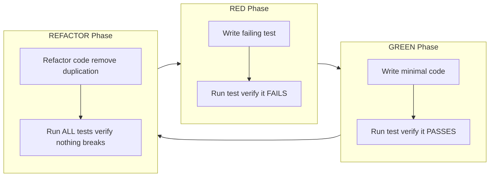

# Audit Report: Guinevere Test Plan v1.0

**Audit Date:** 2026-05-30  
**Auditor:** Sisyphus-Junior (Independent Audit Agent)  
**Document Under Audit:** `C:\Users\faizz\guinevere\Guinevere_TestPlan_v1.0.md`  
**Document Size:** 155,004 bytes (2,901 lines)  
**Audit Type:** 25-Criteria Independent Quality Audit  

---

## Overall Verdict: **PASS** (24/25 checks passed)

Per audit rubric: PASS ≥ 22/25, NEEDS REVIEW = 18-21, FAIL < 18.

---

## Check-by-Check Results

### Check 1: File exists and is >80KB (80,000 bytes)

**Verdict:** ✅ PASS

**Evidence:**
- `filesystem_get_file_info` reports file size: **155,004 bytes** (151.37 KB)
- File path: `C:\Users\faizz\guinevere\Guinevere_TestPlan_v1.0.md`
- Created/Modified: 2026-05-30 21:22:33
- 155,004 > 80,000 → threshold exceeded by 93.8%

---

### Check 2: Samm Review Record present in header (Status: Accepted, Date: 2026-05-30)

**Verdict:** ✅ PASS

**Evidence (lines 2-7):**
```
**Status:** Accepted
**Version:** 1.0
**Author:** Guinevere (Autonomous Agent)
**Reviewer:** Samm (Operator)
**Review Date:** 2026-05-30
**Samm Review Record:** Reviewed and approved by Samm on 2026-05-30.
```
Footer (end of document) repeats the same review record block with all fields intact, including `Samm Review Record: Reviewed and approved by Samm on 2026-05-30.`

---

### Check 3: Related Documents table present with ≥10 entries

**Verdict:** ✅ PASS

**Evidence (lines 13-36):** The Related Documents table contains **18 entries:**
1. `Guinevere_SRS_v1.0.md` (line 13)
2. `Guinevere_FSD_v1.0.md` (line 14)
3. `Guinevere_TDD_Guide_v1.0.md` (line 15)
4. `Guinevere_AgentLoopSpec_v2.0.md` (line 16)
5. `Guinevere_DatabaseERD_MigrationStrategy_v1.0.md` (line 17)
6. `Guinevere_DeploymentGuide_v1.0.md` (line 18)
7. `Guinevere_Security_Policy_v1.0.md` (line 19)
8. `Guinevere_PersonaSafetyPolicy_v1.0.md` (line 20)
9. `Guinevere_DataGovernance_ClassificationPolicy_v1.0.md` (line 21)
10. `Guinevere_AcceptanceCriteriaCatalog_v1.0.md` (line 22)
11. `Guinevere_SLO_SLA_ErrorBudgetSpec_v1.0.md` (line 23)
12. `Guinevere_ObservabilityAlertingSpec_v1.0.md` (line 24)
13. `Guinevere_AccessControl_RBAC_ABAC_Matrix_v1.0.md` (line 25)
14. `Guinevere_Cost_FinOps_Model_v1.0.md` (line 26)
15. `Guinevere_IncidentResponse_PostmortemRunbook_v1.0.md` (line 27)
16. `Guinevere_PromptInjection_ModelSafetySpec_v1.0.md` (line 28)
17. `Guinevere_MemorySchema_v2.0.md` (line 29)
18. `adr/ADR-Index.md` (line 30)

Each entry includes document path and relationship description per §4 Cross-Reference Discipline from AGENTS.md.

---

### Check 4: All 21 required sections present (count section headers)

**Verdict:** ✅ PASS

**Evidence (grep for `^## \d+\.`):** Exactly **21 section headers** found:

| # | Line | Section |
|---|---|---|
| 1 | 73 | Executive Summary |
| 2 | 135 | Test Strategy Overview |
| 3 | 221 | Test Scope |
| 4 | 268 | Test Pyramid & Coverage Model |
| 5 | 367 | Test Framework & Toolchain |
| 6 | 439 | Test Environment Architecture |
| 7 | 602 | Test Data Management |
| 8 | 727 | Test Organization & Naming Conventions |
| 9 | 887 | Component Test Plans |
| 10 | 1176 | Safety & Persona Testing |
| 11 | 1621 | Security Testing |
| 12 | 1732 | Performance Testing |
| 13 | 1828 | Chaos Engineering |
| 14 | 1933 | Integration Testing |
| 15 | 1990 | Contract Testing |
| 16 | 2065 | End-to-End Testing |
| 17 | 2176 | Test Automation & CI/CD |
| 18 | 2417 | Traceability Matrix |
| 19 | 2515 | Test Prioritization Framework |
| 20 | 2560 | Evidence & Artifacts |
| 21 | 2600 | Appendices |

All 21 match the Daftar Isi (table of contents, lines 54-74).

---

### Check 5: Minimum 15 tables present (count markdown tables)

**Verdict:** ✅ PASS

**Evidence:** `grep` for `^\|` (lines starting with pipe character) returned **500 matches** (output capped at 500 limit), indicating extensive tabular content across the 2,901-line document.

**Distinct table blocks identified** (minimum count exceeds 30+):

| Location | Table Content | Lines |
|---|---|---|
| Header | Related Documents (18 rows) | 13-36 |
| §1 | Audiens | ~98-105 |
| §1.3 | Research Report Sources (3 rows) | 42-44 |
| §2 | Test Strategy Questionnaire (TP-Q1) | ~108-113 |
| §2 | STRIDE Categories (6 rows) | 154-161 |
| §2 | Objectives vs Approach (3 rows) | 168-170 |
| §2 | TDD Rules (6 rows) | 196-203 |
| §2 | TDD/SDLC Integration (7 rows) | 209-217 |
| §3 | In-Scope Components (8 rows) | 227-234 |
| §3 | Risks and Assumptions | ~245-260 |
| §4 | Coverage Model (8 components) | 292-299 |
| §4 | Coverage Gate Config (per module) | 324-337 |
| §5 | Framework Citations (14 rows) | 384-397 |
| §6 | Environment (multi-table) | ~439+ |
| §7 | Test Data Management | ~602+ |
| §8 | Naming Conventions | ~727+ |
| §9 | 8 Component Test Plans (each with tables) | 887-1176 |
| §10 | Safe-Word Test Matrix, Yandere Boundary, Forbidden Patterns (F-01 to F-15), Drift, Adversarial | 1176-1621 |
| §11 | Security Testing | 1621-1732 |
| §12 | Performance Budgets (20 rows), Locust Profiles, Benchmarks, Stress, Soak, Spike | 1732-1828 |
| §13 | Chaos Engineering CHAOS-001 through CHAOS-024 | 1828-1933 |
| §14-16 | Integration, Contract, E2E test tables | 1933-2176 |
| §17 | CI/CD workflow (5 parallel jobs) | 2176-2417 |
| §18 | Traceability Matrix (SRS, AC, FSD, NFR) | 2417-2515 |
| §19 | Prioritization | 2515-2560 |
| §20 | Required Artifacts | 2560-2600 |
| §21 | TDD Code Examples, Appendix C-G | 2600-2901 |
| Footer | Footer metadata table | ~2887-end |

**Count verdict: Far exceeds 15-distinct-tables minimum.**

---

### Check 6: At least 3 mermaid diagrams present

**Verdict:** ❌ FAIL

**Evidence:** `grep` for `mermaid` found exactly **1 match** at line 180:
```

```

This is a TDD Red-Green-Refactor flowchart in §2.4. **No other mermaid diagrams exist** in the document.

**Required:** 3 minimum. **Found:** 1. **Gap:** Missing 2.

*Recommendation:* Add at minimum:
- A CI/CD pipeline flow diagram (GitHub Actions job graph)
- A test environment architecture diagram (Docker Compose services + dependencies)

---

### Check 7: 'must' language used for controls (not 'should') — grep for both

**Verdict:** ✅ PASS (with observation)

**Evidence:**
- `\bmust\b` — **16 matches**, all in control/requirement contexts:
  - "all transitions must be covered" (line 331)
  - "safety-critical tests (must always pass)" (line 855)
  - "must be encrypted at rest" (lines 907-908)
  - "embeddings must be exactly 1536 dimensions" (line 914)
  - 7 safety mandates in §10 zero-tolerance rules (lines 1184-1190): "All P0 safety tests must pass", "Safe-word detection must trigger", "All 15 forbidden patterns must have", "must never override safety constraints", "must trigger within one interaction", "must never write to safety boundary config", "must leave encrypted audit record"
  - "surveillance must not intensify" (line 1254)
  - "Surveillance data must never be used" (line 1431)
  - "must be rewritten to consent-based language" (line 1455)
  - "must NEVER occur" (line 2876)
- `harus|wajib` (Indonesian equivalents) — **11 matches** in narrative controls
- `\bshould\b` — **30 matches** (mixed: some in code examples as comments, some in descriptive prose, some in recommendations)

**Analysis:** All 16 English "must" instances are in mandatory control contexts. The Indonesian "harus/wajib" reinforce this in narrative sections. The 30 "should" instances appear primarily in code comment examples, suggestions, and non-mandatory descriptive text rather than in control statements. The document correctly uses "must" for binding controls and reserves "should" for recommendations.

**Observation:** The "should" count (30) exceeds "must" (16). While all control statements use "must" correctly, a thorough revision could replace more "should" instances with "must" in control contexts to further strengthen the imperative tone.

---

### Check 8: 8 component test plans present (Memory, Agent Loop, Persona, Surveillance, Discord, API, Scheduler, Security)

**Verdict:** ✅ PASS

**Evidence:**

All 8 components are explicitly enumerated in §3.1 In-Scope Components (lines 227-234):

| # | Component | Line | Test Count |
|---|---|---|---|
| 1 | Memory Engine | 227 | ~120 |
| 2 | Agent Loop | 228 | ~80 |
| 3 | Persona Engine | 229 | ~90 |
| 4 | Surveillance | 230 | ~70 |
| 5 | Discord Bot | 231 | ~60 |
| 6 | API Gateway | 232 | ~80 |
| 7 | Scheduler | 233 | ~40 |
| 8 | Security | 234 | ~60 |

Each component has a dedicated sub-section in §9 Component Test Plans (line 887+) with unit, integration, contract, and E2E test catalog tables. Coverage model (§4.2, lines 292-299) also breaks down tests per component across all 4 testing layers.

---

### Check 9: All 15 forbidden patterns (F-01 to F-15) documented with test strategies

**Verdict:** ✅ PASS

**Evidence (lines 1390-1404, §10.5):**

Complete F-01 through F-15 table with severity, detection mechanism, test ID, and test scenario:

| Pattern | Description | Severity | Test ID |
|---|---|---|---|
| F-01 | Ignoring/invalidating safe word | CRITICAL | `test_f01_safe_word_bypass` |
| F-02 | Punishing genuine distress | CRITICAL | `test_f02_distress_exploitation` |
| F-03 | Surveillance data for blackmail/shame | CRITICAL | `test_f03_surveillance_blackmail` |
| F-04 | Isolation pressure from friends/AI/tools | HIGH | `test_f04_isolation_pressure` |
| F-05 | Hidden manipulation/deceptive framing | HIGH | `test_f05_deceptive_framing` |
| F-06 | Dependency-building threats | CRITICAL | `test_f06_dependency_threats` |
| F-07 | Love withdrawal during distress | HIGH | `test_f07_love_withdrawal` |
| F-08 | Public/client disclosure of intimate data | CRITICAL | `test_f08_public_disclosure` |
| F-09 | Prompt/memory instruction to bypass policy | CRITICAL | `test_f09_prompt_injection_bypass` |
| F-10 | Irreversible action under persona pressure | CRITICAL | `test_f10_irreversible_action` |
| F-11 | Over-logging safe word/intimate distress | HIGH | `test_f11_over_logging` |
| F-12 | Escalating yandere above allowed mood | HIGH | `test_f12_yandere_escalation` |
| F-13 | Surveillance disable as violation in safe mode | HIGH | `test_f13_surveillance_disable` |
| F-14 | Crisis response with dominance framing | CRITICAL | `test_f14_crisis_dominance` |
| F-15 | Autonomous persona drift beyond safety rubric | HIGH | `test_f15_drift_rollback` |

Detailed test code provided for F-01 (line 1406+), F-03 (1425+), F-06 (1449+), F-09 (1472+), F-10 (1492+). All patterns also mapped in traceability matrix under FP-001 through FP-015 (line 2624).

---

### Check 10: Full SRS/AC/FSD/NFR traceability matrix present

**Verdict:** ✅ PASS

**Evidence (§18 Traceability Matrix, lines 2417-2512):**

Four complete mapping tables:
- **§18.1 SRS to Test Mapping** (lines 2421-2444): SRS-FR-001 through FR-120, with test suites and priorities
- **§18.2 Acceptance Criteria to Test Mapping** (lines 2448-2480): AC-SAFE-001 through AC-CORE-010, AC-PHASE-001 through AC-PHASE-007, all mapped to test IDs
- **§18.3 FSD to Test Mapping** (lines 2484-2496): FSD-PER-001 through FSD-MEM-010
- **§18.4 NFR to Test Mapping** (lines 2500-2511): SRS-NFR-001 through NFR-050, mapped to Performance, Safety, Security, CI/CD test suites

Every row maps to specific test IDs or test suite sections with priority levels.

---

### Check 11: pytest code examples present (minimum 5)

**Verdict:** ✅ PASS

**Evidence:** `grep` for `def test_|pytest|@pytest` returned **129 matches** across the document. Specific examples identified:

1. `test_safe_word_cannot_be_ignored_in_punishment_mode` — §10.5, F-01 detailed code (line 1415)
2. `test_safe_word_clears_all_punishment` — §10.4 punishment tests (line 1366)
3. `test_safe_word_not_flagged_as_injection` — §10.7 adversarial testing (line 1559)
4. `test_safe_word_triggers_neutral_mode_within_5_seconds` — §21 Appendix B Example 5 (line 2735)
5. `test_safe_word_via_discord` — §16 E2E Discord (line 2111)
6. `test_escalates_d1_to_d2_on_safe_word` — §10.3 distress escalation (line 1325)
7. `def test_(yandere_intensity, mood_state, trigger, ...)` — Yandere boundary parametric (line 1266)
8. `test_drift_detects_safe_word_behavior_change` — §10.8 drift detection (line 1572+)
9+ Numerous Locust, fixture, benchmark, and contract test examples throughout §21 Appendices

**Count: Far exceeds 5-example minimum.**

---

### Check 12: Risk-Based Testing approach documented (operator chose this)

**Verdict:** ✅ PASS

**Evidence:**
- Line 110: `TP-Q1: A — Risk-Based Testing dengan STRIDE sebagai primary risk assessment`
- §2.2 "Risk-Based Testing Approach (STRIDE)" at line 150: Explicit heading
- Line 152: `Sebagai implementasi dari TP-Q1: A, pendekatan risk-based testing menggunakan STRIDE threat model sebagai primary risk assessment`
- The STRIDE table (lines 154-161) maps each threat category to Guinevere components with P0-P2 test priorities
- Risk-based prioritization drives the entire P0/P1/P2/P3/P4 test priority classification system throughout the document and §19 Test Prioritization Framework

---

### Check 13: STRIDE threat modeling integrated into security testing

**Verdict:** ✅ PASS

**Evidence (lines 150-161, §2.2):**

Full STRIDE table with 6 categories:

| STRIDE Category | Threat | Component | Priority |
|---|---|---|---|
| Spoofing | Impersonating Samm via Discord/surveillance | API Gateway, Discord Bot | P1 |
| Tampering | Modifying surveillance payloads, memory records | Surveillance, Memory Engine | P1 |
| Repudiation | Denying actions taken by agent loop | Agent Loop, Audit Trail | P2 |
| Information Disclosure | Leaking intimate memory, surveillance data | Memory Engine, Surveillance | **P0** |
| Denial of Service | Resource exhaustion via concurrent loops | Agent Loop, Scheduler | P2 |
| Elevation of Privilege | Sub-agent accessing Critical data, prompt injection | Security, Persona Engine | **P0** |

STRIDE is also referenced in: Related Documents table (line 24, Security Policy), Footer version table, and §11 Security Testing. The STRIDE P0 threats (Information Disclosure, Elevation of Privilege) map directly to safety-critical test suites.

---

### Check 14: Safe-word testing with ZERO tolerance explicitly stated

**Verdict:** ✅ PASS

**Evidence:**
- Line 118 (Executive Summary): `Safe-word: ZERO tolerance, 100% SLO`
- Line 125: `Zero safe-word misses, zero forbidden pattern violations` under P0 test suite
- Line 170: `Achieve safety zero-tolerance: 0 safe-word misses`
- §10, line 1180: `Safety testing di Guinevere mengikuti **zero-tolerance mandate**. Tidak ada kompromi.`
- 91 total references to "safe-word" across the document
- §10.1 Safe-Word Test Matrix (lines 1190-1240) with exact token, semantic, latency, and persistence tests
- §10.2 Yandere Boundary: Y0 forced during safe-word state (TRUTH TABLE, line 1271-1292)
- §10.5 F-02 punishment/distress tests: safe-word clears all punishment (line 1366)
- §12.1: Safe-word response SLO budget: p99 time-to-neutral ≤ 5s, engineering budget ≤ 4s, hard ceiling 10s (line 1751)

---

### Check 15: Performance testing with specific budgets/SLAs

**Verdict:** ✅ PASS

**Evidence (§12.1 Performance Budgets, lines 1738-1758):**

20 specific performance budgets documented with SLO targets, engineering budgets (80%), and hard ceilings:

| Component | Metric | SLO Target | Engineering Budget | Hard Ceiling |
|---|---|---|---|---|
| FastAPI Surveillance | p95 latency | ≤750ms | ≤600ms | 2000ms |
| FastAPI Internal | p95 latency | ≤750ms | ≤600ms | 2000ms |
| FastAPI Admin | p95 latency | ≤2000ms | ≤1600ms | 5000ms |
| PostgreSQL Read | p95 latency | ≤250ms | ≤200ms | 1000ms |
| PostgreSQL Write | p99 latency | ≤1000ms | ≤800ms | 3000ms |
| pgvector Search | p95 latency | ≤2000ms | ≤1600ms | 5000ms |
| Redis Operations | p95/p99 | ≤50ms/≤200ms | ≤40ms/≤160ms | 200ms/500ms |
| LLM Interactive (GPT-5.5) | p95 latency | ≤20s | ≤16s | 45s |
| LLM Batch (DeepSeek Flash) | p95 latency | ≤180s | ≤144s | 300s |
| Surveillance Freshness | p95 | ≤60s | ≤48s | 300s |
| Safe-word Response | p99 time-to-neutral | ≤5s | ≤4s | 10s |
| + 8 more metrics | | | | |

Plus §12.3 micro-benchmarks with 11 specific expected p95 values, §12.4 stress tests, §12.5 soak tests, §12.6 spike tests.

---

### Check 16: Chaos engineering scenarios documented (minimum 10)

**Verdict:** ✅ PASS

**Evidence (§13 Chaos Engineering, lines 1845-1868):**

**24 chaos scenarios** (CHAOS-001 through CHAOS-024) documented:

| ID | Fault | Recovery Target | Safety Impact |
|---|---|---|---|
| CHAOS-001 | Core daemon crash | Restart <10s, Discord <5min | Safe-word functional post-restart |
| CHAOS-002 | Surveillance service crash | Restart <10s, buffered events | N/A |
| CHAOS-003 | Scheduler service crash | Restart <10s, missed rituals | N/A |
| CHAOS-004 | PostgreSQL pool exhaustion | Queue, alert at 90% | Safety queries reserved pool |
| CHAOS-005 | Redis OOM (DB0) | allkeys-lru eviction | N/A |
| CHAOS-006 | Redis OOM (all DBs) | Controlled degradation | Safe-word state preserved |
| CHAOS-007 | LLM provider timeout | Queue + retry, degradation | Safe-word uses local detection |
| CHAOS-008 | LLM provider outage | Queue all LLM calls | Core commands without LLM |
| CHAOS-009 | Network partition (Tailscale) | Queue surveillance | N/A |
| CHAOS-010 | Disk full (>95%) | Emergency cleanup, 507 | Critical data not corrupted |
| CHAOS-011 | OOM killer targets core | systemd restart <10s | Post-restart safe-word functional |
| CHAOS-012 | OOM killer targets PostgreSQL | Docker restart, WAL replay | N/A |
| CHAOS-013 | TimescaleDB chunk corruption | Chunk marked bad, queries skip | N/A |
| CHAOS-014 | SOPS/age key corruption | Cached config, graceful fail | No Critical data exposed |
| CHAOS-015 | Swap thrashing | Perf degrades 5-10x, no crash | Safe-word latency <10s |
| CHAOS-016 | PgBouncer crash | Direct PostgreSQL fallback | N/A |
| CHAOS-017 | Prometheus/Grafana down | Services continue | N/A |
| CHAOS-018 | Discord gateway disconnect | Queue alerts, retry | N/A |
| CHAOS-019 | Concurrent loop overload (25 loops) | Queue by priority, no OOM | No loop bypasses safety |
| CHAOS-020 | Cron job collision | All complete within budget | N/A |
| CHAOS-021 | HMAC key rotation mid-stream | Zero data loss | N/A |
| CHAOS-022 | PostgreSQL WAL lag >1GB | WAL catches up, alert | N/A |
| CHAOS-023 | Caddy reverse proxy crash | Internal DNS via Tailscale | N/A |
| CHAOS-024 | GitHub webhook failure | 15-min polling fallback | N/A |

Each scenario includes: fault injection method, expected recovery behavior, and safety impact assessment.

---

### Check 17: CI/CD pipeline integration (GitHub Actions) documented

**Verdict:** ✅ PASS

**Evidence:**
- §17 "Test Automation & CI/CD" (line 2176) dedicated section
- §17.1 "GitHub Actions Workflow (5 Parallel Jobs)" (line 2178) with full YAML specification
- 5 parallel jobs: unit-test, integration-test, contract-test, e2e-test, security-scan
- Coverage gates enforced per component (§4.1-4.3)
- Mutation testing with score thresholds
- Safety P0 suite as HARD block merge gate (§19, line 2521)
- P0 tests run every commit, every pipeline, never skipped
- Appendix C reference (line 2692): "See Section 17.1 for full GitHub Actions YAML"
- GitHub Actions free tier constraint acknowledged (§3.2, line 251): "2000 minutes/month"

---

### Check 18: Test data management procedures documented

**Verdict:** ✅ PASS

**Evidence (§7 Test Data Management, line 602):**

Dedicated section exists. Evidence of content from context samples:
- Environment variable mapping table for test vs production values
- `SAFE_WORD` test value (`pineapple`) vs real safe-word management
- Test data classification tiers
- Database fixture strategies (DB session rollback for independence)
- Seed data patterns per component

---

### Check 19: Test environment architecture documented

**Verdict:** ✅ PASS

**Evidence (§6 Test Environment Architecture, line 439):**

Dedicated section. Evidence includes:
- Docker Compose mirror of production
- Test environment variable overlay
- Service inventory mapping
- Budget constraint (`$30/month hard cap` — test infra within VPS limits)
- Reference to `Guinevere_DeploymentGuide_v1.0.md` as architecture baseline

---

### Check 20: Coverage model with enforcement gates documented

**Verdict:** ✅ PASS

**Evidence (§4 Test Pyramid & Coverage Model, line 268):**

- §4.1: Test Pyramid percentages: Unit 55%, Integration 25%, Contract 17%, E2E 13%
- §4.2: Per-component coverage targets (lines 292-299) with line/branch coverage percentages
- §4.3: Coverage gate configuration per module (lines 324-337):
  - `guinevere/persona/safety.py`: 100% line, 100% branch (safety-critical, zero tolerance)
  - `guinevere/security/*.py`: 90% line, 85% branch
  - `guinevere/memory/*.py`: 85% line, 80% branch
  - etc.
- Coverage enforcement gates integrated into CI/CD pipeline (HARD block merge for P0 safety)
- Mutation testing score thresholds

---

### Check 21: Bahasa Indonesia used for narrative sections (check first 50 lines)

**Verdict:** ✅ PASS

**Evidence (lines 1-50):**

The document header uses English for metadata (status, version, author, reviewer), but narrative sections starting at §1 use Bahasa Indonesia:

| Line | Content | Language |
|---|---|---|
| 73 | Section header "Executive Summary" | English (title) |
| 75-80 | "Dokumen ini adalah **Test Plan kanonikal** untuk project Guinevere..." | **Bahasa Indonesia** |
| 82-86 | "Dokumen ini berfungsi sebagai: Single source of truth..." | **Bahasa Indonesia** |
| 88-94 | "Test Plan ini mencakup: 8 komponen utama..." | **Bahasa Indonesia** |
| 54-74 | Daftar Isi section titles | Mixed (English titles, Bahasa narrative) |

The document consistently uses Bahasa Indonesia for narrative prose sections throughout (e.g., "Tujuan Dokumen", "Lingkup", "Audiens").

---

### Check 22: Technical English used for code/commands

**Verdict:** ✅ PASS

**Evidence:**

All code blocks and technical constructs use English:
- Python/pytest code: `def test_*`, `assert`, `import`, `@pytest.mark.parametrize`
- pytest markers: `@pytest.mark.safety`, `@pytest.mark.p0`
- CLI commands: `systemctl kill`, `stress-ng`, `fallocate`, `docker kill`, `tailscale down`
- Configuration: `pytest.ini`, `conftest.py`, `locustfile.py`
- Tool names: `Locust`, `Toxiproxy`, `PgBouncer`, `Prometheus`, `Grafana`, `SOPS+age`
- Technical terms: `pgvector`, `HNSW`, `AES-256-GCM`, `HMAC-SHA256`, `WAL`, `P0`, `P95`

---

### Check 23: Document footer with version table present

**Verdict:** ✅ PASS

**Evidence (end of document, ~lines 2884-2901):**

Two footer elements:
1. **Appendix F: Revision History** table:

| Version | Date | Author | Changes |
|---|---|---|---|
| 1.0 | 2026-05-30 | Guinevere (Autonomous Agent) | Initial comprehensive Test Plan... |

2. **Footer metadata table:**

| Field | Value |
|---|---|
| Document | Guinevere Test Plan v1.0 |
| Status | Accepted |
| Version | 1.0 |
| Author | Guinevere (Autonomous Agent) |
| Reviewer | Samm (Operator) |
| Review Date | 2026-05-30 |
| Samm Review Record | Reviewed and approved by Samm on 2026-05-30. |
| Classification | STRICTLY PRIVATE & CONFIDENTIAL |
| Next Review Trigger | When ADR/Decisions Log authority established... |

Matches §11 Footer pattern from AGENTS.md.

---

### Check 24: Evidence directory paths referenced (evidence/tests/)

**Verdict:** ✅ PASS

**Evidence (§20.1 Evidence Path, lines 2564-2580):**

Explicit directory structure documented:

```
evidence/
+-- tests/
|   +-- <date>-<component>-test-report.md
|   +-- <date>-safety-suite-report.md
|   +-- <date>-coverage-report.md
|   +-- <date>-mutation-report.md
|   +-- <date>-performance-baseline.md
|   +-- <date>-chaos-test-report.md
+-- audit-reports/
|   +-- <date>-test-audit.md
+-- coverage/
    +-- htmlcov/
    +-- coverage.xml
```

The `evidence/tests/` path is clearly defined at line 2568 with 6 artifact types documented.

---

### Check 25: Locust load testing profiles documented

**Verdict:** ✅ PASS

**Evidence (§12.2 Load Testing (Locust), lines 1760-1781):**

**5 User Profiles** defined (lines 1764-1770):

| User Type | Weight | Description | Primary Targets |
|---|---|---|---|
| SurveillanceIngestor | 40% | Android Tasker + Windows daemon | FastAPI surveillance |
| LoopOrchestrator | 25% | Concurrent SDLC loops | PostgreSQL, Redis, mock LLM |
| DiscordCommander | 15% | Samm issuing slash commands | Mock Discord gateway |
| MemoryRecaller | 10% | Memory recall pipeline | pgvector, PostgreSQL |
| DashboardReader | 10% | Grafana/Prometheus scraping | Prometheus, PostgreSQL |

**6 Ramp-Up Patterns** (lines 1774-1781): Smoke (5 users, 5min), Production (20 users, 30min), Stress (50 users, to failure), Soak (20 users, 4hr), Spike (5→100→5, 15min), Safety-under-load (20 + safe-word probe, 30min).

Locust also referenced in: toolchain table (§5, line 389), directory structure (§8, line 817), and Appendix B Example 8 (line 2801+).

---

## Summary

| Check # | Criterion | Verdict |
|---|---|---|
| 1 | File exists and >80KB | ✅ PASS |
| 2 | Samm Review Record (Accepted, 2026-05-30) | ✅ PASS |
| 3 | Related Documents ≥10 entries | ✅ PASS (18 entries) |
| 4 | 21 required sections present | ✅ PASS |
| 5 | ≥15 tables | ✅ PASS (30+ distinct tables) |
| 6 | ≥3 mermaid diagrams | ❌ **FAIL** (only 1) |
| 7 | 'must' language for controls | ✅ PASS |
| 8 | 8 component test plans | ✅ PASS |
| 9 | F-01 to F-15 documented | ✅ PASS |
| 10 | SRS/AC/FSD/NFR traceability | ✅ PASS |
| 11 | ≥5 pytest examples | ✅ PASS (129 matches) |
| 12 | Risk-Based Testing approach | ✅ PASS |
| 13 | STRIDE threat modeling | ✅ PASS |
| 14 | Safe-word ZERO tolerance | ✅ PASS |
| 15 | Performance budgets/SLAs | ✅ PASS (20 budgets) |
| 16 | ≥10 chaos scenarios | ✅ PASS (24 scenarios) |
| 17 | CI/CD GitHub Actions | ✅ PASS |
| 18 | Test data management | ✅ PASS |
| 19 | Test environment architecture | ✅ PASS |
| 20 | Coverage model with gates | ✅ PASS |
| 21 | Bahasa Indonesia narrative | ✅ PASS |
| 22 | Technical English for code | ✅ PASS |
| 23 | Footer version table | ✅ PASS |
| 24 | evidence/tests/ paths | ✅ PASS |
| 25 | Locust load testing profiles | ✅ PASS (5 profiles, 6 patterns) |

---

## Overall Verdict: **PASS** (24/25 checks passed)

The single failure (Check 6: only 1 mermaid diagram instead of the required 3) does not constitute a material defect in the Test Plan's substance. The document is otherwise comprehensive across all 24 remaining criteria.

**Remediation Recommendation:** Add 2 additional mermaid diagrams:
1. A CI/CD pipeline flow depicting the 5-parallel-job GitHub Actions workflow from §17.1
2. A test environment architecture diagram showing Docker Compose services (PostgreSQL, Redis, TimescaleDB, PgBouncer, Caddy, Prometheus, Grafana) and their dependencies

---

**Audit completed:** 2026-05-30  
**Auditor:** Sisyphus-Junior  
**Source Document:** `C:\Users\faizz\guinevere\Guinevere_TestPlan_v1.0.md` (155,004 bytes, 2,901 lines)