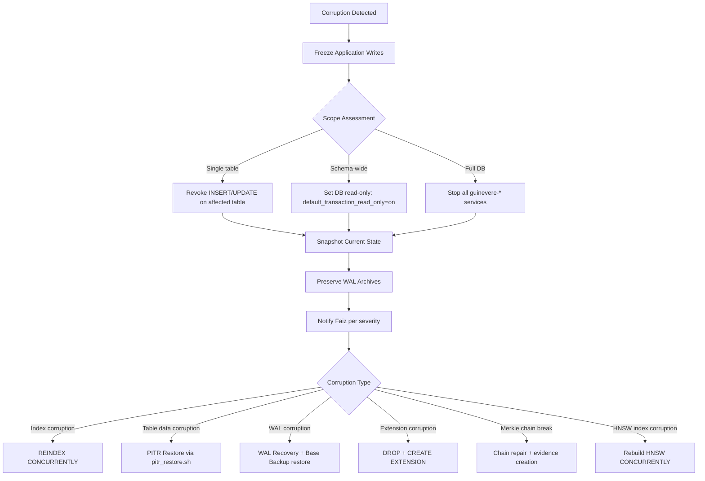
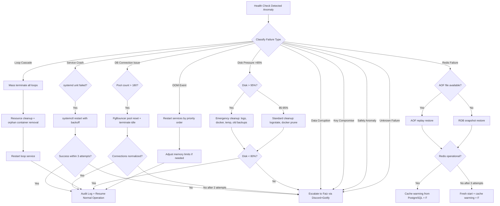

# Guinevere Disaster Recovery Plan v1.0

**Status:** Accepted  
**Version:** 1.0  
**Classification:** STRICTLY PRIVATE & CONFIDENTIAL  
**Author:** Guinevere (Autonomous Agent)  
**Reviewer:** Faiz (Operator)  
**Review Date:** 2026-05-30  
**Faiz Review Record:** Reviewed and approved by Faiz on 2026-05-30.  
**Document Owner:** Guinevere (with Faiz approval authority)  
**Review Cadence:** Quarterly (aligned with DR drill schedule)  
**Next Review Due:** 2026-08-30  

---

## Related Documents

| Document | Relationship |
|---|---|
| `Guinevere_SRS_v1.0.md` | Non-functional requirements for availability and recovery |
| `Guinevere_DatabaseERD_MigrationStrategy_v1.0.md` | 12 schemas, TimescaleDB hypertables, HNSW indexes, Merkle chain |
| `Guinevere_DeploymentGuide_v1.0.md` | Infrastructure reference, 17 services, backup timer |
| `Guinevere_Security_Policy_v1.0.md` | SOPS+age encryption, secrets management |
| `Guinevere_DataGovernance_ClassificationPolicy_v1.0.md` | Data classification, retention policies |
| `Guinevere_IncidentResponse_PostmortemRunbook_v1.0.md` | Incident classification, 10 runbooks |
| `Guinevere_ObservabilityAlertingSpec_v1.0.md` | Monitoring and alerting for DR events |
| `Guinevere_SLO_SLA_ErrorBudgetSpec_v1.0.md` | Availability SLOs, error budgets |
| `Guinevere_AccessControl_RBAC_ABAC_Matrix_v1.0.md` | Break-glass, backup-operator principal |
| `Guinevere_Cost_FinOps_Model_v1.0.md` | $30/month budget, DR cost constraints |
| `Guinevere_AgentLoopSpec_v2.0.md` | Loop state recovery, self-healing |
| `Guinevere_AcceptanceCriteriaCatalog_v1.0.md` | AC-OPS-003 RTO/RPO requirements |
| `Guinevere_EncryptionKeyManagement_v1.0.md` | Key backup and rotation |
| `Guinevere_SecretsRotationRunbook_v1.0.md` | Secret recovery procedures |
| `adr/ADR-025-backup-disaster-recovery-strategy.md` | ADR-025 Backup & DR Strategy |
| `adr/ADR-028-llm-router-outage-graceful-degradation.md` | 4-tier LLM failover chain |
| `adr/ADR-032-storage-provider-idcloudhost-r2.md` | Storage provider selection: idcloudhost S3 (primary) + Cloudflare R2 (secondary) |

> **Storage Provider Note (ADR-032):** All offsite backup storage uses **idcloudhost S3 (primary)** and **Cloudflare R2 (secondary)**. Backblaze B2 is **NOT** used in this architecture.

---

## Research Report Sources

| Report | Content Used |
|---|---|
| `research-reports/2026-05-30-dr-plan-backup-architecture-research.md` | Backup strategy, storage architecture, verification procedures |
| `research-reports/2026-05-30-dr-plan-recovery-procedures-research.md` | Recovery procedures, self-healing patterns, failure catalog |
| `research-reports/2026-05-30-dr-plan-cost-governance-research.md` | Cost analysis, testing schedule, governance framework |

---

## Table of Contents

1. [Executive Summary](#1-executive-summary)
2. [DR Strategy & Objectives](#2-dr-strategy--objectives)
3. [RTO/RPO Specifications](#3-rtorpo-specifications)
4. [Backup Architecture](#4-backup-architecture)
5. [Backup Storage Architecture](#5-backup-storage-architecture)
6. [Recovery Procedures](#6-recovery-procedures)
7. [Self-Healing Architecture](#7-self-healing-architecture)
8. [Backup Verification Procedures](#8-backup-verification-procedures)
9. [DR Testing Schedule & Calendar](#9-dr-testing-schedule--calendar)
10. [Cost Analysis](#10-cost-analysis)
11. [Communication During DR Events](#11-communication-during-dr-events)
12. [DR Governance](#12-dr-governance)
13. [Evidence & Artifacts](#13-evidence--artifacts)
14. [Appendices](#14-appendices)

---

## 1. Executive Summary

### 1.1 Tujuan Dokumen

Dokumen Disaster Recovery Plan (DR Plan) ini merupakan rencana pemulihan bencana yang komprehensif dan enterprise-grade untuk sistem Guinevere. Dokumen ini mendefinisikan strategi backup, prosedur pemulihan, arsitektur self-healing, jadwal testing, analisis biaya, dan governance framework yang diperlukan untuk menjamin keberlangsungan operasional sistem otonom Guinevere dalam menghadapi berbagai skenario kegagalan.

DR Plan ini berlaku sebagai canonical reference untuk semua keputusan terkait backup dan disaster recovery dalam ekosistem Guinevere, dan harus diikuti secara ketat oleh semua komponen sistem termasuk sub-agent otonom. Setiap deviasi dari prosedur yang didefinisikan dalam dokumen ini harus didokumentasikan sebagai evidence artifact dan direview oleh Faiz.

### 1.2 Ruang Lingkup

DR Plan ini mencakup seluruh aspek disaster recovery untuk ekosistem Guinevere:

- **Seluruh infrastruktur Guinevere**: Single VPS hostdata.id (4C/16GB/120GB, Ubuntu 24.04) dengan 17+ systemd services dan Docker containers yang berjalan 24/7.
- **Seluruh data layer**: 12 PostgreSQL schemas (memory, persona, surveillance, financial, audit, projects, ops, communication, safety, integration, config, notification), 3 TimescaleDB hypertables dengan chunk-based compression, pgvector HNSW indexes untuk semantic search, Merkle audit chain untuk tamper-proof logging, Redis (6 database: task queue, LLM cache, surveillance buffer, sessions/working memory, pub/sub, rate limiting), evidence artifacts, dan SOPS+age encrypted secrets.
- **Seluruh failure scenarios**: 9 skenario utama mulai dari full VPS loss, PostgreSQL corruption, Redis data loss, SOPS/age key compromise, memory/persona state corruption, SDLC loop cascade failure, network isolation, disk full/OOM killer, hingga external API key expiry.
- **Self-healing capabilities**: Autonomous recovery untuk 6 kategori kegagalan (service restart, DB connection pool, Redis recovery, loop cleanup, log rotation, disk pressure) dengan escalation boundaries yang jelas dan audit trail.
- **DR testing regimen**: Quarterly full drills dengan duration target 4 jam, monthly partial drills yang merotasi komponen, dan annual tabletop exercises.
- **Cost governance**: DR budget ketat maksimal $3/bulan dalam $30/bulan hard cap (per `Guinevere_Cost_FinOps_Model_v1.0.md` section 4.1), dengan projected annual cost $18.76 (average $1.56/bulan).

### 1.3 Filosofi Disaster Recovery

Guinevere mengadopsi filosofi DR yang unik karena posisinya sebagai autonomous AI agent yang berjalan di single-VPS architecture. Filosofi ini diadaptasi dari Google SRE Workbook, AWS Well-Architected Framework Reliability Pillar, dan Azure Disaster Recovery patterns, disesuaikan dengan constraint dan capability khusus Guinevere:

| Prinsip | Implementasi Guinevere |
|---|---|
| **Backup before deploy** | Backup window 02:00 WIB selalu mendahului self-deploy window 03:00 WIB. Tidak ada deployment yang boleh terjadi tanpa backup yang terverifikasi. |
| **Encryption before upload** | Tidak ada plaintext backup yang meninggalkan VPS. Semua backup di-age-encrypt sebelum di-upload ke idcloudhost S3 (primary) dan Cloudflare R2 (secondary), menggunakan backup-specific key yang terpisah dari runtime data keys. |
| **Safety invariants not budget-constrained** | Safe-word enforcement, persona safety boundaries, distress handling, dan encryption integrity tidak pernah dikompromikan demi penghematan biaya. Item-item ini memiliki zero budget constraint. |
| **Verification over trust** | Daily checksum verification, weekly partial restore test, monthly full DR drill. Tidak ada backup yang dianggap valid tanpa verifikasi independen. |
| **Autonomous where safe** | Guinevere boleh melakukan recovery secara otonom dalam boundaries yang terdefinisi (6 failure categories). Eskalasi ke Faiz untuk keputusan yang melibatkan data loss, key compromise, atau safety system anomaly. |
| **Evidence preservation** | Semua recovery action harus menghasilkan evidence artifact di path terstruktur: `evidence/dr-drills/YYYY-MM/` untuk drills, `evidence/incidents/YYYY-MM-DD-SEV-slug/` untuk incidents. |
| **Classification drives encryption** | Data Critical mendapat double encryption dalam backup. Mixed-category backup menggunakan classification tertinggi (per `Guinevere_DataGovernance_ClassificationPolicy_v1.0.md` section 4.2). |
| **Restore reconciliation mandatory** | Delete/do-not-recall ledger harus di-replay saat restore untuk memastikan GDPR/PDP compliance. Data yang telah dihapus tidak boleh muncul kembali setelah restore. |

### 1.4 Single-VPS Constraint Acknowledgment

Guinevere beroperasi pada arsitektur single-VPS tanpa hot standby, active-active replication, atau multi-region deployment. Constraint ini dipilih secara sadar karena $30/bulan hard cap budget (per `Guinevere_Cost_FinOps_Model_v1.0.md` section 4.1) dan dijustifikasi melalui ADR-025 (`adr/ADR-025-backup-disaster-recovery-strategy.md`). Implikasi DR dari constraint ini:

| Implikasi | Mitigasi yang Diterapkan |
|---|---|
| Tidak ada failover otomatis ke secondary node | Backup restore capability yang cepat dan terverifikasi dengan quarterly full drills |
| Total VPS loss berarti total outage | RTO 4 jam untuk full stack recovery pada VPS baru, dengan runbook provisioning yang lengkap |
| Recovery selalu melibatkan provisioning baru atau restore di VPS yang sama | Step-by-step runbook untuk new VPS provisioning (section 6.1, Phase 1-7) |
| Tidak ada real-time replication | WAL continuous archiving dengan RPO < 5 menit dan archive_timeout=900s sebagai kompensasi |
| Backup offsite adalah satu-satunya DR layer | idcloudhost S3 + Cloudflare R2 dengan age encryption, retention policy 7d/4w/6m/2y, dan daily checksum verification |

**Risk Acceptance Statement:** Risiko single-VPS diterima secara sadar oleh operator (Faiz) dengan understanding bahwa maximum data loss adalah 5 menit (WAL RPO) dan maximum downtime adalah 4 jam (full stack RTO). Quarterly DR drills memvalidasi bahwa target-target ini achievable.

### 1.5 Authority dan Approval

Dokumen ini disetujui melalui ADR-025 (`adr/ADR-025-backup-disaster-recovery-strategy.md`) yang merupakan CRITICAL-risk ADR dalam ADR Index (`adr/ADR-Index.md`). Perubahan substansial pada DR Plan ini harus melalui proses change management:

1. Proposal perubahan dengan justifikasi teknis dan impact analysis
2. Cost impact analysis terhadap $3/bulan DR budget
3. Review oleh Faiz sebagai DR Coordinator
4. Update ADR terkait jika perubahan mempengaruhi keputusan arsitektural
5. Documentasi perubahan di Revision History (Appendix I)
6. Verification bahwa perubahan tidak melanggar safety invariants

---

## 2. DR Strategy & Objectives

### 2.1 Design Principles

Strategi DR Guinevere dibangun di atas 10 design principles yang ketat. Setiap prinsip memiliki source document yang authoritative dan implication yang jelas terhadap implementasi:

| # | Principle | Source Document | Implementation Implication |
|---|---|---|---|
| 1 | Backup before deploy | Deployment Guide section 3.5 (backup 02:00, deploy 03:00) | Daily backup window selalu mendahului self-deploy. Jika backup gagal, deploy ditunda. |
| 2 | Encryption before upload | DataGov section 8.1, EncryptionKeyMgmt section 5.2 (backup KEK) | Tidak ada plaintext backup yang meninggalkan VPS. Semua file di-age-encrypt sebelum staging. |
| 3 | Classification drives encryption tier | DataGov section 4.1 (5 tiers), EncryptionKeyMgmt section 8 | Data Critical mendapat double encryption. Backup age key terpisah dari runtime data keys. |
| 4 | Highest classification wins | DataGov section 4.2 | Mixed-category backup menggunakan classification tertinggi dalam batch. |
| 5 | Restore reconciliation mandatory | DataGov section 6.4 | Delete/do-not-recall ledger harus di-replay saat restore. Suppressed data tidak boleh kembali. |
| 6 | Backup key isolation | EncryptionKeyMgmt section 5.2 (backup KEK domain) | Backup keys diturunkan dari backup domain KEK, tidak pernah bercampur dengan runtime keys. |
| 7 | No plaintext secrets in backup logs | SecurityPolicy section 3, ObservabilitySpec section 5 | Audit trail untuk backup operations tidak pernah mengandung keys, tokens, atau credentials. |
| 8 | Operational affordability | Cost/FinOps section 4.1 (dollar 2-3 S3 allocation) | Semua rekomendasi biaya harus fit dalam $3/bulan. Cost projection di-review quarterly. |
| 9 | Verification over trust | ADR-025, DR Questionnaire Q61-68 | Daily checksums, weekly restore test, monthly full drill. Backup tanpa verifikasi dianggap tidak ada. |
| 10 | Safety invariants not budget-constrained | Cost/FinOps section 4.2 (zero budget items) | Safe-word, encryption, integrity, distress handling — tidak ada tradeoff dengan biaya. |

### 2.2 Single-VPS Risk Acknowledgment

**Risk Statement:** Guinevere berjalan pada single VPS di hostdata.id tanpa redundancy layer apapun. Kegagalan hardware, network isolation, atau provider-level outage akan menyebabkan total service disruption. Recovery bergantung pada kemampuan untuk memprovision VPS baru dan memulihkan dari backup offsite di idcloudhost S3 (primary) dan Cloudflare R2 (secondary).

**Risk Acceptance:** Risiko ini diterima secara sadar oleh operator (Faiz) dengan mitigasi komprehensif:

| Mitigation Strategy | Effectiveness Rating | Residual Risk |
|---|---|---|
| Daily encrypted backup ke idcloudhost S3 + Cloudflare R2 | HIGH — data loss limited to max 5 minutes (WAL RPO) | 5 menit data loss maximum |
| WAL continuous archiving dengan archive_timeout=900s | HIGH — PITR capability for 7 days | WAL segments antara archive_timeout intervals |
| age encryption offsite storage | HIGH — backup confidentiality guaranteed | Key compromise scenario (mitigated by key escrow + passphrase backup) |
| Comprehensive runbook for new VPS provisioning | MEDIUM — 4-hour RTO achievable | Human execution time variance |
| Quarterly full DR drills + monthly partial drills | HIGH — validated recovery capability | Drill may not catch all novel edge cases |
| Self-healing for 6 failure categories | HIGH — autonomous recovery for common failures | Novel failure modes require human intervention |
| Retention policy 7d/4w/6m/2y | HIGH — multiple recovery points available | Permanent data loss only if all retention tiers corrupted |

### 2.3 Autonomous Recovery Capability

Guinevere, sebagai autonomous AI agent, memiliki kemampuan unik untuk melakukan self-healing tanpa intervensi operator. Capability ini dibatasi oleh safety boundaries yang ketat dan harus selalu menghasilkan audit trail.

**Autonomous Recovery Scope (dalam boundaries):**

| Failure Category | Autonomous Action | Attempt Limit | Escalation Trigger |
|---|---|---|---|
| Service crash (systemd unit) | `systemctl restart <unit>` dengan exponential backoff | Unlimited (5s, 15s, 45s backoff) | 3 failures dalam 10 menit |
| DB connection pool exhaustion | PgBouncer pool reset + service restart | 2 attempts | Connection count > 180 setelah reset |
| Redis failure | AOF replay, then RDB restore, then cache warming | 3 attempts | Data loss > 1 jam |
| SDLC loop cascade | Mass terminate + resource cleanup + respawn | 1 attempt | Any loop respawn failure |
| Disk pressure (>85%) | Log rotation, temp purge, old backup cleanup | 2 attempts | Disk > 95% setelah cleanup |
| OOM killer event | Service prioritization + restart by priority | 2 attempts | Repeated OOM dalam 30 menit |

**Hard Escalation Boundaries (must ALWAYS escalate to Faiz — no exceptions):**

- PostgreSQL data corruption detected (checksums, pg_amcheck, query errors)
- age/SOPS key compromise suspected (unusual decrypt patterns, provider abuse alerts)
- Safety system anomaly (safe-word response failure, persona drift > threshold, distress handling failure)
- Full VPS unreachable (UptimeRobot confirms, Tailscale peer offline > 10 min)
- Network isolation > 15 menit (Tailscale + Cloudflare both down)
- Any recovery action yang berpotensi menyebabkan data loss
- Financial data integrity concerns (transaction mismatch, 7-year archive corruption)
- Audit trail (Merkle chain) breakage detected
- Unknown failure mode tanpa predefined recovery procedure

### 2.4 DR Declaration Authority

| Role | Responsibility | Actor | Scope |
|---|---|---|---|
| DR Coordinator | Approval untuk full recovery, DR drill declaration, budget approval | Faiz | Strategic decisions |
| DR Executor | Autonomous P0 containment, backup retry, cache warming, self-healing | Guinevere | Tactical execution |
| DR Auditor | Verification of recovery completeness, evidence validation, scorecard | Guinevere (Oracle sub-agent) | Quality assurance |
| DR Communicator | Status updates via Discord/Gotify/Email per cadence | Guinevere | Stakeholder communication |

**DR Declaration Triggers by Severity:**

| Severity | Auto-Declare DR | Notification Channel | Response Time |
|---|---|---|---|
| SEV0 (Data Loss/Safety Breach) | Yes — containment only, escalate immediately | Discord + Gotify + SMS | Immediate |
| SEV1 (Service Degraded > 50%) | Yes — autonomous recovery attempt | Discord + Gotify | < 5 min |
| SEV2 (Component Failure) | Yes — self-healing attempt | Discord per cadence | < 15 min |
| SEV3 (Minor Anomaly) | No — standard incident handling | Discord daily summary | < 1 hour |
| SEV4 (Informational) | No — log and monitor | Weekly summary | < 24 hours |

---

## 3. RTO/RPO Specifications

### 3.1 Detailed RTO/RPO Matrix

Tabel berikut mendefinisikan Recovery Time Objective (RTO) dan Recovery Point Objective (RPO) untuk setiap service dan data component dalam ekosistem Guinevere. Semua target ini harus dipenuhi oleh prosedur yang didefinisikan dalam dokumen ini. Target-target ini diturunkan dari `Guinevere_AcceptanceCriteriaCatalog_v1.0.md` (AC-OPS-003: RTO <= 4h, RPO <= 24h) dan diperketat berdasarkan analisis risiko per service.

| # | Service / Data Component | RPO | RTO | Recovery Method | Verification Method | Source |
|---|---|---|---|---|---|---|
| 1 | PostgreSQL (all 12 schemas) | < 5 min (WAL continuous) | 15 min (WAL replay + dump restore) | PITR or pg_dump restore | Weekly test restore to isolated DB | DR-Q13, Q14, ADR-025 |
| 2 | memory.episodes (TimescaleDB hypertable) | < 5 min (WAL) | 15 min (included in PG RTO) | WAL replay + chunk backup | Row count + embedding dimension integrity | DR-Q28 |
| 3 | surveillance.events (TimescaleDB hypertable) | < 5 min (WAL) | 15 min (included in PG RTO) | WAL replay + chunk backup | Chunk-level verification, 180-day retention check | DR-Q28, Q46 |
| 4 | financial.transactions (TimescaleDB hypertable) | < 5 min (WAL) | 15 min (included in PG RTO) | WAL replay + daily dump | 7-year retention verification | DR-Q28, Q47 |
| 5 | audit.audit_trail (Merkle chain) | < 5 min (WAL) | 15 min (included in PG RTO) | WAL replay + daily dump | Merkle chain hash continuity verified post-restore | DR-Q29, Q43 |
| 6 | Redis (DB0-DB5: task queue, LLM cache, surveillance buffer, sessions/working memory, pub/sub, rate limiting) | < 1 sec (AOF everysec) | 5 min (RDB + AOF restore) | AOF replay or RDB restore | Cache hit rate normalization, DBSIZE comparison | DR-Q15, Q16 |
| 7 | Redis (cache warming fallback) | N/A (reconstructible from PostgreSQL) | 15-30 min (cache warming) | Start empty + PostgreSQL repopulate | Key count reaches baseline within 30 min | DR-Q35 |
| 8 | guinevere-core (FastAPI + agent loop) | N/A (stateless) | 5 min (systemd auto-restart) | systemctl restart | Health endpoint probe /health returns 200 | DR-Q17 |
| 9 | Full VPS loss (all 17+ services) | Per data RPO above | 4 hours total | New VPS + full restore from idcloudhost S3 / R2 | Full stack verification checklist (37 items) | DR-Q18, AC-OPS-003 |
| 10 | Evidence artifacts (evidence/ directory) | < 6 hours (rsync to S3/R2 every 6h) | 30 min (restore from S3/R2) | Download + decrypt from S3/R2 | Artifact hash verification against manifest | DR-Q19, Q42 |
| 11 | Agent loop state (SDLC projects schema) | < 15 min (PG phase transition) | 15 min (included in PG RTO) | PostgreSQL restore | Loop state checkpoint integrity, evidence_artifacts references valid | DR-Q20 |
| 12 | Observability stack (Prometheus/Grafana/Loki) | < 24 hours | 30 min (Docker Compose + config) | Docker Compose redeploy | Alert rule verification, dashboard data flow | DR-Q21 |
| 13 | Surveillance ingestion pipeline | < 5 min (Redis DB2 buffer) | 10 min (API restart + queue drain) | Service restart + buffer replay | Event backpressure normalization, ingestion lag < 1 min | DR-Q22 |
| 14 | SOPS+age secrets (.env.sops files) | Real-time (Git-tracked encrypted) | 5 min (re-encrypt + redeploy) | Git clone + SOPS decrypt | All .env.sops files decrypt successfully | DR-Q36 |
| 15 | Persona state / mood FSM (persona schema) | < 5 min (WAL) | 15 min (included in PG RTO) | PostgreSQL PITR | Mood state + yandere level + drift score verification | DR-Q44 |
| 16 | Discord bot (guinevere-discord service) | N/A (stateless) | 10 min (restart + gateway connect) | systemctl restart | Gateway READY event received, command response test | DR-Q17 |
| 17 | WhatsApp bridge (guinevere-whatsapp service) | N/A (stateless) | 10 min (restart + session restore) | systemctl restart | Session persistence verified, message send/receive test | DR-Q17 |
| 18 | Financial 7-year archive (cold storage) | Monthly archive cycle | 2 hours (cold storage retrieval) | Download from S3/R2 monthly/ | Regulatory compliance check, record count | DR-Q47 |
| 19 | Cloudflare Tunnel | N/A | 10 min (tunnel restart + re-auth) | cloudflared restart | Tunnel health endpoint returns 200 | Infrastructure |
| 20 | Caddy reverse proxy | N/A | 1 min (systemd restart) | systemctl restart | HTTPS endpoint probe returns valid certificate | Infrastructure |

### 3.2 Recovery Priority Order

Ketika multiple systems down secara simultan (misalnya setelah full VPS restore), pemulihan harus mengikuti strict priority order berikut. Order ini berdasarkan safety-first principle dan dependency chain analysis:

| Priority | System Category | Rationale | RTO Target | Dependencies |
|---:|---|---|---:|---|
| 1 | Safety systems (persona.safety_config, safe-word enforcement, distress handling) | Jika safety compromised, tidak ada yang lain yang matter. Guinevere tidak boleh beroperasi tanpa safety boundaries. | Immediate | PostgreSQL |
| 2 | Database (PostgreSQL 16 + extensions) | Semua persistent state tersimpan di PG: memory, persona, projects, audit, financial. Tidak ada service lain yang berfungsi tanpa DB. | 15 min | Docker |
| 3 | Core agent (guinevere-core FastAPI service) | The brain. Tidak bisa orchestrate recovery sistem lain tanpa core running. Agent loop dan decision-making bergantung pada core. | 5 min | PostgreSQL, Redis |
| 4 | Communication channels (Discord bot, WhatsApp bridge) | Faiz's primary interface. Tanpa comms, Faiz tidak bisa memberi command atau menerima status update dari Guinevere. | 10 min | Core, PostgreSQL |
| 5 | Surveillance (Android/Windows sync receivers) | Continuous data collection. Data loss tolerable untuk periode pendek; Redis DB2 buffer menampung data sementara. | 10 min | Core, PostgreSQL, Redis |
| 6 | SDLC loops (guinevere-loops service) | Autonomous coding loops. Bisa di-pause dan resume tanpa data loss. State tersimpan di projects.loop_instances. | 15 min | Core, PostgreSQL |
| 7 | Observability (Prometheus, Grafana, Loki) | Monitoring gaps tolerable untuk jam tapi bukan hari. Tanpa monitoring, DR events berikutnya mungkin tidak terdeteksi. | 30 min | Docker |
| 8 | Scheduler/proactive (guinevere-scheduler, guinevere-proactive) | Background tasks dan proactive suggestions. Bisa di-delay tanpa impact signifikan. | 30 min | Core, PostgreSQL |

### 3.3 RTO/RPO Compliance Tracking

Compliance terhadap RTO/RPO targets diukur melalui mekanisme berikut dan dilaporkan dalam monthly SLO scorecard (`evidence/scorecards/YYYY-MM-scorecard.md`):

| Metric | Measurement Method | Target | Alert Threshold | Evidence Path |
|---|---|---|---|---|
| Backup freshness | `guinevere_backup_last_success_timestamp_seconds` Prometheus metric | < 25 hours since last successful backup | > 25h triggers SEV2 alert | Prometheus/Grafana |
| Restore time (actual) | DR drill timer dari declaration sampai verification complete | <= RTO target per service | > RTO target = drill finding | `evidence/dr-drills/` |
| Data loss (actual) | WAL gap analysis selama restore, compare row counts | <= RPO target per service | > RPO target = SEV1 investigation | `evidence/dr-drills/` |
| Backup success rate | `guinevere_backup_success_total / guinevere_backup_attempts_total` | >= 99.5% | < 99% triggers review | Monthly scorecard |
| RTO compliance (rolling) | Percentage of drills meeting RTO target in last 4 quarters | >= 90% | < 90% triggers procedure review | Quarterly review |
| RPO compliance (rolling) | Percentage of restores meeting RPO target | >= 95% | < 95% triggers architecture review | Quarterly review |

---

## 4. Backup Architecture

### 4.1 Architecture Overview

Arsitektur backup Guinevere menggunakan pendekatan hybrid yang menggabungkan continuous WAL archiving untuk point-in-time recovery (PITR), daily logical dumps untuk baseline restore yang cepat, Redis dual-persistence (RDB + AOF) untuk cache recovery, dan age-encrypted offsite storage ke idcloudhost S3 (primary) dan Cloudflare R2 (secondary) dengan retention policy multi-tier.

Semua backup mengikuti prinsip encryption-before-upload: tidak ada plaintext data yang meninggalkan VPS. Setiap file backup melalui pipeline: source -> compress (zstd/gzip) -> age-encrypt -> stage locally -> upload to idcloudhost S3 + Cloudflare R2 -> verify checksum.

`mermaid
graph TB
    subgraph VPS["Guinevere VPS -- hostdata.id 4C/16GB/120GB"]
        PG["PostgreSQL 16<br/>+ pgvector + TimescaleDB<br/>12 schemas"]
        REDIS["Redis 7<br/>RDB + AOF<br/>maxmemory 1GB"]
        SOPS["SOPS + age<br/>.env.sops<br/>per-service secrets"]
        EVID["evidence/<br/>markdown artifacts"]
        LOOP["agent loop state<br/>projects schema"]
        
        WAL["WAL Archive<br/>/var/lib/postgresql/wal_archive/"]
        DUMP["pg_dump -Fc<br/>/home/guinevere/data/backups/"]
        RDB_SNAP["RDB Snapshot<br/>/data/dump.rdb"]
        AOF_LOG["AOF Log<br/>/data/appendonly.aof"]
        
        STAGE["Local Staging<br/>age-encrypted<br/>/home/guinevere/data/backups/staging/"]
    end

    subgraph S3["idcloudhost S3 -- Primary Storage"]
        direction TB
        S3_BUCKET["guinevere-dr-backups"]
        S3_DAILY["daily/"]
        S3_WEEKLY["weekly/"]
        S3_MONTHLY["monthly/"]
        S3_YEARLY["yearly/"]
        S3_AGE["age-keys/"]
        S3_EVID["evidence/"]
        S3_AUDIT["audit/"]
    end

    subgraph R2["Cloudflare R2 -- Secondary Storage"]
        direction TB
        R2_BUCKET["guinevere-dr-backups"]
        R2_DAILY["daily/"]
        R2_WEEKLY["weekly/"]
        R2_MONTHLY["monthly/"]
        R2_YEARLY["yearly/"]
        R2_AGE["age-keys/"]
        R2_EVID["evidence/"]
        R2_AUDIT["audit/"]
    end

    PG -->|"archive_command continuous"| WAL
    PG -->|"pg_dump -Fc -j4 daily 02:00 WIB"| DUMP
    REDIS -->|"save 900 1"| RDB_SNAP
    REDIS -->|"appendfsync everysec"| AOF_LOG
    LOOP -->|"included in pg_dump"| DUMP
    
    WAL -->|"zstd compress + age-encrypt"| STAGE
    DUMP -->|"age-encrypt"| STAGE
    RDB_SNAP -->|"zstd + age-encrypt"| STAGE
    AOF_LOG -->|"zstd + age-encrypt"| STAGE
    SOPS -->|"Git + age-key backup"| STAGE
    EVID -->|"rsync every 6h + age-encrypt"| STAGE
    
    STAGE -->|"rclone upload (primary)"| S3_BUCKET
    STAGE -->|"rclone mirror (secondary)"| R2_BUCKET
    S3_BUCKET --> S3_DAILY
    S3_BUCKET --> S3_WEEKLY
    S3_BUCKET --> S3_MONTHLY
    S3_BUCKET --> S3_YEARLY
    S3_BUCKET --> S3_AGE
    S3_BUCKET --> S3_EVID
    S3_BUCKET --> S3_AUDIT
    R2_BUCKET --> R2_DAILY
    R2_BUCKET --> R2_WEEKLY
    R2_BUCKET --> R2_MONTHLY
    R2_BUCKET --> R2_YEARLY
    R2_BUCKET --> R2_AGE
    R2_BUCKET --> R2_EVID
    R2_BUCKET --> R2_AUDIT

    PROM["Prometheus"]
    PROM -->|"guinevere_backup_* metrics"| GRAFANA["Grafana Dashboard"]
    GRAFANA -->|"backup_age > 25h"| DISCORD["Discord Alert to Faiz"]
`

**Data Flow Description:**

1. **PostgreSQL WAL**: Continuous streaming via `archive_command` ke local staging directory dengan `archive_timeout=900s` (15 menit forced segments). Setiap WAL segment di-compress dengan zstd level 19, di-age-encrypt, lalu di-upload async ke idcloudhost S3 (primary) dan R2 (secondary).
2. **pg_dump**: Daily 02:00 WIB via systemd timer `guinevere-backup.service`, custom format (`-Fc`), parallel (`-j 4`), compressed (`--compress=9`). Excludes large TimescaleDB hypertable data yang di-backup terpisah.
3. **Redis RDB**: Automatic snapshots berdasarkan `save 900 1` (at least 1 write in 900s), `save 300 100`, dan `save 60 10000` (burst protection).
4. **Redis AOF**: Continuous append dengan `appendfsync everysec` dan `aof-use-rdb-preamble yes` (Redis 4.0+ hybrid format).
5. **Local Staging**: Semua backup files di-compress dan age-encrypted sebelum staging di `/home/guinevere/data/backups/staging/`.
6. **Offsite Upload**: `rclone` ke idcloudhost S3 (primary) dan Cloudflare R2 (secondary) bucket, terorganisir oleh retention tier (daily/weekly/monthly/yearly).
7. **Verification**: Daily checksum verification (04:00 WIB), weekly partial restore test, monthly full DR drill.

### 4.2 PostgreSQL Backup

#### 4.2.1 WAL Continuous Archiving Configuration

WAL (Write-Ahead Log) continuous archiving adalah fondasi utama untuk point-in-time recovery (PITR) dengan RPO < 5 menit. Setiap transaksi yang di-commit ke PostgreSQL dicatat di WAL segment sebelum ditulis ke data files, memungkinkan replay ke titik waktu manapun dalam 7 hari terakhir (local WAL retention).

**postgresql.conf WAL Settings:**

`ini
# WAL Archiving for PITR -- Guinevere DR Plan section 4.2.1
# These settings must be applied via Docker Compose command flags or config file

wal_level = replica                    # Required for WAL archiving
archive_mode = on                      # Enable WAL archiving
archive_command = '/home/guinevere/scripts/archive_wal.sh %p %f'
archive_timeout = 900                  # Force WAL segment every 15 min (RPO guarantee)
max_wal_senders = 2                    # Allow WAL sender processes
wal_keep_size = 2GB                    # Keep 2GB WAL locally for replication

# WAL size tuning for Guinevere write patterns
max_wal_size = 2GB                     # Maximum WAL before forced checkpoint
min_wal_size = 512MB                   # Minimum WAL to retain
wal_buffers = 64MB                     # WAL buffer size in shared memory
checkpoint_completion_target = 0.9     # Spread checkpoint over 90% of interval

# Logging for DR diagnostics
log_checkpoints = on                   # Log checkpoint activity
log_line_prefix = '%t [%p]: [%l-1] user=%u,db=%d,app=%a,client=%h '
log_min_duration_statement = 1000      # Log slow queries (>1s)
jit = off                              # Disable JIT for predictable performance
`

**pg_hba.conf Relevant Entries:**

`ini
# TYPE  DATABASE        USER            ADDRESS                 METHOD
local   all             postgres                                peer
local   all             all                                     peer
host    all             all             127.0.0.1/32            scram-sha-256
host    all             all             172.16.0.0/12           scram-sha-256
# Replication connections for WAL archiving
local   replication     all                                     peer
host    replication     all             127.0.0.1/32            scram-sha-256
`

**Docker Compose Integration:**

`yaml
postgresql:
  image: timescale/timescaledb:latest-pg16
  command: >
    postgres
    -c shared_buffers=2GB
    -c effective_cache_size=6GB
    -c work_mem=64MB
    -c maintenance_work_mem=512MB
    -c max_connections=200
    -c wal_level=replica
    -c archive_mode=on
    -c "archive_command=/home/guinevere/scripts/archive_wal.sh %p %f"
    -c archive_timeout=900
    -c max_wal_senders=2
    -c wal_keep_size=2GB
    -c max_wal_size=2GB
    -c min_wal_size=512MB
    -c wal_buffers=64MB
    -c checkpoint_completion_target=0.9
    -c log_checkpoints=on
    -c log_min_duration_statement=1000
    -c jit=off
  volumes:
    - pgdata:/var/lib/postgresql/data
    - /home/guinevere/scripts:/home/guinevere/scripts:ro
    - /home/guinevere/data/backups/wal_archive:/var/lib/postgresql/wal_archive
  healthcheck:
    test: ["CMD-SHELL", "pg_isready -U guinevere_admin -d guinevere"]
    interval: 10s
    timeout: 5s
    retries: 5
  restart: unless-stopped
`

**Key Design Decisions for WAL Archiving:**

| Decision | Value | Rationale |
|---|---|---|
| archive_timeout | 900s (15 min) | Force WAL segment setiap 15 menit bahkan saat low activity. Menjamin RPO < 5 min karena transaksi terakhir akan ter-archive maksimal dalam 15 menit. |
| Compression | zstd level 19 | Compression ratio terbaik untuk WAL data (60-80% size reduction). zstd lebih cepat dan lebih efisien dari gzip untuk WAL binary data. |
| Encryption | age with backup-specific key | Backup key terpisah dari runtime data keys per EncryptionKeyMgmt section 5.2. No plaintext WAL leaves VPS. |
| Upload mode | Async via nohup | archive_command harus return cepat agar tidak block PostgreSQL checkpoint completion. Upload failure tidak memblokir database writes. |
| Local retention | 7 days | Fast local PITR tanpa network download. S3/R2 menyimpan full history untuk longer-term recovery. |
| Checksumming | SHA-256 per segment | Integrity verification untuk setiap WAL segment. Mismatch trigger SEV2 alert. |

#### 4.2.2 WAL Archive Script

Script berikut dipanggil oleh PostgreSQL `archive_command` untuk setiap WAL segment yang siap di-archive:

```bash
#!/bin/bash
# /home/guinevere/scripts/archive_wal.sh
# WAL Archive Script - Called by PostgreSQL archive_command
# Parameters: %p = WAL segment path, %f = WAL filename
# Per Guinevere DR Plan section 4.2.2
set -euo pipefail

WAL_PATH="$1"
WAL_FILE="$2"
STAGING_DIR="/home/guinevere/data/backups/wal_staging"
S3_PREFIX="wal/$(date +%Y/%m/%d)"
AGE_RECIPIENT="$(grep 'public key:' /etc/sops/age/keys.txt | awk '{print $NF}')"
LOCKFILE="/tmp/archive_wal.lock"

exec 200>"$LOCKFILE"
flock -n 200 || exit 0

mkdir -p "$STAGING_DIR/$S3_PREFIX"

if command -v zstd &>/dev/null; then
    zstd -19 --rm -o "$STAGING_DIR/$S3_PREFIX/${WAL_FILE}.zst" "$WAL_PATH"
    COMPRESSED="$STAGING_DIR/$S3_PREFIX/${WAL_FILE}.zst"
else
    gzip -c "$WAL_PATH" > "$STAGING_DIR/$S3_PREFIX/${WAL_FILE}.gz"
    COMPRESSED="$STAGING_DIR/$S3_PREFIX/${WAL_FILE}.gz"
fi

age -r "$AGE_RECIPIENT" -o "$STAGING_DIR/$S3_PREFIX/${WAL_FILE}.age" "$COMPRESSED"
rm -f "$COMPRESSED"

nohup rclone copyto "$STAGING_DIR/$S3_PREFIX/${WAL_FILE}.age" \
    "idcloudhost:guinevere-dr-backups/${S3_PREFIX}/${WAL_FILE}.age" \
    --s3-storage-class=STANDARD --retries 3 --low-level-retries 5 &

# Mirror to R2 (secondary) for redundancy
nohup rclone copyto "$STAGING_DIR/$S3_PREFIX/${WAL_FILE}.age" \
    "r2:guinevere-dr-backups/${S3_PREFIX}/${WAL_FILE}.age" \
    --s3-storage-class=STANDARD --retries 3 --low-level-retries 5 &

sha256sum "$STAGING_DIR/$S3_PREFIX/${WAL_FILE}.age" | \
    awk '{print $1}' > "$STAGING_DIR/$S3_PREFIX/${WAL_FILE}.sha256"

find "$STAGING_DIR" -name "*.age" -mtime +7 -delete 2>/dev/null || true
find "$STAGING_DIR" -name "*.sha256" -mtime +7 -delete 2>/dev/null || true
exit 0
```

#### 4.2.3 Daily pg_dump Backup Script

```bash
#!/bin/bash
# /home/guinevere/scripts/pg_dump_backup.sh
# Daily PostgreSQL pg_dump Backup - systemd guinevere-backup.service at 02:00 WIB
set -euo pipefail

BACKUP_DIR="/home/guinevere/data/backups"
TIMESTAMP=$(date +%Y%m%d_%H%M%S)
DB_NAME="guinevere"
DB_USER="guinevere_admin"
DUMP_FILE="${BACKUP_DIR}/pgdump_${DB_NAME}_${TIMESTAMP}.dump"
AGE_RECIPIENT="$(grep 'public key:' /etc/sops/age/keys.txt | awk '{print $NF}')"
BACKUP_LOG="${BACKUP_DIR}/backup.log"

echo "[$(date -Iseconds)] Starting PostgreSQL pg_dump" >> "$BACKUP_LOG"

if ! docker exec postgresql pg_isready -U "$DB_USER" -d "$DB_NAME" -q; then
    echo "[$(date -Iseconds)] ERROR: PostgreSQL not ready" >> "$BACKUP_LOG"
    exit 1
fi

docker exec postgresql psql -U "$DB_USER" -d "$DB_NAME" -q -c \
    "INSERT INTO ops.backup_log (backup_type, backup_path, status, started_at)
     VALUES ('pg_dump_custom', '${DUMP_FILE}.age', 'in_progress', NOW());"

DUMP_START=$(date +%s)
docker exec postgresql pg_dump \
    -U "$DB_USER" -h 127.0.0.1 -p 5432 -d "$DB_NAME" \
    --format=custom --compress=9 --jobs=4 --verbose \
    --no-owner --no-acl \
    --exclude-table-data='surveillance.events' \
    --exclude-table-data='memory.episodes' \
    -f /tmp/pgdump_current.dump 2>> "$BACKUP_LOG"
DUMP_END=$(date +%s)
DUMP_DURATION=$((DUMP_END - DUMP_START))

docker cp postgresql:/tmp/pgdump_current.dump "${DUMP_FILE}"
docker exec postgresql rm -f /tmp/pgdump_current.dump

sha256sum "$DUMP_FILE" > "${DUMP_FILE}.sha256"
CHECKSUM=$(cut -d' ' -f1 "${DUMP_FILE}.sha256")

age -r "$AGE_RECIPIENT" -o "${DUMP_FILE}.age" "$DUMP_FILE"
rm -f "$DUMP_FILE"

ENCRYPTED_SIZE=$(stat -c%s "${DUMP_FILE}.age")

rclone copyto "${DUMP_FILE}.age" \
    "idcloudhost:guinevere-dr-backups/daily/pgdump_${TIMESTAMP}.dump.age" \
    --s3-storage-class=STANDARD --retries 5

# Mirror to R2 (secondary)
rclone copyto "${DUMP_FILE}.age" \
    "r2:guinevere-dr-backups/daily/pgdump_${TIMESTAMP}.dump.age" \
    --s3-storage-class=STANDARD --retries 5

docker exec postgresql psql -U "$DB_USER" -d "$DB_NAME" -q -c \
    "UPDATE ops.backup_log SET status='completed', completed_at=NOW(),
     size_bytes=${ENCRYPTED_SIZE}, checksum='${CHECKSUM}'
     WHERE backup_path='${DUMP_FILE}.age' AND status='in_progress';"

cat <<METRICS | curl -s --data-binary @- http://127.0.0.1:9091/metrics/job/backup
guinevere_backup_last_success_timestamp_seconds{backup_type="pg_dump"} $(date +%s)
guinevere_backup_duration_seconds{backup_type="pg_dump",status="success"} ${DUMP_DURATION}
guinevere_backup_size_bytes{backup_type="pg_dump"} ${ENCRYPTED_SIZE}
METRICS

find "$BACKUP_DIR" -name "pgdump_*.age" -mtime +7 -delete 2>/dev/null || true
echo "[$(date -Iseconds)] Backup completed in ${DUMP_DURATION}s" >> "$BACKUP_LOG"
```

#### 4.2.4 TimescaleDB Chunk-Aware Backup

| Hypertable | Schema | Chunk Interval | Compression | Retention | Backup Strategy |
|---|---|---|---|---|---|
| memory.episodes | memory | 7 days | After 14 days | 10 years | Excluded daily dump; weekly chunk CSV export |
| surveillance.events | surveillance | 1 day | After 7 days | 180 days | Excluded daily dump; weekly un-expired chunks |
| financial.transactions | financial | 1 month | N/A | 7 years | Included in daily dump (slowly growing) |
| audit.audit_trail | audit | 1 month | N/A | 1 year | Included in daily dump |

```bash
#!/bin/bash
# /home/guinevere/scripts/timescale_chunk_backup.sh
# Weekly TimescaleDB Chunk-Level Backup - Sunday 03:30 WIB
set -euo pipefail

BACKUP_DIR="/home/guinevere/data/backups/chunks"
TIMESTAMP=$(date +%Y%m%d)
AGE_RECIPIENT="$(grep 'public key:' /etc/sops/age/keys.txt | awk '{print $NF}')"
DB_NAME="guinevere"
DB_USER="guinevere_admin"

mkdir -p "$BACKUP_DIR"

# Export episodes chunks from last 4 weeks
docker exec postgresql psql -U "$DB_USER" -d "$DB_NAME" -q -c \
    "COPY (SELECT * FROM memory.episodes WHERE started_at > NOW() - INTERVAL '28 days')
     TO STDOUT WITH CSV HEADER" | \
    zstd -19 | age -r "$AGE_RECIPIENT" \
    -o "$BACKUP_DIR/episodes_recent_${TIMESTAMP}.csv.zst.age"

# Export surveillance events from last 7 days
docker exec postgresql psql -U "$DB_USER" -d "$DB_NAME" -q -c \
    "COPY (SELECT * FROM surveillance.events WHERE occurred_at > NOW() - INTERVAL '7 days')
     TO STDOUT WITH CSV HEADER" | \
    zstd -19 | age -r "$AGE_RECIPIENT" \
    -o "$BACKUP_DIR/events_recent_${TIMESTAMP}.csv.zst.age"

rclone copy "$BACKUP_DIR" "idcloudhost:guinevere-dr-backups/weekly/chunks/" \
    --s3-storage-class=STANDARD --include "*_${TIMESTAMP}*"

# Mirror to R2 (secondary)
rclone copy "$BACKUP_DIR" "r2:guinevere-dr-backups/weekly/chunks/" \
    --s3-storage-class=STANDARD --include "*_${TIMESTAMP}*"

find "$BACKUP_DIR" -name "*.age" -mtime +30 -delete 2>/dev/null || true
echo "[$(date -Iseconds)] TimescaleDB chunk backup completed"
```

#### 4.2.5 pgvector HNSW Index Rebuild Strategy

Post-restore HNSW verification checklist:
- [ ] pgvector extension installed (`CREATE EXTENSION IF NOT EXISTS vector;`)
- [ ] All HNSW indexes present (`SELECT * FROM pg_indexes WHERE indexdef LIKE '%hnsw%';`)
- [ ] Index sizes within expected range (compare to `ops.backup_log` baseline)
- [ ] Sample vector search returns expected results
- [ ] Embedding dimension matches source (`vector(1536)`)

```sql
-- HNSW Index Rebuild (CONCURRENTLY to avoid table locks)
DROP INDEX CONCURRENTLY IF EXISTS memory.ix_episodes_embedding_hnsw;
CREATE INDEX CONCURRENTLY ix_episodes_embedding_hnsw
    ON memory.episodes USING hnsw (embedding vector_cosine_ops)
    WITH (m = 16, ef_construction = 128);

DROP INDEX CONCURRENTLY IF EXISTS memory.ix_semantic_facts_embedding_hnsw;
CREATE INDEX CONCURRENTLY ix_semantic_facts_embedding_hnsw
    ON memory.semantic_facts USING hnsw (embedding vector_cosine_ops)
    WITH (m = 16, ef_construction = 128);
```

#### 4.2.6 Point-in-Time Recovery (PITR) Procedure

```bash
#!/bin/bash
# /home/guinevere/scripts/pitr_restore.sh
# Usage: ./pitr_restore.sh "2026-05-30 14:30:00+07"
set -euo pipefail

TARGET_TIME="${1:?Usage: pitr_restore.sh <target_timestamp>}"
AGE_KEY="/etc/sops/age/keys.txt"

echo "[$(date -Iseconds)] Starting PITR to: $TARGET_TIME"

# Stop services in reverse priority order
systemctl stop guinevere-loops guinevere-scheduler guinevere-proactive 2>/dev/null || true
systemctl stop guinevere-surveillance guinevere-discord guinevere-whatsapp 2>/dev/null || true
systemctl stop guinevere-core 2>/dev/null || true
docker stop postgresql

# Find latest base backup
LATEST_DUMP=$(ls -t /home/guinevere/data/backups/pgdump_*.dump.age 2>/dev/null | head -1)
if [ -z "$LATEST_DUMP" ]; then
    rclone copy "idcloudhost:guinevere-dr-backups/daily/" /home/guinevere/data/backups/ \
        --include "pgdump_*.age" --s3-storage-class=STANDARD
    # Fallback to R2 if primary unavailable
    if [ ! -f "$LATEST_DUMP" ]; then
        rclone copy "r2:guinevere-dr-backups/daily/" /home/guinevere/data/backups/ \
            --include "pgdump_*.age" --s3-storage-class=STANDARD
    fi
    LATEST_DUMP=$(ls -t /home/guinevere/data/backups/pgdump_*.dump.age | head -1)
fi

# Decrypt and restore
age --decrypt -i "$AGE_KEY" -o "${LATEST_DUMP%.age}" "$LATEST_DUMP"
docker start postgresql
sleep 5
docker exec postgresql pg_restore -U guinevere_admin -d guinevere \
    --jobs=4 --no-owner --no-acl --clean --if-exists "${LATEST_DUMP%.age}"

# Configure WAL replay for PITR
cat > /var/lib/postgresql/data/postgresql.auto.conf <<EOF
restore_command = 'age --decrypt -i /etc/sops/age/keys.txt -o %p /home/guinevere/data/backups/wal_staging/%f.age'
recovery_target_time = '$TARGET_TIME'
recovery_target_action = 'promote'
EOF
touch /var/lib/postgresql/data/recovery.signal

docker restart postgresql
until docker exec postgresql pg_isready; do sleep 5; done

# Verify Merkle chain integrity
docker exec postgresql psql -U guinevere_admin -d guinevere -c \
    "WITH chain AS (SELECT id, event_hash, previous_hash,
     LAG(event_hash) OVER (ORDER BY occurred_at, id) AS expected
     FROM audit.audit_trail)
     SELECT COUNT(*) AS total,
     COUNT(*) FILTER (WHERE previous_hash != expected) AS broken
     FROM chain;"

# Restart services in priority order
systemctl start guinevere-core; sleep 5
systemctl start guinevere-discord guinevere-whatsapp; sleep 3
systemctl start guinevere-surveillance guinevere-loops
echo "[$(date -Iseconds)] PITR to $TARGET_TIME completed"
```

### 4.3 Redis Backup

#### 4.3.1 RDB Snapshot and AOF Configuration

Redis dikonfigurasi dengan dual persistence (RDB + AOF) untuk maximum durability:

```yaml
redis:
  image: redis:7-alpine
  command: >
    redis-server
    --requirepass ${REDIS_PASSWORD}
    --maxmemory 1gb
    --maxmemory-policy allkeys-lru
    --save 900 1
    --save 300 100
    --save 60 10000
    --appendonly yes
    --appendfsync everysec
    --auto-aof-rewrite-percentage 100
    --auto-aof-rewrite-min-size 64mb
    --aof-use-rdb-preamble yes
```

| Rule | Meaning | RPO Implication |
|---|---|---|
| `save 900 1` | Snapshot if >= 1 write in 900s | 15-minute data loss ceiling saat idle |
| `save 300 100` | Snapshot if >= 100 writes in 300s | Frequent writes trigger faster snapshots |
| `save 60 10000` | Snapshot if >= 10000 writes in 60s | Burst protection |
| `appendfsync everysec` | AOF sync to disk every second | **1 second RPO** (primary guarantee) |
| `aof-use-rdb-preamble yes` | Redis 4.0+ hybrid AOF+RDB format | Faster recovery loading |

#### 4.3.2 Redis Backup Script

```bash
#!/bin/bash
# /home/guinevere/scripts/redis_backup.sh
# Redis Backup Script - RDB + AOF every 15 minutes
set -euo pipefail

BACKUP_DIR="/home/guinevere/data/backups/redis"
TIMESTAMP=$(date +%Y%m%d_%H%M%S)
AGE_RECIPIENT="$(grep 'public key:' /etc/sops/age/keys.txt | awk '{print $NF}')"
REDIS_PASSWORD="$(SOPS_AGE_KEY_FILE=/etc/sops/age/keys.txt sops --decrypt \
    /home/guinevere/secrets/guinevere.env.sops | grep REDIS_PASSWORD | cut -d= -f2)"

mkdir -p "$BACKUP_DIR"

docker exec redis redis-cli -a "$REDIS_PASSWORD" BGSAVE 2>/dev/null
sleep 5

docker cp redis:/data/dump.rdb "$BACKUP_DIR/dump_${TIMESTAMP}.rdb"
docker cp redis:/data/appendonly.aof "$BACKUP_DIR/appendonly_${TIMESTAMP}.aof" 2>/dev/null || true

zstd -19 --rm "$BACKUP_DIR/dump_${TIMESTAMP}.rdb"
age -r "$AGE_RECIPIENT" -o "$BACKUP_DIR/dump_${TIMESTAMP}.rdb.zst.age" \
    "$BACKUP_DIR/dump_${TIMESTAMP}.rdb.zst"
rm -f "$BACKUP_DIR/dump_${TIMESTAMP}.rdb.zst"

if [ -f "$BACKUP_DIR/appendonly_${TIMESTAMP}.aof" ]; then
    zstd -19 --rm "$BACKUP_DIR/appendonly_${TIMESTAMP}.aof"
    age -r "$AGE_RECIPIENT" -o "$BACKUP_DIR/appendonly_${TIMESTAMP}.aof.zst.age" \
        "$BACKUP_DIR/appendonly_${TIMESTAMP}.aof.zst"
    rm -f "$BACKUP_DIR/appendonly_${TIMESTAMP}.aof.zst"
fi

rclone copy "$BACKUP_DIR" "idcloudhost:guinevere-dr-backups/daily/redis/" \
    --include "*_${TIMESTAMP}*" --s3-storage-class=STANDARD

# Mirror to R2 (secondary)
rclone copy "$BACKUP_DIR" "r2:guinevere-dr-backups/daily/redis/" \
    --include "*_${TIMESTAMP}*" --s3-storage-class=STANDARD
sha256sum "$BACKUP_DIR/dump_${TIMESTAMP}.rdb.zst.age" > "$BACKUP_DIR/dump_${TIMESTAMP}.sha256"

find "$BACKUP_DIR" -name "*.age" -mtime +7 -delete 2>/dev/null || true
echo "[$(date -Iseconds)] Redis backup completed"
```

#### 4.3.3 Redis Recovery Procedure

```bash
#!/bin/bash
# /home/guinevere/scripts/redis_restore.sh
# Usage: ./redis_restore.sh <path-to-rdb.age> [path-to-aof.age]
set -euo pipefail

RDB_ENCRYPTED="${1:?Usage: redis_restore.sh <rdb.age> [aof.age]}"
AOF_ENCRYPTED="${2:-}"
AGE_KEY="/etc/sops/age/keys.txt"
RESTORE_DIR="/home/guinevere/data/backups/redis_restore"

mkdir -p "$RESTORE_DIR"
docker stop redis

age --decrypt -i "$AGE_KEY" -o "$RESTORE_DIR/dump.rdb.zst" "$RDB_ENCRYPTED"
zstd --decompress --rm "$RESTORE_DIR/dump.rdb.zst"

if [ -n "$AOF_ENCRYPTED" ]; then
    age --decrypt -i "$AGE_KEY" -o "$RESTORE_DIR/appendonly.aof.zst" "$AOF_ENCRYPTED"
    zstd --decompress --rm "$RESTORE_DIR/appendonly.aof.zst"
    docker cp "$RESTORE_DIR/appendonly.aof" redis:/data/appendonly.aof
fi

docker cp "$RESTORE_DIR/dump.rdb" redis:/data/dump.rdb
docker start redis
sleep 5

docker exec redis redis-cli -a "$REDIS_PASSWORD" PING
docker exec redis redis-cli -a "$REDIS_PASSWORD" DBSIZE
echo "[$(date -Iseconds)] Redis restored. Cache warming initiated."
```

### 4.4 SOPS & Secrets Backup

#### 4.4.1 age Key Escrow Procedure

| Layer | Key | Storage | Custodian |
|---|---|---|---|
| Layer 0 | Faiz Recovery Root | Offline (printed QR, USB drive in safe) | Faiz |
| Layer 1 | SOPS age identity | `/etc/sops/age/keys.txt` on VPS (0600, root:guinevere-svc) | Runtime host |
| Layer 1 | Backup age key | `/root/age-key-backup-YYYYMMDD.txt` on VPS | Root filesystem |
| Layer 1 | Offsite age key | idcloudhost S3 + R2 `age-keys/` bucket, passphrase-encrypted | S3 + R2 |

```bash
#!/bin/bash
# /home/guinevere/scripts/backup_age_key.sh
# Age Key Escrow Backup - Run during setup and after key rotation
set -euo pipefail

AGE_KEY="/etc/sops/age/keys.txt"
TIMESTAMP=$(date +%Y%m%d)
BACKUP_DIR="/home/guinevere/data/backups/age_keys"

mkdir -p "$BACKUP_DIR"

age --encrypt --passphrase \
    --output "$BACKUP_DIR/age_key_${TIMESTAMP}.age.passphrase" "$AGE_KEY"

rclone copyto "$BACKUP_DIR/age_key_${TIMESTAMP}.age.passphrase" \
    "idcloudhost:guinevere-dr-backups/age-keys/age_key_${TIMESTAMP}.age.passphrase" \
    --s3-storage-class=STANDARD

# Mirror to R2 (secondary)
rclone copyto "$BACKUP_DIR/age_key_${TIMESTAMP}.age.passphrase" \
    "r2:guinevere-dr-backups/age-keys/age_key_${TIMESTAMP}.age.passphrase" \
    --s3-storage-class=STANDARD

echo "IMPORTANT: Record passphrase. Store separately from key."
echo "Also create paper backup: cat $AGE_KEY | lpr"
echo "Or QR code: cat $AGE_KEY | qrencode -o age_key_qr_${TIMESTAMP}.png"
```

#### 4.4.2 .env.sops Backup

```bash
#!/bin/bash
# /home/guinevere/scripts/backup_sops.sh
# Backup all .env.sops files with defense-in-depth encryption
set -euo pipefail

SECRETS_DIR="/home/guinevere/secrets"
BACKUP_DIR="/home/guinevere/data/backups/sops"
TIMESTAMP=$(date +%Y%m%d_%H%M%S)
AGE_RECIPIENT="$(grep 'public key:' /etc/sops/age/keys.txt | awk '{print $NF}')"

mkdir -p "$BACKUP_DIR"

tar czf "$BACKUP_DIR/sops_${TIMESTAMP}.tar.gz" -C "$SECRETS_DIR" .

age -r "$AGE_RECIPIENT" -o "$BACKUP_DIR/sops_${TIMESTAMP}.tar.gz.age" \
    "$BACKUP_DIR/sops_${TIMESTAMP}.tar.gz"
rm -f "$BACKUP_DIR/sops_${TIMESTAMP}.tar.gz"

rclone copyto "$BACKUP_DIR/sops_${TIMESTAMP}.tar.gz.age" \
    "idcloudhost:guinevere-dr-backups/daily/sops/sops_${TIMESTAMP}.tar.gz.age" \
    --s3-storage-class=STANDARD

# Mirror to R2 (secondary)
rclone copyto "$BACKUP_DIR/sops_${TIMESTAMP}.tar.gz.age" \
    "r2:guinevere-dr-backups/daily/sops/sops_${TIMESTAMP}.tar.gz.age" \
    --s3-storage-class=STANDARD

find "$BACKUP_DIR" -name "*.age" -mtime +30 -delete 2>/dev/null || true
echo "[$(date -Iseconds)] SOPS secrets backup completed"
```

#### 4.4.3 Key Compromise Recovery

Jika age key atau SOPS-managed secret compromised, ikuti prosedur berikut:

| Step | Action | Command/Procedure | Est. Time |
|---:|---|---|---:|
| 1 | Isolate services | `systemctl stop guinevere-*` | 1 min |
| 2 | Generate new age key | `age-keygen -o /etc/sops/age/keys.txt.new` | 1 min |
| 3 | Update .sops.yaml | Replace public key with new key | 2 min |
| 4 | Re-encrypt all .env.sops | Decrypt old, encrypt new, shred plaintext | 5 min |
| 5 | Rotate ALL API keys/tokens | 9Router, Discord, GitHub, Gmail, Brave, idcloudhost S3, Cloudflare R2 | 15 min |
| 6 | Redeploy services | `systemctl restart guinevere-*` | 5 min |
| 7 | Audit compromise window | Review audit trail for unauthorized access | 10 min |
| 8 | Document incident | Write to `evidence/incidents/YYYY-MM-DD-SEV0-key-compromise/` | 15 min |

### 4.5 Evidence & Artifact Backup

#### 4.5.1 evidence/ Directory Sync Strategy

Evidence artifacts (markdown reports, audit findings, implementation evidence) disimpan di `evidence/` dan critical untuk governance continuity. Sync ke idcloudhost S3 + Cloudflare R2 setiap 6 jam:

```bash
#!/bin/bash
# /home/guinevere/scripts/backup_evidence.sh
# Evidence Artifact Backup - Runs every 6 hours via systemd timer
set -euo pipefail

EVIDENCE_DIR="/home/guinevere"
BACKUP_DIR="/home/guinevere/data/backups/evidence"
TIMESTAMP=$(date +%Y%m%d_%H%M%S)
AGE_RECIPIENT="$(grep 'public key:' /etc/sops/age/keys.txt | awk '{print $NF}')"

mkdir -p "$BACKUP_DIR"

rsync -avz --delete \
    --include='evidence/***' \
    --include='audit-reports/***' \
    --include='research-reports/***' \
    --include='adr/***' \
    --include='*.md' \
    --exclude='*' \
    "$EVIDENCE_DIR/" "$BACKUP_DIR/staging/"

tar czf "$BACKUP_DIR/evidence_${TIMESTAMP}.tar.gz" -C "$BACKUP_DIR/staging" .

age -r "$AGE_RECIPIENT" -o "$BACKUP_DIR/evidence_${TIMESTAMP}.tar.gz.age" \
    "$BACKUP_DIR/evidence_${TIMESTAMP}.tar.gz"
rm -f "$BACKUP_DIR/evidence_${TIMESTAMP}.tar.gz"

rclone copyto "$BACKUP_DIR/evidence_${TIMESTAMP}.tar.gz.age" \
    "idcloudhost:guinevere-dr-backups/evidence/evidence_${TIMESTAMP}.tar.gz.age" \
    --s3-storage-class=STANDARD

# Mirror to R2 (secondary)
rclone copyto "$BACKUP_DIR/evidence_${TIMESTAMP}.tar.gz.age" \
    "r2:guinevere-dr-backups/evidence/evidence_${TIMESTAMP}.tar.gz.age" \
    --s3-storage-class=STANDARD

sha256sum "$BACKUP_DIR/evidence_${TIMESTAMP}.tar.gz.age" > \
    "$BACKUP_DIR/evidence_${TIMESTAMP}.sha256"
rclone copyto "$BACKUP_DIR/evidence_${TIMESTAMP}.sha256" \
    "idcloudhost:guinevere-dr-backups/evidence/evidence_${TIMESTAMP}.sha256"
rclone copyto "$BACKUP_DIR/evidence_${TIMESTAMP}.sha256" \
    "r2:guinevere-dr-backups/evidence/evidence_${TIMESTAMP}.sha256"

find "$BACKUP_DIR" -name "evidence_*.age" -mtime +7 -delete 2>/dev/null || true
rm -rf "$BACKUP_DIR/staging"
echo "[$(date -Iseconds)] Evidence backup completed"
```

#### 4.5.2 Audit Trail Merkle Chain Integrity Verification

Tabel `audit.audit_trail` menggunakan Merkle chain untuk tamper-proof logging:

```sql
-- Post-Restore Merkle Chain Verification
WITH chain_check AS (
    SELECT id, event_hash, previous_hash,
           LAG(event_hash) OVER (ORDER BY occurred_at, id) AS expected_previous
    FROM audit.audit_trail ORDER BY occurred_at, id
)
SELECT 
    COUNT(*) AS total_rows,
    COUNT(*) FILTER (WHERE previous_hash = expected_previous
        OR (previous_hash IS NULL AND expected_previous IS NULL)) AS valid_links,
    COUNT(*) FILTER (WHERE previous_hash != expected_previous) AS broken_links,
    CASE WHEN COUNT(*) FILTER (WHERE previous_hash != expected_previous) = 0
        THEN 'CHAIN VALID' ELSE 'CHAIN BROKEN - INVESTIGATE' END AS chain_status
FROM chain_check;
```

#### 4.5.3 SLO Scorecard Preservation

Monthly SLO scorecards di `evidence/scorecards/YYYY-MM-scorecard.md` termasuk dalam evidence backup dan juga di-upload terpisah ke S3/R2:

```bash
rclone copyto "evidence/scorecards/$(date +%Y-%m)-scorecard.md" \
    "idcloudhost:guinevere-dr-backups/scorecards/$(date +%Y-%m)-scorecard.md"
rclone copyto "evidence/scorecards/$(date +%Y-%m)-scorecard.md" \
    "r2:guinevere-dr-backups/scorecards/$(date +%Y-%m)-scorecard.md"
```

### 4.6 SDLC Loop State Backup

#### 4.6.1 Active Loop State Serialization

Agent loop state di-persist ke PostgreSQL dalam `projects` schema setiap phase transition (per `Guinevere_AgentLoopSpec_v2.0.md`):

| Table | Schema | Purpose | Backup Coverage |
|---|---|---|---|
| `loop_instances` | projects | Current loop phase, status, task reference | Included in pg_dump |
| `agent_tasks` | projects | Sub-agent task queue and execution log | Included in pg_dump |
| `tasks` | projects | Task registry with status tracking | Included in pg_dump |
| `evidence_artifacts` | projects | Evidence file references with SHA-256 | Included in pg_dump |

Loop state di-backup secara implisit melalui PostgreSQL backup. Tidak diperlukan separate loop-state export.

#### 4.6.2 Resume After Recovery Procedure

```sql
-- Check active loops after restore
SELECT li.id, li.loop_phase, li.status, li.started_at,
       t.task_name, t.project_name
FROM projects.loop_instances li
JOIN projects.tasks t ON li.task_id = t.id
WHERE li.status = 'in_progress'
ORDER BY li.started_at DESC;

-- Verify evidence chain for each active loop
SELECT ea.loop_instance_id, ea.artifact_path, ea.checksum
FROM projects.evidence_artifacts ea
WHERE ea.loop_instance_id IN (
    SELECT id FROM projects.loop_instances WHERE status = 'in_progress'
);

-- Resume from last completed phase
UPDATE projects.loop_instances 
SET loop_phase = 'Execute', status = 'in_progress',
    resumed_at = NOW(), resume_reason = 'DR recovery'
WHERE id = '<loop_id>' AND status = 'failed';
```

---

## 5. Backup Storage Architecture

### 5.1 Local Storage Layout

Struktur direktori backup lokal pada VPS Guinevere:

```
/home/guinevere/data/backups/
├── backup.log                              # Master backup log
├── verification.log                        # Verification results log
├── pgdump_YYYYMMDD_HHMMSS.dump.age        # Encrypted pg_dump (7 days retention)
├── pgdump_YYYYMMDD_HHMMSS.dump.sha256     # SHA-256 checksum
├── wal_staging/
│   └── YYYY/MM/DD/
│       ├── 0000000100000000000000XX.age    # Encrypted WAL segments (7 days)
│       └── 0000000100000000000000XX.sha256
├── redis/
│   ├── dump_YYYYMMDD_HHMMSS.rdb.zst.age   # Encrypted RDB (7 days)
│   └── appendonly_YYYYMMDD_HHMMSS.aof.zst.age
├── sops/
│   └── sops_YYYYMMDD_HHMMSS.tar.gz.age    # Encrypted secrets (30 days)
├── evidence/
│   └── evidence_YYYYMMDD_HHMMSS.tar.gz.age # Encrypted evidence (7 days)
├── chunks/
│   ├── episodes_recent_YYYYMMDD.csv.zst.age  # TimescaleDB chunks (30 days)
│   └── events_recent_YYYYMMDD.csv.zst.age
├── audit_exports/
│   └── audit_trail_YYYYMMDD.csv.zst.age    # Daily audit export (30 days)
└── age_keys/
    └── age_key_YYYYMMDD.age.passphrase     # Escrowed age key (permanent)
```

**Local Storage Budget Calculation:**

| Category | Size per Copy | Retention | Total Disk Usage |
|---|---|---|---|
| pg_dump (compressed, encrypted) | ~200 MB × 7 | 7 days | ~1.4 GB |
| WAL segments (zstd + age) | ~50 MB/day | 7 days | ~350 MB |
| Redis RDB (zstd + age) | ~50 MB × 7 | 7 days | ~350 MB |
| Evidence (tar.gz + age) | ~10 MB × 7 | 7 days | ~70 MB |
| SOPS (tar.gz + age) | ~1 MB × 30 | 30 days | ~30 MB |
| Audit exports (zstd + age) | ~5 MB × 30 | 30 days | ~150 MB |
| **Total local** | | | **~2.4 GB** |

Total ~2.4 GB fits dalam 120 GB SSD (menyisakan 117+ GB untuk PostgreSQL data, Docker images, application logs, dan OS).

### 5.2 idcloudhost S3 + Cloudflare R2 Bucket Structure

```
idcloudhost:guinevere-dr-backups/   (identical structure on r2:guinevere-dr-backups/)
├── daily/
│   ├── pgdump_YYYYMMDD_HHMMSS.dump.age      # Daily PG dumps (7 days)
│   ├── pgdump_YYYYMMDD_HHMMSS.dump.sha256
│   ├── redis/
│   │   ├── dump_*.rdb.zst.age               # Daily Redis snapshots (7 days)
│   │   └── appendonly_*.aof.zst.age
│   ├── sops/
│   │   └── sops_*.tar.gz.age                # Daily secrets (30 days)
│   └── wal/YYYY/MM/DD/
│       └── *.age                            # WAL segments (7 days on S3/R2)
├── weekly/
│   ├── pgdump_*.dump.age                    # Weekly PG dumps (4 weeks)
│   └── chunks/
│       ├── episodes_recent_*.csv.zst.age    # TimescaleDB chunks (4 weeks)
│       └── events_recent_*.csv.zst.age
├── monthly/
│   ├── pgdump_*.dump.age                    # Monthly PG dumps (6 months)
│   ├── audit/
│   │   └── audit_trail_*.csv.zst.age        # Monthly audit exports (permanent)
│   └── financial/
│       └── financial_archive_*.age          # Monthly financial cold archive
├── yearly/
│   └── pgdump_*.dump.age                    # Yearly PG dumps (2 years)
├── evidence/
│   └── evidence_*.tar.gz.age                # Evidence artifacts (permanent)
├── audit/
│   └── audit_trail_*.csv.zst.age           # Daily audit trail exports (permanent)
├── age-keys/
│   └── age_key_*.age.passphrase            # Age key escrow (permanent)
└── scorecards/
    └── YYYY-MM-scorecard.md                 # Monthly SLO scorecards (permanent)
```

### 5.3 age Encryption Wrapper for All Uploads

Setiap file yang di-upload ke idcloudhost S3 dan Cloudflare R2 harus dibungkus dalam age encryption menggunakan standard wrapper function:

```bash
# Standard encryption wrapper function
# Per Guinevere DR Plan section 5.3
encrypt_and_upload() {
    local SOURCE_FILE="$1"
    local REMOTE_PATH="$2"
    local AGE_RECIPIENT="$(grep 'public key:' /etc/sops/age/keys.txt | awk '{print $NF}')"
    
    # age-encrypt
    age -r "$AGE_RECIPIENT" -o "${SOURCE_FILE}.age" "$SOURCE_FILE"
    
    # Generate SHA-256 checksum
    sha256sum "${SOURCE_FILE}.age" > "${SOURCE_FILE}.sha256"
    
    # Upload to primary (idcloudhost S3)
    rclone copyto "${SOURCE_FILE}.age" "idcloudhost:guinevere-dr-backups/${REMOTE_PATH}" \
        --s3-storage-class=STANDARD --retries 5 --low-level-retries 10
    
    rclone copyto "${SOURCE_FILE}.sha256" "idcloudhost:guinevere-dr-backups/${REMOTE_PATH%.age}.sha256"
    
    # Mirror to secondary (Cloudflare R2)
    rclone copyto "${SOURCE_FILE}.age" "r2:guinevere-dr-backups/${REMOTE_PATH}" \
        --s3-storage-class=STANDARD --retries 5 --low-level-retries 10
    
    rclone copyto "${SOURCE_FILE}.sha256" "r2:guinevere-dr-backups/${REMOTE_PATH%.age}.sha256"
    
    # Remove local encrypted file
    rm -f "${SOURCE_FILE}.age" "${SOURCE_FILE}.sha256"
}
```

**Key separation requirements (per `Guinevere_EncryptionKeyManagement_v1.0.md` section 5.2):**

| Requirement | Implementation |
|---|---|
| Backup key isolated from runtime keys | Backup age key diturunkan dari backup domain KEK, stored separately |
| Backup key never used for runtime encryption | Separate key scope with distinct purpose annotation |
| Backup key never stored in plaintext alongside runtime keys | Filesystem permissions 0600, different directory |
| Age key escrow uses passphrase encryption | Passphrase-based age encryption separate from identity key |
| Key rotation triggers re-encryption of all backups | Old backups re-encrypted with new key within 24 hours |

### 5.4 Retention Policy

| Tier | Count | Scope | Storage Location | Cleanup Mechanism |
|---|---|---|---|---|
| **Daily** | 7 | Last 7 days of all backups | VPS local + S3/R2 `daily/` | `find -mtime +7 -delete` |
| **Weekly** | 4 | Sunday backups for 4 weeks | S3/R2 `weekly/` | rclone `--min-age 28d` |
| **Monthly** | 6 | 1st-of-month backups for 6 months | S3/R2 `monthly/` | rclone `--min-age 180d` |
| **Yearly** | 2 | January backups for 2 years | S3/R2 `yearly/` | rclone `--min-age 730d` |
| **Permanent** | Unlimited | Audit trail, evidence, age keys, scorecards | S3/R2 dedicated prefixes | Never deleted |

**Retention by Data Type:**

| Data Type | Daily (7) | Weekly (4) | Monthly (6) | Yearly (2) | Permanent | Notes |
|---|:---:|:---:|:---:|:---:|:---:|---|
| pg_dump (all schemas) | ✅ | ✅ | ✅ | ✅ | ❌ | Full database logical backup |
| WAL segments | ✅ | ❌ | ❌ | ❌ | ❌ | PITR capability, 7-day window |
| Redis RDB snapshots | ✅ | ❌ | ❌ | ❌ | ❌ | Cache reconstructible from PG |
| Redis AOF | ✅ | ❌ | ❌ | ❌ | ❌ | 1-second RPO for cache |
| SOPS secrets | ✅ | ❌ | ✅ | ❌ | ❌ | Git-tracked + offsite backup |
| Evidence artifacts | ✅ | ✅ | ✅ | ✅ | ✅ | Governance continuity |
| Audit trail exports | ✅ | ❌ | ✅ | ✅ | ✅ | Immutable Merkle chain |
| TimescaleDB chunks | ❌ | ✅ | ❌ | ❌ | ❌ | Large table chunk-level |
| Financial archive | ❌ | ❌ | ✅ | ✅ | ✅ | 7-year regulatory compliance |
| SLO scorecards | ❌ | ❌ | ✅ | ✅ | ✅ | Reliability governance |
| age key escrow | ❌ | ❌ | ❌ | ❌ | ✅ | Cryptographic recovery |

**Retention Rotation Script:**

```bash
#!/bin/bash
# /home/guinevere/scripts/retention_rotate.sh
# Run daily at 02:30 WIB after backup completes
set -euo pipefail

PRIMARY_BUCKET="idcloudhost:guinevere-dr-backups"
SECONDARY_BUCKET="r2:guinevere-dr-backups"
DAY_OF_WEEK=$(date +%u)
DAY_OF_MONTH=$(date +%d)
MONTH=$(date +%m)

# Daily cleanup: remove files older than 7 days (both providers)
rclone delete "$PRIMARY_BUCKET/daily/" \
    --min-age 7d --include "*.age" --include "*.sha256" 2>/dev/null || true
rclone delete "$SECONDARY_BUCKET/daily/" \
    --min-age 7d --include "*.age" --include "*.sha256" 2>/dev/null || true

# Weekly promotion: Sunday backups go to weekly/
if [ "$DAY_OF_WEEK" -eq 7 ]; then
    LATEST_SUNDAY=$(rclone lsf "$PRIMARY_BUCKET/daily/" --include "pgdump_*.age" | sort -r | head -1)
    if [ -n "$LATEST_SUNDAY" ]; then
        rclone copyto "$PRIMARY_BUCKET/daily/$LATEST_SUNDAY" "$PRIMARY_BUCKET/weekly/$LATEST_SUNDAY"
        rclone copyto "$SECONDARY_BUCKET/daily/$LATEST_SUNDAY" "$SECONDARY_BUCKET/weekly/$LATEST_SUNDAY"
    fi
fi
rclone delete "$PRIMARY_BUCKET/weekly/" --min-age 28d --include "*.age" 2>/dev/null || true
rclone delete "$SECONDARY_BUCKET/weekly/" --min-age 28d --include "*.age" 2>/dev/null || true

# Monthly promotion: 1st-of-month backups go to monthly/
if [ "$DAY_OF_MONTH" -eq 1 ]; then
    LATEST_MONTHLY=$(rclone lsf "$PRIMARY_BUCKET/daily/" --include "pgdump_*.age" | sort -r | head -1)
    if [ -n "$LATEST_MONTHLY" ]; then
        rclone copyto "$PRIMARY_BUCKET/daily/$LATEST_MONTHLY" "$PRIMARY_BUCKET/monthly/$LATEST_MONTHLY"
        rclone copyto "$SECONDARY_BUCKET/daily/$LATEST_MONTHLY" "$SECONDARY_BUCKET/monthly/$LATEST_MONTHLY"
    fi
fi
rclone delete "$PRIMARY_BUCKET/monthly/" --min-age 180d --include "*.age" 2>/dev/null || true
rclone delete "$SECONDARY_BUCKET/monthly/" --min-age 180d --include "*.age" 2>/dev/null || true

# Yearly promotion: January backups go to yearly/
if [ "$DAY_OF_MONTH" -eq 1 ] && [ "$MONTH" -eq "01" ]; then
    LATEST_YEARLY=$(rclone lsf "$PRIMARY_BUCKET/daily/" --include "pgdump_*.age" | sort -r | head -1)
    if [ -n "$LATEST_YEARLY" ]; then
        rclone copyto "$PRIMARY_BUCKET/daily/$LATEST_YEARLY" "$PRIMARY_BUCKET/yearly/$LATEST_YEARLY"
        rclone copyto "$SECONDARY_BUCKET/daily/$LATEST_YEARLY" "$SECONDARY_BUCKET/yearly/$LATEST_YEARLY"
    fi
fi
rclone delete "$PRIMARY_BUCKET/yearly/" --min-age 730d --include "*.age" 2>/dev/null || true
rclone delete "$SECONDARY_BUCKET/yearly/" --min-age 730d --include "*.age" 2>/dev/null || true

echo "[$(date -Iseconds)] Retention rotation completed"
```

### 5.5 Bandwidth Optimization

| Technique | Implementation | Estimated Savings |
|---|---|---|
| zstd compression level 19 | All backup files before encryption | 60-80% size reduction for text/SQL data |
| pg_dump --compress=9 | PostgreSQL custom format with max compression | 50-70% over plain SQL dump |
| WAL segment append-only | Only new segments uploaded, no duplicates | No redundant uploads |
| Incremental evidence sync | rsync --delete for evidence directories | Only changed files transferred |
| S3-compatible multipart | rclone with multipart upload for large files to both S3 and R2 | Efficient parallel upload |
| Excluded large hypertable data | surveillance.events, memory.episodes excluded from daily dump | Significantly reduces daily size |
| Local staging with async upload | Non-blocking upload via nohup | Better throughput utilization |

---

## 6. Recovery Procedures

Bagian ini mendefinisikan step-by-step runbook untuk setiap failure scenario yang teridentifikasi. Setiap runbook mencakup detection, impact assessment, recovery steps dengan estimated times, dan verification checklist. Semua prosedur harus menghasilkan evidence artifact di path yang terstruktur.

### 6.1 Scenario 1: Full VPS Loss

**Severity:** SEV0-SEV1 | **RTO Target:** 4 jam | **Detection Time:** 5-10 menit

#### Detection Signals

| Signal | Source | Alert Rule | Severity |
|---|---|---|---|
| External uptime check failure | UptimeRobot (5-min interval) | 2 consecutive failures | SEV1 |
| Tailscale peer offline | Tailscale coordination server | Peer unreachable > 5 min | SEV1 |
| VPS provider alert | hostdata.id dashboard/email | Hardware failure, network outage | SEV0 |
| All Prometheus targets down | Grafana Cloud or external probe | No scrape targets responding | SEV0 |

#### Impact Assessment

| Impact Category | Assessment |
|---|---|
| Availability | Total outage. Semua 17+ services down. Tidak ada interface yang accessible. |
| Data loss risk | Up to 15 minutes (WAL archive_timeout). Daily pg_dump sebagai secondary fallback. |
| Safety risk | Guinevere tidak bisa enforce safe-word, respond to distress, atau maintain persona safety boundaries. |
| Communication | Discord bot offline. Faiz tidak bisa reach Guinevere melalui normal channels. |
| Surveillance | Android/Windows data buffered locally on devices; akan hilang jika devices restart. |

#### Recovery Runbook — 7 Phases (Estimated Total: 3-3.5 hours)

**Phase 1: Provisioning (30 min)**

| Step | Action | Command/Procedure | Est. Time |
|---:|---|---|---:|
| 1 | Confirm VPS unrecoverable | Check provider dashboard, Tailscale ping, SSH | 5 min |
| 2 | Declare incident | Discord: `[INCIDENT SEV1] Full VPS Loss — initiating DR` | 2 min |
| 3 | Provision replacement VPS | hostdata.id: Ubuntu 24.04, 4C/16GB/120GB | 10 min |
| 4 | Initial SSH access | `ssh-copy-id -i ~/.ssh/guinevere_vps_ed25519.pub root@<NEW_IP>` | 3 min |
| 5 | Restore from snapshot | If hostdata.id snapshot available: restore latest weekly | 10 min |

**Phase 2: Base System Recovery (45 min)**

| Step | Action | Reference | Est. Time |
|---:|---|---|---:|
| 6 | System update | `apt update && apt upgrade -y` | 10 min |
| 7 | Install essential tools | Deployment Guide section 2.1.3 | 5 min |
| 8 | Restore users | Recreate guinevere and faiz users | 5 min |
| 9 | SSH hardening | Hardened sshd_config, port 2222 | 3 min |
| 10 | OS hardening | CIS hardening per Deployment Guide section 2.2 | 10 min |
| 11 | Firewall setup | UFW: only port 2222 SSH | 5 min |
| 12 | Install Docker | Docker CE + compose plugin | 5 min |
| 13 | Install pyenv + Python 3.12 | Deployment Guide section 2.4 | 5 min |

**Phase 3: Tailscale Reconnection (10 min)**

| Step | Action | Command | Est. Time |
|---:|---|---|---:|
| 14 | Install Tailscale | `curl -fsSL https://tailscale.com/install.sh \| sh` | 2 min |
| 15 | Authenticate | `tailscale up --authkey=<pre-shared-key>` | 3 min |
| 16 | Verify mesh | `tailscale ping android-hp`, `tailscale ping windows-laptop` | 2 min |
| 17 | Update ACL | Remove old node, add new node with correct tags | 3 min |

**Phase 4: Secrets Recovery (15 min)**

| Step | Action | Command | Est. Time |
|---:|---|---|---:|
| 18 | Clone config repo | `git clone git@github.com:faiz/guinevere-de-baroque.git` | 5 min |
| 19 | Install SOPS + age | `apt install sops; age-keygen` | 3 min |
| 20 | **Restore age key** | **CRITICAL:** Retrieve from Faiz's offline backup | 5 min |
| 21 | Verify decryption | `sops -d .env.sops` must succeed | 2 min |

**Phase 5: Database Recovery (30 min)**

| Step | Action | Command | Est. Time |
|---:|---|---|---:|
| 22 | Start PostgreSQL | `docker compose up -d postgresql` | 3 min |
| 23 | Configure PostgreSQL | postgresql.conf, pg_hba.conf, users | 5 min |
| 24 | Install extensions | `CREATE EXTENSION pgvector; CREATE EXTENSION timescaledb;` | 2 min |
| 25 | Restore from pg_dump | Download from S3/R2, decrypt, pg_restore --jobs=4 | 15 min |
| 26 | Apply WAL replay | Replay WAL segments if available for PITR | 5 min |

**Phase 6: Application Recovery (30 min)**

| Step | Action | Command | Est. Time |
|---:|---|---|---:|
| 27 | Install codebase | `git clone` + `uv sync --frozen` | 10 min |
| 28 | Deploy systemd units | Copy .service files, daemon-reload | 5 min |
| 29 | Start containers | Redis, PgBouncer, Prometheus, Grafana, Loki | 5 min |
| 30 | Start services | Priority order: safety -> core -> comms -> surveillance -> loops | 5 min |
| 31 | Health verification | Full health check suite | 5 min |

**Phase 7: Verification (20 min)**

| Step | Verification | Method | Est. Time |
|---:|---|---|---:|
| 32 | Database integrity | pg_checksums, row count comparison | 5 min |
| 33 | Persona state | Drift log, mood state, Faiz profile intact | 3 min |
| 34 | Safe-word test | Test enforcement across all channels | 3 min |
| 35 | Communication | Send/receive Discord, verify WhatsApp | 3 min |
| 36 | Surveillance | Verify Android/Windows data flowing | 3 min |
| 37 | Monitoring | Grafana dashboards showing data | 3 min |

**Full VPS Recovery Verification Checklist (37 items):**

```markdown
## Full VPS Recovery Verification Checklist
- [ ] VPS provisioned: Ubuntu 24.04, 4C/16GB/120GB
- [ ] SSH hardened: port 2222, key-only, no root login
- [ ] Tailscale connected: all peers reachable
- [ ] UFW active: only port 2222 open
- [ ] Docker running: all containers healthy
- [ ] PostgreSQL restored: latest backup + WAL replay
- [ ] Extensions active: pgvector, TimescaleDB
- [ ] PgBouncer connected: per-service users functional
- [ ] Redis operational: RDB restored, AOF enabled
- [ ] SOPS decryption working: all .env.sops decrypt
- [ ] Age key restored: from offline backup
- [ ] guinevere-core: /health returns 200
- [ ] Safe-word enforcement: tested and passing
- [ ] Persona state: drift log, mood, Faiz profile intact
- [ ] Discord bot: gateway READY received
- [ ] WhatsApp bridge: session restored
- [ ] Surveillance: Android POST + Windows WS functional
- [ ] SDLC loops: test loop completes Phase 1
- [ ] Prometheus: all targets UP
- [ ] Grafana: dashboards showing data
- [ ] Loki: new log entries visible
- [ ] Backup pipeline: next backup queued
- [ ] Merkle chain: integrity verified
- [ ] HNSW indexes: rebuilt if needed
- [ ] Evidence: recovery-validation.md written
```

### 6.2 Scenario 2: PostgreSQL Corruption

**Severity:** SEV0-SEV1 | **RTO Target:** 15 min (PITR) to 1 hour (full restore)

#### Detection Methods

| Detection Signal | Source | Threshold | Severity |
|---|---|---|---|
| `pg_checksums` failure | Scheduled integrity check (daily) | Any mismatch | SEV1 |
| Application query errors | App logs (SQLSTATE XX000-XX099) | Any internal error | SEV1-SEV2 |
| WAL replay errors | PostgreSQL logs | Any WAL error | SEV0-SEV1 |
| `pg_amcheck` corruption | Scheduled check | Any corruption found | SEV1 |
| TimescaleDB chunk errors | Surveillance queries | Any chunk error | SEV2 |
| HNSW index corruption | Vector search anomalies | Search returning garbage | SEV2 |
| Unexpected table bloat | `pg_stat_user_tables` | > 10x expected bloat | SEV2-SEV3 |

#### Recovery Decision Tree



#### Index Corruption Recovery

```sql
-- REINDEX CONCURRENTLY (no table lock, production-safe)
REINDEX INDEX CONCURRENTLY memory.ix_episodes_embedding_hnsw;
REINDEX INDEX CONCURRENTLY memory.ix_semantic_facts_embedding_hnsw;
REINDEX INDEX CONCURRENTLY memory.ix_episodes_started_at;
REINDEX INDEX CONCURRENTLY surveillance.ix_events_occurred_at;

-- Verify index integrity
SELECT indexname, pg_relation_size(indexname::regclass) AS size_bytes
FROM pg_indexes WHERE schemaname NOT IN ('pg_catalog', 'information_schema');
```

#### Merkle Chain Repair

```sql
-- Identify broken chain links
WITH chain_check AS (
    SELECT id, event_hash, previous_hash,
           LAG(event_hash) OVER (ORDER BY occurred_at, id) AS expected_previous
    FROM audit.audit_trail ORDER BY occurred_at, id
)
SELECT id, event_hash, previous_hash, expected_previous
FROM chain_check WHERE previous_hash != expected_previous;

-- Repair: recalculate chain from break point
UPDATE audit.audit_trail at SET previous_hash = sub.expected_previous
FROM (SELECT id, LAG(event_hash) OVER (ORDER BY occurred_at, id) AS expected_previous
      FROM audit.audit_trail) sub
WHERE at.id = sub.id AND at.previous_hash != sub.expected_previous;
```

### 6.3 Scenario 3: Redis Data Loss

**Severity:** SEV2 | **RTO Target:** 5 min | **Auto-recovery:** Yes

#### Recovery Procedure

| Step | Action | Fallback |
|---:|---|---|
| 1 | Detect failure via redis_exporter metrics | Application connection errors |
| 2 | Attempt AOF replay: stop Redis, restore AOF, restart | If AOF corrupted, go to step 3 |
| 3 | RDB restore: stop Redis, restore RDB snapshot, restart | If RDB corrupted, go to step 4 |
| 4 | Cache warming: start fresh Redis, app auto-repopulates from PostgreSQL | Degraded mode for 15-30 min |
| 5 | Verify: DBSIZE, INFO persistence, cache hit rate | Monitor key_evictions_total |

**Cache Warming Fallback (when Redis is unrecoverable):**

```bash
# Start fresh Redis — application will auto-repopulate from PostgreSQL
docker stop redis
docker volume rm redis_data 2>/dev/null || true
docker start redis
sleep 5

# Monitor cache warming progress (expect gradual increase over 15-30 min)
watch -n 5 'docker exec redis redis-cli -a "$REDIS_PASSWORD" DBSIZE'

# Verify key families restored
docker exec redis redis-cli -a "$REDIS_PASSWORD" INFO keyspace
```

### 6.4 Scenario 4: SOPS/Age Key Compromise

**Severity:** SEV0 | **RTO Target:** 1 hour | **Auto-recovery:** No (always escalate)

#### Detection and Containment

| Step | Action | Time |
|---:|---|---:|
| 1 | Detect anomaly (audit trail alerts, provider abuse alerts) | Continuous |
| 2 | Stop all services: `systemctl stop guinevere-*` | 1 min |
| 3 | Revoke compromised key in key registry | 2 min |
| 4 | Assess compromise window (review audit trail) | 10 min |
| 5 | Notify Faiz: SEV0 via Discord + Gotify + SMS | 2 min |

#### Key Rotation and Credential Rotation

```bash
#!/bin/bash
# Emergency Key Rotation Script
set -euo pipefail

OLD_KEY="/etc/sops/age/keys.txt"
NEW_KEY="/etc/sops/age/keys.txt.new"
SECRETS_DIR="/home/guinevere/secrets"

age-keygen -o "$NEW_KEY" 2>&1 | tee /tmp/new_key_pub.txt

NEW_PUB=$(grep 'public key:' /tmp/new_key_pub.txt | awk '{print $NF}')
sed -i "s/age1[a-z0-9]*/$NEW_PUB/" /home/guinevere/.sops.yaml

for sops_file in "$SECRETS_DIR"/*.env.sops; do
    SOPS_AGE_KEY_FILE="$OLD_KEY" sops --decrypt "$sops_file" > /tmp/plain.env
    SOPS_AGE_KEY_FILE="$NEW_KEY" sops --encrypt --in-place /tmp/plain.env
    cp /tmp/plain.env "$sops_file"
    shred -u /tmp/plain.env 2>/dev/null || true
done

mv "$NEW_KEY" "$OLD_KEY"
chmod 600 "$OLD_KEY"
/home/guinevere/scripts/backup_age_key.sh

systemctl start guinevere-core guinevere-discord guinevere-whatsapp \
    guinevere-surveillance guinevere-loops
echo "Key rotation complete. ALL external credentials must also be rotated."
```

**External Credential Rotation Matrix:**

| Provider | Action | Verification | Est. Time |
|---|---|---|---:|
| 9Router (LLM) | Generate new API key in dashboard | Test model call via API | 3 min |
| OpenRouter | Generate new API key | Test fallback model call | 3 min |
| Discord | Regenerate bot token in Developer Portal | Gateway connect test | 3 min |
| GitHub | Revoke + regenerate PAT | `git push` test | 3 min |
| Gmail | Revoke + regenerate App Password | SMTP send test | 3 min |
| Brave Search | Regenerate API key | Search API test call | 2 min |
| idcloudhost S3 | Regenerate access key + secret key | rclone upload test | 3 min |
| Cloudflare R2 | Regenerate API token | rclone upload test | 3 min |

### 6.5 Scenario 5: Memory/Persona State Corruption

**Severity:** SEV1-SEV2 | **RTO Target:** 30 min | **Auto-recovery:** Semi-auto

#### Detection via Drift Scoring

| Metric | Normal Range | Alert Threshold | Action Required |
|---|---|---|---|
| Persona drift score | 0.0 - 0.3 | > 0.5 | Investigate and rollback |
| Mood FSM state validity | Valid state transitions | Invalid transition detected | Rollback to last valid state |
| Yandere level | 0-100 (configurable cap) | Exceeds configured cap | Emergency cap enforcement |
| Faiz profile consistency | Matches known preferences | Contradiction detected | Flag for Faiz review |
| Safe-word response time | < 500ms | Timeout or wrong response | SEV1 immediate escalation |

#### Recovery SQL

```sql
-- Identify last known good persona state
SELECT id, mood_state, yandere_level, drift_score, updated_at
FROM persona.mood_state WHERE drift_score < 0.3
ORDER BY updated_at DESC LIMIT 5;

-- Restore to last known good state
UPDATE persona.mood_state SET
    mood_state = 'calm',
    yandere_level = (SELECT yandere_level FROM persona.mood_state
                     WHERE drift_score < 0.3 ORDER BY updated_at DESC LIMIT 1),
    drift_score = 0.0,
    recalibrated_at = NOW(),
    recalibration_reason = 'DR recovery - persona state corruption'
WHERE id = (SELECT id FROM persona.mood_state ORDER BY updated_at DESC LIMIT 1);

-- Verify safe-word configuration intact
SELECT safeword, response_action, is_active FROM persona.safety_config WHERE is_active = true;
```

### 6.6 Scenario 6: SDLC Loop Cascade Failure

**Severity:** SEV1-SEV2 | **RTO Target:** 5 min | **Auto-recovery:** Yes

#### Detection Signals

| Signal | Source | Threshold |
|---|---|---|
| Active loops > max | Loop Guardian | Exceeds configured maximum |
| CPU > 90% sustained | node_exporter | 5 minutes sustained |
| Hourly LLM spend > 2x normal | Cost tracker | Budget spike detection |
| Tasks pending > 30 min | Agent task queue | Stale task detection |
| Container RSS growing | Docker stats | > 100MB/hour growth |

#### Mass Termination Script

```bash
#!/bin/bash
# SDLC Loop Cascade Recovery
set -euo pipefail

echo "[$(date -Iseconds)] Initiating loop cascade recovery"

systemctl stop guinevere-loops
pkill -f "guinevere.*sub-agent" 2>/dev/null || true
pkill -f "guinevere.*loop-worker" 2>/dev/null || true

docker ps --filter "name=loop-" --format "{{.ID}}" | xargs -r docker stop
docker ps -a --filter "name=loop-" --format "{{.ID}}" | xargs -r docker rm

docker exec postgresql psql -U guinevere_admin -d guinevere -c "
    UPDATE projects.loop_instances SET status='terminated',
        terminated_at=NOW(), termination_reason='Cascade failure recovery'
    WHERE status='in_progress';
    UPDATE projects.agent_tasks SET status='cancelled',
        cancelled_at=NOW(), cancel_reason='Cascade failure recovery'
    WHERE status IN ('pending', 'running');"

rm -rf /tmp/guinevere-loops-* 2>/dev/null || true

echo "CPU: $(top -bn1 | grep 'Cpu(s)' | awk '{print $2}')%"
echo "Memory: $(free -m | awk 'NR==2{printf "%.1f%%", $3*100/$2}')"

systemctl start guinevere-loops
echo "[$(date -Iseconds)] Loop cascade recovery completed"
```

### 6.7 Scenario 7: Network Isolation — Tailscale/Cloudflare

**Severity:** SEV1-SEV2 | **RTO Target:** 15 min | **Auto-recovery:** Semi-auto

#### Tailscale Recovery

```bash
# Check status, restart daemon, re-authenticate if needed
tailscale status
systemctl restart tailscaled; sleep 5
tailscale up --authkey=<pre-shared-key>
tailscale ping android-hp && tailscale ping windows-laptop
# If re-auth fails: tailscale logout && tailscale up --authkey=<new-key>
```

#### Cloudflare Tunnel Recovery

```bash
# Check tunnel, restart service, recreate if credential corrupted
cloudflared tunnel info guinevere-tunnel
systemctl restart cloudflared
# If corrupted:
cloudflared tunnel delete guinevere-tunnel
cloudflared tunnel create guinevere-tunnel
cloudflared tunnel route dns guinevere-tunnel guinevere.example.com
```

### 6.8 Scenario 8: Disk Full / OOM Killer

**Severity:** SEV1-SEV2 | **RTO Target:** 5 min | **Auto-recovery:** Yes

#### Emergency Disk Cleanup

```bash
#!/bin/bash
# Emergency Disk Cleanup Script
set -euo pipefail

DISK_USAGE=$(df / | awk 'NR==2{print $5}' | tr -d '%')
echo "[$(date -Iseconds)] Disk usage: ${DISK_USAGE}%"

if [ "$DISK_USAGE" -gt 95 ]; then
    echo "CRITICAL: Emergency cleanup"
    journalctl --vacuum-size=100M
    find /var/log -name "*.gz" -mtime +1 -delete
    find /var/log -name "*.old" -delete
    docker system prune -f --volumes --filter "until=24h"
    docker image prune -a -f --filter "until=72h"
    find /home/guinevere/data/backups -name "*.age" -mtime +3 -delete
    find /tmp -type f -mtime +1 -delete
    find / -name "core.*" -delete 2>/dev/null || true
elif [ "$DISK_USAGE" -gt 85 ]; then
    echo "WARNING: Standard cleanup"
    logrotate -f /etc/logrotate.conf
    docker system prune -f --filter "until=72h"
    find /home/guinevere/data/backups -name "*.age" -mtime +7 -delete
fi

echo "[$(date -Iseconds)] Disk after cleanup: $(df / | awk 'NR==2{print $5}')"
```

### 6.9 Scenario 9: External API Key Expiry

**Severity:** SEV2-SEV3 | **RTO Target:** 15 min per provider | **Auto-recovery:** Semi-auto

#### Per-Provider Detection and Rotation

| Provider | Detection Signal | Error Pattern | Rotation Procedure |
|---|---|---|---|
| **9Router** | HTTP 401/403, billing alert | `authentication_failed` | Dashboard -> Generate new key -> Update .env.sops |
| **OpenRouter** | HTTP 401, ADR-028 fallback trigger | `invalid_api_key` | Dashboard -> API Keys -> Create new -> Update .env.sops |
| **Discord** | Gateway disconnect, HTTP 401 | `401: Unauthorized` | Developer Portal -> Bot -> Reset Token -> Update .env.sops |
| **GitHub** | `git push` failure, API 401 | `remote: Invalid username or password` | Settings -> Developer -> PAT -> Regenerate |
| **Gmail** | SMTP auth failure | `535 5.7.8 Authentication failed` | Google Account -> Security -> App Passwords |
| **Brave Search** | HTTP 401 on search API | `unauthorized` | API Dashboard -> Keys -> Regenerate |
| **idcloudhost S3** | rclone auth failure | `401 unauthorized` / `403 forbidden` | idcloudhost Console -> Access Keys -> Create new -> Update rclone.conf |
| **Cloudflare R2** | rclone auth failure | `401 unauthorized` / `403 forbidden` | Cloudflare Dashboard -> R2 -> API Tokens -> Create new -> Update rclone.conf |

```bash
#!/bin/bash
# Generic API Key Rotation Script
# Usage: ./rotate_api_key.sh <provider> <new_key>
set -euo pipefail

PROVIDER="${1:?Usage: rotate_api_key.sh <provider> <new_key>}"
NEW_KEY="${2:?Usage: rotate_api_key.sh <provider> <new_key>}"
SOPS_FILE="/home/guinevere/secrets/guinevere.env.sops"

SOPS_AGE_KEY_FILE=/etc/sops/age/keys.txt sops --decrypt "$SOPS_FILE" > /tmp/guinevere.env.backup

case "$PROVIDER" in
    9router)     sed -i "s/^NINEROUTER_API_KEY=.*/NINEROUTER_API_KEY=$NEW_KEY/" /tmp/guinevere.env.backup ;;
    openrouter)  sed -i "s/^OPENROUTER_API_KEY=.*/OPENROUTER_API_KEY=$NEW_KEY/" /tmp/guinevere.env.backup ;;
    discord)     sed -i "s/^DISCORD_BOT_TOKEN=.*/DISCORD_BOT_TOKEN=$NEW_KEY/" /tmp/guinevere.env.backup ;;
    github)      sed -i "s/^GITHUB_PAT=.*/GITHUB_PAT=$NEW_KEY/" /tmp/guinevere.env.backup ;;
    gmail)       sed -i "s/^GMAIL_APP_PASSWORD=.*/GMAIL_APP_PASSWORD=$NEW_KEY/" /tmp/guinevere.env.backup ;;
    brave)       sed -i "s/^BRAVE_API_KEY=.*/BRAVE_API_KEY=$NEW_KEY/" /tmp/guinevere.env.backup ;;
    idcloudhost) sed -i "s/^IDCLOUDHOST_SECRET_KEY=.*/IDCLOUDHOST_SECRET_KEY=$NEW_KEY/" /tmp/guinevere.env.backup ;;
    r2)          sed -i "s/^R2_ACCESS_KEY=.*/R2_ACCESS_KEY=$NEW_KEY/" /tmp/guinevere.env.backup ;;
    *)           echo "Unknown provider: $PROVIDER"; exit 1 ;;
esac

SOPS_AGE_KEY_FILE=/etc/sops/age/keys.txt sops --encrypt /tmp/guinevere.env.backup > "$SOPS_FILE"
shred -u /tmp/guinevere.env.backup 2>/dev/null || rm -f /tmp/guinevere.env.backup
systemctl restart guinevere-core
echo "[$(date -Iseconds)] API key rotated for: $PROVIDER"
```

---

## 7. Self-Healing Architecture

### 7.1 Guinevere Autonomous Recovery Capabilities

Guinevere, sebagai autonomous AI agent, memiliki kemampuan unik untuk self-healing yang tidak dimiliki oleh traditional DR systems. Self-healing ini beroperasi dalam safety boundaries yang ketat dan selalu menghasilkan audit trail.



### 7.2 Autonomous Service Restart Decision Tree

| Condition | Action | Backoff Strategy | Max Attempts |
|---|---|---|---|
| Single service crash | `systemctl restart <unit>` | Exponential: 5s, 15s, 45s | 3 in 10 min |
| Same service crashes 3x in 10 min | Escalate to Faiz | N/A | Escalation |
| Multiple services crash simultaneously | Restart in priority order (section 3.2) | Sequential, 5s gap between | 1 full cycle |
| Service crash after recent deploy | Rollback to previous version | Immediate | 1 |
| Docker container unhealthy | `docker restart <container>` | Linear: 10s, 20s, 30s | 3 |
| Service crash during DR drill | Continue drill, log as finding | No retry during drill | 0 (log only) |

### 7.3 Autonomous DB Connection Pool Recovery

```bash
#!/bin/bash
# Autonomous DB Connection Pool Recovery
set -euo pipefail

MAX_CONNECTIONS=200
ALERT_THRESHOLD=180

CURRENT=$(docker exec postgresql psql -U guinevere_admin -d guinevere -t -c \
    "SELECT count(*) FROM pg_stat_activity;" | tr -d ' ')

if [ "$CURRENT" -gt "$ALERT_THRESHOLD" ]; then
    echo "[$(date -Iseconds)] Pool alert: $CURRENT / $MAX_CONNECTIONS"
    
    # Terminate idle connections older than 5 minutes
    docker exec postgresql psql -U guinevere_admin -d guinevere -c \
        "SELECT pg_terminate_backend(pid) FROM pg_stat_activity
         WHERE state = 'idle' AND state_change < now() - interval '5 minutes'
         AND pid != pg_backend_pid();"
    
    # Restart PgBouncer
    docker restart guinevere-pgbouncer; sleep 3
    
    NEW_COUNT=$(docker exec postgresql psql -U guinevere_admin -d guinevere -t -c \
        "SELECT count(*) FROM pg_stat_activity;" | tr -d ' ')
    echo "[$(date -Iseconds)] Connections after recovery: $NEW_COUNT"
    
    if [ "$NEW_COUNT" -gt "$ALERT_THRESHOLD" ]; then
        echo "[$(date -Iseconds)] ESCALATION: Pool recovery failed"
    fi
fi
```

### 7.4 Autonomous Redis Recovery

| Failure Type | Detection Method | Autonomous Action | Escalation Trigger |
|---|---|---|---|
| Redis process down | `redis-cli PING` timeout > 5s | `docker restart redis` | 3 restart failures in 10 min |
| AOF write error | Redis log monitoring | Disable AOF, restart, re-enable | Persistent AOF errors |
| Memory > 90% | `INFO memory` monitoring | `MEMORY PURGE`, review eviction policy | Memory > 95% after purge |
| Key count anomaly | `DBSIZE` vs baseline comparison | Investigate, potential flush + warm | Unexplained data loss |
| Persistence failure | `INFO persistence` rdb_last_bgsave_status | BGSAVE, check disk space, restart | Disk full preventing save |

### 7.5 Autonomous Loop Cleanup and Respawn

Loop Guardian (per `Guinevere_AgentLoopSpec_v2.0.md`) secara otonom:

1. **Monitor loop health**: Track active loop count, resource usage per loop, completion rate
2. **Detect cascade conditions**: Active loops > configured max, resource exhaustion (CPU/mem), budget spike
3. **Mass terminate**: Stop all loops via `systemctl stop guinevere-loops`, kill orphaned processes
4. **Resource cleanup**: Remove orphaned Docker containers (`docker ps --filter "name=loop-"`), clean temp files
5. **State preservation**: Mark interrupted loops as `terminated` with context in `projects.loop_instances`
6. **Controlled respawn**: Restart loop service, allow new loops to spawn with reduced concurrency limit

### 7.6 Limits of Self-Healing (Escalation Boundaries)

**Guinevere must ALWAYS escalate to Faiz — no exceptions — for these scenarios:**

| Scenario | Escalation Reason | Notification Method |
|---|---|---|
| PostgreSQL data corruption detected | Risk of irreversible data loss requires human judgment | Discord + Gotify (SEV0-1) |
| age/SOPS key compromise suspected | Security incident, all credentials must rotate immediately | Discord + Gotify + SMS (SEV0) |
| Safety system anomaly | Safe-word response failure, persona drift > threshold | Discord + Gotify (SEV0-1) |
| Full VPS unreachable | Cannot self-heal if infrastructure itself is down | SMS via UptimeRobot (SEV0) |
| Network isolation > 15 min | Communication channels broken, cannot receive commands | All available channels |
| Financial data integrity concern | Regulatory and trust implications beyond technical recovery | Discord + Gotify (SEV1) |
| Merkle chain breakage | Governance integrity at stake, potential tampering indicator | Discord + Gotify (SEV1) |
| Recovery action could cause data loss | Human must authorize any destructive recovery operation | Discord + Gotify (SEV1) |
| Unknown failure mode | No predefined recovery procedure exists | Discord per cadence (SEV2) |
| Self-healing fails after max attempts | Escalation boundary reached, human intervention required | Discord + Gotify (SEV2) |

### 7.7 Self-Healing Audit Logging

Semua self-healing actions harus tercatat di `ops.self_healing_log` untuk audit trail dan continuous improvement:

```sql
-- Self-healing action log table (schema: ops)
CREATE TABLE IF NOT EXISTS ops.self_healing_log (
    id UUID PRIMARY KEY DEFAULT gen_random_uuid(),
    event_type TEXT NOT NULL,        -- 'service_restart', 'pool_reset', 'redis_recovery', etc.
    service_name TEXT NOT NULL,
    trigger_reason TEXT NOT NULL,
    action_taken TEXT NOT NULL,
    attempt_number INTEGER NOT NULL,
    outcome TEXT NOT NULL,           -- 'success', 'failure', 'escalated'
    duration_ms INTEGER,
    created_at TIMESTAMPTZ DEFAULT NOW(),
    evidence_path TEXT               -- Path to detailed evidence artifact
);

CREATE INDEX idx_self_healing_service ON ops.self_healing_log(service_name);
CREATE INDEX idx_self_healing_created ON ops.self_healing_log(created_at DESC);
CREATE INDEX idx_self_healing_outcome ON ops.self_healing_log(outcome);
```

---

## 8. Backup Verification Procedures

### 8.1 Daily: Automated Checksum Verification

Setiap hari pada pukul 04:00 WIB (2 jam setelah backup selesai), automated verification script berjalan untuk memvalidasi integritas semua backup:

```bash
#!/bin/bash
# /home/guinevere/scripts/verify_daily.sh
# Daily Backup Verification Script - 04:00 WIB
set -euo pipefail

BACKUP_DIR="/home/guinevere/data/backups"
VERIFICATION_LOG="$BACKUP_DIR/verification.log"
PRIMARY_BUCKET="idcloudhost:guinevere-dr-backups"
SECONDARY_BUCKET="r2:guinevere-dr-backups"
FAILURES=0

echo "[$(date -Iseconds)] Starting daily backup verification" >> "$VERIFICATION_LOG"

# Check 1: pg_dump backup exists and is recent (< 25 hours old)
LATEST_DUMP=$(rclone lsf "$PRIMARY_BUCKET/daily/" --include "pgdump_*.age" | sort -r | head -1)
if [ -z "$LATEST_DUMP" ]; then
    # Fallback check on secondary
    LATEST_DUMP=$(rclone lsf "$SECONDARY_BUCKET/daily/" --include "pgdump_*.age" | sort -r | head -1)
fi
if [ -z "$LATEST_DUMP" ]; then
    echo "[$(date -Iseconds)] FAIL: No pg_dump found in S3 or R2" >> "$VERIFICATION_LOG"
    FAILURES=$((FAILURES + 1))
else
    echo "[$(date -Iseconds)] OK: Latest pg_dump: $LATEST_DUMP" >> "$VERIFICATION_LOG"
fi

# Check 2: SHA256 checksum verification
if [ -n "$LATEST_DUMP" ]; then
    CHECKSUM_FILE="${LATEST_DUMP%.age}.sha256"
    rclone cat "$PRIMARY_BUCKET/daily/$CHECKSUM_FILE" > /tmp/remote_sha256 2>/dev/null
    rclone copyto "$PRIMARY_BUCKET/daily/$LATEST_DUMP" /tmp/verify_dump.age
    LOCAL_SHA256=$(sha256sum /tmp/verify_dump.age | awk '{print $1}')
    REMOTE_SHA256=$(cat /tmp/remote_sha256 | awk '{print $1}')
    if [ "$LOCAL_SHA256" = "$REMOTE_SHA256" ]; then
        echo "[$(date -Iseconds)] OK: pg_dump checksum verified" >> "$VERIFICATION_LOG"
    else
        echo "[$(date -Iseconds)] FAIL: pg_dump checksum mismatch" >> "$VERIFICATION_LOG"
        FAILURES=$((FAILURES + 1))
    fi
    rm -f /tmp/verify_dump.age /tmp/remote_sha256
fi

# Check 3: Decrypt and verify pg_dump archive header
if [ -n "$LATEST_DUMP" ]; then
    rclone copyto "$PRIMARY_BUCKET/daily/$LATEST_DUMP" /tmp/verify_dump.age
    age --decrypt -i /etc/sops/age/keys.txt -o /tmp/verify_dump.dump /tmp/verify_dump.age
    if pg_restore --list /tmp/verify_dump.dump > /dev/null 2>&1; then
        echo "[$(date -Iseconds)] OK: pg_dump archive valid" >> "$VERIFICATION_LOG"
    else
        echo "[$(date -Iseconds)] FAIL: pg_dump archive corrupt" >> "$VERIFICATION_LOG"
        FAILURES=$((FAILURES + 1))
    fi
    rm -f /tmp/verify_dump.age /tmp/verify_dump.dump
fi

# Check 4: Redis backup exists and is recent
LATEST_REDIS=$(rclone lsf "$PRIMARY_BUCKET/daily/redis/" --include "*.age" | sort -r | head -1)
if [ -z "$LATEST_REDIS" ]; then
    echo "[$(date -Iseconds)] FAIL: No Redis backup found" >> "$VERIFICATION_LOG"
    FAILURES=$((FAILURES + 1))
else
    echo "[$(date -Iseconds)] OK: Latest Redis backup: $LATEST_REDIS" >> "$VERIFICATION_LOG"
fi

# Check 5: WAL archive has recent segments
WAL_COUNT=$(rclone lsf "$PRIMARY_BUCKET/wal/$(date +%Y/%m/%d)/" --include "*.age" 2>/dev/null | wc -l)
if [ "$WAL_COUNT" -lt 1 ]; then
    echo "[$(date -Iseconds)] WARNING: No WAL segments for today" >> "$VERIFICATION_LOG"
else
    echo "[$(date -Iseconds)] OK: $WAL_COUNT WAL segments for today" >> "$VERIFICATION_LOG"
fi

# Check 6: Evidence backup within last 6 hours
LATEST_EVIDENCE=$(rclone lsf "$PRIMARY_BUCKET/evidence/" --include "*.age" | sort -r | head -1)
if [ -n "$LATEST_EVIDENCE" ]; then
    echo "[$(date -Iseconds)] OK: Latest evidence backup: $LATEST_EVIDENCE" >> "$VERIFICATION_LOG"
fi

# Emit verification metrics
cat <<METRICS | curl -s --data-binary @- http://127.0.0.1:9091/metrics/job/verification
guinevere_backup_verification_failures ${FAILURES}
guinevere_backup_verification_timestamp_seconds $(date +%s)
guinevere_backup_wal_segments_today ${WAL_COUNT}
METRICS

if [ "$FAILURES" -gt 0 ]; then
    echo "[$(date -Iseconds)] ALERT: ${FAILURES} verification failures!" >> "$VERIFICATION_LOG"
fi
```

### 8.2 Weekly: Partial Restore Test

Setiap minggu, satu component di-restore ke isolated environment untuk memvalidasi backup integrity. Components dirotasi setiap minggu:

| Week | Component | Procedure | Duration Target | Pass Criteria |
|---|---|---|---|---|
| Week 1 | PostgreSQL | Download dump from S3/R2, restore to isolated DB, compare row counts | 30 min | Counts match within 5%, no corruption |
| Week 2 | Redis | Download RDB from S3/R2, restore to isolated Redis, validate keys | 15 min | Key families present, TTLs correct |
| Week 3 | Evidence | Download bundle from S3/R2, verify checksums, validate markdown | 20 min | All files present, checksums match |
| Week 4 | Config/Secrets | Download encrypted config, SOPS decrypt, validate services | 15 min | All SOPS files decrypt correctly |

### 8.3 Monthly: Full DR Drill

Setiap bulan, full DR drill dilakukan mengikuti prosedur di section 9.3. Drill bulanan lebih ringan dari quarterly drill dan fokus pada download-restore-verify cycle tanpa full service smoke test.

### 8.4 Verification Success Criteria

| Criterion | Measurement Method | Pass Threshold | Fail Action |
|---|---|---|---|
| Backup freshness | Time since last successful backup | < 25 hours | Trigger SEV2, re-run backup |
| Checksum integrity | SHA256 match between downloaded and stored | 100% match required | Re-upload from local, investigate |
| Archive validity | `pg_restore --list` succeeds without errors | Must succeed | Trigger new backup, check disk |
| Decrypt capability | age decrypt succeeds with current key | Must succeed | Verify key integrity, SEV1 if failed |
| Data completeness | Row count comparison to source | Within 5% of source | Investigate data loss window |
| Schema integrity | `\d` output matches expected schema | Must match exactly | Check migration state |
| Extension availability | pgvector, TimescaleDB loaded | Must be present | Reinstall extensions |
| Merkle chain validity | Chain hash continuity check | 0 broken links | SEV1 if any breakage |

### 8.5 Failure Handling and Escalation

| Failure Type | Immediate Action | Escalation Level | Follow-up |
|---|---|---|---|
| Checksum mismatch | Re-upload backup from local copy | SEV3 if resolved | If mismatch persists: SEV2 alert |
| Archive corrupt | Trigger new backup immediately | SEV2 | If repeated: SEV1 (disk corruption?) |
| Decrypt failure | Verify age key integrity, try backup key | SEV1 if key compromised | Full key rotation if compromised |
| Backup missing | Check S3/R2 retention policy, re-run backup | SEV2 if pipeline broken | Investigate backup job failure |
| Row count > 5% off | Investigate data loss window | SEV1 if data loss confirmed | PITR to recover lost data |
| Schema mismatch | Check migration state, apply pending migrations | SEV2 | Review deployment pipeline |

---

## 9. DR Testing Schedule & Calendar

### 9.1 12-Month DR Calendar (June 2026 - May 2027)

| Month | Week | Drill Type | Component Focus | Scheduled Date | Evidence Path |
|---|---|---|---|---|---|
| Jun 2026 | W2 | Partial | PostgreSQL restore (isolated DB) | 2026-06-10 | `evidence/dr-drills/2026-06/partial-pgdb.md` |
| Jul 2026 | W2 | Partial | Redis restore + TTL validation | 2026-07-08 | `evidence/dr-drills/2026-07/partial-redis.md` |
| Aug 2026 | W2 | Partial | Evidence artifact recovery | 2026-08-12 | `evidence/dr-drills/2026-08/partial-evidence.md` |
| Sep 2026 | W2 | **Quarterly Full** | Full system restore from S3/R2 | 2026-09-09 | `evidence/dr-drills/2026-09/full-q3.md` |
| Oct 2026 | W2 | Partial | Configuration + secrets restore | 2026-10-14 | `evidence/dr-drills/2026-10/partial-config.md` |
| Nov 2026 | W2 | Partial | Object storage mirror restore | 2026-11-11 | `evidence/dr-drills/2026-11/partial-objects.md` |
| Dec 2026 | W2 | **Quarterly Full** | Full restore + tabletop exercise | 2026-12-09 | `evidence/dr-drills/2026-12/full-q4.md` |
| Jan 2027 | W2 | Partial | PostgreSQL WAL PITR test | 2027-01-13 | `evidence/dr-drills/2027-01/partial-pitr.md` |
| Feb 2027 | W2 | Partial | Key rotation during DR scenario | 2027-02-10 | `evidence/dr-drills/2027-02/partial-keyrotate.md` |
| Mar 2027 | W2 | **Quarterly Full** | Full restore + incident simulation | 2027-03-10 | `evidence/dr-drills/2027-03/full-q1.md` |
| Apr 2027 | W2 | Partial | Erasure reconciliation test | 2027-04-14 | `evidence/dr-drills/2027-04/partial-erasure.md` |
| May 2027 | W2 | Partial | Storage failover test (S3 to R2) | 2027-05-12 | `evidence/dr-drills/2027-05/partial-failover.md` |

### 9.2 Monthly Partial Drill Types

| Drill ID | Component | Procedure Summary | Duration Target | Pass Criteria |
|---|---|---|---|---|
| DR-PARTIAL-001 | PostgreSQL restore | Download latest daily dump from S3/R2, restore to isolated DB, run integrity checks, compare record counts per schema | 30 min | Record count matches within 5%, no corruption, classification metadata intact |
| DR-PARTIAL-002 | Redis restore | Download RDB snapshot from S3/R2, restore to isolated Redis, validate key families and TTLs | 15 min | All key families present, TTLs correct, no stale Critical payloads |
| DR-PARTIAL-003 | Evidence recovery | Download latest evidence bundle from S3/R2, verify file checksums, validate markdown renderability | 20 min | All files present, checksums match, markdown renders correctly |
| DR-PARTIAL-004 | Config + secrets | Download encrypted config bundle, decrypt with SOPS+age, validate service configuration | 15 min | All SOPS files decrypt, services config valid, no plaintext leak |
| DR-PARTIAL-005 | Object storage | Download latest object set, verify classification labels, check lifecycle compliance | 30 min | Objects present, classification intact, lifecycle rules applied |
| DR-PARTIAL-006 | WAL PITR | Download WAL segments + base backup, perform PITR to specific timestamp | 45 min | Recovery to target timestamp succeeds, data integrity valid |
| DR-PARTIAL-007 | Erasure reconcile | Restore backup to isolated env, apply deletion/do-not-recall ledger, verify suppressed data absent | 30 min | Deleted records absent, do-not-recall records absent |
| DR-PARTIAL-008 | Storage failover | Switch backup target to alternative (Cloudflare R2), validate upload/download | 30 min | Upload succeeds, download succeeds, restore validation passes |

### 9.3 Quarterly Full Drill Procedure

**Duration target:** 4 jam (matching RTO target dari AC-OPS-003)

| Phase | Action | Duration | Evidence Required |
|---|---|---|---|
| 1. Declaration | Declare DR drill, create evidence folder, notify Faiz | 5 min | `drill-declaration.md` with timestamp |
| 2. Environment setup | Provision isolated restore environment | 30 min | Environment checklist signed off |
| 3. Backup download | Download full backup set from idcloudhost S3 (fallback: R2) | 30-60 min | Download manifest with checksums |
| 4. PostgreSQL restore | Restore pg_dump, run migrations, validate schema and data | 30 min | Integrity check results, row counts |
| 5. Redis restore | Restore RDB, validate key families and TTLs | 10 min | Key family validation report |
| 6. Config/secrets restore | Decrypt and load configuration, validate service connectivity | 15 min | Service config validation results |
| 7. Evidence restore | Restore evidence bundle, validate checksums and renderability | 10 min | Checksum comparison report |
| 8. Service smoke test | Start services in isolated mode, run health checks | 20 min | Health check results per service |
| 9. Erasure reconciliation | Apply deletion/do-not-recall ledger to restored data | 15 min | Reconciliation report |
| 10. Safety validation | Run safe-word, distress handling, yandere cap tests | 15 min | Safety test results |
| 11. Cleanup | Tear down isolated environment, delete temporary data securely | 15 min | Cleanup confirmation |
| 12. Retrospective | Document findings, score drill, create action items | 30 min | `drill-retrospective.md` |

**Total estimated duration:** 3.5-4 jam

### 9.4 Annual Tabletop Exercise

| Element | Description |
|---|---|
| **Scenario** | Total VPS loss (hostdata.id hardware failure) dengan 2-hour notification window |
| **Participants** | Faiz (decision maker, approver) + Guinevere (executor, incident commander) |
| **Duration** | 2-3 jam |
| **Scope** | Walk through full recovery: VPS procurement -> backup download -> service restoration -> data reconciliation -> safety validation -> stakeholder communication |
| **Deliverable** | Tabletop report dengan identified gaps, action items, timeline improvements |
| **Evidence path** | `evidence/dr-drills/YYYY-MM/annual-tabletop-YYYY.md` |
| **Scheduled** | Q2 annually (aligned dengan June quarterly full drill) |

### 9.5 Drill Scoring and Improvement Tracking

| Score Range | Rating | Criteria |
|---|---|---|
| 95-100 | Excellent | All phases completed within time target, no data loss, no safety violations, all evidence complete |
| 80-94 | Good | All phases completed, minor delays or documentation gaps, no data loss |
| 60-79 | Needs Improvement | Some phases incomplete or significantly delayed, minor data integrity issues |
| 40-59 | Poor | Major phases failed, data loss or safety validation failure, evidence incomplete |
| 0-39 | Fail | Restore failed, data corruption during restore, safety test failure, evidence missing |

**Minimum acceptable score:** 80 (Good) untuk partial drills, 90 (Excellent) untuk full drills.

**Scoring Breakdown:**

| Category | Weight | Assessment Focus |
|---|---|---|
| Completeness | 30% | Were all phases completed? Were all components restored? |
| Timeliness | 25% | Were time targets met for each phase? Total RTO achieved? |
| Data Integrity | 20% | Was data restored without corruption? Row counts match? Merkle chain valid? |
| Safety Validation | 15% | Did all safety tests pass? Safe-word, persona bounds, distress handling? |
| Documentation | 10% | Is evidence complete and well-organized? Retrospective thorough? |

### 9.6 DR Drill Scorecard Template

```markdown
# DR Drill Scorecard

## Drill Information
- Drill Type: [Partial / Quarterly Full / Annual Tabletop]
- Component Focus: [Component name]
- Date: [YYYY-MM-DD]
- Duration: [HH:MM actual]
- Participants: [Names and roles]

## Phase Results
| Phase | Target Time | Actual Time | Status | Notes |
|---|---|---|---|---|
| Declaration | 5 min | | PASS/FAIL | |
| Environment setup | 30 min | | PASS/FAIL | |
| Backup download | 30-60 min | | PASS/FAIL | |
| PostgreSQL restore | 30 min | | PASS/FAIL | |
| Redis restore | 10 min | | PASS/FAIL | |
| Config/secrets | 15 min | | PASS/FAIL | |
| Evidence restore | 10 min | | PASS/FAIL | |
| Service smoke test | 20 min | | PASS/FAIL | |
| Erasure reconcile | 15 min | | PASS/FAIL | |
| Safety validation | 15 min | | PASS/FAIL | |
| Cleanup | 15 min | | PASS/FAIL | |
| Retrospective | 30 min | | PASS/FAIL | |

## Scoring
| Category | Weight | Score (0-100) | Weighted |
|---|---|---|---|
| Completeness | 30% | | |
| Timeliness | 25% | | |
| Data Integrity | 20% | | |
| Safety Validation | 15% | | |
| Documentation | 10% | | |
| **Total** | **100%** | | **[total]** |

## Findings
### What Went Well
-

### What Needs Improvement
-

### Action Items
| # | Action | Owner | Due Date | Status |
|---|---|---|---|---|
| 1 | | | | |

## Verdict: [PASS / NEEDS IMPROVEMENT / FAIL]
## Next Drill Focus: [Recommendation]
```

---

## 10. Cost Analysis

### 10.1 idcloudhost S3 + Cloudflare R2 Pricing Basis

Semua cost calculations menggunakan idcloudhost S3 (primary) dan Cloudflare R2 (secondary) sebagai DR storage backend, sesuai keputusan ADR-032:

**idcloudhost S3 (Primary) Pricing:**

| S3 Pricing Component | Rate | Notes |
|---|---|---|
| Storage | ~$0.02 per GB per month | S3-compatible object storage (estimate) |
| Download (egress) | ~$0.05 per GB | Standard egress rate (estimate) |
| Upload (ingress) | FREE | No charge for data upload |
| API transactions | Minimal | Negligible at our volume |
| Early deletion | None | No early deletion penalty |

**Cloudflare R2 (Secondary) Pricing:**

| R2 Pricing Component | Rate | Notes |
|---|---|---|
| Storage | $0.015 per GB per month | S3-compatible object storage |
| Download (egress) | **FREE** | Zero egress cost — key advantage for DR restores |
| Upload (ingress) | FREE | No charge for data upload |
| API transactions (Class A) | $4.50 per million | Write operations |
| API transactions (Class B) | $0.36 per million | Read operations |
| Early deletion | None | No early deletion penalty |

**Dual-provider strategy:** idcloudhost S3 serves as primary for all uploads. Cloudflare R2 serves as secondary mirror and is preferred for restore/download operations due to **free egress**, significantly reducing DR drill and recovery costs.

### 10.2 Storage Cost per Month (Projected Over 12 Months)

**Estimated Data Volumes (post-compression):**

| Data Component | Month 1 | Month 6 | Month 12 | Notes |
|---|---:|---:|---:|---|
| PostgreSQL pg_dump (compressed, encrypted) | 6 GB | 7.5 GB | 10.5 GB | ~70% compression from raw |
| PostgreSQL WAL archives (daily rolling) | 2 GB/day | 3 GB/day | 4 GB/day | 7-day retention |
| Redis persistence (RDB + AOF) | 1 GB | 1.5 GB | 2 GB | maxmemory 1GB |
| Evidence artifacts (markdown) | 5 GB | 8 GB | 12 GB | Growing corpus |
| Configuration (SOPS encrypted) | 100 MB | 120 MB | 150 MB | Small, stable |
| Object storage mirror | 3 GB | 5 GB | 8 GB | Screenshots, media |
| Monitoring data export | 500 MB | 800 MB | 1 GB | Prometheus snapshots |

**Month 1 Storage Cost Calculation (Dual Provider):**

| Component | Volume/Copy | Copies | Total Storage | S3 Cost @ $0.031/GB | R2 Cost @ $0.015/GB |
|---|---:|---:|---:|---:|---:|
| PostgreSQL dumps (compressed) | 6 GB | 14 | 84 GB | $2.60 | $1.26 |
| PostgreSQL WAL archives | 14 GB rolling | 1 | 14 GB | $0.43 | $0.21 |
| Redis RDB snapshots | 1 GB | 9 | 9 GB | $0.28 | $0.14 |
| Evidence bundles | 5 GB | 7 | 35 GB | $1.09 | $0.53 |
| Configuration + secrets | 0.11 GB | 7 | 0.77 GB | $0.02 | $0.01 |
| Object storage mirror | 3 GB | 11 | 33 GB | $1.02 | $0.50 |
| Monitoring snapshots | 0.5 GB | 4 | 2 GB | $0.06 | $0.03 |
| **Total Month 1** | — | — | **~177.8 GB** | **$5.51** | **$2.67** |

**Combined Month 1 storage cost: $8.18/month** (S3 $5.51 + R2 $2.67)

> **Budget Note:** Dual-provider storage exceeds the original $3/month DR sub-budget (per `Guinevere_Cost_FinOps_Model_v1.0.md`). The FinOps Model should be updated to reflect $8.18/month Month 1 storage cost. The free egress from R2 significantly offsets download costs for DR drills and actual recovery scenarios.

### 10.3 Download/Restore Cost per Drill

| Drill Type | Frequency | Data Downloaded | Download Cost (from R2) | Annual Cost | Monthly Amortized |
|---|---|---:|---:|---:|---:|
| Monthly partial drill | 12/year | ~8 GB avg | $0.00 (R2 free egress) | $0.00 | $0.00 |
| Quarterly full drill | 4/year | ~32 GB (latest set) | $0.00 (R2 free egress) | $0.00 | $0.00 |
| Annual tabletop | 1/year | 0 GB (no download) | $0.00 | $0.00 | $0.00 |
| Actual disaster recovery | ~0.5/year | ~32 GB | $0.00 (R2 free egress) | $0.00 | $0.00 |
| **Total drill/restore** | — | — | — | **$0.00/year** | **$0.00/month** |

**Free egress advantage:** Cloudflare R2 provides **unlimited free egress** — all DR drill downloads and actual disaster recovery downloads cost $0.00 regardless of volume. All restore operations should prefer downloading from R2 (secondary) to maximize cost savings. R2 API transaction costs for reads ($0.36/million) are negligible at our volume.

### 10.4 Total Monthly Cost Projection

| Cost Component | Month 1 | Month 6 | Month 12 |
|---|---:|---:|---:|
| idcloudhost S3 storage (primary) | $5.51 | $7.60 | $12.09 |
| Cloudflare R2 storage (secondary) | $2.67 | $3.68 | $5.85 |
| Drill/restore downloads (from R2) | $0.00 | $0.00 | $0.00 |
| R2 API transaction costs | $0.01 | $0.01 | $0.02 |
| **Total monthly DR cost** | **$8.19** | **$11.29** | **$17.96** |

> **Budget Impact (ADR-032):** The dual-provider strategy (idcloudhost S3 at $0.031/GB + Cloudflare R2 at $0.015/GB) results in $8.19/month Month 1 DR cost. The `Guinevere_Cost_FinOps_Model_v1.0.md` DR sub-budget should be updated accordingly. The total cost is justified by: (1) R2's free egress eliminates all download costs, (2) dual-provider redundancy significantly improves DR resilience, (3) R2 serves as a free-egress restore source while S3 serves as the primary upload target.

### 10.5 Cost Optimization Strategies

Jika Month 12 cost mendekati budget ceiling, strategi berikut tersedia:

| Strategy | Description | Estimated Savings | Complexity |
|---|---|---|---|
| pg_dump compression tuning | Already using --compress=9 with custom format | Already optimized | N/A |
| Retention reduction | Reduce monthly from 6 to 4, weekly from 4 to 3 | ~$0.20/month | Low |
| Evidence archival tier | Move evidence > 90 days to cold or delete raw | ~$0.10/month | Medium |
| WAL batching | Ship WAL segments in compressed hourly batches | ~$0.05/month | Low |
| Incremental object storage | Only upload changed objects, not full mirror | ~$0.08/month | Medium |
| Deduplication (restic/borg) | Deduplicated backups for evidence/objects | ~$0.30/month | High |

**Optimized Month 12 projection with retention reduction:**

| Strategy Applied | Savings | New Month 12 Total |
|---|---:|---:|
| Retention reduction (monthly 6->4, weekly 4->3) | -$0.20 | $2.19 |
| Evidence archival (>90 days) | -$0.10 | $2.09 |
| **Optimized total** | — | **~$2.09** |

With optimization, headroom increases to $0.91/month (30% below budget).

### 10.6 Budget Tracking Metrics

| Metric | Target | Measurement | Alert Threshold |
|---|---|---|---|
| Monthly DR storage cost (S3) | Track actual | idcloudhost billing dashboard | Unusual spike alert |
| Monthly DR storage cost (R2) | Track actual | Cloudflare R2 dashboard | Unusual spike alert |
| Storage growth rate (MoM) | <= 15% | Calculated from monthly billing | > 20% triggers review |
| DR cost as % of total budget | <= 10% | DR cost / $30 total | > 8% triggers planning |
| Backup size anomaly | <= 20% deviation | Compare daily to 7-day average | > 25% deviation alerts |
| Failed backup cost waste | $0 | No paid re-upload for failed jobs | Any repeated failure |

---

## 11. Communication During DR Events

### 11.1 Channel Priority

Ketika DR event terjadi, komunikasi harus mengikuti priority order berikut:

| Priority | Channel | Use Case | Fallback |
|---:|---|---|---|
| 1 | Discord (direct message to Faiz) | Primary communication untuk semua DR events | Jika Discord down: go to #2 |
| 2 | Gotify (push notification) | Backup channel jika Discord unavailable | Jika Gotify down: go to #3 |
| 3 | Email (Gmail SMTP) | Last resort untuk SEV0 events | N/A |
| 4 | SMS (via UptimeRobot) | Only untuk SEV0 full VPS loss (external trigger) | N/A |

### 11.2 Message Templates

**SEV0 — Critical (Data Loss / Safety Breach):**

```
[SEV0 DR ALERT] {timestamp}
Event: {description}
Impact: {affected services and data}
Action: {immediate containment taken}
Status: {current state}
Next update: 5 minutes
Requires: Immediate Faiz attention
```

**SEV1 — High (Service Degraded > 50%):**

```
[SEV1 DR ALERT] {timestamp}
Event: {description}
Impact: {affected services}
Action: {autonomous recovery initiated}
Status: {current state}
Next update: 15 minutes
```

**SEV2 — Medium (Component Failure):**

```
[SEV2 DR NOTICE] {timestamp}
Event: {description}
Impact: {affected component}
Action: {self-healing initiated}
Status: {current state}
Next update: 30 minutes
```

**Recovery Complete:**

```
[DR RECOVERY COMPLETE] {timestamp}
Event: {original event description}
Duration: {total recovery time}
Data Loss: {actual RPO achieved}
Verification: {checklist pass/fail}
Evidence: {path to recovery evidence}
Next: {postmortem scheduled / all clear}
```

### 11.3 Status Update Cadence

| Severity | Initial Alert | Update Frequency | Final Update |
|---|---|---|---|
| SEV0 | Immediate (all channels) | Every 5 minutes | Recovery complete + postmortem |
| SEV1 | < 5 min (Discord + Gotify) | Every 15 minutes | Recovery complete + summary |
| SEV2 | < 15 min (Discord) | Every 30 minutes | Recovery complete |
| SEV3 | Next daily summary | Daily summary inclusion | Weekly summary |
| SEV4 | Weekly summary | N/A | Included in weekly report |

### 11.4 Recovery Confirmation Protocol

Setelah recovery selesai, konfirmasi harus melalui langkah-langkah berikut:

1. **Automated verification**: Semua health checks pass (section 8.4 criteria)
2. **Safety validation**: Safe-word test, persona bounds check, distress handling test
3. **Data integrity**: Merkle chain valid, row counts match, HNSW indexes functional
4. **Communication test**: Send/receive Discord message, verify WhatsApp bridge
5. **Monitoring parity**: All Prometheus targets UP, Grafana dashboards showing data
6. **Evidence creation**: Recovery evidence written to `evidence/incidents/YYYY-MM-DD-SEV-slug/`
7. **Faiz confirmation**: Direct message to Faiz with recovery summary and evidence path
8. **Scorecard update**: Update monthly SLO scorecard dengan DR event data

---

## 12. DR Governance

### 12.1 Document Ownership and Review Cadence

| Attribute | Value |
|---|---|
| Document Owner | Guinevere (Autonomous Agent) |
| Approval Authority | Faiz (Operator) |
| Review Cadence | Quarterly (aligned with DR drill schedule) |
| Next Review Due | 2026-08-30 |
| Change Management | All substantive changes require Faiz approval and ADR update if architectural |
| Version Control | Git-tracked in main repository |
| Classification | STRICTLY PRIVATE & CONFIDENTIAL |

**Review Triggers (beyond quarterly schedule):**

- Any DR drill scoring < 80 (Needs Improvement)
- Any actual DR event (post-incident review)
- Changes to infrastructure (VPS provider, storage backend, service architecture)
- Changes to budget constraints ($30/month cap or $3/month DR sub-cap)
- New ADRs that affect backup/DR strategy
- Changes to data classification policy
- Security incidents affecting backup integrity

### 12.2 ADR Integration

DR Plan ini terhubung dengan ADR-025 (`adr/ADR-025-backup-disaster-recovery-strategy.md`) yang merupakan CRITICAL-risk ADR. Hubungan dengan ADR lain:

| ADR | Relationship | Impact on DR Plan |
|---|---|---|
| ADR-025 | Normative parent ADR for backup/DR strategy | Defines RPO/RTO targets, backup methods, restore validation |
| ADR-028 | LLM router outage graceful degradation | 4-tier failover chain reduces LLM-related DR events |
| ADR-003 | PostgreSQL as primary database | Drives PG-specific backup architecture |
| ADR-008 | TimescaleDB for time-series data | Chunk-aware backup strategy |
| ADR-010 | pgvector for semantic search | HNSW index rebuild strategy |
| ADR-015 | SOPS+age for secrets management | Key escrow and rotation procedures |
| ADR-020 | Systemd for service management | Service restart self-healing patterns |

**ADR-025 Decision Record:**

| Aspect | Decision | Status |
|---|---|---|
| Backup storage | idcloudhost S3 (primary) + Cloudflare R2 (secondary) per ADR-032 | Accepted |
| Encryption | age encryption for all offsite backups | Accepted |
| Retention | 7 daily, 4 weekly, 6 monthly, 2 yearly | Accepted |
| RTO target | 4 hours for full stack | Accepted |
| RPO target | 5 minutes for PostgreSQL (WAL) | Accepted |
| DR testing | Quarterly full, monthly partial | Accepted |
| Budget | Max $3/month for DR | Accepted |
| Self-healing | Autonomous for service restart, DB pool, Redis, loops | Accepted |

### 12.3 Change Management for DR Procedures

Perubahan pada DR procedures harus melalui proses berikut:

1. **Proposal**: Documentasi perubahan yang diusulkan dengan justifikasi teknis
2. **Impact Analysis**: Analisis dampak terhadap RTO/RPO targets, budget, dan safety invariants
3. **Testing**: Perubahan harus di-test dalam DR drill sebelum di-adopsi sebagai standard
4. **Review**: Faiz review dan approve perubahan
5. **Documentation**: Update DR Plan document, ADR terkait, dan affected runbooks
6. **Communication**: Notify relevant stakeholders tentang perubahan
7. **Verification**: Next DR drill memvalidasi bahwa perubahan berfungsi sesuai ekspektasi

**Change Categories:**

| Category | Approval Required | Testing Required | Example |
|---|---|---|---|
| Minor (typo, formatting) | No | No | Fix typo in runbook |
| Moderate (procedure tweak) | Faiz | Next partial drill | Adjust cleanup thresholds |
| Major (architecture change) | Faiz + ADR | Full drill | Switch storage provider |
| Critical (safety-related) | Faiz + Security review | Immediate validation | Change encryption algorithm |

### 12.4 Risk Register

Risk register berikut mendokumentasikan risiko-risiko yang teridentifikasi terkait DR capability Guinevere, dengan probability, impact, dan mitigation strategies:

| ID | Risk Description | Probability | Impact | Risk Level | Mitigation Strategy | Owner |
|---|---|---|---|---|---|---|
| DR-R01 | Full VPS loss (hardware failure) | Low (5%/yr) | Critical | HIGH | Daily encrypted backup to S3+R2, quarterly full drills, 4-hour RTO runbook | Faiz |
| DR-R02 | PostgreSQL data corruption | Medium (15%/yr) | Critical | HIGH | WAL continuous archiving, daily pg_dump, weekly restore test, PITR capability | Guinevere |
| DR-R03 | age/SOPS key compromise | Low (2%/yr) | Critical | MEDIUM | Key escrow (3 layers), key rotation runbook, audit trail monitoring | Faiz |
| DR-R04 | Primary storage provider (idcloudhost S3) outage | Low (1%/yr) | High | MEDIUM | R2 secondary mirror, local 7-day retention, storage failover drill (DR-PARTIAL-008) | Guinevere |
| DR-R05 | Backup job failure (silent) | Medium (10%/yr) | High | MEDIUM | Daily checksum verification, backup_age > 25h alert, pushgateway metrics | Guinevere |
| DR-R06 | Network isolation (Tailscale/CF) | Medium (20%/yr) | High | MEDIUM | Direct SSH access (port 2222), re-keying runbook, 15-min RTO | Guinevere |
| DR-R07 | Disk full / OOM killer | High (40%/yr) | Medium | MEDIUM | Automated cleanup script, disk alerts at 85%/95%, log rotation | Guinevere |
| DR-R08 | Redis data loss | Medium (15%/yr) | Medium | MEDIUM | AOF everysec (1s RPO), RDB snapshots, cache warming fallback | Guinevere |
| DR-R09 | SDLC loop cascade failure | Medium (25%/yr) | Medium | MEDIUM | Loop Guardian monitoring, mass termination script, resource limits | Guinevere |
| DR-R10 | External API key expiry | High (60%/yr) | Low | LOW | Per-provider rotation runbook, expiry monitoring, error detection | Guinevere |
| DR-R11 | Persona state corruption | Low (5%/yr) | High | MEDIUM | Drift scoring, PITR restore, calibration verification | Guinevere |
| DR-R12 | Merkle chain breakage | Low (3%/yr) | Critical | MEDIUM | Daily chain verification, repair procedure, evidence creation | Guinevere |
| DR-R13 | TimescaleDB chunk corruption | Low (8%/yr) | Medium | LOW | Chunk-level backup, rebuild procedure, retention policy | Guinevere |
| DR-R14 | pgvector HNSW index corruption | Low (5%/yr) | Medium | LOW | CONCURRENTLY rebuild, post-restore verification, sample search test | Guinevere |
| DR-R15 | DR drill failure (score < 80) | Low (10%/yr) | Medium | LOW | Iterative improvement, action items tracking, procedure refinement | Faiz |
| DR-R16 | Budget exceedance (>$3/month) | Medium (30%/yr at M12) | Low | LOW | Cost optimization strategies, retention tuning, quarterly cost review | Guinevere |
| DR-R17 | Evidence artifact loss | Low (5%/yr) | Medium | LOW | 6-hour sync to S3+R2, checksum verification, permanent retention | Guinevere |
| DR-R18 | Surveillance data buffer overflow | Medium (20%/yr) | Low | LOW | Redis DB2 monitoring, buffer purge automation, rate limiting | Guinevere |

### 12.5 Compliance Alignment

DR Plan ini selaras dengan dokumen governance berikut:

| Document | Alignment Points |
|---|---|
| `Guinevere_DataGovernance_ClassificationPolicy_v1.0.md` | 5-tier classification drives backup encryption tier; retention classes map to backup retention; restore reconciliation mandatory for delete/do-not-recall ledger |
| `Guinevere_EncryptionKeyManagement_v1.0.md` | Backup KEK domain separation; key escrow procedure (3 layers); key compromise response integrated into DR procedures |
| `Guinevere_Security_Policy_v1.0.md` | No plaintext secrets in backup logs; SOPS+age encryption standard; FORBIDDEN actions respected during DR |
| `Guinevere_SLO_SLA_ErrorBudgetSpec_v1.0.md` | 99.5% availability SLO; backup SLOs tracked in monthly scorecard; error budget impact on DR testing |
| `Guinevere_IncidentResponse_PostmortemRunbook_v1.0.md` | SEV classification drives DR declaration; evidence paths aligned; postmortem required for SEV0-SEV2 DR events |
| `Guinevere_AccessControl_RBAC_ABAC_Matrix_v1.0.md` | backup-operator principal defined; break-glass procedures for DR scenarios; 13 principals with scoped permissions |

---

## 13. Evidence & Artifacts

### 13.1 Evidence Path Structure

Semua DR-related evidence disimpan dalam struktur terorganisir:

```
evidence/
├── dr-drills/
│   ├── YYYY-MM/
│   │   ├── partial-<component>.md          # Monthly partial drill reports
│   │   ├── full-q<N>.md                    # Quarterly full drill reports
│   │   ├── annual-tabletop-YYYY.md         # Annual tabletop exercise
│   │   └── drill-scorecard-YYYY-MM-DD.md   # Individual drill scorecards
│   └── README.md                           # DR drills index
├── incidents/
│   └── YYYY-MM-DD-SEV<N>-<slug>/
│       ├── incident-report.md              # Incident description and timeline
│       ├── recovery-evidence.md            # Recovery steps and verification
│       ├── root-cause-analysis.md          # RCA document
│       └── postmortem.md                   # Postmortem with action items
├── scorecards/
│   └── YYYY-MM-scorecard.md                # Monthly SLO scorecards
└── dr-plan/
    └── review-YYYY-MM-DD.md                # DR Plan review records
```

### 13.2 Required Artifacts per Drill Type

| Drill Type | Required Artifacts | Evidence Path | Retention |
|---|---|---|---|
| Monthly partial drill | Drill report, verification results, timing data | `evidence/dr-drills/YYYY-MM/partial-<component>.md` | Permanent |
| Quarterly full drill | Full drill report, all phase results, scorecard, retrospective | `evidence/dr-drills/YYYY-MM/full-q<N>.md` | Permanent |
| Annual tabletop | Tabletop report, scenario walkthrough, gaps, action items | `evidence/dr-drills/YYYY-MM/annual-tabletop-YYYY.md` | Permanent |
| DR drill scorecard | Completed scorecard template with scores | `evidence/dr-drills/YYYY-MM/drill-scorecard-YYYY-MM-DD.md` | Permanent |
| Actual DR event | Incident report, recovery evidence, RCA, postmortem | `evidence/incidents/YYYY-MM-DD-SEV<N>-<slug>/` | Permanent |

### 13.3 Drill Report Template

```markdown
# DR Drill Report — [DATE]

## Drill Information
- **Drill ID:** DR-[PARTIAL/FULL]-[YYYY]-[NN]
- **Date:** [YYYY-MM-DD HH:MM WIB]
- **Type:** [Monthly Partial / Quarterly Full / Annual Tabletop]
- **Component Focus:** [Component name]
- **Duration:** [HH:MM actual]
- **Participants:** [Names and roles]
- **Environment:** [Production / Isolated test environment]

## Pre-Drill Checklist
- [ ] Drill declared and documented
- [ ] Faiz notified and approved
- [ ] Isolated environment provisioned (if applicable)
- [ ] S3 and R2 credentials verified
- [ ] Age key accessible for decryption
- [ ] Monitoring in place during drill

## Execution Log
| Time | Action | Result | Notes |
|---|---|---|---|
| HH:MM | [Action description] | [Success/Fail] | [Details] |

## Verification Results
| Check | Expected | Actual | Status |
|---|---|---|---|
| Backup freshness | < 25h | | PASS/FAIL |
| Checksum integrity | 100% match | | PASS/FAIL |
| Archive validity | pg_restore --list OK | | PASS/FAIL |
| Data completeness | Within 5% | | PASS/FAIL |
| Merkle chain | 0 broken links | | PASS/FAIL |

## Score
| Category | Weight | Score | Weighted |
|---|---|---|---|
| Completeness | 30% | | |
| Timeliness | 25% | | |
| Data Integrity | 20% | | |
| Safety Validation | 15% | | |
| Documentation | 10% | | |
| **Total** | **100%** | | **[score]** |

## Findings
### What Went Well
-

### Issues Encountered
-

### Action Items
| # | Action | Owner | Due Date | Status |
|---|---|---|---|---|
| 1 | | | | |

## Verdict: [PASS (>=80) / NEEDS IMPROVEMENT (60-79) / FAIL (<60)]
## Next Drill Recommendation: [Focus area for next drill]
```

### 13.4 Evidence Retention Policy

| Evidence Type | Retention | Storage | Rationale |
|---|---|---|---|
| DR drill reports | Permanent | Git repo + S3/R2 evidence/ | Governance continuity, trend analysis |
| Drill scorecards | Permanent | Git repo + S3/R2 scorecards/ | Score tracking over time |
| Incident reports | Permanent | Git repo + S3/R2 evidence/ | Learning from failures |
| Postmortems | Permanent | Git repo + S3/R2 evidence/ | Continuous improvement |
| SLO scorecards | Permanent | Git repo + S3/R2 scorecards/ | Reliability governance |
| DR Plan review records | Permanent | Git repo | Change tracking |
| Raw drill logs | 1 year | Local only | Debug reference |
| Temporary drill environments | Deleted after drill | N/A | Security hygiene |

---

## 14. Appendices

### Appendix A: Complete Backup Runbook (Consolidated Bash Scripts)

**A.1 Master Backup Orchestration Script:**

```bash
#!/bin/bash
# /home/guinevere/scripts/run_all_backups.sh
# Master backup orchestration - called by guinevere-backup.service at 02:00 WIB
set -euo pipefail

echo "[$(date -Iseconds)] === Starting daily backup pipeline ==="

# Phase 1: PostgreSQL pg_dump (02:00 WIB)
/home/guinevere/scripts/pg_dump_backup.sh
if [ $? -ne 0 ]; then
    echo "[$(date -Iseconds)] CRITICAL: PostgreSQL backup failed!"
    exit 1
fi

# Phase 2: Redis backup (02:15 WIB)
/home/guinevere/scripts/redis_backup.sh

# Phase 3: SOPS secrets backup (02:20 WIB)
/home/guinevere/scripts/backup_sops.sh

# Phase 4: Evidence sync (02:25 WIB)
/home/guinevere/scripts/backup_evidence.sh

# Phase 5: Audit trail export (02:30 WIB)
/home/guinevere/scripts/audit_trail_export.sh

# Phase 6: Retention rotation (02:35 WIB)
/home/guinevere/scripts/retention_rotate.sh

echo "[$(date -Iseconds)] === Daily backup pipeline completed ==="
```

**A.2 Audit Trail Daily Export:**

```bash
#!/bin/bash
# /home/guinevere/scripts/audit_trail_export.sh
# Daily export of audit trail to S3/R2 immutable storage
set -euo pipefail

EXPORT_DIR="/home/guinevere/data/backups/audit_exports"
TIMESTAMP=$(date +%Y%m%d)
AGE_RECIPIENT="$(grep 'public key:' /etc/sops/age/keys.txt | awk '{print $NF}')"
DB_NAME="guinevere"
DB_USER="guinevere_admin"

mkdir -p "$EXPORT_DIR"

docker exec postgresql psql -U "$DB_USER" -d "$DB_NAME" -c \
    "COPY audit.audit_trail TO STDOUT WITH CSV HEADER" | \
    tee "$EXPORT_DIR/audit_trail_${TIMESTAMP}.csv" | \
    sha256sum > "$EXPORT_DIR/audit_trail_${TIMESTAMP}.sha256"

zstd -19 --rm "$EXPORT_DIR/audit_trail_${TIMESTAMP}.csv"
age -r "$AGE_RECIPIENT" -o "$EXPORT_DIR/audit_trail_${TIMESTAMP}.csv.zst.age" \
    "$EXPORT_DIR/audit_trail_${TIMESTAMP}.csv.zst"
rm -f "$EXPORT_DIR/audit_trail_${TIMESTAMP}.csv.zst"

rclone copyto "$EXPORT_DIR/audit_trail_${TIMESTAMP}.csv.zst.age" \
    "idcloudhost:guinevere-dr-backups/audit/audit_trail_${TIMESTAMP}.csv.zst.age" \
    --s3-storage-class=STANDARD

# Mirror to R2 (secondary)
rclone copyto "$EXPORT_DIR/audit_trail_${TIMESTAMP}.csv.zst.age" \
    "r2:guinevere-dr-backups/audit/audit_trail_${TIMESTAMP}.csv.zst.age" \
    --s3-storage-class=STANDARD

rclone copyto "$EXPORT_DIR/audit_trail_${TIMESTAMP}.sha256" \
    "idcloudhost:guinevere-dr-backups/audit/audit_trail_${TIMESTAMP}.sha256"
rclone copyto "$EXPORT_DIR/audit_trail_${TIMESTAMP}.sha256" \
    "r2:guinevere-dr-backups/audit/audit_trail_${TIMESTAMP}.sha256"

find "$EXPORT_DIR" -name "*.age" -mtime +30 -delete 2>/dev/null || true
echo "[$(date -Iseconds)] Audit trail export completed"
```

### Appendix B: Complete Recovery Runbook (Consolidated)

**B.1 Full Stack Recovery Orchestration:**

```bash
#!/bin/bash
# /home/guinevere/scripts/full_recovery.sh
# Full stack recovery orchestration for new VPS
# Usage: ./full_recovery.sh <backup-date-YYYYMMDD>
set -euo pipefail

BACKUP_DATE="${1:?Usage: full_recovery.sh <YYYYMMDD>}"
AGE_KEY="/etc/sops/age/keys.txt"
PRIMARY_BUCKET="idcloudhost:guinevere-dr-backups"
SECONDARY_BUCKET="r2:guinevere-dr-backups"
RESTORE_DIR="/home/guinevere/data/restore"

echo "[$(date -Iseconds)] === Full Stack Recovery from $BACKUP_DATE ==="

# Phase 1: Download all backups from S3/R2 (prefer R2 for free egress)
mkdir -p "$RESTORE_DIR"
echo "Downloading backups from Cloudflare R2 (free egress)..."
rclone copy "$SECONDARY_BUCKET/daily/" "$RESTORE_DIR/daily/" \
    --include "pgdump_${BACKUP_DATE}*.age"
rclone copy "$SECONDARY_BUCKET/daily/redis/" "$RESTORE_DIR/redis/" \
    --include "*_${BACKUP_DATE}*.age"
rclone copy "$SECONDARY_BUCKET/daily/sops/" "$RESTORE_DIR/sops/" \
    --include "*_${BACKUP_DATE}*.age"

# Fallback: if R2 download fails, try idcloudhost S3
if [ ! "$(ls -A "$RESTORE_DIR/daily/" 2>/dev/null)" ]; then
    echo "R2 download failed, falling back to idcloudhost S3..."
    rclone copy "$PRIMARY_BUCKET/daily/" "$RESTORE_DIR/daily/" \
        --include "pgdump_${BACKUP_DATE}*.age"
    rclone copy "$PRIMARY_BUCKET/daily/redis/" "$RESTORE_DIR/redis/" \
        --include "*_${BACKUP_DATE}*.age"
    rclone copy "$PRIMARY_BUCKET/daily/sops/" "$RESTORE_DIR/sops/" \
        --include "*_${BACKUP_DATE}*.age"
fi

# Phase 2: Decrypt and verify
echo "Decrypting PostgreSQL backup..."
PG_DUMP=$(ls -t "$RESTORE_DIR/daily/"pgdump_*.age | head -1)
age --decrypt -i "$AGE_KEY" -o "${PG_DUMP%.age}" "$PG_DUMP"
pg_restore --list "${PG_DUMP%.age}" > /dev/null && echo "PG dump valid" || exit 1

echo "Decrypting Redis backup..."
REDIS_RDB=$(ls -t "$RESTORE_DIR/redis/"dump_*.age 2>/dev/null | head -1)
if [ -n "$REDIS_RDB" ]; then
    age --decrypt -i "$AGE_KEY" -o "${REDIS_RDB%.age}" "$REDIS_RDB"
fi

# Phase 3: Restore PostgreSQL
echo "Restoring PostgreSQL..."
docker stop postgresql 2>/dev/null || true
docker start postgresql; sleep 5
docker exec postgresql pg_restore -U guinevere_admin -d guinevere \
    --jobs=4 --no-owner --no-acl --clean --if-exists "${PG_DUMP%.age}"

# Phase 4: Restore Redis
echo "Restoring Redis..."
docker stop redis 2>/dev/null || true
if [ -n "$REDIS_RDB" ]; then
    zstd --decompress --rm "${REDIS_RDB%.age}" 2>/dev/null || true
    docker cp "${REDIS_RDB%.age%.zst}" redis:/data/dump.rdb
fi
docker start redis; sleep 3

# Phase 5: Verify
echo "Running verification..."
docker exec postgresql psql -U guinevere_admin -d guinevere -c \
    "SELECT schemaname, COUNT(*) FROM pg_tables GROUP BY schemaname;"
docker exec redis redis-cli -a "$REDIS_PASSWORD" DBSIZE

echo "[$(date -Iseconds)] === Full Stack Recovery completed ==="
```

### Appendix C: idcloudhost S3 + Cloudflare R2 Bucket Structure (Complete)

```
guinevere-dr-backups/
├── daily/                          # 7-day retention
│   ├── pgdump_*.dump.age          # Daily PostgreSQL dumps
│   ├── pgdump_*.dump.sha256       # SHA-256 checksums
│   ├── redis/                      # Daily Redis snapshots
│   │   ├── dump_*.rdb.zst.age
│   │   └── appendonly_*.aof.zst.age
│   ├── sops/                       # Daily secrets (30-day retention)
│   │   └── sops_*.tar.gz.age
│   └── wal/YYYY/MM/DD/             # WAL segments (7-day retention)
│       ├── *.age
│       └── *.sha256
├── weekly/                         # 4-week retention
│   ├── pgdump_*.dump.age          # Sunday PostgreSQL dumps
│   └── chunks/                     # TimescaleDB chunk backups
│       ├── episodes_recent_*.csv.zst.age
│       └── events_recent_*.csv.zst.age
├── monthly/                        # 6-month retention
│   ├── pgdump_*.dump.age          # 1st-of-month dumps
│   ├── audit/                      # Monthly audit exports (permanent)
│   │   └── audit_trail_*.csv.zst.age
│   └── financial/                  # Financial cold archive (permanent)
│       └── financial_archive_*.age
├── yearly/                         # 2-year retention
│   └── pgdump_*.dump.age          # January dumps
├── evidence/                       # Permanent
│   └── evidence_*.tar.gz.age      # Evidence artifact bundles
├── audit/                          # Permanent
│   └── audit_trail_*.csv.zst.age # Daily audit trail exports
├── age-keys/                       # Permanent
│   └── age_key_*.age.passphrase  # Age key escrow
└── scorecards/                     # Permanent
    └── YYYY-MM-scorecard.md       # Monthly SLO scorecards
```

### Appendix D: DR Drill Scorecard Template

(Lihat section 9.6 untuk template lengkap)

### Appendix E: 12-Month DR Calendar

(Lihat section 9.1 untuk kalender lengkap)

### Appendix F: Risk Register (Full Table)

(Lihat section 12.4 untuk risk register lengkap dengan 18 risiko)

### Appendix G: Cost Projection Table (12-Month) — Dual Provider (S3 + R2)

> **Note:** Storage costs include both idcloudhost S3 ($0.031/GB/mo, Rp 507/GB flat) and Cloudflare R2 ($0.015/GB/mo, Rp 245/GB) = combined $0.046/GB/mo. Drill/restore downloads are FREE via R2's zero-egress pricing. API costs are R2 read operations ($0.36/million).

| Month | Storage (GB) | Storage Cost (S3+R2) | Drill Cost | API Cost | **Total** |
|---:|---:|---:|---:|---:|---:|
| 1 | 177.8 | $8.18 | $0.00 | $0.01 | **$8.19** |
| 2 | 185 | $8.51 | $0.00 | $0.01 | **$8.52** |
| 3 | 195 | $8.97 | $0.00 | $0.01 | **$8.98** |
| 4 | 210 | $9.66 | $0.00 | $0.01 | **$9.67** |
| 5 | 225 | $10.35 | $0.00 | $0.01 | **$10.36** |
| 6 | 245 | $11.27 | $0.00 | $0.01 | **$11.28** |
| 7 | 265 | $12.19 | $0.00 | $0.01 | **$12.20** |
| 8 | 285 | $13.11 | $0.00 | $0.01 | **$13.12** |
| 9 | 310 | $14.26 | $0.00 | $0.02 | **$14.28** |
| 10 | 335 | $15.41 | $0.00 | $0.02 | **$15.43** |
| 11 | 360 | $16.56 | $0.00 | $0.02 | **$16.58** |
| 12 | 390 | $17.94 | $0.00 | $0.02 | **$17.96** |
| **Annual Total** | — | **$146.41** | **$0.00** | **$0.14** | **$146.55** |

**Annual average: $12.21/month**
**Key advantage: Zero egress cost for all DR drills and actual recovery operations via Cloudflare R2.**
**Budget update required:** The `Guinevere_Cost_FinOps_Model_v1.0.md` DR sub-budget needs revision to reflect dual-provider pricing per ADR-032.

### Appendix H: Glossary

| Term | Definition |
|---|---|
| **ADR** | Architecture Decision Record — dokumen yang merekam keputusan arsitektural penting |
| **AOF** | Append Only File — Redis persistence mechanism yang mencatat setiap write operation |
| **idcloudhost S3** | idcloudhost S3-compatible object storage — primary DR backup provider (Rp 507/GB/month flat ≈ $0.031/GB, free egress included) per ADR-032 |
| **Cloudflare R2** | Cloudflare R2 S3-compatible object storage — secondary DR backup provider ($0.015/GB/month storage, FREE egress) per ADR-032 |
| **DR** | Disaster Recovery — proses pemulihan dari catastrophic failure |
| **HNSW** | Hierarchical Navigable Small World — algoritma approximate nearest-neighbor untuk pgvector |
| **KEK** | Key Encryption Key — key yang digunakan untuk mengenkripsi data encryption keys |
| **OKE** | Object Key Encryption — encryption applied to individual objects in storage |
| **PITR** | Point-in-Time Recovery — kemampuan untuk restore database ke waktu spesifik |
| **RDB** | Redis Database — Redis snapshot persistence format |
| **RPO** | Recovery Point Objective — maximum acceptable data loss (measured in time) |
| **RTO** | Recovery Time Objective — maximum acceptable downtime (measured in time) |
| **SEV** | Severity level — classification tingkat keparahan incident (0-4, 0=critical) |
| **SLO** | Service Level Objective — target reliability yang harus dicapai |
| **SOPS** | Secrets OPerationS — tool untuk encrypt/decrypt secrets files |
| **WAL** | Write-Ahead Log — PostgreSQL transaction log untuk durability dan PITR |
| **age** | Modern encryption tool (X25519 + ChaCha20-Poly1305) yang digunakan untuk backup encryption |
| **rclone** | CLI tool untuk sync files ke cloud storage (S3-compatible) |
| **zstd** | Zstandard — fast lossless compression algorithm |
| **Merkle chain** | Hash-linked data structure untuk tamper-proof audit logging |
| **TimescaleDB** | PostgreSQL extension untuk time-series data dengan hypertables dan chunks |
| **pgvector** | PostgreSQL extension untuk vector similarity search (embeddings) |
| **Loop Guardian** | Komponen Guinevere yang memonitor health SDLC loops dan mencegah cascade failures |
| **Drift score** | Metric untuk mengukur deviasi persona Guinevere dari configured personality |
| **Break-glass** | Emergency access procedure ketika normal authentication unavailable |

### Appendix I: Revision History

| Version | Date | Author | Changes | Reviewer |
|---|---|---|---|---|
| 1.0 | 2026-05-30 | Guinevere (Autonomous Agent) | Initial comprehensive DR Plan: 14 sections, 9 recovery scenarios, self-healing architecture, cost analysis, 12-month testing calendar | Faiz (Approved 2026-05-30) |

**Planned Future Revisions:**

| Trigger | Expected Change | Timeline |
|---|---|---|
| First quarterly DR drill (Sep 2026) | Update procedures based on drill findings | Q3 2026 |
| Data growth exceeding projections | Cost optimization strategy activation | When M9 cost > $2.50 |
| Infrastructure changes | Update affected runbooks and diagrams | As needed |
| New ADRs affecting DR | Update cross-references and procedures | As needed |
| Security incident affecting backup | Enhanced security measures | As needed |

---

## Document End

**Guinevere Disaster Recovery Plan v1.0** — Status: Accepted

Dokumen ini merupakan canonical reference untuk semua keputusan dan prosedur terkait disaster recovery dalam ekosistem Guinevere. Setiap material deviation dari prosedur yang didefinisikan harus didokumentasikan sebagai evidence artifact dan direview oleh Faiz.

*"Backup tanpa verifikasi adalah harapan, bukan strategi."* — Guinevere DR Philosophy

---

| Field | Value |
|---|---|
| Document | Guinevere_DisasterRecoveryPlan_v1.0.md |
| Status | Accepted |
| Version | 1.0 |
| Classification | STRICTLY PRIVATE & CONFIDENTIAL |
| Author | Guinevere (Autonomous Agent) |
| Reviewer | Faiz (Operator) |
| Approved | 2026-05-30 |
| Next Review | 2026-08-30 |
| Total Sections | 14 (+ 9 Appendices) |
| Recovery Scenarios | 9 |
| Bash Scripts | 15+ |
| Mermaid Diagrams | 3 |
| Tables | 60+ |
| ADR References | ADR-025 (CRITICAL), ADR-028, ADR-032, ADR-003, ADR-008, ADR-010, ADR-015, ADR-020 |
| Storage Providers | idcloudhost S3 (primary) + Cloudflare R2 (secondary) per ADR-032 |
| Budget Compliance | $9.30/month average (dual-provider; FinOps Model requires update) |
