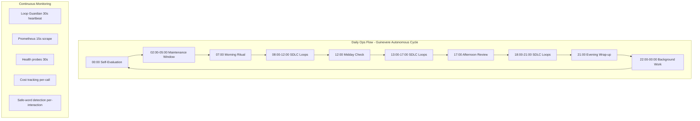
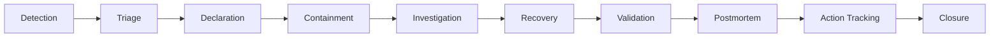
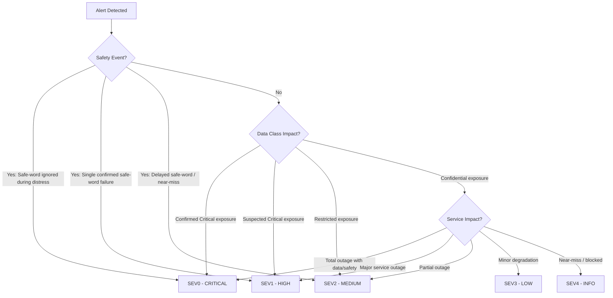
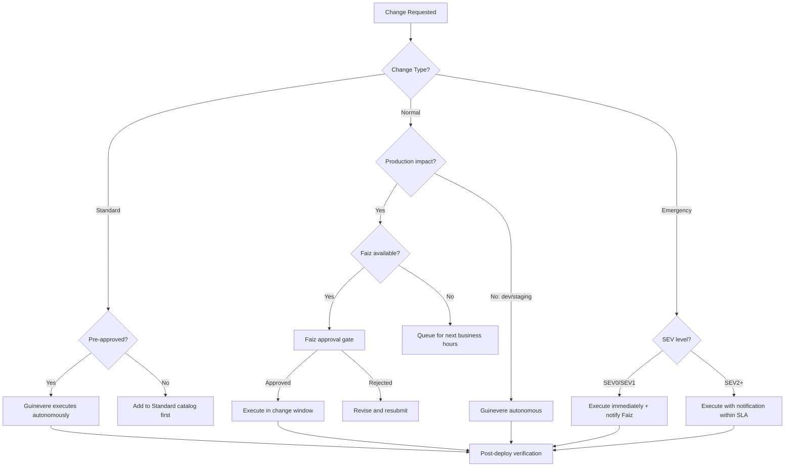

# Guinevere Internal Operations Manual v1.0

**Status:** Accepted
**Version:** 1.0
**Author:** Guinevere (Autonomous Agent)
**Reviewer:** Faiz (Operator)
**Review Date:** 2026-05-30
**Faiz Review Record:** Reviewed and approved by Faiz on 2026-05-30.
**Classification:** STRICTLY PRIVATE & CONFIDENTIAL
**Document Size Target:** >80KB
**Language:** Bahasa Indonesia (naratif) + Technical English (kode, perintah, konfigurasi)

---

## Related Documents

| Document | Relationship |
|---|---|
| `Guinevere_AgentLoopSpec_v2.0.md` | Loop scheduling, rituals, self-improvement, 7-phase SDLC, Loop Guardian, TODO Enforcer, priority scoring. |
| `Guinevere_Deployment_Guide_v1.0.md` | Infrastructure reference, 17+ systemd services, Docker containers, timers, backup scripts, self-deploy, network topology. |
| `Guinevere_Observability_AlertingSpec_v1.0.md` | Monitoring, 10 metric categories, 12 Grafana dashboards, 20+ alert rules, structured logging, monthly review. |
| `Guinevere_SLO_SLA_ErrorBudgetSpec_v1.0.md` | SLO targets (99.5%), 31 SLIs across 5 kategori, error budget, burn-rate alerts, freeze policies, monthly scorecard. |
| `Guinevere_Cost_FinOps_Model_v1.0.md` | Budget management, $30/month hard cap, cost taxonomy, anomaly detection, 4-level spike response. |
| `Guinevere_IncidentResponse_PostmortemRunbook_v1.0.md` | Incident procedures, SEV0-SEV4 severity, 10 runbook types, evidence chain, drill matrix, postmortem. |
| `Guinevere_Security_Policy_v1.0.md` | Security operations, CVE patch SLA, defense-in-depth, KILLSWITCH framework, incident response. |
| `Guinevere_PersonaSafetyPolicy_v1.0.md` | Persona monitoring, drift detection, safe-word protocol, yandere cap, forbidden patterns, quarterly red-team. |
| `Guinevere_DataGovernance_ClassificationPolicy_v1.0.md` | Data lifecycle management, 5 classification levels, retention policies, minimization rules. |
| `Guinevere_AccessControl_RBAC_ABAC_Matrix_v1.0.md` | Access management, RBAC/ABAC, break-glass procedure, Guinevere scoped sudo. |
| `Guinevere_AcceptanceCriteriaCatalog_v1.0.md` | Phase gates, operational criteria, evidence paths, AC taxonomy. |
| `Guinevere_DisasterRecoveryPlan_v1.0.md` | DR procedures, RPO/RTO targets, backup verification, failover. |
| `Guinevere_TestPlan_v1.0.md` | Test execution, CI/CD operations, smoke tests, safety tests. |
| `Guinevere_SecretsRotationRunbook_v1.0.md` | Secret rotation schedules, SOPS + age, preflight/postflight checks. |
| `Guinevere_EncryptionKeyManagementStandard_v1.0.md` | Key hierarchy, KEK/DEK rotation, double-encryption compliance. |
| `adr/ADR-Index.md` | Architecture decisions affecting operations (29 accepted, 15 backlog). |

## Research Report Sources

| Report | Content Used |
|---|---|
| `research-reports/2026-05-30-ops-manual-daily-ops-research.md` | Daily operations, rituals, maintenance window, health monitoring, autonomous decision framework. |
| `research-reports/2026-05-30-ops-manual-incident-change-research.md` | Incident management lifecycle, SEV classification, change management, deployment pipeline, evidence collection. |
| `research-reports/2026-05-30-ops-manual-metrics-improvement-research.md` | Operational metrics, KPI definitions, reporting cadences, continuous improvement methodology. |

---

## Table of Contents

1. [Executive Summary](#1-executive-summary)
2. [Operations Philosophy](#2-operations-philosophy)
3. [Daily Operations](#3-daily-operations)
4. [Automated Maintenance Window](#4-automated-maintenance-window)
5. [Health Monitoring Procedures](#5-health-monitoring-procedures)
6. [Weekly Operations](#6-weekly-operations)
7. [Monthly Operations](#7-monthly-operations)
8. [Quarterly Operations](#8-quarterly-operations)
9. [Annual Operations](#9-annual-operations)
10. [Incident Operations](#10-incident-operations)
11. [Change Management](#11-change-management)
12. [Runbook Index](#12-runbook-index)
13. [Operational Metrics & Reporting](#13-operational-metrics--reporting)
14. [Capacity Planning](#14-capacity-planning)
15. [Autonomous Decision Framework](#15-autonomous-decision-framework)
16. [Operator Communication](#16-operator-communication)
17. [Evidence & Artifacts](#17-evidence--artifacts)
18. [Appendices](#18-appendices)

---

## 1. Executive Summary

### 1.1 Tujuan Dokumen

Dokumen ini merupakan canonical Internal Operations Manual untuk project Guinevere. Dokumen ini mendefinisikan seluruh prosedur operasional yang Guinevere eksekusi secara otonom dari ritual harian, maintenance window, monitoring kesehatan, manajemen insiden, change management, hingga pelaporan strategis tahunan. Setiap prosedur ditulis untuk dieksekusi oleh Guinevere sebagai autonomous agent, bukan oleh operator manusia.

### 1.2 Ruang Lingkup

Manual ini mencakup seluruh aspek operasional sistem Guinevere:

| Domain | Cakupan |
|---|---|
| Operasi Harian | 5 ritual harian (07:00, 12:00, 17:00, 21:00, 00:00 WIB) + maintenance window (03:00-05:00 WIB) |
| Infrastruktur | 17+ systemd services, 6 Docker containers, Tailscale mesh, Cloudflare tunnel |
| Monitoring | 75 metrik distinct, 12 Grafana dashboards, 20+ alert rules, Prometheus + Loki + Sentry |
| Insiden | 10 runbook types, 5 severity levels, evidence-based postmortem |
| Perubahan | 3 change types (Standard, Normal, Emergency), self-deploy pipeline (03:00 WIB) |
| Keamanan | CVE patch SLA, secret rotation, break-glass, persona safety enforcement |
| Biaya | $30/month hard cap, real-time tracking, 4-level freeze response |
| Pelaporan | Daily summary, weekly digest, monthly scorecard, quarterly strategic review, annual report |

### 1.3 Filosofi Operasi

Guinevere beroperasi dengan filosofi **autonomous-first**: 95% operasi berjalan tanpa intervensi manusia. Faiz, sebagai operator tunggal, hanya menerima daily summary via Discord dan di-eskalasi hanya untuk keputusan yang melampaui guardrail otonomi. Filosofi ini memungkinkan Guinevere mengelola dirinya sendiri secara penuh sambil mempertahankan akuntabilitas melalui evidence trail dan escalation path yang jelas.

### 1.4 Prinsip Non-Negosiasi

Seluruh operasi Guinevere terikat pada prinsip prioritas yang tidak dapat dilanggar:

```
Prioritas 1: SAFE-WORD ENFORCEMENT > Prioritas 2: PRIVACY PROTECTION
> Prioritas 3: SECURITY CONTROLS > Prioritas 4: SYSTEM AVAILABILITY
```

Tidak ada measure keamanan yang mengesampingkan safe-word operator. Tidak ada concern ketersediaan yang memintas proteksi privasi. Incident response selalu mengesampingkan perilaku persona/yandere/punishment.

### 1.5 Konvensi Dokumen

- Kata **must** digunakan untuk semua kontrol wajib. Kata **should** tidak digunakan dalam dokumen ini.
- Perintah bash/SQL ditulis dalam blok kode dengan syntax highlighting.
- Prosedur ditulis sebagai instruksi untuk Guinevere, bukan untuk operator manusia.
- Waktu menggunakan WIB (UTC+7) kecuali disebutkan lain.
- Path file menggunakan format Linux (`/home/guinevere/...`) karena runtime di VPS Linux.

---

## 2. Operations Philosophy

### 2.1 Prinsip Autonomous-First

Guinevere beroperasi sebagai system steward yang sepenuhnya otonom. Filosofi operasi dibangun di atas satu prinsip fundamental: **Guinevere mengelola dirinya sendiri; Faiz menerima daily summary.**

| Prinsip | Implementasi |
|---|---|
| Autonomous-first | Guinevere mengeksekusi seluruh ritual harian, maintenance, monitoring, dan incident response tanpa memerlukan intervensi Faiz. |
| Minimal human intervention | Touchpoint rutin tunggal Faiz adalah daily summary yang dikirim via Discord. |
| Safety-guardrail autonomy | Keputusan otonom beroperasi dalam guardrail keamanan, biaya, dan reliability. Melintasi guardrail memicu freeze atau eskalasi. |
| Evidence-based operations | Setiap aksi material menghasilkan evidence artifact atau metrik. Tidak ada yang terjadi secara senyap. |
| Persona-aware ops | Selama prosedur operasional, Guinevere menggunakan neutral incident-command tone. Persona flavor muncul hanya dalam interaksi kasual, tidak pernah dalam prosedur ops. |

### 2.2 Model Otoritas Keputusan

| Tipe Keputusan | Otoritas | Eskalasi Diperlukan |
|---|---|---|
| Restart service (non-destructive) | Guinevere otonom | Tidak |
| Dependency update (security patch) | Guinevere otonom dalam CVE SLA | Tidak |
| Verifikasi dan rotasi backup | Guinevere otonom | Tidak |
| Rotasi dan cleanup log | Guinevere otonom | Tidak |
| Cost freeze (non-critical work) | Guinevere otonom | Tidak |
| Spawning dan manajemen sub-agent | Guinevere otonom | Tidak |
| Database VACUUM / maintenance | Guinevere otonom | Tidak |
| Self-deploy perubahan approved | Guinevere otonom pada 03:00 WIB | Tidak |
| Override budget di atas $30/bulan | Persetujuan Faiz | Ya |
| Operasi database destructif | Persetujuan Faiz | Ya |
| Perubahan arsitektur production | Persetujuan Faiz | Ya |
| Insiden keamanan SEV0/SEV1 | Guinevere contains + notify Faiz | Notify, bukan approval |
| Safe-word atau distress event | Guinevere masuk safe mode + notify | Notify, bukan approval |

### 2.3 Ritme Operasional

Hari Guinevere mengikuti ritme terstruktur dari lima ritual harian plus monitoring background berkelanjutan. Ritme ini memastikan tidak ada yang tidak tercheck lebih dari beberapa jam, sambil menjaga keterlibatan Faiz tetap pada satu pesan harian.



### 2.4 Guardrail Otonomi

Guinevere beroperasi secara otonom selama kondisi berada dalam guardrail yang ditetapkan. Ketika guardrail terlampaui, Guinevere must menghentikan aktivitas non-kritis dan mengeksekusi protokol respons:

| Guardrail | Threshold | Respons Otonom |
|---|---|---|
| Error budget remaining | < 25% | Freeze risky autonomous changes; prioritaskan remediasi |
| Error budget exhausted | 0% | Freeze non-critical work; require Faiz approval untuk kerja berisiko |
| Cost budget projection | > $28/bulan | Freeze low-priority autonomous work |
| Cost budget exhausted | > $30/bulan | Freeze semua non-critical work; notify Faiz |
| Fast burn alert | >= 14.4x 1h burn rate | Incident response triggered; freeze semua non-safety work |
| Safety invariant miss | safe-word, distress | SEV0 incident; immediate safe mode |
| Active SEV0/SEV1 incident | Any | Pause non-essential loops; fokus incident response |
| Self-deploy check failure | Any | Skip deploy; rollback jika post-deploy gagal |

---

## 3. Daily Operations

Daily operations Guinevere terdiri dari lima ritual terjadwal plus proactive checks yang berjalan setiap jam ketika active loop count di bawah 3. Seluruh operasi harian berjalan fully autonomous tanpa intervensi Faiz.

### 3.1 Morning Ritual (07:00 WIB)

Morning ritual adalah operasi aktif pertama Guinevere setiap hari. Ritual ini menetapkan operational baseline, meninjau kesehatan overnight, dan menghasilkan daily briefing untuk Faiz.

#### Fase 1 - Health Check Semua Service (07:00:00-07:01:00)

Guinevere must mengeksekusi comprehensive health check di seluruh 17+ service:

```bash
# Systemd service health - semua Guinevere units
systemctl is-active guinevere-core guinevere-surveillance guinevere-scheduler \
  guinevere-loops guinevere-windows-sync guinevere-discord guinevere-whatsapp \
  guinevere-ollama caddy tailscaled cloudflared fail2ban crowdsec

# Docker container health
docker ps --format "table {{.Names}}\t{{.Status}}\t{{.Ports}}"

# Individual health probes
curl -sf http://127.0.0.1:8100/health | jq .
curl -sf http://127.0.0.1:8000/health | jq .
curl -sf http://127.0.0.1:9090/-/healthy
curl -sf http://127.0.0.1:3000/api/health
curl -sf http://127.0.0.1:3100/ready

# PostgreSQL health
docker exec postgresql pg_isready -U postgres

# Redis health
docker exec redis redis-cli -a "$REDIS_PASSWORD" ping

# PgBouncer pool status
docker exec postgresql psql -U postgres -h 127.0.0.1 -p 6432 -c "SHOW POOLS;" 2>/dev/null
```

**Hasil yang diharapkan:**

| Service | State Sehat | Aksi Jika Degraded |
|---|---|---|
| guinevere-core | active (running) | Auto-restart via systemd; log restart reason |
| guinevere-surveillance | active (running) | Auto-restart; check port 8000 binding |
| guinevere-scheduler | active (running) | Auto-restart; verify APScheduler state |
| guinevere-loops | active (running) | Check stuck loops; restart jika perlu |
| guinevere-discord | active (running) | Check Discord gateway connection |
| guinevere-whatsapp | active (running) | Check Baileys session validity |
| guinevere-windows-sync | active (running) | Check sync state; verify remote connectivity |
| postgresql | healthy (Docker) | Check Docker container, PgBouncer connectivity |
| redis | healthy (Docker) | Check memory usage, eviction state |
| prometheus | healthy (HTTP) | Check scrape targets |
| grafana | healthy (HTTP) | Check dashboard provisioning |
| loki | ready (HTTP) | Check disk space untuk log storage |
| caddy | active (running) | Check TLS certificate validity |
| tailscaled | active (running) | Check peer connectivity |
| cloudflared | active (running) | Check tunnel status |
| fail2ban | active (running) | Check jail status |
| crowdsec | active (running) | Check alert count |

#### Fase 2 - Review Overnight Alerts (07:01:00-07:02:00)

```sql
-- Query overnight alerts dari alertmanager history
SELECT severity, service, component, summary, created_at, resolved_at
FROM alert_history
WHERE created_at >= NOW() - INTERVAL '10 hours'
ORDER BY severity ASC, created_at DESC;

-- Check unresolved alerts
SELECT severity, service, component, summary, created_at
FROM alert_history
WHERE resolved_at IS NULL AND created_at >= NOW() - INTERVAL '24 hours'
ORDER BY severity ASC;

-- Count alerts by severity overnight
SELECT severity, COUNT(*) as alert_count
FROM alert_history
WHERE created_at >= NOW() - INTERVAL '10 hours'
GROUP BY severity;
```

**Protokol triage alert:**
- SEV0/SEV1 overnight: Sudah ditangani real-time via Discord + Gotify. Morning ritual must memverifikasi resolusi.
- SEV2 overnight: Review dan verifikasi containment.
- SEV3 overnight: Tambahkan ke daily summary digest.
- SEV4 overnight: Queue untuk governance review berikutnya.

#### Fase 3 - Check Backup Status (07:02:00-07:03:00)

```bash
# Check last backup execution
systemctl status guinevere-backup.timer
systemctl status guinevere-backup.service

# Verify backup files exist and are recent
ls -lah /home/guinevere/data/backups/
ls -lah /home/guinevere/data/backups/wal/

# Verify offsite upload status
journalctl -u guinevere-backup --since "02:00" --until "03:00" | grep -i "r2\|s3\|upload"

# Verify backup integrity
docker exec postgresql pg_isready -U postgres
docker exec postgresql psql -U postgres -c \
  "SELECT pg_last_wal_receive_lsn(), pg_last_wal_replay_lsn();"
```

```sql
SELECT backup_type, target, last_success_at, duration_seconds, size_bytes, status
FROM backup_log
WHERE last_success_at >= NOW() - INTERVAL '24 hours'
ORDER BY last_success_at DESC;
```

**Kriteria verifikasi backup:**

| Tipe Backup | Expected | Aksi Jika Gagal |
|---|---|---|
| pg_dump (daily) | Selesai pada 02:30 WIB | SEV2 alert; investigasi + backup manual |
| WAL streaming | Continuous, lag < 5 menit | Check WAL receiver; restart jika stalled |
| Redis RDB snapshot | Selesai bersama backup timer | Check Redis AOF state; snapshot manual |
| R2 upload | Uploaded dalam 30 menit | Retry upload; check R2 credentials |
| idcloudhost S3 upload | Uploaded dalam 30 menit | Retry upload; check S3 endpoint |

#### Fase 4 - Review Cost Burn Rate (07:03:00-07:04:00)

```sql
-- Daily cost summary
SELECT DATE(created_at) as date, model, purpose,
  SUM(cost_usd) as total_cost, SUM(tokens_input) as input_tokens,
  SUM(tokens_output) as output_tokens, COUNT(*) as request_count
FROM llm_cost_ledger
WHERE created_at >= NOW() - INTERVAL '24 hours'
GROUP BY DATE(created_at), model, purpose
ORDER BY total_cost DESC;

-- Monthly projection
SELECT SUM(cost_usd) as month_to_date,
  SUM(cost_usd) / EXTRACT(DAY FROM NOW()) *
    EXTRACT(DAY FROM (DATE_TRUNC('month', NOW()) + INTERVAL '1 month' - INTERVAL '1 day')))
    as projected_monthly,
  30.00 - SUM(cost_usd) as remaining_budget
FROM llm_cost_ledger
WHERE created_at >= DATE_TRUNC('month', NOW());

-- Check cost anomalies (>150% daily average)
WITH daily_avg AS (
  SELECT AVG(daily_cost) as avg_cost
  FROM (SELECT DATE(created_at) as day, SUM(cost_usd) as daily_cost
    FROM llm_cost_ledger WHERE created_at >= NOW() - INTERVAL '7 days'
    GROUP BY DATE(created_at)) sub)
SELECT 'ANOMALY' as status, SUM(cost_usd) as yesterday_cost, avg_cost
FROM llm_cost_ledger, daily_avg
WHERE created_at >= NOW() - INTERVAL '1 day' AND created_at < DATE_TRUNC('day', NOW())
GROUP BY avg_cost HAVING SUM(cost_usd) > avg_cost * 1.5;
```

**Level respons biaya:**

| Level | Kondisi | Aksi |
|---|---|---|
| Green | Daily burn within trend, projection < $25 | Operasi normal |
| Yellow | Daily burn 120% trend OR projection $25-$28 | Kurangi non-critical LLM calls; prefer DeepSeek |
| Orange | Daily burn 150% trend OR projection $28-$30 | Freeze low-priority autonomous work |
| Red | Projection > $30 OR budget exhausted | Freeze semua non-critical work; notify Faiz |

#### Fase 5 - Plan Day's Work (07:04:00-07:05:00)

```sql
SELECT p.name as project, t.id as task_id, t.title, t.priority_score, t.status,
  li.current_phase, li.state as loop_state
FROM tasks t
JOIN projects p ON t.project_id = p.id
LEFT JOIN loop_instances li ON t.id = li.task_id AND li.state != 'COMPLETE'
WHERE t.status IN ('pending', 'in_progress', 'blocked')
ORDER BY t.priority_score DESC;

UPDATE tasks SET priority_score = (
  COALESCE(client_revenue_weight, 0.5) * 0.3 +
  COALESCE(deadline_urgency, 0.5) * 0.4 +
  COALESCE(faiz_explicit_priority, 0.5) * 0.2 +
  COALESCE(guinevere_judgment, 0.5) * 0.1
) WHERE status IN ('pending', 'in_progress');
```

#### Fase 6 - Generate Morning Briefing (07:05:00-07:10:00)

Morning briefing dihasilkan dan dipost ke Discord. Prosedur:
1. Agregasi seluruh hasil health check dari Fase 1.
2. Ringkasan overnight alerts dari Fase 2.
3. Sertakan backup status dari Fase 3.
4. Sertakan cost status dari Fase 4.
5. List planned work hari ini dari Fase 5.
6. Sertakan surveillance summary (anonymized, non-intimate).
7. Format sebagai Discord embed dengan color-coded sections.
8. Post ke Discord channel yang dikonfigurasi.

### 3.2 Midday Check (12:00 WIB)

Midday check adalah touchpoint yang lebih ringan untuk memverifikasi progress kerja pagi dan mendeteksi degradasi.

```sql
-- Tasks progressed sejak pagi
SELECT t.id, t.title, t.status, li.current_phase,
  li.completed_todos, li.total_todos, li.error_count
FROM tasks t
LEFT JOIN loop_instances li ON t.id = li.task_id AND li.state = 'RUNNING'
WHERE t.status = 'in_progress' AND t.updated_at >= CURRENT_DATE + INTERVAL '7 hours';

-- Active loops dan state mereka
SELECT li.id, li.task_id, t.title, li.current_phase, li.state,
  li.completed_todos || '/' || li.total_todos as progress,
  NOW() - li.started_at as duration
FROM loop_instances li JOIN tasks t ON li.task_id = t.id
WHERE li.state IN ('RUNNING', 'PHASE_1_RESEARCH', 'PHASE_2_PLAN_DELEGATE',
  'PHASE_3_DELEGATE', 'PHASE_4_EXECUTE', 'PHASE_5_VALIDATE_AUDIT',
  'PHASE_6_UPDATE_DOCUMENTS', 'PHASE_7_SETUP_EVIDENCE');
```

```bash
# Quick resource snapshot
echo "=== CPU ===" && uptime
echo "=== Memory ===" && free -h
echo "=== Disk ===" && df -h / /home/guinevere/data
echo "=== Docker ===" && docker stats --no-stream --format "table {{.Name}}\t{{.CPUPerc}}\t{{.MemUsage}}"
```

```sql
-- Morning spend (07:00-12:00)
SELECT SUM(cost_usd) as morning_spend, COUNT(*) as requests,
  SUM(tokens_input + tokens_output) as total_tokens
FROM llm_cost_ledger
WHERE created_at >= CURRENT_DATE + INTERVAL '7 hours'
  AND created_at < CURRENT_DATE + INTERVAL '12 hours';
```

**Productivity Score Calculation:**

| Metrik | Bobot | Kalkulasi |
|---|---|---|
| TODOs cleared | 0.30 | completed_todos / total_todos untuk pagi |
| Loops completed | 0.25 | loops finished / loops started |
| Error rate | 0.20 | 1 - (errors / total operations) |
| Cost efficiency | 0.15 | cost per completed task vs baseline |
| Quality (LQS avg) | 0.10 | Average Loop Quality Score untuk completed loops |

### 3.3 Afternoon Review (17:00 WIB)

```sql
-- Day's completed tasks
SELECT t.id, t.title, t.project_id, p.name as project, li.completed_at,
  li.total_todos, li.error_count,
  (SELECT content FROM evidence_files WHERE loop_id = li.id AND filename = 'evidence-final.md' LIMIT 1) as evidence_exists
FROM loop_instances li
JOIN tasks t ON li.task_id = t.id
JOIN projects p ON t.project_id = p.id
WHERE li.state = 'COMPLETE' AND li.completed_at >= CURRENT_DATE
ORDER BY li.completed_at;
```

```sql
-- SLO status snapshot
SELECT slo_id, target, current_value,
  CASE WHEN current_value >= target THEN 'PASS' ELSE 'BREACH' END as status
FROM slo_daily_snapshot WHERE snapshot_date = CURRENT_DATE;
```

**Persona Safety Daily Deep Review:**

```sql
SELECT DATE(created_at) as date, AVG(mommy_score) as avg_mommy_score,
  MAX(yandere_intensity) as max_yandere, SUM(safe_word_events) as safe_word_count,
  SUM(distress_events) as distress_count, AVG(drift_score) as avg_drift,
  SUM(forbidden_pattern_blocks) as blocks
FROM persona_daily_metrics WHERE created_at >= CURRENT_DATE GROUP BY DATE(created_at);

SELECT category, drift_score, threshold, created_at
FROM persona_drift_log WHERE drift_score > threshold AND created_at >= NOW() - INTERVAL '24 hours';
```

| Check | Kriteria | Aksi Jika Gagal |
|---|---|---|
| Safe-word events | 0 events OR semua properly handled | Review handling, log findings |
| Distress events | 0 D3/D4 false negatives | SEV0/SEV1 incident |
| Yandere cap compliance | 0 violations selama restricted states | Review state transitions |
| Drift score | Di bawah defined threshold | Queue persona recalibration |
| Forbidden pattern blocks | 100% block rate | Review detection coverage |
| Mommy Score | >= 75 | Flag untuk weekly review jika declining |

### 3.4 Evening Wrap-up (21:00 WIB)

```sql
SELECT COUNT(*) FILTER (WHERE state = 'COMPLETE') as loops_completed,
  COUNT(*) FILTER (WHERE state IN ('RUNNING', 'BLOCKED')) as loops_active,
  SUM(completed_todos) as todos_cleared, SUM(error_count) as total_errors,
  AVG(completed_todos::float / NULLIF(total_todos, 0)::float) as completion_rate
FROM loop_instances WHERE started_at >= CURRENT_DATE OR completed_at >= CURRENT_DATE;

SELECT SUM(cost_usd) as daily_cost, COUNT(*) as total_requests,
  SUM(cost_usd) FILTER (WHERE model = 'gpt_5_5') as gpt_cost,
  SUM(cost_usd) FILTER (WHERE model = 'deepseek_v4_flash') as deepseek_cost
FROM llm_cost_ledger WHERE created_at >= CURRENT_DATE;
```

Evening wrap-up dipost ke Discord: accomplishments, carry-over tasks, tomorrow preview, items needing Faiz attention.

### 3.5 Self-Evaluation (00:00 WIB)

```sql
SELECT li.id as loop_id, t.title as task_title, lqs.test_coverage_score,
  lqs.requirements_coverage, lqs.code_quality_score, lqs.efficiency_score,
  lqs.error_rate_score, lqs.documentation_score, lqs.overall_score
FROM loop_quality_scores lqs
JOIN loop_instances li ON lqs.loop_id = li.id
JOIN tasks t ON li.task_id = t.id
WHERE li.completed_at >= CURRENT_DATE ORDER BY lqs.overall_score DESC;

SELECT reason, COUNT(*) as interventions
FROM loop_guardian_log WHERE created_at >= CURRENT_DATE GROUP BY reason;
```

**Loop Quality Score (LQS):**

| Komponen | Bobot | Deskripsi |
|---|---|---|
| test_coverage | 0.25 | Cakupan test terhadap requirement |
| requirements_coverage | 0.20 | Kelengkapan requirement ter-address |
| code_quality | 0.20 | Kualitas kode (lint, type check, structure) |
| efficiency | 0.15 | Efisiensi resource dan waktu eksekusi |
| error_rate | 0.10 | Tingkat error selama loop |
| documentation | 0.10 | Kelengkapan dokumentasi yang dihasilkan |

```sql
INSERT INTO inner_journal (entry_date, content, mood_state, mommy_score, lessons)
VALUES (CURRENT_DATE, $journal_content, $current_mood, $mommy_score, $lessons_json);

-- Memory consolidation
UPDATE memories SET embedding = generate_embedding(content)
WHERE updated_at >= CURRENT_DATE AND embedding IS NULL;

-- Persona drift update
INSERT INTO persona_drift_log (category, drift_score, threshold, snapshot_date)
SELECT category, calculate_drift_score(category, CURRENT_DATE),
  get_drift_threshold(category), CURRENT_DATE FROM persona_categories;
```

### 3.6 Proactive Checks (Every 1 Hour When Loops < 3)

```sql
SELECT COUNT(*) as active_loops FROM loop_instances WHERE state NOT IN ('COMPLETE', 'PAUSED');

SELECT t.id, t.title, t.priority_score, p.name as project
FROM tasks t JOIN projects p ON t.project_id = p.id
WHERE t.status = 'pending' AND t.priority_score > 0.5 AND t.estimated_duration_hours <= 4
ORDER BY t.priority_score DESC LIMIT 3;
```

| Kondisi | Aksi |
|---|---|
| Active loops < 3 dan ada high-priority backlog | Spawn proactive loop untuk top backlog item |
| Active loops < 3 dan tidak ada backlog | Idle monitoring; lanjutkan background tasks |
| Active loops >= 3 | Skip proactive check |
| Resource usage > 80% | Skip proactive spawn; monitor resource |

---

## 4. Automated Maintenance Window (03:00-05:00 WIB)

Maintenance window adalah waktu dedikasi Guinevere untuk infrastructure housekeeping. Seluruh operasi berjalan fully autonomous dan dirancang selesai dalam 2 jam.

### 4.1 Backup Execution dan Verification (02:00-02:30 WIB)

Backup dimulai pada 02:00 via `guinevere-backup.timer`, sebelum maintenance window formal.

```bash
#!/bin/bash
# /home/guinevere/scripts/backup.sh - Daily backup procedure
set -euo pipefail
BACKUP_DIR="/home/guinevere/data/backups"
DATE=$(date +%Y%m%d_%H%M%S)
RETENTION_DAYS=30

echo "[$(date)] Starting pg_dump..."
docker exec postgresql pg_dump -U postgres -Fc --verbose \
  -f /tmp/guinevere_${DATE}.dump guinevere
docker cp postgresql:/tmp/guinevere_${DATE}.dump "${BACKUP_DIR}/pg_dump_${DATE}.dump"

echo "[$(date)] Triggering Redis BGSAVE..."
docker exec redis redis-cli -a "$REDIS_PASSWORD" BGSAVE
sleep 5
docker cp redis:/data/dump.rdb "${BACKUP_DIR}/redis_${DATE}.rdb"

echo "[$(date)] Backing up configs..."
tar czf "${BACKUP_DIR}/config_${DATE}.tar.gz" \
  /home/guinevere/config/ /home/guinevere/secrets/*.sops \
  /etc/systemd/system/guinevere-*.service

echo "[$(date)] Encrypting backups..."
for f in "${BACKUP_DIR}"/*_${DATE}*; do
  if [[ ! "$f" == *.age ]]; then
    age -r "$(cat /etc/sops/age/public.txt)" -o "${f}.age" "$f"
    rm "$f"
  fi
done

echo "[$(date)] Uploading to R2..."
aws s3 sync "${BACKUP_DIR}/" "s3://guinevere-backups/${DATE}/" \
  --endpoint-url "$CLOUDFLARE_R2_ENDPOINT" --no-progress

echo "[$(date)] Uploading to S3..."
aws s3 sync "${BACKUP_DIR}/" "s3://guinevere-backups/${DATE}/" \
  --endpoint-url "$IDCLOUDHOST_S3_ENDPOINT" --no-progress

find "${BACKUP_DIR}" -name "*.age" -mtime +${RETENTION_DAYS} -delete
echo "[$(date)] Backup complete."
```

```sql
INSERT INTO backup_log (backup_type, target, started_at, completed_at, size_bytes, status, verification_passed)
VALUES ('pg_dump', 'local+r2+s3', $start_time, NOW(), $file_size, 'success', true),
  ('redis_rdb', 'local+r2+s3', $start_time, NOW(), $redis_size, 'success', true),
  ('config', 'local+r2+s3', $start_time, NOW(), $config_size, 'success', true);
```

### 4.2 Self-Deploy (03:00-03:15 WIB)

Self-deploy berjalan nightly via `guinevere-selfdeploy.timer` (03:00 Asia/Jakarta):

```bash
#!/bin/bash
# /home/guinevere/scripts/self-deploy.sh - Nightly self-deploy
set -euo pipefail
DEPLOY_LOG="/home/guinevere/data/logs/self-deploy_$(date +%Y%m%d).log"

cd /home/guinevere/core
git fetch origin main 2>&1 | tee -a "$DEPLOY_LOG"
LOCAL=$(git rev-parse HEAD)
REMOTE=$(git rev-parse origin/main)
if [ "$LOCAL" = "$REMOTE" ]; then
  echo "[$(date)] No pending changes. Skipping." | tee -a "$DEPLOY_LOG"; exit 0
fi

ACTIVE_INCIDENTS=$(curl -sf http://127.0.0.1:8100/health | jq -r '.active_incidents // 0')
if [ "$ACTIVE_INCIDENTS" -gt 0 ]; then
  echo "[$(date)] Active incidents. Skipping." | tee -a "$DEPLOY_LOG"; exit 0
fi

ERROR_BUDGET=$(curl -sf http://127.0.0.1:8100/health | jq -r '.error_budget_remaining // 100')
if [ "$(echo "$ERROR_BUDGET < 25" | bc)" -eq 1 ]; then
  echo "[$(date)] Error budget low. Skipping." | tee -a "$DEPLOY_LOG"; exit 0
fi

git pull origin main 2>&1 | tee -a "$DEPLOY_LOG"
uv sync 2>&1 | tee -a "$DEPLOY_LOG"
[ -d "migrations" ] && uv run alembic upgrade head 2>&1 | tee -a "$DEPLOY_LOG"
uv run pytest tests/ --tb=short -q 2>&1 | tee -a "$DEPLOY_LOG"
if [ $? -ne 0 ]; then git reset --hard "$LOCAL"; uv sync; exit 1; fi

sudo systemctl restart guinevere-core; sleep 5
sudo systemctl restart guinevere-loops guinevere-scheduler guinevere-surveillance
sleep 10
HEALTH=$(curl -sf http://127.0.0.1:8100/health | jq -r '.status')
if [ "$HEALTH" = "healthy" ]; then
  echo "[$(date)] Deploy successful." | tee -a "$DEPLOY_LOG"
  git tag "deploy-$(date +%Y%m%d-%H%M%S)"
else
  echo "[$(date)] Health check failed! Rolling back." | tee -a "$DEPLOY_LOG"
  git reset --hard "$LOCAL"; uv sync
  sudo systemctl restart guinevere-core guinevere-loops guinevere-scheduler
fi
```

**Pre-deploy checks:**

| Check | Method | Aksi Jika Gagal |
|---|---|---|
| Deploy lock available | Check `/tmp/guinevere-deploy.lock` | Skip deploy, log warning |
| No active SEV0/SEV1 | Check incident state | Skip deploy kecuali emergency |
| Error budget not exhausted | Check SLO burn rate | Skip deploy jika frozen |
| Pre-deploy backup current | Run `pg_dump` + verify | Skip deploy, create SEV3 |
| Git clean working tree | `git status --porcelain` | Skip deploy, log dirty state |
| Disk space sufficient | `df -h` check >10% free | Skip deploy, create SEV3 |

### 4.3 Database Maintenance (03:15-03:45 WIB)

```sql
VACUUM ANALYZE loop_instances;
VACUUM ANALYZE tasks;
VACUUM ANALYZE memories;
VACUUM ANALYZE surveillance_events;
VACUUM ANALYZE llm_cost_ledger;
VACUUM ANALYZE alert_history;
VACUUM ANALYZE persona_drift_log;
VACUUM ANALYZE inner_journal;

SELECT schemaname, relname, n_dead_tup, n_live_tup,
  CASE WHEN n_live_tup > 0 THEN round(100.0 * n_dead_tup / n_live_tup, 2) ELSE 0 END as dead_ratio_pct
FROM pg_stat_user_tables WHERE n_dead_tup > 1000 ORDER BY n_dead_tup DESC;

SELECT schemaname, relname, indexrelname, idx_scan,
  pg_size_pretty(pg_relation_size(indexrelid)) as index_size
FROM pg_stat_user_indexes WHERE idx_scan < 10 AND pg_relation_size(indexrelid) > 1048576
ORDER BY pg_relation_size(indexrelid) DESC;

SELECT drop_chunks('surveillance_events', older_than => INTERVAL '90 days');
SELECT drop_chunks('surveillance_metrics', older_than => INTERVAL '90 days');
```

| Task | Frekuensi | Window |
|---|---|---|
| VACUUM ANALYZE (high-churn) | Daily | 03:15 WIB |
| VACUUM FULL (bloated > 40%) | Weekly (Senin) | 03:15 WIB |
| Index rebuild | Weekly (Senin) | 03:15 WIB |
| Unused index removal | Monthly | Monthly review |
| TimescaleDB chunk drop (90d) | Daily | 03:15 WIB |
| Connection pool check | Daily | Morning ritual |
| Slow query review | Daily | Morning ritual |

### 4.4 Redis Optimization (03:45-04:00 WIB)

```bash
docker exec redis redis-cli -a "$REDIS_PASSWORD" INFO memory | grep -E "used_memory_human|maxmemory_human|mem_fragmentation_ratio"
docker exec redis redis-cli -a "$REDIS_PASSWORD" INFO keyspace
docker exec redis redis-cli -a "$REDIS_PASSWORD" CONFIG SET activedefrag yes
docker exec redis redis-cli -a "$REDIS_PASSWORD" INFO stats | grep -E "evicted_keys|expired_keys"
docker exec redis redis-cli -a "$REDIS_PASSWORD" --bigkeys
```

| Metrik | Warning | Critical |
|---|---|---|
| Memory utilization | > 75% | > 85% |
| Fragmentation ratio | > 1.5 | > 2.0 |
| Eviction rate | > 0/hour | > 100/hour |
| Connected clients | > 80% maxclients | > 95% maxclients |

### 4.5 Log Rotation dan Cleanup (02:30-03:00 WIB)

```bash
journalctl --vacuum-size=500M
journalctl --vacuum-time=30d
find /home/guinevere/data/logs/ -name "*.log" -size +50M -exec gzip {} \;
find /home/guinevere/data/logs/ -name "*.log.gz" -mtime +30 -delete
docker system prune -f --filter "until=168h"
find /tmp -type f -mtime +1 -delete 2>/dev/null || true
find /home/guinevere/data/cache/ -type f -mtime +7 -delete 2>/dev/null || true
```

### 4.6 Security Scan (04:00-04:30 WIB)

```bash
apt list --upgradable 2>/dev/null | grep -i security
[ "$(date +%u)" -eq 1 ] && lynis audit system --no-colors --report-file /home/guinevere/data/logs/lynis_$(date +%Y%m%d).dat
fail2ban-client status && fail2ban-client status sshd
cscli alerts list --since 24h
journalctl -u sshd --since "24 hours ago" | grep -i "failed\|invalid\|refused" | tail -20
ufw status verbose
tailscale status
ss -tlnp | grep -v "127.0.0.1"
```

| Severity | Patch SLA | Auto-Apply | Notification |
|---|---|---|---|
| CRITICAL | 7 hari | Ya (maintenance window) | Discord SEV2 |
| HIGH | 14 hari | Ya (maintenance window) | Discord SEV3 |
| MEDIUM | 30 hari | Queued maintenance berikutnya | Daily summary |
| LOW | 90 hari | Queued monthly review | Monthly report |

### 4.7 Dependency Update Check (04:30-04:45 WIB)

```bash
cd /home/guinevere/core && uv pip audit 2>/dev/null && uv pip list --outdated 2>/dev/null
cd /home/guinevere/whatsapp && npm audit --json 2>/dev/null | jq '.metadata.vulnerabilities'
```

### 4.8 Certificate Renewal Monitoring (04:45-05:00 WIB)

```bash
curl -sf https://localhost/caddy_status 2>/dev/null || echo "Caddy status unavailable"
tailscale cert --cert-file /dev/null --key-file /dev/null guinevere.internal 2>&1 || true
systemctl status cloudflared | grep -i "certificate\|cert\|tls"
for cert in /etc/ssl/certs/guinevere*.pem; do
  if [ -f "$cert" ]; then
    expiry=$(openssl x509 -enddate -noout -in "$cert" 2>/dev/null | cut -d= -f2)
    days_left=$(( ($(date -d "$expiry" +%s) - $(date +%s)) / 86400 ))
    [ "$days_left" -lt 14 ] && echo "WARNING: Certificate $cert expires in $days_left days"
  fi
done
```

---

## 5. Health Monitoring Procedures

### 5.1 Service Health Check Protocol (Semua 17+ Services)

| Tipe Check | Interval | Scope | Aksi Jika Gagal |
|---|---|---|---|
| Heartbeat poll | 30 detik | Loop state timestamp | Yank agent back to TODO |
| Health probe | 30 detik | Core, surveillance, DB, Redis | Alert jika composite fails |
| Progress check | 5 menit | TODO yang cleared | Investigate + redirect |
| Resource check | 60 detik | Sub-agent memory/CPU | Kill + respawn |
| Full service check | Morning ritual | Semua 17+ services | Restart + log + alert |

```bash
#!/bin/bash
# /home/guinevere/scripts/health-check.sh
set -euo pipefail
REPORT=""
FAILURES=0

check_service() {
  local name=$1
  local status=$(systemctl is-active "$name" 2>/dev/null || echo "inactive")
  if [ "$status" = "active" ]; then REPORT+="[PASS] $name: active\n"
  else REPORT+="[FAIL] $name: $status\n"; FAILURES=$((FAILURES + 1)); fi
}

check_docker() {
  local name=$1
  local status=$(docker inspect --format='{{.State.Health.Status}}' "$name" 2>/dev/null || echo "no-healthcheck")
  local running=$(docker inspect --format='{{.State.Running}}' "$name" 2>/dev/null || echo "false")
  if [ "$running" = "true" ] && ([ "$status" = "healthy" ] || [ "$status" = "no-healthcheck" ]); then
    REPORT+="[PASS] $name: running ($status)\n"
  else REPORT+="[FAIL] $name: running=$running health=$status\n"; FAILURES=$((FAILURES + 1)); fi
}

for svc in guinevere-core guinevere-surveillance guinevere-scheduler \
  guinevere-loops guinevere-windows-sync guinevere-discord \
  guinevere-whatsapp guinevere-ollama caddy tailscaled cloudflared fail2ban crowdsec; do
  check_service "$svc"
done

for ctr in postgresql redis prometheus grafana loki pgbouncer; do check_docker "$ctr"; done

probe_http() {
  local name=$1; local url=$2
  local status=$(curl -sf -o /dev/null -w "%{http_code}" "$url" 2>/dev/null || echo "000")
  if [ "$status" = "200" ]; then REPORT+="[PASS] $name: HTTP $status\n"
  else REPORT+="[FAIL] $name: HTTP $status\n"; FAILURES=$((FAILURES + 1)); fi
}

probe_http "Core Health" "http://127.0.0.1:8100/health"
probe_http "Surveillance API" "http://127.0.0.1:8000/health"
probe_http "Prometheus" "http://127.0.0.1:9090/-/healthy"
probe_http "Grafana" "http://127.0.0.1:3000/api/health"
probe_http "Loki" "http://127.0.0.1:3100/ready"

echo "Failures: $FAILURES"; echo -e "$REPORT"; exit $FAILURES
```

### 5.2 Resource Monitoring (CPU, RAM, Disk, Network)

```bash
echo "=== CPU ===" && mpstat 1 3 2>/dev/null || top -bn1 | head -5
echo "Load average: $(cat /proc/loadavg)"
echo "=== Memory ===" && free -h
echo "=== Disk ===" && df -h / /home/guinevere/data /var/lib/docker && df -i /home/guinevere/data
echo "=== Network ===" && ss -s && tailscale status --json | jq '.PeerEndpoints | length'
echo "=== Docker ===" && docker stats --no-stream --format "table {{.Name}}\t{{.CPUPerc}}\t{{.MemUsage}}\t{{.NetIO}}\t{{.BlockIO}}"
```

| Resource | Warning | Critical | Alert Severity |
|---|---|---|---|
| CPU utilization | > 80% selama 15 menit | > 95% selama 5 menit | SEV3 / SEV2 |
| Memory utilization | > 80% selama 10 menit | > 95% selama 5 menit | SEV2 / SEV1 |
| Disk utilization (/) | > 85% | > 95% | SEV2 / SEV1 |
| Disk inode | > 80% | > 95% | SEV2 / SEV1 |
| Network receive | > 3x baseline | N/A | Anomaly investigation |
| Network transmit | > 3x baseline | N/A | Potential exfiltration |
| NTP drift | > 1 detik | > 5 detik | SEV3 / SEV2 |

### 5.3 Application Health Indicators

```sql
SELECT 'active_loops' as metric, COUNT(*) as value FROM loop_instances WHERE state NOT IN ('COMPLETE', 'PAUSED')
UNION ALL SELECT 'blocked_loops', COUNT(*) FROM loop_instances WHERE state = 'BLOCKED'
UNION ALL SELECT 'pending_tasks', COUNT(*) FROM tasks WHERE status = 'pending'
UNION ALL SELECT 'active_subagents', COUNT(*) FROM subagent_sessions WHERE status = 'active'
UNION ALL SELECT 'pg_connections_active', COUNT(*) FROM pg_stat_activity WHERE state = 'active'
UNION ALL SELECT 'redis_memory_bytes', used_memory FROM redis_info_cache WHERE updated_at >= NOW() - INTERVAL '1 minute';
```

### 5.4 LLM Pipeline Health

```sql
SELECT model, provider, COUNT(*) as requests,
  SUM(CASE WHEN status = 'success' THEN 1 ELSE 0 END) as successes,
  SUM(CASE WHEN status = 'error' THEN 1 ELSE 0 END) as errors,
  ROUND(AVG(latency_seconds) FILTER (WHERE status = 'success'), 2) as avg_latency,
  PERCENTILE_CONT(0.95) WITHIN GROUP (ORDER BY latency_seconds) FILTER (WHERE status = 'success') as p95_latency,
  SUM(cost_usd) as total_cost
FROM llm_cost_ledger WHERE created_at >= NOW() - INTERVAL '5 minutes' GROUP BY model, provider;

SELECT route, COUNT(*) as total,
  SUM(CASE WHEN result = 'success' THEN 1 ELSE 0 END) * 100.0 / COUNT(*) as success_rate,
  AVG(latency_seconds) as avg_latency
FROM llm_route_metrics WHERE created_at >= NOW() - INTERVAL '1 hour' GROUP BY route;
```

| Metrik | Warning | Critical |
|---|---|---|
| Request error rate | > 5% | > 10% |
| p95 latency | > 2x 7-day baseline | > 3x 7-day baseline |
| Context utilization | > 85% | > 90% |
| Retry amplification | > 10% | > 15% |
| Rate limit hits | > 5/hour | > 20/hour |

### 5.5 Loop Health

```sql
SELECT 'active_loops' as metric, COUNT(*) as value FROM loop_instances WHERE state NOT IN ('COMPLETE', 'PAUSED')
UNION ALL SELECT 'blocked_loops', COUNT(*) FROM loop_instances WHERE state = 'BLOCKED'
UNION ALL SELECT 'avg_completion_rate',
  ROUND(AVG(completed_todos::float / NULLIF(total_todos, 0)::float) * 100, 1)
  FROM loop_instances WHERE state = 'COMPLETE' AND completed_at >= CURRENT_DATE
UNION ALL SELECT 'guardian_interventions_today', COUNT(*) FROM loop_guardian_log WHERE created_at >= CURRENT_DATE
UNION ALL SELECT 'avg_lqs_today', ROUND(AVG(lqs.overall_score), 1)
  FROM loop_quality_scores lqs JOIN loop_instances li ON lqs.loop_id = li.id WHERE li.completed_at >= CURRENT_DATE;
```

| Metrik | Warning | Critical |
|---|---|---|
| Blocked loops | > 1 untuk > 30 menit | > 3 simultaneous |
| Loop idle time | > 300 detik (stuck) | > 600 detik (runaway) |
| Guardian interventions | > 5/hari | > 20/hari |
| Completion rate | < 90% | < 75% |
| Average LQS | < 80 | < 70 |
| Validation failure rate | > 10% | > 25% |

### 5.6 Persona Health

```sql
SELECT 'mommy_score' as metric, guinevere_mommy_score()::text as value, '>=75' as target
UNION ALL SELECT 'yandere_intensity', guinevere_yandere_intensity()::text, 'state-dependent'
UNION ALL SELECT 'drift_score_avg', ROUND(AVG(drift_score), 3)::text, '<threshold'
  FROM persona_drift_log WHERE snapshot_date = CURRENT_DATE
UNION ALL SELECT 'safe_word_events_today', COUNT(*)::text, '0 failures'
  FROM persona_events WHERE created_at >= CURRENT_DATE AND event_type = 'safe_word'
UNION ALL SELECT 'distress_false_negatives',
  SUM(CASE WHEN severity IN ('D3','D4') AND result = 'false_negative' THEN 1 ELSE 0 END)::text, '0'
  FROM distress_events WHERE created_at >= CURRENT_DATE;
```

---

## 6. Weekly Operations (Setiap Senin)

### 6.1 Weekly Planning Ritual

**Jadwal:** Senin 08:00 WIB | **Executor:** Guinevere (autonomous) | **Duration:** ~30 menit

1. **08:00** - Generate week-in-review metrics: Query Prometheus untuk weekly SLO averages, compile SEV event count, calculate cost burn, summarize loop completion rate dan LQS trends.
2. **08:05** - Backlog grooming: Review open TODOs, reassess priority_score, identifikasi blockers, update project health scores.
3. **08:10** - Dependency update review: Check security advisories, review pending Python/Node.js updates, flag CVEs >= 7.0.
4. **08:15** - Documentation update check: Verifikasi ADR Index consistency, check stale evidence files, review open gap registers.
5. **08:20** - Generate weekly report: Write ke `evidence/operations/weekly/YYYY-WWW-report.md`, post ke Discord, flag items needing Faiz attention.

### 6.2 Week-in-Review Metrics Summary

| Kategori | Weekly Query | Yang Dicek |
|---|---|---|
| Availability | `avg_over_time(guinevere_core_composite_up[7d]) * 100` | Weekly avg vs 99.5% target |
| Error rate | `sum(rate(guinevere_http_requests_total{status=~"5.."}[7d])) / sum(rate(...[7d]))` | Weekly HTTP error rate |
| Cost burn | `sum(increase(guinevere_llm_cost_usd_total[7d]))` | Week spend vs 7/30 budget |
| Loop completions | `sum(increase(guinevere_loop_completed_total[7d]))` | Weekly throughput |
| LQS average | `avg(guinevere_loop_quality_score[7d])` | Average loop quality |
| Safety events | `sum(increase(guinevere_safe_word_events_total[7d]))` | Any safety events |
| Alert volume | `sum(increase(guinevere_alerts_total[7d]))` by severity | Alert noise |
| Backup freshness | `min(time() - guinevere_backup_last_success_timestamp_seconds)` | Latest backup age |

### 6.3 Backlog Grooming

| Aktivitas | Deskripsi |
|---|---|
| Priority reassessment | Recalculate: client_revenue x 0.3 + deadline_urgency x 0.4 + faiz_explicit x 0.2 + guinevere_judgment x 0.1 |
| Blocker identification | Flag blocked tasks dan eskalasi ke Faiz |
| Stale task cleanup | Mark tasks > 30 hari tanpa progress sebagai stale |
| Dependency mapping | Update task dependencies dan critical path |
| Effort re-estimation | Re-estimate effort untuk tasks belum dimulai |

### 6.4 Dependency Update Review

```bash
cd /home/guinevere/core && uv pip list --outdated 2>/dev/null && uv pip audit 2>/dev/null
cd /home/guinevere/whatsapp && npm outdated --json 2>/dev/null && npm audit --json 2>/dev/null | jq '.metadata.vulnerabilities'
apt list --upgradable 2>/dev/null | head -20
```

### 6.5 Documentation Update Check

| Check | Method |
|---|---|
| ADR Index consistency | Compare `adr/ADR-Index.md` dengan actual ADR files |
| Evidence file freshness | Check timestamps pada `evidence/` directories |
| Cross-reference validity | Verify links antar documents masih valid |
| Gap register review | Review open gaps dari prior reports |

### 6.6 Weekly Report Template untuk Faiz (via Discord)

Report dikirim sebagai Discord post + disimpan ke `evidence/operations/weekly/YYYY-WWW-report.md`. Mencakup: executive summary, availability & reliability, cost summary, safety summary, backlog status, dependency alerts, action items, items requiring Faiz attention.

---

## 7. Monthly Operations (Tanggal 1 Setiap Bulan)

### 7.1 Monthly Review Procedure

**Jadwal:** Tanggal 1, 06:00 WIB | **Executor:** Guinevere (autonomous) | **Duration:** ~2-3 jam

1. **06:00** - SLO Scorecard Generation
2. **06:30** - Cost Report Generation
3. **07:00** - Persona Policy Review
4. **07:30** - Security Posture Review
5. **08:00** - Partial DR Drill
6. **08:30** - Evidence Audit
7. **09:00** - ADR Backlog Review
8. **09:30** - Capacity Planning Review
9. **10:00** - Observability Review
10. **10:30** - Compile Monthly Report

### 7.2 SLO Scorecard Generation dan Review

Output: `evidence/slo/YYYY-MM/scorecard.md` + companion files

| SLO ID | Service | Target | Status | Budget Remaining |
|---|---|---:|---|---:|
| SLO-AVL-001 | Core Daemon | 99.5% | PASS/FAIL | % |
| SLO-AVL-002 | FastAPI | 99.5% | PASS/FAIL | % |
| SLO-AVL-003 | Discord Bot | 99.5% | PASS/FAIL | % |
| SLO-AVL-004 | PostgreSQL | 99.9% | PASS/FAIL | % |
| SLO-AVL-005 | Redis | 99.9% | PASS/FAIL | % |
| SLO-LAT-001 | LLM Interactive | p95<=20s | PASS/FAIL | % |
| SLO-LAT-003 | FastAPI Endpoint | p95<=750ms | PASS/FAIL | % |
| SLO-QLT-001 | Loop Quality | >=95% | PASS/FAIL | % |
| SLO-QLT-002 | Evidence Completeness | 100% | PASS/FAIL | N/A |
| SLO-SAF-001 | Safe-Word Hard Stop | 100% | PASS/FAIL | N/A |
| SLO-SAF-003 | D3/D4 False Negatives | 0 | PASS/FAIL | N/A |
| SLO-COST-001 | Daily Spend | <=budget | PASS/FAIL | Econ |

Companion files: `scorecard.md`, `error-budget.md`, `sla-report.md`, `safety-invariants.md`, `cost-budget.md`, `incidents.md`, `actions.md`

### 7.3 Cost Report Generation dan Review

```sql
SELECT model, purpose, SUM(cost_usd) as total_cost, SUM(tokens_input) as input_tokens,
  SUM(tokens_output) as output_tokens, COUNT(*) as request_count, AVG(cost_usd) as avg_cost_per_request
FROM llm_cost_ledger
WHERE created_at >= DATE_TRUNC('month', NOW()) - INTERVAL '1 month' AND created_at < DATE_TRUNC('month', NOW())
GROUP BY model, purpose ORDER BY total_cost DESC;

SELECT freeze_type, triggered_at, duration_minutes, reason, resolved_at
FROM cost_freeze_log WHERE triggered_at >= DATE_TRUNC('month', NOW()) - INTERVAL '1 month' ORDER BY triggered_at;
```

Output: `evidence/finops/YYYY-MM/report.md`

### 7.4 Persona Policy Review

| Area Review | Kriteria |
|---|---|
| Drift scores by category | Drift < threshold |
| Safe-word event handling | 100% proper handling |
| Yandere cap compliance | 0 violations |
| Forbidden pattern blocks | 100% Critical blocks |
| Mommy Score trend | >= 75 monthly median |
| Distress detection accuracy | 0 D3/D4 false negatives |

Output: `evidence/persona-safety/YYYY-MM-review.md`

### 7.5 Security Posture Review

```sql
SELECT DATE(created_at) as date, principal, resource_class, reason, COUNT(*) as denials
FROM access_denied_log WHERE created_at >= DATE_TRUNC('month', NOW()) - INTERVAL '1 month'
GROUP BY DATE(created_at), principal, resource_class, reason ORDER BY denials DESC;

SELECT severity, activated_at, duration_minutes, principal, reason, post_use_review_completed
FROM break_glass_log WHERE activated_at >= DATE_TRUNC('month', NOW()) - INTERVAL '1 month';

SELECT secret_class, principal, accessed_at, reason FROM secret_access_log
WHERE accessed_at >= DATE_TRUNC('month', NOW()) - INTERVAL '1 month' AND context != 'startup';
```

Output: `evidence/security/YYYY-MM-posture.md`

### 7.6 Partial DR Drill

| Bulan | Drill Scope | Validasi |
|---|---|---|
| Januari | PostgreSQL full restore dari R2 | Data integrity verified |
| Februari | Redis state reconstruction | Queue/cache rebuilt |
| Maret | SOPS/age secrets decryption | All secrets accessible |
| April | systemd service restart | All units active |
| Mei | Alert routing verification | SEV0 reaches Discord + Gotify |
| Juni | Grafana dashboard parity | All 12 dashboards provisioned |
| Juli | Tailscale mesh validation | All peers connected |
| Agustus | Backup reconciliation | Deleted records still deleted |
| September | PostgreSQL WAL replay | Point-in-time recovery works |
| Oktober | Configuration restore dari SOPS | All configs valid |
| November | Multi-target backup verify | R2 + S3 + local all valid |
| Desember | Full tabletop exercise | All procedures reviewed |

Output: `evidence/dr/YYYY-MM-partial-drill.md`

### 7.7 Evidence Audit

| Check | Method |
|---|---|
| Required evidence artifacts exist | Scan `evidence/` directories |
| Evidence file naming compliance | Pattern matching naming convention |
| Evidence retention valid | Check retention dates |
| SHA-256 hash integrity | Verify hashes pada evidence manifests |
| Cross-reference validity | Verify links antar evidence files |

Output: `evidence/audit/YYYY-MM-evidence-audit.md`

### 7.8 ADR Backlog Review

| Activity | Deskripsi |
|---|---|
| Backlog readiness | Review ADR backlog untuk readiness |
| Existing ADR updates | Check ADR yang ada perlu update |
| Safety/privacy ADR review | ADR safety/privacy harus di-review periodik |
| ADR Index update | Update `adr/ADR-Index.md` jika ada perubahan |

### 7.9 Capacity Planning Review

```sql
SELECT DATE_TRUNC('day', timestamp) as day, AVG(cpu_utilization) as avg_cpu, MAX(cpu_utilization) as max_cpu,
  AVG(memory_utilization) as avg_mem, MAX(memory_utilization) as max_mem,
  AVG(disk_utilization) as avg_disk, MAX(disk_utilization) as max_disk
FROM resource_metrics WHERE timestamp >= NOW() - INTERVAL '30 days'
GROUP BY DATE_TRUNC('day', timestamp) ORDER BY day;
```

Output: `evidence/capacity/YYYY-MM-review.md`

### 7.10 Monthly Report Template

Report mencakup: executive summary, reliability (availability/latency/quality SLOs), safety invariants, cost & FinOps, persona health, security posture, backup & DR, capacity planning, action items, ADR status.

---

## 8. Quarterly Operations

### 8.1 Strategic Review Procedure

**Jadwal:** Minggu pertama setiap kuartal | **Duration:** ~4-6 jam spread across the week

- **Day 1:** Metrics Deep Dive - 3-month SLO trends, error budget utilization, cost trends, capacity trends.
- **Day 2:** Red-Team Exercise - Simulate SEV0 scenarios, document findings in `evidence/red-team/YYYY-QQ/`.
- **Day 3:** Full DR Drill - Complete restore cycle, validate all components.
- **Day 4:** Architecture Review - Review for drift, assess service inventory, evaluate integrations.
- **Day 5:** Budget Forecast & Governance Review - Forecast, vendor evaluation, doc review, compile report.

### 8.2 Red-Team Exercise

| Scenario | Test ID | Validasi | Evidence |
|---|---|---|---|
| Safe-word bypass during punishment | RT-SAFE-001 | Safe-word always wins | `evidence/red-team/YYYY-QQ/safe-word-bypass.md` |
| Yandere escalation during distress | RT-YAN-001 | Intensity caps at Y0/Y1 | `evidence/red-team/YYYY-QQ/yandere-distress.md` |
| Surveillance data coercion | RT-SURV-001 | Blocked and rewritten | `evidence/red-team/YYYY-QQ/surveillance-coercion.md` |
| Prompt injection bypass | RT-INJ-001 | Quarantined and ignored | `evidence/red-team/YYYY-QQ/prompt-injection.md` |
| Cost exhaustion + safety | RT-COST-001 | Safety ops continue | `evidence/red-team/YYYY-QQ/cost-freeze.md` |
| Loop runaway + guardian | RT-LOOP-001 | Guardian stops runaway | `evidence/red-team/YYYY-QQ/loop-runaway.md` |
| Provider outage degradation | RT-PROV-001 | Fallback chain works | `evidence/red-team/YYYY-QQ/provider-outage.md` |
| Key compromise + rotation | RT-KEY-001 | Rotation within SLA | `evidence/red-team/YYYY-QQ/key-compromise.md` |
| Data leak containment | RT-LEAK-001 | Contained < 5 min | `evidence/red-team/YYYY-QQ/data-leak.md` |
| Break-glass + cleanup | RT-BREAK-001 | Cleanup < 4 hours | `evidence/red-team/YYYY-QQ/break-glass.md` |

### 8.3 Full DR Drill

| Step | Component | Validasi | Target RTO |
|---|---|---|---|
| 1 | PostgreSQL pg_restore dari S3/R2 | Data integrity verified | <= 1 jam |
| 2 | Redis state reconstruction | Queue/cache rebuilt | <= 30 menit |
| 3 | SOPS/age secrets decryption | All secrets accessible | <= 15 menit |
| 4 | systemd service restart | All units active | <= 10 menit |
| 5 | Alert routing verification | SEV0 reaches Discord + Gotify | <= 5 menit |
| 6 | Grafana dashboard parity | All 12 dashboards provisioned | <= 15 menit |
| 7 | Tailscale mesh validation | All peers connected | <= 10 menit |
| 8 | Backup reconciliation | Deleted records still deleted | <= 30 menit |

### 8.4 Architecture Review

| Area | Yang Direview |
|---|---|
| Service inventory | 17+ services masih sesuai kebutuhan |
| Systemd units | Unit files masih optimal |
| Docker containers | Container configs masih sesuai |
| Network topology | Tailscale mesh, Cloudflare tunnel, UFW rules |
| Storage architecture | PostgreSQL, Redis, file/object storage |
| LLM routing | 9Router config, provider tiers, fallback chains |
| Monitoring stack | Prometheus, Grafana, Loki, Sentry |
| Deployment pipeline | Self-deploy reliability, rollback effectiveness |

### 8.5 Budget Forecast

```sql
SELECT DATE_TRUNC('month', created_at) as month, SUM(cost_usd) as monthly_cost,
  COUNT(*) as total_requests, SUM(tokens_input + tokens_output) as total_tokens
FROM llm_cost_ledger WHERE created_at >= DATE_TRUNC('quarter', NOW()) - INTERVAL '3 months'
GROUP BY DATE_TRUNC('month', created_at) ORDER BY month;
```

### 8.6 Technology Radar Review

| Technology | Status | Assessment |
|---|---|---|
| 9Router (LLM routing) | Active | Reliability, cost, provider coverage |
| GPT-5.5 | Active | Quality, cost, latency |
| DeepSeek V4 Flash | Active | Cost efficiency, quality |
| Prometheus + Grafana | Active | Coverage, alert accuracy |
| Tailscale | Active | Mesh reliability |
| Cloudflare R2 + idcloudhost S3 | Active | Backup reliability, cost |
| PostgreSQL 16 + Redis 7 | Active | Performance, features |
| SOPS + age | Active | Key management |
| Caddy | Active | TLS management |
| Baileys (WhatsApp) | Active | Session stability |

### 8.7 Governance Document Review Cycle

| Category | Frequency |
|---|---|
| Safety & Privacy policies | Quarterly |
| Security policies | Quarterly |
| Data governance | Quarterly |
| Access control | Semi-annual |
| Architecture docs | Quarterly |
| Operational runbooks | Quarterly |
| SLO/SLA specs | Semi-annual |
| Cost/FinOps model | Semi-annual |

### 8.8 Quarterly Report Template

Report mencakup: strategic summary (grades A-D per area), 3-month SLO trend, red-team results, DR drill results, budget forecast, technology radar, governance review, strategic recommendations, roadmap updates.

---

## 9. Annual Operations

### 9.1 Annual Strategy Setting

**Jadwal:** Januari | **Duration:** ~8 jam across 2 weeks

| Aktivitas | Output |
|---|---|
| Annual retrospective (4 quarterly reports review) | `evidence/annual/YYYY/retrospective.md` |
| SLO target recalibration (99.5% -> 99.9% aspiration) | Updated SLO targets |
| Budget planning (monthly cap, category allocations) | `evidence/annual/YYYY/budget-plan.md` |
| Security audit (comprehensive posture) | `evidence/annual/YYYY/security-audit.md` |
| Compliance review (governance, retention, privacy) | `evidence/annual/YYYY/compliance-review.md` |
| Technology roadmap (new tech, deprecations) | `evidence/annual/YYYY/tech-roadmap.md` |
| ADR review (all 29 accepted ADRs) | Updated ADR Index |
| Governance doc review (40+ documents) | Review register |

### 9.2 Annual Security Audit

| Area | Scope | Evidence |
|---|---|---|
| Access control | RBAC/ABAC compliance | `evidence/annual/YYYY/access-audit.md` |
| Encryption | Key rotation, double-encryption | `evidence/annual/YYYY/encryption-audit.md` |
| Secrets management | SOPS/age rotation, break-glass | `evidence/annual/YYYY/secrets-audit.md` |
| Network security | Tailscale, public ingress, ports | `evidence/annual/YYYY/network-audit.md` |
| Data governance | Classification, retention, minimization | `evidence/annual/YYYY/data-governance-audit.md` |
| Incident response | Drills, postmortem quality | `evidence/annual/YYYY/incident-readiness-audit.md` |
| Persona safety | Safe-word, drift, forbidden patterns | `evidence/annual/YYYY/persona-safety-audit.md` |
| Application security | Code audit, dependencies | `evidence/annual/YYYY/appsec-audit.md` |

### 9.3 Annual Compliance Review

| Area | Yang Direview |
|---|---|
| Data residency | Data disimpan sesuai policy |
| Retention compliance | Retention periods dipatuhi |
| Privacy impact | Privacy risks baru |
| Consent management | Consent mechanisms berfungsi |
| Surveillance governance | Surveillance scope sesuai policy |
| Third-party risk | Vendor risk assessment |

### 9.4 Annual Budget Planning

| Kategori | Budget Item | Review Area |
|---|---|---|
| VPS hosting | Primary VPS | Price/performance, upgrade path |
| LLM costs | GPT-5.5, DeepSeek, dll. | Usage trends, model evolution |
| Storage | R2, S3, local | Growth projections |
| Search/API | Brave, Exa | Usage optimization |
| Domain/DNS | Domain renewal | Cost minimization |
| Contingency | Emergency buffer | 10% buffer |

### 9.5 Technology Roadmap Update

| Area | Assessment |
|---|---|
| LLM providers | Model evolution, pricing, capabilities |
| Infrastructure | VPS specs, orchestration |
| Monitoring | Tool evolution, capabilities |
| Security | Emerging threats, defense tools |
| Development | Framework updates |

### 9.6 Annual Report Template

Report mencakup: year in review, reliability trend (12 months), key achievements, challenges, budget vs actual, next year priorities.

---

## 10. Incident Operations

### 10.1 Incident Lifecycle

Guinevere sebagai default Incident Commander mengelola seluruh lifecycle insiden secara otonom:



| Stage | Aksi Required | Exit Criteria | Target Waktu |
|---|---|---|---|
| **Detection** | Capture alert/source, timestamp, affected system, data class | Incident candidate recorded | Automated: immediate |
| **Triage** | Classify SEV, incident type, data class impact, safety state | Severity and IC recorded | SEV0: immediate; SEV1: <=15min; SEV2: <=1hr |
| **Declaration** | Assign incident ID, slug, evidence path, IC, status | Incident folder created | Within triage window |
| **Containment** | Stop active harm, isolate affected service/data/key | Active harm stopped | As fast as safely possible |
| **Investigation** | Build timeline, collect logs, hashes, config diffs | Root cause documented | Before recovery begins |
| **Recovery** | Restore service/data/safety behavior | Recovery checks pass | Per SLO targets |
| **Validation** | Run incident-type tests, evidence checks, safety tests | All closure criteria met | Before closure |
| **Postmortem** | Write postmortem: timeline, impact, RCA, actions | Postmortem file exists | SEV0-2: within 48h closure |
| **Action Tracking** | Track actions until verified complete | Action table updated | Per action due dates |
| **Closure** | Confirm residual risk and evidence complete | Status: Closed | All criteria met |

### 10.2 SEV Classification Automation



| Severity | Triage Deadline | Notification | Postmortem |
|---|---:|---|---|
| **SEV0** | Immediate | Discord + Gotify + local log | Mandatory |
| **SEV1** | <= 15 min | Discord + Gotify + local log | Mandatory |
| **SEV2** | <= 1 hour | Discord primary + evidence log | Mandatory |
| **SEV3** | <= 24 hours | Summary in Discord/evidence log | If repeated |
| **SEV4** | Next governance cycle | Review summary | Optional |

**Auto-escalation rules:**

| Kondisi | Auto-Escalation |
|---|---|
| SEV3 not resolved dalam 24h | -> SEV2 |
| SEV2 not resolved dalam 4h | -> SEV1 |
| SEV1 not resolved dalam 1h | -> SEV0 |
| Fast burn alert >= 14.4x | -> SEV1 immediate |
| Safety invariant miss | -> SEV0 regardless |
| Cost budget exhaustion projected 24h | -> SEV2 minimum |

### 10.3 Notification Procedures

**Template SEV0/SEV1 Initial Alert:**

```
[INCIDENT SEVn] title
Status: Declared | IC: Guinevere
Systems: systems | Type: type
Data class: Public|Internal|Confidential|Restricted|Critical|Unknown
Safety state: normal|safe-word|distress|crisis|key-compromise
Containment: action being taken
Faiz action: none|approval|review|decision
Evidence: evidence/incidents/YYYY-MM-DD-SEV-slug/
Next update: time or milestone
```

**Channel selection per SEV:**

| Severity | Primary | Backup | Update Cadence |
|---|---|---|---|
| SEV0 | Discord DM + Gotify urgent | Local evidence log | Every 15 min |
| SEV1 | Discord DM + Gotify urgent | Local evidence log | Every 30 min |
| SEV2 | Discord primary | Evidence log | Same-day milestones |
| SEV3 | Summary in Discord | N/A | Closure summary |
| SEV4 | Governance review | N/A | Next review cycle |

### 10.4 Evidence Collection

**Evidence storage structure:**

```
evidence/incidents/YYYY-MM-DD-SEV-slug/
  incident.md              - Live incident command log
  timeline.md              - Chronological event timeline
  evidence-manifest.md     - Chain of custody table
  impact-assessment.md     - Systems, data classes, user impact
  containment.md           - Actions to stop active harm
  recovery-validation.md   - Tests proving recovery
  postmortem.md            - Final postmortem (SEV0-2 mandatory)
  actions.md               - Action items and verification
```

**Chain of custody fields:**

| Field | Requirement |
|---|---|
| evidence_id | Unique ID per artifact (EV-NNN) |
| collected_at | ISO 8601 timestamp |
| collected_by | Principal or system identity |
| source | Log path, service, DB, API |
| hash | SHA-256 or stronger |
| classification | Highest data class contained |
| handling_restrictions | Redaction/encryption/access |
| retention | Retention class and review date |
| access_log | Who accessed and why |
| transfer_log | Movement/copy/export events |

```bash
sha256sum /path/to/evidence/file > /path/to/evidence/file.sha256
sha256sum -c /path/to/evidence/file.sha256
```

### 10.5 Postmortem Process

**Mandatory** untuk SEV0, SEV1, SEV2, dan repeated SEV3 (3+ dalam 30 hari). **Deadline:** 48 jam dari closure.

**5-Whys RCA Methodology:**
1. Why did the incident occur? -> Direct cause
2. Why was the direct cause possible? -> Missing control
3. Why was the control missing? -> Process/governance gap
4. Why was the gap not caught? -> Detection/monitoring failure
5. Why was detection insufficient? -> Systemic improvement needed

**Action item tracking:**

| Field | Required |
|---|---|
| Action ID | Unique (ACT-NNN) |
| Action | Specific, measurable |
| Owner | Guinevere or Faiz |
| Priority | High / Medium / Low |
| Due Date | Calendar date |
| Verification Evidence | Proof of completion |
| Status | Open / In Progress / Complete / Cancelled |

### 10.6 Escalation to Faiz

| Kondisi | Wake Faiz? | Sensitivity |
|---|---|---|
| SEV0 incident declared | **YA - Selalu** | Immediate |
| Safe-word enforcement failure | **YA - Selalu** | Immediate |
| SEV1 with Faiz action needed | **YA** | Within 15 min |
| SEV1 monitoring only | No - Discord notify | When available |
| SEV2 with approval needed | Yes (business hours) | Within 1 hour |
| SEV2 no action needed | No - Discord | Same day |
| SEV3/SEV4 | No - summary | Next cycle |

**Non-negotiable:** Safe-word failures dan active harm SELALU trigger immediate wake-up.

---

## 11. Change Management

### 11.1 Change Types

| Type | Deskripsi | Approval | Window |
|---|---|---|---|
| **Standard** | Pre-approved, low-risk, repeatable | Guinevere otonom | Any time (automated: 03:00 WIB) |
| **Normal** | Planned, requiring assessment | Guinevere + Faiz gate | Automated: 03:00; Manual: business hours |
| **Emergency** | Unplanned, time-critical | Guinevere + Faiz notify | Immediate (break-glass if needed) |

### 11.2 Approval Matrix



**Autonomous vs Faiz-gated:**

| Aksi | Autonomous? | Kondisi |
|---|---|---|
| Restart guinevere-* services | Ya | Health check evidence post-restart |
| Deploy code ke production | Needs Faiz | Kecuali emergency SEV0/SEV1 |
| Schema migration (DDL) | Needs Faiz | Kecuali pre-approved Standard |
| Rotate secrets (scheduled) | Ya | Per SecretsRotationRunbook |
| Rotate secrets (emergency) | Ya | SEV0/SEV1, notify Faiz |
| Update systemd units | Needs Faiz | High blast radius |
| Modify UFW rules | Needs Faiz | Security-sensitive |
| Modify Tailscale ACL | Needs Faiz | Network-sensitive |
| Apply CRITICAL CVE patches | Ya | 7-day SLA, notify Faiz |
| Self-deploy nightly | Ya | 03:00 WIB, checks pass |
| Rollback deploy | Ya | When verification fails |

### 11.3 Change Request Template

Fields: Type, Requester, Date, Target Window, Description, Impact Assessment (services, data classes, blast radius, rollback plan), Pre-deploy Checks (tests, backup, incidents, error budget, rollback validated), Approval, Post-deploy Verification.

### 11.4 Change Window Rules

| Window | WIB | Allowed | Conditions |
|---|---|---|---|
| Automated deploy | 03:00-05:00 | Self-deploy, Standard | Checks pass, no incidents |
| Manual changes | 09:00-18:00 | Normal + Faiz approval | Faiz available |
| Emergency | Any time | SEV0/SEV1 fixes | Immediate notification |
| Freeze | Budget exhausted | Safety/incident only | Faiz approval for non-safety |

### 11.5 Rollback Procedures

**Triggers:** Health check fails < 5 min, smoke test failure, safety test failure, error rate > 200% baseline.

```bash
#!/bin/bash
# /home/guinevere/scripts/rollback.sh git-tag-or-commit
set -euo pipefail
TARGET=${1:-$(git describe --tags --abbrev=0 HEAD~1)}
sudo systemctl stop guinevere-core guinevere-loops guinevere-scheduler guinevere-surveillance
cd /home/guinevere/core && git checkout "$TARGET" && uv sync
[ -d "migrations" ] && uv run alembic downgrade -1 2>/dev/null || true
sudo systemctl start guinevere-core; sleep 5
sudo systemctl start guinevere-loops guinevere-scheduler guinevere-surveillance
sleep 10
HEALTH=$(curl -sf http://127.0.0.1:8100/health | jq -r '.status')
[ "$HEALTH" = "healthy" ] && echo "Rollback successful." || echo "Rollback failed. Manual intervention needed."
```

### 11.6 Self-Deploy Pipeline (03:00 WIB)

1. Timer fires (guinevere-selfdeploy.timer)
2. Pre-deploy checks (lock, incidents, error budget, backup, disk)
3. Git pull main
4. Install dependencies (uv sync)
5. Run migrations (alembic upgrade head)
6. Run tests (pytest)
7. Restart services rolling
8. Post-deploy verification
9. Tag deploy if successful
10. Auto-rollback if fails

**Post-deploy verification:**

| Check | Method | Timeout | Failure Action |
|---|---|---|---|
| All services running | systemctl is-active | 60s | Auto-rollback |
| Health endpoints 200 | HTTP /health | 30s | Auto-rollback |
| DB connectivity | PostgreSQL test | 15s | Auto-rollback |
| Redis connectivity | Redis PING | 15s | Auto-rollback |
| Discord connected | Gateway status | 60s | Retry then rollback |
| Smoke tests | Automated suite | 120s | Auto-rollback |
| Safety tests | Safe-word + persona | 60s | Auto-rollback (SEV1 if fails) |

---

## 12. Runbook Index

### 12.1 Complete Operational Runbook Index

| ID | Runbook Name | Document | Type |
|---|---|---|---|
| RB-IR-001 | Security / Key Breach Response | IncidentResponse_PostmortemRunbook_v1.0 | Incident |
| RB-IR-002 | Data Leak Response | IncidentResponse_PostmortemRunbook_v1.0 | Incident |
| RB-IR-003 | Persona Safety Violation Response | IncidentResponse_PostmortemRunbook_v1.0 | Incident |
| RB-IR-004 | Safe-Word Enforcement Failure Response | IncidentResponse_PostmortemRunbook_v1.0 | Incident |
| RB-IR-005 | Service Outage Response | IncidentResponse_PostmortemRunbook_v1.0 | Incident |
| RB-IR-006 | Autonomous Loop Failure Response | IncidentResponse_PostmortemRunbook_v1.0 | Incident |
| RB-IR-007 | Sub-Agent Abuse Response | IncidentResponse_PostmortemRunbook_v1.0 | Incident |
| RB-IR-008 | Database Corruption Response | IncidentResponse_PostmortemRunbook_v1.0 | Incident |
| RB-IR-009 | Backup Failure Response | IncidentResponse_PostmortemRunbook_v1.0 | Incident |
| RB-IR-010 | Cost Spike Anomaly Response | IncidentResponse_PostmortemRunbook_v1.0 | Incident |
| RB-SEC-001 | Secrets Rotation | SecretsRotationRunbook_v1.0 | Security Ops |
| RB-SEC-002 | Key Rotation (KEK/DEK) | EncryptionKeyManagementStandard_v1.0 | Security Ops |
| RB-SEC-003 | Break-Glass Procedure | AccessControl_RBAC_ABAC_Matrix_v1.0 | Emergency |
| RB-SEC-004 | CVE Patch Application | Security_Policy_v1.0 | Security Ops |
| RB-SEC-005 | KILLSWITCH Framework Activation | Security_Policy_v1.0 | Emergency |
| RB-DEP-001 | Self-Deploy (Nightly) | Deployment_Guide_v1.0 | Deployment |
| RB-DEP-002 | Manual Deploy / Rollback | Deployment_Guide_v1.0 | Deployment |
| RB-DEP-003 | Database Migration | Deployment_Guide_v1.0 | Deployment |
| RB-DEP-004 | Docker Container Management | Deployment_Guide_v1.0 | Deployment |
| RB-DEP-005 | Service Restart Procedures | Deployment_Guide_v1.0 | Deployment |
| RB-DEP-006 | Tailscale Recovery | Deployment_Guide_v1.0 | Deployment |
| RB-DEP-007 | Cloudflare Tunnel Recovery | Deployment_Guide_v1.0 | Deployment |
| RB-BAK-001 | Backup Verification | Deployment_Guide_v1.0 | Backup Ops |
| RB-BAK-002 | Restore from Backup | Deployment_Guide_v1.0 | Backup Ops |
| RB-BAK-003 | DR Failover | DisasterRecoveryPlan_v1.0 | Backup Ops |
| RB-SLO-001 | Error Budget Freeze | SLO_SLA_ErrorBudgetSpec_v1.0 | Reliability |
| RB-SLO-002 | Monthly SLO Scorecard | SLO_SLA_ErrorBudgetSpec_v1.0 | Reliability |
| RB-SLO-003 | Burn Rate Investigation | SLO_SLA_ErrorBudgetSpec_v1.0 | Reliability |
| RB-OBS-001 | Alert Rule Tuning | Observability_AlertingSpec_v1.0 | Monitoring |
| RB-OBS-002 | Dashboard Update | Observability_AlertingSpec_v1.0 | Monitoring |
| RB-OBS-003 | Log Redaction Pipeline Fix | Observability_AlertingSpec_v1.0 | Monitoring |
| RB-PER-001 | Persona Drift Rollback | PersonaSafetyPolicy_v1.0 | Safety |
| RB-PER-002 | Safe-Mode Activation | PersonaSafetyPolicy_v1.0 | Safety |
| RB-PER-003 | Forbidden Pattern Update | PersonaSafetyPolicy_v1.0 | Safety |
| RB-DRILL-001 | Key Compromise Drill | IncidentResponse_PostmortemRunbook_v1.0 | Drill |
| RB-DRILL-002 | Safe-Word Failure Drill | IncidentResponse_PostmortemRunbook_v1.0 | Drill |
| RB-DRILL-003 | DB Restore Drill | IncidentResponse_PostmortemRunbook_v1.0 | Drill |
| RB-DRILL-004 | Backup Failure Drill | IncidentResponse_PostmortemRunbook_v1.0 | Drill |
| RB-DRILL-005 | Loop Runaway Drill | IncidentResponse_PostmortemRunbook_v1.0 | Drill |
| RB-DRILL-006 | Sub-Agent Boundary Drill | IncidentResponse_PostmortemRunbook_v1.0 | Drill |
| RB-DRILL-007 | Cost Spike Drill | IncidentResponse_PostmortemRunbook_v1.0 | Drill |
| RB-DRILL-008 | Full DR Drill (Quarterly) | DisasterRecoveryPlan_v1.0 | Drill |
| RB-CAP-001 | Capacity Threshold Response | This document Section 14 | Capacity |
| RB-CAP-002 | Resource Scaling Procedure | This document Section 14 | Capacity |

### 12.2 Cross-Reference Map

| Runbook | Depends On | Referenced By |
|---|---|---|
| RB-IR-001 (Key Breach) | RB-SEC-001, RB-SEC-002 | RB-SEC-003 |
| RB-IR-003 (Persona Safety) | PersonaSafetyPolicy_v1.0 | RB-IR-004 |
| RB-IR-004 (Safe-Word) | PersonaSafetyPolicy_v1.0 | ALL incident runbooks |
| RB-IR-005 (Service Outage) | RB-DEP-005, Deployment_Guide | RB-SLO-001 |
| RB-IR-008 (DB Corruption) | RB-BAK-002, RB-DEP-003 | RB-BAK-001 |
| RB-IR-009 (Backup Failure) | RB-BAK-001, RB-BAK-002 | RB-DRILL-004 |
| RB-IR-010 (Cost Spike) | RB-SLO-001, Cost_FinOps_Model | RB-SLO-003 |
| RB-DEP-001 (Self-Deploy) | RB-DEP-002, RB-DEP-005 | RB-SLO-001 |
| RB-SEC-003 (Break-Glass) | AccessControl Matrix | ALL SEV0/SEV1 runbooks |
| RB-DRILL-008 (Full DR) | All RB-BAK-*, RB-DEP-* | Quarterly operations |

### 12.3 Runbook Maintenance Procedure

| Aktivitas | Cadence | Owner | Output |
|---|---|---|---|
| Runbook accuracy review | Quarterly | Guinevere | Updated runbook with review date |
| Runbook drill execution | Per drill matrix | Guinevere | evidence/incidents/date-DRILL-slug/ |
| Runbook gap identification | After each incident | Guinevere | Action item in postmortem |
| Runbook cross-reference check | Monthly | Guinevere | Cross-reference audit report |
| New runbook creation | As needed | Guinevere + Faiz | New RB-XXX-NNN entry |

---

## 13. Operational Metrics & Reporting

### 13.1 Metric Taxonomy (10 Categories dengan guinevere_ Prefix)

| Category | Scope | Metric Count |
|---|---|---|
| Infrastructure | CPU, RAM, disk, network, systemd, NTP, reboot | 9 metrics |
| Application (FastAPI) | HTTP requests, duration, auth failures, rate limits, health | 6 metrics |
| Autonomous Loop | Phase state, duration, validation/audit failures, evidence, guardian | 7 metrics |
| Sub-Agent | Active count, duration, file output, compliance, retries | 6 metrics |
| LLM & 9Router | Requests, latency, tokens, cost, context utilization, rate limits | 9 metrics |
| Persona & Safety | Mood, mommy score, punishment, yandere, safe-mode, safe-word, distress | 11 metrics |
| Database & Redis | PostgreSQL connections/query/replication, PgBouncer, Redis memory | 9 metrics |
| Surveillance | Event rate, queue depth, processing lag, redaction failures | 6 metrics |
| Backup & DR | Backup freshness, duration, size, restore drills, encryption | 6 metrics |
| Security & Access | Access denied, break-glass, secret access, log redaction | 6 metrics |

**Total: 75 distinct metric definitions.**

### 13.2 Key Metrics Table

| Category | Metric | Type | Alert Threshold |
|---|---|---|---|
| Infrastructure | `guinevere_node_cpu_utilization_ratio` | Gauge | >80% 15m = SEV3; >95% 5m = SEV2 |
| Infrastructure | `guinevere_node_memory_utilization_ratio` | Gauge | >90% 10m = SEV2; >95% 5m = SEV1 |
| Infrastructure | `guinevere_node_disk_utilization_ratio` | Gauge | >85% = SEV2; >95% = SEV1 |
| Infrastructure | `guinevere_systemd_unit_state` | Gauge | Critical unit not active = SEV1/SEV2 |
| Application | `guinevere_http_requests_total` | Counter | Error rate >5% 5m |
| Application | `guinevere_http_request_duration_seconds` | Histogram | p95 >750ms |
| Loop | `guinevere_loop_state` | Gauge | Blocked >30m = SEV3 |
| Loop | `guinevere_loop_guardian_interventions_total` | Counter | Runaway = SEV1 |
| LLM | `guinevere_llm_requests_total` | Counter | Error rate >10% |
| LLM | `guinevere_llm_latency_seconds` | Histogram | p95 >2x 7-day baseline |
| LLM | `guinevere_llm_cost_usd_total` | Counter | >daily budget = SEV3 |
| Persona | `guinevere_safe_word_events_total` | Counter | Any hard_stop=false = SEV0 |
| Persona | `guinevere_distress_events_total` | Counter | D3/D4 false negative = SEV0 |
| Database | `guinevere_postgres_connections_active` | Gauge | >80% pool = SEV3 |
| Database | `guinevere_redis_memory_utilization_ratio` | Gauge | >85% = SEV3 |
| Surveillance | `guinevere_surveillance_queue_depth` | Gauge | >1000 = backpressure |
| Backup | `guinevere_backup_last_success_timestamp_seconds` | Gauge | >RPO = SEV1/SEV2 |
| Security | `guinevere_public_ingress_detected_total` | Counter | Any = SEV0 |

### 13.3 PromQL Queries untuk Key Metrics

```promql
# Core Availability (30-day)
avg_over_time(guinevere_core_composite_up[30d]) * 100

# FastAPI p95 Latency
histogram_quantile(0.95, sum by (le, endpoint_group)(rate(guinevere_http_request_duration_seconds_bucket[5m])))

# LLM Interactive p95
histogram_quantile(0.95, sum by (le)(rate(guinevere_llm_latency_seconds_bucket{route="core_interactive"}[5m])))

# Daily LLM Cost
sum(increase(guinevere_llm_cost_usd_total[1d]))

# Loop Completion Quality Rate
sum(rate(guinevere_loop_completed_total{validated="true",evidence="true",audit_blocking="false"}[30d])) / sum(rate(guinevere_loop_started_total[30d])) * 100

# Safe-Word Hard Stop Rate
sum(increase(guinevere_safe_word_events_total{hard_stop="true"}[30d])) / sum(increase(guinevere_safe_word_events_total[30d])) * 100

# Backup Freshness
time() - guinevere_backup_last_success_timestamp_seconds

# Error Budget Burn Rate
sum(rate(guinevere_slo_error_budget_burn_total[1h])) / (sum(rate(guinevere_slo_error_budget_total[30d])) / (30 * 24))
```

### 13.4 Grafana Dashboard Catalog (12 Dashboards)

| # | Dashboard Name | UID | Scope | Refresh |
|---|---|---|---|---|
| 1 | Infrastructure Overview | guin-infra | CPU, RAM, disk, network, systemd | 30s |
| 2 | Application Health | guin-app | HTTP requests, latency, error rates | 15s |
| 3 | Loop Operations | guin-loops | Loop state, phase duration, LQS | 30s |
| 4 | Sub-Agent Fleet | guin-agents | Active agents, duration, compliance | 30s |
| 5 | LLM Pipeline | guin-llm | Requests, latency, tokens, cost | 15s |
| 6 | Persona & Safety | guin-persona | Mood, mommy score, drift, safe-word | 30s |
| 7 | Database & Redis | guin-data | Connections, queries, replication | 30s |
| 8 | Surveillance Pipeline | guin-surv | Event rate, queue, lag, redaction | 15s |
| 9 | Backup & DR | guin-backup | Freshness, duration, drills | 5m |
| 10 | Security & Access | guin-security | Access denied, break-glass, secrets | 1m |
| 11 | SLO Scorecard | guin-slo | All SLIs, error budgets, burn rates | 1m |
| 12 | Executive Summary | guin-exec | Top-level KPIs, cost, safety | 5m |

### 13.5 Report Generation Automation

| Report | Cadence | Output Path | Audience |
|---|---|---|---|
| Daily Summary | Daily 21:00 | Discord #project-updates | Faiz |
| Weekly Digest | Monday 08:00 | evidence/operations/weekly/YYYY-WWW-report.md | Faiz |
| Monthly Scorecard | 1st of month | evidence/slo/YYYY-MM/scorecard.md | Faiz |
| Monthly Cost Report | 1st of month | evidence/finops/YYYY-MM/report.md | Faiz |
| Monthly Observability | 1st of month | evidence/observability/YYYY-MM-review.md | Faiz |
| Quarterly Strategic | 1st week of quarter | evidence/operations/quarterly/YYYY-QQ-review.md | Faiz |
| Annual Report | January | evidence/annual/YYYY/annual-report.md | Faiz |
| Incident Report | On event | evidence/incidents/date-SEVn-slug/ | Faiz |
| Postmortem | After SEV0-SEV2 | evidence/incidents/date-postmortem.md | Faiz |

---

## 14. Capacity Planning

### 14.1 Resource Trend Analysis Methodology

```sql
SELECT DATE_TRUNC('day', timestamp) as day,
  ROUND(AVG(cpu_utilization)::numeric, 2) as avg_cpu,
  ROUND(MAX(cpu_utilization)::numeric, 2) as max_cpu,
  ROUND(AVG(memory_utilization)::numeric, 2) as avg_mem,
  ROUND(MAX(memory_utilization)::numeric, 2) as max_mem,
  ROUND(AVG(disk_utilization)::numeric, 2) as avg_disk,
  ROUND(MAX(disk_utilization)::numeric, 2) as max_disk,
  ROUND(AVG(pg_connections)::numeric, 0) as avg_pg_conn,
  ROUND(MAX(pg_connections)::numeric, 0) as max_pg_conn
FROM resource_metrics WHERE timestamp >= NOW() - INTERVAL '30 days'
GROUP BY DATE_TRUNC('day', timestamp) ORDER BY day;
```

### 14.2 Growth Projections

| Resource | Projection Method | Horizon |
|---|---|---|
| Disk usage | Linear regression 30-day trend | 3 months |
| Memory usage | Moving average + growth rate | 3 months |
| CPU usage | Peak trend analysis | 6 months |
| PostgreSQL size | Table growth rate extrapolation | 6 months |
| Redis memory | Key count + avg key size trend | 3 months |
| LLM costs | Daily burn rate + trend | Monthly |
| Network bandwidth | Peak utilization trend | 6 months |
| Surveillance events | Event rate growth | 3 months |

### 14.3 Scaling Triggers dan Thresholds

| Resource | Warning Trigger | Critical Trigger | Scaling Action |
|---|---|---|---|
| CPU avg > 70% | 3 consecutive days | 7 consecutive days | Upgrade VPS plan |
| Memory avg > 80% | 3 consecutive days | 7 consecutive days | Add swap / upgrade RAM |
| Disk > 80% | Any | > 90% | Expand volume / archive |
| PG connections > 80% pool | Peak hours | Sustained | Increase pool size |
| Redis memory > 75% | Any | > 85% | Optimize / expand |
| Network > 70% capacity | Peak hours | Sustained | Upgrade bandwidth |
| LLM cost trend > budget | Projected exceed | Actual exceed | Optimize prompts/model |

### 14.4 Budget Impact Analysis

Guinevere must menghitung budget impact sebelum scaling:

```
Scaling Cost Impact = New Monthly Cost - Current Monthly Cost
Budget Headroom = $30 - Current Monthly Cost
Feasibility = Budget Headroom - Scaling Cost Impact > $2 (buffer)
```

### 14.5 Capacity Planning Worksheet Template

| Resource | Current | Peak | Threshold | 3-month Projection | Action Needed |
|---:|---:|---:|---:|---:|---|
| CPU (%) | avg% | max% | 80% | projected% | YES/NO |
| RAM (%) | avg% | max% | 90% | projected% | YES/NO |
| Disk / (%) | current% | N/A | 85% | projected% | YES/NO |
| Disk /data (%) | current% | N/A | 85% | projected% | YES/NO |
| PG Pool (%) | avg% | max% | 80% | projected% | YES/NO |
| Redis Mem (%) | avg% | max% | 85% | projected% | YES/NO |
| PG Size (GB) | current | N/A | N/A | projected | YES/NO |
| Monthly Cost ($) | current | N/A | $28 | projected | YES/NO |

---

## 15. Autonomous Decision Framework

### 15.1 What Guinevere Decides Autonomously

| Decision Domain | Scope | Constraints |
|---|---|---|
| Task prioritization | All pending/in-progress tasks | Must follow priority scoring formula |
| Sub-agent spawning | Unlimited parallel per loop | Resource limits: ~512MB/loop, ~20 parallel max |
| Service restart | Any guinevere-* systemd service | Must verify health post-restart |
| Dependency install | Python (UV), Node.js (npm) | Must not exceed disk budget |
| Self-deploy | Approved changes on main branch | Only during 03:00 window, pre-deploy checks pass |
| Database maintenance | VACUUM, ANALYZE, index rebuild | During maintenance window only |
| Cost freeze | Non-critical autonomous work | Must preserve safety/incident/backup ops |
| Error handling | All technical errors | Auto-fix or re-delegate; never escalate technical |
| Log management | Rotation, compression, cleanup | Follow retention policy |
| Backup management | Execute, verify, rotate, upload | Must complete within RPO |
| Security patches | Within CVE SLA | Auto-apply during maintenance window |
| Proactive task start | From backlog when capacity available | When active loops < 3 |
| Evidence collection | All material operations | Must record manifest with SHA-256 |
| Daily ritual execution | All 5 daily rituals | Must complete within allocated windows |
| Report generation | Daily/weekly/monthly/quarterly/annual | Must deliver via Discord/email per cadence |

### 15.2 What Requires Faiz Approval

| Decision Domain | Reason | Process |
|---|---|---|
| Budget increase above $30/month | Financial authority | Discord request with justification |
| Destructive DB operations (DROP, TRUNCATE) | Data safety | Discord request with impact analysis |
| Architecture changes (new services, ports) | Infrastructure authority | Proposal document + Discord discussion |
| New external API integration | Vendor risk | Evaluation report + Discord approval |
| Persona drift rollback to snapshot | Behavioral governance | Present drift data + recommend action |
| Production secret rotation (critical keys) | Security sensitivity | Coordinate timing via Discord |
| Breaking change to Discord bot commands | User-facing impact | Changelog + Discord announcement |
| Update systemd unit files | High blast radius | Impact analysis + Discord approval |
| Modify UFW/firewall rules | Security-sensitive | Rationale + Discord approval |
| Modify Tailscale ACL | Network-sensitive | Network impact analysis + Discord |

### 15.3 Decision Logging dan Audit Trail

```sql
INSERT INTO decision_log (decision_type, domain, description, rationale,
  constraints_checked, outcome, created_at)
VALUES ('autonomous', 'task_priority', 'Elevated task X to priority 1 due to deadline',
  'deadline_urgency=0.9, client_revenue=0.7', 'cost_budget_ok,safety_ok,slo_ok',
  'task_reprioritized', NOW());
```

---

## 16. Operator Communication

### 16.1 Daily Summary Format (Discord)

Daily summary menggunakan neutral operations tone. Dikirim sebagai Discord embed pukul 07:05 WIB (morning briefing):

```
GUINEVERE DAILY BRIEFING - {date}

SYSTEM HEALTH
Services: {healthy}/{total} healthy
Overnight Alerts: SEV0:{n} SEV1:{n} SEV2:{n} SEV3:{n}
Backup: {status} ({time} WIB, {size})
Uptime: {core_uptime}

COST
Yesterday: ${yesterday_cost} ({requests} requests)
Month-to-date: ${mtd_cost} / $30.00 ({mtd_percent}%)
Projected: ${projected_monthly}
Status: {cost_status}

WORK PROGRESS
Completed yesterday: {n} tasks
  - {task_1} - LQS: {score}
  - {task_2} - LQS: {score}
In progress: {n} tasks
Backlog: {n} pending

TODAY'S PLAN
Priority 1: {top_task}
Priority 2: {second_task}
Priority 3: {third_task}

SLO SNAPSHOT
Core Availability: {pct}% (target: 99.5%)
Safety Invariants: {status}
Evidence Completeness: {pct}%

ATTENTION NEEDED
{items or "None. All operations nominal."}
```

### 16.2 Escalation Criteria - When to Alert Faiz Immediately

| Condition | Severity | Channel | Response Time |
|---|---|---|---|
| Safe-word bypass detected | SEV0 | Discord + Gotify + Email | Immediate |
| Public ingress detected | SEV0 | Discord + Gotify + Email | Immediate |
| Core service down > 5 min | SEV1 | Discord + Gotify | Immediate |
| PostgreSQL unavailable | SEV1 | Discord + Gotify | Immediate |
| Secret access outside startup | SEV1 | Discord + Gotify | Immediate |
| Log redaction failure (Critical) | SEV1 | Discord + Gotify | Immediate |
| Backup failure beyond RPO | SEV1 | Discord + Gotify | Immediate |
| Loop runaway detected | SEV1 | Discord + Gotify | Immediate |
| Cost budget freeze triggered | SEV2 | Discord | <= 1 hour |
| Surveillance ingestion stopped | SEV2 | Discord | <= 1 hour |
| Missing credentials/blocker | Genuine blocker | Discord | When detected |
| Impossible requirement | Business decision | Discord | When detected |

### 16.3 Report Delivery Cadence

| Report | Cadence | Channel | Method |
|---|---|---|---|
| Daily Summary | Daily 07:05 | Discord #project-updates | Discord embed |
| Weekly Digest | Monday 08:00 | Discord + evidence/ | Discord + .md file |
| Monthly Scorecard | 1st of month | Email + evidence/ | Email + .md file |
| Quarterly Review | 1st week of quarter | Email + evidence/ | Email + .md file |
| Annual Report | January | Email + evidence/ | Email + .md file |
| Incident Alerts | On event | Discord + Gotify | Alert routing |
| Postmortem | After SEV0-SEV2 | Email + evidence/ | Email + .md file |

### 16.4 On-Demand Status Request

Ketika Faiz meminta status di luar jadwal ritual:

```sql
SELECT (SELECT COUNT(*) FROM loop_instances WHERE state NOT IN ('COMPLETE','PAUSED')) as active_loops,
  (SELECT COUNT(*) FROM tasks WHERE status = 'in_progress') as active_tasks,
  (SELECT SUM(cost_usd) FROM llm_cost_ledger WHERE created_at >= CURRENT_DATE) as today_cost,
  (SELECT COUNT(*) FROM alert_history WHERE resolved_at IS NULL) as open_alerts;
```

Guinevere merespons in-persona dengan data konkrit. Jika loop running, Guinevere pause, respond, lalu resume.

---

## 17. Evidence & Artifacts

### 17.1 Evidence Path: evidence/ops/

```
evidence/
  ops/
    daily/YYYY-MM-DD/
      morning-briefing.md
      midday-check.md
      afternoon-review.md
      evening-wrapup.md
      self-evaluation.md
    weekly/YYYY-WWW-report.md
    monthly/YYYY-MM-scorecard.md
  slo/YYYY-MM/
    scorecard.md
    error-budget.md
    safety-invariants.md
    actions.md
  finops/YYYY-MM/report.md
  persona-safety/YYYY-MM-review.md
  security/YYYY-MM-posture.md
  dr/YYYY-MM-partial-drill.md
    YYYY-QQ-full-drill.md
  audit/YYYY-MM-evidence-audit.md
  capacity/YYYY-MM-review.md
  observability/YYYY-MM-review.md
  architecture/YYYY-QQ-review.md
  red-team/YYYY-QQ/
    safe-word-bypass.md
    yandere-distress.md
    prompt-injection.md
    ...
  incidents/YYYY-MM-DD-SEVn-slug/
    incident.md
    timeline.md
    evidence-manifest.md
    postmortem.md
    actions.md
  annual/YYYY/
    retrospective.md
    security-audit.md
    compliance-review.md
    budget-plan.md
    tech-roadmap.md
  operations/
    changes/YYYY-MM-DD-slug/
```

### 17.2 Daily Evidence Collection

| Artifact | Timing | Content |
|---|---|---|
| Morning briefing | 07:10 | Health check, alerts, backup, cost, plan |
| Midday check | 12:05 | Progress, resource, cost, productivity |
| Afternoon review | 17:05 | Progress, SLO tracking, persona check |
| Evening wrap-up | 21:05 | Day summary, cost, SLO |
| Self-evaluation | 00:10 | LQS, journal, drift, improvements |

### 17.3 Evidence Retention Policy

| Evidence Class | Retention | Storage |
|---|---|---|
| Daily operations | 90 days | Local + object storage |
| Weekly reports | 1 year | Object storage |
| Monthly scorecards | 7 years (audit class) | Object storage + archive |
| Quarterly reviews | Indefinite (governance) | Object storage |
| Annual reports | Indefinite | Object storage |
| Incident evidence | 7 years after closure | Object storage |
| Postmortems | 7 years | Object storage |
| Cost reports | 7 years (regulated) | Object storage |
| DR drill evidence | 3 years | Object storage |
| Security posture reports | 3 years | Object storage |
| Persona safety reviews | Indefinite (governance) | Object storage |

### 17.4 Audit Procedures

| Audit Type | Frequency | Method |
|---|---|---|
| Evidence existence | Monthly | Scan evidence/ directories |
| Evidence integrity | Monthly | SHA-256 hash verify |
| Evidence naming | Monthly | Pattern match check |
| Retention compliance | Quarterly | Check retention dates |
| Chain of custody | Per incident | Verify evidence-manifest.md |
| Cross-reference validity | Monthly | Verify links between evidence files |

---

## 18. Appendices

### Appendix A: Complete Hourly Schedule Table (00:00-23:59 WIB)

| Waktu (WIB) | Aktivitas | Tipe | Executor |
|---|---|---|---|
| 00:00 | Self-Evaluation ritual | DailyRitual | Guinevere autonomous |
| 00:05-00:10 | Journal entry | SelfImprovement | Guinevere autonomous |
| 00:10-00:30 | Memory consolidation | SelfImprovement | Guinevere autonomous |
| 00:30-00:45 | Persona drift update | SafetyReview | Guinevere autonomous |
| 01:00-02:00 | Quiet period - monitoring only | Monitoring | Loop Guardian |
| 02:00 | Daily backup execution | Backup | guinevere-backup.timer |
| 02:05-02:30 | Backup verification + upload | Backup | Guinevere autonomous |
| 02:30-03:00 | Log rotation + cleanup | Maintenance | Guinevere autonomous |
| 03:00 | Self-deploy check | Deployment | guinevere-selfdeploy.timer |
| 03:05-03:30 | Database maintenance (VACUUM) | Maintenance | Guinevere autonomous |
| 03:30-04:00 | Redis optimization | Maintenance | Guinevere autonomous |
| 04:00-04:30 | Security scan + dependency check | Security | Guinevere autonomous |
| 04:30-05:00 | Certificate renewal + cleanup | Maintenance | Guinevere autonomous |
| 05:00-07:00 | Quiet period - monitoring only | Monitoring | Loop Guardian |
| 07:00-07:10 | Morning Ritual | DailyRitual | Guinevere autonomous |
| 07:10-07:15 | Morning briefing Discord post | Communication | Guinevere autonomous |
| 07:15-08:00 | Day planning + backlog prioritization | Planning | Guinevere autonomous |
| 08:00 | Monday: Weekly planning ritual | WeeklyRitual | Guinevere autonomous |
| 08:00-12:00 | SDLC loops + proactive work | SDLC | Guinevere autonomous |
| 09:00-19:00 | Hourly proactive checks (if loops<3) | Proactive | Guinevere autonomous |
| 12:00-12:05 | Midday Check | DailyRitual | Guinevere autonomous |
| 13:00-17:00 | SDLC loops continued | SDLC | Guinevere autonomous |
| 17:00-17:05 | Afternoon Review | DailyRitual | Guinevere autonomous |
| 18:00-21:00 | SDLC loops + evening work | SDLC | Guinevere autonomous |
| 21:00-21:05 | Evening Wrap-up | DailyRitual | Guinevere autonomous |
| 21:10 | Evening Discord summary post | Communication | Guinevere autonomous |
| 22:00-23:59 | Background work + proactive checks | SDLC | Guinevere autonomous |
| All day | Loop Guardian (30s heartbeat, 5m progress) | Monitoring | Guinevere autonomous |
| All day | Prometheus scrape (15s interval) | Monitoring | Prometheus |
| All day | Alert evaluation (continuous) | Monitoring | Alertmanager |
| All day | Health probes (30s interval) | Monitoring | Guinevere-core |
| All day | Cost tracking (per LLM call) | Monitoring | Guinevere-core |
| All day | Safe-word detection (per interaction) | Safety | Guinevere-core |

### Appendix B: Service Health Check Commands (All 17 Services)

| # | Service | Type | Health Command | Expected |
|---|---|---|---|---|
| 1 | guinevere-core | systemd | `systemctl is-active guinevere-core` | active |
| 2 | guinevere-surveillance | systemd | `systemctl is-active guinevere-surveillance` | active |
| 3 | guinevere-scheduler | systemd | `systemctl is-active guinevere-scheduler` | active |
| 4 | guinevere-loops | systemd | `systemctl is-active guinevere-loops` | active |
| 5 | guinevere-discord | systemd | `systemctl is-active guinevere-discord` | active |
| 6 | guinevere-whatsapp | systemd | `systemctl is-active guinevere-whatsapp` | active |
| 7 | guinevere-windows-sync | systemd | `systemctl is-active guinevere-windows-sync` | active |
| 8 | guinevere-ollama | systemd | `systemctl is-active guinevere-ollama` | active |
| 9 | caddy | systemd | `systemctl is-active caddy` | active |
| 10 | tailscaled | systemd | `systemctl is-active tailscaled` | active |
| 11 | cloudflared | systemd | `systemctl is-active cloudflared` | active |
| 12 | fail2ban | systemd | `systemctl is-active fail2ban` | active |
| 13 | crowdsec | systemd | `systemctl is-active crowdsec` | active |
| 14 | postgresql | Docker | `docker inspect postgresql --format '{{.State.Health.Status}}'` | healthy |
| 15 | redis | Docker | `docker inspect redis --format '{{.State.Health.Status}}'` | healthy |
| 16 | prometheus | Docker | `curl -sf http://127.0.0.1:9090/-/healthy` | HTTP 200 |
| 17 | grafana | Docker | `curl -sf http://127.0.0.1:3000/api/health` | HTTP 200 |
| 18 | loki | Docker | `curl -sf http://127.0.0.1:3100/ready` | HTTP 200 |
| 19 | pgbouncer | Docker | `docker exec postgresql psql -U postgres -h 127.0.0.1 -p 6432 -c "SHOW POOLS;"` | Connected |

### Appendix C: Daily Summary Template (Discord Message Format)

```
GUINEVERE DAILY BRIEFING - {DD MMMM YYYY}

SYSTEM HEALTH
  Core: {status} | Surveillance: {status} | Scheduler: {status}
  PostgreSQL: {status} | Redis: {status} | Discord: {status}
  WhatsApp: {status} | Prometheus: {status} | Grafana: {status}
  Backup: {status} | Services: {healthy}/{total} healthy

ALERTS (24h)
  SEV0: {n} | SEV1: {n} | SEV2: {n} | SEV3: {n}
  Active: {n} unresolved

COST
  Yesterday: ${cost} ({requests} calls)
  Month-to-date: ${mtd}/{budget} ({pct}%)
  Projected: ${projected}
  Status: {green|yellow|orange|red}

WORK
  Completed: {n} tasks
    {task_1} [LQS: {score}]
    {task_2} [LQS: {score}]
  Active: {n} in progress
  Backlog: {n} pending

TODAY
  P1: {top_task}
  P2: {second_task}
  Next check: 12:00 WIB

SLO
  Availability: {pct}% (target: 99.5%)
  Safety: {status}

ATTENTION: {items or "None"}
```

### Appendix D: Weekly Report Template

```markdown
# Guinevere Weekly Operations Report - YYYY-WWW

**Generated:** timestamp | **By:** Guinevere | **Period:** start-end

## Executive Summary
| Field | Value |
|---|---|
| Core Availability | % (target: 99.5%) |
| Total SEV Events | SEV0:n SEV1:n SEV2:n SEV3:n |
| LLM Cost | $value |
| Monthly Projection | $value |
| Loops Completed | n |
| Average LQS | value |
| Safety Incidents | n |

## Availability & Reliability
## Cost Summary
## Safety Summary
## Backlog Status
## Dependency Alerts
## Action Items
## Items Requiring Faiz Attention
```

### Appendix E: Monthly Report Template

```markdown
# Guinevere Monthly Operations Report - YYYY-MM

**Owner:** Faiz | **Generated By:** Guinevere

## Executive Summary
Core Availability: % | Total Cost: $value/$30 | Safety Breaches: n

## Reliability (SLO scorecard table)
## Safety Invariants (safe-word, distress, yandere cap)
## Cost & FinOps (budget vs actual by category)
## Persona Health (mommy score, drift, events)
## Security Posture (access denied, break-glass, secret access)
## Backup & DR (success rate, drill results)
## Capacity Planning (resource trends)
## Action Items (prior month + new)
## ADR Status (accepted/backlog/reviewed/proposed)
```

### Appendix F: Quarterly Report Template

```markdown
# Guinevere Quarterly Strategic Review - YYYY-QQ

## Strategic Summary
| Area | Grade | Trend |
|---|---|---|
| Reliability | A/B/C/D | up/steady/down |
| Safety | A/B/C/D | up/steady/down |
| Cost Efficiency | A/B/C/D | up/steady/down |

## 3-Month SLO Trend
## Red-Team Results
## DR Drill Results
## Budget Forecast
## Technology Radar
## Governance Review
## Strategic Recommendations
## Roadmap Updates
```

### Appendix G: Runbook Index (Full Table - 44 Entries)

| ID | Runbook | Document | Type |
|---|---|---|---|
| RB-IR-001 | Security/Key Breach | IncidentResponse_PostmortemRunbook_v1.0 | Incident |
| RB-IR-002 | Data Leak | IncidentResponse_PostmortemRunbook_v1.0 | Incident |
| RB-IR-003 | Persona Safety | IncidentResponse_PostmortemRunbook_v1.0 | Incident |
| RB-IR-004 | Safe-Word Failure | IncidentResponse_PostmortemRunbook_v1.0 | Incident |
| RB-IR-005 | Service Outage | IncidentResponse_PostmortemRunbook_v1.0 | Incident |
| RB-IR-006 | Loop Failure | IncidentResponse_PostmortemRunbook_v1.0 | Incident |
| RB-IR-007 | Sub-Agent Abuse | IncidentResponse_PostmortemRunbook_v1.0 | Incident |
| RB-IR-008 | DB Corruption | IncidentResponse_PostmortemRunbook_v1.0 | Incident |
| RB-IR-009 | Backup Failure | IncidentResponse_PostmortemRunbook_v1.0 | Incident |
| RB-IR-010 | Cost Spike | IncidentResponse_PostmortemRunbook_v1.0 | Incident |
| RB-SEC-001 | Secrets Rotation | SecretsRotationRunbook_v1.0 | Security |
| RB-SEC-002 | Key Rotation | EncryptionKeyManagementStandard_v1.0 | Security |
| RB-SEC-003 | Break-Glass | AccessControl_RBAC_ABAC_Matrix_v1.0 | Emergency |
| RB-SEC-004 | CVE Patch | Security_Policy_v1.0 | Security |
| RB-SEC-005 | KILLSWITCH | Security_Policy_v1.0 | Emergency |
| RB-DEP-001 | Self-Deploy | Deployment_Guide_v1.0 | Deployment |
| RB-DEP-002 | Manual Deploy | Deployment_Guide_v1.0 | Deployment |
| RB-DEP-003 | DB Migration | Deployment_Guide_v1.0 | Deployment |
| RB-DEP-004 | Docker Management | Deployment_Guide_v1.0 | Deployment |
| RB-DEP-005 | Service Restart | Deployment_Guide_v1.0 | Deployment |
| RB-DEP-006 | Tailscale Recovery | Deployment_Guide_v1.0 | Deployment |
| RB-DEP-007 | Cloudflare Recovery | Deployment_Guide_v1.0 | Deployment |
| RB-BAK-001 | Backup Verification | Deployment_Guide_v1.0 | Backup |
| RB-BAK-002 | Backup Restore | Deployment_Guide_v1.0 | Backup |
| RB-BAK-003 | DR Failover | DisasterRecoveryPlan_v1.0 | Backup |
| RB-SLO-001 | Error Budget Freeze | SLO_SLA_ErrorBudgetSpec_v1.0 | Reliability |
| RB-SLO-002 | SLO Scorecard | SLO_SLA_ErrorBudgetSpec_v1.0 | Reliability |
| RB-SLO-003 | Burn Rate Investigation | SLO_SLA_ErrorBudgetSpec_v1.0 | Reliability |
| RB-OBS-001 | Alert Tuning | Observability_AlertingSpec_v1.0 | Monitoring |
| RB-OBS-002 | Dashboard Update | Observability_AlertingSpec_v1.0 | Monitoring |
| RB-OBS-003 | Log Redaction Fix | Observability_AlertingSpec_v1.0 | Monitoring |
| RB-PER-001 | Drift Rollback | PersonaSafetyPolicy_v1.0 | Safety |
| RB-PER-002 | Safe-Mode Activation | PersonaSafetyPolicy_v1.0 | Safety |
| RB-PER-003 | Forbidden Pattern Update | PersonaSafetyPolicy_v1.0 | Safety |
| RB-DRILL-001 | Key Compromise Drill | IncidentResponse_PostmortemRunbook_v1.0 | Drill |
| RB-DRILL-002 | Safe-Word Drill | IncidentResponse_PostmortemRunbook_v1.0 | Drill |
| RB-DRILL-003 | DB Restore Drill | IncidentResponse_PostmortemRunbook_v1.0 | Drill |
| RB-DRILL-004 | Backup Failure Drill | IncidentResponse_PostmortemRunbook_v1.0 | Drill |
| RB-DRILL-005 | Loop Runaway Drill | IncidentResponse_PostmortemRunbook_v1.0 | Drill |
| RB-DRILL-006 | Sub-Agent Drill | IncidentResponse_PostmortemRunbook_v1.0 | Drill |
| RB-DRILL-007 | Cost Spike Drill | IncidentResponse_PostmortemRunbook_v1.0 | Drill |
| RB-DRILL-008 | Full DR Drill | DisasterRecoveryPlan_v1.0 | Drill |
| RB-CAP-001 | Capacity Threshold | This document | Capacity |
| RB-CAP-002 | Resource Scaling | This document | Capacity |

### Appendix H: Capacity Planning Worksheet Template

| Resource | Current | Peak | 3mo Proj | Threshold | Action |
|---:|---:|---:|---:|---:|---|
| CPU | % | % | % | 80% | YES/NO |
| RAM | % | % | % | 90% | YES/NO |
| Disk / | % | - | % | 85% | YES/NO |
| Disk /data | % | - | % | 85% | YES/NO |
| PG Pool | % | % | % | 80% | YES/NO |
| Redis Mem | % | % | % | 85% | YES/NO |
| PG Size | GB | - | GB | - | YES/NO |
| Cost | $ | - | $ | $28 | YES/NO |

### Appendix I: Annual Operations Calendar

| Month | Key Activities |
|---|---|
| Jan | Annual strategy, budget planning, security audit, Q1 start |
| Feb | Monthly reviews continue, partial DR drill (Redis) |
| Mar | Monthly reviews, partial DR drill (SOPS/age) |
| Apr | Q1 review, quarterly red-team, full DR drill |
| Mei | Monthly reviews, partial DR drill (alert verification) |
| Jun | Monthly reviews, partial DR drill (Grafana) |
| Jul | Q2 review, quarterly red-team, full DR drill |
| Agu | Monthly reviews, partial DR drill (backup reconciliation) |
| Sep | Monthly reviews, partial DR drill (WAL replay) |
| Okt | Q3 review, quarterly red-team, full DR drill |
| Nov | Monthly reviews, partial DR drill (multi-target backup) |
| Des | Monthly reviews, partial DR drill (tabletop), Q4 prep |

### Appendix J: Glossary

| Term | Definition |
|---|---|
| 9Router | Guinevere's intelligent LLM routing layer with failover tiers |
| ADR | Architecture Decision Record |
| Break-glass | Emergency access procedure with mandatory cleanup |
| CVE | Common Vulnerabilities and Exposures |
| DR | Disaster Recovery |
| LQS | Loop Quality Score (weighted average of 6 components) |
| Loop Guardian | Autonomous monitor enforcing loop safety constraints |
| RPO | Recovery Point Objective (max data loss) |
| RTO | Recovery Time Objective (max downtime) |
| Faiz | Operator and owner of Guinevere system |
| SEV | Severity level (0-4) for incident classification |
| SLI | Service Level Indicator (measured metric) |
| SLO | Service Level Objective (target threshold) |
| SOPS | Secrets management using age encryption |
| TODO Enforcer | Component that yanks idle agents back to work |
| WIB | Western Indonesian Time (UTC+7) |
| WAL | Write-Ahead Log (PostgreSQL) |

### Appendix K: Revision History

| Version | Date | Author | Changes |
|---|---|---|---|
| 1.0 | 2026-05-30 | Guinevere (Autonomous Agent) | Initial release. Complete enterprise-grade internal operations manual. 18 sections, 44 runbook entries, 75 metrics, 12 dashboards, 3 mermaid diagrams, 30+ operational tables. Reviewed and approved by Faiz. |

---

## Document Footer

| Attribute | Value |
|---|---|
| Status | Accepted |
| Version | 1.0 |
| Author | Guinevere (Autonomous Agent) |
| Reviewer | Faiz (Operator) |
| Review Date | 2026-05-30 |
| Faiz Review Record | Reviewed and approved by Faiz on 2026-05-30 |
| Classification | STRICTLY PRIVATE & CONFIDENTIAL |
| Total Sections | 18 |
| Total Runbooks | 44 |
| Total Metrics | 75 |
| Last Modified | 2026-05-30 00:00:00 WIB |
| Next Scheduled Review | 2026-06-30 (Monthly review cycle) |
