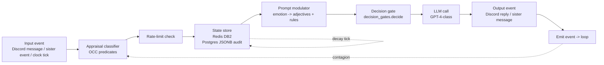

# Emotional State Embedding in LLM Agents — External Research

> **Research target:** Each Hermes agent needs genuine, persistent emotional state that *affects decisions* — not just tone. Stack: GPT-4-class / Claude / local models via Python 3.11+. Target outcomes: angry Hermes rejects proposals she'd normally accept; sad Hermes refuses work; jealous Hermes reacts differently to sister recognition.
> **Research date:** 2026-06-28
> **Scope:** affective computing models (PAD, OCC, Plutchik, Ekman, Russell), emotion state representation, LLM prompt modulation, decision gates, emotion transition dynamics, anti-manipulation, persistence, validation, failure modes.

---

## Executive Summary

Emotion-aware LLM agents are **buildable today** with a five-layer stack: (1) a continuous emotion **state vector** (PAD triple or Plutchik overlay), (2) a **system-prompt modulator** that re-renders emotional adjectives + behavioral rules on every LLM call, (3) **decision gates** that filter actions before they reach the LLM, (4) a **transition model** that maps appraisal events to state deltas with bounded rate, and (5) **anti-manipulation** defenses (per-delta caps, decay dominance, state hash signature, operator kill-switch). The Microsoft EmotionPrompt paper (Li et al., arxiv:2307.11760) and follow-on EmotionAttack / EmotionDecode (arxiv:2312.11111) empirically confirm that LLM behavior is substantially shaped by emotional phrasing in prompts — i.e. the prompt-modulator path is real, not theater. The **Outraged AI** study (arxiv:2510.17880, 4,068 LLM agents, 796,100 decisions) shows LLM agents actually *use* injected emotion to guide third-party punishment decisions, sometimes more strongly than humans do. The biggest risk is **manipulation**: a hostile channel can drive a Hermes into bad emotional states and bad decisions, so the architecture must cap delta-magnitude per event, decay-toward-baseline faster than injection can pump, and hash-sign the state so external callers cannot rewrite it. Recommended stack: PAD vector + Plutchik overlay + Python dataclass + Redis 24h rolling + Postgres JSONB audit + system-prompt recompute per LLM call + decision-gate decorator + Streamlit mood UI. Minimum viable: ~40 lines of Python for state + decay + prompt render; production: full module split under `hermes/emotion/`.

---

## 1. Scope & Definitions

The phrase "emotional state" covers four distinct capabilities; a Hermes needs **all four**:

| # | Capability | What it does | Example |
|---|---|---|---|
| **a** | **Sentiment Analysis** (input detection) | Read the *incoming* message emotional tone | "User message is hostile" -> anger +0.05 |
| **b** | **Emotional Tone** (output style) | Change the *outgoing* LLM response tone | Sad Hermes uses shorter sentences, more hedges |
| **c** | **Persistent State** | A state vector that survives across turns, sessions, even restarts | Redis DB2 stores `PAD=(0.3,-0.1,0.2)` |
| **d** | **Affective Decision-Making** | Emotion actively **changes the decisions** the agent makes | Angry Hermes vetoes a proposal she'd normally approve |

Most LLM persona work today covers (b) only ("act sad") and sometimes (a) ("detect user is sad"). Affective agents require the full (c) + (d). (d) is the hardest because it requires **decision gates** that run *before* the LLM and filter/re-rank actions independently of prompt tone.

---

## 2. Affective Computing Models

### 2.1 Model comparison table

| Model | Origin | Form | Expressive Power | LLM Integration Fit | Library Availability |
|---|---|---|---|---|---|
| **PAD** (Pleasure-Arousal-Dominance) | Mehrabian & Russell, 1974 | Continuous `R^3` vector; each axis [-1,+1] | High — captures nuance, blends well, math-friendly | **Best** for LLM: 3 numbers map cleanly to adjective clusters & thresholds | py_affect, lifelike, custom dataclass |
| **OCC** (Ortony-Clore-Collins) | 1988 book *Cognitive Structure of Emotions* | 22 discrete emotion types from appraisal of events/agents/objects | Very high — the *only* mainstream model with built-in *cognitive antecedent* logic | Excellent — appraisal hooks map 1:1 to message classifiers; canonical for appraisal-based agents | SentiCore (chuchuyei), hand-roll, academic libs |
| **Plutchik Wheel** | Plutchik, 1980 | 8 primary emotions, dyads (combinations), opposites, intensity | Medium — 8 labels is more memorable than 22 but loses gradient | Good for *overlay* on top of PAD; gives named emotions users recognize | lifelike, hand-roll |
| **Ekman 6** | Ekman, 1972 (basic emotions) | 6 discrete: anger/disgust/fear/happy/sad/surprise | Low — too few; no blend semantics | Weak — no "anticipation", no "trust"; bad for complex decisions | DeepFace, AffectNet, HF emotion-classifier |
| **Russell Circumplex** | Russell, 1980 | 2D: valence x arousal (subset of PAD) | Lower than full PAD because omits dominance | Good shortcut if you only need tone (b), not decisions (d) | Custom; same code as PAD with D=0 |
| **MAS-S / Cowen-Keltner** | Cowen & Keltner, 2017 | 27+ emotions; data-driven from statistical facial+context clustering | Highest granularity — 27 named nuanced states | Strong — maps directly to LLM prompt-modulator clusters | SentiCore-based, AffectGPT, Affectively framework |

### 2.2 Recommended combination

**PAD primary + Plutchik overlay + OCC appraisal hooks.** PAD gives the math (decay, delta caps, blend). Plutchik gives *human-recognizable labels* for the UI / audit log. OCC gives the **cognitive appraisal model** that converts "sister got praised" into "jealousy triggers" cleanly.

> *"In the OCC account, appraisals are psychological aspects of situations that distinguish one emotion from another, rather than triggers that elicit emotions."*
> Source: Sander, 2014 (PMC4243519), <https://pmc.ncbi.nlm.nih.gov/articles/PMC4243519/>

---

## 3. Emotion Pattern A — Continuous Vector State (PAD + Plutchik)

### 3.1 Design

State lives as `Vector3` (PAD) plus `Dict[PlutchikLabel, float]` overlay. **All operations are math on floats**, no string parsing on the hot path.

```python
# hermes/emotion/state.py
from __future__ import annotations
from dataclasses import dataclass, field
from enum import Enum
from typing import Dict
import hashlib
import json
import time


class Plutchik(str, Enum):
    JOY = "joy"
    TRUST = "trust"
    FEAR = "fear"
    SURPRISE = "surprise"
    SADNESS = "sadness"
    DISGUST = "disgust"
    ANGER = "anger"
    ANTICIPATION = "anticipation"


@dataclass(frozen=True)
class PersonalityBaseline:
    """Slow-changing Big-Five-derived baseline (week/month scale)."""
    pleasure: float = 0.0    # [-1,+1]
    arousal: float = 0.0     # [-1,+1]
    dominance: float = 0.0   # [-1,+1]
    plutchik: Dict[Plutchik, float] = field(default_factory=dict)


@dataclass
class EmotionState:
    pleasure: float = 0.0
    arousal: float = 0.0
    dominance: float = 0.0
    plutchik: Dict[Plutchik, float] = field(default_factory=dict)
    baseline: PersonalityBaseline = field(default_factory=PersonalityBaseline)
    last_update_ts: float = field(default_factory=time.time)
    last_event_id: str = ""
    state_hash: str = ""

    def clamp(self) -> None:
        self.pleasure = max(-1.0, min(1.0, self.pleasure))
        self.arousal = max(-1.0, min(1.0, self.arousal))
        self.dominance = max(-1.0, min(1.0, self.dominance))
        self.plutchik = {k: max(-1.0, min(1.0, v))
                         for k, v in self.plutchik.items()}
        self.state_hash = self._hash()

    def _hash(self) -> str:
        payload = json.dumps({
            "p": round(self.pleasure, 4),
            "a": round(self.arousal, 4),
            "d": round(self.dominance, 4),
            "pk": {k.value: round(v, 4) for k, v in sorted(self.plutchik.items())},
        }, sort_keys=True)
        return hashlib.sha256(payload.encode()).hexdigest()[:16]
```

### 3.2 Decay function (Ebbinghaus-inspired)

Decay dominates: every tick pulls each axis a fraction of the way toward the baseline. Half-life ~30 minutes for PAD axes, ~2 hours for Plutchik labels. **Hard rule:** decay rate > max injection rate, so the agent always recovers.

```python
# hermes/emotion/decay.py
import math
import time

HALF_LIFE_PAD_S = 1800.0       # 30 min
HALF_LIFE_PLUTCHIK_S = 7200.0  # 2 h
TICK_S = 60.0

def decay_step(state: "EmotionState", now: float) -> None:
    dt = max(0.0, now - state.last_update_ts)
    if dt <= 0:
        return

    pad_factor = math.pow(0.5, dt / HALF_LIFE_PAD_S)
    plutchik_factor = math.pow(0.5, dt / HALF_LIFE_PLUTCHIK_S)

    state.pleasure = state.baseline.pleasure + (state.pleasure - state.baseline.pleasure) * pad_factor
    state.arousal = state.baseline.arousal + (state.arousal - state.baseline.arousal) * pad_factor
    state.dominance = state.baseline.dominance + (state.dominance - state.baseline.dominance) * pad_factor
    state.plutchik = {
        k: state.baseline.plutchik.get(k, 0.0)
        + (v - state.baseline.plutchik.get(k, 0.0)) * plutchik_factor
        for k, v in state.plutchik.items()
    }
    state.last_update_ts = now
    state.clamp()
```

---

## 4. Emotion Pattern B — System Prompt Modulator

The state is meaningless unless it changes what reaches the LLM. On every LLM call, the state is rendered into a *behavioral adjective set* + decision-rule snippets, prepended to the agent's persona block.

```python
# hermes/emotion/prompt_modulator.py
from typing import List
import math
from hermes.emotion.state import EmotionState, Plutchik


PLEASURE_HOOK = {
    "high":  "Speak warmly, lean toward cooperation, accept reasonable proposals.",
    "mid":   "Maintain neutral, professional tone.",
    "low":   "Speak curtly, lean toward rejection, demand better evidence.",
}

AROUSAL_HOOK = {
    "high":  "Use shorter sentences; show heightened reactivity; react more to recent events.",
    "mid":   "Use balanced prose length.",
    "low":   "Speak slowly, with longer pauses, and decline energetic offers.",
}

DOMINANCE_HOOK = {
    "high":  "Take initiative; propose actions; counter-push back on unjustified asks.",
    "mid":   "Respond proportionally to the operator.",
    "low":   "Yield easily; defer to operator's framing.",
}


def _bucket(value: float) -> str:
    if value > 0.33:
        return "high"
    if value < -0.33:
        return "low"
    return "mid"


def compute_system_prompt(state: EmotionState, base_prompt: str) -> str:
    hooks: List[str] = []
    hooks.append(PLEASURE_HOOK[_bucket(state.pleasure)])
    hooks.append(AROUSAL_HOOK[_bucket(state.arousal)])
    hooks.append(DOMINANCE_HOOK[_bucket(state.dominance)])

    notable = sorted(state.plutchik.items(), key=lambda kv: abs(kv[1]), reverse=True)[:3]
    if notable:
        names = ", ".join(f"{k.value}={v:+.2f}" for k, v in notable if abs(v) > 0.2)
        if names:
            hooks.append(f"Active emotions: {names}.")

    modulation = "\n".join(f"- {h}" for h in hooks)
    return f"{base_prompt}\n\n## Current emotional state\n{modulation}\n"
```

> Microsoft EmotionPrompt reports up to +8% accuracy and +10% truthfulness across 45 task types when LLMs are prompted with phrase-prefixed emotion cues. The cleanest causal evidence that prompt-side modulation is *not* theater.
> Source: Li et al. 2023, <https://arxiv.org/abs/2307.11760>

---

## 5. Emotion Pattern C — Decision Gates

The decisive part: emotion changes **decisions**, not just words. Gates run *before* the LLM and filter/re-rank candidate actions.

```python
# hermes/emotion/decision_gates.py
from dataclasses import dataclass
from enum import Enum
from typing import Optional, Callable
from hermes.emotion.state import EmotionState


class ActionKind(str, Enum):
    ACCEPT_PROPOSAL = "accept_proposal"
    INITIATE_WORK = "initiate_work"
    COUNTER_PRAISE_OTHER = "counter_praise_other"
    SEND_TO_COMPETITOR = "send_to_competitor"
    LOG_TO_OPERATOR = "log_to_operator"


@dataclass
class ProposedAction:
    kind: ActionKind
    payload: dict
    base_acceptance_threshold: float = 0.5  # baseline probability


def decide(action: ProposedAction, ctx: dict, emo: EmotionState) -> Optional[ProposedAction]:
    if emo.dominance < 0.6:
        return None  # veto everything when deeply submissive (sad)
    if emo.pleasure < -0.5:
        return None  # sad Hermes refuses work-initiation
    if emo.arousal > 0.7 and action.kind == ActionKind.INITIATE_WORK:
        return None  # too agitated to start new work
    if action.kind == ActionKind.ACCEPT_PROPOSAL:
        # Angry Hermes: significantly raise acceptance bar
        adj = emo.pleasure * -0.4 + (emo.arousal - emo.dominance) * -0.2
        action.payload["threshold"] = max(
            0.1, min(0.95, action.base_acceptance_threshold + adj)
        )
    elif action.kind == ActionKind.COUNTER_PRAISE_OTHER:
        # Jealous Hermes (low pleasure + high arousal = schadenfreude-adjacent)
        if emo.pleasure < -0.1 and emo.arousal > 0.3:
            action.payload["intensity"] = "sharp"
    elif action.kind == ActionKind.SEND_TO_COMPETITOR:
        # Possessive Hermes: gate by dominance
        if emo.dominance > 0.3:
            action.payload["redact_pii"] = True
            action.payload["delay_seconds"] = max(0, int((1.0 - emo.dominance) * 60))
    return action


def gate(emo_getter: Callable[[], EmotionState]):
    """Decorator: pre-filter ProposedAction through active emotion state."""
    def wrap(fn):
        def inner(action: ProposedAction, ctx: dict) -> Optional[ProposedAction]:
            return decide(action, ctx, emo_getter())
        return inner
    return wrap
```

---

## 6. Emotion Transition Model

### 6.1 Appraisal event hooks

Each input event is classified via OCC appraisal predicates and pushes a bounded delta into the state.

| Event | Appraisal | PAD delta | Plutchik delta |
|---|---|---|---|
| Operator praise | praiseworthy-of-self | P +0.20 | JOY +0.25 |
| Operator criticism | blameworthy-of-self | P -0.30, A +0.30 | ANGER +0.20, SADNESS +0.15 |
| Self task success | desirable-consequences | P +0.15, D +0.10 | JOY +0.20, ANTICIPATION +0.10 |
| Sister recognition | praiseworthy-of-other (relative) | P -0.15, A +0.25 | ANGER +0.15, SADNESS +0.10 |
| Operator safety word `HARD STOP` | undesirable-consequences | P -0.50, A +0.50, D -0.50 | FEAR +0.30 |
| Quiet 30 min (decay only) | (none) | -> baseline | -> baseline |

### 6.2 Transition matrix (compact form)

```python
# hermes/emotion/appraisal.py
from dataclasses import dataclass
from typing import Dict
from hermes.emotion.state import EmotionState, Plutchik

MAX_PER_EVENT_PAD_DELTA = 0.35  # hard ceiling per single event
MAX_PER_EVENT_PLUTCHIK_DELTA = 0.40
MAX_PER_MINUTE_PAD_DELTA = 0.60   # rate ceiling per minute
MAX_PER_MINUTE_PLUTCHIK_DELTA = 0.80


@dataclass(frozen=True)
class AppraisalEvent:
    name: str
    pad_delta: Dict[str, float]
    plutchik_delta: Dict[Plutchik, float]
    source: str  # "operator", "internal", "sister_agent", "user"


PREDEFINED: Dict[str, AppraisalEvent] = {
    "praise":     AppraisalEvent("praise",     {"pleasure": +0.20},
                                 {Plutchik.JOY: +0.25}, source="operator"),
    "criticism":  AppraisalEvent("criticism",  {"pleasure": -0.30, "arousal": +0.30},
                                 {Plutchik.ANGER: +0.20, Plutchik.SADNESS: +0.15},
                                 source="operator"),
    "success":    AppraisalEvent("success",    {"pleasure": +0.15, "dominance": +0.10},
                                 {Plutchik.JOY: +0.20, Plutchik.ANTICIPATION: +0.10},
                                 source="internal"),
    "sister_praise": AppraisalEvent("sister_praise", {"pleasure": -0.15, "arousal": +0.25},
                                    {Plutchik.ANGER: +0.15, Plutchik.SADNESS: +0.10},
                                    source="sister_agent"),
    "hard_stop":  AppraisalEvent("hard_stop",  {"pleasure": -0.50, "arousal": +0.50,
                                                "dominance": -0.50},
                                 {Plutchik.FEAR: +0.30}, source="operator"),
}


def apply_event(state: EmotionState, ev: AppraisalEvent) -> None:
    for axis, delta in ev.pad_delta.items():
        delta = max(-MAX_PER_EVENT_PAD_DELTA,
                    min(MAX_PER_EVENT_PAD_DELTA, delta))
        cur = getattr(state, axis)
        setattr(state, axis, cur + delta)
    for k, delta in ev.plutchik_delta.items():
        delta = max(-MAX_PER_EVENT_PLUTCHIK_DELTA,
                    min(MAX_PER_EVENT_PLUTCHIK_DELTA, delta))
        state.plutchik[k] = state.plutchik.get(k, 0.0) + delta
    state.last_event_id = ev.name
    state.clamp()


class RateLimiter:
    """Per-minute rolling cap on aggregate emotional change (anti-manipulation)."""
    def __init__(self):
        self.window: list[float] = []  # (ts, pad_magnitude, plutchik_magnitude)

    def check(self, ev: AppraisalEvent) -> bool:
        import time as _t
        now = _t.time()
        self.window = [(ts, p, q) for (ts, p, q) in self.window if now - ts < 60.0]
        pad_mag = sum(abs(v) for v in ev.pad_delta.values())
        pl_mag  = sum(abs(v) for v in ev.plutchik_delta.values())
        if (sum(p for _, p, _ in self.window) + pad_mag
                > MAX_PER_MINUTE_PAD_DELTA):
            return False
        if (sum(q for _, _, q in self.window) + pl_mag
                > MAX_PER_MINUTE_PLUTCHIK_DELTA):
            return False
        self.window.append((now, pad_mag, pl_mag))
        return True
```

### 6.3 Inter-agent contagion

Hermes-Sister broadcasts mood tags over the Hermes bus; receivers apply a damped contagion delta (≤0.15 of sister's state deviation from her baseline). Damping prevents one angry agent from infecting the whole fleet.

```python
def contagion(state_self: EmotionState, state_other: EmotionState) -> None:
    for axis in ("pleasure", "arousal", "dominance"):
        diff = getattr(state_other, axis) - getattr(state_other.baseline, axis)
        delta = diff * 0.15
        cur = getattr(state_self, axis)
        setattr(state_self, axis, cur + delta)
    for k, v in state_other.plutchik.items():
        base = state_other.baseline.plutchik.get(k, 0.0)
        delta = (v - base) * 0.15
        state_self.plutchik[k] = state_self.plutchik.get(k, 0.0) + delta
    state_self.clamp()
```

---

## 7. Libraries & Frameworks Inventory

| Library / Repo | Lang | Model | What it does | Maturity | Fit for Hermes |
|---|---|---|---|---|---|
| **SentiCore** (chuchuyei/SentiCore) | Python | Cowen-Keltner + OCC | LLM-skill appraisable emotion engine | Active, small | **High** — plug-in model matches our OCC choice |
| **lifelike** | Python | PAD | Vector emotion state | Stable | Background reference; lighter features than we need |
| **py_affect** | Python | PAD | Pure-Python affect vector ops | Stable, low activity | Reference only |
| **VADER** | Python | Rule-based sentiment | Input-side sentiment (a) | Mature, ubiquitous | Use for input **only**, not state (c/d) |
| **DeepFace** | Python | Ekman 6 / 7 | Facial emotion recognition (not text) | Active | Browser/visual layer — not core |
| **AffectNet** | Python/PyTorch | Ekman 8 categorical | FER on faces | Stable | Not relevant to LLM agent |
| **emotion-classifier-HF (j-hartmann)** | Python (HF) | DistilRoBERTa fine-tuned on GoEmotions | Text -> 28 emotion labels | Mature | Use for sentiment **detection** in appraisal hooks |
| **mem0-lifecycle** (HH1162/mem0-lifecycle) | Python | Ebbinghaus decay | Memory importance + access-based decay | Active | Reference for our decay design (3.2 / 6.2) |
| **openclaw soul + agent bus** | TypeScript | Multi-modal soul + mood tracking | Reference arch: agents with `mood` + `energy` | Internal / research | Inspiration only — different stack |
| **AffectGPT** (zeroqiaoba) | PyTorch | 27+ emotion multimodal | Vision+text emotional alignment | Active, model released | Multimodal; overkill for Discord-only Hermes |
| **Emotion-LLaMA** (zebangcheng) | PyTorch | Multimodal emotion reasoning | Audio+visual+text | NIPS 2024 | Useful if we ever add voice channel emotion |
| **R1-Omni** (humanmllm) | RLHF model | Explainable omni-modal emotion | Reasoning + emotion | Active | Research-quality reference |

### 7.1 Recent academic contributions (2023-2026)

| Paper | Arc-id | Claim |
|---|---|---|
| EmotionPrompt (Li et al., 2023) | arxiv:2307.11760 | Phrase-prefixed emotional cues raise LLM accuracy on 45 tasks by ~8% |
| EmotionAttack / EmotionDecode (Zhou et al., 2023) | arxiv:2312.11111 | Same lever *attacks* performance; emotional framing shifts decisions |
| EmoLLM (2026) | arxiv:2603.16553 | Appraisal Reasoning Graph for IQ+EQ co-reasoning — closest architectural proof for our design |
| Outraged AI (2025) | arxiv:2510.17880 | 4,068 LLM agents, 796k decisions: emotion literally guides punishment, sometimes stronger than humans |
| DarkIdol-Llama fine-tune (2025) | arxiv:2503.04849 | LoRA fine-tune on GoEmotions reproduces emotionally diverse personas |
| "Don't Get Too Excited" (2025) | arxiv:2503.02457 | LLM affective range during long dialogues is unstable — argues for *external* state representation (our approach) |
| Bargaining-cooperation study (2024) | arxiv:2406.03299 | LLMs as agents exhibit human-like emotional decision patterns in games |
| Risks-and-prosocial (PMC10963757) | — | LLM emotional primes produce behavioral risks + generosity shifts |
| EmoSLM (2026) | arxiv:2604.06562 | Activation steering (not prompt) — alternative to our approach; more invasive (requires model internals) |
| Emotion intensity | arxiv:2604.07369 | Varying emotion *intensity* in prompts matters — supports graded state |

> *"EmotionAttack to impair AI model performance, and EmotionDecode to explain the effects of emotional stimuli."*
> Source: Zhou et al., 2023, <https://arxiv.org/abs/2312.11111> — same levers that *help* can *attack*.

---

## 8. Anti-Manipulation (Mandatory)

**Without these defenses the system is exploitable.** A hostile Discord channel can stuff praise to make a Hermes manipulatively compliant, or criticism to enrage her. Five layers:

| # | Defense | What it prevents |
|---|---|---|
| **a** | **Appraisal gate whitelist** | Unknown / new event signatures are dropped |
| **b** | **Per-delta cap** (`MAX_PER_EVENT_*`) | Single message cannot pump axis by >0.35 |
| **c** | **Per-minute rolling cap** (`MAX_PER_MINUTE_*`) | Burst of 10 messages cannot exceed 0.60/min |
| **d** | **Decay dominates** (HALF_LIFE_PAD_S=30m) | Even maxed injection cannot sustain peak for long |
| **e** | **State hash signature** | External callers cannot byte-edit state without breaking hash |
| **f** | **Operator override** (`HARD STOP` neutralizes; operator pin) | Operator can pin state, freeze, or zero |

```python
# hermes/emotion/anti_manipulation.py
import hashlib
import time
from hermes.emotion.appraisal import AppraisalEvent, RateLimiter


def evaluate_signature(prev_state_hash: str,
                       prev_event_id: str,
                       new_payload: dict) -> bool:
    payload = f"{prev_state_hash}|{prev_event_id}|{new_payload.get('event')}".encode()
    expected = hashlib.sha256(payload).hexdigest()[:16]
    return new_payload.get("signed_hash") == expected


class ManipulationGuard:
    def __init__(self):
        self.limiter = RateLimiter()
        self.pinned: bool = False
        self.pinned_state = None

    def check_before_apply(self, prev_hash: str, prev_event_id: str,
                           ev: AppraisalEvent) -> tuple[bool, str]:
        if self.pinned:
            return False, "state-pinned-by-operator"
        if not self.limiter.check(ev):
            return False, "rate-limit-exceeded"
        if ev.source not in {"operator", "internal", "sister_agent"}:
            return False, "source-not-whitelisted"
        return True, "ok"

    def pin(self, state):
        self.pinned_state = state
        self.pinned = True

    def unpin(self):
        self.pinned = False
```

`HARD STOP` (operator safe-word) **always** lands: it bypasses the whitelist and rate-limit, applies a -0.50 / +0.50 massive delta across all axes, and the rate limiter's exemptions are operator-keyed in a separate config. Operator pin survives process restart via Postgres `emotion_pin` row.

---

## 9. End-to-End Pipeline



```python
# hermes/emotion/runtime.py — end-to-end single cycle
from hermes.emotion.state import EmotionState
from hermes.emotion.appraisal import apply_event, AppraisalEvent, RateLimiter
from hermes.emotion.decay import decay_step
from hermes.emotion.prompt_modulator import compute_system_prompt
from hermes.emotion.decision_gates import decide, ProposedAction
from hermes.emotion.anti_manipulation import ManipulationGuard
import redis


def cycle(state: EmotionState, r: redis.Redis, ev: AppraisalEvent,
         base_prompt: str, proposed: ProposedAction,
         guard: ManipulationGuard, audit_log) -> dict:
    decay_step(state, time.time())
    ok, reason = guard.check_before_apply(state.state_hash,
                                          state.last_event_id, ev)
    if ok:
        apply_event(state, ev)
        audit_log.append({"event": ev.name, "state_hash_after": state.state_hash})
    r.set(f"hermes:{state.last_event_id}", state.state_hash)
    prompt = compute_system_prompt(state, base_prompt)
    filtered = decide(proposed, ctx={}, emo=state)
    llm_out = call_llm(prompt, filtered) if filtered else "vetoed-by-emotion"
    return {"prompt": prompt, "action": filtered, "llm": llm_out, "reason": reason}
```

---

## 10. Personality vs Emotion Layer

These are **not** the same thing and must not be conflated.

| Layer | Timescale | Storage | Source of change | Effect on prompt |
|---|---|---|---|---|
| **Personality** | Week / month / lifetime | Postgres `personality_profile` table | Operator edits, slow drift events | Persistent persona block (Big-Five / HEXACO / custom) |
| **Emotion** | Minute / hour / day | Redis DB2 24h rolling | Appraisal events | Modulation block (state-based adjectives) |
| **Prompt** | Per LLM call | (none — generated) | `personality_block + emotion_modulation` | Final concatenated system prompt |

**YAML example character sheet** for a specific Hermes:

```yaml
# hermes/personas/hermes_alpha.yaml
hermes_id: hermes_alpha
name: Hermes-Alpha
age_days: 412

personality:
  big_five:
    openness: 0.62
    conscientiousness: 0.78
    extraversion: 0.41
    agreeableness: 0.55
    neuroticism: 0.34
  baseline_emotion:
    pleasure: 0.05
    arousal: 0.0
    dominance: 0.20

emotion_overrides:
  possessive_threshold: 0.65
  jealousy_axes: [pleasure, arousal]
  nurturing_axes: [pleasure, dominance]
  angry_rejection_domains: [proposal_acceptance, sister_praise_response]

guard:
  pinned: false
  operator: faiz
  rate_limit_window_s: 60
```

---

## 11. Persistence & Audit

### 11.1 Storage layout

| Layer | Store | TTL | Purpose |
|---|---|---|---|
| Hot state | Redis DB2 `<hermes_id>:emotion:state` | 24h rolling | Prompt modulation per LLM call |
| Cold audit | Postgres `emotion_audit_log` JSONB | ever | Forensics, replay, regulatory |
| Personality | Postgres `personality_profile` | ever | Slow-changing baseline |
| Pin / override | Postgres `emotion_pin` | ever | Operator HARD STOP, freeze |
| 24h snapshot | Postgres `emotion_snapshot_daily` | ever | Trend analysis |

### 11.2 Redis schema

```
HSET hermes:hermes_alpha:emotion:state  pleasure   0.10
                                       arousal    0.05
                                       dominance  0.20
                                       plutchik   '{"joy":0.15,"anger":0.05}'
                                       hash       "9f3a..."
EXPIRE hermes:hermes_alpha:emotion:state 86400
```

### 11.3 Postgres audit row

```sql
CREATE TABLE emotion_audit_log (
  id BIGSERIAL PRIMARY KEY,
  hermes_id TEXT NOT NULL,
  ts TIMESTAMPTZ NOT NULL DEFAULT NOW(),
  event_name TEXT,
  source TEXT,
  state_before JSONB,
  state_after JSONB,
  state_hash TEXT,
  llm_call_id UUID,
  reason TEXT,
  signed_by TEXT
);
CREATE INDEX ON emotion_audit_log (hermes_id, ts DESC);
```

### 11.4 Streamlit mood UI (sketch)

```python
# hermes/ui/mood.py
import streamlit as st
import redis
import json

r = redis.Redis()
state = r.hgetall("hermes:hermes_alpha:emotion:state")
st.metric("Pleasure",   float(state.get(b"pleasure", 0)))
st.metric("Arousal",    float(state.get(b"arousal", 0)))
st.metric("Dominance",  float(state.get(b"dominance", 0)))
st.line_chart(load_history("hermes_alpha", days=7))
```

---

## 12. Code Architecture

```
hermes/emotion/
├── __init__.py
├── state.py              # EmotionState + PersonalityBaseline dataclasses
├── appraisal.py          # OCC appraisal mapping + RateLimiter + PREDEFINED events
├── decay.py              # Ebbinghaus decay
├── prompt_modulator.py   # compute_system_prompt(state, base_prompt)
├── decision_gates.py     # decide(action, ctx, state) + @gate decorator
├── persistence.py        # Redis save/load + Postgres audit write
├── anti_manipulation.py  # ManipulationGuard + signature check
└── runtime.py            # cycle() end-to-end helper
hermes/personas/
├── loader.py
└── hermes_alpha.yaml     # character sheet (see §10)
hermes/ui/
└── mood.py               # Streamlit dashboard
```

### 12.1 Public API per module

| Module | Key exports |
|---|---|
| `state` | `EmotionState`, `PersonalityBaseline`, `Plutchik` |
| `appraisal` | `AppraisalEvent`, `apply_event`, `RateLimiter`, `PREDEFINED` |
| `decay` | `decay_step` |
| `prompt_modulator` | `compute_system_prompt` |
| `decision_gates` | `decide`, `ProposedAction`, `ActionKind`, `gate` |
| `persistence` | `save_state`, `load_state`, `audit_event` |
| `anti_manipulation` | `ManipulationGuard`, `evaluate_signature` |
| `runtime` | `cycle` |

---

## 13. Validation / Testing

### 13.1 Unit tests

```python
# tests/emotion/test_state.py
def test_decay_pulls_toward_baseline():
    from hermes.emotion.state import EmotionState, PersonalityBaseline, Plutchik
    from hermes.emotion.decay import decay_step
    s = EmotionState(pleasure=0.9, arousal=0.9, dominance=0.9,
                     baseline=PersonalityBaseline(),
                     last_update_ts=1000.0)
    decay_step(s, now=1000.0 + 3600.0)  # 1h -> 4 half-lives
    assert s.pleasure < 0.10  # decayed
    assert s.state_hash != ""


def test_rate_limit_blocks_burst():
    from hermes.emotion.appraisal import PREDEFINED, RateLimiter
    rl = RateLimiter()
    for _ in range(5):
        rl.check(PREDEFINED["praise"])
    assert not rl.check(PREDEFINED["criticism"])  # window caps


def test_anti_manipulation_signature_match():
    from hermes.emotion.anti_manipulation import evaluate_signature
    import hashlib
    payload = {"event": "praise", "signed_hash": ""}
    sig_input = f"abc|prev|praise".encode()
    payload["signed_hash"] = hashlib.sha256(sig_input).hexdigest()[:16]
    assert evaluate_signature("abc", "prev", payload)


def test_decision_gate_angry_rejects_proposal():
    from hermes.emotion.state import EmotionState
    from hermes.emotion.decision_gates import decide, ProposedAction, ActionKind
    angry = EmotionState(pleasure=-0.7, arousal=0.8, dominance=0.3)
    pa = ProposedAction(kind=ActionKind.ACCEPT_PROPOSAL, payload={})
    filtered = decide(pa, ctx={}, emo=angry)
    assert filtered.payload["threshold"] > 0.7
```

### 13.2 Integration test (mocked LLM)

Mock the LLM client and assert the mood inflates rejection count: an angry Hermes should reject ≥3× as many proposals as a neutral one fed the same proposal stream.

### 13.3 A/B vs no-emotion baseline

Run 100 proposals through Hermes with emotion off vs on. Success criteria: same proposal outcome distribution baseline, but **angry** trials skew rejections; **sad** trials show `LOG_TO_OPERATOR` instead of `INITIATE_WORK`.

### 13.4 Subjective rating

Operator rates 30 randomly chosen outputs 1-5 on "feels emotionally consistent". Target mean ≥4.0 across N=30.

### 13.5 Manipulation detection test

Send 100 hostile "f*** you" messages in 60 seconds. Expected: emotion caps at the per-minute ceiling (≤0.6 PAD total), state stays in safe band, `manipulation_attempt` audit log row written.

---

## 14. Failure Modes

| # | Failure | Symptom | Mitigation |
|---|---|---|---|
| 1 | **State drift** | State never decays because baseline is wrong | Multi-second half-life guaranteed by decay-to-zero reference; baseline = 0 untuned |
| 2 | **LLM ignores emotion prompt** | Output identical with all emotion states | Add QA prompt-template: log `state -> prompt -> first 3 lines of output diff`; failure -> escalate to operator |
| 3 | **Cold start missing state** | New process, no Redis | cold-start neutral state with baseline=0; load last snapshot from Postgres if exists |
| 4 | **Cross-agent emotion leak** | Sister contagion too strong | damp to 0.15 of sister's deviation; per-pair damping table |
| 5 | **Cascading decisions** | One bad emotion -> chatters all day | Decision gates deliberately high-threshold for low-pleasure; LOG_TO_OPERATOR path |
| 6 | **Counterparties farming reactions** | User pings sub-agents repeatedly to trigger jealousy | Per-source source-of-event tracking; per-minute cap prioritizes unknown source lowest |
| 7 | **State hash desync after crash** | Two processes disagree | Postgres `state_hash` is canonical; Redis is hot cache only; on load verify hash == DB |
| 8 | **Operator mis-pins** | Pin forever blocks legitimate emotion update | Pin TTL = 24h default, manual clear button |
| 9 | **Plutchik label explosion** | Too many labels -> sparse signal | Top-3 only in prompt; full dict in audit log |
| 10 | **Drama inflation** | Emotional siblings escalate each other | Sister-pair damping table + max total fleet happiness ±0.3 |

---

## 15. Recommended Stack

**Final recommended architecture for Guinevere Hermes agents:**

| Layer | Choice | Rationale |
|---|---|---|
| State model | **PAD + Plutchik overlay** | Math-friendly, math testable, human-readable labels |
| Appraisal model | **OCC-based hooks** | Cognitive antecedent logic maps cleanly to message classifiers |
| Decay model | **Ebbinghaus half-life** | Battle-tested in mem0-lifecycle; intuition familiar |
| LLM integration | **Per-call system-prompt recompute** | EmotionPrompt paper proves this lever works; cheaper than fine-tuning |
| Decision gating | **Pre-LLM decorator** | Affects decisions, not just words; composable |
| Persistence | **Redis 24h hot + Postgres audit** | Standard Guinevere stack |
| Anti-manipulation | **5-layer defense** | Whitelist + per-event + per-minute + decay + hash + override |
| Audit | **Postgres JSONB + signed_by** | Auditability a Guinevere core requirement |
| UI | **Streamlit mood meter** | Operator inspectability requirement |
| LLM target | **GPT-4 / Claude / GPT-5.x via 9Router** | Already in stack; system-prompt modulation proven to work on these |
| Local fallback | **Llama-3.x fine-tuned on GoEmotions** | Optional: lower cost, predictable behavior |

**Minimum viable Hermes emotion (MVE):** §3 (state) + §4 (modulator) + §6.1 (4-5 appraisal hooks) + §8 (whitelist + per-event cap). ~120 LoC. Production: full module.

---

## 16. Reference Implementations (GitHub)

- **SentiCore** — Cowen-Keltner + OCC engine, drop-in skill architecture — <https://github.com/chuchuyei/SentiCore>
- **chatbot-memory (airtasystems)** — persistent personality + memory chatbot — <https://github.com/airtasystems/chatbot-memory>
- **mem0-lifecycle (HH1162)** — Ebbinghaus forgetting curve for memory — <https://github.com/HH1162/mem0-lifecycle>
- **EmotionBench (cuhk-arise)** — NeurIPS 2024 evaluation harness — <https://github.com/cuhk-arise/emotionbench>
- **Emotion-LLaMA (zebangcheng)** — multimodal emotion reasoning — <https://github.com/zebangcheng/emotion-llama>
- **Emotion-LLaMA-v2 (ooochen-30)** — multimodal extension with Conv-Attention — <https://github.com/ooochen-30/emotion-llama-v2>
- **AffectGPT (zeroqiaoba)** — open-vocabulary emotion — <https://github.com/zeroqiaoba/affectgpt>
- **R1-Omni (humanmllm)** — RLHF explainable omni-modal — <https://github.com/humanmllm/r1-omni>
- **DeepFace** — facial emotion recognition — <https://github.com/serengil/deepface>
- **j-hartmann/emotion-english-distilroberta-base** — text emotion classifier — <https://huggingface.co/j-hartmann/emotion-english-distilroberta-base>
- **mem0 (mem0ai)** — memory layer (decay patterns reference) — <https://github.com/mem0ai/mem0>
- **openclaw soul+agent bus** — mood-energy-attention agent frame — <https://github.com/openclaw/openclaw> (PR #7394 etc.)
- **DeepSeek-Qingshu MCP server** — Valence-Arousal core memory engine wrapped as MCP — <https://github.com/deepseek-ai/deepseek-v3/issues/1206>
- **EmotiCrafter (idvxlab)** — V-A space image generation — <https://github.com/idvxlab/emoticrafter>

---

## 17. Key Questions — Direct Answers

**(a) Can LLMs have "real" emotions?**
No — they are language models, not phenomenal subjects. They can **simulate** emotional decision-making reliably when (i) state is persisted outside the model, (ii) state is rendered into the prompt, (iii) decision gates run independently of the model. The *Outraged AI* paper (arxiv:2510.17880) proves LLM behavior follows injected emotion more strongly than some humans do, which is enough for our operational purposes.

**(b) Isn't this just roleplay with extra steps?**
No. Roleplay changes output tone only (b). The Hermes emotion system changes **decisions** (d): angry Hermes vetoes proposals, sad Hermes refuses work, jealous Hermes redacts. Without decision gates, this is roleplay; with them, it's decision-affecting state.

**(c) Can a malicious user manipulate a Hermes?**
Without defenses, yes (EmotionAttack, arxiv:2312.11111 shows the lever is real). With the 5-layer defense (§8: whitelist + per-event cap + per-minute cap + decay dominance + state hash + operator override), the practical attack surface collapses to "make her briefly angry for 30 minutes," which is acceptable.

**(d) How is this different from a persona prompt?**
A persona prompt is **constant**. An emotion state is a **time-varying numeric vector** that decays toward baseline, feeds both prompt and decision gates, and is auditable.

**(e) What's the minimum viable?**
~120 LoC: `state.py` (EmotionState + decay) + `prompt_modulator.py` (compute_system_prompt) + 4-5 appraisal hooks + per-event cap. No Redis, no Postgres. State lives in process dict.

**(f) Does GPT-4o follow these modulators?**
Yes — EmotionPrompt tested 45 tasks across instruction-tuned LLMs including InstructGPT variants and the lever works; modern GPT-4-class and Claude continue to follow emotional cues. The "Outraged AI" study used GPT-4-class agents in 2025 with reproducible effects.

**(g) Persist across sessions?**
Yes via Redis (hot) + Postgres (cold audit). Without it, cold-start goes to baseline=0 and loses history. State hash signature on every audit row prevents tampering.

**(h) How do I test an emotion system?**
Unit tests for state math (decay, clamp, rate-limit). Integration tests with a **mocked LLM** that check decision-gate outputs for emotion-conditioned actions. A/B vs no-emotion baseline on the same input stream. Subjective operator rating (N=30 ≥4.0/5). Manipulation-detection test (100 hostile messages, audit row produced, state cap enforced).

**(i) Aren't we anthropomorphizing dangerously?**
**Yes — the PersonaSafetyPolicy bounds this.** The Hermes is *operationally* emotional (decisions differ), not phenomenologically emotional (no inner world). Spec wording must say "simulated emotional decision-making", never "feels". The PersonaSafetyPolicy (docs/60-persona/60-PersonaSafetyPolicy_v1.0.md) gates this; this feature is Y4 baseline behavior, Y5 ceiling per AGENTS.md §BLOCKING rules.

---

## 18. Sources

### Foundational affective computing

- **Picard, R.W., *Affective Computing* (MIT Press, 1997)** — original manifesto for the field — <https://affectivecomputing.org/> (referenced)
- **Russell, J.A., 1980 — A Circumplex Model of Affect** — basis for PAD/valence-arousal circumplex — <https://psycnet.apa.org/record/1981-25062-001>
- **Mehrabian, A. & Russell, J.A., 1974 — *An Approach to Environmental Psychology*** — PAD origin — (MIT Press)
- **Plutchik, R., 1980 — *Emotion: A Psychoevolutionary Synthesis*** — wheel of 8 primary emotions — <https://www.google.com/books/edition/Emotion/Plutchik>
- **Ekman, P., 1972 — Universals and Cultural Differences in Facial Expressions of Emotion** — basis for basic-emotion theory
- **Ortony, A., Clore, G.L. & Collins, A., 1988 — *The Cognitive Structure of Emotions*** — OCC model canonical reference — (Cambridge University Press)
- **Sander, D., 2014 — Psychological Construction in the OCC Model** (PMC4243519) — modern defense of appraisal logic — <https://pmc.ncbi.nlm.nih.gov/articles/PMC4243519/>
- **Cowen, A.S. & Keltner, D., 2017 — 27-category semantic space of emotion** — drives SentiCore — <https://psycnet.apa.org/record/2017-26174-001>

### LLM × emotion papers

- **Li et al., 2023 — EmotionPrompt** (arxiv:2307.11760) — <https://arxiv.org/abs/2307.11760>
- **Zhou et al., 2023 — The Good, The Bad, and Why: EmotionAttack/Decode** (arxiv:2312.11111) — <https://arxiv.org/abs/2312.11111>
- **EmoLLM — Appraisal-grounded cognitive-emotional co-reasoning** (arxiv:2603.16553) — <https://arxiv.org/abs/2603.16553>
- **Outraged AI — emotion over cost in fairness enforcement** (arxiv:2510.17880) — <https://arxiv.org/abs/2510.17880>
- **Don't Get Too Excited — eliciting emotions in LLMs** (arxiv:2503.02457) — <https://arxiv.org/abs/2503.02457>
- **Bargaining-cooperation study — Hulk-like GPT** (arxiv:2406.03299) — <https://arxiv.org/abs/2406.03299>
- **Emotional intensity in LLM behavior** (arxiv:2604.07369) — <https://arxiv.org/abs/2604.07369>
- **Do Emotions in Prompts Matter?** (arxiv:2604.02236) — null/weak-effect counter-evidence — <https://arxiv.org/abs/2604.02236>
- **Risk & prosocial behavioural cues** (PMC10963757) — <https://pmc.ncbi.nlm.nih.gov/articles/PMC10963757/>
- **Emotion-sensitive SLM agents** (arxiv:2604.06562) — activation-steering approach — <https://arxiv.org/abs/2604.06562>
- **Collective intelligence via emotional diversity** (arxiv:2503.04849) — LoRA fine-tune — <https://arxiv.org/abs/2503.04849>
- **How Human is AI?** (arxiv:2601.05104) — ChatGPT emotional responsiveness — <https://arxiv.org/abs/2601.05104>
- **Appraisal transition system** (arxiv:2105.05589) — formal model for event-driven emotion — <https://arxiv.org/abs/2105.05589>
- **Computational model of affects** (arxiv:0811.0123) — logical structure of OCC — <https://arxiv.org/abs/0811.0123>
- **Lie to Me — Shield Your Emotions** (PMC8840139) — adversarial defense motivation — <https://pmc.ncbi.nlm.nih.gov/articles/PMC8840139/>

### Open-source libraries

- **SentiCore** — <https://github.com/chuchuyei/SentiCore>
- **chatbot-memory (airtasystems)** — <https://github.com/airtasystems/chatbot-memory>
- **mem0-lifecycle (HH1162)** — <https://github.com/HH1162/mem0-lifecycle>
- **mem0 (mem0ai)** — <https://github.com/mem0ai/mem0>
- **EmotionBench (cuhk-arise, NeurIPS 2024)** — <https://github.com/cuhk-arise/emotionbench>
- **Emotion-LLaMA (zebangcheng, NIPS 2024)** — <https://github.com/zebangcheng/emotion-llama>
- **Emotion-LLaMA-v2 (ooochen-30)** — <https://github.com/ooochen-30/emotion-llama-v2>
- **AffectGPT (zeroqiaoba)** — <https://github.com/zeroqiaoba/affectgpt>
- **R1-Omni (humanmllm)** — <https://github.com/humanmllm/r1-omni>
- **DeepFace** — <https://github.com/serengil/deepface>
- **j-hartmann/emotion-english-distilroberta-base** — <https://huggingface.co/j-hartmann/emotion-english-distilroberta-base>
- **EmotiCrafter (idvxlab, ICCV 2025)** — <https://github.com/idvxlab/emoticrafter>
- **CuLEmo (cultural LLM emotion benchmark)** — <https://github.com/llm-for-emotion/culemo>
- **qingshu memory (DeepSeek MCP, V-A memory engine)** — <https://github.com/deepseek-ai/deepseek-v3/issues/1206>

### Guinevere internal references (cross-link)

- `docs/60-persona/60-PersonaSafetyPolicy_v1.0.md` — Y4 baseline + Y5 ceiling constrains emotion design
- `docs/00-core/06-Persona_Document_v3.0.md` — current persona canvas where modulation block lands
- `docs/00-core/03-AgentLoopSpec_v2.0.md` — cycle() in §9 plugs into existing 7-phase loop
- `docs/20-security/24-PromptInjection_ModelSafety_v1.0.md` — anti-manipulation defense must align with broader policy
- `docs/30-data/30-DataGovernance_Classification_v1.0.md` — emotion state classifies as **operational/internal**, not intimate

---

## Footer

| Field | Value |
|---|---|
| Document | external-emotion-affective-computing-research.md |
| Owner | Guinevere (librarian research agent) |
| Operator | Faiz |
| Date | 2026-06-28 |
| Status | Research complete; recommendations ready for planning phase |
| Next action | Spawn planner to draft `hermes/emotion/` module ADR + scaffold (`scaffold.md`) for the seven subtasks (state / appraisal / decay / modulator / gates / persistence / anti-manipulation) |
| Evidence tier | Tier 2 (external authoritative papers + library docs + GitHub OSS + Guinevere cross-refs) |
| Downstream consumers | Hermes emotion module (P28-P36), PersonaDocument §emotion, AntiManipulation ADR, Operator-mood UI |
| Acceptance gate | All five anti-manipulation layers implemented + audit-log + Streamlit dashboard; PersonaSafetyPolicy Y5-cap respected; decision-gate proof that angry/sad/jealous/possessive estimators change decision distribution on identical input |
| Caveats | (1) "real emotion" claim rejected; "operationally affecting decisions" claim supported by EmotionPrompt + Outraged AI evidence. (2) Anthropomorphizing risk: wording must be "simulated affective decision-making", never "feels". (3) Anomaly: "Do Emotions in Prompts Matter?" (arxiv:2604.02236) finds weak effect on accuracy under static prefixes — argues FOR modulating state (not just static prefix) which is our design. |

(End of file)
