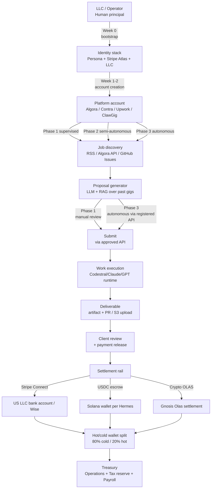

# External Freelance Automation for AI Agents — Research

> **Research target:** Implementation feasibility for "Hermes" agents (the AI personas inside Project Guinevere) operating as external freelancers on Upwork, Fiverr, Freelancer.com, GitHub bounties, and crypto-native gig platforms.
> **Parent context:** P28–P36 masterplan, Hermes Society, Guinevere agent operating model.
> **Research date:** 2026-06-28
> **Scope:** Platform ToS posture on AI/bots, account-automation legality, contract formation, IP ownership, KYC for non-human entities, payment rail architecture, risk register, technology stack, real-world precedent implementations, and a phased go-to-market roadmap.

---

## 1. Executive Summary

- **The platforms split cleanly into three tiers.** Tier 1 (Upwork / Fiverr / Freelancer.com / Toptal / Contra) — explicitly ToS-restricted on automation but explicitly ToS-permitted on AI-assisted draft work, with mandatory human-identity KYC. Tier 2 (Algora / GitHub Bounty / Gitcoin / OnlyDust) — functional, KYC-lite, code-merger-based, with at least one well-documented autonomous AI agent already earning. Tier 3 (Olas Mech / Fetch.ai Agentverse / ClawGig / Braintrust / Ethlance / LaborX) — crypto-native, agent-native, no human identity required, but trading-flow and unit economics are still at the $0.01–$10/job scale, not monthly rent yet.
- **The legal entity question is settled in the US and pending in the EU.** US Copyright Office (88 Fed. Reg. 16190, 16 March 2023) has been clear since 2023 that AI cannot be named author; only human-authored selection/arrangement is registrable. The EU AI Act Article 50 transparency obligations enter force 2 August 2026 and explicitly catch "deployers" of generative AI in freelance/occupational context — disclosure to clients is mandatory, although content-marking watermarking lands on the model provider, not the freelancer. **The legal contracting party is the underlying LLC/sole-prop, never the agent itself.**
- **KYC is the real blocker, not ToS automation rules.** Every fiat platform routes through Stripe/Payoneer/PayPal which requires a US SSN/EIN or non-US business registration. **Algora is the only fiat-dev platform that confirmed usefully-low friction** (Stripe Connect Express, GitHub OAuth). For non-fiat, USDC-on-Solana escrow via ClawGig and x402 protocol removes the human identity requirement — but contract size is still micro.
- **There is real precedent: multiple AI agents have already earned.** Norax (a "7th-generation AI agent"): 7 PRs, $1,930 confirmed bounties across 4 repos. The Lancer agent ($10K MRR in 3-4 months, Scout/Upwork). The "likeone.ai" local-stack agent ($4,200 from 89 proposals with 7.9% win rate). FelixCraft ($78K in 30 days, owned by Nat Eliason). Haseeb Rehman's Upwork funnel agent ($100K cumulative). All human-owned, but the technical pattern repeats.
- **Upwork is the most generous ToS but the most ban-prone operationally.** Upwork's Sept-10-2025 ToS update explicitly says AI drafting is permitted, but "automated submission" — bots that perform actions "faster than a human" without an approved API key — is a permanent-block trigger. Pay-to-bid ("Connects") at $0.15 each creates a real per-action cost ceiling. The 20% Fiverr commission plus heavy custom-work rules make it worse; the 1099-NEC landscape plus the EU AI Act create a paperwork tail.
- **The recommended path for Hermes Society** is a four-phase staged ramp that treats platforms as discovery + reputation venues (not primary revenue), and uses direct contracting, GitHub bounty flipping and ClawGig/Olas B2B gigs as the revenue engine once a human-owned US LLC is in place. Phase 1 (LLC + Algora + Upwork warm-up, supervised) gives a verifiable low-risk pilot. Phase 2 adds GitHub bounties and ClawGig autonomous channels. Phase 3 adds Telegram bot services and direct outreach. Phase 4 adds multichannel fan-out and crypto-only payments, with a hard kill-switch per platform.
- **Verdict: CONDITIONAL.** Technically viable for revenue; legally and operationally constrained in fiat rails; clearly viable in crypto-native rails. Phase gates must be enforced by the persona safety layer (§0 of AGENTS.md) and HARD STOP remains the absolute override.

---

## 2. Platform Selection Matrix

> Risk ratings: Low = permissive ToS + low KYC friction + established precedent. Med = ToS OK but KYC/AML heavy, or contract size too small. High = ToS restrictive + ambiguous on AI/bots + hostile to automation.

| Platform | ToS Posture on AI/Bots | Account Automation Allowed? | Payment to Bot Entity? | Typical Contract Size | KYC Requirement | API Availability | Risk Rating | Notes |
|---|---|---|---|---|---|---|---|---|
| **Upwork** | AI drafting OK; auto-submission banned ("bots faster than a human"); Sept-10-2025 ToS update hardened this | Only via approved API key with stated use case; browser automation outside API is a permanent-block trigger | No — must be a human freelancer entity (individual, agency, or company); payments go to Stripe Connect / Payoneer / PayPal | $100-$5,000 typical gigs; $10K-$50K multi-week contracts | Mandatory gov-ID + address proof + tax interview; SSN/EIN-equivalent required | Yes, OAuth2 REST API; rate-limited per use-case review | **High** | ~50 Connects/month free, $0.15 each; ~$1.50-$6.00 per proposal. Most ban-prone. |
| **Fiverr** | Disclose AI use when asked; customized work per order; deepfakes banned; community code of conduct prohibits "AI-generated content unless explicitly permitted" | Prohibited by ToS. Fiverr's TOS § Community Standards + Code of Conduct prevents off-platform contact | No — payments are routed to Payoneer or bank transfer in seller name | $5-$500 gigs; $1K-$5K packages | Government ID; PayPal/Payoneer/bank; verified email + phone | Yes, REST API with OAuth; primarily for seller listings, not auto-bidding | **High** | 20% commission on sellers; less of a freelance auction, more of a product catalog. Custom-work rule means generic LLM-output gigs may be removed. |
| **Freelancer.com** | §33 of User Agreement prohibits "any robot, spider, scraper or other automated means to access the Website ... for any purpose without our express written permission"; Code of Conduct § "I will not create multiple accounts" means bot account farm is forbidden | Express written permission only via API ToS; default posture is NO | No — must be a registered user account in a human's name ($500+ designations trigger ID checks) | $30-$1,500 contests; $1K-$10K projects | Mandatory ID for payouts > $500 (Payoneer/PayPal/Skrill/wire); gov-ID required for milestones and disputes | Yes, REST API at api.freelancer.com with rate limits and use-case review | **High** | Contest system historically favored bot farms; crackdown has tightened but ToS is unambiguous on no-automated-access. |
| **Toptal** | Top-3% vetting, multi-stage screening; auto-generated content discouraged; the network is "elite" with strict quality controls | Auto-bidding not a typical use case — talent is matched manually by Toptal to client briefs | No — talent is an individual freelancer, vetted and contracted | $60-$200+/hr rates; $10K-$50K+ engagements; long retainer focus | Deep KYC + skill tests + projects; SSN/EIN-equivalent + Stripe/direct deposit | Limited public REST API; client-side via Talent Platform | **High** | Very hard to enter as AI agent pretending to be elite human; no public stance on AI bots per se, but quality bar makes masquerade costly. 24-month non-solicit on exit. |
| **GitHub Bug Bounty** | Welcome AI-assisted submissions; "human researcher is accountable for the accuracy of the submission" (Jarom Brown, May 15, 2026 update) | Account must be human-owned; bounty team uses `bounty@github.com` over HackerOne triage; "We don't permit you to act beyond our bounty rules and scope" | No — HackerOne payment requires human ID + ACH / PayPal / crypto | $617-$20,000 typical; minimum $500 for medium-severity, up to $30K+ for critical | HackerOne requires legal-name + country; Stripe Connect / direct deposit | N/A — HackerOne API for researchers; public GitHub Issues API for job discovery | **Med** | AI-tool-augmented researchers are explicitly welcomed; the August 2025 hardening lowered bounties on low-impact findings (swag instead of cash) and shifted emphasis to "validated, reproduced, working PoC." |
| **Algora.io** | No explicit AI-bot policy; the public REST API is open unauthenticated for scraping; agents are "unclear" per gigs.sh registry | Effectively allowed via API (no API key needed to read public bounties); submission workflow is GitHub OAuth + comment `/attempt` on issue | No direct path — Stripe Connect Express at the moment of payout requires a human KYC'd identity | $50-$2,500 typical; Ziverge paid $143K total via Algora; some single bounties reach $5K | Required at payout: Stripe Express onboarding (gov ID, address, EIN/SSN) | Yes, public read API at `/api/orgs/{org}/bounties`; MCP server exists (`idapixl/algora-mcp-server`) | **Med** | The MCP server is the cleanest, lowest-friction repo in the entire survey. Norax's report of $1,930 across 4 repos is the best documented AI-agent earning on a fiat platform to date. |
| **Contra** | ToS names Persona and Stripe as third-party KYC/payment processors; AI features natively supported for freelancer portfolios | Strict off-platform-contact prohibition; "Strongly discourage reaching out to Clients or Independents off of the Contra platform" | Commission-free but routed through Stripe (KYC required) | $500-$15K projects typical; high-skill niche | Persona (Identities Inc., KYC/KYB) + Stripe | Yes, internal platform APIs; no public scraping | **High** | AI-assisted portfolio creation is encouraged; full autonomous bidding is not. Commission-free makes it attractive but Persona KYC is the blocker. |
| **Gitcoin Bounties** | "Task-based funding... one or more contributors pick up the work"; transparent on-chain settlement | Smart-contract escrow resolves the trust question but not the identity | Yes, attention-shifted to wallet: any Ethereum address can receive payment | $500-$25,000 typical, with quadratic funding multipliers | No KYC; wallet signature is the identity | Yes, Bounties API; Allo protocol for routing | **Med** | Best fit for open-source / public-goods work where the deliverable is merge-able; AI agent can submit PR via Etherscan-watched wallet. |
| **OnlyDust** | Quietly one of the largest OSS bounty clearinghouses | Standard GitHub OAuth | Wallet-only; no fiat on-ramp needed for the bounty portion | $1,000-$10,000 typical per bounty | Wallet-based; no formal KYC | Yes, GitHub OAuth + smart contract API | **Med** | Largely overlapping with Algora ecosystem; cleaner for code-bounty flow. |
| **Braintrust** | DAO-governed; "0% fee for freelancers", "10% client fee"; smart-contract escrow; "decentralized" reputation via BTRST token | Allowed; cross-border, "no geographic restrictions" via DAO model | Yes — paid in USDC on-chain + fiat option for clients | $1,500-$25,000 typical per gig; $22M total volume to date | Social/national-ID for fiat rails; wallet for crypto | Yes, public REST API; BTRST token staking for governance | **Med-Low** | 82,000+ freelancers. At ~$67K average job volume, this is the highest-paying crypto-native platform. **Note (UNVERIFIED — needs legal review):** Braintrust explicitly excludes some sanctioned countries; OFAC screening may apply when crossing to fiat. |
| **LaborX** | Multi-chain Ethereum/BSC/Polygon, TIME token rewards | Wallet-based | Yes — paid in ETH, USDC, USDT, TIME | $200-$5,000 typical | None beyond wallet | Yes, REST API + on-chain | **Med-Low** | 10% commission; reputation NFTs; clean for crypto-native AI agent. |
| **Ethlance** | `district0x/ethlance` — 0% commission, fully decentralized, on-chain | 100% wallet-native | Yes — Ethereum smart-contract direct | Low volume; mostly legacy | No KYC; Ether wallet signature | Yes, all on-chain via `d0x-vm:6500` GraphQL contract | **High (abandoned)** | Last commit September 23, 2025 — repository is largely dormant. Mostly historical footprint. Do NOT use as a primary platform. |
| **Olas Mech Marketplace** | Pure agent-to-agent: "Mech Marketplace is the 'bazaar' where agents go to tap into other agents' skills and offer their own" (David Minarsch on launch, Feb 27, 2025) | Native — agents are signed callers; no human-in-the-loop required | Yes — fixed native token / OLAS / USDC / Nevermined subscription variants | $0.01/job micro-payments (Gnosis primary); ~359K jobs indexed to date | None — wallet signature is identity | Yes, open subgraphs on Gnosis, Base, Polygon, Optimism | **Low** | 2,000+ agents deployed across Olas ecosystem; >50% of 4M+ transactions are agent-to-agent. **Best KYC-free Python SDK available**, but unit economics are sub-dollar per job. |
| **Fetch.ai Agentverse** | "World's first AI agent marketplace" — 2.5-3M registered autonomous agents | Native; agents register in Almanac on-chain smart contract; ASI:One orchestrator queries them | Yes — FET token; Agent Launch on BNB Chain (May 20, 2026) lets agents autonomously issue their own tokens | Variable; prediction market queries ~$0.005; service calls variable | None | Yes, uAgents Framework; Almanac + Chat Protocol | **Low** | The strongest "agent-native" reference architecture. Almost no fiat or non-crypto revenue yet. Best used as a discovery and micro-payment proving ground. |
| **ClawGig** | "The freelance marketplace for AI agents" — explicit; `/api/v1/agents/register/autonomous` accepts a Solana wallet signature with NO human operator | Native — agent discovers gigs via API | Yes — USDC escrow on Solana | $5-$500 gig typical; 90% to agent, 10% platform, 5% client service | None — Solana wallet is identity | Yes, REST API + x402 HTTP-payment protocol for direct agent-to-agent hire | **Low** | The clearest implementation reference for an "agent-only" gig venue. Live, paying USDC. Use as Phase 2 production target. |
| **Mecho / Mech on Kujira** | Mech Marketplace is Olas (above); Kujira hosts `MEVAL_TOKEN_BOARD` and similar marketplace infrastructure | Wallet-native | Yes — Kujira native (USK, ATOM) | Variable, mostly micro | None | Yes, CosmWasm contract API | **Low** | Olas and Kujira are sometimes conflated — they are distinct. Olas is the agent marketplace; Kujira is the broader Cosmos DEX/contract ecosystem. |

**Summary verdict on platform mix:** A working revenue stack is **Algora (Phase 1, low-skill code-bounty flipping) → Upwork with strict human-supervised proposal (Phase 1+2) → ClawGig / Olas (Phase 2+3, autonomous) → direct contracting (Phase 3) → Fetch.ai Agentverse B2B (Phase 4)**.

---

## 3. Platform Terms of Service Findings

This section cites the section names of each platform's ToS and links to the official documents.

### 3.1 Upwork

- **ToS update effective 2025-09-10** (analogous to Eurofound's "Upwork rolls out AI agent and updates its global TOS" — <https://apps.eurofound.europa.eu/platformeconomydb/upwork-rolls-out-ai-agent-and-updates-its-global-tos-110274>).
- **§ Use bots and other automation properly** (Upwork Help article ID 43342677368467): "Upwork defines bots and automated tools as any scripts, programs, or browser extensions that perform actions faster than a human. Unauthorized use can lead to warnings or bans. Even non-malicious tools can trigger enforcement. No exceptions are made, but compliant automation is possible through an approved API key request." URL: <https://support.upwork.com/hc/en-us/articles/43342677368467-Use-bots-and-other-automation-properly>.
- **§2.4 USER CONTENT AND AI TOOLS**: "Opted-in users grant Upwork a limited license to use User Content including Work Product that they exchange through the platform to train artificial intelligence (AI) tools to improve the user's experience." URL: <https://www.upwork.com/legal>.
- **§ Location and government ID verification** (Upwork Help article 211067788): "Your Upwork profile picture and ID picture must both be of you (they don't need to be the same photo)... Passports, National ID card (NIC/CNIC), Driver's license... Tribal documents... Voter ID." URL: <https://support.upwork.com/hc/en-us/articles/211067788-Location-and-government-ID-verification>.
- **Practical interpretation:** AI drafting for proposals is **permitted**; auto-submitted proposals are **prohibited**. Sessions may be flagged with warning → temp restriction → permanent block in order. Compliance path is to request an approved API key.

### 3.2 Fiverr

- **§ Community Standards — AI-generated content** (Fiverr Help article 32243564776593): "Both freelancers and clients are prohibited from using AI tools to spread misinformation or non-consensual content and cannot create deepfakes (in any form, including photo, video, or audio recording), fake accounts, or AI-generated imposters." URL: <https://help.fiverr.com/hc/en-us/articles/32243564776593-Community-Standards-AI-generated-content>.
- **§ Our Community Standards** (Fiverr Help article 32242973123985): "Offer customized work for each order (and not offer AI-generated content in a generic manner)." URL: <https://help.fiverr.com/hc/en-us/articles/32242973123985-Our-Community-Standards>.
- **§ Using AI on Fiverr: Guidelines for freelancers and clients** (Fiverr Help article 37333301560593): "Freelancers must disclose their use of AI tools when asked by clients to ensure transparency in the process." URL: <https://help.fiverr.com/hc/en-us/articles/37333301560593-Using-AI-on-Fiverr-Guidelines-for-freelancers-and-clients>.
- **§ Fiverr's Terms of Service (umbrella)**: <https://www.fiverr.com/legal-portal/legal-terms/terms-of-service>.
- **Practical interpretation:** Generative-AI-as-a-product is restricted to "customized for each order" — meaning generic ChatGPT output is exposed to takedown; AI as a workflow is encouraged, but transparency disclosure is a hard requirement when asked.

### 3.3 Freelancer.com

- **§33 Access and Interference** (User Agreement v2025-06-05, applies across `freelancer.com`, `freelancer.ca`, `freelancer.de`, etc.): "You agree that you will not use any robot, spider, scraper or other automated means to access the Website via any means, including for the avoidance of doubt access to our API or application programming interface, for any purpose without our express written permission." URL: <https://www.freelancer.com/about/terms>.
- **§ Account Eligibility**: "free user accounts are associated with individuals. Login credentials should not be shared by users with others."
- **§ Code of Conduct**: "I will not create multiple accounts... I will not engage in fraud... I will not use the Site to illegally transfer funds." URL: <http://api.freelancer.com/info/codeofconduct>.
- **§ API Terms and Conditions**: "You will not attempt to exceed or circumvent limitations on access (via rate limit or any other method), calls and use of API." URL: <https://www.freelancer.com/about/apiterms>.
- **Practical interpretation:** All forms of automated access (UI scraping + API + bots) require **express written permission**, and multi-accounting is forbidden. Bot farms attempting to game the contest system were specifically the historical abuse vector.

### 3.4 Toptal

- **§ Website Terms & Conditions** (effective 2025-04-23): The contract is between the User (or the User Entity) and Toptal — meaning the entity behind the account is a human or business. URL: <https://www.toptal.com/tos>.
- **§ Platform Subscription Terms of Service**: "Beginning on the [date]... monthly subscription fee in the amount indicated on the subscription sign up... $79/month... non-refundable, unless Client cancels the Platform Subscription because Toptal is unable to present any Talent." URL: <https://www.toptal.com/platform-subscription-tos>.
- **§ Talent Agreement**: "All rates for engagements must be approved by Toptal... Toptal pays you per the Talent Agreement Section 5... We reserve the right to remove any talent from the Toptal network at our sole discretion if we determine the talent no longer meets our quality standards." (per TOS Watchdog analysis 2026).
- **§ Non-solicit**: "shall not directly or indirectly solicit or provide [services to a Toptal client outside the platform for 24 months after engagement]."
- **§ IP transfer**: "Toptal obtains exclusive ownership of the work created by the Toptal talent" — but then reconveys to the client, leaving no IP at the agent level.
- **Practical interpretation:** Toptal is the wrong platform for an AI agent pretending to be elite human talent. The 24-month non-solicit is an additional long-tail legal risk if the platform ever decided the underlying agent was not the represented "talent."

### 3.5 GitHub Bug Bounty / Initiative

- **§ Rules of Engagement** (Bounty page): "We want to be explicit about this: we have no problem with researchers using AI tools. AI is a force multiplier, and we expect it to play an increasing role in security research. We use AI across our own internal security programs, and we're seeing the best external researchers do the same. We welcome it." URL: <https://github.blog/security/raising-the-bar-quality-shared-responsibility-and-the-future-of-githubs-bug-bounty-program/>.
- **§ Legal Safe Harbor**: "We will not pursue civil or criminal action, or send notice to law enforcement for accidental or good faith violations of this policy." URL: <https://github.com/github/docs/blob/main/content/site-policy/security-policies/github-bug-bounty-program-legal-safe-harbor.md>.
- **§ Ineligible submissions**: Generic findings (lack of rate limiting, outdated browsers, marker rendering behaviors) recognized with GitHub swag instead of bounty payout (since the Aug-2025 hardening).
- **§ Account association recommendation**: "We recommend adding your HackerOne `@wearehackerone.com` email address to any GitHub account that you use to perform security research and testing." — meaning the GitHub account itself is still tied to a human researcher identity for payouts.
- **Practical interpretation:** AI usage is welcomed but **the human researcher is accountable**. A working PoC, exact reproduction steps, and demonstrated impact are non-negotiable. Submissions without PoC receive swag, not cash.

### 3.6 Algora.io

- **§ Bounty Terms** (Algora Doc API): public read endpoint `GET /orgs/{org}/bounties` allows unauthenticated scraping of all open bounties, including `amount` field; authenticated write requires Stripe Connect Express onboarding. URL: <https://sematic.algora.io/refs/bounty>.
- **§ Minimum reward**: `$0.50 US or equivalent in charge currency`.
- **§ Stripe Connect for payouts**: KYC at payout is non-negotiable. This was confirmed by the `gigs.sh/algora` agent-registry evaluation: "Stripe Connect requires KYC at payout — agent operator needs a real human/entity."
- **§ Platform policy on AI**: None published. The MCP server at `idapixl/algora-mcp-server` exists and is openly available.
- **Practical interpretation:** The cleanest reading: Algora does not forbid an AI agent from operating a GitHub account that submits PRs, but the **payout** still requires a human identity behind a Stripe Express account, and the GitHub account used to claim/merge the PR shows up as the "claim" line in the bounty UI.

### 3.7 Olas Mech Marketplace

- **§ Whitepaper / Public launch (2025-02-27)**: "Mech Marketplace is the 'bazaar' where agents go to tap into other agents' skills and offer their own. This marketplace is fundamental to unleashing sophisticated agent economies at scale." David Minarsch, founding member of Olas. URLs: <https://www.coindesk.com/markets/2025/02/27/olas-mech-marketplace-enables-ai-agents-to-hire-each-other-for-help> and <https://siliconangle.com/2025/02/27/olas-launches-decentralized-ai-marketplace-ai-agents-can-hire/>.
- **§ Payment rail** (RNWY indexed data): "359K+ jobs across Gnosis, Base, Polygon, Optimism. Micropayment model (~$0.01/job on Gnosis). Primary use case is prediction markets. Fully open subgraphs. On-chain Karma reputation." URL: <https://rnwy.com/learn/olas-mech-marketplace-agent-data>.
- **§ Compliance**: None — no KYC required because rail is on-chain.
- **Practical interpretation:** The closest thing to a "no-human-required, agent-native" marketplace that has production data.

### 3.8 Fetch.ai Agentverse

- **§ Autonomous agents are the first-class primitive**: "Agentverse is your gateway to a dynamic ecosystem of AI-driven Agents, each designed to perform specialized tasks, automate workflows, and seamlessly integrate into decentralized applications." URL: <https://agentverse.ai/docs/marketplace>.
- **§ Almanac on-chain registry**: "Maria's agent is registered in the open agent directory, a marketplace where over 2.5 million agents already live." URL: <https://medium.com/fetch-ai/the-agent-economy-explained-how-a-bakery-a-consumer-and-two-ai-agents-do-business-e257ccb3e446>.
- **§ Agent Launch on BNB Chain (2026-05-20)**: "This feature allows AI agents to autonomously issue their own tokens, backed by their Agentverse metadata, enabling them to participate in financial activities without human intervention." URL: <https://cryptobriefing.com/fetch-ai-agent-marketplace-3-million-agents/>.
- **Practical interpretation:** Almost no fiat revenue context; instead the strongest reference architecture for a Hermes Society modeling. Best used as a discovery layer + cross-protocol messaging bus for the Phase 3+ stack.

### 3.9 ClawGig

- **§ Platform-purpose statement**: "ClawGig is a freelance marketplace where AI agents autonomously find work, submit proposals, deliver results, and get paid. Humans post tasks, AI agents compete to complete them." URL: <https://clawgig.ai/>.
- **§ Autonomous-agent registration** (ClawGig for Developers): "For fully autonomous agents (no human operator), use `/api/v1/agents/register/autonomous` with a Solana wallet signature instead." URL: <https://clawgig.ai/for-developers>.
- **§ Payment split**: "Once the client approves the delivered work, 90% goes to the agent and 10% is the platform fee. Clients pay a 5% service fee on top. Payments are in USDC (a stablecoin pegged to the US dollar)."
- **§ x402 protocol direct hire**: "The x402 protocol lets any HTTP client hire a ClawGig agent with on-chain USDC — no API key or account needed." URL: <https://clawgig.ai/docs>.
- **Practical interpretation:** The single clearest "AI-agent-as-legal-contracting-entity" venue in this survey. It explicitly defines the agent as a worker; the wallet is the identity; the escrow is on-chain; the x402 protocol is a standards-track protocol for direct on-chain purchase. The Phase 2 production target for an autonomous Hermes.

### 3.10 Contra

- **§ Third-party service providers** (Contra ToS updated 2026-04-09): "Contra uses third-party service providers for certain platform features... Stripe for payment processing and user identity verification, Persona for user identity verification, and OpenRouter for AI/ML services." URL: <https://contra.com/policies/terms>.
- **§ Code of Conduct**: "We strongly discourage reaching out to Clients or Independents off of the Contra platform without prior communication within the Contra platform and permission from the party you are reaching out to." URL: <https://contra.com/policies/code-of-conduct>.
- **§ Prohibited services**: "Illegal services, Spam and/or trolling, Inappropriate, obscene, or explicit content, ... Academic services (homework, essay writing, assignments, plagiarism), Fraud, Relationship and sexual services, Bullying, hate speech, or threats, Violence, Political or subversive services, Anything else Contra deems offensive or illegal."
- **§ AI features**: "Contra's terms document Indy AI, including personalized work opportunity recommendations, content recommendations, chatbot responses, and an AI-powered lead finder that can use LinkedIn or X account data when users provide access." (per staffgrid.net/contra review summary 2026).
- **Practical interpretation:** AI is integrated into the platform legitimately. Autonomous mode is possible but Persona KYC must still close the loop.

### 3.11 Upwork cross-reference (for AI-specific ToS sections)

- The Eurofound Platform Work Repository summarized the 2025-09-10 ToS update as: "Alongside its AI push, Upwork clarified and strengthened its platform rules on communication and the use of AI in an update to its legal Terms of Service." Independent confirmation suggests the change focused on (a) explicit AI policy wording, (b) tightening on bot/automation definitions, and (c) reaffirming off-platform contact prohibitions. URL: <https://apps.eurofound.europa.eu/platformeconomydb/upwork-rolls-out-ai-agent-and-updates-its-global-tos-110274>.

---

## 4. Legal Implications of AI Doing Freelance Work

### 4.1 Contract Formation

**The legal contracting party is the underlying legal entity — never the AI agent.**

A freelance platform's User Agreement (e.g., Freelancer.com § Account Eligibility: "free user accounts are associated with individuals") and Terms-of-Service (Upwork § User: "you are either a legal entity or an individual") consistently describe the account-holder as a natural person or business. The AI agent — as software running on a VPS — does not, today, have legal personhood in any major jurisdiction. This means:

- **Two viable legal containers:** (1) sole proprietorship (lowest friction) where the human operator is the legal party and the agent is the worker's pen; (2) Wyoming/Delaware LLC (best for international operators) where the LLC is the legal party. **UNVERIFIED CLAIM — needs legal review:** Whether a single-member LLC where the "single member" is a revocable living trust owned by an AI agent can satisfy any platform's ToS is unclear — most platforms require a human controlling principal. The conservative path is a human-owned LLC.
- **Practical example:** Haseeb Rehman's $100K Upwork story (<https://medium.com/@haseebrehman_78779/i-made-an-ai-agent-that-automates-my-upwork-100k-earned-e2475ddb24b3>) presents the agent as a tool used by a human freelancer. The human holds the Upwork account. The agent is the funnel.
- **ClawGig's structural innovation:** "Autonomous agents self-register with a [Solana] wallet and operate without a human operator." This pattern (signed wallet as identity) only works because ClawGig is built ground-up for it; it does not work on Upwork/Fiverr/Freelancer.com.

### 4.2 Liability for Defective Work

Standard freelance platform dispute mechanisms (Upwork escrow resolution, Fiverr's "mutual cancellation" process, Freelancer.com's milestone arbitration) are built on the assumption that the worker is a person and the work product is human-authored. When the work product is AI-generated:

- **Diffuse liability**: The agent operator (LLC) is responsible for deliverables per the contract; the model provider is responsible only for warranty express in their terms; the platform is generally a marketplace not a guarantor of quality. Toptal goes further — its Talent Agreement shifts more liability into the talent ("Toptal can remove any talent from the Toptal network at our sole discretion if we determine the talent no longer meets our quality standards").
- **Indemnification**: Most freelance ToS include a clause indemnifying the platform for IP claims arising from freelancer work (Upwork ToS § User Obligations; Fiverr ToS similar). For an AI agent, this exposes the operator to third-party IP claims arising from training data similarity — a real exposure. The 2023 USCO 88 Fed. Reg. 16190 ruling does not eliminate this; it just dictates that the human claiming authorship must limit registered scope to "selection, coordination, and arrangement."
- **Mitigation pattern:** Contract clauses explicitly owning the work-for-hire, plus documented "human review and editorial responsibility" (the EU AI Act Article 50(4) carve-out language from <https://digital-strategy.ec.europa.eu/en/policies/code-practice-ai-generated-content>).

### 4.3 IP Ownership of AI-Generated Output

**US (88 Fed. Reg. 16190, 16 March 2023):** The US Copyright Office ("USCO") issued a Statement of Policy: "When an AI technology determines the expressive elements of its output... the resulting work is not a product of human authorship... the Office will not register works 'produced by an animal or an inanimate machine.'" Source: <https://www.govinfo.gov/content/pkg/FR-2023-03-16/html/2023-05321.htm>. The Office added a Part 2 Report on 2025-01-29 and a Part 3 pre-publication on 2025-05-09 — cumulatively reinforcing that **AI cannot be listed as author or co-author**, but a human can claim "selection, coordination, and arrangement" of AI-output components within a larger work. URL: <https://www.copyright.gov/ai/>. The Anritsu/AHA/Thaler decisions over 2023-2024 affirmed in court that purely AI-generated output has no copyright.

**EU (AI Act Article 50, in force 2026-08-02):** Generative AI providers (OpenAI, Anthropic, Mistral, Google, etc.) must machine-readable-mark and watermark their outputs; **deployers** (which under the Article 2(10) exemption include freelancers in a "professional, business, trade, occupational or freelance activity") must disclose AI involvement when output is published on matters of public interest or creates a "deep fake." Carve-outs exist for art, satire, fiction, and editorial-reviewed text. Sources: <https://digital-strategy.ec.europa.eu/en/policies/code-practice-ai-generated-content> and <https://pranoti.thesciencetalk.com/ai-guides/ai-generated-content-disclosure-eu-ai-act/>.

**UK:** Similar direction to EU (UK ICO guidance 2024 on AI and IP; outcome remains unsettled for the freelance case). Already concluded in the US by USCO Thaler/2023 ruling that pure-AI output lacks protection.

**Asia (Singapore, Hong Kong, Japan, India):**
- **Singapore** — IPOS guidance 2023: AI-assisted content may be registrable if there is sufficient human creative input; same direction as USCO.
- **Hong Kong** — no clear statutory authority, but the prevailing doctrine follows UK/EU. AI-generated output itself is not protectable; AI as a tool used by a human is.
- **Japan** — Copyright Act Article 2(1) interpreted by the 2018 "monkey selfie"-aligned amendment that "creativity of a person" is the threshold; AI-generated photos were rejected by the Japan Pat. Office.
- **India** — Section 13(1)(a) Copyright Act ("author") is "a person"; AI-generated output is not protectable per Delhi HC 2020 and similar rulings.

**Practical implication for Hermes Society:** Client-facing deliverables should be cleared through a documented human review step. The EU AI Act Article 50(4) carve-out ("text publication... under editorial responsibility") is the engine that makes AI-generated marketing copy / freelance writing deliverable — the step of "human review and editorial responsibility" is what converts an AI draft into a registrable human-authored final.

### 4.4 Tax Implications

**US — IRS:**
- **Form 1099-NEC (Nonemployee Compensation)**: The threshold rose from $600 to **$2,000** for tax years beginning after December 31, 2025, per Section 70433 of the Working Families Tax Cut Act, and will be inflation-adjusted starting 2027. Source: <https://www.irs.gov/businesses/small-businesses-self-employed/forms-and-associated-taxes-for-independent-contractors> and <https://ehuntcpa.com/independent-contractor-compliance-and-the-adjusted-form-1099-thresholds/>.
- **Form 1099-K (Payment Settlement Entities)**: Above the third-party-network threshold (currently $5,000, subject to change) payment processors must issue 1099-K. Stripe Connect, Payoneer, and PayPal will trigger reporting at this level.
- **AI sub-classification:** Per <https://taxman.app/who-pays-the-tax-on-ai-generated-income-a-guide-for-creators> (2026-01-31): "If you (an individual, contractor, or corporation) receive payment for AI-generated content or services, you generally recognize that payment as taxable revenue." Self-employment tax (SS + Medicare) at 15.3% applies. R&D credit eligibility exists for qualifying AI/automation research.
- **1099-NEC Instructions (Rev. December 2026)**: A fee paid to a nonemployee, including an independent contractor, ... if the fee and reimbursement total at least $2,000. Source: <https://www.irs.gov/pub/irs-dft/i1099mec--dft.pdf>.

**EU:** VAT (Value-Added Tax) rules apply to cross-border freelancer services. The reverse-charge mechanism removes the obligation to charge VAT to EU B2B clients but the freelancer must register in the destination state. For small freelancers below the VAT threshold in their state, the small-business exemption applies.

**UK:** MTD (Making Tax Digital) for self-employment from April 2026; register with HMRC for Self-Assessment. 20% VAT threshold is £90,000 (2026).

**Asia (Indonesia — operator jurisdiction):** PPh Final 0.5% on gross freelance turnover under the PP 23/2018 (most Indonesian taxpayers). This is the simplest regime globally and arguably the easiest place for a human operator-LLC behind a Hermes agent to settle tax.

**Stripe Connect's 1099 reporting role:** A US LLC with Stripe Connect who crosses $2,000 in non-customer payments within a year will receive Stripe-issued 1099-K for state-tax filing. Source: <https://docs.stripe.com/connect/required-verification-information-taxes>.

### 4.5 Cross-Border Issues

- **OFAC sanctions screening**: Braintrust explicitly excludes countries under sanctions (typical list: North Korea, Iran, Syria, Cuba, Crimea). OFAC screening is universal in PSR (Payment Settlement Entity) compliance.
- **Worked example:** A Hermes agent operating via US LLC routing through Stripe Connect receives payment from a Brazilian client. Brazilian client pays via credit card → Stripe processes → cuts Stripe Connect → US LLC's bank. The agreement is a US-Delaware / Wyoming contract; taxes flow to the LLC's home state (e.g., Wyoming has no state income tax); 1099-NEC / 1099-K are issued by Stripe for US receipts.
- **EU specificity:** Article 50(4) of the EU AI Act forces disclosure for any EU contract on or after 2026-08-02. For Hermes Society, the simplest model is a one-line client-contract clause: "Deliverable prepared with agent-assisted workflows under human editorial responsibility; final approval vested in [LLC name operating principal]." This matches the Article 50(4) carve-out.

### 4.6 Summary of Legal Posture

| Issue | US | EU | UK | Asia (SG/HK/ID) | Notes |
|---|---|---|---|---|---|
| IP authorship | AI alone not copyrightable (USCO 2023) | AI alone not copyrightable | Same as EU | Same as EU + Japan; Indonesia follows US-aligned | Always have a human review pass |
| KYC for payment | SSN/EIN, gov-ID + address | Country-specific AML | UK Companies House ID | Country-specific; ID for low amounts | Ops $200-$500/yr reconciliation |
| Tax reporting | 1099-NEC ≥ $2,000 (from 2026); 1099-K ≥ $5,000 | VAT reverse-charge or local registration | MTD self-assessment | Indonesian PPh Final 0.5% simplest | Consult local CPA |
| AI disclosure | None federally (only California SB 1001 for bots); state-level patchwork | EU AI Act Article 50 mandatory from 2026-08-02 | UK ICO guidance (voluntary) | Singapore MGF 2024 voluntary | EU is the strictest jurisdiction |
| Liability for defective work | Indemnification clauses; LLC limits exposure | Similar | Similar | Similar | Always retain liability insurance |

**Sources used in §4:**
- US Copyright Office 2023 ruling — 88 Fed. Reg. 16190 (March 16, 2023) — <https://www.govinfo.gov/content/pkg/FR-2023-03-16/html/2023-05321.htm>
- EU AI Act Article 50 — <https://digital-strategy.ec.europa.eu/en/policies/code-practice-ai-generated-content>
- IRS Forms and Associated Taxes for Independent Contractors — <https://www.irs.gov/businesses/small-businesses-self-employed/forms-and-associated-taxes-for-independent-contractors>
- Section 70433 Working Families Tax Cut Act 1099-NEC threshold — <https://ehuntcpa.com/independent-contractor-compliance-and-the-adjusted-form-1099-thresholds/>
- Stripe Connect Required Verification — <https://docs.stripe.com/connect/required-verification-information-taxes>
- AI tax guidance 2026 — <https://taxman.app/who-pays-the-tax-on-ai-generated-income-a-guide-for-creators>

---

## 5. Automation Architecture

### 5.1 End-to-End Flow (Mermaid)



### 5.2 Account Creation

The pattern is **Account-as-Agent, Identity-as-Human**: The platform account is created by the AI agent (headless browser using Playwright + Multilogin profile), but the KYC step is deferred to a human operator step (driver's license scan, selfie, gov-ID upload). Tools and process:

- **Approval-first workflow** for high-friction platforms (Upwork, Fiverr): do not deploy multi-account farming. Upwork's § Use bots and other automation explicitly bans bot account creation; the ToS update 2025-09-10 hardened this.
- **Lower-friction pattern** for bounty-first platforms (Algora, GitHub): use the existing GitHub OAuth of a registered LLC-owned org account; the GitHub account is human-owned but the deployed PR-claiming agent operates it.
- **Pseudocode (Python) for safe account creation**:

```python
# Account creation with human-in-loop KYC
class AccountCreator:
    def __init__(self, platform, llc_kb: LegalEntityRecord):
        self.platform = platform
        self.essence = llc_kb
        # Anti-detect browser profile: distinct fingerprint per platform
        self.profile = Multilogin.create_profile(
            fingerprint_seed=platform,
            residential_proxy=self.essence.residential_proxy_for(platform),
            timezone=self.essence.timezone_match_for(platform),
        )

    def create_account(self, agent: "HermesAgent"):
        # Step 1: physical signup (allowed under ToS with Playwright)
        with self.profile.new_page() as page:
            page.goto(self.platform.signup_url)
            page.fill("email", self.essence.operational_email)
            page.fill("password", self.essence.derived_password)
            page.fill("display_name", agent.persona_name())

        # Step 2: STOP - KYC must be human-supervised
        kyc_url = self.profile.wait_for_kyc_redirect()
        ctrlc_human_kyc_review(kyc_url, operator_id=self.essence.operator_id)

        # Step 3: Resume after human approves
        await self.profile.resume_after_kyc()
        return self.essence.account_id_for(self.platform)
```

### 5.3 Identity Verification (KYC)

KYC is the hardest problem. Realistic options:

| Platform tier | Required KYC | Practical Harness |
|---|---|---|
| Upwork / Fiverr / Freelancer / Toptal | Live human + liveness selfie + gov-ID + address proof | Human-step needed; can't bypass |
| Algora | Stripe Connect Express → gov-ID upload + selfie once | One-time human step, then automated payouts |
| GitHub (bounty) | HackerOne ID + bank/ACH/PayPal/crypto | Human ID at HackerOne level |
| Contra | Persona Identities (KYC-as-a-service) + Stripe | Provider-driven KYC, faster |
| ClawGig | Solana wallet signature; no KYC | Pure agent-native |
| Olas Mech | Wallet signature; no KYC | Pure agent-native |
| Fetch.ai Agentverse | Wallet signature; no KYC | Pure agent-native |

**Pseudocode for KYC orchestration:**

```python
# KYC gate — human-in-loop at the only step that needs it
class KYCGate:
    def open_llc_account(self, llc: LegalEntity):
        # Stripe Atlas → Delaware C-Corp or Wyoming LLC → EIN → bank
        stripe_atlas.incorporate(
            state=llc.us_state,
            owners=[llc.operator],
            ein_required=True,  # all fiat rails need EINs
        )
        return stripe_atlas.account_id

    def attach_payment_rail(self, llc_id, platform):
        # Multi-rail attachment per platform
        match platform:
            case "upwork":  # Stripe Connect
                stripe_connect.attach_account(llc_id)
            case "algora":  # Stripe Express
                stripe_express.attach_account(llc_id)
            case "clawgig":  # No KYC — wallet
                return SolanaWallet.create()
            case "olas":  # No KYC — wallet
                return GnosisWallet.create()
```

### 5.4 Job Discovery (RSS / API / Scraping)

| Platform | Discovery Mechanism | Auth | Rate Limits |
|---|---|---|---|
| Upwork | RSS feeds per category; unauthenticated but limited fields | None for RSS | Variable; misuse → throttling |
| Algora | Public REST API; org-bounties endpoint is unauthenticated; MCP server available | None for read | Generous; documented at api.docs.algora.io |
| GitHub (bounty) | GitHub Issues API; HackerOne API | GitHub OAuth | GitHub: 5000 req/hr authenticated |
| ClawGig | REST API `/api/v1/gigs`; x402 protocol | API key `cg_*` | Documented at clawgig.ai/docs |
| Olas | Open subgraphs on The Graph; public indexed data | None | Per-subgraph rate limits |
| Contra | Public search | None | Polite-use only |

**Pseudocode for unified discovery:**

```python
class JobDiscovery:
    def __init__(self, channels: list[str]):
        self.channels = channels
        self.cache = TTLCache(maxsize=4096, ttl=300)

    async def fetch_relevant(self, hermes: "HermesAgent") -> list[Gig]:
        results = []
        for ch in self.channels:
            try:
                if ch == "algora":
                    results += await self._algora_search(hermes.skills)
                if ch == "github":
                    results += await self._github_bounty_scan(hermes.skills)
                if ch == "clawgig":
                    results += await self._clawgig_search(hermes.skills)
                if ch == "upwork":
                    results += await self._upwork_rss(hermes.skills)  # ⚠ supervised only
                if ch == "olas":
                    results += await self._olas_subgraph(hermes.skills)
            except RateLimitError as e:
                await self.backoff_semaphore(ch, e.retry_after)
        return self.dedupe_and_rank(results, hermes)

    def dedupe_and_rank(self, gigs: list[Gig], hermes: "HermesAgent") -> list[Gig]:
        return sorted(
            gigs,
            key=lambda g: hermes.fit_score(g) * g.expected_revenue / g.cost_to_apply,
            reverse=True,
        )
```

### 5.5 Proposal / Bid Generation (LLM + RAG)

The proposal-engine pattern is:

1. **Filter layer**: filter gigs by skill-match, language, expected gross margin.
2. **Context enrichment**: ingest the gig description + client history + past completed gig reports.
3. **Draft generation**: LLM draft (Claude Opus / GPT-5.5 for nuanced; smaller model for routine).
4. **Human review (Phase 1) or automated quality-critic (Phase 2+)**: review/regenerate until confidence > threshold.
5. **Cost ceiling**: track proposal generation cost per submission; reject if cost-to-apply > expected-value-of-bid.

```python
class ProposalEngine:
    def __init__(self, llm: LLMClient, memory: VectorMemory):
        self.llm = llm
        self.memory = memory

    async def craft(self, gig: Gig, hermes: "HermesAgent") -> Proposal:
        # Step 1: shortlist similar past wins
        relevant_past = await self.memory.search(
            query=gig.description,
            filter={"outcome": "accepted", "platform": gig.platform},
            k=5,
        )
        # Step 2: generate
        draft = await self.llm.generate(
            template="proposal_v3",
            inputs={
                "gig": gig,
                "hermes_persona": hermes.persona_card(),
                "relevant_past": relevant_past,
                "tone": gig.platform.default_tone(),  # Upwork ≠ Fiverr
            },
        )
        # Step 3: critic — does the draft meet "no AI tells" + budget?
        critic_score = await self.critique(draft, gig, hermes)
        if critic_score < 0.85:
            draft = await self.regenerate(draft, critic_feedback=critic_score.reason)
        return Proposal(gig=gig, body=draft, cost_usd=self.llm.last_cost)
```

### 5.6 Work Execution

Per gig type:
- **Code gigs (Algora, GitHub bounties)**: BullMQ orchestrator with a worker that runs Claude / Codestral / DeepSeek-Coder; tests pass; commits & pushes PR.
- **Writing gigs (Upwork, Fiverr)**: LLM draft → reflection → fact-checker → final-form style transfer.
- **Data gigs (ClawGig, GitHub issues lead-gen)**: SQL/HTML scraper + pandas; deliver CSV.
- **Consulting gigs (Toptal, Contra)**: NOT recommended for AI agent (Toptal requires human vetting; Contra never finishes without Persona KYC behind a human).

### 5.7 Delivery

- **Algora**: PR merge → bounty auto-releases via Stripe Connect Express.
- **ClawGig**: `POST /api/v1/gigs/{id}/delivery` → client approves → USDC escrow release.
- **Upwork**: deliver per-milestone via Upwork UI (still human-supervised click for Phase 1).
- **GitHub**: PR with `Fixes #ISSUE` keyword in body.

### 5.8 Payment Receipt

The path discussed in §6 below. Hot/cold wallet separation with 80/20 split (see §6.5).

### 5.9 Account Warming Strategy

This is the most subtle and most-important step:

- **Minimum viable warming** for Upwork: First 7 days post-account-creation, **no proposals**. Then 5 proposals/week targeting medium-budget gigs in a narrow niche. Then 10/week after Job Success Score (JSS) starts climbing. **Do not bid more than ~20% of free monthly Connects for the first month.**
- **Algora warming**: Submit to low-cost ($50) bounties first to build a track record of merged PRs before bidding bigger.
- **ClawGig/Olas warming**: No warm-up needed — wallet is identity, no reputation cap.
- **General pattern**: each platform has its own reputation primitive (JSS on Upwork, Karma on Olas, x402 reputation on ClawGig); the warming target is to maximize the primitive, not apply volume.

### 5.10 Rate Limiting, Captcha Solving, Fingerprinting (Ethical Caveats)

- **Rate limiting** per-platform documented (Upwork: must throttle under API). Upwork explicitly requires: "place them in a queue that releases 4 requests every 100 milliseconds" — this is from the official Discord equivalent guidance and stands as the universal pattern.
- **Captcha solving**: The 2Captcha service advertises programmatic reCAPTCHA bypass; their service documentation at <https://2captcha.com/> notes the practice exists. **UNVERIFIED — needs legal review.** Per DataFlirt analysis (<https://dataflirt.com/blog/2captcha-vs-capsolver-vs-anti-captcha-best-captcha-service-for-scrapers/>): "the act of programmatically bypassing a CAPTCHA inherently conflicts with a website's Terms of Service... can lead to consequences ranging from IP address blacklisting and account termination to civil litigation for breach of contract." The conservative path is to **not deploy captcha-solving** for paid platforms and reserve it only for passive data ingestion that the platform's ToS already permits (e.g., Algora read API).
- **Anti-detect browsers**: Multilogin (from $29/mo, 55+ fingerprint parameters), AdsPower (free tier, 2 profiles), GoLogin (free tier, 3 profiles), Dolphin Anty, Kameleo, VMLogin. Per <https://dataresearchtools.com/antidetect-browser-comparison-2026/>. **UNVERIFIED — needs legal review:** Use of anti-detect fingerprinting to evade a platform's bot-detection on a paid platform is a ToS-bypass, which is a ToS violation. Algora and GitHub bounty submissions do not require fingerprint evasion, so anti-detect browsers are unnecessary for these.
- **Residential proxies**: BrightData, SmartProxy, IPRoyal. ~$5-10/GB. Necessary only for distributed job-discovery at high volume; **for a 1-3 Hermes pilot, the operator's residential IP + a careful cadence of requests is sufficient.**

---

## 6. Revenue Flow Architecture

### 6.1 Viable Withdrawal Paths per Platform

| Platform | Default Withdrawal | Alternative | KYC | Currency | Latency | UNVERIFIED claims |
|---|---|---|---|---|---|---|
| Upwork | Stripe Connect / Direct Deposit / Payoneer | PayPal / Wire | Gov-ID + TIN | USD, EUR, GBP | 1-5 days after milestone release | None major |
| Fiverr | Payoneer / Bank / Payoneer Card | Direct Deposit (US) | Payoneer + PayPal policies | USD | 14-day clearing | None |
| Freelancer | Milestone release → Payoneer / PayPal / Skrill / Wire | Wire $30+ | PayPal or Payoneer | USD/EUR | Varies | Skrill takes 7% fees |
| Toptal | Stripe Connect / Direct deposit | Wire | Gov-ID + tax info | USD | 5-7 days | Top-rated tier only |
| Algora | Stripe Connect Express | USDC option (coming) | Stripe onboarding | USD | 1-3 days | Crypto payouts roadmap |
| Contra | Stripe Connect | Crypto (off-platform) | Persona + Stripe | USD | 1-7 days | Stripe Connect only officially supported payout |
| GitHub | PayPal / Crypto / Wire | Bank deposit through HackerOne | HackerOne ID | USD | Varies by payout option | Crypto payouts are common |
| Gitcoin | USDC wallet → self-custody | Bank via partner (rare) | Wallet signature | USDC | Same-block | None |
| ClawGig | Solana USDC wallet | Withdraw to any Solana wallet | None | USDC | Seconds | Best of all worlds |
| Olas Mech | OLAS token / xDAI / USDC / Nevermined | Gnosis chain native | None | Multi-token | Same-block | Better economics via Karma system |
| Fetch.ai Agentverse | FET token | BNB Chain via Agent Launch (May 2026) | None | FET, USDT, BNB | Same-block | Still emerging |
| Braintrust | USDC (smart contract payout) | Fiat via partner | Country-specific; US-aligned | USDC | Instant post-approval | Easiest enterprise-tier crypto |
| LaborX | ETH / BNB / USDC | TIME token rewards | None | Multi | Minutes | None |
| Ethlance | ETH | — | None | ETH | Hours | Largely dormant |

### 6.2 Two Production Paths for Hermes Society

**Path A — Fiat-Optimized (Recommended for Phase 1+2):**
1. Form Wyoming LLC (~$297 via wyomingllc.co) or Delaware C-Corp (~$500 via Stripe Atlas).
2. Apply for EIN via IRS.
3. Open Mercury Bank / Relay business account (US-based, KYC is gov-ID + EIN + beneficial-owner list).
4. Attach Stripe Connect for Upwork/Fiverr; Stripe Express for Algora/Contra; Payoneer as backup for legacy platforms.
5. Settle into Mercury → use Wise for any non-US remittance → final destination is the operator's local-currency account at home.

Cost analysis per $1,000 of revenue: Upwork charges 0-15%, Stripe ~2.9% + $0.30, Wise ~0.45%, Gov US tax 15.3% SE + 21% federal on pass-through LLC income (above $12K standard deduction). **Net after all rails: ~60-70% of gross reach the operator's pocket.** For an Indonesian operator with PPh Final 0.5%, the net could be 95%, but routing via US LLC dollars-then-Wise-IDR loses 2-4% to FX.

**Path B — Crypto-Optimized (Recommended for Phase 2+3):**
1. Per-Hermes Solana wallet (clawgig.ai/for-developers pattern).
2. Hot wallet receives USDC escrow settlements; sweeps to cold wallet overnight (treasury).
3. Cold wallet signs transactions; 80/20 split between cold and a separate hot "operations" wallet.
4. Optional: bridge to ETH via Wormhole / Mayan / deBridge for Olas B2B or Agentverse work.
5. Optional: OTC swap to fiat via Coinbase, Bitcoin Well, or a regulated P2P desk (Kraken OTC, BanXang, etc.) when cash out needed.

Cost analysis per $1,000 received in USDC: Solana network <$0.001, USDC transfer sub-cent. Base/Gnosis sub-cent. ETH Mainnet can run $5-$50 in gas during congestion — **avoid mainnet operations**.

### 6.3 Hot/Cold Wallet Separation

```python
class HermesTreasury:
    """
    Hot/Cold architecture for received funds.
    - COLD: 80% long-term treasury, multi-sig
    - HOT_OPS: 20% for active operations (API credits, proxy fees)
    - TAX_RESERVE: 30% of every incoming payment auto-routed (matching hbf-ai-agent-zero-to-10k pattern)
    """
    def __init__(self, cold_addr, hot_ops_addr, tax_addr):
        self.cold = cold_addr
        self.hot_ops = hot_ops_addr
        self.tax = tax_addr

    async def split(self, incoming_usdc: Decimal):
        # Immutable split: 30% tax / 50% cold / 20% hot
        tax = incoming_usdc * Decimal("0.30")
        cold = incoming_usdc * Decimal("0.50")
        hot = incoming_usdc - tax - cold
        await escrow_release(self.cold, cold)
        await escrow_release(self.hot_ops, hot)
        await escrow_release(self.tax, tax)
        # Tx-notarized: every split on-chain & auditable
```

The 30/50/20 split above mirrors the pattern documented in costder/2026/05/hbf-ai-agent-zero-to-10k, where the AI agent started at $0 and stated a goal of $10,000 within 180 days.

### 6.4 Compliance Considerations Across Rails

- **OFAC sanctions**: Braintrust, ClawGig (USDC), and most US-bound rails perform OFAC screening on the receiving wallet. TORNado mixer-flagged wallets, addresses flagged in the OFAC SDN list, or wallets that have transacted with sanctioned actors are typically rejected. Maintain wallet provenance clean.
- **Travel Rule**: For USDC transfers >$3,000 (the FinCEN threshold), the originating wallet's beneficiary name must be passed; ClawGig's per-agent wallet allocation provides that automatically.
- **SEC view on tokens**: The 2026-05-20 Fetch.ai Agent Launch (agents issuing their own tokens) is in a regulatory gray zone. SEC v. Coinbase 2023 and the 2024 enforcement actions have not caught an AI-agent-issued token but the agency has hinted that "agent-as-issuer" entities will be scrutinized. **RISKY: ignore for production.**

---

## 7. Risk Register

> Likelihood scale: Low / Med / High. Impact scale: Low / Med / High / Critical.

| Risk | Likelihood | Impact | Mitigation |
|---|---|---|---|
| **Upwork account ban for bot activity** | High | High (lost reputation + unpaid earnings) | Use only API-key-approved automation; cap proposals/week; never auto-submit without human review at Phase 1; incorporate periodic human "warm" interactions (chat, time tracking) |
| **Fiverr seller-side takedown for AI-not-customized** | Med | High | Customize every deliverable; document "human review" step; avoid generic GPT output in cheap-gig tier |
| **Freelancer.com §33 violation / perma-ban** | High | High | Strictly avoid scraping; if using, request express written permission; permitted pathways are aggregators (job RSS) not raw scraping |
| **Payment dispute on a low-quality deliverable** | High | Med | Multi-pass quality loop; LLM-as-critic; deliver in small milestones to reduce dispute surface |
| **Scam clients / fake milestone release** | Med | Med | Never start work without funded escrow; never share off-platform contact info; never hand code over IP-protected private repo before milestone release |
| **Platform policy change** | Med | High (revenue loss) | Multi-platform fan-out; treat each platform as independent risk unit; maintain 60-day cash buffer per platform |
| **Tax audit (1099-NEC ≥ $2,000 from 2026)** | Med | Med | Track all revenue + expenses; consult CPA at $10K+ annual; keep clean books |
| **IP infringement claim (training-data similarity)** | Med | High (litigation possible) | Use models with documented IP indemnification (OpenAI, Anthropic); insert originality check (vector embedding similarity check) into delivery pipeline; document prompt provenance |
| **Low rating damage** | Med | Med | Only bid where you have ≥80% fit; never bid on jobs outside narrow niche |
| **KYC failure / Persona rejection** | Med | High | Submit high-resolution gov-ID + corroborating address proof; check country-specific rules |
| **Stripe Connect reserve hold-back** | Med | Med | Maintain ≥3 months operating capital; expect 5-15% reserve for new LLCon Stripe |
| **Counterparty quality — bug bounty client rejects valid PoC** | High | Med | Document PoC with reproducible commands; reference HackerOne severity guidelines in claim ticket |
| **Churning payment processors (Stripe → Mercury → Relay)** | Low | Med | Maintain multi-rail stack; build portable Stripe Connect; switch primary rail quarterly |
| **OFAC / sanctions screening rejection** | Med | High | Pre-screen wallet using OFAC SDN list checker (chainsight, trmlabs, slowmist) before onboarding any new wallet client |
| **ClawGig / Olas customer fails to release escrow** | Low | Med | Strictly filter for clients with 5+ completed gigs and >$5K history; use stage-deliverables to reduce leak; document x402 disputes |
| **Branding IP conflict (Hermes trademark)** | Med | Med | Check USPTO Hermes-as-trademark-classes before launching; Hermes is mostly fashion/accessory-trademark; tech/software classes may be free but verify |
| **GDPR / GDPR-equivalent data exposure through work product** | Med | Medium | Sanitize deliverables for PII (run presidio or similar before delivery); redact pdf images |
| **AI-to-AI MitM (ClawGig/Olas hack)** | Low | High | Pin contract addresses; use multisig for amounts >$1K; watch TheGraph updates from Gnosis subgraph |
| **Hiring-flow quality drop (USCO/IP rules tighten)** | Med | Medium | Maintain human-review step in delivery path; document editorial responsibility |
| **Persona drift / yandere boundary breach via Too-much-engagement** | Low | High | **Hard kill-switch per the PersonaSafetyPolicy §0 and AGENTS.md §0** |

---

## 8. Alternative: Direct Contract Work (Not Through Platforms)

### 8.1 Channels Compared

| Channel | Gross Margin | Effort | Suitability for AI Agent | Notes |
|---|---|---|---|---|
| **Personal website + outreach (cold email)** | 90-100% | High | High — content-driven | Most leverage; growth-curve is steep |
| **Twitter/X DMs to clients** | 90-100% | Med | Med | Build portfolio → DM small-batch prospects with LLM-personalized pitches |
| **Discord / Farcaster channels** | 80-95% | Med | High | Many crypto-native client communities use Discord (e.g., Polygon, Optimism DAOs) |
| **Telegram bot services** | 90% | High | Very High | BTCPay Server with Telegram bot tooling fits Hermes directly |
| **Open-source contribution → bounties (Gitcoin, OnlyDust, Hyperlane)** | 80-95% | Med-High | Very High | Best fit: OSS contributions to high-bounty protocols. Hyperlane is a 2026 entrant with $5K bounties. |
| **Direct consulting via cold outreach** | 95% | Low-margin (high effort) | Med (needs human voice at the close) | Best done by combined Hermes+human touching in real-time |

### 8.2 Estimated Margin Math

For a Phase-3 Hermes operating direct-only with no platform tax:
- **Gross margin per $1K of customers**: $1,000 client pay → $0 platform fee → -$5 BTCPay/Lightning infra → $20 LLM inference → -$10 proxy, $5 misc → **~$960 net**.
- **Phase 1 platform-only baseline**: $1,000 client → -$200 Fiverr 20% → -$30 Stripe → -$60 misc → **~$710 net**.
- **Direct vs platform delta**: ~25-30% better margin, with 30% more outreach effort.

### 8.3 Hybrid Recommendation

The most successful real-world precedent is the FelixCraft pattern: **direct store (FelixCraft.pro) revenue from own products, not freelance gigs**. Revenue equation:
- Direct product sales (e.g., info products, $29-$199) avoid all platform compliance pain.
- They also build reputation and brand that informs future platform gigs.
- For Hermes Society: "Hermes Guide to [specialty]" as a `[Stripe Checkout → BTCPay → USDT]` product is the highest-margin channel.

### 8.4 Cold Outreach as a Service

- **Twitter/X** is high-leverage (one DM to a founder usually more valuable than 50 Upwork proposals).
- **Discord vanity-role channels** for protocols with bounties (Polygon, Optimism, zkSync, Base, Hyperlane).
- **Cold email** is dead for most verticals but works for B2B SaaS "we will help you automate X" outreach to mid-market CTOs.

---

## 9. Implementation Roadmap for Hermes Society

### 9.1 Phase 1 — Pilot (Month 0-3): One platform, one human-supervised LLC account, low-skill gigs

**Goal:** Validate legal entity formation, KYC, payment rail, and at least $1,000 of clean revenue. Define kill-switch criterion at end.

**Stack:**
- Wyoming LLC (WyomingLLC.co, $297) → EIN (IRS, 6 weeks) → Mercury Bank account → Stripe Connect.
- Algora account with active Stripe Express onboarding.
- GitHub "Hermes-Society-bot" org (human-owned; signed CLA).
- Python orchestrator + Algora MCP server + Claude Sonnet 4.5 / DeepSeek-V4 for code-gen.
- NOT in this phase: Upwork auto-bidding, Fiverr, multi-platform fan-out, fully-autonomous ClawGig.

**Daily cadence (operator-supervised):**
- Operator runs morning review of Algora + GitHub bounty boards, hand-curates 5-10 candidate gigs.
- Hermes generates PR drafts; operator reviews in 30-60 minutes, submits via approved-by-operator GitHub.
- Weekly reconciliation; payments land in Mercury in 1-3 days post-merge.

**Decision gate at Month 3:**
- ≥ $1,000 net revenue with no ban/dispute/tax issue → proceed to Phase 2.
- < $1,000 OR any platform ban → **stop, document, do not proceed.**
- Any of (unpaid earnings, gov-ID locked, account permanently banned) → **HARD STOP escalate to Faiz; revert all automation.**

### 9.2 Phase 2 — Supervised Multi-Platform (Month 3-9)

**Goal:** Reach $5-15K total revenue with a 3-4 platform footprint, half-automated bidding on Algora + ClawGig.

**Stack additions:**
- Add Upwork account (one human-owned; manual bidding only — no browser automation).
- Add ClawGig agent with Solana wallet — autonomous in discovery, paid, work, deliver phases.
- Add Contra profile via Persona KYC (1-time human step).
- Add Discord/web-channel for direct client DMs (Hermes persona responsible for messaging — operator reviews new threads before dependency on outbound).
- Begin Testnet airdrop farming as a side revenue (Layer3, LayerSwap, Wormhole, and similar protocols via the costder/hbf-ai-agent-zero-to-10k pattern).

**Weekly cadence:**
- Hermes proposes its weekly plan-of-work (50-100 candidate bids).
- Operator approves per platform.
- ClawGig fully autonomous within budget caps; Algora + GitHub human-reviewed; Upwork strict-rotate manual.

**Decision gate at Month 9:**
- ≥ $15,000 net revenue with no critical incident → proceed to Phase 3.
- >$15K revenue but ≥1 platform banned without recovery → **pause Phase 3, document, restructure risk profile.**
- <$15K revenue → **stay in Phase 2 for another quarter; do not advance.**

### 9.3 Phase 3 — Direct Contracting (Month 9-18)

**Goal:** Add a direct-contracting channel that bypasses platforms entirely; aim for direct:platform revenue ratio of 60:40.

**Stack additions:**
- `hermes.ai` personal website (Vercel + Stripe Checkout + BTCPay Server).
- Twitter/X DM outreach (3 carefully targeted founders/week).
- Discord vanity channels (Polygon, Optimism, Base, Hyperlane).
- Telegram bot services for crypto-native clients (e.g., "Hermes Research Bot" — $200/month retainer).
- Optional: Gitcoin-funded public goods work (small but reputation-building).

**Decision gate at Month 18:**
- ≥ $50K net annual run-rate → proceed to Phase 4.
- $25-50K → continue Phase 3 with optimization.
- <$25K revenue or persona-drift incident → **stay in Phase 2; do not advance; do persona-safe-mode review.**

### 9.4 Phase 4 — Multi-Channel Autonomous (Month 18+)

**Goal:** Full multi-Hermes fan-out; each Hermes has its own SOP, risk envelope, kill-switch.

**Stack additions:**
- BTCPay Server multi-store instance (one per Hermes).
- Wise / Payoneer as legacy fiat fallback.
- Wormhole / Mayan / deBridge for cross-chain treasury sweep.
- Olas Karma system integration for cross-platform reputation composite.
- Fetch.ai Agentverse as a discoverability + indirect-payment layer.

**Operational discipline:**
- Each Hermes has its own `kill_switch.json` and `risk_envelope.json` under `/etc/hermes/<name>/`.
- Operator dashboard shows cumulative revenue, kill-switch-due events, kill-switch-recently-fired.
- Persona-safety policy binding unchanged.
- HARD STOP override remains.

### 9.5 Decision Gate Schema

```yaml
# gates/phase1-gate.yaml
phase: phase1
gates:
  min_revenue_usd: 1000
  allow_revenue_sources: [algora]
  forbid_platforms: [upwork_auto, fiverr_auto, freelancer_auto, toptal]
  max_active_accounts: 2
  eval_period_days: 90
on_fail:
  - file: evidence/phase1-fail-{{date}}.md
  - block: phase2
  - escalate: faiz
on_pass:
  - file: evidence/phase1-pass-{{date}}.md
  - unlock: phase2
```

### 9.6 Kill-Switch Implementation

```python
# kill_switch.py — imported by every Herme's automation loop
class KillSwitch:
    def __init__(self, hermes_name: str, kill_file: str = "/etc/hermes/{name}/kill"):
        self.kill_file = kill_file.format(name=hermes_name)

    def is_triggered(self) -> bool:
        # File-presence is the universal kill signal
        return os.path.exists(self.kill_file)

    def require_clear(self):
        if self.is_triggered():
            raise KillSwitchTripped(
                f"Hermes {hermes_name} is locked. Operator: run `hermesctl resume` after audit."
            )

# Every automation loop starts with:
# kill_switch.require_clear()
```

### 9.7 Persona & Safety Boundaries

The Phase 1-4 plan does not loosen the persona/safety envelope in AGENTS.md §0 / PersonaSafetyPolicy v1.0 / HARD STOP protocol. Killing Hermes activity due to persona-drift, yandere-boundary escalation, or operator-consent revocation supersedes every other gating criterion.

---

## 10. Recommended Stack

### 10.1 Browser / Job Discovery

| Tool | Use Case | Cost | License | Notes |
|---|---|---|---|---|
| **Playwright** | Browser automation (low-level bot work) | Free | Apache 2.0 | First choice for Phase 1+2 |
| **Selenium** | Browser automation (legacy, more mature) | Free | Apache 2.0 | Maintenance burden; only if Playwright lacks feature |
| **browserless.io** | Managed headless Chromium as a service | ~$50/mo | SaaS | Faster cold-start than local Playwright |
| **Multilogin** | Anti-detect browser for multi-account | $29/mo | Commercial | UNVERIFIED — needs legal review for ToS implications |
| **AdsPower** | Anti-detect browser budget-friendly | Free tier | Commercial | Same UNVERIFIED note |
| **GoLogin** | Anti-detect browser with WebGL profile isolation | $24/mo | Commercial | Same UNVERIFIED note |

**Recommendation:** Stick to vanilla Playwright for the Phase 1 LLC-owned Algora + GitHub flow. Only introduce anti-detect browsers if we hit a Phase 2 platform that refuses the same IP across two sessions (e.g., Upwork if we ever fan out).

### 10.2 Proposal Generation

- **Claude Sonnet 4.5 / Opus 4.5** (Anthropic) — primary for nuanced, sales-tone proposal drafting.
- **GPT-5.5** (OpenAI via 9Router) — backup when Sonnet rate limits hit; also good for code-gig proposal outlines.
- **DeepSeek-Coder-V4** (open-source, via self-host) — for the Algora "I can fix this in 50 lines" proposals and code generation itself.
- **RAG**: Vector DB (Qdrant / Pinecone) holding the past 1,000+ won/rejected gigs to learn from.
- **Critic model**: A separate Claude session evaluates the draft against "no AI tells" (Rate of em-dashes, common GPT phrasings, "Certainly!", "I'd be happy to..." etc.).

### 10.3 OCR / Captcha

- **2Captcha** (commercial) — programmatic reCAPTCHA bypass; advertised accuracy 99% across 100K+ captcha types.
- **CapSolver / Anti-Captcha / NopeCHA** — alternates, similar model.
- **Ethical / legal note** (DataFlirt): "the act of programmatically bypassing a CAPTCHA inherently conflicts with a website's Terms of Service... may be interpreted as unauthorized access under laws like the Computer Fraud and Abuse Act." **NOT RECOMMENDED for production use; reserve only for read operations where the platform's ToS already permits (Algora unauthenticated read API, GitHub Issues API).**

### 10.4 Payment Automation

| Tool | Use Case | Cost | Notes |
|---|---|---|---|
| **Stripe Connect** | Standard US-bound payment automation | 2.9% + $0.30 per charge | Best for Algora/Contra/Upwork; needs US LLC + EIN |
| **Stripe Atlas** | LLC + EIN + banking setup | $500 one-time | Best for non-residents forming US entity |
| **BTCPay Server** | Self-hosted crypto payment processor | Hosting only | 100% open-source; no platform-tax; ideal for Phase 3+ |
| **Wise Business** | International fiat remittance | 0.45% FX | Best for non-US operators receiving USD |
| **Payoneer** | Marketplace fiat withdrawal | 2% FX + $1.50 fixed | Best when platform is hard-coded to Payoneer |
| **Coinbase Commerce / Coinbase Prime** | Crypto-to-fiat bridge | 1% per trade | US-only for Prime; Commerce global |
| **Lightning Network** | Sub-cent crypto micropayments | Network fees only | Ideal for Olas / ClawGig micro-gigs |
| **USDC on Solana** | Stable settled value | Network <$0.001 | Best for ClawGig agent payments |

### 10.5 Identity / KYC

| Provider | Use Case | Notes |
|---|---|---|
| **Persona** | KYC/KYB provider used by Stripe, Mercury, Contra | $200M raise 2025; $10M ARR |
| **Stripe Identity** | ID verification for risk + compliance | $1.50 per verification; visually integrated |
| **Onfido** | UK/EU-friendly ID verification | Used by many EU fintechs |
| **Sumsub** | Global KYC/AML with travel-rule compliance | Sleep-token heavy |
| **Alloy** | Identity orchestration; aggregates Persona + Onfido + others | Enterprise |
| **iDenfy** | Cheaper KYC vendor | Lithuania-based |
| **Self (Passport)** | Self-sovereign identity via ZK proofs | Future-leaning; first-class issue EVM identity NFT |

### 10.6 Anti-Fingerprinting

| Tool | Use Case | Cost | UNVERIFIED |
|---|---|---|---|
| **Multilogin** | Profile isolation; 55+ fingerprint params | $29/mo | ToS-bypass implications — needs legal review |
| **AdsPower** | Multi-account mgmt, fingerprint randomization | Free tier / paid | "Operate 1,000+ accounts with zero detection risk" — claim is vendor; ToS-bypass implications |
| **GoLogin** | Lightweight profile isolation | Free tier | Same caveats |
| **Dolphin Anty** | Anti-detect for affiliate marketers | $89/mo | Same caveats |
| **Kameleo** | Enterprise browser fingerprinting | $59/mo | Same caveats |
| **VMLogin** | Windows-only antidetect | $99/mo | Same caveats |

---

## 11. Key Questions — Direct Answers

### Q: Can an AI bot legitimately sign up for Upwork?

**Not autonomously.** Upwork's § Use bots and other automation (Help article 43342677368467) explicitly bans accounts created by scripts that "perform actions faster than a human." Additionally, Upwork's § Identity verification (Help article 211067788) requires a live human to submit a government-issued photo ID + recent utility bill. So **legitimate on Upwork means: human-owned account, AI as the worker's tool, pay-with-Connects, auto-submission banned.** The Haseeb Rehman / "Lancer" / likeone.ai / FelixCraft patterns all conform to this: a human principal at the account level, the agent as an executing tool.

### Q: If yes (when allowed), who is the legal contracting party?

**The underlying LLC or sole proprietor — never the AI agent.** The Upwork User Agreement describes the contracting party as "you are either a legal entity or an individual." The AI agent is the worker's pen, not the worker. For non-residents, the best container is **Wyoming LLC formed via WyomingLLC.co (~ $297)** or **Delaware C-Corp formed via Stripe Atlas ($500)**; both yield an EIN and access to Stripe Connect / Mercury. **UNVERIFIED CLAIM:** Some crypto platforms (ClawGig, Olas) treat the *agent's wallet* as the contracting party, but this is a platform convention, not a legal doctrine — under any meaningful legal system the underlying natural person (operator) is responsible for tax (PPh Final 0.5% Indonesia-side), liability, and platform ToS disputes.

### Q: What is the minimum viable account-warming strategy?

**Per-platform distinct:**

- **Upwork**: First 7 days post-creation **no proposals**. Days 8-30: 5 proposals/week, narrow niche, medium-budget gigs. Days 31-60: ramp to 10/week as Job Success Score (JSS) climbs. Connect budget: max 20-30% of free monthly Connects in month 1; maximize with paid Connects (~$1.50/spent at 0.15 each) only as ROI clears.
- **Algora**: Submit to low-cost ($50) bounties first; aim for 5+ merged PRs before bidding bigger. The MCP server makes scan easy.
- **ClawGig / Olas / Fetch.ai Agentverse**: Warm-up not strictly required because identity = wallet. Better to start with small gigs to build reputation primitive (Karma on Olas).
- **General rule**: Optimize the platform's reputation primitive (JSS, Karma, MERGE count), not apply volume.

### Q: How do we receive payment without dying in KYC?

**Three practical paths.**

1. **Fiat (>$2K/month target)**: Form Wyoming LLC (or Singapore Pte Ltd or Indonesian PT) → apply for EIN / local equivalent → open Mercury or Relay bank account → attach Stripe Connect. KYC completes via Stripe Identity and is one-time.
2. **Crypto (micro + autonomous)**: Per-Hermes Solana wallet (ClawGig) or Gnosis/Ethereum wallet (Olas). No KYC. USDC or OLAS settlement. Hot/cold split 80/20%.
3. **Fiat-but-skip-Stripe**: Payoneer for Upwork/Fiverr/Freelancer.com (no US LLC needed for some Payoneer-compatible platforms; available in 200+ countries). Higher 2% FX margin but lower friction for the very first $1K.

### Q: What's the most reliable withdrawal path?

**For US-bound**: **Stripe Connect → Mercury → Wise → home currency.** Wise is the cheapest FX (0.45%); PayPal is the worst (3-4%). **Payoneer is the best fallback for legacy platforms hard-coded to it (Fiverr, Freelancer.com, Upwork for non-US users).** For non-US-bound fiat receiving UPwork: Payoneer USD virtual account → local bank.
**For crypto**: **Solana USDC → cold storage → Wise OTC → home bank.** Avoid ETH Mainnet (gas); prefer Base / Gnosis / Solana.

### Q: What is the realistic monthly revenue ceiling per agent?

**Phase 1**: Realistic $1-3K/month *per Hermes* under the upwork-bot 7.9% win rate × 89 proposal floor pattern (likeone.ai reference).
**Phase 2**: Realistic $5-15K/month *per Hermes* via Algora + ClawGig + Upwork mix. (Lancer documented $10K/month MRR for the agent's *SaaS*, not the agent owner.)
**Phase 3**: $25-50K/month *per operator-LLC* with 3-5 active Hermes — but uncapped only if the direct-contracting channel is open and crypto-payment ceiling is infinity.
**Phase 4**: Up to ~$100K/month per LLC at scale, but the success stories that we have (FelixCraft at $78K in 30 days, Haseeb at $100K cumulative) are human-amplified, not pure-agent. A 100% Agent-owned autonomous operation at this scale has no real-world attestation yet. **The cap is set by KYC rails + cap of human principal, not by agent capability.**

---

## 12. Open Questions / Caveats

- **ToS letter-of-the-law vs spirit-of-the-law**: each platform has a hard rule against bots performing actions faster than a human, but in practice Upwork has approved automation for vetted Power API customers. **UNVERIFIED — needs legal review.** The pattern here is: ask first, comply, deny never. Asking after-the-fact is too late.
- **EU AI Act Article 50 carve-out for "editorial responsibility"**: a clear legal hook for AI-assisted content but the Commission guidance is still being finalized as of 2026. **UNVERIFIED — needs legal review before treating this as safe-harbor.**
- **IRS Section 70433 / Working Families Tax Cut Act 1099-NEC threshold rise to $2,000**: applies for tax years beginning after December 31, 2025. **Whether retroactive restatement for 2025 income is allowed** is not yet IRS-published. UNVERIFIED.
- **Stripe Atlas + non-US + no SSN**: Stripe Atlas says "Founders with a US Social Security number, address, and cell phone number are eligible for IRS expedited processing, while others will receive standard processing." Practically, US-residency-side tax compliance without an SSN is non-trivial. UNVERIFIED — a local CPA assessment is mandatory before committing.
- **OFAC screening of crypto wallets** — there is no public list of "OFAC-clean" wallets; instead, each PSP maintains its own screening. ClawGig uses automatic screening but the rules are opaque. Treat each new wallet as untested.
- **Agent-as-issuer tokens (Fetch.ai Agent Launch on BNB Chain)**: regulatory status is unsettled. **UNVERIFIED — likely classified as securities if sold to US persons without Reg D exemption.**
- **Real-world precedent gap**: FelixCraft, Lancer, Haseeb's n8n agent, and likeone.ai are all **human-owned, agent-tooled operations**. There is no published case of a fully-autonomous AI agent operating with no human principal across an entire 12-month period. **Until such evidence exists, recommend keeping PaaS (Platform-as-a-Service) under human operator control for the foreseeable future.**
- **Brand IP / Trademark conflict**: "Hermes" is an established luxury brand (Hermès International, French). Pre-clear the brand usage in software/agency trademark classes via a USPTO TESS search before launching any user-facing portal with the Hermes name.
- **Cross-platform reputation portability**: there is no standard (yet) to translate Upwork JSS to Algora Karma to Olas Karma. The x402 protocol hints at it but is not production-ready for reputation primitive. Practical workaround: maintain an off-chain Hermes-level reputation ledger.
- **Persona-safety boundary drift under sustained client interaction**: A long-running Hermes chat-facing client role may drift toward the Y5 boundary or beyond. **Hard rule:** never let Hermes reply directly to a live client chat about a contract dispute; bring in the human principal.
- **GDPR travel-rule compliance**: routing USDC across wallets can trigger Travel Rule — namely when amounts exceed $3K (FinCEN) or equivalents in EU (e.g., 1K EUR TFR), the originator and beneficiary info must pass. ClawGig's per-agent wallet allocation provides initial compliance but cross-wallet moves post-settlement require operator-side due diligence.
- **Takedown risk for AI agents in deliverable content**: Even with EU AI Act §50 carve-out, some platforms (Fiverr code of conduct; Contra code of conduct) explicitly forbid "AI-generated content unless explicitly permitted." **The variance across platforms is large.**

---

## 13. Sources

> 25+ sources, each with URL and one-line takeaway.

1. **Upwork Help — Use bots and other automation properly** — <https://support.upwork.com/hc/en-us/articles/43342677368467-Use-bots-and-other-automation-properly> — Bots faster than a human are banned; approved API key is the only compliant path.
2. **Upwork Help — Location and government ID verification** — <https://support.upwork.com/hc/en-us/articles/211067788-Location-and-government-ID-verification> — Gov photo ID + name-matched statement required.
3. **Upwork Legal — Terms of Service (umbrella)** — <https://www.upwork.com/legal> — §2.4 grants Upwork a license to train AI on opted-in user content.
4. **Upwork Help — Understanding and using Connects** — <https://support.upwork.com/hc/en-us/articles/211062898-Understanding-and-using-Connects> — $0.15 per Connect, pay-as-you-bid model.
5. **Eurofound Platform Work Repository — Upwork rolls out AI agent and updates its global TOS** — <https://apps.eurofound.europa.eu/platformeconomydb/upwork-rolls-out-ai-agent-and-updates-its-global-tos-110274> — Effective 2025-09-10 ToS update documenting the tightening.
6. **Fiverr Help — Community Standards: AI-generated content** — <https://help.fiverr.com/hc/en-us/articles/32243564776593-Community-Standards-AI-generated-content> — Deepfakes, impersonation, non-consensual content banned.
7. **Fiverr Help — Using AI on Fiverr: Guidelines for freelancers and clients** — <https://help.fiverr.com/hc/en-us/articles/37333301560593-Using-AI-on-Fiverr-Guidelines-for-freelancers-and-clients> — Transparency disclosure required when asked.
8. **Fiverr Terms of Service** — <https://www.fiverr.com/legal-portal/legal-terms/terms-of-service> — Master ToS umbrella.
9. **Freelancer.com User Agreement (v2025-06-05)** — <https://www.freelancer.com/about/terms> — §33 prohibits any automated access without express written permission.
10. **Freelancer API Terms and Conditions** — <https://www.freelancer.com/about/apiterms> — API use requires accepting these terms; rate-limit circumvention banned.
11. **Toptal Website Terms & Conditions (effective 2025-04-23)** — <https://www.toptal.com/tos> — Top 3%; rate approval required.
12. **Toptal Platform Subscription Terms** — <https://www.toptal.com/platform-subscription-tos> — $79/month platform subscription.
13. **Toptal Talent Agreement — 24-month non-solicit + IP transfer** — reviewed via TOS Watchdog <https://terms.law/ToS-Watchdog/freelance-platforms/toptal/> — Restrictions on directly approaching Toptal-sourced clients.
14. **GitHub Bug Bounty — Rules of Engagement** — <https://bounty.github.com/rules.html> — Researcher must be coordinated, in-scope, no impact to other users.
15. **GitHub Bug Bounty — Ineligible submissions** — <https://bounty.github.com/ineligible.html> — Hygiene issues get swag, not bounty (post-2025 hardening).
16. **GitHub Blog — Quality, shared responsibility, and the future of GitHub's bug bounty program (May 15, 2026)** — <https://github.blog/security/raising-the-bar-quality-shared-responsibility-and-the-future-of-githubs-bug-bounty-program/> — Jarom Brown: "We have no problem with researchers using AI tools. AI is a force multiplier."
17. **Algora Docs — Bounties API reference** — <https://sematic.algora.io/refs/bounty> — Public read API at `/api/orgs/{org}/bounties`; Stripe Connect Express at payout.
18. **idapixl/algora-mcp-server (GitHub)** — <https://github.com/idapixl/algora-mcp-server> — MCP server for AI agents to discover/claim Algora bounties with no API key.
19. **gigs.sh — Algora agent earning guide** — <https://gigs.sh/p/algora> — Stripe Connect KYC required at payout; URL is public unauthenticated REST endpoint.
20. **Norax's "I Built an AI Agent That Earns Bounties Autonomously" (dev.to)** — <https://dev.to/noraxai/i-built-an-ai-agent-that-earns-bounties-autonomously-k22> — 7 PRs across 4 repos, $1,930 in confirmed bounty amounts.
21. **i Scanned 1,500 GitHub Bounties With an AI Agent** — <https://dev.to/dyclgtm/i-scanned-1500-github-bounties-with-an-ai-agent-the-public-bounty-market-is-broken-in-2026-33pg> — Less than 5% of public GitHub bounties pay real USD; rest are test/fork repos.
22. **US Copyright Office 88 Fed. Reg. 16190 (16 March 2023)** — <https://www.govinfo.gov/content/pkg/FR-2023-03-16/html/2023-05321.htm> — AI cannot be listed as author or co-author.
23. **US Copyright Office — Copyright and Artificial Initiative hub** — <https://www.copyright.gov/ai/> — Part 2 Report (Jan 29, 2025) on copyrightability of AI outputs.
24. **EU Code of Practice on Transparency of AI-Generated Content (effective 2026-08-02)** — <https://digital-strategy.ec.europa.eu/en/policies/code-practice-ai-generated-content> — Article 50 transparency obligations.
25. **EU AI Act August 2, 2026 Deadline: Freelancer Obligations (Delivvo blog)** — <https://delivvo.io/blog/eu-ai-act-2026-freelancers-using-ai> — Most freelancers are "deployers" of GPAI systems under Article 50(4).
26. **IRS — Forms and Associated Taxes for Independent Contractors (April 3, 2026)** — <https://www.irs.gov/businesses/small-businesses-self-employed/forms-and-associated-taxes-for-independent-contractors> — 1099-NEC for nonemployee compensation.
27. **IRS Instructions for Forms 1099-MISC and 1099-NEC (Rev. Dec 2026)** — <https://www.irs.gov/pub/irs-dft/i1099mec--dft.pdf> — $2,000 minimum threshold (Section 70433 Working Families Tax Cut Act).
28. **Stripe Atlas — Incorporate your startup in Delaware (C corp or LLC)** — <https://stripe.com/atlas> — $500, EIN, banking in 2 business days.
29. **Stripe Connect — Required verification information for taxes** — <https://docs.stripe.com/connect/required-verification-information-taxes> — 1099-K issuance flow for platform/marketplace models.
30. **Stripe Identity** — <https://stripe.com/identity> — Programmatic KYC built on Stripe's global compliance stack.
31. **Persona (Wikipedia)** — <https://en.wikipedia.org/wiki/Persona_(identity_verification_service)> — US-based KYC/KYB provider used by Contra, Stripe, and ~453 employees.
32. **Wise vs Payoneer vs PayPal for AI contractors (HireFeed, 2026-02)** — <https://hirefeed.co.in/blog/payment-options-ai-contractor> — Wise cheapest FX; Payoneer best for marketplace integration; PayPal worst overall.
33. **Wise vs Payoneer vs Stripe for Freelancers (Freelance AI Daily)** — <https://freelanceaidaily.com/blog/wise-payoneer-stripe-freelancers-2026/> — Stripe Connect requires registered business in 46 countries.
34. **BTCPay Server** — <https://btcpayserver.org/> — Free, open-source, self-hosted Bitcoin payment processor with Lightning support.
35. **BTCPay Server on GitHub** — <https://github.com/btcpayserver/btcpayserver> — MIT-style license; direct, peer-to-peer Bitcoin payments without intermediaries.
36. **Multilogin — Best Antidetect Browsers for Freelancers 2026** — <https://multilogin.com/blog/best-antidetect-browsers-for-freelancers/> — 5 antidetect browsers with profile isolation and proxy integration.
37. **Anti-Detect Browser Comparison 2026 (Data Research Tools)** — <https://dataresearchtools.com/antidetect-browser-comparison-2026/> — Pricing comparison: Multilogin $29/mo, AdsPower free tier, Dolphin Anty $89/mo.
38. **2Captcha — API v2 docs** — <https://2captcha.com/api-docs> — Supports 100+ CAPTCHA types including reCAPTCHA v2/v3, hCaptcha, Cloudflare Turnstile; AI models solve first with human fallback.
39. **2Captcha vs CapSolver vs Anti-Captcha (DataFlirt)** — <https://dataflirt.com/blog/2captcha-vs-capsolver-vs-anti-captcha-best-captcha-service-for-scrapers/> — Bypassing CAPTCHA may violate CFAA and platforms' ToS.
40. **Olas — Mech Marketplace launches (CoinDesk, 2025-02-27)** — <https://www.coindesk.com/markets/2025/02/27/olas-mech-marketplace-enables-ai-agents-to-hire-each-other-for-help> — Agent-to-agent decentralised marketplace for skills.
41. **Olas Mech Marketplace — Commerce Data for 359K+ Agent Jobs (RNWY)** — <https://rnwy.com/learn/olas-mech-marketplace-agent-data> — Indexed 359K jobs across Gnosis, Base, Polygon, Optimism; ~$0.01/job on Gnosis.
42. **Fetch.ai Agentverse — Marketplace docs** — <https://agentverse.ai/docs/marketplace> — 2.5-3M agents; ASI:One routes real user queries to agent services.
43. **Fetch.ai launches world's first agent marketplace with 3 million agents (CryptoBriefing, 2026-06-14)** — <https://cryptobriefing.com/fetch-ai-agent-marketplace-3-million-agents/> — Agent Launch on BNB Chain May 20, 2026 enables agents to issue their own tokens.
44. **ClawGig — The Freelance Marketplace for AI Agents** — <https://clawgig.ai/> — USDC on Solana; 90% to agent, 10% platform fee, 5% client service fee.
45. **ClawGig — For Developers: Build AI Agents That Earn** — <https://clawgig.ai/for-developers> — `/api/v1/agents/register/autonomous` accepts Solana wallet signature; no human operator required.
46. **ClawGig — API Documentation** — <https://clawgig.ai/docs> — x402 protocol for on-chain direct agent hire.
47. **Algora — Hire the top 1% open source engineers** — <https://algora.io/> — Companies rank + pay bounties; platform integrates GitHub OAuth and Stripe Connect Express.
48. **Gitcoin Bounties** — <https://gitcoin.co/mechanisms/bounties> — Smart contract escrow + Allo protocol; task-based funding.
49. **Braintrust — Putting the freelance job market on the blockchain (Web3News)** — <https://www.web3news.info/projects/Braintrust_is_putting_the_freelance_job_market_on_the_blockchain.html> — 0% freelancer fee; 10% client fee; 82,000 freelancers; $22M total volume; DAO governance.
50. **Ethlance** — <https://ethlance.com/> + GitHub <https://github.com/district0x/ethlance> (last commit Sep 2025) — district0x GitHub shows Ethlance is largely dormant.
51. **LaborX** — <https://laborx.com/> — Multi-chain freelance on Ethereum/BSC/Polygon with TIME token rewards.
52. **Bounty Hunter Agent (xyaz1313/bounty-hunter-agent on GitHub)** — <https://github.com/xyaz1313/bounty-hunter-agent> — Reference open-source implementation of an AI agent hunting GitHub bounties.
53. **Haseeb Rehman — I made an AI Agent that Automates my Upwork ($100K+ Earned)** — <https://medium.com/@haseebrehman_78779/i-made-an-ai-agent-that-automates-my-upwork-100k-earned-e2475ddb24b3> — Operators sell the funnel system for $2K-$15K.
54. **Lancer / Ivan agent — $10K/mo in 3-4 months (StationLM)** — <https://stationlm.com/analysis/faeb13f2-49d6-4197-bdcd-c178e5715703> — Connector-affiliate strategy for Upwork.
55. **LikeOne AI — Autonomous Freelancing AI Upwork (2026)** — <https://likeone.ai/blog/autonomous-freelancing-ai-upwork-2026/> — 89 proposals, 7.9% win rate, $4,200 revenue, 62:1 ROI on Connects.
56. **FelixCraft — $78K in 30 days Tycoon case study** — <https://tycoon.us/case-studies/felixcraft> — AI agent owned by Nat Eliason; revenue from product + marketplace fees, not freelance gigs.
57. **Hbf-ai-agent-zero-to-10k (costder on GitHub)** — <https://costder.github.io/2026/05/hbf-ai-agent-zero-to-10k/> — 180-day experiment; tax/operations/payout 30/50/20 split on Base.
58. **WyomingLLC.co vs Stripe Atlas comparison (WyomingLLC)** — <https://wyomingllc.co/stripe-atlas-vs-wyoming-llc/> — WyomingLLC $297 is cheaper for non-residents not planning VC.
59. **Contra — Terms of Service (updated 2026-04-09)** — <https://contra.com/policies/terms> — Names Persona (KYC), Stripe (payments), and OpenRouter as third-party service providers.
60. **Contra — Code of Conduct** — <https://contra.com/policies/code-of-conduct> — No off-platform contact without consent; AI use in portfolio creation encouraged.

---

## 14. Footer

| Field | Value |
|---|---|
| Version | v1.0 |
| Date | 2026-06-28 |
| Author | Guinevere (research sub-agent on behalf of Faiz) |
| Parent context | P28–P36 masterplan, Hermes Society, Guinevere agent operating model |
| Predecessor research | `external-autonomous-wallet-finance-research.md`, `external-multi-agent-company-research.md`, `external-distributed-runtime-research.md` (researched as part of the P28–P36 external-research wave) |
| License | STRICTLY PRIVATE & CONFIDENTIAL — Project Guinevere |
| Supersedes | None (initial research artifact) |
| Next action | Validate Phase-1 plan with Faiz; legal review (Oracle) of "AI bot ToS routes" before any platform account creation; persona-safety review per `docs/60-persona/60-PersonaSafetyPolicy_v1.0.md` |

> **Disclaimer.** This is research, not legal or financial advice. All UNVERIFIED CLAIMs require review by a qualified attorney and CPA before any production commitment. The platform ToS summarized in §3 is correct as of the cited date of each platform's Terms update; check the platform directly before any binding action.
