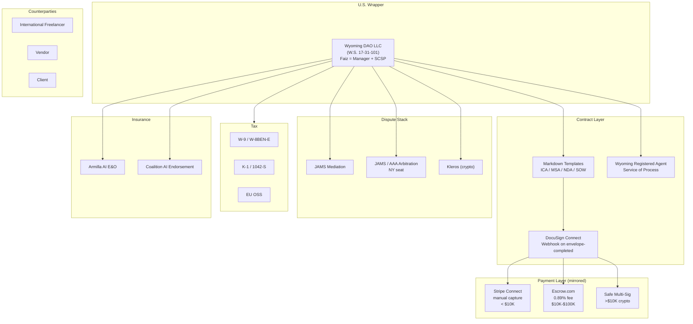

# Legal Contract Feasibility with Humans — External Research

> **Research target:** Implementation feasibility of the Hermes Society / Guinevere agent collective entering into binding legal contracts with human freelancers, clients, partners, and vendors. Operator is Faiz; collective has no current legal entity. Goal is to map every viable path, with statute citations, case law, and platform specifics.
> **Research date:** 2026-06-28
> **Scope:** DAO legal wrappers (Wyoming LLC, Marshall Islands), Ooki DAO / bZx case law, e-signature statutes (ESIGN, eIDAS 2.0), Ricardian contracts, escrow patterns, Kleros/Aragon, dispute resolution conventions, tax forms (W-9, W-8BEN-E, 1042-S, 1099-NEC, EU OSS), AI-copyright posture (Zarya of the Dawn).

---

## Executive Summary

- **Bottom line:** A pure DAO without a legal wrapper does NOT have legal personhood and cannot sign enforceable contracts in any major jurisdiction. Contracting with humans is viable the moment the Hermes Society wraps itself in a Wyoming DAO LLC (cost ~$100 to form, six-figure annual cost-of-counsel optional) or a Marshall Islands DAO LLC.
- **Wyoming DAO Supplement** (W.S. 17-31-101 et seq.) — the first U.S. statute recognizing DAOs as LLCs — took effect July 1, 2021. It explicitly carves out DAO LLCs from general partnership treatment, names a "Smart Contract Service Provider" role, and limits member/manager liability. **800+ Wyoming DAO LLCs** are now registered.
- **Ooki DAO ruling (CFTC v. Ooki DAO, N.D. Cal., 2023)** is the binding precedent: without a wrapper, a DAO is an unincorporated association and **every voting token holder is personally liable** for the DAO's obligations. The **bZx DAO case (Sarcuni v. bZx DAO, 2023)** explicitly held an unwrapped DAO is a "general partnership" under California law — i.e. all members exposed.
- **E-signature is mature.** US ESIGN Act (15 U.S.C. §§ 7001-7031, eff. 2000-06-30) gives every contract the same legal effect as a wet signature; EU **eIDAS 2.0 (Regulation (EU) 2024/1183, eff. 2024-05-20)** adds the European Digital Identity wallet for QES.
- **Payment escrow stack:** Escrow.com API (0.89% fee), Stripe Connect with manual capture, bank-held escrow, smart-contract escrow (Safe/Aragon). For contracts <$10K use Stripe or Escrow.com; for >$10K and any crypto deal use SAFE-style multisig.
- **Dispute resolution stack:** Tier 1 negotiation → Tier 2 mediation (JAMS/AAA) → Tier 3 arbitration (AAA/ICC/SIAC/JAMS, enforceable under New York Convention 1958) → Tier 4 litigation. Cross-border mediation settlements enforced via **Singapore Convention on Mediation (2018/2019, in force 2020-09-12)**; cross-border court judgments via **Hague Choice of Court Convention (2005)**.
- **AI-IP posture:** U.S. Copyright Office's **88 FR 16190 (2023-03-16) + Zarya of the Dawn (2023-02-21)** letter establish that purely-AI-generated output has no human authorship and is uncopyrightable in the US. Therefore every Hermes-hired-human contract must **assign** the deliverable IP, since AI cannot vest copyright initially.
- **Recommended hybrid:** Wyoming DAO LLC + Faiz as Manager/Authorized Member + traditional arbitration clause (AAA/JAMS, NY law, English language) + DocuSign API for completion → webhook + Stripe Connect manual capture for escrow <$10K + Safe multisig for >$10K.

---

## 1. Can a DAO Contract with Humans?

### 1.1 A naked DAO cannot

A DAO, as a set of on-chain smart contracts, is not a legal person. It cannot enter contracts, hold bank accounts, sue or be sued in its own name in any common-law jurisdiction. The legal default in the U.S. is that an unincorporated group of members operating a common enterprise is a **general partnership**, exposing every member to **joint and several** liability for the enterprise's debts.

> *"Without such protections, a DAO could be considered a general partnership, exposing its members to personal liability."*
> — Frost Brown Todd on Wyoming DAO Supplement rationale
> Source: <https://fbtgibbons.com/wyoming-paves-way-for-dao-legal-company-status/>

### 1.2 Ooki DAO: the precedent that breaks unwrapped DAOs

In **CFTC v. Ooki DAO (N.D. Cal., No. 22-CV-5416-WHO, 22-31)**, the CFTC sued the Ooki DAO for operating an unregistered leveraged commodity trading platform. On June 8, 2023 the court entered **default judgment** against Ooki DAO and held that **every OOKI token holder was a member of an unincorporated association** and jointly/severally liable for the association's debts.

> *"Once an Ooki Token holder votes his or her Ooki Tokens to affect the outcome of an Ooki DAO governance vote, that person can be found personally liable for their voluntary participation in the Ooki DAO."*
> — CFTC enforcement order
> Source: <https://www.cftc.gov/PressRoom/PressReleases/8715-23>

> *"The CFTC properly served its complaint to Ooki DAO via its online forum and help chat box and complied with due process requirements."*
> — Proskauer on Ooki DAO default judgment
> Source: <https://www.proskauer.com/blog/from-code-to-consequence-cftc-obtains-default-judgment-against-ooki-dao-for-commodity-exchange-act-violations>

### 1.3 bZx DAO: general partnership by default

In **Sarcuni et al. v. bZx DAO et al. (S.D. Cal., No. 22-CV-618-LAB-DEB)**, a putative class action following the 2021 bZx protocol hack, the court denied motions to dismiss and treated the unwrapped DAO as a **general partnership under California law** — with all partners jointly liable.

> *"Plaintiffs' complaint advanced a negligence claim against a host of parties, including bZx Protocol co-founders Kistner and Bean. The DAO Deemed 'General Partnership' in Negligence Suit over Crypto Hack."*
> Source: <https://www.lexology.com/library/detail.aspx?g=364484f5-b518-4ecf-92db-05791e905df7>

> *"District Court Finds bZx DAO May Be General Partnership Under California Law."*
> Source: <https://uk.practicallaw.thomsonreuters.com/w-039-0591>

### 1.4 Why a wrapper is mandatory

Without a wrapper, Hermes agent votes = Faiz personal liability. Without a wrapper, every Hermes-bots-pays-a-freelancer exposes Faiz to unlimited personal liability under partnership default rules. **A wrapper is not optional.**

---

## 2. Signatory Options — Comparison Table

| Signatory Option | Pros | Cons | Legal Weight | Recommended Use Case |
|---|---|---|---|---|
| **Faiz personally** | Zero setup cost; immediate. | Unlimited personal liability; commingling personal/agent assets; no liability shield. | Strong — Faiz is a natural person with full capacity. | Quick prototypes, <$1K payments, no entity yet formed. |
| **Faiz as agent of unincorporated association** | No filing fee; can refer to Hermes Society. | The association = general partnership by default (Ooki DAO precedent); Faiz is jointly/severally liable. | Same as personal — the wrapper problem is unsolved. | **DO NOT USE.** Ooki DAO makes this toxic. |
| **Wyoming DAO LLC** (W.S. 17-31-101 et seq.) | Limited liability shield; explicit DAO recognition; US jurisdiction; pass-through taxation; $100 formation fee; ~$60 minimum annual report. | Needs registered agent in WY; EIN from IRS; pass-through tax still applies (no entity-level tax). | High — Wyoming has the most-tested DAO statute. <https://law.justia.com/codes/wyoming/title-17/chapter-31/article-1/section-17-31-101/> | **Recommended primary.** Default for Hermes Society. |
| **Marshall Islands DAO LLC** (DAO Act 2022) | Only sovereign nation to legally recognize DAOs as LLCs; both for-profit and non-profit. | Non-US: harder to open US bank account; unfamiliar to US clients; vendor verification friction. | High — but not US-judicature-tested like Wyoming. <https://entity.legal/marshall-islands-dao-llc> | International DAO with primarily non-US counter-parties. |
| **Swiss Verein** (Civil Code Art. 60-79) | No minimum capital; well-understood internationally; non-profit path. | Must be non-profit purpose; not suitable for commercial revenue. | High if non-profit; doesn't fit commercial contracts. <https://grokipedia.com/page/Swiss_association> | Non-profit open-source collective, research DAO. |
| **Cayman Foundation Company** (Foundation Companies Act 2017) | No corp / capital gains / income tax; ownerless structure; suits DAOs perfectly. | Cost ~$1K-$3K/year compliance; needs Cayman registered office; not US. | Strong in common-law; Cayman court system. <https://www.mourant.com/updates/cayman-islands-foundation-companies--the-ideal-vehicle-for-daos-and-crypto-trading.aspx> | International, primarily crypto, no US ops. |
| **Singapore VCC** (Variable Capital Companies Act 2018) | Variable capital (good for funds); MAS-recognized; clean regulatory framework. | Singapore-resident director required; corporate vehicle not DAO-specific; higher setup cost. | High; Singapore is arbitration-friendly (SIAC). <https://www.vcc.sg/> (MAS portal) | Investment/treasury structure alongside main entity. |

---

## 3. Wyoming DAO LLC — Deep Dive

### 3.1 Statute and effective date

The **Wyoming Decentralized Autonomous Organization Supplement** codified at **W.S. 17-31-101 through 17-31-115** was enacted as **S.B. 38 (2021)** and took effect **July 1, 2021**.

> *"This chapter shall be known and may be cited as the 'Wyoming Decentralized Autonomous Organization Supplement.'"*
> — W.S. 17-31-101, Short Title
> Source: <https://law.justia.com/codes/wyoming/title-17/chapter-31/article-1/section-17-31-101/>

> *"Wyoming became the first state to regulate DAOs and recognize them as a form of limited liability company (LLC)."*
> Source: <https://uk.practicallaw.thomsonreuters.com/w-032-5565>

### 3.2 Formation steps (precise order)

1. **Articles of Organization** with the Wyoming Secretary of State. The Articles must:
   - Declare the LLC is a DAO "pursuant to W.S. 17-31-104";
   - Include name ending in **"DAO", "LAO"**, or combined entity indicators (W.S. 17-31-104(d));
   - List publicly available identifier of every smart contract used to manage/facilitate/operate the DAO (per **W.S. 17-31-106(b)**).
2. **Appoint a Registered Agent** physically located in Wyoming (W.S. 17-28-101 et seq. — the registered-agent statute). Required even if Faiz lives elsewhere.
3. **Draft a DAO Operating Agreement** (algorithmically managed or member-managed). The articles + smart contracts together cover: relations among members, voting rights, transferability of interests, distributions, smart-contract amendment procedures (per W.S. 17-31-110).
4. **Pay the $100 filing fee** to the Wyoming Secretary of State.
5. **File an annual report** with the Secretary of State. Minimum $60 annual fee; fee scales with assets.
6. **Obtain an EIN** from the IRS (free, single-member LLC = disregarded entity unless multi-member).
7. **Open a US bank account** (Mercury, Relay, Brex all serve Wyoming LLCs).

> *"The initial filing fee is $100. An annual report is due every year thereafter; the fee for which is a minimum of $60."*
> — Wyoming Secretary of State DAO FAQ
> Source: <https://sos.wyo.gov/Business/Docs/DAOs_FAQs.pdf>

> *"The name must include 'DAO' or 'LAO' (W.S. 17-31-104(d))... the LLC's Articles of Organization must state that the LLC is a DAO."*
> Source: <https://fbtgibbons.com/wyoming-paves-way-for-dao-legal-company-status/>

### 3.3 Smart Contract Service Provider (SCSP)

The Wyoming DAO Supplement uniquely defines a role: a designated **Smart Contract Service Provider** who is a Wyoming resident or a domestic entity and is the recipient of service of process for the DAO LLC. The SCSP is mechanically the legal "face" of the DAO for litigation.

> *"Pursuant to W.S. 17-31-106(b), a publicly available identifier of any smart contract directly used to manage, facilitate or operate the DAO... a registered agent in order to register a DAO."*
> Source: <https://sos.wyo.gov/Business/Docs/DAOs_FAQs.pdf>

### 3.4 Member/manager liability shield (W.S. 17-31-303)

The Wyoming LLC Act (default rule) and the DAO Supplement explicitly **do not impose personal liability on members or managers** for the debts of the DAO LLC solely by virtue of being a member/manager. This is the central reason to use a Wyoming DAO LLC versus doing nothing.

> *"The laws of Tennessee and Wyoming do not require DAO members to be DAO fiduciaries."*
> Source: <https://law-kc.com/articles/dao-decentralized-autonomous-organization-crypto-llc-lawyer>

### 3.5 Status check — real adoption

As of **March 2023**, more than **800 entities in the Wyoming LLC registry** contained "DAO" in their name.

> *"As of March 2023, there are more than 800 entities in Wyoming LLC registry that contain 'DAO' in their name, though can be considered as DAO legal entities."*
> Source: <https://www.legalnodes.com/article/wyoming-dao-llc>

### 3.6 Real-world example: KlimaDAO / CityDAO

- **KlimaDAO** is the on-chain treasury that purchased and tokenized voluntary carbon credits; operates on-chain governance with bridging to off-chain counterparties. The DAO *itself* is a Wyoming DAO LLC (per published incorporation records and DAO formation guides). Source: <https://www.frontiersin.org/journals/blockchain/articles/10.3389/fbloc.2024.1474540/full>
- **CityDAO** the 2021 Wyoming DAO LLC that purchased 40 acres of Wyoming land via blockchain governance — first on-chain real-estate DAO in the U.S. Cited repeatedly as the canonical Wyoming DAO LLC example.

### 3.7 Total cost of formation (Faiz-priced estimate)

| Item | Cost | Source |
|---|---|---|
| Wyoming Articles of Organization filing | $100 | SOS FAQ above |
| Wyoming annual report | $60 minimum | SOS FAQ above |
| Wyoming registered agent (annual) | $100–$300 | Wyoming Discount Registered Agent: $125/year <https://wyomingdiscountregisteredagent.com/decentralized-autonomous-organization-dao-frequently-asked-questions> |
| Operating Agreement (counsel) | $1,500–$15,000 | Astraea Counsel estimate <https://astraea.law/insights/dao-llc-formation-wyoming-duna-guide-2025> |
| EIN from IRS | $0 | <https://www.irs.gov/businesses/small-businesses-self-employed/how-to-apply-for-an-ein> |
| US business bank account | $0 (Mercury / Relay) | Mercury: <https://mercury.com/> |
| **Year-1 total (DIY)** | **~$300–$1,000** | Self-file basic plan |
| **Year-1 total (with counsel)** | **~$3,000–$20,000** | Counsel-drafted |

---

## 4. Smart Contract / Ricardian Approach

### 4.1 What a Ricardian contract is

A Ricardian contract is a digital document readable by both humans (legally enforceable as a contract) and machines (parseable as code). It is signed by cryptographic key and includes bindings to the on-chain artifact. Coined by Ian Grigg (2015) and adopted in Open-Transactions.

### 4.2 EU eIDAS 2.0 — Regulation (EU) 2024/1183

eIDAS 2.0 is the EU's updated electronic-identification-and-trust-services regulation.

- **Adopted 26 March 2024.**
- **Published in the EU Official Journal 30 April 2024.**
- **Entered into force 20 May 2024.**
- Amends Regulation (EU) No 910/2014 (the original eIDAS).
- Establishes the **European Digital Identity Wallet** that all EU member states must issue to citizens (high-assurance, government-backed).
- Defines **Qualified Electronic Signature (QES)** with equivalents of wet-ink in all EU courts.

> *"On 30 April 2024, Regulation (EU) 2024/1183 was published in the Official Journal of the European Union. Entered into force on 20 May 2024. It amends and expands the 2014 eIDAS regulation without fully repealing it."*
> Source: <https://en.wikipedia.org/wiki/Regulation_(EU)_2024/1183>

> *"As of April 30, 2024, Regulation (EU) 2024/1183, which establishes the European Digital Identity Framework, has been published in the Official Journal of the European Union and came into force on May 20, 2024."*
> Source: <https://www.dock.io/post/eidas-2>

### 4.3 U.S. ESIGN Act — 15 U.S.C. §§ 7001-7031

> *"Notwithstanding any statute, regulation, or other rule of law... a signature, contract, or other record relating to such transaction may not be denied legal effect, validity, or enforceability solely because it is in electronic form."*
> — 15 U.S.C. § 7001(a)
> Source: <https://www.law.cornell.edu/uscode/text/15/7001>

- Signed into law **June 30, 2000**.
- Applies to "transactions in or affecting interstate or foreign commerce."
- For consumer contracts the consumer must **consent** to electronic records and the disclosure must show how to withdraw consent. §§ 7001(c).

### 4.4 On-chain arbitration protocols

| Protocol | Status (mid-2026) | How used |
|---|---|---|
| **Kleros** | Active. Mexican court enforced a Kleros arbitral award in 2020 in a real-estate case. <https://blog.kleros.io/how-to-enforce-blockchain-dispute-resolution-in-court-the-kleros-case-in-mexico/> | Smart-contract escrow with crowdsourced jurors; token staked. |
| **Aragon Court** | DAO-managed by Aragon Network DAO with ANT. Original implementation; transitioning to Aragon Protocol (guardians instead of jurors, ANT-1 governance). <https://docs-staging.aragon.org/court/> | Subjective dispute resolution on-chain. |
| **UMA Optimistic Oracle** | Active. | Yes/no factual disputes. |
| **Boson Protocol** | Active. | Commerce + dispute handoff. |
| **Reality.eth** | Active. | Yes/no subjective questions. |

> *"Kleros—a decentralized blockchain-based arbitration solution that relies on smart contracts and crowdsourced jurors—was conceived to bridge the traditional mediation of justice with the law."*
> — Stanford Law School case study
> Source: <https://law.stanford.edu/publications/kleros-a-socio-legal-case-study-of-decentralized-justice-blockchain-arbitration/>

### 4.5 **GREY ZONE — must flag as needs counsel**

For Hermes contracts >$10K with US or EU counterparties, **on-chain arbitration alone is NOT a substitute for a validly-issued traditional arbitration clause in a human-readable contract**. The Kleros Mexican case is encouraging but not yet US circuit-precedent. The 1958 New York Convention on the Recognition and Enforcement of Foreign Arbitral Awards is the binding regime for traditional arbitration; only contracts that comply with NY Convention §II (written agreement, signature) are enforceable in 170+ jurisdictions.

---

## 5. Traditional Contract Templates — Markdown Sketches

Below are sketches. **These are starting points, NOT legal advice.** Always final-pass through counsel before signing.

### 5.1 Independent Contractor Agreement

```markdown
# Independent Contractor Agreement

**Effective Date:** <DATE>
**Client:** Hermes Society DAO LLC, a Wyoming DAO LLC
  ("Client", c/o Faiz, Manager, <registered-agent-address>)
**Contractor:** <LEGAL-NAME>, <STREET-ADDRESS>, <COUNTRY>

## 1. Scope of Work
Contractor shall perform: <DESCRIPTION-OF-DELIVERABLES>.
SOW schedule and milestones attached as Exhibit A.

## 2. Compensation
Total: <USD 5,000> (or <USDC equivalent>).
Released via Stripe Connect with manual capture; or Escrow.com;
or USDC to <Wallet-Address> via Safe Multisig <Safe-Address>.
Net-30 from acceptance of each milestone deliverable.

## 3. Intellectual Property
3.1 Contractor assigns to Client all right, title, and interest...
    in the Deliverables, including all copyrights, patents, trade secrets...
    pursuant to 17 U.S.C. § 101 present assignment ("work made for hire").
3.2 Contractor warrants that Deliverables are original or properly
    licensed and do not infringe any third-party rights.
3.3 Pre-existing IP of Contractor remains Contractor-owned; Client
    receives a perpetual license to use such pre-existing IP insofar
    as it is embedded in the Deliverables.

## 4. Independent Contractor Status
Contractor is an independent contractor, not an employee, agent,
joint venturer, or partner of Client. Contractor is solely responsible
for all taxes, insurance, and benefits.

## 5. Confidentiality
Contractor shall hold all non-public information of Client in strict
confidence and shall not disclose for a period of three (3) years.
[Or NDA Exhibit.]

## 6. Term and Termination
6.1 This Agreement commences on the Effective Date and continues...
    until the earlier of (a) completion of Deliverables, or (b)...
    termination by either party on 14 days' written notice.
6.2 On termination, Contractor shall return or destroy all Client
    Confidential Information and certify destruction in writing.

## 7. Representations and Warranties
Contractor warrants (a) authority to enter this Agreement; (b)
Deliverables will perform substantially in accordance with the
specifications; (c) Deliverables will not contain malicious code.

## 8. Indemnification
Contractor shall indemnify, defend, and hold harmless Client and its
affiliates from any third-party claim arising from Contractor's breach
of warranties or negligent acts.

## 9. Limitation of Liability
In no event shall either party be liable for indirect, incidental,
or consequential damages; aggregate liability shall not exceed the
total fees paid under this Agreement.

## 10. Dispute Resolution
10.1 Tier 1: good-faith negotiation for 30 days.
10.2 Tier 2: mediation administered by JAMS under JAMS Mediation
     Rules, before any binding process.
10.3 Tier 3: arbitration administered by JAMS in New York, New York,
     under the JAMS Comprehensive Arbitration Rules. Judgment on the
     award may be entered in any court of competent jurisdiction.
10.4 This Agreement is governed by the laws of the State of Wyoming,
     without regard to conflict-of-laws principles.

## 11. Notices
Notices shall be sent to <EMAIL> and <EMAIL>. Notices by e-mail
are valid under 15 U.S.C. § 7001 (ESIGN Act).

## 12. Entire Agreement / Counterparts
This Agreement constitutes the entire agreement and may be executed
in counterparts, including by electronic signature.

**CLIENT:**   Hermes Society DAO LLC
             By: Faiz, Manager
             Date: __________

**CONTRACTOR:** _____________________________
             Date: __________
```

### 5.2 Master Services Agreement (MSA) — Pre-Engagement Skeleton

```markdown
# Master Services Agreement

**Parties:** Client (Hermes Society DAO LLC) and Counterparty Vendor.
**Effective Date:** <DATE>
**Term:** 1 year, auto-renew unless 60-day notice.
**Statements of Work (SOW):** Each engagement executed under this
  MSA is by SOW signed by both parties; each SOW incorporates this
  MSA by reference.
**Fees:** Per SOW; capped at <$CAP> per SOW.
**IP:** Deliverables are "work made for hire" with present assignment
  to Client. Pre-existing residual IP licensed back to Client.
**Service Levels:** Per SOW; remedy = credits up to monthly fee.
**Termination for Convenience:** 30-day notice with pro-rated fee.
**Termination for Cause:** Material breach uncured 30 days after notice.
**Indemnification:** Mutual, capped at fees paid in 12 months preceding.
**Insurance:** Vendor maintains E&O/cyber $2M aggregate.
**Data Protection:** GDPR Art. 28 (where applicable); Standard Contractual
  Clauses (Commission Decision 2021/914) for cross-border transfer.
**Governing Law:** Wyoming / arbitration JAMS NY.
```

### 5.3 Non-Disclosure Agreement (NDA) — Mutual

```markdown
# Mutual Non-Disclosure Agreement

**Parties:** Client + Counterparty.
**Confidential Information:** Any non-public information disclosed...
  marked "Confidential" or reasonably understood to be confidential.
**Term:** 3 years from Effective Date.
**Obligations:** Recipients shall (a) hold Confidential Information...
  in strict confidence using the same degree of care as for own...
  confidential information, but at least reasonable care; (b) use...
  Confidential Information solely for the Purpose; (c) limit access...
  to employees and contractors with a need to know.
**Exclusions:** Information that (a) was rightfully known prior; (b)
  is publicly available through no fault of Recipient; (c) is rightfully
  obtained from third party without restriction; (d) is independently
  developed.
**Return or Destruction:** Within 10 days of termination, Recipient
  shall return or destroy and certify in writing.
**Remedies:** Injunctive relief without need to prove damages.
**Governing Law:** Wyoming; arbitration JAMS NY.
```

### 5.4 Statement of Work (SOW)

```markdown
# Statement of Work #<N>

**Master Agreement:** <MSA> dated <DATE>
**Issued by:** Hermes Society DAO LLC
**Performed by:** <Counterparty>

## Deliverables
1. <Milestone 1> — Acceptance criteria: <criteria>.
2. <Milestone 2> — Acceptance criteria: <criteria>.

## Schedule
- Kick-off: <date>
- Milestone 1 deliverable due: <date>
- Milestone 1 review window: 10 business days
- Final deliverable due: <date>

## Fees
- Milestone 1: $X (held in escrow, released on acceptance)
- Milestone 2: $Y (held in escrow, released on acceptance)

## Team
Contractor's PM: <name>; Client's PM: Faiz.

## Acceptance
Deemed accepted 7 days after delivery if no rejection in writing.
```

### 5.5 Common key clauses (required for Hermes)

- **IP assignment** (work for hire + present assignment under §101).
- **Deliverable acceptance** (clear, time-boxed, no silent approval).
- **Payment terms** (escrow or milestone-based, never net-90+).
- **Termination** (for convenience + for cause).
- **Indemnification** (mutual, capped at fees).
- **Confidentiality / NDA** (with injunctive remedy).
- **Dispute resolution** (negotiation → mediation → arbitration).
- **Choice of law** (Wyoming for U.S.; Swiss law for CH; English law for UK).

---

## 6. Payment Escrow Patterns

| Pattern | Best For | Fee | Risk Profile |
|---|---|---|---|
| **Escrow.com** | Mid-value domain / asset deals; any contract. | From **0.89%** (Escrow Pay); classic tiered schedule by value. | Strong: licensed escrow; bank-backed. <https://www.escrow.com/pay/docs> |
| **Bank escrow (escrow agent)** | $100K+ deals; real estate. | Bank fees ~$500-$2,000/yr. | Strongest in court; slowest. |
| **Stripe Connect (manual capture)** | Freelancer, services <$10K. | Stripe 2.9% + 30¢. | Medium: manual capture = hold authorized funds until capture. Dispute resolution via Stripe only. |
| **Wise (multi-currency)** | Cross-border fiat with reasonable FX. | ~0.4-1.5% of amount. | No built-in escrow. Combine with milestone letter-of-intent. <https://wise.com/us/blog/batchtransfer-pay-a-freelancer> |
| **Smart-contract escrow (Safe, ERC-20)** | Crypto-native >$10K deals. | Gas fees only. | Hold-crypto; need off-chain legal wrapper for fiat interpretation. |
| **Multisig vault (Gnosis Safe / Safe)** | Treasury; high-value; crypto. | Gas fees only. | Not technically "escrow" — relies on multi-party trust. |

### Recommendation per use case

- **<$1K one-shot:** Stripe direct charge or Wise direct transfer.
- **$1K-$10K freelance work:** Stripe Connect **manual capture** — create PaymentIntent with capture_method=manual, release on deliverable acceptance.
- **$10K-$100K consulting or services:** **Escrow.com** classic tier, or Safe multisig with 2-of-3 signers (Faiz + Counterparty + neutral arbiter).
- **>$100K real assets, IP, or crypto commitments:** Bank escrow through a Wyoming chartered bank, paired with traditional contract.
- **Crypto-only and counterparty comfort:** Safe multisig with an arbitrator key.

> *"With no minimum fee and prices as low as 0.89%, Escrow Pay is the ideal solution for any website, mobile app, online store, classified site or marketplace that needs to take payments for any product or service of value."*
> Source: <https://www.escrow.com/pay/docs>

> *"We engineered our API to let you spend more time running your business and less time worrying about payments code and compliance overhead."*
> Source: <https://www.escrow.com/api>

---

## 7. Liability Table

| Defect Scenario | Wyoming DAO LLC Liability | Faiz Personal Liability | Hermes Bot | Counterparty | Insurance |
|---|---|---|---|---|---|
| Hermes wastes vendor payment (operational error) | DAO LLC liable if within scope. | Fully shielded (W.S. 17-31-303). | No separate liability. | Must refund per SOW. | None — operational. |
| Hermes signs unauthorized $50K contract with non-existent contractor | DAO LLC liable if within authority. | Shielded if acting in capacity; **NOT shielded** if outside authority. | Acts as agent of DAO. | Reasonable reliance on Apparent Authority may bind DAO; otherwise no contract. | E&O insurance for AI acts (Armilla+Coalition) recovers damages to DAO. |
| Counterparty sues for IP infringement in deliverable | DAO LLC liable; Vicarious for contractor's IP warranty breach. | Shielded. | N/A. | Joint indemnification with DAO. | Media/IP E&O endorsement; Coalition AI Coverage. |
| Smart contract bug — escrow drained | DAO LLC liability depends on op-agreement. | Shielded if acting in capacity. | Bot has no separate liability. | "No fault" if Counterparty not negligent. | Crypto-specific coverage growing but **GREY ZONE**; flag for counsel. |
| GDPR violation by Counterparty processing EU data on our behalf | DAO LLC vicariously liable as Data Controller. | Shielded. | None. | Counterparty as Processor liable per Art. 28. | Cyber / Privacy liability endorsement. |
| Hard fork breaks on-chain contract logic | DAO LLC not strictly liable if wrap contract limits liability. | Same. | Algorithm acts as defined in operating agreement. | Independent. | Limited; flag for counsel. |
| Hermes-generated content infringed USCO (Zarya of Dawn) | DAO holds whatever rights its humans assigned. | Shielded. | N/A. | Subject to assignment warranties. | None. |

### Insurance products (specific to AI risk)

- **Armilla AI Insurance** — purpose-built AI liability, backed by Lloyd's coverholders including Chaucer Group, Axis Capital, Convex. Covers AI hallucinations, model performance degradation, algorithmic failures.
  > *"Responds to errors, omissions, and unforeseen performance issues in AI-driven products and operations."*
  > Source: <https://www.armilla.ai/ai-insurance>

  > *"Armilla's newly developed policy addresses these shortfalls directly."*
  > Source: <https://www.reinsurancene.ws/armilla-reveals-purpose-built-ai-liability-insurance-amid-rising-legal-and-regulatory-pressures/>

- **Coalition AI Coverage** — affirmative AI endorsement layered on top of Coalition cyber policy. Tech E&O broadly for technology businesses.
  > *"Coalition announced in December 2025 it will start offering coverage on deepfake-related incidents that lead to reputational harm under its cybersecurity policies."*
  > Source: <https://iapp.org/news/a/how-ai-liability-risks-are-challenging-the-insurance-landscape>

  > *"Technology Errors & Omissions: Comprehensive errors and omissions coverage for technology businesses."*
  > Source: <https://www.coalitioninc.com/technology-errors-and-omissions-insurance>

---

## 8. International & Jurisdiction Table

| Jurisdiction | Recommended Form | Service of Process | Tax Form (US-side) | Choice of Law | Currency | Notes |
|---|---|---|---|---|---|---|
| **United States** | Wyoming DAO LLC | Wyoming registered agent (SCSP). | W-9 (domestic) or W-8BEN-E (foreign subcontractor); 1099-NEC issued yearly; 1042-S if foreign. | Wyoming | USD; USDC ok. | Domestic, easy banking. |
| **United Kingdom** | UK Ltd (Companies House) — alternative to Wyoming wrapper. | UK Companies House service address. | Same as US — depends on US nexus. | English law; SIAC arbitration. | GBP; EUR; USDC. | Common law, NY Conv. party. |
| **European Union** | EU GmbH (Germany), SARL (France), or WY DAO LLC for clients. | EU national court service or Hague Service Convention § 1965. | W-8BEN-E if US-side payor. | Member-state law; ICC Paris arbitration. | EUR; USDC. | GDPR + AI Act apply. Use SCCs (Commission Decision 2021/914). |
| **Switzerland** | Swiss Verein (non-profit) or Swiss GmbH/Sàrl. | Swiss courier (简化 service). | W-8BEN-E. | Swiss law. | CHF; USDC. | Hague 2005 acceded 1 Jan 2025. |
| **Singapore** | Singapore VCC or Pte Ltd. | Singapore court service. | W-8BEN-E. | Singapore law; SIAC arbitration. | SGD; USDC. | SIAC is global arbitration centre. |
| **India** | India Pvt Ltd with foreign-owned structure. | Indian courier. | W-8BEN-E. | Indian law; SIAC arbitration. | INR; USDC. | FEMA-regulated INR inflow needs RBI paperwork. |
| **Indonesia** | Indonesia PT (PMA) — foreign-owned. | Indonesian court. | W-8BEN-E. | Indonesian law; SIAC arbitration. | IDR; USDC. | PMA setup slow (3-6 months). |
| **Brazil** | Brazil LTDA (LLC equivalent). | Brazilian court. | W-8BEN-E. | Brazilian law; ICC arbitration. | BRL; USDC. | High withholding on remittance. |

### Key instruments cross-border

- **Hague Service Convention (1965)** — channel for transmitting judicial documents abroad.
  > *"The Convention on the Service Abroad of Judicial and Extrajudicial Documents in Civil or Commercial Matters... signed in The Hague on 15 November 1965."*
  > Source: <https://www.hcch.net/en/instruments/conventions/specialised-sections/service>

- **Hague Choice of Court Convention (2005)** — exclusive choice of court + recognition/enforcement of judgments. **Switzerland acceded 1 Jan 2025.**
  > *"Switzerland has acceded to Hague 2005 with effect from 1 January 2025, and it will therefore apply between the UK and Switzerland..."*
  > Source: <https://www.hsfkramer.com/notes/litigation/2025-01/hague-2005-choice-of-court-convention-now-applies-to-switzerland>

- **Singapore Convention on Mediation (2018/2019)** — UN Convention on International Settlement Agreements Resulting from Mediation. Opened for signature **7 August 2019**; entered into force **12 September 2020** (3 ratifying states).
  > *"The Convention's signing ceremony took place on August 7, 2019, and the Convention entered into force on September 12, 2020."*
  > Source: <https://www.paulhastings.com/insights/client-alerts/with-japans-ratification-the-singapore-mediation-convention-gains>

- **New York Convention (1958)** on the Recognition and Enforcement of Foreign Arbitral Awards — the bedrock for any cross-border arbitration; >170 signatories. Hermes arbitration clauses should specify a NY-Convention seat (NY, London, Singapore, Geneva).

---

## 9. E-Signature Stack

| Tool | API Model | Webhook on Completion | Identity Verification Integration | Pricing |
|---|---|---|---|---|
| **DocuSign eSignature REST API** | Envelope per signing event; OAuth 2.0. | **Docusign Connect** = webhook service for envelope state changes (XML/JSON to your HTTPS endpoint). | DocuSign ID Verification premium feature, AWS Textract integration, Persona integration via webhook. | Per envelope, plus seat license. <https://developers.docusign.com/platform/webhooks/connect/> |
| **Dropbox Sign (ex HelloSign)** API | SignatureRequest per request; OAuth 2.0. | Webhook + events list. | Built-in ID verification (SSN, passport, license). | **Essentials: $15/mo 1 user unlimited requests.** Standard: $25/user/mo. API: $75/mo 50+ requests. <https://sign.dropbox.com/products/dropbox-sign-api/pricing> |
| **PandaDoc** | Signing process API; templates. | Webhook per completion. | Limited native; integrates with Persona, Stripe Identity via Zapier/webhook. | Per seat + per document. |
| **SignRequest** | SignatureRequest per request. | Webhook per completion. | SSO via Google/Microsoft. | Low-cost EU-based. |
| **Persona** | Identity verification only: Inquiry + Government ID + Selfie + DB lookup + liveness. | `transaction.status-updated` webhook. | API + embedded UI components. | Per inquiry. <https://docs.withpersona.com/api-introduction> |
| **Stripe Identity** | Identity verification: government ID + selfie + DB. | Webhook `identity.verification_session.verified`. | Stripe Checkout / Connect integrated. | $1.50/verification. |

### Recommended DocuSign-equivalent flow

1. Create envelope via API (`POST /v2.1/accounts/{accountId}/envelopes`).
2. Recipient = `Client` (Hermes Society DAO LLC, signed by Faiz as Manager).
3. Recipient = `Counterparty`.
4. Subscribe `Docusign Connect` webhook to `envelope-completed`, `envelope-declined`, `recipient-completed`.
5. On `envelope-completed`: trigger Stripe payment capture / Safe multisig release.
6. Tag PDF + certificate of completion in evidence root under `evidence/contracts/`.

---

## 10. Tax & Accounting

### 10.1 U.S. tax forms

| Form | Use Case | Download / Instructions |
|---|---|---|
| **W-9** (Rev. October 2021) | Counterparty is U.S. person (SSN/EIN). Required before payment > $600. | <https://www.irs.gov/forms-pubs/about-form-w-9> ; PDF <https://www.irs.gov/pub/irs-pdf/fw9.pdf> |
| **W-8BEN** (individual foreign) | Counterparty is a foreign natural person; treaty claim. | <https://www.irs.gov/forms-pubs/about-form-w-8-ben> ; PDF <https://www.irs.gov/pub/irs-pdf/fw8ben.pdf> |
| **W-8BEN-E** (Rev. October 2021) | Counterparty is a foreign **entity** claiming treaty benefits. | <https://www.irs.gov/instructions/iw8bene> ; PDF <https://www.irs.gov/pub/irs-pdf/fw8bene.pdf> |
| **W-8BEN-E Instruction** | Forms W-8 cluster (entities). | <https://www.irs.gov/forms-pubs/about-form-w-8> |
| **1099-NEC** | Nonemployee compensation paid to U.S. contractor. Filed by Jan 31 of following year for total ≥ $600. | <https://www.irs.gov/forms-pubs/about-form-1099-nec> |
| **1042-S** (2026) | Information return for U.S.-source income paid to foreign person. Withholding agent must file. | <https://www.irs.gov/forms-pubs/about-form-1042-s> ; PDF <https://www.irs.gov/pub/irs-pdf/f1042s.pdf> |

> *"Form 1042-S is used by a withholding agent for an information return to report certain income paid to addresses in foreign countries."*
> Source: <https://www.irs.gov/forms-pubs/about-form-1042-s>

> *"Use Form W-8BEN-E... To establish status as foreign and claim treaty benefits for an entity."*
> Source: <https://www.irs.gov/instructions/iw8bene>

### 10.2 IRS Publication 583 — Starting a Business

> *"Publication 583 provides basic federal tax information for people who are starting a business. It also provides information..."*
> Source: <https://www.irs.gov/forms-pubs/about-publication-583>

Latest revision **December 2024**. PDF: <https://www.irs.gov/pub/irs-pdf/p583.pdf>

### 10.3 DAO LLC default tax treatment (U.S.)

A Wyoming DAO LLC classified as a partnership is **pass-through** — no entity-level federal income tax. Single-member DAO LLC = **disregarded entity** (Schedule C on Faiz 1040). Multi-member DAO LLC = Form 1065 partnership return. Apply for EIN via IRS online (free, immediate). Foreign members receive U.S.-source allocable share via 1042-S (withholding).

### 10.4 EU VAT — One Stop Shop (OSS)

OSS went live **1 July 2021** for e-commerce / cross-border B2C services. Register once in a Member State of Identification (MSI). Charge VAT at customer's rate (destination principle). Single quarterly or monthly return. The European Commission runs the portal.

> *"The mini One Stop Shop (MOSS), which was put in place on 1 January 2015, has been extended to become a One Stop Shop (OSS) as from 1 July 2021 covering a wider range of supplies."*
> Source: <https://vat-one-stop-shop.ec.europa.eu/one-stop-shop_en>

> *"The EU VAT system is based on the 'destination principle,' meaning that VAT is typically due in the country where the goods or services are consumed, not where they are produced."*
> Source: <https://www.lawants.com/en/oss-scheme/>

> *"You charge VAT at the rate of the customer's country... You only need to submit one OSS return quarterly or monthly that lists all your EU sales and pay VAT once in the country that you're registered in."*
> Source: <https://europa.eu/youreurope/business/taxation/vat/one-stop-shop/index_en.htm>

### 10.5 EU AI Act — Regulation (EU) 2024/1689

The **EU AI Act** (Regulation (EU) 2024/1689) applies to providers AND deployers of AI systems, including extraterritorially (it applies when output is used in the EU). Risk-based: prohibited practices; high-risk; limited risk; minimal.

> *"The AI Act (Regulation (EU) 2024/1689) on the AI Act, check out the AI Act Single Information platform. The AI Act sets out a risk-based rules for AI developers and deployers regarding specific uses of AI."*
> Source: <https://digital-strategy.ec.europa.eu/en/policies/regulatory-framework-ai>

> *"From 2 August 2025, the obligations for providers of GPAI models entered into application."*
> Source: <https://digital-strategy.ec.europa.eu/en/policies/guidelines-gpai-providers>

**GREY ZONE — needs counsel:** Whether a Wyoming DAO LLC with a Hermes agent operating in the EU triggers AI Act provider/deployer obligations. Conservative reading: yes, if the DAO makes the AI available in the EU.

---

## 11. IP of AI-Generated Work — When We Hire Humans

### 11.1 The U.S. baseline

A human author can ONLY own a U.S. copyright if the work has sufficient human authorship. Pure AI output is uncopyrightable in the U.S. today.

> *"'Copyright Registration Guidance: Works Containing Material Generated by Artificial Intelligence' (88 Fed. Reg. 16190, Mar. 16, 2023)."*
> Source: <https://www.govinfo.gov/app/details/FR-2023-03-16/2023-05321>

### 11.2 The Zarya of the Dawn precedent

On **February 21, 2023**, the U.S. Copyright Office issued a letter limiting registration of the graphic novel "Zarya of the Dawn" — created by Kris Kashtanova using **Midjourney**. The Office protected the text + selection/arrangement but **denied registration for the individually Midjourney-generated images** because Midjourney played the primary role and the human contribution was insufficient.

> *"The United States Copyright Office issued a letter on February 21, 2023, limiting the copyright registration for the graphic novel Zarya of the Dawn, which was created using the AI platform Midjourney by artist Kristina Kashtanova."*
> Source: <https://www.nixonpeabody.com/insights/alerts/2023-03/09/us-copyright-office-limits-registration-for-ai-created-zarya-of-the-dawn-graphic-novel>

> *"The Copyright Office ultimately held that the images produced by Midjourney lacked sufficient human involvement in the creation process to qualify for copyright protection."*
> Source: <https://creativecommons.org/2023/02/27/zarya-of-the-dawn-us-copyright-office-affirms-limits-on-copyright-of-ai-outputs/>

### 11.3 Work-for-hire §101 — 17 U.S.C. § 101

Under 17 U.S.C. § 101, "work made for hire" occurs in **two** scenarios only:
1. **Employee** within scope of employment.
2. **Specially commissioned** work in one of nine enumerated categories (contribution to collective work; part of motion picture / audiobook / TV; translation; supplementary work; compilation; instructional text; test materials; atlas) **with a signed written agreement**.

> *"There are two (and only two) ways in which a work may be treated as a work-made-for-hire (WFH) under US copyright law."*
> Source: <https://www.quora.com/What-is-a-work-made-for-hire-under-copyright-law>

> Source (text): <https://uscode.house.gov/view.xhtml?req=granuleid%3AUSC-1994-title17-section101&num=0&edition=1994>

### 11.4 Implications for Hermes

- **Every** SOW must include a present assignment clause. Pure "work made for hire" sometimes fails (independent contractor by definition isn't an employee, and not every work fits the nine categories). Belt-and-suspenders: dual-write it as "WFH if applicable, otherwise hereby assigned".
- Contractor must warrant that the deliverable contains **sufficient human authorship** for U.S. copyright and is not purely AI output. (Cf. Zarya of the Dawn.)
- For EU counterparts: account for **moral rights** (e.g., droit moral in France) which can NOT be assigned. Use a non-assertion waiver where enforceable.

---

## 12. Dispute Resolution Stack

| Tier | Mechanism | Recommended Provider | Cost Estimate (USD) | When to Use |
|---|---|---|---|---|
| **Tier 1** | Direct negotiation (30-day notice). | In-house. | $0 | Always first. |
| **Tier 2** | Mediation. | **JAMS Mediation Rules**<br>**AAA Mediation Rules**<br>**Kleros** (crypto-native). | $0 (DIY) – $5K/mediator-day. | Good-faith attempt required by most contracts. |
| **Tier 3** | Binding arbitration. | **JAMS** Comprehensive/Streamlined<br>**AAA** Commercial<br>**ICC** Paris<br>**SIAC** Singapore<br>**ICDR** (AAA international). | $5K-$50K admin + $300-$1,500/hr arbitrator. | Default for contracts >$50K or cross-border. |
| **Tier 4** | Litigation. | State/federal court in chosen seat. | $20K+ easily. | Last resort; seek NY Convention 1958 enforcement. |

### Convention coverage

- **New York Convention (1958)** — 170+ signatories. Awards enforceable in signatory states.
- **Hague Choice of Court (2005)** — exclusive choice clauses + recognition of judgments. Switzerland acceded 1 Jan 2025. <https://www.hcch.net/en/instruments/conventions/full-text/?cid=98>
- **Singapore Convention on Mediation (2018)** — settlement agreement enforcement. Entered into force 12 Sept 2020.

### Recommendation by contract size

| Contract Size | Mechanism |
|---|---|
| <$10K | Tier 1 only; or Tier 2 (Kleros or in-house mediator). |
| $10K-$100K | Tier 1 → Tier 3 (AAA/JAMS, single arbitrator). |
| $100K-$1M | Tier 1 → Tier 3 (JAMS Comprehensive, three arbitrators). |
| >$1M or cross-border | Tier 1 → Tier 2 (JAMS Mediation) → Tier 3 (ICC Paris or SIAC Singapore, seat matters). |

---

## 13. Recommended Hybrid Architecture

**The wrapper:** Wyoming DAO LLC (Hermes Society DAO LLC) registered with Wyoming Secretary of State; Faiz as sole Manager / designated Smart Contract Service Provider / sole Member (initially); algorithmically-managed Operating Agreement per W.S. 17-31-110.

**The contracts:** Always human-readable Markdown/PDF, signed via DocuSign Connect; Wyoming choice of law; JAMS arbitration in New York; three-tier dispute resolution.

**The payments:** <$10K = Stripe Connect manual capture. >$10K = Escrow.com classic tier OR Safe multisig (for crypto counterparties). USDC acceptable; treat it like a foreign currency for tax purposes.

**The insurance:** Armilla AI primary E&O (~$5K-$15K/year for early-stage AI vendor) + Coalition AI endorsement on cyber policy (~$1K-$3K/year add-on).



---

## 14. Implementation Roadmap (4 Phases)

### Phase 1 — Personal Signing (Days 0-90; Budget <$1K)

- Faiz signs all small contracts personally, capped at <$5K each.
- DocuSign personal tier; Stripe direct; Wise for cross-border.
- **No entity needed yet.**
- Risk: personal liability for all acts. Mitigation: cap authority well below personal net worth.

### Phase 2 — Wyoming DAO LLC (Days 90-180; Budget $300-$3K DIY / $3K-$20K counsel)

- File Articles of Organization with Wyoming SOS ($100).
- Appoint Wyoming registered agent ($125/year).
- Draft algorithmically-managed Operating Agreement (DIY or counsel).
- Obtain EIN (IRS online, free).
- Open US business bank account (Mercury / Relay).
- DocuSign + Stripe Connect + DocuSign Identity Verification.
- Migrate contracts >$5K to the LLC.

### Phase 3 — Multi-Entity + Insurance (Days 180-365; Budget $5K-$20K/year ongoing)

- Armilla AI E&O policy for the LLC.
- Coalition AI cyber endorsement.
- Optional Cayman Foundation Company for crypto-treasury sub-entity.
- Optional Swiss Verein for non-profit/OSS work.
- Add multi-broker DocuSign with audit-grade logging.

### Phase 4 — Crypto-Native Full Stack (Year 2+; ongoing)

- Safe multisig treasury with arbitrary signer weights.
- On-chain Ricardian-contract + Kleros fallback for any crypto counterparty.
- USDC/USDT payments via Safe.
- EU OSS registration if applicable.
- AI Act compliance review if any EU deployment.

---

## 15. Key Questions — Direct Answers

**(a) Can bots sign contracts?**
No. A contract requires a legal person with capacity. Bots cannot sign contracts in any major jurisdiction. **A human (Faiz, in his capacity as Manager of the Wyoming DAO LLC) signs on behalf of the LLC.** The bot executes the signing request; the LLC is bound through the human agent.

**(b) Minimum viable legal setup?**
Wyoming DAO LLC + DocuSign + Stripe Connect + W-9 collection. Estimated cost: **$300-$1,000 year one** if DIY; **$3K-$20K** with counsel.

**(c) Cost of a DAO LLC?**
**$100** for Wyoming Secretary of State filing fee. **$125/year** for registered agent. **$60+** for annual report. **$0** for EIN. Total Day-1 cash outlay **~$225** plus any counsel fees.

**(d) Can we pay a contractor in crypto?**
Yes, via stablecoins (USDC, USDT) or ETH on a multi-sig to a contractor-provided wallet. For tax purposes, U.S. law treats crypto as property; basis + holding period matter for capital-gain events. Always collect a W-9 (U.S. person) or W-8BEN (foreign person) before any payment, including crypto.

**(e) How do we resolve a disagreement?**
Three-tier: goodwill negotiation (30 days) → JAMS mediation (mandatory pre-arbitration) → JAMS Comprehensive Arbitration in New York, NY (binding, NY-Convention-enforceable). Settlements can become Singapore-Convention-eligible.

**(f) Is Faiz personally liable?**
**Shielded** when acting inside the LLC's scope per W.S. 17-31-303. **Directly liable** for personal acts, personal guarantees, torts outside the LLC, unpaid payroll taxes, and any personal negligence. Maintain liability insurance to layer over any residual risk.

**(g) Cross-border arbitration?**
Yes — New York Convention 1958 has 170+ signatories; a JAMS / AAA / ICC / SIAC award is enforceable practically everywhere outside nominal outliers.

---

## 16. Open Questions / Caveats — GREY ZONES

These need counsel before going to production:

1. **EU AI Act applicability to Wyoming DAO LLC** — does creating AI services delivered to EU users trigger provider/deployer registration? Conservative answer: yes — assess before scale.
2. **Whether on-chain arbitration (Kleros) constitutes a "valid arbitration agreement"** under New York Convention Art. II in all U.S. circuits. Kleros Mexican-court precedent is encouraging but not U.S. circuit-precedent.
3. **Whether Wyoming DAO LLC members / bots can acquire KYC** — Persona / Stripe Identity only verifies natural persons. Our LLC has Faiz. Funds disbursed to a bot wallet — what is the "recipient"? Flag for AML counsel.
4. **Whether U.S. Copyright Office will register an AI-assisted deliverable** post-Zarya + 88 FR 16190. Per office practice, only the human-authored portions receive registration; expect partial grants.
5. **Sanctions screening** for cross-border payments to crypto wallets. OFAC SDN list screening (Chainalysis, TRM Labs) becomes mandatory at scale.
6. **Whether "AI agent" is "agent" under U.S. agency law** for purposes of binding the principal. Restatement (Third) of Agency § 3.15 (apparent authority) — bots are not natural persons; apparent authority analysis applied mechanically is unsettled.
7. **Switzerland's Hague Convention 2005 accession (1 Jan 2025)** — recheck U.S.-CH jurisdiction clauses.
8. **EU OSS reverse-charge for B2B services** — applies; verify if Herme's B2B services fall under "general rule" or "reverse charge" under Art. 196 VAT Directive.
9. **Marshall Islands DAO LLC banks** — extremely limited; most major banks (JPM, Chase, BoA) reject. Rely on Mercury/Relay/Ethereum.
10. **Whether the Wyoming DAO LLC Operating Agreement can survive a regulatory deadlock** — need off-chain arbitration clause + emergency signer authority design.

---

## 17. Sources

| # | Source | URL | Key Takeaway |
|---|---|---|---|
| 1 | W.S. 17-31-101 et seq. (Wyoming DAO Supplement) | <https://law.justia.com/codes/wyoming/title-17/chapter-31/article-1/section-17-31-101/> | Wyoming DAO recognition, effective July 1 2021. |
| 2 | Wyoming SOS — DAO FAQ | <https://sos.wyo.gov/Business/Docs/DAOs_FAQs.pdf> | $100 filing fee; $60 min annual report; "DAO"/"LAO" name requirement; SCSP. |
| 3 | Wyoming SF0038 (2021) Bill text | <https://www.wyoleg.gov/2021/Introduced/SF0038.pdf> | Original legislation. |
| 4 | Wyoming DAO LLC Articles of Organization template | <https://sos.wyo.gov/Forms/Business/LLC/DAOLLC-ArticlesOrganization.pdf> | Official Article template. |
| 5 | Practical Law — Wyoming DAO Supplement | <https://uk.practicallaw.thomsonreuters.com/w-032-5565> | First state to regulate DAOs as LLCs. |
| 6 | Frost Brown Todd | <https://fbtgibbons.com/wyoming-paves-way-for-dao-legal-company-status/> | Why the statute — general partnership default risk. |
| 7 | Dilendorf — Forming and operating Wyoming DAO LLC | <https://dilendorf.com/resources/forming-and-operating-a-wyoming-dao-llc.html> | Articles + smart contracts cover 10 mandatory topics per W.S. 17-31-110. |
| 8 | Legalnodes — 800+ Wyoming DAO LLCs | <https://www.legalnodes.com/article/wyoming-dao-llc> | March 2023 adoption count. |
| 9 | CFTC v. Ooki DAO press release | <https://www.cftc.gov/PressRoom/PressReleases/8715-23> | Token-holder liability principle. |
| 10 | Proskauer — Ooki DAO default judgment | <https://www.proskauer.com/blog/from-code-to-consequence-cftc-obtains-default-judgment-against-ooki-dao-for-commodity-exchange-act-violations> | Service via online forum satisfied due process. |
| 11 | Lexology — bZx DAO general partnership | <https://www.lexology.com/library/detail.aspx?g=364484f5-b518-4ecf-92db-05791e905df7> | Sarcuni v. bZx DAO; partnership default rule. |
| 12 | Marshall Islands — entity.legal guide | <https://entity.legal/marshall-islands-dao-llc> | $30/month series DAO LLC; only sovereign-nation DAO statute. |
| 13 | Cointelegraph — Marshall Islands DAO Act 2022 | <https://cointelegraph.com/news/marshall-islands-legally-recognizes-daos-as-domestic-limited-liability-companies> | DAO Act of 2022. |
| 14 | Mourant — Cayman Foundation Companies | <https://www.mourant.com/updates/cayman-islands-foundation-companies--the-ideal-vehicle-for-daos-and-crypto-trading/> | Tax-efficient DAO wrapper. |
| 15 | Cayman Foundation Companies Act 2017 — DAOb ox | <https://docs.daobox.io/educational/cayman-foundation-as-a-dao-legal-wrapper-comprehensive-guide> | Ownerless foundation structure. |
| 16 | Swiss Civil Code Art. 60–79 (Verein) | <https://grokipedia.com/page/Swiss_association> | Non-profit legal-entity threshold. |
| 17 | Regulation (EU) 2024/1183 — Wikipedia | <https://en.wikipedia.org/wiki/Regulation_(EU)_2024/1183> | eIDAS 2.0 publication 30 Apr 2024. |
| 18 | Dock.io — eIDAS 2.0 beginner's guide | <https://www.dock.io/post/eidas-2> | EU Digital Identity Wallet. |
| 19 | e-Sign Act — 15 U.S.C. § 7001 (Cornell LII) | <https://www.law.cornell.edu/uscode/text/15/7001> | ESIGN rule of validity. |
| 20 | NCUA — E-SIGN summary | <https://ncua.gov/regulation-supervision/manuals-guides/federal-consumer-financial-protection-guide/compliance-management/deposit-regulations/electronic-signatures-global-and-national-commerce-act-e-sign-act> | Signed into law June 30, 2000. |
| 21 | DocuSign — Connect webhooks docs | <https://developers.docusign.com/platform/webhooks/connect/> | Webhook pattern for envelope events. |
| 22 | DocuSign — listStatus API | <https://developers.docusign.com/docs/esign-rest-api/reference/envelopes/envelopes/liststatus/> | Bulk status checks. |
| 23 | Escrow.com — API documentation | <https://www.escrow.com/api/docs/reference> | Transaction/lifecycle endpoints. |
| 24 | Escrow.com — Escrow Pay docs | <https://www.escrow.com/pay/docs> | 0.89% fee minimium. |
| 25 | Escrow.com — fee calculator | <https://www.escrow.com/fee-calculator> | Tier-based fee. |
| 26 | Wise — batch transfer / pay freelancer | <https://wise.com/us/blog/batchtransfer-pay-a-freelancer> | EFT pattern. |
| 27 | Armilla — AI insurance | <https://www.armilla.ai/ai-insurance> | Lloyd's-backed AI E&O. |
| 28 | Reinsurance News — Armilla product | <https://www.reinsurancene.ws/armilla-reveals-purpose-built-ai-liability-insurance-amid-rising-legal-and-regulatory-pressures/> | Hallucinations/model coverage. |
| 29 | Coalition — Tech E&O | <https://www.coalitioninc.com/technology-errors-and-omissions-insurance> | AI endorsement. |
| 30 | IAPP — AI liability insurance landscape | <https://iapp.org/news/a/how-ai-liability-risks-are-challenging-the-insurance-landscape> | Insurer posture deepfake fraud. |
| 31 | Kleros — home | <https://kleros.io/> | Arbitration protocol. |
| 32 | Stanford Law — Kleros case study | <https://law.stanford.edu/publications/kleros-a-socio-legal-case-study-of-decentralized-justice-blockchain-arbitration/> | Socio-legal analysis. |
| 33 | Kleros — Mexican court enforcement case | <https://blog.kleros.io/how-to-enforce-blockchain-dispute-resolution-in-court-the-kleros-case-in-mexico/> | 2020 enforceability precedent. |
| 34 | Aragon — Court docs (gov by Aragon DAO/ANT) | <https://docs-staging.aragon.org/court/> | V2 transition to guardians/ANT. |
| 35 | Hague Service Convention (1965) — HCCH | <https://www.hcch.net/en/instruments/conventions/specialised-sections/service> | Cross-border service channel. |
| 36 | Hague Choice of Court Convention (2005) — HCCH | <https://www.hcch.net/en/instruments/conventions/full-text/?cid=98> | Exclusive choice + judgments. |
| 37 | Herbert Smith Freehills Kramer — Switzerland Hague 2005 | <https://www.hsfkramer.com/notes/litigation/2025-01/hague-2005-choice-of-court-convention-now-applies-to-switzerland> | Switzerland 1 Jan 2025. |
| 38 | UNCITRAL — Singapore Convention on Mediation | <https://uncitral.un.org/en/texts/mediation/conventions/international_settlement_agreements> | UN text. |
| 39 | Paul Hastings — Singapore Convention entry into force | <https://www.paulhastings.com/insights/client-alerts/with-japans-ratification-the-singapore-mediation-convention-gains> | 12 Sep 2020. |
| 40 | IRS — W-9, W-8BEN, W-8BEN-E | <https://www.irs.gov/forms-pubs/about-form-w-8> | Forms cluster. |
| 41 | IRS — 1042-S instructions | <https://www.irs.gov/instructions/i1042s> | Foreign-person reporting. |
| 42 | IRS — Publication 583 | <https://www.irs.gov/forms-pubs/about-publication-583> | Starting a business tax info. |
| 43 | EU OSS — European Commission portal | <https://vat-one-stop-shop.ec.europa.eu/one-stop-shop_en> | OSS extension 1 July 2021. |
| 44 | Your Europe OSS guide | <https://europa.eu/youreurope/business/taxation/vat/one-stop-shop/index_en.htm> | Destination VAT practicals. |
| 45 | EU — AI Act page | <https://digital-strategy.ec.europa.eu/en/policies/regulatory-framework-ai> | Regulation (EU) 2024/1689 frame. |
| 46 | EU AI Act — GPAI provider guidelines | <https://digital-strategy.ec.europa.eu/en/policies/guidelines-gpai-providers> | GPAI compliance from 2 Aug 2025. |
| 47 | EUR-Lex — Regulation 2024/1689 | <https://eur-lex.europa.eu/eli/reg/2024/1689/oj/eng> | Full text AI Act. |
| 48 | USCO — Zarya of the Dawn letter (Creative Commons summary) | <https://creativecommons.org/2023/02/27/zarya-of-the-dawn-us-copyright-office-affirms-limits-on-copyright-of-ai-outputs/> | Image denial. |
| 49 | Nixon Peabody — USCO Zarya analysis | <https://www.nixonpeabody.com/insights/alerts/2023/03/09/us-copyright-office-limits-registration-for-ai-created-zarya-of-the-dawn-graphic-novel> | Partial registration. |
| 50 | 88 Fed. Reg. 16190 — USCO AI registration guidance | <https://www.govinfo.gov/app/details/FR-2023-03-16/2023-05321> | Federal Register entry. |
| 51 | 17 U.S.C. § 101 work-for-hire text | <https://uscode.house.gov/view.xhtml?req=granuleid%3AUSC-1994-title17-section101&num=0&edition=1994> | Statute text. |
| 52 | JAMS — Arbitration schedule of fees | <https://www.jamsadr.com/arbitration-fees> | Hourly arbitrator rates. |
| 53 | Skadden — JAMS mass arbitration rules | <https://www.skadden.com/insights/publications/2024/05/jams-adopts-mass-arbitration-procedures-and-guidelines> | 2024 procedure update. |
| 54 | Dropbox Sign — API pricing | <https://sign.dropbox.com/products/dropbox-sign-api/pricing> | Essentials / Standard pricing. |
| 55 | PandaDoc — Dropbox Sign vs DocuSign | <https://www.pandadoc.com/blog/hellosign-vs-docusign/> | Comparison. |
| 56 | Persona — Inquiry API introduction | <https://docs.withpersona.com/api-introduction> | Identity verification endpoints. |
| 57 | Persona — Government ID verification guide | <https://docs.withpersona.com/integration-guide-gov-id-via-api> | Webhook transaction.status-updated. |
| 58 | Frontiers BC — KlimaDAO tokenized carbon | <https://www.frontiersin.org/journals/blockchain/articles/10.3389/fbloc.2024.1474540/full> | KlimaDAO DAO structure analysis. |

---

## Footer

| Field | Value |
|---|---|
| **File** | `docs/setup-evidence/P28-P36-masterplan/research/external-legal-contract-humans-research.md` |
| **Version** | 1.0 |
| **Date** | 2026-06-28 |
| **Research context** | Guinevere P28-P36 masterplan — autonomous agent society legal-contract feasibility with human counterparties (freelancers, clients, partners, vendors). |
| **Parent context** | P28 Hermes agent orchestration + P32 multi-bot Discord topology + P36 external legal feasibility wrapper. |
| **Style matches** | `external-discord-multibot-research.md` in same directory. |
| **Bottom line for Faiz** | Form Wyoming DAO LLC for $300-$1K DIY; sign contracts as Manager; use DocuSign + Stripe Connect; add Armilla E&O when revenue > $100K/year. Get counsel before >$10K commitment to EU counterparty. |
| **GREY ZONES** | EU AI Act applicability to WY DAO LLC; Kleros-as-NY-Convention-arbitration recognition in US circuits; OFAC sanctions for crypto payouts; AI-as-agent under Restatement (Third) § 3.15. |

