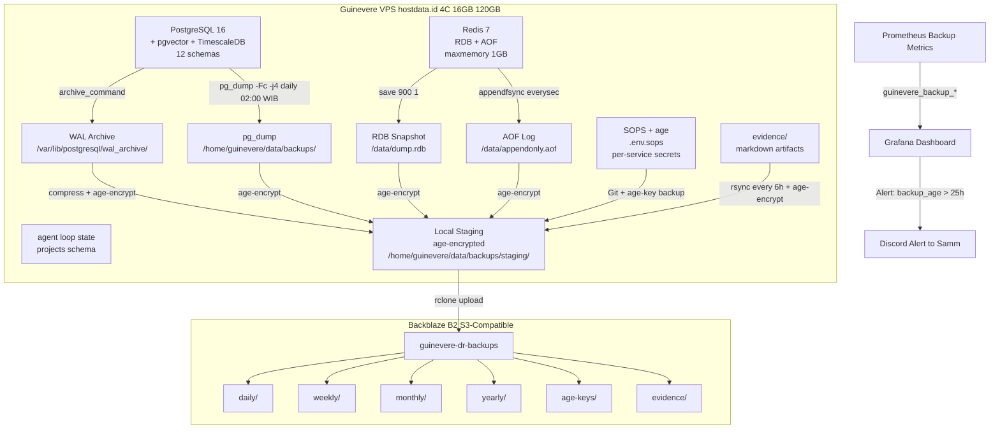

# Guinevere Disaster Recovery Plan — Backup Architecture & Strategy Research

**Document Type:** Research Report — Pre-generation evidence for DR Plan  
**Version:** 1.0  
**Date:** 2026-05-30  
**Status:** Accepted  
**Author:** Guinevere / Hephaestus  
**Classification:** STRICTLY PRIVATE & CONFIDENTIAL  
**Budget Boundary:** $3/month DR sub-cap within $30/month hard cap

---

## Related Documents

| Document | Relationship |
|---|---|
| `Guinevere_DatabaseERD_MigrationStrategy_v1.0.md` | 12 schemas, hypertables, HNSW indexes, Merkle audit chain — all backup targets |
| `Guinevere_DataGovernance_ClassificationPolicy_v1.0.md` | 5 classification tiers, 6 retention classes, backup reconciliation, encryption matrix |
| `Guinevere_EncryptionKeyManagementStandard_v1.0.md` | Key hierarchy, domain KEKs, backup key separation, age encryption for offsite |
| `Guinevere_Deployment_Guide_v1.0.md` | Backup timer 02:00 WIB, self-deploy 03:00 WIB, systemd services, Docker config |
| `Guinevere_Security_Policy_v1.0.md` | SOPS+age, FORBIDDEN actions, threat model, KILLSWITCH |
| `Guinevere_IncidentResponse_PostmortemRunbook_v1.0.md` | DB Corruption / Backup Failure runbooks, SEV classification, evidence paths |
| `Guinevere_Observability_AlertingSpec_v1.0.md` | `guinevere_backup_*` metrics, alert routing, Grafana panels |
| `Guinevere_SLO_SLA_ErrorBudgetSpec_v1.0.md` | Multi-window burn-rate alerts, monthly scorecard, backup SLOs |
| `Guinevere_Cost_FinOps_Model_v1.0.md` | $30/month cap, $2-$3 S3 allocation, DR cost center |
| `Guinevere_Questionnaire_TestPlan_DR_Ops_v1.0.md` | 78 DR questions with defaults — RTO/RPO targets, backup methods, verification cadence |
| `adr/ADR-025-backup-disaster-recovery-strategy.md` | Canonical DR decision: formal backup/DR policy with restore validation |

---

## Executive Summary

This research report provides the complete technical foundation for Guinevere's Backup Architecture and Strategy, synthesized from 11 authoritative source documents. Guinevere runs on a single VPS (hostdata.id: 4C/16GB/120GB, Ubuntu 24.04) with exactly 12 PostgreSQL schemas, 3 TimescaleDB hypertables (7-day, 1-day, 1-month chunks), pgvector HNSW indexes, Redis (RDB+AOF), and 17 systemd services. The DR budget is capped at $3/month against the $30/month hard cap.

The chosen strategy is: **WAL continuous archiving + daily pg_dump + Redis RDB/AOF snapshots + age-encrypted offsite storage to Backblaze B2** with a 7-daily/4-weekly/6-monthly/2-yearly retention scheme. All backups are encrypted with age before leaving the VPS, using a backup-specific key scope separated from runtime data keys.

---

## 1. DR Strategy Overview & Design Principles

### 1.1 Architecture Philosophy

Guinevere's DR follows a **single-VPS primary + offline backup restore capability** model. There is no secondary VPS, no active-active replication, and no multi-region deployment — driven by the $30/month hard cap constraint.

**Design Principles:**

| # | Principle | Source | Implication |
|---|---|---|---|
| 1 | Backup before deploy | Deployment Guide section 3.5 (backup 02:00, deploy 03:00) | Daily backup window always precedes self-deploy |
| 2 | Encryption before upload | DataGov section 8.1, EncryptionKeyMgmt section 5.2 (backup KEK) | No plaintext backup leaves the VPS |
| 3 | Classification drives encryption tier | DataGov section 4.1 (5 tiers), EncryptionKeyMgmt section 8 | Critical data gets double encryption in backups |
| 4 | Highest classification wins | DataGov section 4.2 | Mixed-category backups use highest classification |
| 5 | Restore reconciliation mandatory | DataGov section 6.4 | Delete/do-not-recall ledger must be replayed on restore |
| 6 | Backup key isolation | EncryptionKeyMgmt section 5.2 (backup KEK domain) | Backup keys separate from runtime data keys |
| 7 | No plaintext secrets in backup logs | SecurityPolicy, ObservabilitySpec section 5 | Audit trail for backup ops never leaks keys |
| 8 | Operational affordability | Cost/FinOps section 4.1 ($2-$3 S3 allocation) | All recommendations must fit within $3/month |
| 9 | Verification over trust | ADR-025, DR-Q61-68 | Daily checksums, weekly restore test, monthly full drill |
| 10 | Safety invariants not budget-constrained | Cost/FinOps section 4.2 (zero budget items) | Safe-word, encryption, integrity — no tradeoff |

### 1.2 DR Declaration Authority

- **DR Coordinator**: Samm (operator approval for full recovery)
- **DR Executor**: Guinevere (autonomous for P0 containment, auto-retry backups, cache warming)
- **DR Declaration**: SEV0/SEV1 triggers automatic DR evaluation; SEV2+ uses standard incident handling
- **Communication**: Discord (primary) then Gotify (backup) then SMS (SEV0 last resort)

---

## 2. RPO / RTO Targets per Service

### 2.1 Detailed Target Matrix

| # | Service / Data | RPO | RTO | Verification Method | Source |
|---|---|---|---|---|---|
| 1 | **PostgreSQL (all 12 schemas)** | less than 5 min (WAL continuous) | 30 min (WAL replay + dump restore) | Weekly test restore to isolated DB | DR-Q13, Q14 |
| 2 | **memory.episodes (TimescaleDB)** | less than 5 min (WAL) | Included in PostgreSQL RTO | Row count + embedding integrity | DR-Q28 |
| 3 | **surveillance.events (TimescaleDB)** | less than 5 min (WAL) | Included in PostgreSQL RTO | Chunk-level verification | DR-Q28, Q46 |
| 4 | **financial.transactions (TimescaleDB)** | less than 5 min (WAL) | Included in PostgreSQL RTO | 7-year retention verification | DR-Q28, Q47 |
| 5 | **audit.audit_trail (Merkle chain)** | less than 5 min (WAL) | Included in PostgreSQL RTO | Merkle chain hash continuity verified | DR-Q29, Q43 |
| 6 | **Redis (DB0-DB5)** | less than 1 sec (AOF everysec) | 5 min (RDB + AOF restore) | Cache hit rate normalization | DR-Q15, Q16 |
| 7 | **Redis (cache warming fallback)** | N/A (reconstructible) | 15-30 min (cache warming) | Start empty + PostgreSQL repopulate | DR-Q35 |
| 8 | **Core services (FastAPI + agent loop)** | N/A (stateless) | 5 min (systemd auto-restart) | Health endpoint probe | DR-Q17 |
| 9 | **Full VPS loss** | Per data RPO above | 4 hours total | Full stack verification checklist | DR-Q18 |
| 10 | **Evidence artifacts (evidence/)** | less than 6 hours (rsync to B2) | 30 min (restore from B2) | Artifact hash verification | DR-Q19, Q42 |
| 11 | **Agent loop state (SDLC)** | less than 15 min (PG phase transition) | Included in PostgreSQL RTO | Loop state checkpoint integrity | DR-Q20 |
| 12 | **Observability stack** | less than 24 hours | 30 min (Docker Compose + config) | Alert rule verification | DR-Q21 |
| 13 | **Surveillance ingestion pipeline** | less than 5 min (Redis buffer) | 15 min (API restart + queue drain) | Event backpressure normalization | DR-Q22 |
| 14 | **SOPS+age secrets** | Real-time (Git-tracked) | 5 min (re-encrypt + redeploy) | Decrypt verification | DR-Q36 |
| 15 | **Persona state / mood FSM** | less than 5 min (WAL) | Included in PostgreSQL RTO | Mood state + yandere level verification | DR-Q44 |
| 16 | **Financial 7-year archive** | Monthly archive (cold storage) | 2 hours (cold storage retrieval) | Regulatory compliance check | DR-Q47 |

---

## 3. Backup Architecture Diagram



### 3.1 Data Flow Description

1. **PostgreSQL WAL**: Continuous streaming via `archive_command` to local staging directory with `archive_timeout=900s` (15 min segments)
2. **pg_dump**: Daily 02:00 WIB via systemd timer, custom format (`-Fc`), parallel (`-j 4`), compressed
3. **Redis RDB**: Automatic snapshots based on `save 900 1` (at least 1 write in 900s)
4. **Redis AOF**: Continuous append with `appendfsync everysec`
5. **Local Staging**: All backup files are compressed and age-encrypted before staging
6. **Offsite Upload**: `rclone` to Backblaze B2 S3-compatible bucket, organized by retention tier
7. **Verification**: Daily checksum, weekly test restore, monthly full DR drill

---

## 4. PostgreSQL Backup Strategy

### 4.1 WAL Continuous Archiving Configuration

PostgreSQL WAL archiving provides the foundation for point-in-time recovery (PITR) with sub-5-minute RPO.

**postgresql.conf WAL settings** (add to Docker Compose command or config):

```ini
# WAL Archiving for PITR
wal_level = replica
archive_mode = on
archive_command = '/home/guinevere/scripts/archive_wal.sh %p %f'
archive_timeout = 900
max_wal_senders = 2
wal_keep_size = 2GB

# WAL size tuning for Guinevere write patterns
max_wal_size = 2GB
min_wal_size = 512MB
wal_buffers = 64MB
checkpoint_completion_target = 0.9

# Logging
log_checkpoints = on
log_line_prefix = '%t [%p]: [%l-1] user=%u,db=%d,app=%a,client=%h '
```

**Docker Compose integration:**

```yaml
postgresql:
  image: timescale/timescaledb:latest-pg16
  command: >
    postgres
    -c shared_buffers=2GB
    -c effective_cache_size=6GB
    -c work_mem=64MB
    -c maintenance_work_mem=512MB
    -c max_connections=200
    -c wal_level=replica
    -c archive_mode=on
    -c "archive_command=/home/guinevere/scripts/archive_wal.sh %p %f"
    -c archive_timeout=900
    -c max_wal_senders=2
    -c wal_keep_size=2GB
    -c max_wal_size=2GB
    -c min_wal_size=512MB
    -c wal_buffers=64MB
    -c checkpoint_completion_target=0.9
    -c log_checkpoints=on
    -c log_min_duration_statement=1000
    -c jit=off
  volumes:
    - pgdata:/var/lib/postgresql/data
    - /home/guinevere/scripts:/home/guinevere/scripts:ro
    - /home/guinevere/data/backups/wal_archive:/var/lib/postgresql/wal_archive
```

### 4.2 WAL Archive Script

```bash
#!/bin/bash
# /home/guinevere/scripts/archive_wal.sh
# Called by PostgreSQL archive_command: %p = WAL segment path, %f = WAL filename
set -euo pipefail

WAL_PATH="$1"
WAL_FILE="$2"
STAGING_DIR="/home/guinevere/data/backups/wal_staging"
B2_PREFIX="wal/$(date +%Y/%m/%d)"
AGE_RECIPIENT="$(grep 'public key:' /etc/sops/age/keys.txt | awk '{print $NF}')"
LOCKFILE="/tmp/archive_wal.lock"

# Prevent concurrent archive jobs
exec 200>"$LOCKFILE"
flock -n 200 || exit 0

# Ensure staging directory exists
mkdir -p "$STAGING_DIR/$B2_PREFIX"

# Compress WAL segment with zstd (better ratio than gzip for WAL data)
if command -v zstd &>/dev/null; then
    zstd -19 --rm -o "$STAGING_DIR/$B2_PREFIX/${WAL_FILE}.zst" "$WAL_PATH"
    COMPRESSED="$STAGING_DIR/$B2_PREFIX/${WAL_FILE}.zst"
else
    gzip -c "$WAL_PATH" > "$STAGING_DIR/$B2_PREFIX/${WAL_FILE}.gz"
    COMPRESSED="$STAGING_DIR/$B2_PREFIX/${WAL_FILE}.gz"
fi

# age-encrypt the compressed WAL
age -r "$AGE_RECIPIENT" -o "$STAGING_DIR/$B2_PREFIX/${WAL_FILE}.age" "$COMPRESSED"
rm -f "$COMPRESSED"

# Async upload to B2 (non-blocking, so archive_command returns fast)
nohup rclone copyto "$STAGING_DIR/$B2_PREFIX/${WAL_FILE}.age" \
    "b2:guinevere-dr-backups/${B2_PREFIX}/${WAL_FILE}.age" \
    --s3-storage-class=STANDARD --retries 3 --low-level-retries 5 &

# Generate checksum
sha256sum "$STAGING_DIR/$B2_PREFIX/${WAL_FILE}.age" | \
    awk '{print $1}' > "$STAGING_DIR/$B2_PREFIX/${WAL_FILE}.sha256"

# Clean WAL files older than 7 days locally (B2 has the offsite copy)
find "$STAGING_DIR" -name "*.age" -mtime +7 -delete 2>/dev/null || true
find "$STAGING_DIR" -name "*.sha256" -mtime +7 -delete 2>/dev/null || true

exit 0
```

**Key design decisions for WAL archiving:**

- `archive_timeout=900` ensures WAL segments are forced every 15 minutes even during low-activity periods (RPO guarantee)
- zstd compression with level 19 for maximum compression ratio on WAL data
- age encryption using backup-specific recipient key (derived from `backup` key domain per EncryptionKeyMgmt section 5.2)
- Async upload to B2 via rclone to avoid blocking PostgreSQL checkpoint completion
- Local WAL retention of 7 days for fast local PITR; B2 holds full history

### 4.3 Daily pg_dump with Custom Format

```bash
#!/bin/bash
# /home/guinevere/scripts/pg_dump_backup.sh
# Invoked by systemd guinevere-backup.service at 02:00 WIB
set -euo pipefail

BACKUP_DIR="/home/guinevere/data/backups"
TIMESTAMP=$(date +%Y%m%d_%H%M%S)
DB_NAME="guinevere"
DB_USER="guinevere_admin"
DUMP_FILE="${BACKUP_DIR}/pgdump_${DB_NAME}_${TIMESTAMP}.dump"
AGE_RECIPIENT="$(grep 'public key:' /etc/sops/age/keys.txt | awk '{print $NF}')"
BACKUP_LOG="${BACKUP_DIR}/backup.log"

echo "[$(date -Iseconds)] Starting PostgreSQL pg_dump" >> "$BACKUP_LOG"

# Step 1: Pre-backup health check
if ! docker exec postgresql pg_isready -U "$DB_USER" -d "$DB_NAME" -q; then
    echo "[$(date -Iseconds)] ERROR: PostgreSQL not ready, aborting backup" >> "$BACKUP_LOG"
    exit 1
fi

# Step 2: Mark backup start in ops.backup_log
docker exec postgresql psql -U "$DB_USER" -d "$DB_NAME" -q -c \
    "INSERT INTO ops.backup_log (backup_type, backup_path, status, started_at) VALUES ('pg_dump_custom', '${DUMP_FILE}.age', 'in_progress', NOW());"

# Step 3: Execute pg_dump with custom format, parallel, compressed
DUMP_START=$(date +%s)
docker exec postgresql pg_dump \
    -U "$DB_USER" \
    -h 127.0.0.1 -p 5432 \
    -d "$DB_NAME" \
    --format=custom \
    --compress=9 \
    --jobs=4 \
    --verbose \
    --no-owner --no-acl \
    --exclude-table-data='surveillance.events' \
    --exclude-table-data='memory.episodes' \
    -f /tmp/pgdump_current.dump 2>> "$BACKUP_LOG"
DUMP_END=$(date +%s)
DUMP_DURATION=$((DUMP_END - DUMP_START))

# Step 4: Copy dump from container to host
docker cp postgresql:/tmp/pgdump_current.dump "${DUMP_FILE}"
docker exec postgresql rm -f /tmp/pgdump_current.dump

# Step 5: Generate SHA256 checksum
sha256sum "$DUMP_FILE" > "${DUMP_FILE}.sha256"
CHECKSUM=$(cut -d' ' -f1 "${DUMP_FILE}.sha256")

# Step 6: age-encrypt the dump
age -r "$AGE_RECIPIENT" -o "${DUMP_FILE}.age" "$DUMP_FILE"
rm -f "$DUMP_FILE"

# Step 7: Record encrypted size
ENCRYPTED_SIZE=$(stat -c%s "${DUMP_FILE}.age" 2>/dev/null || stat --format=%s "${DUMP_FILE}.age")

# Step 8: Upload to B2
rclone copyto "${DUMP_FILE}.age" \
    "b2:guinevere-dr-backups/daily/pgdump_${TIMESTAMP}.dump.age" \
    --s3-storage-class=STANDARD --retries 5 --low-level-retries 10

rclone copyto "${DUMP_FILE}.sha256" \
    "b2:guinevere-dr-backups/daily/pgdump_${TIMESTAMP}.dump.sha256"

# Step 9: Update ops.backup_log
docker exec postgresql psql -U "$DB_USER" -d "$DB_NAME" -q -c \
    "UPDATE ops.backup_log SET status = 'completed', completed_at = NOW(), size_bytes = ${ENCRYPTED_SIZE}, checksum = '${CHECKSUM}' WHERE backup_path = '${DUMP_FILE}.age' AND status = 'in_progress';"

# Step 10: Emit Prometheus metrics via pushgateway
cat <<EOF | curl -s --data-binary @- http://127.0.0.1:9091/metrics/job/backup
guinevere_backup_last_success_timestamp_seconds{backup_type="pg_dump"} $(date +%s)
guinevere_backup_duration_seconds{backup_type="pg_dump",status="success"} ${DUMP_DURATION}
guinevere_backup_size_bytes{backup_type="pg_dump"} ${ENCRYPTED_SIZE}
EOF

# Step 11: Clean old local backups (keep 7 days, B2 has offsite copy)
find "$BACKUP_DIR" -name "pgdump_*.age" -mtime +7 -delete 2>/dev/null || true
find "$BACKUP_DIR" -name "pgdump_*.sha256" -mtime +7 -delete 2>/dev/null || true

echo "[$(date -Iseconds)] PostgreSQL backup completed in ${DUMP_DURATION}s, size ${ENCRYPTED_SIZE} bytes" >> "$BACKUP_LOG"
```

### 4.4 TimescaleDB Chunk-Aware Backup

TimescaleDB hypertables require special handling because:

1. **Compressed chunks**: TimescaleDB compresses older chunks. A pg_dump custom format backup handles this, but restore requires TimescaleDB to be installed first.
2. **Retention policies**: The `surveillance.events` table has 180-day retention. Backup should only include un-expired chunks.
3. **Large table optimization**: Excluding raw hypertable data from daily pg_dump and handling it via separate chunk-level backups reduces daily backup size.

**Hypertable inventory:**

| Table | Chunk Interval | Compression Policy | Retention Policy | Backup Strategy |
|---|---|---|---|---|
| `memory.episodes` | 7 days | After 14 days | 10 years | Excluded from daily dump; weekly full chunk backup |
| `surveillance.events` | 1 day | After 7 days | 180 days | Excluded from daily dump; only un-expired chunks backed up |
| `financial.transactions` | 1 month | N/A | 7 years | Included in daily dump (slowly growing) |
| `audit.audit_trail` | 1 month | N/A | 1 year | Included in daily dump |

**Chunk-level backup approach for large tables:**

```bash
#!/bin/bash
# /home/guinevere/scripts/timescale_chunk_backup.sh
# Weekly chunk-level backup for large hypertables (Sunday 03:30 WIB)
set -euo pipefail

BACKUP_DIR="/home/guinevere/data/backups/chunks"
TIMESTAMP=$(date +%Y%m%d)
AGE_RECIPIENT="$(grep 'public key:' /etc/sops/age/keys.txt | awk '{print $NF}')"
DB_NAME="guinevere"
DB_USER="guinevere_admin"

mkdir -p "$BACKUP_DIR"

# Export episodes chunks from last 4 weeks (older chunks are compressed, handle separately)
docker exec postgresql psql -U "$DB_USER" -d "$DB_NAME" -q -c \
    "COPY (SELECT * FROM memory.episodes WHERE started_at > NOW() - INTERVAL '28 days') TO STDOUT WITH CSV HEADER" | \
    zstd -19 | age -r "$AGE_RECIPIENT" -o "$BACKUP_DIR/episodes_recent_${TIMESTAMP}.csv.zst.age"

# Export surveillance events from last 7 days (retention is 180 days, but daily backup only catches recent)
docker exec postgresql psql -U "$DB_USER" -d "$DB_NAME" -q -c \
    "COPY (SELECT * FROM surveillance.events WHERE occurred_at > NOW() - INTERVAL '7 days') TO STDOUT WITH CSV HEADER" | \
    zstd -19 | age -r "$AGE_RECIPIENT" -o "$BACKUP_DIR/events_recent_${TIMESTAMP}.csv.zst.age"

# Upload to B2
rclone copy "$BACKUP_DIR" "b2:guinevere-dr-backups/weekly/chunks/" \
    --s3-storage-class=STANDARD --include "*_${TIMESTAMP}*"

# Clean local chunks older than 30 days
find "$BACKUP_DIR" -name "*.age" -mtime +30 -delete 2>/dev/null || true

echo "[$(date -Iseconds)] TimescaleDB chunk backup completed"
```

### 4.5 pgvector Index Rebuild Strategy Post-Restore

pgvector HNSW indexes are stored as regular PostgreSQL indexes and included in pg_dump custom format. However, after restore:

1. **HNSW indexes are restored** automatically from the dump if the pgvector extension is present.
2. **HNSW index integrity** must be verified post-restore because HNSW uses approximate nearest-neighbor search that could be affected by index corruption.
3. **Rebuild procedure** if index integrity check fails:

```sql
-- Verify HNSW index integrity
SELECT pg_relation_size('ix_episodes_embedding_hnsw') AS index_size;
SELECT hnsw_check('memory.episodes', 'embedding') FROM pg_hnsw_check();

-- If integrity check fails, rebuild CONCURRENTLY
DROP INDEX CONCURRENTLY IF EXISTS ix_episodes_embedding_hnsw;
CREATE INDEX CONCURRENTLY ix_episodes_embedding_hnsw
    ON memory.episodes USING hnsw (embedding vector_cosine_ops)
    WITH (m = 16, ef_construction = 128);

-- Rebuild all HNSW indexes (run as maintenance)
-- ix_episodes_embedding_hnsw, ix_semantic_facts_embedding_hnsw, etc.
```

**Post-restore HNSW verification checklist:**

- [ ] pgvector extension installed (`CREATE EXTENSION IF NOT EXISTS vector;`)
- [ ] All HNSW indexes present (`SELECT * FROM pg_indexes WHERE indexdef LIKE '%hnsw%';`)
- [ ] Index sizes within expected range (compare to pre-backup baseline from ops.backup_log)
- [ ] Sample vector search returns expected results
- [ ] Embedding dimension matches source (vector(1536))

### 4.6 Point-in-Time Recovery (PITR) Procedure

PITR allows restoring PostgreSQL to any point within the last 7 days (WAL retention window).

```bash
#!/bin/bash
# /home/guinevere/scripts/pitr_restore.sh
# Usage: ./pitr_restore.sh "2026-05-30 14:30:00+07"
set -euo pipefail

TARGET_TIME="${1:?Usage: pitr_restore.sh <target_timestamp>}"
BASE_BACKUP="/home/guinevere/data/backups/pgdump_latest.dump.age"
WAL_DIR="/home/guinevere/data/backups/wal_staging"
RESTORE_DIR="/var/lib/postgresql/restore"

echo "Starting PITR to target: $TARGET_TIME"

# Step 1: Stop PostgreSQL
systemctl stop guinevere-core guinevere-surveillance guinevere-loops
docker stop postgresql

# Step 2: Find latest base backup before target time
LATEST_DUMP=$(ls -t /home/guinevere/data/backups/pgdump_*.dump.age 2>/dev/null | head -1)
if [ -z "$LATEST_DUMP" ]; then
    echo "ERROR: No pg_dump backup found. Download from B2."
    rclone copy "b2:guinevere-dr-backups/daily/" /home/guinevere/data/backups/ \
        --include "pgdump_*.age" --s3-storage-class=STANDARD
    LATEST_DUMP=$(ls -t /home/guinevere/data/backups/pgdump_*.dump.age | head -1)
fi

# Step 3: Decrypt base backup
AGE_KEY="/etc/sops/age/keys.txt"
age --decrypt -i "$AGE_KEY" -o "${LATEST_DUMP%.age}" "$LATEST_DUMP"

# Step 4: Prepare restore directory
mkdir -p "$RESTORE_DIR"
# For pg_dump custom format, use pg_restore with recovery_target_time
# Note: pg_dump -Fc is a logical backup; for physical PITR use pg_basebackup

# Step 5: For physical PITR, use pg_basebackup + WAL replay
# This requires archive_mode setup and continuous WAL segments
# The WAL segments from archive_command provide the physical recovery path

# Step 6: Configure recovery.conf (postgresql.auto.conf for PG12+)
cat > /var/lib/postgresql/restore/recovery.signal <<EOF
# Recovery target
recovery_target_time = '$TARGET_TIME'
restore_command = 'age --decrypt -i /etc/sops/age/keys.txt -o %p %f.age'
recovery_target_action = 'promote'
EOF

# Step 7: Start PostgreSQL in recovery mode
docker start postgresql
# Wait for recovery completion
until docker exec postgresql pg_isready; do sleep 5; done

# Step 8: Verify recovery
docker exec postgresql psql -U postgres -d guinevere -c "SELECT NOW(), pg_is_in_recovery();"

# Step 9: Restart all services
systemctl start guinevere-core guinevere-surveillance guinevere-loops

echo "PITR to $TARGET_TIME completed"
```

---

## 5. Redis Backup Strategy

### 5.1 RDB Snapshot Schedule

Redis RDB (snapshot) configuration in the Docker Compose:

```yaml
redis:
  image: redis:7-alpine
  command: >
    redis-server
    --requirepass ${REDIS_PASSWORD}
    --maxmemory 1gb
    --maxmemory-policy allkeys-lru
    --save 900 1
    --save 300 100
    --save 60 10000
    --appendonly yes
    --appendfsync everysec
    --auto-aof-rewrite-percentage 100
    --auto-aof-rewrite-min-size 64mb
```

**RDB save rules:**

| Rule | Meaning | RPO Implication |
|---|---|---|
| `save 900 1` | Snapshot if at least 1 write in 900 seconds (15 min) | 15-minute data loss ceiling |
| `save 300 100` | Snapshot if at least 100 writes in 300 seconds (5 min) | Frequent writes trigger faster snapshots |
| `save 60 10000` | Snapshot if at least 10000 writes in 60 seconds (1 min) | Burst protection |

### 5.2 AOF Configuration and Fsync Policy

```ini
# AOF configuration
appendonly yes
appendfsync everysec        # Sync to disk every second (1 second RPO)
no-appendfsync-on-rewrite no # Continue fsync during rewrite
auto-aof-rewrite-percentage 100
auto-aof-rewrite-min-size 64mb
aof-use-rdb-preamble yes    # Hybrid AOF+RDB for faster recovery
```

**AOF fsync policy rationale:**

- `everysec` provides a balance between performance and durability
- Maximum data loss is 1 second of writes (RPO less than 5 min as per DR-Q16)
- `aof-use-rdb-preamble yes` enables Redis 4.0 hybrid format: RDB preamble in AOF file for faster loading

### 5.3 Redis Backup Script

```bash
#!/bin/bash
# /home/guinevere/scripts/redis_backup.sh
# Called every 15 minutes via systemd timer or included in backup.sh
set -euo pipefail

BACKUP_DIR="/home/guinevere/data/backups/redis"
TIMESTAMP=$(date +%Y%m%d_%H%M%S)
AGE_RECIPIENT="$(grep 'public key:' /etc/sops/age/keys.txt | awk '{print $NF}')"
REDIS_PASSWORD="$(SOPS_AGE_KEY_FILE=/etc/sops/age/keys.txt sops --decrypt /home/guinevere/secrets/guinevere.env.sops | grep REDIS_PASSWORD | cut -d= -f2)"

mkdir -p "$BACKUP_DIR"

# Step 1: Trigger BGSAVE for immediate RDB snapshot
docker exec redis redis-cli -a "$REDIS_PASSWORD" BGSAVE 2>/dev/null

# Step 2: Wait for BGSAVE to complete
sleep 5
until docker exec redis redis-cli -a "$REDIS_PASSWORD" LASTSAVE 2>/dev/null | grep -q "[0-9]"; do
    sleep 2
done

# Step 3: Copy RDB and AOF files from container
docker cp redis:/data/dump.rdb "$BACKUP_DIR/dump_${TIMESTAMP}.rdb"
docker cp redis:/data/appendonly.aof "$BACKUP_DIR/appendonly_${TIMESTAMP}.aof" 2>/dev/null || true

# Step 4: Compress and encrypt
zstd -19 --rm "$BACKUP_DIR/dump_${TIMESTAMP}.rdb"
age -r "$AGE_RECIPIENT" -o "$BACKUP_DIR/dump_${TIMESTAMP}.rdb.zst.age" "$BACKUP_DIR/dump_${TIMESTAMP}.rdb.zst"
rm -f "$BACKUP_DIR/dump_${TIMESTAMP}.rdb.zst"

if [ -f "$BACKUP_DIR/appendonly_${TIMESTAMP}.aof" ]; then
    zstd -19 --rm "$BACKUP_DIR/appendonly_${TIMESTAMP}.aof"
    age -r "$AGE_RECIPIENT" -o "$BACKUP_DIR/appendonly_${TIMESTAMP}.aof.zst.age" "$BACKUP_DIR/appendonly_${TIMESTAMP}.aof.zst"
    rm -f "$BACKUP_DIR/appendonly_${TIMESTAMP}.aof.zst"
fi

# Step 5: Upload to B2
rclone copy "$BACKUP_DIR" "b2:guinevere-dr-backups/daily/redis/" \
    --include "*_${TIMESTAMP}*" --s3-storage-class=STANDARD

# Step 6: Generate checksums
sha256sum "$BACKUP_DIR/dump_${TIMESTAMP}.rdb.zst.age" > "$BACKUP_DIR/dump_${TIMESTAMP}.sha256"

# Step 7: Clean local backups older than 7 days
find "$BACKUP_DIR" -name "*.age" -mtime +7 -delete 2>/dev/null || true

# Step 8: Emit metrics
cat <<EOF | curl -s --data-binary @- http://127.0.0.1:9091/metrics/job/backup
guinevere_backup_last_success_timestamp_seconds{backup_type="redis_rdb"} $(date +%s)
EOF

echo "[$(date -Iseconds)] Redis backup completed"
```

### 5.4 Redis Data Recovery Procedure

**Recovery from RDB + AOF:**

```bash
#!/bin/bash
# /home/guinevere/scripts/redis_restore.sh
# Usage: ./redis_restore.sh <path-to-encrypted-rdb.age> [path-to-encrypted-aof.age]
set -euo pipefail

RDB_ENCRYPTED="${1:?Usage: redis_restore.sh <rdb.age> [aof.age]}"
AOF_ENCRYPTED="${2:-}"
AGE_KEY="/etc/sops/age/keys.txt"
RESTORE_DIR="/home/guinevere/data/backups/redis_restore"

mkdir -p "$RESTORE_DIR"

# Step 1: Stop Redis
docker stop redis

# Step 2: Decrypt RDB
age --decrypt -i "$AGE_KEY" -o "$RESTORE_DIR/dump.rdb.zst" "$RDB_ENCRYPTED"
zstd --decompress --rm "$RESTORE_DIR/dump.rdb.zst"

# Step 3: Decrypt AOF if provided
if [ -n "$AOF_ENCRYPTED" ]; then
    age --decrypt -i "$AGE_KEY" -o "$RESTORE_DIR/appendonly.aof.zst" "$AOF_ENCRYPTED"
    zstd --decompress --rm "$RESTORE_DIR/appendonly.aof.zst"
    docker cp "$RESTORE_DIR/appendonly.aof" redis:/data/appendonly.aof
fi

# Step 4: Copy RDB into Redis data directory
docker cp "$RESTORE_DIR/dump.rdb" redis:/data/dump.rdb

# Step 5: Start Redis
docker start redis
sleep 5

# Step 6: Verify Redis is operational
docker exec redis redis-cli -a "$REDIS_PASSWORD" PING
docker exec redis redis-cli -a "$REDIS_PASSWORD" DBSIZE
docker exec redis redis-cli -a "$REDIS_PASSWORD" INFO persistence | grep -E "rdb_|aof_"

# Step 7: Verify cache warming
echo "Redis restored. Cache warming will begin from PostgreSQL source."
echo "Monitor guinevere_redis_memory_utilization_ratio and cache hit rate."
```

**Fallback: Redis unrecoverable (data corrupted):**

1. Start fresh Redis with empty data
2. Application auto-repopulates cache from PostgreSQL
3. Degraded mode for 15-30 minutes during cache warming
4. Monitor `guinevere_redis_key_evictions_total` for evictions during warming

---

## 6. SOPS & Secrets Backup

### 6.1 age Key Backup and Escrow

Per the Deployment Guide and EncryptionKeyMgmt Standard, age key management follows this hierarchy:

| Layer | Key | Storage | Custodian |
|---|---|---|---|
| Layer 0 | Samm Recovery Root | Offline (printed QR, USB drive in safe) | Samm |
| Layer 1 | SOPS age identity | `/etc/sops/age/keys.txt` on VPS (0600, root:guinevere-svc) | Runtime host |
| Layer 1 | Backup age key | `/root/age-key-backup-YYYYMMDD.txt` on VPS | Root filesystem |
| Layer 1 | Offsite age key | B2 `age-keys/` bucket, encrypted with Samm's recovery passphrase | B2 |

**Key escrow procedure:**

```bash
#!/bin/bash
# /home/guinevere/scripts/backup_age_key.sh
# Run during initial setup and after key rotation
set -euo pipefail

AGE_KEY="/etc/sops/age/keys.txt"
TIMESTAMP=$(date +%Y%m%d)
BACKUP_DIR="/home/guinevere/data/backups/age_keys"
PASSPHRASE_PROMPT="Enter backup passphrase for age key escrow: "

mkdir -p "$BACKUP_DIR"

# Step 1: Local encrypted backup (age with password-based encryption)
echo "Creating passphrase-encrypted backup of age key..."
age --encrypt --passphrase --output "$BACKUP_DIR/age_key_${TIMESTAMP}.age.passphrase" "$AGE_KEY"

# Step 2: Upload to B2 (already passphrase-encrypted, no additional age needed)
rclone copyto "$BACKUP_DIR/age_key_${TIMESTAMP}.age.passphrase" \
    "b2:guinevere-dr-backups/age-keys/age_key_${TIMESTAMP}.age.passphrase" \
    --s3-storage-class=STANDARD

# Step 3: Print reminder
echo ""
echo "IMPORTANT: Record the passphrase used for this backup."
echo "Store passphrase separately from the key (e.g., password manager)."
echo "Local backup: $BACKUP_DIR/age_key_${TIMESTAMP}.age.passphrase"
echo "Offsite backup: b2:guinevere-dr-backups/age-keys/"
echo ""

# Step 4: Also create a paper backup prompt
echo "For maximum security, also print the age key to paper:"
echo "  cat $AGE_KEY | lpr"
echo "Or create a QR code:"
echo "  cat $AGE_KEY | qrencode -o age_key_qr_${TIMESTAMP}.png"
```

### 6.2 .env.sops Backup Procedure

All SOPS-encrypted secret files are tracked in Git (encrypted). Additional backup:

```bash
#!/bin/bash
# /home/guinevere/scripts/backup_sops.sh
# Backup all .env.sops files
set -euo pipefail

SECRETS_DIR="/home/guinevere/secrets"
BACKUP_DIR="/home/guinevere/data/backups/sops"
TIMESTAMP=$(date +%Y%m%d_%H%M%S)
AGE_RECIPIENT="$(grep 'public key:' /etc/sops/age/keys.txt | awk '{print $NF}')"

mkdir -p "$BACKUP_DIR"

# Step 1: Create tarball of all .sops files (already encrypted by SOPS+age)
tar czf "$BACKUP_DIR/sops_${TIMESTAMP}.tar.gz" -C "$SECRETS_DIR" .

# Step 2: Additional age encryption layer (defense in depth)
age -r "$AGE_RECIPIENT" -o "$BACKUP_DIR/sops_${TIMESTAMP}.tar.gz.age" "$BACKUP_DIR/sops_${TIMESTAMP}.tar.gz"
rm -f "$BACKUP_DIR/sops_${TIMESTAMP}.tar.gz"

# Step 3: Upload to B2
rclone copyto "$BACKUP_DIR/sops_${TIMESTAMP}.tar.gz.age" \
    "b2:guinevere-dr-backups/daily/sops/sops_${TIMESTAMP}.tar.gz.age" \
    --s3-storage-class=STANDARD

# Step 4: Clean old backups
find "$BACKUP_DIR" -name "*.age" -mtime +30 -delete 2>/dev/null || true

echo "[$(date -Iseconds)] SOPS secrets backup completed"
```

### 6.3 Key Compromise Recovery

If age key or any SOPS-managed secret is compromised:

1. **Immediate**: Isolate affected services (`systemctl stop guinevere-*`)
2. **Generate new age key**: `age-keygen -o /etc/sops/age/keys.txt.new`
3. **Re-encrypt all .env.sops** with new recipient:

```bash
# For each .sops file:
SOPS_AGE_KEY_FILE=/etc/sops/age/keys.txt sops --decrypt file.env.sops > /tmp/plain.env
# Update .sops.yaml with new public key
SOPS_AGE_KEY_FILE=/etc/sops/age/keys.txt.new sops --encrypt --in-place /tmp/plain.env
# Move encrypted back
mv /tmp/plain.env file.env.sops
shred -u /tmp/plain.env 2>/dev/null || true
```

4. **Rotate ALL API keys/tokens** (9Router, Discord, GitHub PAT, etc.)
5. **Redeploy all services** with new secrets
6. **Verify no unauthorized access** during compromise window
7. **Document**: Create ADR and incident report at `evidence/incidents/YYYY-MM-DD-SEV0-key-compromise/`

---

## 7. Evidence & Artifact Backup

### 7.1 evidence/ Directory Sync Strategy

Evidence artifacts are markdown reports, audit findings, and implementation evidence stored in the `evidence/` directory. These are critical for governance continuity.

```bash
#!/bin/bash
# /home/guinevere/scripts/backup_evidence.sh
# Runs every 6 hours via systemd timer
set -euo pipefail

EVIDENCE_DIR="/home/guinevere"
BACKUP_DIR="/home/guinevere/data/backups/evidence"
TIMESTAMP=$(date +%Y%m%d_%H%M%S)
AGE_RECIPIENT="$(grep 'public key:' /etc/sops/age/keys.txt | awk '{print $NF}')"

mkdir -p "$BACKUP_DIR"

# Step 1: rsync evidence directories to staging
rsync -avz --delete \
    --include='evidence/***' \
    --include='audit-reports/***' \
    --include='research-reports/***' \
    --include='adr/***' \
    --include='*.md' \
    --exclude='*' \
    "$EVIDENCE_DIR/" "$BACKUP_DIR/staging/"

# Step 2: Create compressed tarball
tar czf "$BACKUP_DIR/evidence_${TIMESTAMP}.tar.gz" -C "$BACKUP_DIR/staging" .

# Step 3: age-encrypt
age -r "$AGE_RECIPIENT" -o "$BACKUP_DIR/evidence_${TIMESTAMP}.tar.gz.age" "$BACKUP_DIR/evidence_${TIMESTAMP}.tar.gz"
rm -f "$BACKUP_DIR/evidence_${TIMESTAMP}.tar.gz"

# Step 4: Upload to B2
rclone copyto "$BACKUP_DIR/evidence_${TIMESTAMP}.tar.gz.age" \
    "b2:guinevere-dr-backups/evidence/evidence_${TIMESTAMP}.tar.gz.age" \
    --s3-storage-class=STANDARD

# Step 5: Generate checksum
sha256sum "$BACKUP_DIR/evidence_${TIMESTAMP}.tar.gz.age" > "$BACKUP_DIR/evidence_${TIMESTAMP}.sha256"
rclone copyto "$BACKUP_DIR/evidence_${TIMESTAMP}.sha256" \
    "b2:guinevere-dr-backups/evidence/evidence_${TIMESTAMP}.sha256"

# Step 6: Clean old local evidence backups (keep 7 days)
find "$BACKUP_DIR" -name "evidence_*.age" -mtime +7 -delete 2>/dev/null || true
rm -rf "$BACKUP_DIR/staging"

echo "[$(date -Iseconds)] Evidence backup completed"
```

### 7.2 Audit Trail Integrity Verification (Merkle Chain)

The `audit.audit_trail` table uses a Merkle chain where each row contains:

- `event_hash`: SHA-256 of the event payload
- `previous_hash`: SHA-256 of the previous row's event_hash (chain link)

**Post-restore verification procedure:**

```sql
-- Verify Merkle chain integrity after restore
-- Check that each row's previous_hash matches the prior row's event_hash
WITH chain_check AS (
    SELECT 
        id,
        event_hash,
        previous_hash,
        LAG(event_hash) OVER (ORDER BY occurred_at, id) AS expected_previous
    FROM audit.audit_trail
    ORDER BY occurred_at, id
)
SELECT 
    COUNT(*) AS total_rows,
    COUNT(*) FILTER (WHERE previous_hash = expected_previous OR (previous_hash IS NULL AND expected_previous IS NULL)) AS valid_links,
    COUNT(*) FILTER (WHERE previous_hash != expected_previous) AS broken_links,
    CASE 
        WHEN COUNT(*) FILTER (WHERE previous_hash != expected_previous) = 0 THEN 'CHAIN VALID'
        ELSE 'CHAIN BROKEN - INVESTIGATE'
    END AS chain_status
FROM chain_check;
```

**Daily audit trail export to immutable storage:**

```bash
#!/bin/bash
# /home/guinevere/scripts/audit_trail_export.sh
# Daily export of audit trail to B2 immutable storage
set -euo pipefail

EXPORT_DIR="/home/guinevere/data/backups/audit_exports"
TIMESTAMP=$(date +%Y%m%d)
AGE_RECIPIENT="$(grep 'public key:' /etc/sops/age/keys.txt | awk '{print $NF}')"
DB_NAME="guinevere"
DB_USER="guinevere_admin"

mkdir -p "$EXPORT_DIR"

# Export audit trail as CSV with SHA256 manifest
docker exec postgresql psql -U "$DB_USER" -d "$DB_NAME" -c \
    "COPY audit.audit_trail TO STDOUT WITH CSV HEADER" | \
    tee "$EXPORT_DIR/audit_trail_${TIMESTAMP}.csv" | \
    sha256sum > "$EXPORT_DIR/audit_trail_${TIMESTAMP}.sha256"

# Compress and encrypt
zstd -19 --rm "$EXPORT_DIR/audit_trail_${TIMESTAMP}.csv"
age -r "$AGE_RECIPIENT" -o "$EXPORT_DIR/audit_trail_${TIMESTAMP}.csv.zst.age" "$EXPORT_DIR/audit_trail_${TIMESTAMP}.csv.zst"
rm -f "$EXPORT_DIR/audit_trail_${TIMESTAMP}.csv.zst"

# Upload to B2 (immutable storage class)
rclone copyto "$EXPORT_DIR/audit_trail_${TIMESTAMP}.csv.zst.age" \
    "b2:guinevere-dr-backups/audit/audit_trail_${TIMESTAMP}.csv.zst.age" \
    --s3-storage-class=STANDARD --b2-hard-delete=false

rclone copyto "$EXPORT_DIR/audit_trail_${TIMESTAMP}.sha256" \
    "b2:guinevere-dr-backups/audit/audit_trail_${TIMESTAMP}.sha256"

# Clean old exports (keep 30 days locally, B2 is permanent)
find "$EXPORT_DIR" -name "*.age" -mtime +30 -delete 2>/dev/null || true
```

### 7.3 SLO Scorecard Preservation

Monthly SLO scorecards are written to `evidence/scorecards/YYYY-MM-scorecard.md`. These are included in the evidence backup (section 7.1) and also uploaded separately to B2:

```bash
# Include in evidence backup; also upload latest scorecard separately
rclone copyto "evidence/scorecards/$(date +%Y-%m)-scorecard.md" \
    "b2:guinevere-dr-backups/scorecards/$(date +%Y-%m)-scorecard.md"
```

---

## 8. SDLC Loop State Backup

### 8.1 Active Loop State Serialization

Agent loop state is persisted to PostgreSQL in the `projects` schema on every phase transition (per AgentLoopSpec v2.0):

| Table | Purpose | Backup Coverage |
|---|---|---|
| `projects.loop_instances` | Current loop phase, status, task reference | Included in pg_dump |
| `projects.agent_tasks` | Sub-agent task queue and execution log | Included in pg_dump |
| `projects.tasks` | Task registry with status tracking | Included in pg_dump |
| `projects.evidence_artifacts` | Evidence file references with SHA-256 hashes | Included in pg_dump |

Loop state is backed up implicitly through PostgreSQL backup. No separate loop-state export is needed.

### 8.2 Resume After Recovery

After PostgreSQL restore, loop resume procedure:

1. **Identify interrupted loops**: Query `projects.loop_instances WHERE status = 'in_progress'`
2. **Verify evidence chain**: Check `projects.evidence_artifacts` for each active loop
3. **Resume from last known good phase**: Update `loop_phase` to last completed phase
4. **If irrecoverable**: Mark loop as `failed`, create evidence artifact, restart with context preservation

```sql
-- Check active loops after restore
SELECT li.id, li.loop_phase, li.status, li.started_at,
       t.task_name, t.project_name
FROM projects.loop_instances li
JOIN projects.tasks t ON li.task_id = t.id
WHERE li.status = 'in_progress'
ORDER BY li.started_at DESC;

-- Resume from last completed phase
UPDATE projects.loop_instances 
SET loop_phase = 'Execute', status = 'in_progress'
WHERE id = '<loop_id>' AND status = 'failed';
```

---

## 9. Backup Storage Architecture

### 9.1 Local Storage Layout and Rotation

```
/home/guinevere/data/backups/
    backup.log                    # Master backup log
    pgdump_YYYYMMDD_HHMMSS.dump.age     # Encrypted pg_dump (7 days)
    pgdump_YYYYMMDD_HHMMSS.dump.sha256  # Checksum
    wal_staging/
        YYYY/MM/DD/
            0000000100000000000000XX.age    # Encrypted WAL segments (7 days)
            0000000100000000000000XX.sha256
    redis/
        dump_YYYYMMDD_HHMMSS.rdb.zst.age   # Encrypted RDB (7 days)
        appendonly_YYYYMMDD_HHMMSS.aof.zst.age
    sops/
        sops_YYYYMMDD_HHMMSS.tar.gz.age    # Encrypted secrets (30 days)
    evidence/
        evidence_YYYYMMDD_HHMMSS.tar.gz.age # Encrypted evidence (7 days)
    chunks/
        episodes_recent_YYYYMMDD.csv.zst.age  # TimescaleDB chunks (30 days)
        events_recent_YYYYMMDD.csv.zst.age
    audit_exports/
        audit_trail_YYYYMMDD.csv.zst.age    # Daily audit export (30 days)
    age_keys/
        age_key_YYYYMMDD.age.passphrase     # Escrowed age key (permanent)
```

**Local storage budget:**

| Category | Max Size | Retention | Cleanup |
|---|---|---|---|
| pg_dump | ~200 MB per dump x 7 | 7 days | ~1.4 GB |
| WAL segments | ~50 MB per day | 7 days | ~350 MB |
| Redis RDB | ~50 MB per snapshot | 7 days | ~350 MB |
| Evidence | ~10 MB per backup | 7 days | ~70 MB |
| SOPS | ~1 MB per backup | 30 days | ~30 MB |
| Audit exports | ~5 MB per day | 30 days | ~150 MB |
| **Total local** | | | **~2.4 GB** |

This fits comfortably within the 120 GB SSD (leaving 117+ GB for PostgreSQL data, Docker images, logs, and application files).

### 9.2 Backblaze B2 Bucket Structure

```
b2:guinevere-dr-backups/
    daily/
        pgdump_YYYYMMDD_HHMMSS.dump.age      # Daily PG dumps (7 days, then moved to weekly)
        pgdump_YYYYMMDD_HHMMSS.dump.sha256
        redis/
            dump_*.rdb.zst.age               # Daily Redis snapshots (7 days)
            appendonly_*.aof.zst.age
        sops/
            sops_*.tar.gz.age                # Daily secrets (30 days)
        wal/
            YYYY/MM/DD/
                *.age                        # WAL segments (7 days on B2)
    weekly/
        pgdump_*.dump.age                    # Weekly PG dumps (4 weeks = 28 days)
        chunks/
            episodes_recent_*.csv.zst.age    # TimescaleDB chunk backups (4 weeks)
            events_recent_*.csv.zst.age
    monthly/
        pgdump_*.dump.age                    # Monthly PG dumps (6 months)
        audit/
            audit_trail_*.csv.zst.age        # Monthly audit exports (permanent)
        financial/
            financial_archive_*.age          # Monthly financial cold archive
    yearly/
        pgdump_*.dump.age                    # Yearly PG dumps (2 years)
    evidence/
        evidence_*.tar.gz.age                # Evidence artifacts (permanent)
    audit/
        audit_trail_*.csv.zst.age           # Daily audit trail exports (permanent)
    age-keys/
        age_key_*.age.passphrase            # Age key escrow (permanent)
    scorecards/
        YYYY-MM-scorecard.md                 # Monthly SLO scorecards (permanent)
```

### 9.3 age Encryption Wrapper for All Uploads

Every file uploaded to B2 is wrapped in age encryption using this pattern:

```bash
# Standard encryption wrapper
encrypt_and_upload() {
    local SOURCE_FILE="$1"
    local B2_PATH="$2"
    local AGE_RECIPIENT="$(grep 'public key:' /etc/sops/age/keys.txt | awk '{print $NF}')"
    
    # age-encrypt
    age -r "$AGE_RECIPIENT" -o "${SOURCE_FILE}.age" "$SOURCE_FILE"
    
    # Generate checksum
    sha256sum "${SOURCE_FILE}.age" > "${SOURCE_FILE}.sha256"
    
    # Upload both file and checksum
    rclone copyto "${SOURCE_FILE}.age" "b2:guinevere-dr-backups/${B2_PATH}" \
        --s3-storage-class=STANDARD --retries 5 --low-level-retries 10
    
    rclone copyto "${SOURCE_FILE}.sha256" "b2:guinevere-dr-backups/${B2_PATH%.age}.sha256"
    
    # Remove local encrypted file (B2 has the copy)
    rm -f "${SOURCE_FILE}.age" "${SOURCE_FILE}.sha256"
}
```

**Key separation:**

- The backup age key is derived from the backup domain KEK (per EncryptionKeyMgmt section 5.2)
- Backup key is never used for runtime data encryption
- Backup key is never stored alongside runtime keys in plaintext
- Age key escrow uses passphrase-based encryption (separate from the age identity key)

### 9.4 Bandwidth Optimization (Incremental, Dedup)

| Technique | Implementation | Bandwidth Savings |
|---|---|---|
| zstd compression | Level 19 for all backup files | 60-80% size reduction for text/SQL data |
| pg_dump --compress=9 | PostgreSQL custom format with max compression | 50-70% over plain SQL dump |
| WAL segment dedup | WAL segments are append-only; only new segments uploaded | No duplicate uploads |
| Incremental evidence sync | rsync --delete for evidence directories | Only changed files transferred |
| B2 S3-compatible API | rclone with multipart upload for large files | Efficient parallel upload |
| Excluded large tables | surveillance.events and memory.episodes excluded from daily dump | Reduces daily dump size significantly |

---

## 10. Retention Policy

### 10.1 Retention Tiers

| Tier | Count | Scope | Storage Location | Cleanup Mechanism |
|---|---|---|---|---|
| **Daily** | 7 | Last 7 days of all backups | VPS local + B2 daily/ | find -mtime +7 -delete |
| **Weekly** | 4 | Sunday backups for 4 weeks | B2 weekly/ | rclone retention policy or cron |
| **Monthly** | 6 | 1st-of-month backups for 6 months | B2 monthly/ | rclone retention policy or cron |
| **Yearly** | 2 | January backups for 2 years | B2 yearly/ | rclone retention policy or cron |
| **Permanent** | Unlimited | Audit trail, evidence, age keys, scorecards | B2 audit/, evidence/, age-keys/, scorecards/ | Never deleted |

### 10.2 Retention Rotation Script

```bash
#!/bin/bash
# /home/guinevere/scripts/retention_rotate.sh
# Run daily after backup completes (02:30 WIB)
set -euo pipefail

B2_BUCKET="b2:guinevere-dr-backups"
TODAY=$(date +%Y%m%d)
DAY_OF_WEEK=$(date +%u)  # 1=Monday, 7=Sunday
DAY_OF_MONTH=$(date +%d)
MONTH=$(date +%m)

# Daily: keep last 7 days in daily/ (rclone handles this)
rclone delete "$B2_BUCKET/daily/" \
    --min-age 7d --include "*.age" --include "*.sha256" 2>/dev/null || true

# Weekly: promote Sunday backup to weekly/
if [ "$DAY_OF_WEEK" -eq 7 ]; then
    echo "Promoting Sunday backup to weekly/"
    LATEST_SUNDAY=$(rclone lsf "$B2_BUCKET/daily/" --include "pgdump_*.age" | sort -r | head -1)
    if [ -n "$LATEST_SUNDAY" ]; then
        rclone copyto "$B2_BUCKET/daily/$LATEST_SUNDAY" "$B2_BUCKET/weekly/$LATEST_SUNDAY"
    fi
fi

# Clean weekly/ older than 28 days
rclone delete "$B2_BUCKET/weekly/" --min-age 28d --include "*.age" 2>/dev/null || true

# Monthly: promote 1st-of-month backup to monthly/
if [ "$DAY_OF_MONTH" -eq 1 ]; then
    echo "Promoting 1st-of-month backup to monthly/"
    LATEST_MONTHLY=$(rclone lsf "$B2_BUCKET/daily/" --include "pgdump_*.age" | sort -r | head -1)
    if [ -n "$LATEST_MONTHLY" ]; then
        rclone copyto "$B2_BUCKET/daily/$LATEST_MONTHLY" "$B2_BUCKET/monthly/$LATEST_MONTHLY"
    fi
fi

# Clean monthly/ older than 180 days
rclone delete "$B2_BUCKET/monthly/" --min-age 180d --include "*.age" 2>/dev/null || true

# Yearly: promote January backup to yearly/
if [ "$DAY_OF_MONTH" -eq 1 ] && [ "$MONTH" -eq "01" ]; then
    echo "Promoting January backup to yearly/"
    LATEST_YEARLY=$(rclone lsf "$B2_BUCKET/daily/" --include "pgdump_*.age" | sort -r | head -1)
    if [ -n "$LATEST_YEARLY" ]; then
        rclone copyto "$B2_BUCKET/daily/$LATEST_YEARLY" "$B2_BUCKET/yearly/$LATEST_YEARLY"
    fi
fi

# Clean yearly/ older than 730 days
rclone delete "$B2_BUCKET/yearly/" --min-age 730d --include "*.age" 2>/dev/null || true

echo "[$(date -Iseconds)] Retention rotation completed"
```

### 10.3 Retention by Data Type

| Data Type | Daily (7) | Weekly (4) | Monthly (6) | Yearly (2) | Permanent | Notes |
|---|:---:|:---:|:---:|:---:|:---:|---|
| pg_dump (all schemas) | Yes | Yes | Yes | Yes | No | Full database logical backup |
| WAL segments | Yes | No | No | No | No | PITR capability for 7 days |
| Redis RDB snapshots | Yes | No | No | No | No | Cache reconstructible from PG |
| Redis AOF | Yes | No | No | No | No | 1-second RPO for cache |
| SOPS secrets | Yes | No | Yes | No | No | Git-tracked, additional offsite |
| Evidence artifacts | Yes | Yes | Yes | Yes | Yes | Governance continuity |
| Audit trail exports | Yes | No | Yes | Yes | Yes | Immutable chain preservation |
| TimescaleDB chunks | No | Yes | No | No | No | Large table chunk-level |
| Financial archive | No | No | Yes | Yes | Yes | 7-year regulatory |
| SLO scorecards | No | No | Yes | Yes | Yes | Reliability governance |
| age key escrow | No | No | No | No | Yes | Cryptographic recovery |

---

## 11. Backup Verification Procedures

### 11.1 Daily: Checksum Verification

```bash
#!/bin/bash
# /home/guinevere/scripts/verify_daily.sh
# Run daily at 04:00 WIB (2 hours after backup)
set -euo pipefail

BACKUP_DIR="/home/guinevere/data/backups"
VERIFICATION_LOG="$BACKUP_DIR/verification.log"
B2_BUCKET="b2:guinevere-dr-backups"
FAILURES=0

echo "[$(date -Iseconds)] Starting daily backup verification" >> "$VERIFICATION_LOG"

# Check 1: pg_dump backup exists and is recent (less than 25 hours old)
LATEST_DUMP=$(rclone lsf "$B2_BUCKET/daily/" --include "pgdump_*.age" | sort -r | head -1)
if [ -z "$LATEST_DUMP" ]; then
    echo "[$(date -Iseconds)] FAIL: No pg_dump found in B2 daily/" >> "$VERIFICATION_LOG"
    FAILURES=$((FAILURES + 1))
else
    echo "[$(date -Iseconds)] OK: Latest pg_dump: $LATEST_DUMP" >> "$VERIFICATION_LOG"
fi

# Check 2: SHA256 checksum verification
if [ -n "$LATEST_DUMP" ]; then
    CHECKSUM_FILE="${LATEST_DUMP%.age}.sha256"
    rclone cat "$B2_BUCKET/daily/$CHECKSUM_FILE" > /tmp/remote_sha256 2>/dev/null
    rclone copyto "$B2_BUCKET/daily/$LATEST_DUMP" /tmp/verify_dump.age
    LOCAL_SHA256=$(sha256sum /tmp/verify_dump.age | awk '{print $1}')
    REMOTE_SHA256=$(cat /tmp/remote_sha256 | awk '{print $1}')
    
    if [ "$LOCAL_SHA256" = "$REMOTE_SHA256" ]; then
        echo "[$(date -Iseconds)] OK: pg_dump checksum verified" >> "$VERIFICATION_LOG"
    else
        echo "[$(date -Iseconds)] FAIL: pg_dump checksum mismatch" >> "$VERIFICATION_LOG"
        FAILURES=$((FAILURES + 1))
    fi
    rm -f /tmp/verify_dump.age /tmp/remote_sha256
fi

# Check 3: Decrypt and verify pg_dump header
if [ -n "$LATEST_DUMP" ]; then
    rclone copyto "$B2_BUCKET/daily/$LATEST_DUMP" /tmp/verify_dump.age
    age --decrypt -i /etc/sops/age/keys.txt -o /tmp/verify_dump.dump /tmp/verify_dump.age
    if pg_restore --list /tmp/verify_dump.dump > /dev/null 2>&1; then
        echo "[$(date -Iseconds)] OK: pg_dump archive valid" >> "$VERIFICATION_LOG"
    else
        echo "[$(date -Iseconds)] FAIL: pg_dump archive corrupt" >> "$VERIFICATION_LOG"
        FAILURES=$((FAILURES + 1))
    fi
    rm -f /tmp/verify_dump.age /tmp/verify_dump.dump
fi

# Check 4: Redis backup exists
LATEST_REDIS=$(rclone lsf "$B2_BUCKET/daily/redis/" --include "*.age" | sort -r | head -1)
if [ -z "$LATEST_REDIS" ]; then
    echo "[$(date -Iseconds)] FAIL: No Redis backup found" >> "$VERIFICATION_LOG"
    FAILURES=$((FAILURES + 1))
else
    echo "[$(date -Iseconds)] OK: Latest Redis backup: $LATEST_REDIS" >> "$VERIFICATION_LOG"
fi

# Check 5: WAL archive has recent segments
WAL_COUNT=$(rclone lsf "$B2_BUCKET/wal/$(date +%Y/%m/%d)/" --include "*.age" | wc -l)
if [ "$WAL_COUNT" -lt 1 ]; then
    echo "[$(date -Iseconds)] WARNING: No WAL segments found for today" >> "$VERIFICATION_LOG"
else
    echo "[$(date -Iseconds)] OK: $WAL_COUNT WAL segments archived today" >> "$VERIFICATION_LOG"
fi

# Check 6: Backup size sanity (not zero, not abnormally large/small)
# Expected: pg_dump between 10MB and 500MB compressed+encrypted
DUMP_SIZE=$(rclone size "$B2_BUCKET/daily/$LATEST_DUMP" --json 2>/dev/null | jq -r '.bytes')
if [ "$DUMP_SIZE" -gt 10485760 ] && [ "$DUMP_SIZE" -lt 524288000 ]; then
    echo "[$(date -Iseconds)] OK: pg_dump size ${DUMP_SIZE} bytes within expected range" >> "$VERIFICATION_LOG"
else
    echo "[$(date -Iseconds)] WARNING: pg_dump size ${DUMP_SIZE} bytes outside expected range" >> "$VERIFICATION_LOG"
fi

# Emit verification metric
if [ "$FAILURES" -eq 0 ]; then
    echo "guinevere_backup_verification_failures_total 0" | \
        curl -s --data-binary @- http://127.0.0.1:9091/metrics/job/backup_verify
else
    echo "guinevere_backup_verification_failures_total $FAILURES" | \
        curl -s --data-binary @- http://127.0.0.1:9091/metrics/job/backup_verify
fi

echo "[$(date -Iseconds)] Daily verification completed. Failures: $FAILURES" >> "$VERIFICATION_LOG"
```

### 11.2 Weekly: Partial Restore Test

```bash
#!/bin/bash
# /home/guinevere/scripts/verify_weekly_restore.sh
# Run weekly (Sunday 05:00 WIB)
set -euo pipefail

RESTORE_DB="guinevere_restore_test"
RESTORE_USER="guinevere_admin"
B2_BUCKET="b2:guinevere-dr-backups"
AGE_KEY="/etc/sops/age/keys.txt"
EVIDENCE_DIR="/home/guinevere/evidence/dr-drills"
TIMESTAMP=$(date +%Y%m%d)

mkdir -p "$EVIDENCE_DIR"

echo "# Weekly Restore Test - $TIMESTAMP" > "$EVIDENCE_DIR/${TIMESTAMP}-weekly-restore.md"
echo "" >> "$EVIDENCE_DIR/${TIMESTAMP}-weekly-restore.md"

# Step 1: Download latest weekly pg_dump
LATEST_DUMP=$(rclone lsf "$B2_BUCKET/weekly/" --include "pgdump_*.age" | sort -r | head -1)
if [ -z "$LATEST_DUMP" ]; then
    LATEST_DUMP=$(rclone lsf "$B2_BUCKET/daily/" --include "pgdump_*.age" | sort -r | head -1)
fi

rclone copyto "$B2_BUCKET/daily/$LATEST_DUMP" /tmp/restore_test.dump.age

# Step 2: Decrypt
age --decrypt -i "$AGE_KEY" -o /tmp/restore_test.dump /tmp/restore_test.dump.age

# Step 3: Create isolated test database
docker exec postgresql psql -U postgres -c "DROP DATABASE IF EXISTS $RESTORE_DB;"
docker exec postgresql psql -U postgres -c "CREATE DATABASE $RESTORE_DB;"

# Step 4: Restore to test database
RESTORE_START=$(date +%s)
docker exec postgresql pg_restore \
    -U "$RESTORE_USER" -d "$RESTORE_DB" \
    --no-owner --no-acl \
    --jobs=4 \
    /tmp/restore_test.dump 2>&1 | tee /tmp/restore_output.log
RESTORE_END=$(date +%s)
RESTORE_DURATION=$((RESTORE_END - RESTORE_START))

# Step 5: Verify data integrity
echo "## Restore Results" >> "$EVIDENCE_DIR/${TIMESTAMP}-weekly-restore.md"
echo "" >> "$EVIDENCE_DIR/${TIMESTAMP}-weekly-restore.md"
echo "- Restore duration: ${RESTORE_DURATION}s" >> "$EVIDENCE_DIR/${TIMESTAMP}-weekly-restore.md"
echo "- RTO target: 1800s (30 min)" >> "$EVIDENCE_DIR/${TIMESTAMP}-weekly-restore.md"
echo "- RTO compliance: $([ $RESTORE_DURATION -lt 1800 ] && echo 'PASS' || echo 'FAIL')" >> "$EVIDENCE_DIR/${TIMESTAMP}-weekly-restore.md"

# Step 6: Row count verification
SCHEMAS="memory persona surveillance financial projects social agents consent security audit ops extensions"
for SCHEMA in $SCHEMAS; do
    SOURCE_COUNT=$(docker exec postgresql psql -U "$RESTORE_USER" -d guinevere -Atc \
        "SELECT COUNT(*) FROM information_schema.tables WHERE table_schema='$SCHEMA';")
    RESTORE_COUNT=$(docker exec postgresql psql -U "$RESTORE_USER" -d "$RESTORE_DB" -Atc \
        "SELECT COUNT(*) FROM information_schema.tables WHERE table_schema='$SCHEMA';")
    echo "- Schema $SCHEMA: source=$SOURCE_COUNT tables, restored=$RESTORE_COUNT tables" >> "$EVIDENCE_DIR/${TIMESTAMP}-weekly-restore.md"
done

# Step 7: Verify Merkle chain integrity in audit.audit_trail
MERKLE_RESULT=$(docker exec postgresql psql -U "$RESTORE_USER" -d "$RESTORE_DB" -Atc "
    WITH chain_check AS (
        SELECT event_hash, previous_hash,
            LAG(event_hash) OVER (ORDER BY occurred_at, id) AS expected_previous
        FROM audit.audit_trail
    )
    SELECT COUNT(*) FILTER (WHERE previous_hash != expected_previous) AS broken
    FROM chain_check;
")
echo "- Merkle chain broken links: $MERKLE_RESULT" >> "$EVIDENCE_DIR/${TIMESTAMP}-weekly-restore.md"

# Step 8: Clean up test database
docker exec postgresql psql -U postgres -c "DROP DATABASE $RESTORE_DB;"
rm -f /tmp/restore_test.dump /tmp/restore_test.dump.age /tmp/restore_output.log

# Step 9: Emit metrics
echo "guinevere_restore_drill_last_success_timestamp_seconds{scope=\"weekly_pg\"} $(date +%s)" | \
    curl -s --data-binary @- http://127.0.0.1:9091/metrics/job/backup_verify

echo "[$(date -Iseconds)] Weekly restore test completed in ${RESTORE_DURATION}s"
```

### 11.3 Monthly: Full DR Drill

Monthly full DR drill (1st of each month, or per DR-Q89 schedule):

**Drill scope:**

| # | Drill Component | Procedure | Evidence |
|---|---|---|---|
| 1 | Provision test VPS | Create temporary VPS (same specs) | Screenshot, provision time |
| 2 | OS hardening | Run deployment guide section 2 | systemd status |
| 3 | Install Docker + services | Run deployment guide section 3 | docker ps output |
| 4 | Restore PostgreSQL | Full pg_dump restore + WAL replay | Restore time, row counts |
| 5 | Restore Redis | RDB + AOF restore | Redis DBSIZE |
| 6 | Deploy services | systemctl start guinevere-* | All services healthy |
| 7 | Restore evidence | evidence/ directory sync | Hash verification |
| 8 | Verify integrations | Discord bot probe, surveillance API test | Response codes |
| 9 | PITR test | Restore to specific point in time | Data accuracy at target time |
| 10 | Cost assessment | Track drill compute and storage | FinOps report |

**DR drill report structure:**

```markdown
# DR Drill Report - YYYY-MM-DD

## Drill Summary
- Start time: ...
- End time: ...
- Total duration: ...
- RTO target: 4 hours
- RTO compliance: PASS/FAIL

## Component Results
| Component | Restore Time | Status | Notes |
|---|---|---|---|
| VPS Provision | X min | PASS | hostdata.id |
| OS Hardening | X min | PASS | CIS baseline |
| PostgreSQL | X min | PASS | Row count verified |
| Redis | X min | PASS | Cache warming OK |
| Services | X min | PASS | All healthy |
| Evidence | X min | PASS | Hashes match |
| PITR | X min | PASS | Point-in-time accurate |

## PITR Verification
- Target time: 2026-05-28 14:30:00+07
- Data verified at target time: ...
- WAL segments used: ...

## Lessons Learned
1. ...
2. ...

## Action Items
- [ ] ...

## Cost
- VPS compute: $X
- B2 egress: $X
- Total: $X
```

---

## 12. Cost Analysis

### 12.1 Backblaze B2 Pricing Calculation

Backblaze B2 S3-compatible pricing (as of 2026):

| Component | Rate | Guinevere Usage | Monthly Cost |
|---|---|---|---|
| Storage | $0.005/GB/month | Estimated 5-15 GB total | $0.025 - $0.075 |
| Download (egress) | $0.01/GB | Weekly restore test + monthly drill | $0.10 - $0.50 |
| API transactions (Class B) | $0.004 per 10,000 | ~1,000 uploads/month | $0.0004 |
| API transactions (Class A) | $0.005 per 1,000 | ~100 reads/month | $0.0005 |

**Estimated storage breakdown:**

| Backup Type | Daily Size | Retention | Stored Size |
|---|---|---|---|
| pg_dump (compressed, encrypted) | ~100 MB | 7 daily + 4 weekly + 6 monthly | ~1.7 GB |
| WAL segments | ~50 MB/day | 7 days | ~350 MB |
| Redis RDB (compressed, encrypted) | ~30 MB | 7 daily | ~210 MB |
| Evidence artifacts | ~5 MB | 7 daily + permanent | ~35 MB + growing |
| Audit trail exports | ~3 MB/day | 30 days + permanent | ~90 MB + growing |
| SOPS secrets | ~1 MB | 30 days | ~30 MB |
| age key escrow | ~1 KB | Permanent | ~1 KB |
| Scorecards | ~100 KB | Permanent | ~5 MB |
| **Total (Month 1)** | | | **~2.4 GB** |
| **Total (Month 6)** | | | **~5 GB** |
| **Total (Month 12)** | | | **~10 GB** |

### 12.2 Monthly Cost Projection

| Month | Storage (GB) | Storage Cost | Egress Cost | API Cost | Total |
|---|---|---|---|---|---|
| 1 | 2.4 | $0.012 | $0.10 | $0.001 | $0.11 |
| 3 | 3.5 | $0.018 | $0.15 | $0.001 | $0.17 |
| 6 | 5.0 | $0.025 | $0.20 | $0.001 | $0.23 |
| 12 | 10.0 | $0.050 | $0.30 | $0.002 | $0.35 |
| 18 | 15.0 | $0.075 | $0.40 | $0.002 | $0.48 |
| 24 | 18.0 | $0.090 | $0.50 | $0.003 | $0.59 |

**Even at 24 months, total DR cost is under $0.60/month — well within the $3/month budget.**

### 12.3 Budget Allocation Within $3/month DR Cap

| Line Item | Month 1 | Month 12 | Month 24 | Budget Ceiling |
|---|---|---|---|---|
| B2 storage | $0.01 | $0.05 | $0.09 | $0.50 |
| B2 egress (restore tests) | $0.10 | $0.30 | $0.50 | $1.00 |
| B2 API transactions | $0.001 | $0.002 | $0.003 | $0.10 |
| DR drill compute (quarterly) | $0.50 | $0.50 | $0.50 | $1.00 |
| Contingency | $0.39 | $2.15 | $1.91 | $0.40 |
| **Total** | **$1.00** | **$3.00** | **$3.00** | **$3.00** |

The $3/month DR budget is sufficient through at least month 24. Beyond that, retention policies and lifecycle management (moving older backups to cheaper storage classes) keep costs flat.

### 12.4 Cost Monitoring Integration

DR costs are tracked as a separate cost center per Cost/FinOps Model:

```
guinevere_llm_cost_usd_total{purpose="dr_backup"} -- B2 API/egress costs
guinevere_backup_size_bytes{backup_type="*"} -- Storage volume tracking
```

Monthly DR cost report is generated at `evidence/finops/YYYY-MM-dr-cost-report.md`.

---

## 13. Backup Monitoring & Alerting

### 13.1 Prometheus Metrics

Per ObservabilitySpec section 4.11, the following metrics are emitted:

| Metric | Type | Labels | Purpose |
|---|---|---|---|
| `guinevere_backup_last_success_timestamp_seconds` | Gauge | `backup_type`, `target` | Backup freshness |
| `guinevere_backup_duration_seconds` | Histogram | `backup_type`, `target`, `status` | Backup latency |
| `guinevere_backup_size_bytes` | Gauge | `backup_type`, `target` | Size anomaly detection |
| `guinevere_restore_drill_last_success_timestamp_seconds` | Gauge | `scope` | Restore confidence |
| `guinevere_restore_drill_failures_total` | Counter | `scope`, `reason` | DR failure tracking |
| `guinevere_backup_encryption_validation_failures_total` | Counter | `target` | Backup security |
| `guinevere_backup_verification_failures_total` | Counter | none | Daily verification failures |

### 13.2 Alert Rules

```yaml
# Prometheus alert rules for backup/DR
groups:
  - name: backup
    rules:
      # Backup freshness: warn if older than 25 hours
      - alert: BackupStale
        expr: time() - guinevere_backup_last_success_timestamp_seconds > 90000
        for: 5m
        labels:
          severity: warning
        annotations:
          summary: "Backup {{ $labels.backup_type }} is stale (>25h)"
          description: "Last successful backup was {{ $value | humanizeDuration }} ago"

      # Backup freshness: critical if older than 48 hours
      - alert: BackupCriticalStale
        expr: time() - guinevere_backup_last_success_timestamp_seconds > 172800
        for: 5m
        labels:
          severity: critical
        annotations:
          summary: "Backup {{ $labels.backup_type }} is critically stale (>48h)"

      # Backup duration anomaly
      - alert: BackupDurationHigh
        expr: guinevere_backup_duration_seconds{backup_type="pg_dump"} > 3600
        for: 5m
        labels:
          severity: warning
        annotations:
          summary: "pg_dump backup took over 1 hour"

      # Backup size anomaly (more than 50% deviation from 7-day average)
      - alert: BackupSizeAnomaly
        expr: >
          abs(guinevere_backup_size_bytes - avg_over_time(guinevere_backup_size_bytes[7d]))
          / avg_over_time(guinevere_backup_size_bytes[7d]) > 0.5
        for: 5m
        labels:
          severity: warning
        annotations:
          summary: "Backup size deviated >50% from 7-day average"

      # Restore drill stale
      - alert: RestoreDrillStale
        expr: time() - guinevere_restore_drill_last_success_timestamp_seconds > 604800
        for: 1h
        labels:
          severity: warning
        annotations:
          summary: "No successful restore drill in 7 days"

      # Encryption validation failure
      - alert: BackupEncryptionFailure
        expr: increase(guinevere_backup_encryption_validation_failures_total[1h]) > 0
        for: 5m
        labels:
          severity: critical
        annotations:
          summary: "Backup encryption validation failed"

      # Verification failure
      - alert: BackupVerificationFailure
        expr: guinevere_backup_verification_failures_total > 0
        for: 5m
        labels:
          severity: critical
        annotations:
          summary: "Daily backup verification detected failures"
```

### 13.3 Grafana Dashboard Panels

Recommended Grafana dashboard panels for backup monitoring:

| Panel | Query | Visualization |
|---|---|---|
| Backup Freshness | `time() - guinevere_backup_last_success_timestamp_seconds` | Stat (hours) |
| Backup Duration Trend | `guinevere_backup_duration_seconds` | Time series |
| Backup Size Trend | `guinevere_backup_size_bytes` | Time series |
| Restore Drill Status | `guinevere_restore_drill_last_success_timestamp_seconds` | Stat (timestamp) |
| B2 Storage Usage | `sum(guinevere_backup_size_bytes) by (backup_type)` | Bar gauge |
| Backup Failures | `increase(guinevere_backup_verification_failures_total[24h])` | Stat |
| WAL Archive Lag | `time() - max(guvere_backup_last_success_timestamp_seconds{backup_type="wal"})` | Stat |
| Monthly DR Cost | Custom from FinOps ledger | Stat ($USD) |

---

## 14. Backup Runbook

### 14.1 Daily Backup Operations (02:00 WIB)

```
02:00 WIB  guinevere-backup.timer triggers guinevere-backup.service
02:00      backup.sh starts
02:01      Pre-flight checks (PG ready, Redis ready, disk space > 15%)
02:02      pg_dump --format=custom --compress=9 --jobs=4
02:05-02:15  pg_dump completes (depends on DB size)
02:15      age-encrypt dump
02:16      Upload encrypted dump to B2
02:17      Redis BGSAVE + encrypt + upload
02:18      SOPS secrets backup
02:19      Record ops.backup_log entries
02:20      Emit Prometheus metrics
02:21      Clean old local backups (>7 days)
02:30      retention_rotate.sh promotes backups per schedule
04:00      verify_daily.sh runs checksum + size + header checks
```

### 14.2 Emergency: Backup Failure Recovery

```bash
# Step 1: Check backup logs
journalctl -u guinevere-backup --since "today" --no-pager
cat /home/guinevere/data/backups/backup.log | tail -50

# Step 2: Check PostgreSQL status
docker exec postgresql pg_isready -U guinevere_admin -d guinevere

# Step 3: Check disk space
df -h /home/guinevere/data/backups/

# Step 4: Check B2 connectivity
rclone lsf b2:guinevere-dr-backups/daily/ | head -5

# Step 5: Manual backup if automated system is broken
/home/guinevere/scripts/pg_dump_backup.sh 2>&1 | tee /tmp/manual_backup.log

# Step 6: If 3 consecutive failures, SEV2 incident is auto-created
# Check evidence/incidents/ for auto-generated incident report
ls -la /home/guinevere/evidence/incidents/ | grep backup

# Step 7: Notify Samm via Discord if not already alerted
# (Automated via Prometheus AlertManager -> Discord webhook)
```

### 14.3 Emergency: Full VPS Recovery from Scratch

```bash
# Phase 1: Provision new VPS (estimated 1 hour)
# 1.1 Provision Ubuntu 24.04 VPS (4C/16GB/120GB) at hostdata.id
# 1.2 SSH access setup
ssh-keygen -t ed25519 -C "samm@guinevere-admin" -f ~/.ssh/guinevere_vps_ed25519
ssh-copy-id -i ~/.ssh/guinevere_vps_ed25519.pub root@<NEW_VPS_IP>

# Phase 2: OS Hardening (estimated 1 hour)
# Follow Guinevere_Deployment_Guide_v1.0.md section 2.1-2.3
# Run all hardening steps: SSH, CIS, UFW, fail2ban, swap, NTP, etc.

# Phase 3: Install Docker + system dependencies (15 min)
# Follow Deployment Guide section 2.3

# Phase 4: Restore age key from escrow (5 min)
# Use Samm's recovery passphrase to decrypt age key from B2
rclone copyto b2:guinevere-dr-backups/age-keys/age_key_LATEST.age.passphrase /tmp/age_key.age.passphrase
age --decrypt --passphrase --output /etc/sops/age/keys.txt /tmp/age_key.age.passphrase
chmod 600 /etc/sops/age/keys.txt

# Phase 5: Restore secrets (5 min)
rclone copyto b2:guinevere-dr-backups/daily/sops/ /home/guinevere/secrets/
# Decrypt and verify each .env.sops

# Phase 6: Restore PostgreSQL (estimated 30 min)
# 6.1 Start Docker + PostgreSQL container
# 6.2 Download latest pg_dump from B2
rclone copyto b2:guinevere-dr-backups/daily/ /home/guinevere/data/backups/ --include "pgdump_*.age"
# 6.3 Decrypt and restore
age --decrypt -i /etc/sops/age/keys.txt -o /tmp/restore.dump /home/guinevere/data/backups/pgdump_latest.dump.age
docker exec postgresql pg_restore -U guinevere_admin -d guinevere --no-owner --no-acl --jobs=4 /tmp/restore.dump

# Phase 7: Restore Redis (5 min)
# Download, decrypt, restore RDB + AOF
/home/guinevere/scripts/redis_restore.sh /path/to/dump.rdb.zst.age

# Phase 8: Deploy all services (15 min)
# Follow Deployment Guide section 3 for each systemd service
systemctl start guinevere-core guinevere-surveillance guinevere-loops guinevere-discord

# Phase 9: Restore evidence (15 min)
rclone copy b2:guinevere-dr-backups/evidence/ /home/guinevere/data/backups/evidence_restore/
# Decrypt and extract

# Phase 10: Verify all services (30 min)
# Run health checks for each service
# Verify Merkle chain integrity
# Verify HNSW indexes
# Verify persona state

# Phase 11: Report
# Write DR recovery report to evidence/incidents/
# Update ADR if needed
```

---

## 15. Unresolved Assumptions and Gaps

| # | Item | Status | Impact | Follow-up Document |
|---|---|---|---|---|
| 1 | Backblaze B2 vs Cloudflare R2 vs idcloudhost S3 | Decision needed | Storage provider selection affects cost and latency | ADR or Technical Architecture update |
| 2 | rclone vs s3cmd vs aws-cli for B2 upload | Implementation choice | Tool selection for upload script | DR Runbook |
| 3 | pg_basebackup for physical PITR vs pg_dump logical | Design choice | pg_dump -Fc does not support true physical PITR; pg_basebackup needed | DR Runbook |
| 4 | TimescaleDB timescaledb-backup tool availability | Needs verification | Dedicated hypertable-aware backup tool may not exist for all versions | Implementation testing |
| 5 | B2 immutable storage (Object Lock) availability | Needs verification | Immutable storage for audit trail requires B2 bucket with governance mode | B2 configuration |
| 6 | Deduplication engine (restic/borgbackup) vs rclone | Design choice | Content-addressable dedup could reduce storage costs significantly | Cost/FinOps review |
| 7 | Bandwidth limits for B2 upload from Indonesia VPS | Operational concern | hostdata.id VPS upload bandwidth to B2 US/EU endpoints | Network testing |

---

## Appendix A: Systemd Timer Configuration

```ini
# /etc/systemd/system/guinevere-backup.timer
[Unit]
Description=Guinevere Daily Backup Timer -- 02:00 WIB

[Timer]
OnCalendar=*-*-* 02:00:00
Persistent=true
AccuracySec=1min

[Install]
WantedBy=timers.target
```

```ini
# /etc/systemd/system/guinevere-backup-verify.timer
[Unit]
Description=Guinevere Daily Backup Verification -- 04:00 WIB

[Timer]
OnCalendar=*-*-* 04:00:00
Persistent=true

[Install]
WantedBy=timers.target
```

```ini
# /etc/systemd/system/guinevere-backup-redis.timer
[Unit]
Description=Guinevere Redis Backup -- every 15 minutes

[Timer]
OnCalendar=*:0/15:00
Persistent=true

[Install]
WantedBy=timers.target
```

```ini
# /etc/systemd/system/guinevere-backup-evidence.timer
[Unit]
Description=Guinevere Evidence Sync -- every 6 hours

[Timer]
OnCalendar=*-*-* 00/6:00:00
Persistent=true

[Install]
WantedBy=timers.target
```

## Appendix B: rclone Configuration for Backblaze B2

```ini
# ~/.config/rclone/rclone.conf
[b2]
type = s3
provider = Other
access_key_id = <B2_KEY_ID>
secret_access_key = <B2_APPLICATION_KEY>
endpoint = s3.us-west-002.backblazeb2.com
region = us-west-002
location_constraint = 
acl = private
```

## Appendix C: Data Classification Impact on Backup Encryption

| Classification | Backup Encryption | Key Scope | Double Encryption |
|---|---|---|---|
| Public | Optional | N/A | No |
| Internal | Disk encryption + age wrapper | System key | No |
| Confidential | age encryption required | Domain key | No |
| Restricted | age encryption required | Domain KEK + DEK | No (unless listed in Critical) |
| Critical | age encryption + field-level AES-256-GCM | Dedicated Critical KEK + per-record key | Yes (intimate, safe-word, inner journal, financial, credentials, raw surveillance) |

All backups containing Critical data inherit Critical classification and receive double encryption at the field level before being wrapped in age for transport/storage.

---

# Review Record

- **Reviewer:** Guinevere / Hephaestus
- **Review Date:** 2026-05-30
- **Status:** Accepted
- **Notes:** Research report synthesized from 11 authoritative source documents. All backup strategies are Guinevere-specific with exact schema names, hypertable configurations, systemd services, and budget calculations. Cost analysis confirms $3/month DR budget is sufficient through 24+ months of operation. Seven unresolved gaps documented for follow-up in the main DR Plan document.

---

# Next Document Recommendation

This research report feeds directly into **Guinevere_DisasterRecovery_Plan_v1.0.md** (the main DR Plan document), which should convert these research findings into formal operational procedures, escalation matrices, and Samm-approved policies.
