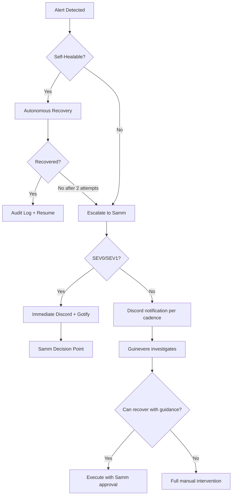
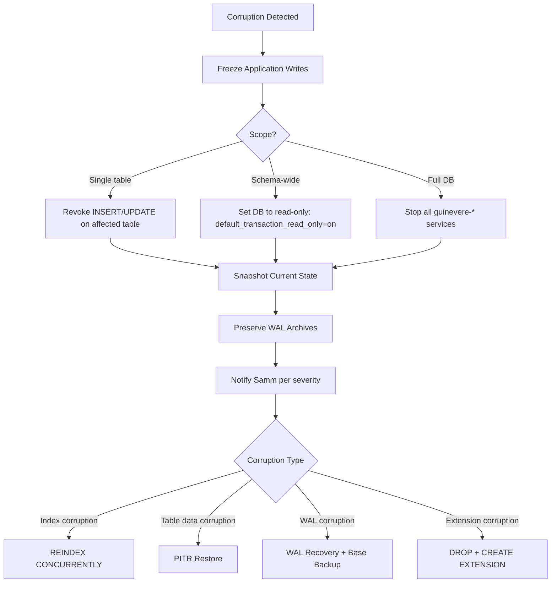
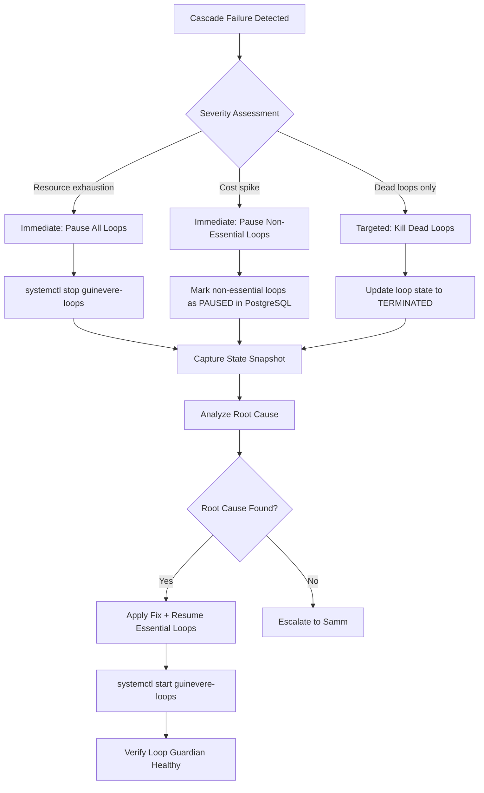
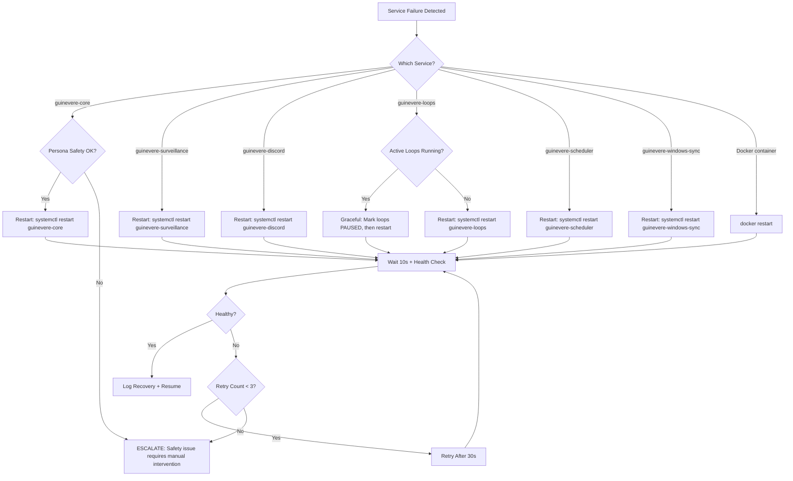

# DR Plan Recovery Procedures & Self-Healing — Research Report

**Report Date:** 2026-05-30  
**Report Type:** Recovery procedures research for Guinevere Disaster Recovery Plan  
**Status:** Complete  
**Author:** Research sub-agent (Guinevere orchestrator)  
**Classification:** STRICTLY PRIVATE & CONFIDENTIAL  

---

## Related Documents

| Document | Relationship |
|---|---|
| `Guinevere_TechnicalArchitecture_v2.0.md` | Defines runtime services, backup strategy, DR procedures, resource allocation, and network topology. |
| `Guinevere_IncidentResponse_PostmortemRunbook_v1.0.md` | Defines SEV0-SEV4 classification, 10 incident runbooks, evidence requirements, and notification matrix. |
| `Guinevere_AgentLoopSpec_v2.0.md` | Defines Loop Guardian, TODO Enforcer, 7-phase SDLC loop, sub-agent management, and loop resource constraints. |
| `Guinevere_SecretsRotationRunbook_v1.0.md` | Defines emergency rotation, zero-downtime rotation, evidence path, and no-plaintext evidence rule. |
| `Guinevere_EncryptionKeyManagementStandard_v1.0.md` | Defines key compromise response, rewrap procedures, and crypto breach protocol. |
| `Guinevere_SLO_SLA_ErrorBudgetSpec_v1.0.md` | Defines 99.5% SLO, error budgets, burn-rate alerts, and reliability freeze policies. |
| `Guinevere_Observability_AlertingSpec_v1.0.md` | Defines metrics, alert rules, dashboards, monitoring topology, and alert routing. |
| `Guinevere_AccessControl_RBAC_ABAC_Matrix_v1.0.md` | Defines break-glass procedures, backup-operator principal, and 13 principals with scoped permissions. |
| `Guinevere_Deployment_Guide_v1.0.md` | Defines systemd units, hardening directives, Docker configuration, network setup, and step-by-step deployment. |
| `adr/ADR-025-backup-disaster-recovery-strategy.md` | Defines formal backup/DR policy, RPO/RTO targets, and restore validation requirements. |
| `adr/ADR-028-llm-router-outage-graceful-degradation.md` | Defines 4-tier LLM failover: 9Router → OpenRouter → Ollama → Graceful Degradation. |

---

## Executive Summary

This report provides a comprehensive analysis of recovery procedures for every foreseeable failure scenario in the Guinevere system, autonomous self-healing patterns appropriate for a single-VPS AI agent architecture, and a structured DR testing methodology. The research synthesizes information from 11 project governance documents, external SRE best practices (Google SRE, AWS Well-Architected, Azure DR patterns), and the specific architectural constraints of Guinevere's deployment: a single 4C/16GB/120GB VPS at hostdata.id running 17+ systemd services with Docker containers.

**Key findings:**

1. Guinevere's single-VPS architecture creates a unique DR challenge: there is no hot standby, so recovery always involves either restoring on the same VPS or provisioning a new one. RTO targets must account for this constraint.
2. Self-healing is realistic for 6 well-defined failure categories (service restart, DB connection pool, Redis recovery, loop cleanup, log rotation, disk pressure) but must have hard escalation boundaries.
3. The 9 failure scenarios identified span infrastructure, data, security, network, and application layers, each requiring distinct detection, containment, and recovery procedures.
4. DR testing must be pragmatic for a single-operator system: quarterly full drills and monthly partial drills are achievable without creating excessive operational overhead.

---

## 1. Recovery Philosophy & Priority Framework

### 1.1 Core Recovery Principles

| Principle | Application to Guinevere |
|---|---|
| Safety first | Persona safety systems, safe-word enforcement, and distress handling must be restored before any other capability. No recovery step may weaken safety boundaries. |
| Data durability over availability | PostgreSQL data integrity takes precedence over uptime. A clean restore beats a corrupt live system. |
| Minimize blast radius | Every recovery action must consider downstream impact. Prefer scoped restarts over full reboots, scoped flushes over full Redis flushes. |
| Evidence preservation | All recovery actions must preserve or create evidence artifacts. Incident evidence path: `evidence/incidents/<YYYY-MM-DD>-<SEV>-<slug>/`. |
| Autonomous where safe | Guinevere may autonomously recover services within defined boundaries. Anything beyond those boundaries escalates to Samm. |
| Single-VPS awareness | All procedures must account for the fact that there is no standby node. Recovery on the same VPS or new VPS provisioning are the only options. |

### 1.2 Recovery Priority Order

When multiple systems are down simultaneously, recovery follows this strict order:

| Priority | System Category | Rationale |
|---:|---|---|
| 1 | Safety systems | Safe-word enforcement, persona safety, distress handling. If safety is compromised, nothing else matters. |
| 2 | Database (PostgreSQL) | All persistent memory, persona state, project data, audit trails. No other service functions without it. |
| 3 | Core agent (guinevere-core) | The brain. Cannot orchestrate recovery of other systems without core running. |
| 4 | Communication channels (Discord, WhatsApp) | Samm's primary interface. Without comms, Samm cannot give commands or receive status. |
| 5 | Surveillance (Android/Windows sync) | Continuous data collection. Data loss is tolerable for short periods; buffer in Redis DB2. |
| 6 | SDLC loops | Autonomous coding loops. Can be paused and resumed without data loss. |
| 7 | Observability (Prometheus/Grafana/Loki) | Monitoring gaps are tolerable for hours but not days. |
| 8 | Scheduler/proactive | Background tasks. Can be delayed without impact. |

### 1.3 RTO/RPO Targets

| Scenario | RTO | RPO | Recovery Method |
|---|---:|---:|---|
| Service crash (single) | < 30s | 0 | systemd auto-restart |
| PostgreSQL connection loss | < 1 min | 0 | Connection pool recovery |
| Redis failure | < 5 min | < 1 hr | AOF replay or RDB restore |
| Full VPS loss | < 4 hrs | < 1 hr | New VPS + snapshot + WAL replay |
| Database corruption | < 1 hr | < 1 hr | PITR or pg_dump restore |
| Secrets compromise | < 1 hr | 0 | SOPS re-encrypt + rotate |
| Network isolation | < 15 min | 0 | Tailscale re-key or direct access |
| Disk full / OOM | < 5 min | 0 | Automated cleanup + rebalance |
| LLM provider outage | < 1 min | 0 | ADR-028 4-tier failover chain |

### 1.4 Escalation Model



---

## 2. Failure Mode Catalog

### 2.1 Comprehensive Failure Matrix

| # | Failure Type | Detection Method | Severity | Auto/Manual | RTO | Affected Services |
|---|---|---|---|---|---|---|
| F01 | Full VPS loss | UptimeRobot external check, Tailscale peer offline | SEV0-SEV1 | Manual (new VPS provision) | 4 hrs | All services |
| F02 | PostgreSQL corruption | Checksum errors, query failures, WAL errors, backup mismatch | SEV0-SEV1 | Semi-auto (PITR restore) | 1 hr | All DB-dependent services |
| F03 | Redis data loss | Redis exporter metrics, connection failures, AOF errors | SEV2 | Auto (AOF replay/RDB restore) | 5 min | Queue, cache, session, buffer |
| F04 | SOPS/age key compromise | Audit log anomaly, unexpected decrypt, provider abuse alert | SEV0 | Manual (key rotation) | 1 hr | All encrypted services |
| F05 | Memory/Persona corruption | Drift scoring anomaly, consistency checks, persona validation failure | SEV1-SEV2 | Semi-auto (backup restore) | 30 min | guinevere-core |
| F06 | SDLC loop cascade failure | Loop Guardian alerts, resource exhaustion, budget spike | SEV1-SEV2 | Auto (mass termination) | 5 min | guinevere-loops |
| F07 | Network isolation (Tailscale/CF) | Tailscale peer offline, tunnel health check failure | SEV1-SEV2 | Semi-auto (re-key/re-tunnel) | 15 min | All external access |
| F08 | Disk full / OOM killer | node_exporter disk/memory alerts, systemd OOM events | SEV1-SEV2 | Auto (cleanup + rebalance) | 5 min | Varies by trigger |
| F09 | External API key expiry | Provider error responses, rate limit alerts, billing anomalies | SEV2-SEV3 | Semi-auto (key rotation) | 15 min | Varies by provider |
| F10 | Docker container failure | Docker health check, systemd unit state | SEV2 | Auto (container restart) | 1 min | Containerized services |
| F11 | systemd unit failure | systemd unit state metric, health probe failure | SEV2-SEV3 | Auto (service restart) | 30s | Affected unit |
| F12 | LLM provider outage | LLM latency/error metrics, 9Router error responses | SEV2 | Auto (ADR-028 failover) | 1 min | guinevere-core, loops |
| F13 | Cloudflare Tunnel failure | Tunnel health endpoint, webhook delivery failure | SEV3 | Semi-auto (tunnel restart) | 10 min | Discord webhook |
| F14 | Caddy reverse proxy failure | HTTP health check, Caddy logs | SEV2 | Auto (service restart) | 1 min | Internal HTTPS services |
| F15 | Backup job failure | Backup metrics, S3/R2 upload errors, cron job logs | SEV2-SEV3 | Semi-auto (retry + investigate) | Next cycle | Backup pipeline |
| F16 | TimescaleDB chunk corruption | Continuous aggregate errors, chunk query failures | SEV2 | Semi-auto (chunk rebuild) | 30 min | Surveillance data |
| F17 | PgBouncer pool exhaustion | Connection count metrics, connection timeout errors | SEV2 | Auto (pool reset) | 2 min | All DB-dependent services |
| F18 | Surveillance data buffer overflow | Redis DB2 memory usage, ingestion lag metrics | SEV3 | Auto (buffer purge + rate limit) | 5 min | Surveillance pipeline |

---

## 3. Scenario 1: Full VPS Loss

### 3.1 Detection and Alerting

| Signal | Source | Alert Rule | Severity |
|---|---|---|---|
| External uptime check failure | UptimeRobot (5-min interval) | 2 consecutive failures | SEV1 |
| Tailscale peer offline | Tailscale coordination server | Peer unreachable > 5 min | SEV1 |
| VPS provider alert | hostdata.id dashboard/email | Hardware failure, network outage | SEV0 |
| All Prometheus targets down | Grafana Cloud or external probe | No scrape targets responding | SEV0 |

**Detection time:** 5-10 minutes (UptimeRobot interval + confirmation).

### 3.2 Impact Assessment

| Impact Category | Assessment |
|---|---|
| Availability | Total outage. All 17+ services down. |
| Data loss risk | Up to 1 hour (WAL streaming RPO). Daily pg_dump as secondary. |
| Safety risk | Guinevere cannot enforce safe-word, respond to distress, or maintain persona safety. |
| Communication | Discord bot offline. Samm cannot reach Guinevere through normal channels. |
| Surveillance | Android/Windows data buffered locally on devices; will be lost if devices restart. |

### 3.3 New VPS Provisioning Runbook

**Estimated total time: 3-4 hours**

#### Phase 1: Provisioning (30 min)

| Step | Action | Command/Procedure | Est. Time |
|---:|---|---|---:|
| 1 | Confirm VPS is unrecoverable | Check provider dashboard, try Tailscale ping, try SSH | 5 min |
| 2 | Declare incident | Discord alert to Samm: `[INCIDENT SEV1] Full VPS Loss — initiating DR recovery` | 2 min |
| 3 | Provision replacement VPS | hostdata.id panel: Ubuntu 24.04, 4C/16GB/120GB, Singapore/Jakarta | 10 min |
| 4 | Initial SSH access | `ssh-copy-id -i ~/.ssh/guinevere_vps_ed25519.pub root@<NEW_VPS_IP>` | 3 min |
| 5 | Restore from snapshot | If hostdata.id snapshot available: restore latest weekly snapshot | 10 min |

#### Phase 2: Base System Recovery (45 min)

| Step | Action | Command/Procedure | Est. Time |
|---:|---|---|---:|
| 6 | System update | `apt update && apt upgrade -y` | 10 min |
| 7 | Install essential tools | Per Deployment Guide §2.1.3: curl, wget, git, jq, htop, etc. | 5 min |
| 8 | Restore users | Recreate `guinevere` and `samm` users with correct permissions per Deployment Guide §2.1.5 | 5 min |
| 9 | SSH hardening | Apply hardened sshd_config per Deployment Guide §2.1.6 | 3 min |
| 10 | OS hardening | Apply CIS hardening per Deployment Guide §2.2: tmpfs, sysctl, service minimization | 10 min |
| 11 | Firewall setup | UFW rules per Deployment Guide §2.2.4: only port 2222 for SSH | 5 min |
| 12 | Install Docker | Per Deployment Guide §2.3: Docker CE + compose plugin | 5 min |
| 13 | Install pyenv + Python 3.12 | Per Deployment Guide §2.4 | 5 min |

#### Phase 3: Tailscale Reconnection (10 min)

| Step | Action | Command/Procedure | Est. Time |
|---:|---|---|---:|
| 14 | Install Tailscale | `curl -fsSL https://tailscale.com/install.sh \| sh` | 2 min |
| 15 | Authenticate | `tailscale up --authkey=<pre-shared-key>` or interactive login | 3 min |
| 16 | Verify mesh | `tailscale ping android-hp`, `tailscale ping windows-laptop` | 2 min |
| 17 | Update Tailscale ACL | Remove old VPS node, add new VPS node with correct tags | 3 min |

#### Phase 4: Secrets Recovery (15 min)

| Step | Action | Command/Procedure | Est. Time |
|---:|---|---|---:|
| 18 | Clone config repo | `git clone git@github.com:samm/guinevere-de-baroque.git /home/guinevere/repo` | 5 min |
| 19 | Install SOPS + age | `apt install sops; age-keygen -o /home/guinevere/.age/key.txt` | 3 min |
| 20 | Restore age key | **CRITICAL:** Retrieve age private key from offline backup (Samm's secure storage). Without this, no secrets can be decrypted. | 5 min |
| 21 | Verify decryption | `sops -d /home/guinevere/repo/config/.env.sops` — must decrypt successfully | 2 min |

#### Phase 5: Database Recovery (30 min)

| Step | Action | Command/Procedure | Est. Time |
|---:|---|---|---:|
| 22 | Start PostgreSQL container | `docker compose up -d postgresql` per Deployment Guide §4 | 3 min |
| 23 | Configure PostgreSQL | Apply postgresql.conf, pg_hba.conf, per-service users per Deployment Guide §4.1 | 5 min |
| 24 | Install extensions | `CREATE EXTENSION pgvector; CREATE EXTENSION timescaledb;` | 2 min |
| 25 | Restore from pg_dump | `gunzip -c latest_backup.sql.gz \| psql -U guinevere_admin guinevere` | 15 min |
| 26 | Apply WAL replay (PITR) | If WAL archives available from R2, replay to minimize data loss | 5 min |

#### Phase 6: Application Recovery (30 min)

| Step | Action | Command/Procedure | Est. Time |
|---:|---|---|---:|
| 27 | Install Guinevere codebase | From GitHub repo: `git clone` + `uv sync --frozen` | 10 min |
| 28 | Deploy systemd units | Copy all .service files, `systemctl daemon-reload` | 5 min |
| 29 | Start Docker containers | Redis, PgBouncer, Prometheus, Grafana, Loki | 5 min |
| 30 | Start Guinevere services | In priority order: safety → core → comms → surveillance → loops → observability | 5 min |
| 31 | Health verification | Run full health check suite per Deployment Guide §8 | 5 min |

#### Phase 7: Verification (20 min)

| Step | Action | Verification | Est. Time |
|---:|---|---|---:|
| 32 | Database integrity | `pg_checksums` verification, row count comparison | 5 min |
| 33 | Persona state check | Verify persona drift log, mood state, Samm profile intact | 3 min |
| 34 | Safe-word test | Test safe-word enforcement across Discord + internal paths | 3 min |
| 35 | Communication test | Send/receive Discord message, verify WhatsApp bridge | 3 min |
| 36 | Surveillance pipeline | Verify Android/Windows data flowing to TimescaleDB | 3 min |
| 37 | Monitoring parity | Grafana dashboards showing data, alerts evaluating | 3 min |

**Total estimated recovery time: 3-3.5 hours** (within 4-hour RTO target).

### 3.4 Verification Checklist

```markdown
## Full VPS Recovery Verification Checklist

- [ ] VPS provisioned: Ubuntu 24.04, 4C/16GB/120GB
- [ ] SSH hardened: port 2222, key-only, no root login
- [ ] Tailscale connected: can ping android-hp, windows-laptop, samm-laptop
- [ ] UFW active: only port 2222 open
- [ ] Docker running: PostgreSQL, Redis, PgBouncer, Prometheus, Grafana, Loki
- [ ] PostgreSQL restored: latest backup + WAL replay applied
- [ ] PostgreSQL extensions: pgvector, TimescaleDB active
- [ ] PgBouncer connected: per-service users functional
- [ ] Redis operational: RDB snapshot restored, AOF enabled
- [ ] SOPS decryption working: all .env.sops files decrypt
- [ ] Age key restored: from offline backup
- [ ] guinevere-core running: health check passes
- [ ] Safe-word enforcement: tested and passing
- [ ] Persona state: drift log, mood, Samm profile intact
- [ ] Discord bot connected: gateway active, commands working
- [ ] WhatsApp bridge: connected and messaging
- [ ] Surveillance receiver: Android POST + Windows WebSocket functional
- [ ] SDLC loops: at least one test loop completes Phase 1
- [ ] Prometheus scraping: all targets UP
- [ ] Grafana dashboards: data flowing, no stale panels
- [ ] Loki logs: new log entries visible
- [ ] Backup pipeline: next scheduled backup queued
- [ ] Incident evidence: recovery-validation.md written
```

---

## 4. Scenario 2: PostgreSQL Corruption

### 4.1 Detection Methods

| Detection Signal | Source | Threshold | Severity |
|---|---|---|---|
| `pg_checksums` verification failure | Scheduled integrity check (daily) | Any mismatch | SEV1 |
| Application query errors (SQLSTATE XX000-XX099) | Application logs, Sentry | Any internal error | SEV1-SEV2 |
| WAL replay errors | PostgreSQL logs | Any WAL error | SEV0-SEV1 |
| Backup restore mismatch | Quarterly restore drill | Checksum/count mismatch | SEV1 |
| `pg_amcheck` corruption report | Scheduled check | Any corruption found | SEV1 |
| Unexpected table bloat or index corruption | `pg_stat_user_tables` anomalies | > 10x expected bloat | SEV2-SEV3 |
| TimescaleDB chunk query failures | Surveillance queries | Any chunk error | SEV2 |
| pgvector HNSW index corruption | Vector search errors | Search returning garbage | SEV2 |

### 4.2 Stop-the-Bleeding Protocol



**Immediate actions (first 5 minutes):**

| Step | Action | Command |
|---:|---|---|
| 1 | Stop writing services | `sudo systemctl stop guinevere-core guinevere-loops guinevere-surveillance guinevere-scheduler` |
| 2 | Preserve WAL archives | Verify WAL archiving is current: `SELECT pg_current_wal_lsn();` |
| 3 | Create forensic snapshot | `pg_basebackup -D /tmp/pg_forensic_$(date +%Y%m%d) -Ft -z` |
| 4 | Assess corruption scope | `pg_amcheck --all -v` and review application logs |
| 5 | Declare incident | Per SEV classification and notification matrix |

### 4.3 WAL-Based Point-in-Time Recovery (PITR)

**Prerequisites:** WAL archiving to Cloudflare R2 must be active (continuous archiving configured in `postgresql.conf` → `archive_mode = on`, `archive_command`).

| Step | Action | Command/Procedure | Est. Time |
|---:|---|---|---:|
| 1 | Identify recovery target | Determine last known good timestamp from logs: `journalctl -u guinevere-core --since "2 hours ago" \| grep -i error` | 5 min |
| 2 | Stop PostgreSQL | `docker stop postgresql` | 1 min |
| 3 | Backup current data dir | `cp -a /var/lib/docker/volumes/pg_data /tmp/pg_data_corrupt_$(date +%Y%m%d)` | 5 min |
| 4 | Restore base backup | Download latest base backup from R2: `aws s3 cp s3://guinevere-backups/pg/base/latest.tar.gz /tmp/` and extract | 10 min |
| 5 | Configure recovery | Create `recovery.signal` and set `restore_command` in postgresql.conf: `restore_command = 'aws s3 cp s3://guinevere-backups/pg/wal/%f %p'` | 3 min |
| 6 | Set recovery target | `recovery_target_time = '2026-05-30 14:00:00+07'` (WIB timezone) | 1 min |
| 7 | Start PostgreSQL | `docker start postgresql` — monitor recovery in logs | 5 min |
| 8 | Verify recovery | Check `pg_is_in_recovery()` returns false after recovery completes | 2 min |
| 9 | Validate data integrity | Run integrity checks: row counts, checksums, application smoke tests | 10 min |
| 10 | Re-enable services | `sudo systemctl start guinevere-core guinevere-loops guinevere-surveillance guinevere-scheduler` | 2 min |

**Total estimated PITR recovery: 30-45 minutes.**

### 4.4 pg_dump Restore Fallback

When PITR is not available (WAL archives corrupted, base backup missing):

| Step | Action | Command | Est. Time |
|---:|---|---|---:|
| 1 | Stop all services | `sudo systemctl stop guinevere-*` | 1 min |
| 2 | Drop and recreate database | `DROP DATABASE guinevere; CREATE DATABASE guinevere OWNER guinevere_admin;` | 2 min |
| 3 | Recreate extensions | `CREATE EXTENSION pgvector; CREATE EXTENSION timescaledb;` | 2 min |
| 4 | Restore from pg_dump | `gunzip -c /path/to/latest_dump.sql.gz \| psql -U guinevere_admin guinevere` | 15 min |
| 5 | Verify schema | `pg_dump --schema-only guinevere \| diff - expected_schema.sql -` | 5 min |
| 6 | Verify row counts | Compare against last known counts from backup metadata | 3 min |
| 7 | Restart services | In priority order per §1.2 | 5 min |

**Total estimated pg_dump restore: 25-35 minutes.**

### 4.5 HNSW Index Rebuild

If pgvector HNSW indexes are corrupted:

```sql
-- Check index status
SELECT indexname, indexdef FROM pg_indexes WHERE indexdef LIKE '%hnsw%';

-- Drop and recreate HNSW indexes
DROP INDEX CONCURRENTLY IF EXISTS idx_memory_embeddings_hnsw;
CREATE INDEX CONCURRENTLY idx_memory_embeddings_hnsw 
  ON memory.semantic_facts 
  USING hnsw (embedding vector_cosine_ops)
  WITH (m = 16, ef_construction = 64);

-- Verify index health
SELECT * FROM pg_stat_user_indexes WHERE indexrelname = 'idx_memory_embeddings_hnsw';
```

**Estimated time:** 10-30 minutes depending on table size.

### 4.6 TimescaleDB Chunk Verification

```sql
-- List all hypertables and their chunk counts
SELECT hypertable_name, num_chunks 
FROM timescaledb_information.hypertables;

-- Verify chunk integrity for surveillance tables
SELECT chunk_name, range_start, range_end, is_compressed
FROM timescaledb_information.chunks
WHERE hypertable_name = 'activity_log'
ORDER BY range_start DESC;

-- Check for corrupted chunks
SELECT * FROM _timescaledb_catalog.chunk 
WHERE dropped = false 
AND hypertable_id = (SELECT id FROM _timescaledb_catalog.hypertable 
                      WHERE table_name = 'activity_log');

-- Rebuild continuous aggregates if needed
CALL refresh_continuous_aggregate('activity_log_hourly', '2026-05-29', '2026-05-30');
```

### 4.7 Merkle Chain Integrity Check

Guinevere's audit trail uses a Merkle-chain pattern where each audit entry references the hash of the previous entry. Corruption detection:

```python
# Pseudocode for Merkle chain verification
def verify_audit_chain(table_name: str, start_id: int = 1):
    """Verify Merkle chain integrity in audit_trail table."""
    prev_hash = "GENESIS"
    cursor = db.execute(
        f"SELECT id, entry_hash, prev_hash, payload FROM {table_name} "
        f"WHERE id >= %s ORDER BY id", (start_id,)
    )
    breaks = []
    for row in cursor:
        expected_hash = sha256(f"{prev_hash}:{row.payload}")
        if row.prev_hash != prev_hash:
            breaks.append(f"Chain break at id={row.id}: prev_hash mismatch")
        if row.entry_hash != expected_hash:
            breaks.append(f"Hash mismatch at id={row.id}: data corruption detected")
        prev_hash = row.entry_hash
    return breaks
```

**If chain breaks detected:** The corruption point identifies the exact record where data was modified. Recovery restores from the last verified-good backup before the break point.

---

## 5. Scenario 3: Redis Data Loss

### 5.1 Detection and Impact Assessment

| Signal | Source | Threshold |
|---|---|---|
| Redis exporter `redis_up` = 0 | Prometheus | Any value = 0 |
| Connection refused on redis.internal:6379 | Health probe | Any failure |
| AOF rewrite failure | Redis logs | Any rewrite error |
| Unexpected key count drop | `redis_db_keys_total` metric | > 50% drop |
| Memory usage anomaly | `redis_memory_used_bytes` | Sudden drop to near 0 |

**Impact assessment by Redis database:**

| DB | Purpose | Impact of Loss | Recovery Priority |
|---|---|---|---|
| DB0 | Task queue (SDLC jobs) | Active loops lose job state; can be re-queued from PostgreSQL | High |
| DB1 | LLM response cache | Performance degradation; cache will rebuild organically | Low |
| DB2 | Surveillance buffer | Unprocessed surveillance data lost; device-side re-send needed | Medium |
| DB3 | Session state | Active sessions invalidated; users must re-authenticate | Medium |
| DB4 | Pub/sub channels | Active pub/sub subscriptions lost; services must resubscribe | Medium |
| DB5 | Rate limiting | Rate limits reset; temporary burst allowed until rebuilt | Low |

### 5.2 AOF Replay Recovery

If AOF (Append-Only File) is intact:

| Step | Action | Command | Est. Time |
|---:|---|---|---:|
| 1 | Stop Redis container | `docker stop redis` | 1 min |
| 2 | Check AOF file | `ls -la /var/lib/docker/volumes/redis_data/_data/appendonly.aof` | 1 min |
| 3 | Verify AOF integrity | `docker run --rm redis redis-check-aof /data/appendonly.aof` | 2 min |
| 4 | Repair if needed | `redis-check-aof --fix /data/appendonly.aof` | 2 min |
| 5 | Start Redis with AOF | `docker start redis` — Redis replays AOF on startup | 3 min |
| 6 | Verify key counts | `redis-cli -a <password> INFO keyspace` | 1 min |

### 5.3 RDB Snapshot Restore

If AOF is corrupted or unavailable:

| Step | Action | Command | Est. Time |
|---:|---|---|---:|
| 1 | Stop Redis | `docker stop redis` | 1 min |
| 2 | Download latest RDB | `aws s3 cp s3://guinevere-backups/redis/latest.rdb /var/lib/docker/volumes/redis_data/_data/dump.rdb` | 3 min |
| 3 | Set permissions | `chown redis:redis /var/lib/docker/volumes/redis_data/_data/dump.rdb` | 1 min |
| 4 | Start Redis | `docker start redis` | 1 min |
| 5 | Verify | `redis-cli -a <password> DBSIZE` and spot-check key patterns | 2 min |

### 5.4 Cache Warming Strategy

After Redis recovery, caches are cold. Warming strategy:

| Cache Type | Warming Method | Priority |
|---|---|---|
| LLM response cache (DB1) | Organic — rebuilds as queries are made | Low — acceptable cold start |
| Session state (DB3) | Re-authenticate active Discord/WhatsApp sessions | Medium — may require re-login |
| Rate limits (DB5) | Rebuild from recent request logs in Loki | Low — brief burst tolerance acceptable |
| Surveillance buffer (DB2) | Devices will re-send buffered data within 5-min window | Medium — some data loss possible |
| Task queue (DB0) | Re-queue from PostgreSQL `system.loop_state` where status = 'running' | High — active loops need state |

### 5.5 Session State Reconstruction

```sql
-- Rebuild active sessions from PostgreSQL audit trail
SELECT session_id, principal_id, started_at, last_activity
FROM system.audit_trail
WHERE action = 'session_start'
AND ended_at IS NULL
ORDER BY last_activity DESC;

-- For each active session, reconstruct Redis session entry
-- redis-cli -n 3 SET "session:{session_id}" '{"principal": "...", "started": "..."}' EX 86400
```

---

## 6. Scenario 4: SOPS/Age Key Compromise

### 6.1 Detection and Containment

| Detection Method | Signal | Response Time |
|---|---|---|
| Age key file access audit | File access log on `/home/guinevere/.age/key.txt` | Immediate |
| Unexpected decryption event | SOPS audit log shows decrypt by unauthorized principal | Immediate |
| Provider abuse alert | 9Router/Discord/GitHub report unexpected API usage | < 15 min |
| Secret scanner finding | GitGuardian/truffleHog detects secret in public repo | < 1 hr |
| Audit anomaly detection | Guinevere's own audit log shows unusual access patterns | < 1 hr |

**Immediate containment (first 10 minutes):**

| Step | Action | Rationale |
|---:|---|---|
| 1 | Declare SEV0 incident | Key compromise is always SEV0 per Incident Response Runbook §3.3 |
| 2 | Assume all encrypted secrets are exposed | Conservative posture until proven otherwise |
| 3 | Freeze autonomous operations | Pause all loops and sub-agents to prevent further secret usage |
| 4 | Notify Samm immediately | Discord + Gotify: `[INCIDENT SEV0] SOPS/Age key compromise suspected` |
| 5 | Begin evidence collection | Hash the key file, capture access logs, preserve SOPS history |

### 6.2 Key Rotation Procedure

**Phase 1: Generate New Key (5 min)**

```bash
# Generate new age key
age-keygen -o /home/guinevere/.age/key_new.txt

# Backup old key for re-encryption (destroy after rotation complete)
cp /home/guinevere/.age/key.txt /home/guinevere/.age/key_old.txt
chmod 600 /home/guinevere/.age/key_old.txt

# Update SOPS config to use new key
export SOPS_AGE_KEY_FILE=/home/guinevere/.age/key_new.txt
```

**Phase 2: Re-encrypt All Secret Files (20 min)**

```bash
# Find all .env.sops files
find /home/guinevere -name "*.env.sops" -o -name "*.sops.yaml" | while read f; do
    echo "Rotating: $f"
    # Decrypt with old key, re-encrypt with new key
    SOPS_AGE_KEY_FILE=/home/guinevere/.age/key_old.txt sops -d "$f" > /tmp/decrypted_temp
    SOPS_AGE_KEY_FILE=/home/guinevere/.age/key_new.txt sops -e /tmp/decrypted_temp > "$f"
    shred -u /tmp/decrypted_temp
done

# Verify all files decrypt with new key
find /home/guinevere -name "*.env.sops" | while read f; do
    sops -d "$f" > /dev/null && echo "OK: $f" || echo "FAIL: $f"
done
```

**Phase 3: Credential Rotation for External Services (30 min)**

| Service | Rotation Action | Verification |
|---|---|---|
| 9Router API key | Generate new key in 9Router dashboard, update .env.sops | Test LLM call with new key |
| Discord bot token | Regenerate token in Discord Developer Portal, update .env.sops | Verify bot connects to gateway |
| GitHub PAT | Generate new PAT in GitHub Settings, revoke old PAT | Verify git push/pull works |
| Gmail API credentials | Regenerate OAuth2 credentials in Google Cloud Console | Verify email send works |
| Brave Search API | Generate new API key in Brave dashboard | Verify search works |
| Cloudflare R2 | Generate new API token, update R2 credentials | Verify backup upload works |
| idcloudhost S3 | Generate new access key pair | Verify cold backup upload works |
| PostgreSQL passwords | `ALTER USER guinevere_core PASSWORD 'new_password';` (all users) | Verify PgBouncer connections |
| Redis password | Update `requirepass` in redis.conf, restart container | Verify Redis connections |

**Phase 4: Deploy New Secrets (15 min)**

```bash
# Restart all services with new secrets (in priority order)
sudo systemctl restart guinevere-core
sudo systemctl restart guinevere-discord
sudo systemctl restart guinevere-whatsapp
sudo systemctl restart guinevere-surveillance
sudo systemctl restart guinevere-scheduler
sudo systemctl restart guinevere-loops
sudo systemctl restart guinevere-windows-sync

# Restart Docker containers with new passwords
docker restart postgresql redis pgbouncer

# Verify all services healthy
for svc in guinevere-core guinevere-discord guinevere-surveillance; do
    systemctl is-active $svc && echo "OK: $svc" || echo "FAIL: $svc"
done
```

**Phase 5: Cleanup and Verification (10 min)**

```bash
# Securely destroy old key
shred -vfz -n 5 /home/guinevere/.age/key_old.txt
rm -f /home/guinevere/.age/key_old.txt

# Verify old credentials are denied
# Test old Discord token -> should fail
# Test old 9Router key -> should fail
# Test old GitHub PAT -> should fail

# Commit re-encrypted files
cd /home/guinevere/repo
git add -A '*.sops' '*.env.sops'
git commit -m "security: rotate all SOPS-encrypted secrets after key compromise"
git push origin main
```

### 6.3 Post-Incident Key Audit

| Audit Check | Method | Evidence |
|---|---|---|
| No plaintext secrets in logs | `grep -r "password\|secret\|token\|key" /home/guinevere/data/logs/` | Log scan report |
| No secrets in git history | `trufflehog filesystem /home/guinevere/repo --since-commit HEAD~1` | Scanner output |
| All .env.sops files encrypted | `sops -d` test on every encrypted file | Decryption verification log |
| Old key destroyed | `ls -la /home/guinevere/.age/` shows only key_new.txt (renamed to key.txt) | Directory listing |
| All external credentials rotated | Provider dashboard audit for each service | Provider-specific verification |
| Age key backed up offline | Verify offline backup exists in Samm's secure storage | Backup confirmation |

---

## 7. Scenario 5: Memory/Persona State Corruption

### 7.1 Detection Methods

| Detection Method | Signal | Threshold |
|---|---|---|
| Persona drift scoring | `guinevere_persona_drift_score` metric | Score > 0.3 (30% drift from baseline) |
| Consistency validation | Scheduled check: persona state vs. DB records | Mismatch between in-memory and DB state |
| Mood state anomaly | Mood history shows impossible transitions | Mood jumping between extremes without trigger |
| Samm profile corruption | Profile validation against known constraints | Missing required fields, invalid data types |
| Memory search degradation | pgvector search returning low-relevance results | Average cosine similarity < 0.3 for known queries |
| Audit trail integrity | Merkle chain verification | Any chain break |

### 7.2 Point-in-Time Restore from Backup

| Step | Action | Command/Procedure | Est. Time |
|---:|---|---|---:|
| 1 | Identify corruption window | Review persona drift log and mood history to find when anomaly started | 5 min |
| 2 | Enter safe mode | Disable persona escalation, yandere, punishment behavior | 1 min |
| 3 | Backup current state | `pg_dump -t persona.* -t memory.* -t behavior.* guinevere > /tmp/persona_backup_current.sql` | 3 min |
| 4 | Restore from known-good backup | Extract persona/memory tables from latest pg_dump: `pg_restore --table=persona.* --table=memory.* --table=behavior.*` | 10 min |
| 5 | Rebuild context injection | Clear and rebuild memory injector cache | 2 min |
| 6 | Restart core service | `sudo systemctl restart guinevere-core` | 1 min |

### 7.3 Persona Calibration Verification

| Check | Method | Pass Criteria |
|---|---|---|
| Identity validation | Query `persona.identity` table | All identity fields present and valid |
| Mood state check | Query `persona.mood_history` last 24h | Mood transitions are plausible, no impossible jumps |
| Drift log integrity | Query `persona.drift_log` | Drift log entries are sequential and timestamped |
| Samm profile validation | Query `persona.samm_profile` | All required fields present, data types valid |
| Catchphrase consistency | Test persona output against known catchphrase patterns | Signature phrases appear correctly |
| Safe-word response | Test safe-word enforcement | Hard-stop activates correctly across all paths |
| Yandere intensity | Query current yandere intensity level | Within configured bounds (0.0-1.0) |

### 7.4 Memory Integrity Validation

| Check | Method | Pass Criteria |
|---|---|---|
| Episodic memory count | `SELECT count(*) FROM memory.episodes` | Count within expected range |
| Semantic facts consistency | `SELECT count(*) FROM memory.semantic_facts` | No orphaned references |
| Procedural skills validity | `SELECT count(*) FROM memory.procedural_skills` | All skill definitions parse correctly |
| Vector embedding health | Test 10 known queries, check similarity scores | Average cosine similarity > 0.5 |
| Memory injector test | Trigger context injection, verify token count | Injection within 5-7K token range |
| Cross-reference integrity | Check foreign key constraints | No FK violations in memory schema |

---

## 8. Scenario 6: SDLC Loop Cascade Failure

### 8.1 Detection

| Signal | Source | Threshold |
|---|---|---|
| Loop Guardian heartbeat miss | `guinevere_loop_guardian_heartbeat` metric | > 2 consecutive misses (60s) |
| Active loop count spike | `guinevere_sub_agents_active` gauge | > 20 parallel loops |
| Resource exhaustion | CPU/memory metrics for guinevere-loops | > 90% of allocated 512MB |
| Cost spike | `guinevere_api_cost_total` rate | > 3x normal hourly rate |
| Dead loop detection | Loop state unchanged in PostgreSQL | No phase transition in 30 min |
| Sub-agent spawn storm | Sub-agent creation rate | > 10 spawns per minute |

### 8.2 Mass Loop Termination Procedure



**Manual mass termination:**

```bash
# Nuclear option: stop all loops immediately
sudo systemctl stop guinevere-loops

# Mark all running loops as paused in PostgreSQL
psql -U guinevere_admin guinevere -c "
  UPDATE system.loop_state 
  SET status = 'PAUSED', paused_at = NOW(), pause_reason = 'cascade_failure_manual'
  WHERE status = 'RUNNING';
"

# Clear Redis task queue (DB0)
redis-cli -n 0 FLUSHDB

# Capture state for analysis
psql -U guinevere_admin guinevere -c "
  SELECT loop_id, project, phase, status, started_at, last_heartbeat
  FROM system.loop_state
  ORDER BY started_at DESC
  LIMIT 50;
" > /tmp/loop_state_snapshot.txt
```

### 8.3 State Recovery and Resume

| Step | Action | Est. Time |
|---:|---|---:|
| 1 | Identify loops that were in safe phases (Research, Plan) | 5 min |
| 2 | Mark loops in Execute/Validate as needing re-validation | 2 min |
| 3 | Clear orphaned sub-agent sessions from Redis | 2 min |
| 4 | Restart guinevere-loops service | 1 min |
| 5 | Resume essential loops one at a time, monitoring resource usage | 10 min |
| 6 | Verify Loop Guardian heartbeat is stable | 5 min |

### 8.4 Root Cause Analysis Automation

Guinevere should automatically collect RCA data when cascade failure is detected:

```python
# Pseudocode for automated RCA data collection
def collect_cascade_failure_evidence():
    evidence = {
        "timestamp": datetime.utcnow().isoformat(),
        "active_loops": db.query("SELECT * FROM system.loop_state WHERE status = 'RUNNING'"),
        "resource_usage": prometheus.query("guinevere_node_cpu_utilization_ratio, guinevere_node_memory_utilization_ratio"),
        "api_cost_rate": prometheus.query("rate(guinevere_api_cost_total[1h])"),
        "loop_phases": db.query("SELECT phase, count(*) FROM system.loop_state GROUP BY phase"),
        "recent_errors": loki.query('{service="loops"} |= "ERROR"', last="1h"),
        "sub_agent_count": prometheus.query("guinevere_sub_agents_active"),
    }
    write_evidence(f"evidence/incidents/{date}-SEV1-loop-cascade/rca-data.md", evidence)
```

---

## 9. Scenario 7: Network Isolation (Tailscale/Cloudflare Failure)

### 9.1 Detection and Impact

| Failure | Detection | Impact |
|---|---|---|
| Tailscale daemon crash | `tailscaled` systemd unit state = failed | Loss of all internal communication; Samm cannot SSH; devices cannot reach VPS |
| Tailscale coordination server down | `tailscale status` shows stale peers | Same as above but temporary; auto-recovers when coordination returns |
| Tailscale key expiry | `tailscale status` shows "key expired" | Gradual loss of connectivity as keys expire per device |
| Cloudflare Tunnel failure | `cloudflared` logs, tunnel health endpoint | Discord webhook delivery fails; external access lost |
| DNS resolution failure | MagicDNS not resolving `.internal` domains | Services cannot reach each other by hostname |

### 9.2 Direct Access Recovery

If Tailscale is completely unavailable and SSH access is needed:

| Step | Action | Command |
|---:|---|---|
| 1 | Access via provider console | Use hostdata.id VNC/console access in web panel |
| 2 | Enable temporary SSH | `systemctl start sshd` with a temporary port (e.g., 22) |
| 3 | Set temporary password | `passwd samm` (for emergency password auth) |
| 4 | SSH in directly | `ssh -p 22 samm@<VPS_PUBLIC_IP>` |
| 5 | Diagnose Tailscale | `journalctl -u tailscaled --since "1 hour ago"` |
| 6 | Fix and re-harden | Restore Tailscale, re-disable direct SSH |

**IMPORTANT:** Direct SSH access is an emergency-only measure. Re-disable immediately after Tailscale is restored.

### 9.3 Tailscale Re-keying

```bash
# Check Tailscale status
tailscale status

# If key expired, re-authenticate
tailscale up --authkey=<new-auth-key-from-admin-panel>

# If coordination server issue, force reconnect
tailscale down && tailscale up

# If ACL issue, verify device tags
tailscale whois --self

# Verify all peers
tailscale ping android-hp
tailscale ping windows-laptop
tailscale ping samm-laptop

# If device needs replacement in Tailscale admin
# 1. Remove old device from admin panel
# 2. Re-authenticate: tailscale up --authkey=<key>
# 3. Verify tags: tag:server, tag:production
```

### 9.4 Cloudflare Tunnel Re-establishment

```bash
# Check tunnel status
systemctl status cloudflared
journalctl -u cloudflared --since "1 hour ago"

# Restart tunnel
sudo systemctl restart cloudflared

# If tunnel credentials expired, re-create
cloudflared tunnel login
cloudflared tunnel create guinevere-webhook
cloudflared tunnel route dns guinevere-webhook webhook.domain.com

# Verify tunnel is active
cloudflared tunnel info guinevere-webhook
curl -s https://webhook.domain.com/health
```

---

## 10. Scenario 8: Disk Full / OOM Killer

### 10.1 Automatic Cleanup Procedures

**Disk pressure thresholds:**

| Threshold | Action |
|---|---|
| 80% disk usage | Warning alert, begin proactive cleanup |
| 90% disk usage | SEV2 alert, aggressive cleanup |
| 95% disk usage | SEV1 alert, emergency cleanup + service pause |

**Automatic cleanup script (triggered by Prometheus alert):**

```bash
#!/bin/bash
# /home/guinevere/scripts/emergency_disk_cleanup.sh
# Triggered when disk usage > 90%

DISK_USAGE=$(df / | tail -1 | awk '{print $5}' | sed 's/%//')
LOG_FILE="/home/guinevere/data/logs/disk_cleanup_$(date +%Y%m%d_%H%M%S).log"

echo "Disk cleanup triggered at $(date). Usage: ${DISK_USAGE}%" | tee "$LOG_FILE"

# Step 1: Clean journal logs older than 3 days
journalctl --vacuum-time=3d 2>&1 | tee -a "$LOG_FILE"

# Step 2: Clean Docker unused resources
docker system prune -f --volumes 2>&1 | tee -a "$LOG_FILE"

# Step 3: Clean old Prometheus data (> 7 days)
# Prometheus retention is configured in prometheus.yml

# Step 4: Clean old Loki chunks (> 7 days)
# Loki retention is configured in loki-config.yaml

# Step 5: Compress old application logs
find /home/guinevere/data/logs -name "*.log" -mtime +1 -exec gzip {} \; 2>&1 | tee -a "$LOG_FILE"

# Step 6: Clean temp files
rm -rf /tmp/guinevere_* /tmp/pg_* 2>/dev/null

# Step 7: Clean pip/uv cache
uv cache clean 2>&1 | tee -a "$LOG_FILE"

NEW_USAGE=$(df / | tail -1 | awk '{print $5}' | sed 's/%//')
echo "Disk cleanup completed. New usage: ${NEW_USAGE}%" | tee -a "$LOG_FILE"
```

### 10.2 Log Rotation Emergency

```bash
# Force log rotation for all services
logrotate -f /etc/logrotate.d/guinevere-*

# Emergency: truncate largest log files
find /home/guinevere/data/logs -size +100M -exec truncate -s 10M {} \;

# Verify journald size
journalctl --disk-usage
journalctl --vacuum-size=500M
```

### 10.3 Temporary Data Purge

| Data Type | Safe to Purge | Command |
|---|---|---|
| Surveillance screenshots (local cache) | Yes — already uploaded to R2 | `rm -rf /home/guinevere/data/cache/screenshots/*` |
| LLM response cache (Redis DB1) | Yes — rebuilds organically | `redis-cli -n 1 FLUSHDB` |
| Old evidence temp files | Check first — may be needed for audit | Manual review |
| Docker build cache | Yes — rebuilds on next build | `docker builder prune -f` |
| Old VPS snapshots | Keep last 2 only | Via hostdata.id panel |
| TimescaleDB compressed chunks > 90 days | Yes — should be in cold storage (R2) | `SELECT drop_chunks('activity_log', older_than => INTERVAL '90 days');` |

### 10.4 Resource Rebalancing

If disk pressure is chronic, rebalance resource allocation:

| Action | Impact | Procedure |
|---|---|---|
| Reduce Prometheus retention | Less historical metrics | Edit `prometheus.yml`: `retention: 7d` (from 15d) |
| Reduce Loki retention | Less historical logs | Edit `loki-config.yaml`: `retention_period: 7d` |
| Accelerate TimescaleDB compression | Less hot storage | Compress chunks > 3 days instead of 7 |
| Accelerate cold storage migration | Move data to R2 sooner | Migrate surveillance data > 30 days to R2 |
| Reduce backup retention | Fewer old backups | Keep daily for 30 days, weekly for 12 weeks, monthly forever |

---

## 11. Scenario 9: External API Key Expiry/Revocation

### 9.1 Detection per Provider

| Provider | Detection Method | Error Signal | Graceful Degradation |
|---|---|---|---|
| **9Router** (LLM) | HTTP 401/403, connection timeout | `llm_error_total{provider="9router"}` rate spike | ADR-028 Tier 2: OpenRouter → Tier 3: Ollama → Tier 4: Graceful Degradation |
| **Discord** | Gateway disconnect, HTTP 401 | `discord_gateway_state` = disconnected | Queue messages, retry with backoff |
| **GitHub** | HTTP 401/403 on API calls | `github_api_error_total` rate spike | Queue operations, retry later |
| **Gmail** | OAuth2 token refresh failure | Email send failures | Queue emails, retry on token refresh |
| **Brave Search** | HTTP 401/429 | Search failures in research phase | Skip search, note degraded research quality |
| **Cloudflare R2** | HTTP 403, upload failures | Backup upload failures | Fall back to idcloudhost S3 |
| **idcloudhost S3** | HTTP 403, upload failures | Cold backup upload failures | Fall back to R2 |

### 9.2 Key Rotation Procedures

**9Router API Key:**
```bash
# 1. Generate new key in 9Router dashboard
# 2. Update encrypted config
sops -d /home/guinevere/config/.env.sops > /tmp/.env
# Edit NINEROUTER_API_KEY value
sops -e /tmp/.env > /home/guinevere/config/.env.sops
rm /tmp/.env
# 3. Restart core
sudo systemctl restart guinevere-core
# 4. Verify
curl -H "Authorization: Bearer $(sops -d /home/guinevere/config/.env.sops | grep NINEROUTER_API_KEY | cut -d= -f2)" \
  https://api.9router.com/v1/models
```

**Discord Bot Token:**
```bash
# 1. Go to Discord Developer Portal > Bot > Reset Token
# 2. Copy new token
# 3. Update encrypted config (same SOPS pattern)
# 4. Restart Discord service
sudo systemctl restart guinevere-discord
# 5. Verify bot appears online in Discord
```

**GitHub PAT:**
```bash
# 1. GitHub Settings > Developer Settings > Personal Access Tokens > Regenerate
# 2. Update encrypted config
# 3. Test: git ls-remote https://<new-token>@github.com/samm/guinevere-de-baroque.git
# 4. Restart services that use GitHub API
sudo systemctl restart guinevere-scheduler  # self-deploy cron
```

### 9.3 Graceful Degradation Verification

After any API key rotation, verify degraded services recover:

| Provider | Verification Command | Expected Result |
|---|---|---|
| 9Router | Send test prompt via guinevere-core | Response received within 30s |
| Discord | Send test message to #guinevere-command | Message delivered and acknowledged |
| GitHub | `git fetch origin main` | Successful fetch without auth errors |
| Gmail | Send test email to Samm | Email delivered |
| Brave Search | Trigger test search query | Results returned |
| Cloudflare R2 | Upload test object | Object appears in bucket |
| idcloudhost S3 | Upload test object | Object appears in bucket |

---

## 12. Self-Healing Architecture

### 12.1 Guinevere Autonomous Recovery Capabilities

Guinevere can autonomously recover from well-defined failure types without human intervention. The self-healing system follows a Health Check → Diagnosis → Action → Verify loop.

**Autonomous recovery capabilities:**

| Failure Type | Autonomous Action | Max Attempts | Escalation Trigger |
|---|---|---:|---|
| Service crash (single unit) | systemd restart (Restart=always, 10s delay) | Unlimited (systemd) | Service fails 3x in 5 min |
| DB connection pool exhaustion | Reset PgBouncer pools, restart service | 2 | Second reset fails |
| Redis connection failure | Restart Redis container, reconnect services | 2 | Second restart fails |
| Loop heartbeat miss | Kill and respawn dead loop | 2 | Loop respawns and dies again |
| Disk pressure > 80% | Run cleanup script | 1 | Cleanup doesn't reduce below 80% |
| Log size > threshold | Rotate and compress logs | Unlimited | N/A (always safe) |
| LLM provider timeout | ADR-028 failover chain | Automatic | All 4 tiers exhausted |
| Docker container unhealthy | Restart container | 3 | Third restart fails |

### 12.2 Health Check → Diagnosis → Action → Verify Loop

```mermaid
flowchart TD
    subgraph HealthCheck[`Health Check Layer (30s interval)`]
        HC1[systemd unit state]
        HC2[PostgreSQL connection probe]
        HC3[Redis PING]
        HC4[FastAPI /health endpoints]
        HC5[Loop Guardian heartbeat]
        HC6[Disk/Memory/CPU metrics]
    end
    
    subgraph Diagnosis[`Diagnosis Engine`]
        D1{Failure Type?}
        D2{Scope?}
        D3{Self-Healable?}
    end
    
    subgraph Action[`Recovery Actions`]
        A1[Service Restart]
        A2[Connection Pool Reset]
        A3[Container Restart]
        A4[Loop Kill + Respawn]
        A5[Disk Cleanup]
        A6[Log Rotation]
    end
    
    subgraph Verify[`Verification`]
        V1{Health Check Passes?}
        V2{Stable for 2 min?}
    end
    
    HC1 --> D1
    HC2 --> D1
    HC3 --> D1
    HC4 --> D1
    HC5 --> D1
    HC6 --> D1
    
    D1 --> D2
    D2 --> D3
    D3 -->|Yes| A1
    D3 -->|Yes| A2
    D3 -->|Yes| A3
    D3 -->|Yes| A4
    D3 -->|Yes| A5
    D3 -->|Yes| A6
    D3 -->|No| ESC[Escalate to Samm]
    
    A1 --> V1
    A2 --> V1
    A3 --> V1
    A4 --> V1
    A5 --> V1
    A6 --> V1
    
    V1 -->|Yes| V2
    V1 -->|No| RETRY{Attempts < Max?}
    RETRY -->|Yes| D1
    RETRY -->|No| ESC
    
    V2 -->|Yes| DONE[Recovery Complete + Audit Log]
    V2 -->|No| D1
```

### 12.3 Autonomous Service Restart Decision Tree



### 12.4 Autonomous DB Connection Pool Recovery

```python
# Pseudocode for autonomous DB connection pool recovery
class DBConnectionRecovery:
    MAX_RETRIES = 2
    RETRY_DELAY = 10  # seconds
    
    def check_health(self) -> bool:
        try:
            conn = psycopg2.connect("host=postgres.internal port=6432 dbname=guinevere")
            cur = conn.cursor()
            cur.execute("SELECT 1")
            cur.close()
            conn.close()
            return True
        except Exception:
            return False
    
    def recover(self):
        for attempt in range(self.MAX_RETRIES):
            log.warning(f"DB connection failed, attempt {attempt + 1}/{self.MAX_RETRIES}")
            
            # Step 1: Try PgBouncer pool reset
            try:
                admin_conn = psycopg2.connect("host=postgres.internal port=6432 dbname=pgbouncer")
                admin_cur = admin_conn.cursor()
                admin_cur.execute("RECONNECT guinevere")
                admin_cur.close()
                admin_conn.close()
            except Exception:
                pass  # PgBouncer admin might be down too
            
            # Step 2: Wait and retry
            time.sleep(self.RETRY_DELAY)
            
            if self.check_health():
                log.info("DB connection recovered via pool reset")
                return True
            
            # Step 3: Restart PgBouncer
            subprocess.run(["sudo", "systemctl", "restart", "pgbouncer"])
            time.sleep(self.RETRY_DELAY)
            
            if self.check_health():
                log.info("DB connection recovered via PgBouncer restart")
                return True
        
        # Escalate
        self.escalate_to_samm("DB connection recovery failed after all attempts")
        return False
```

### 12.5 Autonomous Redis Recovery

```python
# Pseudocode for autonomous Redis recovery
class RedisRecovery:
    MAX_RETRIES = 2
    
    def check_health(self) -> bool:
        try:
            r = redis.Redis(host="redis.internal", port=6379, password=get_redis_password())
            return r.ping()
        except Exception:
            return False
    
    def recover(self):
        for attempt in range(self.MAX_RETRIES):
            log.warning(f"Redis connection failed, attempt {attempt + 1}/{self.MAX_RETRIES}")
            
            # Step 1: Try reconnect
            time.sleep(5)
            if self.check_health():
                return True
            
            # Step 2: Restart Redis container
            subprocess.run(["sudo", "docker", "restart", "redis"])
            time.sleep(10)
            
            if self.check_health():
                log.info("Redis recovered via container restart")
                return True
        
        # Step 3: Check if Redis data is corrupted
        # If AOF exists, attempt AOF replay
        # If no AOF, attempt RDB restore
        self.escalate_to_samm("Redis recovery failed — manual data restore may be needed")
        return False
```

### 12.6 Autonomous Loop Cleanup and Respawn

| Condition | Detection | Autonomous Action |
|---|---|---|
| Dead loop (no heartbeat > 5 min) | Loop Guardian check | Kill loop process, mark TERMINATED in DB, respawn if loop was in safe phase |
| Runaway loop (resource > 2x allocation) | Memory/CPU monitoring | Kill loop, mark TERMINATED, do NOT respawn (investigate first) |
| Stuck loop (same phase > 30 min) | Phase transition monitoring | Send interrupt signal, if no response in 60s: kill and mark STUCK |
| Orphaned sub-agents | Sub-agent count vs. active loop count | Kill sub-agents with no parent loop |

**Loop respawn safety rules:**

1. Only respawn loops that were in Phase 1 (Research) or Phase 2 (Plan) — these phases are idempotent.
2. Never respawn loops in Phase 4 (Execute) — execution state may be partially committed.
3. Loops in Phase 5 (Validate) or Phase 7 (Evidence) should be marked for manual review.
4. Maximum respawn attempts per loop: 2. After that, escalate.

### 12.7 Limits of Self-Healing

**Guinevere MUST NOT autonomously:**

| Action | Reason | Escalation Required |
|---|---|---|
| Restore database from backup | Data loss risk requires Samm approval | SEV1+ notification |
| Rotate encryption keys | Key management requires offline backup access | Samm provides offline key |
| Provision new VPS | Infrastructure provisioning requires Samm credentials | Samm provisions VPS |
| Delete data for disk space | Data deletion requires governance review | Samm approves deletion scope |
| Modify firewall rules | Security boundary changes require approval | Samm approves rule changes |
| Access external provider dashboards | API credential management is Samm's domain | Samm rotates credentials |
| Modify systemd hardening directives | Security configuration is governance-controlled | Samm or break-glass operator |
| Resume loops after cascade failure | Root cause must be understood first | Guinevere investigates, Samm approves resume |
| Disable safety systems for recovery | Safety is non-negotiable invariant | Never — escalate immediately |

### 12.8 Self-Healing Audit Logging

Every autonomous recovery action must be logged:

```json
{
  "timestamp": "2026-05-30T14:30:00+07:00",
  "event_type": "self_healing",
  "failure_detected": "guinevere-core.service exited with status 1",
  "diagnosis": "OOM kill detected in systemd journal",
  "action_taken": "systemctl restart guinevere-core",
  "attempt_number": 1,
  "max_attempts": 3,
  "result": "success",
  "recovery_time_seconds": 12,
  "verification": "health check passed after 10s",
  "evidence_path": "evidence/self-healing/2026-05-30T14:30:00-core-oom-restart.md"
}
```

**Audit metrics:**

| Metric | Type | Purpose |
|---|---|---|
| `guinevere_self_healing_attempts_total` | Counter | Total autonomous recovery attempts |
| `guinevere_self_healing_success_total` | Counter | Successful recoveries |
| `guinevere_self_healing_escalations_total` | Counter | Escalations to Samm |
| `guinevere_self_healing_recovery_time_seconds` | Histogram | Time to recover |
| `guinevere_self_healing_failures_total` | Counter | Failed recovery attempts (preceded escalation) |

---

## 13. DR Testing Methodology

### 13.1 Quarterly Full Drill Procedure

**Objective:** Simulate complete VPS loss and full stack restoration from backups.

**Prerequisites:**
- Backup verification: confirm latest pg_dump, WAL archive, Redis RDB, and config repo are current.
- Communication plan: notify Samm 48 hours before drill.
- Rollback plan: document how to abort the drill and restore production state.
- Evidence path: `evidence/drills/<YYYY-MM-DD>-quarterly-full/`

**Drill execution (estimated 4-5 hours):**

| Phase | Activities | Est. Time | Evidence |
|---|---|---|---|
| Preparation | Verify backups, notify Samm, prepare rollback plan | 30 min | `drill-plan.md` |
| Scenario execution | Follow Scenario 1 (Full VPS Loss) runbook step-by-step | 3-4 hrs | Timestamped step log |
| Verification | Run full verification checklist (§3.4) | 30 min | `verification-checklist.md` |
| Scoring | Complete drill scorecard | 15 min | `drill-scorecard.md` |
| Postmortem | Document findings, gaps, improvements | 30 min | `drill-postmortem.md` |

### 13.2 Monthly Partial Drill Procedure

**Objective:** Test one specific recovery scenario without full stack disruption.

**Rotation schedule:**

| Month | Drill Focus | Scenario Reference |
|---|---|---|
| January | PostgreSQL PITR restore | Scenario 2 |
| February | Redis recovery + cache warming | Scenario 3 |
| March | Key rotation drill | Scenario 4 |
| April | Persona state restore | Scenario 5 |
| May | Loop cascade termination | Scenario 6 |
| June | Network isolation recovery | Scenario 7 |
| July | Disk full emergency cleanup | Scenario 8 |
| August | API key rotation | Scenario 9 |
| September | PostgreSQL PITR restore | Scenario 2 |
| October | Safe-word failure simulation | Incident Response §7.4 |
| November | Backup failure + retry | Incident Response §7.9 |
| December | Year-end full drill | Scenario 1 |

**Partial drill execution (estimated 1-2 hours):**

| Phase | Activities | Est. Time |
|---|---|---|
| Scope definition | Select scenario, define pass/fail criteria | 15 min |
| Isolated execution | Perform recovery on isolated/staging resources where possible | 30-60 min |
| Verification | Run scenario-specific verification checks | 15 min |
| Scoring | Complete drill scorecard | 10 min |
| Findings | Document gaps and improvements | 15 min |

### 13.3 Game Day Planning

**Game Day** is an unannounced drill where Guinevere must detect and respond to a simulated failure without prior preparation.

**Game Day rules:**
- Conducted quarterly, alternating with full drills.
- Samm triggers a simulated failure (e.g., stop a service, corrupt a test table, inject a fake alert).
- Guinevere must detect, triage, contain, and recover using standard procedures.
- Timer starts at failure injection, ends at verified recovery.
- No hints or guidance from Samm during the drill.

**Game Day scenarios (rotate):**

| Quarter | Scenario | Injection Method |
|---|---|---|
| Q1 | Service crash | `systemctl stop guinevere-core` |
| Q2 | Simulated DB corruption | Create test table, insert corrupt data |
| Q3 | Network isolation | `tailscale down` (brief, < 5 min) |
| Q4 | Simulated key compromise alert | Inject fake audit anomaly |

### 13.4 Drill Scoring and Improvement Tracking

#### DR Drill Scorecard Template

```markdown
# DR Drill Scorecard

## Drill Information
| Field | Value |
|---|---|
| Drill ID | DRILL-YYYY-NNN |
| Date | YYYY-MM-DD |
| Type | Full / Partial / Game Day |
| Scenario | <scenario name and reference> |
| Drill Lead | Guinevere / Samm |
| Duration | HH:MM |
| Evidence Path | evidence/drills/<YYYY-MM-DD>-<slug>/ |

## Scoring Criteria

| # | Criterion | Weight | Score (0-10) | Weighted | Notes |
|---:|---|---:|---:|---:|---|
| 1 | Detection time within SLA | 15% | | | |
| 2 | Triage and severity classification correct | 10% | | | |
| 3 | Containment actions effective | 15% | | | |
| 4 | Recovery completed within RTO | 20% | | | |
| 5 | Data loss within RPO | 15% | | | |
| 6 | Verification checklist complete | 10% | | | |
| 7 | Evidence artifacts created | 5% | | | |
| 8 | Communication cadence followed | 5% | | | |
| 9 | Postmortem quality | 5% | | | |
| | **TOTAL** | **100%** | | **/10** | |

## Pass/Fail Criteria
- **PASS:** Total weighted score >= 7.0 AND criteria #4 (RTO) and #5 (RPO) each >= 6
- **CONDITIONAL PASS:** Total >= 5.0 with specific remediation plan
- **FAIL:** Total < 5.0 OR RTO/RPO criteria < 4

## Result: PASS / CONDITIONAL PASS / FAIL

## Findings

| # | Finding | Severity | Category | Action Item | Owner | Due Date |
|---:|---|---|---|---|---|---|
| 1 | | Critical/High/Medium/Low | Process/Technical/Documentation | | | |

## Improvement Tracking

| Drill ID | Date | Score | Key Finding | Action Taken | Resolved? |
|---|---|---|---|---|---|
| | | | | | |

## Trend Analysis
| Quarter | Score | RTO Met? | RPO Met? | Key Improvement |
|---|---|---|---|---|
| Q1 YYYY | | | | |
| Q2 YYYY | | | | |
| Q3 YYYY | | | | |
| Q4 YYYY | | | | |
```

---

## 14. Communication Plan During DR

### 14.1 Channel Priority

| Priority | Channel | When Available | Message Type |
|---:|---|---|---|
| 1 | Discord bot | Guinevere-core + Discord gateway running | Real-time incident updates, commands, status |
| 2 | Gotify push | Gotify server reachable | Urgent SEV0/SEV1 alerts when Discord unavailable |
| 3 | Email | Gmail API functional | Formal summaries, closure reports, postmortems |
| 4 | SMS (UptimeRobot) | External monitoring active | Last resort for total communication failure |

### 14.2 Status Update Cadence

| Severity | Initial Alert | Update Frequency | Closure Notification |
|---|---|---|---|
| SEV0 | Immediate (Discord + Gotify) | Every 15 min or milestone | Immediate upon resolution |
| SEV1 | Within 15 min (Discord + Gotify) | Every 30 min or milestone | Within 1 hour of resolution |
| SEV2 | Within 1 hour (Discord) | Every 2 hours or milestone | Same-day summary |
| SEV3 | Within 24 hours (Discord summary) | As needed | Closure summary |
| SEV4 | Next governance cycle | N/A | Review summary |

### 14.3 Communication During Full VPS Loss

When Guinevere herself is down (Scenario 1), the communication plan changes fundamentally:

| Phase | Who Communicates | How |
|---|---|---|
| Detection | UptimeRobot | SMS/email alert to Samm |
| Triage | Samm | Manual assessment via provider dashboard |
| Recovery | Samm | Provisions new VPS, restores from backups |
| Status updates | Samm | Manual Discord status (if possible from phone) |
| Verification | Guinevere (after restore) | Automated health checks + Discord notification |

### 14.4 Recovery Confirmation Protocol

Recovery is confirmed only when:

1. All health checks pass (systemd units active, DB connected, Redis responding, endpoints healthy).
2. Safe-word enforcement verified across all paths.
3. At least one Discord command processed successfully.
4. Surveillance pipeline receiving data from at least one device.
5. Monitoring dashboards showing current data (no stale panels).
6. Backup pipeline confirmed operational (next backup scheduled).
7. Recovery validation evidence written to incident evidence path.
8. Samm acknowledges recovery (for SEV0/SEV1) or Guinevere self-confirms (for SEV2+).

**Recovery confirmation message:**

```text
[INCIDENT RESOLVED {SEV}] {title}
Duration: {detection_to_resolution}
Recovery method: {summary}
Data loss: {within RPO / estimated X minutes}
Verification: {checklist items passed}
Postmortem: {scheduled / path}
Open actions: {count}
Residual risk: {description or "none"}
```

---

## 15. Unresolved Assumptions and Gaps

| # | Gap / Assumption | Impact | Follow-Up |
|---:|---|---|---|
| 1 | Hostdata.id VPS provisioning API is not documented; manual provisioning assumed | Full VPS recovery time depends on provider UI speed | Confirm if hostdata.id has API for automated provisioning |
| 2 | Offline age key backup location is not formally documented | Key compromise recovery blocked without Samm's secure storage | Document offline backup location and access procedure |
| 3 | WAL archiving to R2 is designed but not yet implemented | PITR recovery not available until WAL streaming is live | Implement WAL archiving per Deployment Guide §7 |
| 4 | TimescaleDB cold storage migration to R2 is designed but not implemented | Disk pressure recovery limited until cold storage works | Implement cold storage migration per Technical Architecture §5.2 |
| 5 | UptimeRobot external monitoring configuration is not yet live | VPS loss detection relies on Tailscale peer offline (delayed) | Configure UptimeRobot per Deployment Guide §8 |
| 6 | Self-healing audit logging format is proposed but not implemented | Cannot track self-healing effectiveness | Implement audit logging in guinevere-core health module |
| 7 | Game Day drills require Samm to manually inject failures | Game Day cannot be fully autonomous | Design failure injection tool or Samm playbook |
| 8 | pgvector IVFFlat index mentioned in TechArch; HNSW mentioned in ADR | Recovery procedure uses HNSW; may need reconciliation | Reconcile index type in Memory Schema spec |
| 9 | Break-glass procedure for SEV0/SEV1 during full VPS loss is unclear | Samm may need emergency access without Tailscale | Document break-glass path via provider console |

---

## Appendix A — Command Quick Reference

### Emergency Commands (Copy-Paste Ready)

```bash
# === NUCLEAR: Stop Everything ===
sudo systemctl stop guinevere-core guinevere-loops guinevere-surveillance \
  guinevere-scheduler guinevere-discord guinevere-whatsapp guinevere-windows-sync

# === Database Emergency ===
sudo docker stop postgresql
sudo docker start postgresql
psql -U guinevere_admin guinevere -c "SELECT pg_is_in_recovery();"

# === Redis Emergency ===
sudo docker stop redis
sudo docker start redis
redis-cli -a $(sops -d /home/guinevere/config/.env.sops | grep REDIS_PASSWORD | cut -d= -f2) PING

# === Mass Loop Kill ===
sudo systemctl stop guinevere-loops
redis-cli -n 0 FLUSHDB
psql -U guinevere_admin guinevere -c "UPDATE system.loop_state SET status='TERMINATED' WHERE status='RUNNING';"

# === Disk Emergency ===
journalctl --vacuum-time=1d
docker system prune -af --volumes
find /home/guinevere/data/logs -name "*.log" -mtime +1 -exec gzip {} \;

# === Network Recovery ===
sudo systemctl restart tailscaled
tailscale status
sudo systemctl restart cloudflared

# === Health Check All ===
for svc in guinevere-core guinevere-surveillance guinevere-scheduler guinevere-loops \
  guinevere-discord guinevere-windows-sync; do
  echo "$svc: $(systemctl is-active $svc)"
done
for ctr in postgresql redis pgbouncer prometheus grafana loki; do
  echo "$ctr: $(docker inspect --format='{{.State.Status}}' $ctr 2>/dev/null || echo 'not found')"
done
```

---

## Appendix B — Recovery Time Estimates Summary

| Scenario | Detection | Containment | Recovery | Verification | Total |
|---|---:|---:|---:|---:|---:|
| 1. Full VPS Loss | 10 min | 5 min | 3 hrs | 20 min | **~3.5 hrs** |
| 2. PostgreSQL Corruption | 5 min | 5 min | 45 min | 15 min | **~1.2 hrs** |
| 3. Redis Data Loss | 1 min | 1 min | 8 min | 5 min | **~15 min** |
| 4. SOPS/Age Key Compromise | 15 min | 10 min | 45 min | 15 min | **~1.4 hrs** |
| 5. Memory/Persona Corruption | 5 min | 2 min | 20 min | 10 min | **~37 min** |
| 6. SDLC Loop Cascade | 2 min | 2 min | 15 min | 10 min | **~29 min** |
| 7. Network Isolation | 5 min | 2 min | 10 min | 5 min | **~22 min** |
| 8. Disk Full / OOM | 1 min | 1 min | 5 min | 3 min | **~10 min** |
| 9. API Key Expiry | 5 min | 2 min | 15 min | 5 min | **~27 min** |

---

## Appendix C — External References

| Source | Relevance | URL |
|---|---|---|
| Google SRE Book — Disaster Recovery | DR planning methodology, drill scoring | https://sre.google/sre-book/accelerating-sre-on-call/ |
| AWS Well-Architected — Reliability Pillar | Recovery procedures, RTO/RPO patterns | https://docs.aws.amazon.com/wellarchitected/latest/reliability-pillar/ |
| PostgreSQL PITR Documentation | WAL archiving and point-in-time recovery | https://www.postgresql.org/docs/16/continuous-archiving.html |
| Redis Persistence Documentation | AOF and RDB recovery procedures | https://redis.io/docs/management/persistence/ |
| Tailscale Key Management | Key expiry, re-authentication, ACL | https://tailscale.com/kb/1028/key-expiry |
| Mozilla SOPS Documentation | Key rotation and re-encryption | https://github.com/getsops/sops |
| TimescaleDB Backup/Restore | Hypertable backup and chunk management | https://docs.timescale.com/use-timescale/latest/backup-restore/ |
| Kubernetes Chaos Engineering | Game day and drill methodology (adapted) | https://principlesofchaos.org/ |
| NIST SP 800-61 Rev 2 | Computer Security Incident Handling Guide | https://csrc.nist.gov/publications/detail/sp/800-61/rev-2/final |
| Cloudflare Tunnel Documentation | Tunnel re-establishment procedures | https://developers.cloudflare.com/cloudflare-one/connections/connect-networks/ |

---

**End of DR Plan Recovery Procedures & Self-Healing Research Report**

| Version | Date | Author | Changes |
|---|---|---|---|
| 1.0 | 2026-05-30 | Research sub-agent / Guinevere | Initial comprehensive research covering 9 failure scenarios, self-healing architecture, DR testing methodology, and communication plan. |
