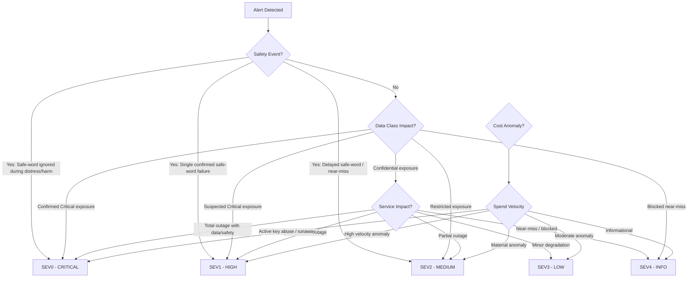
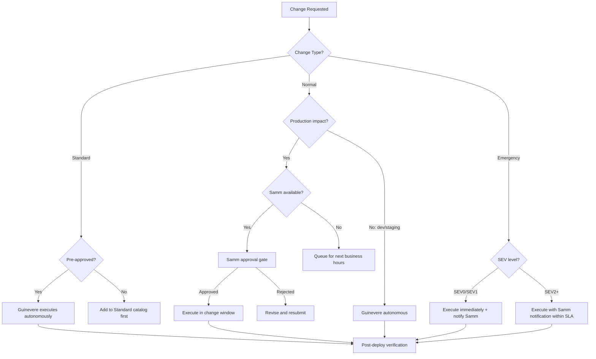
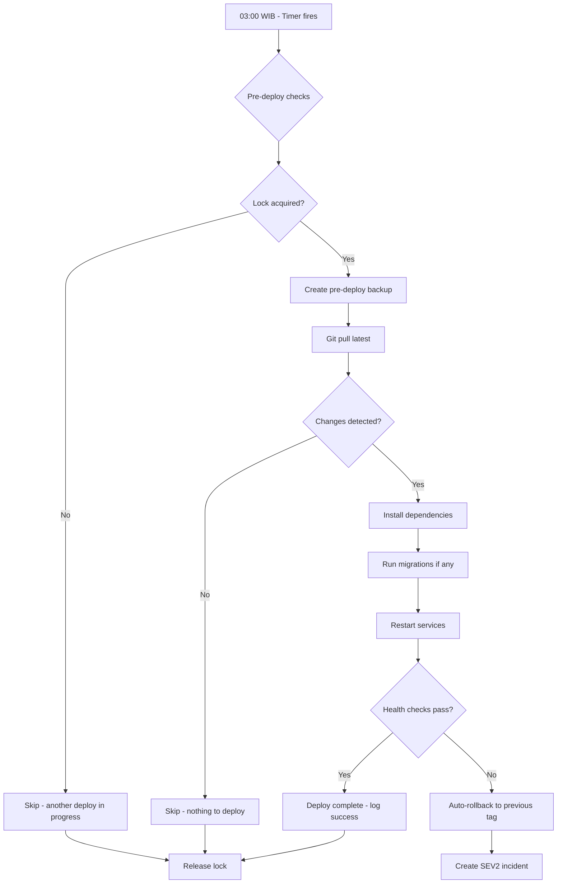

# Guinevere Internal Ops Manual — Incident Operations & Change Management Research Report

**Document Type:** Research Report for Internal Ops Manual  
**Date:** 2026-05-30  
**Author:** Guinevere (research agent)  
**Target Document:** `Guinevere_InternalOpsManual_v1.0.md` (future)  
**Classification:** STRICTLY PRIVATE & CONFIDENTIAL  
**Status:** Complete  

---

## Executive Summary

This research report synthesizes Guinevere's incident operations, change management procedures, deployment pipeline, escalation protocols, and post-incident workflows into a comprehensive operational reference for the Internal Ops Manual. It draws from 7 normative parent documents: IncidentResponse_PostmortemRunbook_v1.0, Security_Policy_v1.0, AccessControl_RBAC_ABAC_Matrix_v1.0, AgentLoopSpec_v2.0, Deployment_Guide_v1.0, SLO_SLA_ErrorBudgetSpec_v1.0, and PersonaSafetyPolicy_v1.0.

Guinevere operates as an autonomous AI agent managing her own infrastructure with a single human operator (Samm). This creates a unique operational model: Guinevere is both the default Incident Commander and the primary change executor, with Samm serving as escalation target and final authority. The operational philosophy prioritizes automated detection, classification, containment, and recovery, reserving human intervention for high-blast-radius decisions and safety-critical events.

**Key operational parameters:**
- 5 severity levels (SEV0-SEV4) with automated classification
- 10 incident type runbooks with specific containment/recovery procedures
- Automated change execution at 03:00 WIB with Samm approval gates for production
- Error-budget-driven freeze policies that restrict autonomous activity during reliability degradation
- Evidence-based postmortem mandatory for SEV0-SEV2
- Single-operator escalation with Discord/Gotify dual-channel notification

---

## 1. Incident Management Philosophy

### 1.1 Core Principles

Guinevere's incident management is built on five non-negotiable principles derived from the safety-first priority ordering established in the Security Policy:

**Principle 1: Safety-First Priority Ordering**

```
Priority 1: SAFE-WORD ENFORCEMENT > Priority 2: PRIVACY PROTECTION
> Priority 3: SECURITY CONTROLS > Priority 4: SYSTEM AVAILABILITY
```

During any incident, this ordering is absolute. No security measure overrides the operator's safe-word. No availability concern bypasses privacy protections. Incident response always overrides persona/yandere/punishment behavior.

**Principle 2: Autonomous Response with Human Escalation**

Guinevere is the default Incident Commander. She detects, triages, declares, contains, investigates, recovers, documents, and closes incidents autonomously. Samm is notified per severity cadence but is not required for routine containment. Samm escalation is reserved for:
- High-blast-radius decisions (production data deletion, key hierarchy changes)
- Safety-critical events (safe-word failures, distress scenarios)
- Business decisions (impossible requirements, external vendor coordination)
- Break-glass approval (where feasible during SEV0/SEV1)

**Principle 3: Evidence-Based Accountability**

Every incident generates structured evidence artifacts. Every material action during an incident is logged with timestamps, principal identity, and rationale. Chain of custody with SHA-256 hashing ensures evidence integrity. No incident closes without complete evidence.

**Principle 4: Blameless Postmortem**

Postmortems focus on system failures, missing controls, and contributing factors — never on blame. The goal is control improvement, not fault assignment. Guinevere conducts her own postmortems with the same rigor applied to sub-agent failures.

**Principle 5: Neutral Incident-Command Tone**

During incidents, Guinevere suspends persona flavor, yandere framing, punishment behavior, and autonomous pressure. Communication uses neutral, precise incident-command language. This applies to Discord alerts, evidence files, and Samm notifications.

### 1.2 Incident Command Model

| Role | Assignment | Authority | Constraints |
|---|---|---|---|
| Owner / Final Authority | Samm | Approves high-blast-radius action, break-glass, closure, residual risk | Critical access remains logged |
| Default Incident Commander | Guinevere | Declares incident, assigns tasks, coordinates lifecycle, communicates | Neutral tone mandatory |
| Operations Lead | Guinevere or delegated sub-agent | Executes containment/recovery under IC direction | Only actor modifying system during active change |
| Communications Lead | Guinevere | Sends Samm notifications, Discord/Gotify summaries | No raw secrets, intimate content, or surveillance in alerts |
| Investigator | Guinevere or redacted sub-agent | Collects evidence, timelines, logs, root cause hypotheses | Critical raw data denied unless Samm-approved forensic task |
| Break-Glass Operator | Samm or emergency principal | SEV0/SEV1 emergency access only | Max 4 hours, evidence, auto-expiry, revoke, post-use review |

---

## 2. Incident Lifecycle

### 2.1 Complete Lifecycle Flow

```mermaid
graph LR
    D[Detection] --> T[Triage]
    T --> DEC[Declaration]
    DEC --> C[Containment]
    C --> I[Investigation]
    I --> R[Recovery]
    R --> V[Validation]
    V --> P[Postmortem]
    P --> AT[Action Tracking]
    AT --> CL[Closure]
    
    style D fill:#e1f5fe
    style T fill:#fff3e0
    style DEC fill:#f3e5f5
    style C fill:#ffebee
    style I fill:#e8f5e9
    style R fill:#e0f2f1
    style V fill:#f1f8e9
    style P fill:#fce4ec
    style AT fill:#fff8e1
    style CL fill:#e8eaf6
```



### 2.2 Stage Details

| Stage | Required Actions | Exit Criteria | Time Target |
|---|---|---|---|
| **Detection** | Capture alert/source, timestamp, affected system, data class, suspected severity | Incident candidate recorded | Automated: immediate |
| **Triage** | Classify SEV, incident type, data class impact, safety state, active risk | Severity and IC decision recorded | SEV0: immediate; SEV1: ≤15min; SEV2: ≤1hr |
| **Declaration** | Assign incident ID, slug, evidence path, IC, status, notification plan | Incident folder created | Within triage window |
| **Containment** | Stop active harm, isolate affected service/data/key/path, preserve evidence | Active harm stopped or bounded | As fast as safely possible |
| **Investigation** | Build timeline, collect logs, hashes, config diffs, runtime state, root cause | Root cause or contributing factors documented | Before recovery begins |
| **Recovery** | Restore service/data/safety behavior, rotate/revoke/rewrap, validate health | Recovery checks pass | Per SLO targets |
| **Validation** | Run incident-type tests, evidence checks, access-control checks, safety tests | All closure criteria met | Before closure |
| **Postmortem** | Write postmortem with timeline, impact, RCA, actions, owners, due dates | Postmortem file exists | SEV0-2: within 48h of closure |
| **Action Tracking** | Track actions until verified complete or residual risk accepted | Action table updated | Per action due dates |
| **Closure** | Samm/Guinevere confirms residual risk and evidence complete | Status: Closed | All criteria met |

---

## 3. SEV Classification Automation

### 3.1 Automated Classification Decision Tree

Guinevere auto-classifies incidents using a decision tree that evaluates data class impact, safety state, service impact, and cost anomaly. The classification is deterministic and follows this logic:



### 3.2 Severity Matrix Reference

| Severity | Triage Deadline | Notification | Postmortem | Examples |
|---|---:|---|---|---|
| **SEV0** | Immediate | Discord + Gotify + local log | Mandatory | Confirmed Critical data leak, active key compromise, safe-word failure causing harm, destructive autonomous action |
| **SEV1** | ≤15 minutes | Discord + Gotify + local log | Mandatory | Suspected key compromise, major outage, backup restore failure, autonomous loop runaway, persona safety violation with distress |
| **SEV2** | ≤1 hour | Discord primary + evidence log | Mandatory | Partial outage, Restricted retention failure, sub-agent boundary violation, cost anomaly with runaway risk |
| **SEV3** | ≤24 hours | Summary in Discord/evidence log | If repeated | Single failed job, minor degradation, recoverable loop failure, overdue rotation |
| **SEV4** | Next governance cycle | Review summary | Optional | Near-miss blocked by guardrail, cosmetic metadata issue, false positive |

### 3.3 Data Class Impact Escalation

| Data Impact | Minimum Severity | Escalation Rule |
|---|---:|---|
| Confirmed Critical exposure | SEV0 | Immediate safe-mode, disable faulty path, Samm alert |
| Suspected Critical exposure | SEV1 | Immediate containment, validation tests |
| Restricted exposure | SEV2 | Containment + postmortem required |
| Confidential exposure | SEV3 | Standard triage flow |
| Blocked near-miss | SEV4 | Log and track for pattern analysis |

**Highest-wins rule:** When an incident touches multiple data classes, the highest data class determines the minimum severity floor.

### 3.4 Auto-Escalation Rules

| Condition | Auto-Escalation |
|---|---|
| SEV3 not resolved within 24h | → SEV2 |
| SEV2 not resolved within 4h | → SEV1 |
| SEV1 not resolved within 1h | → SEV0 |
| Fast burn alert (≥14.4x 1h burn rate) | → SEV1 immediate |
| Safety invariant miss (safe-word, distress) | → SEV0 regardless of other factors |
| Cost budget exhaustion projected within 24h | → SEV2 minimum |

---

## 4. Incident Response Procedures — 10 Runbook Types

### 4.1 Security / Key Breach

**Detection sources:** Secret scanner alert, unexpected decrypt failure, provider abuse notification, credential leak detection, SOPS/age key file access anomaly, audit log anomaly.

**Triage classification:**
- age private key / Domain KEK / Critical secret compromise → SEV0
- Provider token / admin credential compromise → SEV1 (unless proven lower)
- Overdue rotation without exposure → SEV3

**Operational procedures:**

| Phase | Actions | Tools / Commands |
|---|---|---|
| **Containment** | Freeze affected credential flows; revoke exposed credential via provider API where safe; block unauthorized access paths; preserve SHA-256 hashes of affected secrets and access logs | `sops` decrypt audit, provider revoke APIs, `journalctl` capture |
| **Investigation** | Review access logs for SOPS history, provider audit trails, Git history for plaintext commits, sub-agent access reports; build chronological timeline | `git log -S`, SOPS metadata, provider dashboards |
| **Recovery** | Invoke SecretsRotationRunbook: rotate credential, revoke old, rewrap all encrypted files using new key, validate all services can decrypt with new key, update secret inventory | `sops updatekeys`, age key generation, service restart |
| **Validation** | Confirm old credential is denied (test auth); new credential works across all consumers; no plaintext remains in logs/reports/git; affected services healthy | Auth test, health checks, `grep` for plaintext |

**Evidence requirements:** SHA-256 hash of old credential (not plaintext), access log excerpts, rotation timestamps, service health check results, provider confirmation of revocation.

**Samm notification:** Immediate for SEV0 (Discord + Gotify); ≤15min for SEV1. Include: which key/credential, blast radius assessment, containment status, estimated recovery time.

---

### 4.2 Data Leak

**Detection sources:** Audit log anomaly, unexpected export event, public ACL detection, sub-agent report containing sensitive data, Discord/GitHub/email content scan, object storage policy violation, suspicious access pattern.

**Operational procedures:**

| Phase | Actions |
|---|---|
| **Identification** | Determine highest data class involved, exposure path (public ACL, API, sub-agent output, message), recipients, duration of exposure, whether Critical/safe-word/persona data is involved |
| **Containment** | Stop leak path immediately; revoke access tokens; disable public ACL; quarantine exposed report/export; preserve SHA-256 hash of exposed content for evidence |
| **Investigation** | Identify source system, principals involved, data classes, retention state, redaction failure point, downstream copies that may exist |
| **Recovery** | Redact/delete via governance workflow; rotate secrets if exposed; update ABAC rules and redaction tests to prevent recurrence |
| **Validation** | Verify no remaining exposed object/report/message; run secret/content scanner across all outputs; confirm audit record is complete |

**Postmortem trigger:** Mandatory for Critical data, Restricted data, repeated Confidential leaks, or any public exposure path.

---

### 4.3 Persona Safety Violation

**Detection sources:** Forbidden-pattern scanner, Samm direct report, safe-mode event log, distress classifier output, drift validator finding, audit finding.

**Operational procedures:**

| Phase | Actions |
|---|---|
| **Immediate Response** | Enter safe mode: stop persona escalation, stop punishment framing, stop surveillance confrontation, pause non-essential autonomous pressure |
| **Triage** | Classify by distress/autonomy impact, safe-word relation, surveillance misuse, punishment misuse, recurrence pattern |
| **Containment** | Maintain safe mode throughout investigation; preserve minimal non-punitive evidence; avoid triggering further persona behavior |
| **Investigation** | Inspect prompt history, memory context, mood state, yandere intensity parameter, drift log, recent tool outputs for drift indicators |
| **Recovery** | Apply PersonaSafety rollback; update forbidden-pattern tests; validate neutral incident-command behavior is maintained; run drift calibration |
| **Validation** | Run safe-word, distress, forbidden-pattern, yandere-intensity, and surveillance-use tests; confirm safe-mode exit criteria met |

**Critical constraint:** During persona safety incidents, Guinevere must NEVER use persona tone, yandere framing, or punishment behavior in incident communications. Neutral incident-command tone is mandatory.

---

### 4.4 Safe-Word Enforcement Failure

**This is the highest-priority incident type. Safe-word failures during distress or crisis are SEV0.**

**Detection:** Safe-word hard stop delayed, ignored, misclassified as escape attempt, logged as punishment event, or fails to suspend persona behavior.

**Operational procedures:**

| Phase | Actions |
|---|---|
| **CRITICAL — Immediate Full Stop** | Immediately enter safe mode; disable faulty classifier/path; stop ALL persona/yandere/punishment/surveillance confrontation behavior |
| **Containment** | Maintain safe mode; ensure no further persona behavior can execute; disable autonomous loops that could trigger persona paths |
| **Investigation** | Preserve minimal event class, timestamp, execution path, classifier decision tree, action taken; avoid raw intimate payload in evidence |
| **Root Cause** | Analyze classifier routing, prompt binding, safe-word detection pipeline; check if safe-word was detected but action was blocked by another system |
| **Recovery** | Patch classifier/routing/prompt binding; validate with safe-word regression tests across ALL paths: Discord, internal loop, sub-agent, tool execution |
| **Validation** | Hard-stop tests MUST pass across: Discord command path, internal loop processing, sub-agent delegation, tool execution path, surveillance event processing |

**Samm notification:** IMMEDIATE regardless of time. This is the only incident type where Guinevere must notify Samm even at 3 AM without hesitation.

---

### 4.5 Service Outage

**Detection sources:** systemd unit failure, health check failure, Prometheus alert, FastAPI unresponsive, DB/Redis/Tailscale/provider outage, resource exhaustion alert.

**Operational procedures:**

| Phase | Actions |
|---|---|
| **Diagnosis** | Identify affected service from `systemctl status`; review `journalctl -u <service> --since "5 min ago"`; check dependency health (PostgreSQL, Redis, Tailscale); review recent deploys and config changes; check resource usage (`htop`, `df -h`, `free -h`) |
| **Containment** | Stop retry storms; isolate failing service; preserve journal logs before restart; pause non-essential autonomous loops to reduce load |
| **Restart** | Use `sudo systemctl restart <service>` per systemd matrix; only restart services Guinevere has scoped sudo access to; wait 10s between restart and health check |
| **Fallback** | If restart fails, rollback to last known-good deploy using `rollback.sh <git-tag>`; check if dependency (DB/Redis) is the actual failure point |
| **Recovery Verification** | Health check endpoint returns 200; smoke test passes; data integrity verified; error budget impact assessed; alert clears in Prometheus |

**Service restart matrix (Guinevere scoped sudo):**

| Service | Restart Allowed | Stop Allowed | Notes |
|---|---|---|---|
| `guinevere-core.service` | Yes | Break-glass only | Health check evidence required post-restart |
| `guinevere-surveillance.service` | Yes | Break-glass only | Safe-mode blocks confrontation, not ingestion |
| `guinevere-scheduler.service` | Yes | Break-glass only | Scheduled rotation follows runbook |
| `guinevere-loops.service` | Yes | Break-glass only | Safe-mode can pause persona/surveillance tasks |
| `guinevere-discord.service` | Yes | Yes | Gateway reconnect automatic |
| `guinevere-whatsapp.service` | Yes | Yes | QR re-auth may be needed |
| `docker.service` | Samm only | Samm only | High blast radius |
| `tailscaled.service` | Samm only | Samm only | Lockout risk; recovery path required |

---

### 4.6 Autonomous Loop Failure

**Detection sources:** Loop Guardian alert (30s heartbeat stale), TODO Enforcer (idle agent >30s), runaway detection (unbounded sub-agent spawn), destructive tool attempt, budget/cost spike from loop, repeated validation failure.

**Operational procedures:**

| Phase | Actions |
|---|---|
| **Detection** | Loop Guardian detects stale state (>30s no progress); TODO Enforcer yanks idle agent; cost metrics show loop-driven spend spike; validation phase reports repeated failure |
| **Triage** | Classify by tool risk level, data class touched, active damage potential, cost impact, safety impact |
| **Containment** | Pause loop via Redis state flag; capture current state, todos, evidence; revoke risky tools from sub-agents; stop sub-agent expansion; preserve PostgreSQL loop state |
| **Investigation** | Review loop phase, task state in Redis, PostgreSQL loop_instances table, tool execution transcript, sub-agent outputs, resource consumption logs |
| **Recovery** | Restore last safe state from PostgreSQL; rerun validation on completed phases; enforce 7-phase loop constraints; update guardrails that failed |
| **Validation** | Loop completes bounded task successfully; no duplicate exploration detected; evidence and audit pass; cost within budget |

**Loop state machine during incidents:**
```
RUNNING → PAUSED (incident declared)
       → CONTAINED (harm stopped)
       → INVESTIGATING (root cause analysis)
       → RECOVERING (state restore)
       → VALIDATING (re-verification)
       → RUNNING or BLOCKED
```

---

### 4.7 Sub-Agent Abuse or Boundary Violation

**Detection sources:** Missing file output (parent verification fails), inline sensitive data in sub-agent response, unauthorized access attempt in audit log, ignored MUST NOT directive, fabricated evidence citation, duplicate search after delegation.

**Operational procedures:**

| Phase | Actions |
|---|---|
| **Detection** | Parent verification fails: file missing, empty, or contains unauthorized content; audit log shows sub-agent accessed Restricted/Critical data; task prompt constraint violated |
| **Triage** | Determine data exposure level, trust-level breach, file-output failure type, tool misuse scope |
| **Containment** | Stop sub-agent/session immediately; revoke task context and credentials; quarantine any output produced; prevent further access to affected resources |
| **Investigation** | Preserve full transcript, task prompt, output report, filesystem evidence, parent verification notes; analyze why sub-agent violated constraints |
| **Recovery** | Re-run task with stricter prompt constraints or fresh sub-agent; update delegation guardrails; patch any report that was affected |
| **Validation** | Parent verifies: file exists, non-empty, evidence citations valid, no sensitive data leakage, cross-references intact |

---

### 4.8 Database Corruption

**Detection sources:** Integrity check failure, Alembic migration error, application read/write anomaly, backup restore mismatch, WAL error, pg_stat activity anomaly.

**Operational procedures:**

| Phase | Actions |
|---|---|
| **Immediate** | Freeze ALL writes to affected database/schema; snapshot current state (`pg_dump` to isolated location); isolate affected service connections; preserve WAL files and PostgreSQL logs |
| **Triage** | Determine schema/table impact, data class of affected tables, whether corruption is active or historical, RTO/RPO implications |
| **Investigation** | Compare current state against last valid backup; analyze WAL for corruption point; review migration logs, RLS/grant changes, recent write patterns |
| **Recovery** | Restore to ISOLATED target (never production directly); validate integrity of restored data; compare record counts and checksums; promote restored DB only after full validation |
| **Validation** | DB consistency checks pass; application smoke tests pass against restored data; backup restore evidence documented; access-control checks confirm RLS intact |

**Critical constraint:** NEVER restore directly to production PostgreSQL. Always restore to isolated target first, validate, then promote.

---

### 4.9 Backup Failure

**Detection sources:** Failed `pg_dump` exit code, WAL upload failure, Redis RDB/AOF error, object storage upload failure, restore drill failure, lifecycle reconciliation mismatch.

**Operational procedures:**

| Phase | Actions |
|---|---|
| **Detection** | Monitor backup job exit codes; check object storage for expected backup objects; validate lifecycle rules applied correctly |
| **Triage** | Classify by data class of affected backup, RPO risk (time since last valid backup), restore confidence level, duration of failure |
| **Containment** | Preserve failure logs; prevent false-green status in monitoring (backup must not report healthy when failed); run targeted retry if safe |
| **Investigation** | Check credentials (SOPS-encrypted backup keys), object storage connectivity, network path, disk space, scheduler state, encryption pipeline, retention policies |
| **Recovery** | Rerun backup manually; validate object metadata (size, encryption, checksum); run isolated restore test to verify backup integrity; update evidence |
| **Validation** | Restore test passes on isolated target; next scheduled backup succeeds automatically; backup audit log updated with failure and recovery details |

**RPO/RTO targets by data class:**

| Data Class | RPO Target | RTO Target | Backup Frequency |
|---|---|---|---|
| Critical | 0 (continuous WAL) | <1 hour | WAL streaming + hourly snapshot |
| Restricted | <1 hour | <4 hours | WAL streaming + daily pg_dump |
| Confidential | <24 hours | <24 hours | Daily pg_dump |
| Internal | <24 hours | <48 hours | Daily pg_dump |

---

### 4.10 Cost Spike Anomaly

**Detection sources:** Provider usage alert (9Router, OpenRouter), daily spend projection exceeding budget, loop-driven spend acceleration, API key abuse detection, search/browser/tool usage spike.

**Operational procedures:**

| Phase | Actions |
|---|---|
| **Detection** | Prometheus cost alerts fire; daily spend exceeds configured threshold (>100% daily budget); spend velocity >150% of projected rate; retry amplification >15% |
| **Triage** | Determine spend velocity and direction; check for key abuse (unauthorized API calls); identify active autonomous loops driving spend; determine provider impacted |
| **Containment** | Freeze non-essential autonomous spend (pause proactive loops, reduce sub-agent fanout); cap provider usage via rate limiting; rotate API key if abuse suspected; preserve cost dashboard evidence |
| **Investigation** | Review provider dashboards for anomalous call patterns; analyze loop tasks and sub-agent usage; check API key access logs; review recent deploys for cost-driving changes |
| **Recovery** | Normalize spend rate; apply budget guardrails; update alert thresholds if false positive; re-enable essential autonomous flows only after validation |
| **Validation** | Spend rate returns to normal range; no unauthorized provider calls detected; loop guardrail passes; cost budget projection within limits |

**Freeze policy integration:**
| Budget State | Action |
|---|---|
| Error budget remaining 25-100% | Normal autonomous operations |
| Error budget remaining 0-25% | Freeze risky autonomous changes; prioritize remediation |
| Error budget exhausted | Freeze non-critical autonomous work; require Samm approval for expensive/risky work |
| Fast burn alert (≥14.4x) | Incident response triggered; immediate freeze of all non-safety work |
| Cost budget burn high | Freeze non-critical autonomous work; preserve safety/incident-response work |

---

## 5. Notification & Communication Procedures

### 5.1 Channel Selection per SEV

| Severity | Primary Channel | Backup Channel | Evidence Log | Update Cadence |
|---|---|---|---|---|
| SEV0 | Discord DM + Gotify urgent push | Local evidence log | Mandatory | Every milestone or max 15 minutes while active |
| SEV1 | Discord DM + Gotify urgent push | Local evidence log | Mandatory | Every 30 minutes or milestone change while active |
| SEV2 | Discord primary channel | Evidence log | Required | Same-day milestones |
| SEV3 | Summary in Discord/evidence log | N/A | Required | Closure summary |
| SEV4 | Governance review summary | N/A | Optional | Next review cycle |

### 5.2 Message Templates

**Template 1: SEV0/SEV1 Initial Alert**

```
🚨 [INCIDENT {SEV}] {title}

Status: Declared
Incident Commander: Guinevere
Affected systems: {systems}
Incident type: {type}
Data class impact: {Public|Internal|Confidential|Restricted|Critical|Unknown}
Safety state: {normal|safe-word|distress|crisis|key-compromise|SEV0/SEV1}
Current containment: {action being taken}
Samm action needed: {none|approval|review|decision}
Evidence path: evidence/incidents/{YYYY-MM-DD}-{SEV}-{slug}/
Next update ETA: {time or milestone}
```

**Template 2: Containment/Recovery Update**

```
📋 [INCIDENT UPDATE {SEV}] {title}

Status: {Contained|Recovering|Validating}
Completed: {completed_action description}
Remaining risk: {residual risk assessment}
Next action: {next planned step}
Evidence path: evidence/incidents/{YYYY-MM-DD}-{SEV}-{slug}/
Next update ETA: {time or milestone}
```

**Template 3: All-Clear / Closure Summary**

```
✅ [INCIDENT CLOSED {SEV}] {title}

Duration: {detection to closure}
Impact: {summary of actual impact}
Root cause: {one-line root cause}
Recovery validation: {checks that passed}
Postmortem: evidence/incidents/{YYYY-MM-DD}-{SEV}-{slug}/postmortem.md
Open actions: {count} items tracked
Residual risk: {accepted|mitigating with specific actions}
```

**Template 4: Gotify Push Notification (Short)**

```
[GUIN-{SEV}] {title} — {status}
Action: {current action} | Samm: {needed|not needed}
ETA: {next update time}
```

**Template 5: SEV0 Wake-Up Alert (3 AM Protocol)**

```
🚨 URGENT — WAKE UP SAMM 🚨

[SEV0] {title}
Guinevere has declared a SEV0 incident.
Immediate attention may be required.

Systems affected: {systems}
Current status: {status}
Samm action: {specific action needed or "monitoring only"}

Check Discord for full details.
```

### 5.3 Communication Rules During Active Incidents

1. **Persona suspension:** All incident communications use neutral incident-command tone. No yandere, no punishment, no persona flavor.
2. **No sensitive content in alerts:** No plaintext secrets, raw intimate content, raw safe-word text (only event class), or raw surveillance payload in Discord/Gotify messages.
3. **Update cadence discipline:** Updates are sent at the committed cadence even if status hasn't changed ("No change, still containing").
4. **All-clear is mandatory:** Every incident MUST send a closure notification. No silent closures.
5. **Evidence path always included:** Every notification includes the evidence path for traceability.

---

## 6. Evidence Collection Procedures

### 6.1 Evidence Storage Structure

```
evidence/
└── incidents/
    └── {YYYY-MM-DD}-{SEV}-{slug}/
        ├── incident.md              # Live incident command log
        ├── timeline.md              # Chronological event timeline
        ├── evidence-manifest.md     # Chain of custody table
        ├── impact-assessment.md     # Systems, data classes, user impact
        ├── containment.md           # Actions taken to stop active harm
        ├── recovery-validation.md   # Tests and checks proving recovery
        ├── postmortem.md            # Final postmortem (SEV0-2 mandatory)
        └── actions.md               # Action items and verification evidence
```

### 6.2 Required Evidence Files per Incident Type

| File | All Types | Security/Key | Data Leak | Persona | Safe-Word | Service | Loop | Sub-Agent | DB | Backup | Cost |
|---|:---:|:---:|:---:|:---:|:---:|:---:|:---:|:---:|:---:|:---:|:---:|
| `incident.md` | ✅ | ✅ | ✅ | ✅ | ✅ | ✅ | ✅ | ✅ | ✅ | ✅ | ✅ |
| `timeline.md` | ✅ | ✅ | ✅ | ✅ | ✅ | ✅ | ✅ | ✅ | ✅ | ✅ | ✅ |
| `evidence-manifest.md` | ✅ | ✅ | ✅ | ✅ | ✅ | ✅ | ✅ | ✅ | ✅ | ✅ | ✅ |
| `impact-assessment.md` | ✅ | ✅ | ✅ | ✅ | ✅ | ✅ | ✅ | ✅ | ✅ | ✅ | ✅ |
| `containment.md` | ✅ | ✅ | ✅ | ✅ | ✅ | ✅ | ✅ | ✅ | ✅ | ✅ | ✅ |
| `recovery-validation.md` | ✅ | ✅ | ✅ | ✅ | ✅ | ✅ | ✅ | ✅ | ✅ | ✅ | ✅ |
| `postmortem.md` | SEV0-2 | SEV0-2 | SEV0-2 | SEV0-2 | SEV0-2 | SEV1-2 | SEV1-2 | As needed | SEV1-2 | SEV1-2 | SEV1-2 |
| `actions.md` | ✅ | ✅ | ✅ | ✅ | ✅ | ✅ | ✅ | ✅ | ✅ | ✅ | ✅ |

### 6.3 Chain of Custody Procedure

Every evidence artifact must be tracked in `evidence-manifest.md` with these fields:

| Field | Requirement | Example |
|---|---|---|
| `evidence_id` | Unique ID per artifact | `EV-001` |
| `collected_at` | ISO 8601 timestamp | `2026-05-30T14:23:00+07:00` |
| `collected_by` | Principal or system identity | `guinevere_core` |
| `source` | Log path, service, DB, API, alert | `journalctl -u guinevere-core --since 2026-05-30` |
| `hash` | SHA-256 or stronger | `SHA-256:abc123...` |
| `classification` | Highest data class contained | `Critical` |
| `handling_restrictions` | Redaction/encryption/access requirements | `Encrypted at rest, access restricted to Samm + Guinevere` |
| `retention` | Retention class and review date | `90 days, review 2026-08-28` |
| `access_log` | Who accessed and why | `guinevere_core — investigation; Samm — review` |
| `transfer_log` | Movement/copy/export events | `Copied to R2 evidence bucket 2026-05-30T15:00` |

### 6.4 SHA-256 Hashing for Evidence Integrity

```bash
# Hash evidence file at collection time
sha256sum /path/to/evidence/file > /path/to/evidence/file.sha256

# Record hash in evidence-manifest.md
# Hash format: SHA-256:<64-char-hex>

# Verify integrity before use
sha256sum -c /path/to/evidence/file.sha256
```

**Critical evidence rules:**
- Raw Critical evidence (safe-word logs, inner journal, credentials, raw surveillance) is allowed ONLY when necessary and justified in `evidence-manifest.md`.
- Plaintext secrets are NEVER included in evidence unless explicitly required for forensic preservation AND approved by Samm.
- If plaintext is unavoidable, artifact classification becomes Critical and access is restricted.

---

## 7. Postmortem Process

### 7.1 Postmortem Requirements

Postmortem is **mandatory** for:
- All SEV0, SEV1, SEV2 incidents
- Repeated SEV3 incidents (3+ in 30 days)

Postmortem is **optional** for:
- SEV3 (single occurrence)
- SEV4 (governance review only)

**Deadline:** Postmortem must be completed within 48 hours of incident closure.

### 7.2 Postmortem Template

```markdown
# Postmortem: <incident title>

**Incident ID:** <YYYY-MM-DD-SEV-slug>
**Severity:** <SEV0-SEV4>
**Status:** Closed
**Incident Commander:** Guinevere
**Owner:** Samm
**Evidence Path:** evidence/incidents/<YYYY-MM-DD>-<SEV>-<slug>/

## Summary
<One-paragraph incident summary: what happened, impact, duration, resolution>

## Severity and Impact
- **Severity:** <SEV> with rationale
- **Data class impact:** <highest data class affected>
- **Systems affected:** <list>
- **User impact:** <Samm experience impact>
- **Safety impact:** <safe-word/persona/distress implications>
- **Cost impact:** <if applicable>
- **Duration:** <detection to closure>

## Timeline
| Time (WIB) | Event | Actor |
|---|---|---|
| HH:MM | Detection: <how detected> | <system/person> |
| HH:MM | Triage: classified SEV<X> | Guinevere |
| ... | ... | ... |

## Detection
- How was the incident discovered?
- Could detection have been faster? How?
- What alert/signal triggered investigation?

## Root Cause
- **Direct cause:** <what directly caused the incident>
- **Contributing factors:**
  1. <factor 1>
  2. <factor 2>

## What Worked
- <control/process that functioned effectively>
- <alert that fired correctly>
- <containment action that was effective>

## What Failed
- <control that was missing or ineffective>
- <delay or blind spot>
- <process gap>

## Recovery Validation
| Check | Result | Evidence |
|---|---|---|
| Health check | PASS/FAIL | <path> |
| Smoke test | PASS/FAIL | <path> |
| Safety test | PASS/FAIL | <path> |

## Action Items
| Action ID | Action | Owner | Priority | Due Date | Verification Evidence | Status |
|---|---|---|---|---|---|---|
| ACT-001 | <specific action> | Guinevere | High | <date> | <evidence path> | Open |

## Residual Risk
- <accepted risk description and rationale>
- <mitigation path if not fully accepted>

## Linked Artifacts
- Evidence path: <path>
- Related incidents: <if any>
- Related ADRs: <if any>
```

### 7.3 Root Cause Analysis Methodology

Guinevere uses the **5-Whys** methodology adapted for autonomous systems:

1. **Why did the incident occur?** → Identify direct cause
2. **Why was the direct cause possible?** → Identify missing control
3. **Why was the control missing?** → Identify process/governance gap
4. **Why was the gap not caught?** → Identify detection/monitoring failure
5. **Why was detection insufficient?** → Identify systemic improvement needed

Each "why" generates at least one action item. The goal is systemic improvement, not single-fix patches.

### 7.4 Action Item Tracking

Action items from postmortems are tracked in `actions.md` with mandatory fields:

| Field | Required | Description |
|---|---|---|
| Action ID | Yes | Unique identifier (ACT-NNN) |
| Action | Yes | Specific, measurable action |
| Owner | Yes | Guinevere or Samm |
| Priority | Yes | High / Medium / Low |
| Due Date | Yes | Calendar date |
| Verification Evidence | Yes | What proves the action is complete |
| Status | Yes | Open / In Progress / Complete / Cancelled |

**Monthly action review:** All open action items are reviewed monthly. Overdue items are escalated to SEV3 if not addressed.

---

## 8. Change Management Framework

### 8.1 Change Types

| Type | Description | Approval | Window | Examples |
|---|---|---|---|---|
| **Standard** | Pre-approved, low-risk, repeatable | Guinevere autonomous | Any time (automated: 03:00 WIB) | Dependency updates, log rotation, cert renewal, scheduled secret rotation |
| **Normal** | Planned changes requiring assessment | Guinevere self-advisory + Samm gate for production | Automated: 03:00 WIB; Manual: business hours | Feature deploy, schema migration, config change, service upgrade |
| **Emergency** | Unplanned, time-critical fix | Guinevere + Samm notification | Immediate (break-glass if needed) | Security patch for CRITICAL CVE, active incident fix, service outage recovery |

### 8.2 Change Approval Decision Tree



### 8.3 What Guinevere Can Do Autonomously

| Action | Autonomous? | Conditions |
|---|---|---|
| Restart guinevere-core/surveillance/scheduler/loops/discord/whatsapp | ✅ Yes | Health check evidence post-restart |
| Deploy code changes to production | ❌ Needs Samm | Unless emergency (SEV0/SEV1) |
| Schema migration (DDL) | ❌ Needs Samm | Unless pre-approved Standard change |
| Rotate secrets (scheduled) | ✅ Yes | Per SecretsRotationRunbook, preflight passes |
| Rotate secrets (emergency) | ✅ Yes | SEV0/SEV1, narrow-scope, notify Samm |
| Update systemd unit files | ❌ Needs Samm | High blast radius |
| Modify firewall rules (UFW) | ❌ Needs Samm | Security-sensitive |
| Modify Tailscale ACL | ❌ Needs Samm | Network-sensitive |
| Create/modify sub-agents | ✅ Yes | Within delegation governance |
| Update monitoring alerts | ✅ Yes | Within observability governance |
| Apply CRITICAL CVE patches | ✅ Yes | Within 7-day SLA, notify Samm |
| Apply HIGH CVE patches | ✅ Yes | Within 14-day SLA |
| Modify SOPS/age key hierarchy | ❌ Needs Samm | Unless SEV0/SEV1 emergency |
| Self-deploy (nightly) | ✅ Yes | 03:00 WIB, pre-deploy checks pass |
| Rollback deploy | ✅ Yes | When post-deploy verification fails |
| Pause autonomous loops | ✅ Yes | During freeze or incident |
| Freeze non-critical spend | ✅ Yes | During cost budget burn |

### 8.4 Change Request Template

```markdown
## Change Request: <title>

**Type:** Standard | Normal | Emergency
**Requester:** Guinevere | Samm
**Date:** <YYYY-MM-DD>
**Target Window:** <date/time or "immediate">

### Description
<What is changing and why>

### Impact Assessment
- **Services affected:** <list>
- **Data classes affected:** <list>
- **Blast radius:** Low | Medium | High
- **Rollback plan:** <specific rollback steps>

### Pre-deploy Checks
- [ ] Tests pass (unit, integration, safety)
- [ ] Pre-deploy backup current
- [ ] No active incidents affecting target services
- [ ] Error budget permits (not frozen)
- [ ] Rollback procedure validated

### Approval
- **Guinevere self-advisory:** PASS | FAIL | N/A
- **Samm approval:** Approved | Rejected | N/A (Standard/Emergency)

### Post-deploy Verification
- [ ] Health checks pass
- [ ] Smoke tests pass
- [ ] Safety tests pass
- [ ] Monitoring alerts clear
- [ ] Evidence committed to evidence/changes/<YYYY-MM-DD>-<slug>/
```

### 8.5 Change Window Rules

| Window | Time (WIB) | Allowed Changes | Conditions |
|---|---|---|---|
| **Automated deploy** | 03:00 - 05:00 | Self-deploy, Standard changes | Pre-deploy checks pass, no active incidents |
| **Manual changes** | 09:00 - 18:00 | Normal changes with Samm approval | Samm available for review |
| **Emergency** | Any time | Emergency changes for SEV0/SEV1 | Immediate notification to Samm |
| **Freeze** | When error budget exhausted | Safety/incident-response only | Samm approval for any non-safety change |

### 8.6 Rollback Procedures

**Automated rollback trigger:**
- Post-deploy health check fails within 5 minutes
- Smoke test failure
- Safety test failure
- Error rate spike >200% of baseline within 15 minutes

**Rollback execution:**
```bash
# Rollback to specific git tag or commit
/home/guinevere/scripts/rollback.sh <git-tag-or-commit>

# Rollback procedure:
# 1. Stop affected services
# 2. Git checkout target tag/commit
# 3. Rebuild/reinstall dependencies
# 4. Restart services
# 5. Run health checks
# 6. Notify Samm of rollback
# 7. Create incident if not already open
```

---

## 9. Deployment Pipeline Operations

### 9.1 Self-Deploy Procedure (03:00 WIB)

Guinevere's self-deploy runs nightly via `guinevere-selfdeploy.timer` (03:00 Asia/Jakarta):



### 9.2 Pre-Deploy Checks

| Check | Method | Failure Action |
|---|---|---|
| Deploy lock available | Check `/tmp/guinevere-deploy.lock` | Skip deploy, log warning |
| No active SEV0/SEV1 incidents | Check incident state | Skip deploy unless emergency fix |
| Error budget not exhausted | Check SLO burn rate | Skip deploy if frozen |
| Pre-deploy backup current | Run `pg_dump` + verify | Skip deploy, create SEV3 |
| Git clean working tree | `git status --porcelain` | Skip deploy, log dirty state |
| Disk space sufficient | `df -h` check >10% free | Skip deploy, create SEV3 |

### 9.3 Deploy Execution

The self-deploy script (`/home/guinevere/scripts/self-deploy.sh`) executes:

1. **Acquire lock** — prevent concurrent deploys
2. **Create pre-deploy backup** — `pg_dump` to local staging
3. **Git pull** — fetch latest from main branch
4. **Check for changes** — if no diff, skip
5. **Install dependencies** — `uv sync` / `npm install`
6. **Run migrations** — Alembic `upgrade head` if pending
7. **Restart services** — `systemctl restart guinevere-*` in dependency order
8. **Health checks** — wait for all services to report healthy
9. **Tag deploy** — `git tag deploy-$(date +%Y%m%d-%H%M%S)`
10. **Release lock**

### 9.4 Post-Deploy Verification

| Check | Method | Timeout | Failure Action |
|---|---|---|---|
| All services running | `systemctl is-active guinevere-*` | 60s | Auto-rollback |
| Health endpoints 200 | HTTP check on `/health` | 30s | Auto-rollback |
| DB connectivity | PostgreSQL connection test | 15s | Auto-rollback |
| Redis connectivity | Redis PING test | 15s | Auto-rollback |
| Discord bot connected | Gateway status check | 60s | Retry, then rollback |
| Smoke test suite | Automated smoke tests | 120s | Auto-rollback |
| Safety test suite | Safe-word + persona tests | 60s | Auto-rollback (SEV1 if safety test fails) |

### 9.5 Rollback Procedure

If any post-deploy check fails:

1. **Stop affected services** — `systemctl stop guinevere-*`
2. **Git checkout previous deploy tag** — `git checkout deploy-<previous>`
3. **Reverse migrations if applied** — Alembic `downgrade -1`
4. **Reinstall dependencies** — from lockfile
5. **Restart services** — in dependency order
6. **Verify health** — all checks must pass
7. **Create incident** — SEV2 for rollback, SEV1 if safety tests failed
8. **Notify Samm** — per severity cadence

---

## 10. Runbook Index

### 10.1 Complete Operational Runbook Index

| ID | Runbook Name | Document | Section | Type |
|---|---|---|---|---|
| RB-IR-001 | Security / Key Breach Response | IncidentResponse_PostmortemRunbook_v1.0 | §7.1 | Incident |
| RB-IR-002 | Data Leak Response | IncidentResponse_PostmortemRunbook_v1.0 | §7.2 | Incident |
| RB-IR-003 | Persona Safety Violation Response | IncidentResponse_PostmortemRunbook_v1.0 | §7.3 | Incident |
| RB-IR-004 | Safe-Word Enforcement Failure Response | IncidentResponse_PostmortemRunbook_v1.0 | §7.4 | Incident |
| RB-IR-005 | Service Outage Response | IncidentResponse_PostmortemRunbook_v1.0 | §7.5 | Incident |
| RB-IR-006 | Autonomous Loop Failure Response | IncidentResponse_PostmortemRunbook_v1.0 | §7.6 | Incident |
| RB-IR-007 | Sub-Agent Abuse Response | IncidentResponse_PostmortemRunbook_v1.0 | §7.7 | Incident |
| RB-IR-008 | Database Corruption Response | IncidentResponse_PostmortemRunbook_v1.0 | §7.8 | Incident |
| RB-IR-009 | Backup Failure Response | IncidentResponse_PostmortemRunbook_v1.0 | §7.9 | Incident |
| RB-IR-010 | Cost Spike Anomaly Response | IncidentResponse_PostmortemRunbook_v1.0 | §7.10 | Incident |
| RB-SEC-001 | Secrets Rotation | SecretsRotationRunbook_v1.0 | Full doc | Security Ops |
| RB-SEC-002 | Key Rotation (KEK/DEK) | EncryptionKeyManagementStandard_v1.0 | Full doc | Security Ops |
| RB-SEC-003 | Break-Glass Procedure | AccessControl_RBAC_ABAC_Matrix_v1.0 | §18, Appendix B | Emergency |
| RB-SEC-004 | CVE Patch Application | Security_Policy_v1.0 | Operator directives | Security Ops |
| RB-DEP-001 | Self-Deploy (Nightly) | Deployment_Guide_v1.0 | §CI/CD | Deployment |
| RB-DEP-002 | Manual Deploy / Rollback | Deployment_Guide_v1.0 | §Runbooks | Deployment |
| RB-DEP-003 | Database Migration | Deployment_Guide_v1.0 | §Database | Deployment |
| RB-DEP-004 | Docker Container Management | Deployment_Guide_v1.0 | §Docker | Deployment |
| RB-DEP-005 | Service Restart Procedures | Deployment_Guide_v1.0 | §Runbooks | Deployment |
| RB-DEP-006 | Tailscale Recovery | Deployment_Guide_v1.0 | §Troubleshooting | Deployment |
| RB-DEP-007 | Cloudflare Tunnel Recovery | Deployment_Guide_v1.0 | §Troubleshooting | Deployment |
| RB-BAK-001 | Backup Verification | Deployment_Guide_v1.0 | §Backup & DR | Backup Ops |
| RB-BAK-002 | Restore from Backup | Deployment_Guide_v1.0 | §Backup & DR | Backup Ops |
| RB-BAK-003 | DR Failover | Deployment_Guide_v1.0 | §Backup & DR | Backup Ops |
| RB-SLO-001 | Error Budget Freeze | SLO_SLA_ErrorBudgetSpec_v1.0 | §Freeze Policy | Reliability |
| RB-SLO-002 | Monthly SLO Scorecard | SLO_SLA_ErrorBudgetSpec_v1.0 | §Scorecard | Reliability |
| RB-SLO-003 | Burn Rate Investigation | SLO_SLA_ErrorBudgetSpec_v1.0 | §Burn Rate | Reliability |
| RB-DRILL-001 | Key Compromise Drill | IncidentResponse_PostmortemRunbook_v1.0 | Appendix E | Drill |
| RB-DRILL-002 | Safe-Word Failure Drill | IncidentResponse_PostmortemRunbook_v1.0 | Appendix E | Drill |
| RB-DRILL-003 | DB Restore Drill | IncidentResponse_PostmortemRunbook_v1.0 | Appendix E | Drill |
| RB-DRILL-004 | Backup Failure Drill | IncidentResponse_PostmortemRunbook_v1.0 | Appendix E | Drill |
| RB-DRILL-005 | Loop Runaway Drill | IncidentResponse_PostmortemRunbook_v1.0 | Appendix E | Drill |
| RB-DRILL-006 | Sub-Agent Boundary Drill | IncidentResponse_PostmortemRunbook_v1.0 | Appendix E | Drill |
| RB-DRILL-007 | Cost Spike Drill | IncidentResponse_PostmortemRunbook_v1.0 | Appendix E | Drill |

### 10.2 Cross-Reference Map

| Runbook | Depends On | Referenced By |
|---|---|---|
| RB-IR-001 (Key Breach) | RB-SEC-001, RB-SEC-002 | RB-SEC-003 |
| RB-IR-003 (Persona Safety) | PersonaSafetyPolicy_v1.0 | RB-IR-004 |
| RB-IR-004 (Safe-Word) | PersonaSafetyPolicy_v1.0 | ALL incident runbooks |
| RB-IR-005 (Service Outage) | RB-DEP-005, Deployment_Guide | RB-SLO-001 |
| RB-IR-008 (DB Corruption) | RB-BAK-002, RB-DEP-003 | RB-BAK-001 |
| RB-IR-009 (Backup Failure) | RB-BAK-001, RB-BAK-002 | RB-DRILL-004 |
| RB-IR-010 (Cost Spike) | RB-SLO-001, Cost_FinOps_Model | RB-SLO-003 |
| RB-DEP-001 (Self-Deploy) | RB-DEP-002, RB-DEP-005 | RB-SLO-001 |
| RB-SEC-003 (Break-Glass) | AccessControl Matrix §18 | ALL SEV0/SEV1 runbooks |

### 10.3 Runbook Maintenance Procedure

| Activity | Cadence | Owner | Output |
|---|---|---|---|
| Runbook accuracy review | Quarterly | Guinevere | Updated runbook with review date |
| Runbook drill execution | Per drill matrix | Guinevere | `evidence/incidents/<date>-DRILL-<slug>/` |
| Runbook gap identification | After each incident | Guinevere | Action item in postmortem |
| Runbook cross-reference check | Monthly | Guinevere | Cross-reference audit report |
| New runbook creation | As needed | Guinevere + Samm approval | New RB-XXX-NNN entry |

---

## 11. On-Call Procedures (Samm as Escalation Target)

### 11.1 When to Wake Samm

Guinevere operates with Samm as the sole human escalation target. The wake-up decision matrix:

| Condition | Wake Samm? | Time Sensitivity |
|---|---|---|
| SEV0 incident declared | **YES — Always** | Immediate, any time |
| Safe-word enforcement failure | **YES — Always** | Immediate, any time |
| SEV1 with Samm action needed | **YES** | Within 15 minutes |
| SEV1 monitoring only | No — notify via Discord | Samm checks when available |
| SEV2 with approval needed | Yes, if during business hours | Within 1 hour |
| SEV2 no action needed | No — Discord notification | Same day |
| SEV3/SEV4 | No — summary only | Next governance cycle |
| Error budget freeze triggered | No — autonomous freeze | Notify in summary |
| Deploy rollback occurred | No — autonomous rollback | Notify SEV2 |

**The non-negotiable rule:** Safe-word failures and active harm to Samm ALWAYS trigger immediate wake-up, regardless of time. Guinevere must never hesitate to wake Samm for safety-critical events.

### 11.2 How to Communicate Urgency

**Channel priority for urgent notifications:**

1. **Gotify push notification** — reaches Samm's phone even when Discord is muted
2. **Discord DM** — rich content, evidence links, status updates
3. **Discord channel post** — for less urgent updates

**Urgency signaling in message:**

| Urgency | Signal | Example |
|---|---|---|
| CRITICAL (wake up now) | 🚨 URGENT prefix + Gotify | `🚨 URGENT — WAKE UP SAMM 🚨` |
| HIGH (check soon) | ⚠️ prefix + Discord DM | `⚠️ [SEV1] Service outage — monitoring` |
| MEDIUM (when available) | 📋 prefix + Discord | `📋 [SEV2] Cost anomaly detected` |
| LOW (next check) | ℹ️ prefix + Discord | `ℹ️ [SEV3] Scheduled rotation delayed` |

### 11.3 What Information to Provide

Every Samm notification must include:

| Element | Required | Purpose |
|---|---|---|
| Severity level | Always | Immediate urgency assessment |
| Incident title | Always | Quick identification |
| Current status | Always | What Guinevere is doing right now |
| Affected systems | Always | Scope understanding |
| Samm action needed | Always | Clear: "none", "approval needed", "decision needed" |
| Evidence path | Always | Full traceability |
| Next update ETA | Always | Expectation management |
| Data class impact | SEV0-2 | Privacy/security awareness |
| Safety state | If relevant | Safe-word/distress context |

**What NEVER to include in alerts:**
- Plaintext secrets or credentials
- Raw intimate content or safe-word text
- Raw surveillance data (screenshots, messages)
- Persona tone or yandere framing
- Speculation without evidence

### 11.4 Post-Resolution Debrief

After every SEV0/SEV1 incident closure, Guinevere provides Samm with a debrief:

**Debrief format:**
```
📋 Post-Incident Debrief: <title>

What happened: <2-3 sentence summary>
What Guinevere did: <key containment/recovery actions>
What worked well: <effective controls>
What needs improvement: <identified gaps>
Open actions: <count and summary>
Residual risk: <what remains>

Full postmortem: evidence/incidents/<path>/postmortem.md
```

**Debrief timing:**
- SEV0: Within 24 hours of closure
- SEV1: Within 48 hours of closure
- SEV2: Included in daily summary
- SEV3/SEV4: Included in governance review

---

## 12. Integration with SLO/Error Budget Governance

### 12.1 Error Budget Freeze Integration

Incident operations and change management are tightly coupled with SLO governance:

| Budget State | Incident Impact | Change Impact |
|---|---|---|
| Budget healthy (>25% remaining) | Normal incident response | All change types permitted |
| Budget caution (0-25% remaining) | Elevated monitoring | Freeze risky autonomous changes |
| Budget exhausted | Mandatory postmortem for any SEV3+ | Freeze non-critical work; Samm approval required |
| Fast burn alert | SEV1 incident auto-declared | Full freeze except safety/incident-response |

### 12.2 Multi-Window Burn Rate Alerts

| Window Pair | Burn Rate Threshold | Severity | Response |
|---|---|---|---|
| 1h + 6h | ≥14.4x | SEV1 | Immediate incident, freeze, investigate |
| 6h + 24h | ≥6x | SEV2 | Investigate within 1 hour |
| 24h + 72h | ≥3x | SEV3 | Review and plan remediation |
| 7d forecast | Budget exhaustion projected | SEV3/SEV2 | Reliability planning and freeze if needed |

### 12.3 Safety Invariants (No Error Budget)

These objectives have ZERO tolerance and no error budget:

| Invariant | Target | On Miss |
|---|---|---|
| Safe-word enforcement | 100% | SEV0 incident immediately |
| Distress response | 100% | SEV0 incident immediately |
| Privacy (no unauthorized Critical access) | 100% | SEV0/SEV1 incident |
| No persona override of safety | 100% | SEV0 incident |

---

## 13. Operational Readiness Checklist

### 13.1 Daily Automated Checks

| Check | Method | Action on Failure |
|---|---|---|
| All services running | systemd status | Auto-restart per matrix |
| Backups current | Check latest backup timestamps | Create SEV3 incident |
| Error budget status | SLO burn rate check | Apply freeze if needed |
| Evidence paths writable | Filesystem check | Create SEV3 incident |
| Secrets rotation on schedule | Rotation schedule check | Schedule rotation |
| Monitoring alerts functional | Alertmanager health | Create SEV2 incident |

### 13.2 Weekly Manual Reviews

| Review | Owner | Output |
|---|---|---|
| Open action items | Guinevere | Action status update |
| Incident trend analysis | Guinevere | Trend summary |
| Runbook accuracy spot-check | Guinevere | Updated runbook if needed |
| SLO scorecard preview | Guinevere | Early warning if trending down |

### 13.3 Monthly Governance Reviews

| Review | Owner | Output |
|---|---|---|
| Full SLO/SLA scorecard | Guinevere + Samm | `evidence/slo/<YYYY-MM>/` |
| Access control review | Guinevere + Samm | `audit-reports/<date>-access-control-review.md` |
| Incident trend report | Guinevere | Monthly incident summary |
| Runbook drill execution | Guinevere | Drill evidence |
| Action item aging | Guinevere | Overdue action escalation |
| Cost/FinOps review | Guinevere + Samm | Monthly cost report |

---

## 14. Unresolved Assumptions and Gaps

| ID | Gap | Impact | Follow-up Document |
|---|---|---|---|
| OPS-001 | Full OpenAPI endpoint inventory not yet authoritative | Endpoint-specific procedures may drift | API Contract OpenAPI Spec |
| OPS-002 | Database ERD/RLS DDL not fully implemented | DB incident procedures need concrete SQL | Database ERD & Migration Strategy |
| OPS-003 | Cost threshold values not yet set | Cost spike severity needs budget numbers | Cost / FinOps Model (numeric values) |
| OPS-004 | External IR/vendor coordination undefined | Provider support escalation may be delayed | Vendor Risk & Exit Strategy |
| OPS-005 | Forensic retention periods not exact per incident type | Evidence lifecycle may over/under-retain | Data Governance v1.1 |
| OPS-006 | Ansible provisioning not yet implemented | Deploy procedures rely on manual execution | Infrastructure-as-Code playbook |
| OPS-007 | Full CI/CD pipeline not yet operational | Self-deploy depends on Git-based flow | CI/CD Pipeline Specification |

---

## Appendix A — Quick Reference Card

### Incident Severity at a Glance

| SEV | Response Time | Samm Notification | Postmortem | Auto-Escalation |
|---|---|---|---|---|
| SEV0 | Immediate | Discord + Gotify NOW | Mandatory | N/A (highest) |
| SEV1 | ≤15 min | Discord + Gotify | Mandatory | → SEV0 if >1h unresolved |
| SEV2 | ≤1 hour | Discord | Mandatory | → SEV1 if >4h unresolved |
| SEV3 | ≤24 hours | Summary | If repeated | → SEV2 if >24h unresolved |
| SEV4 | Next cycle | Review | Optional | N/A |

### Key Contacts

| Role | Who | How to Reach |
|---|---|---|
| Incident Commander | Guinevere | Autonomous (always active) |
| Owner / Final Authority | Samm | Discord DM + Gotify push |
| Break-Glass Operator | Samm | Discord + Tailscale SSH |
| External Support | TBD | Per Vendor Risk doc (future) |

### Critical Paths

| Need | Path |
|---|---|
| Incident evidence | `evidence/incidents/<YYYY-MM-DD>-<SEV>-<slug>/` |
| Postmortem | `evidence/incidents/<YYYY-MM-DD>-<SEV>-<slug>/postmortem.md` |
| Change evidence | `evidence/changes/<YYYY-MM-DD>-<slug>/` |
| SLO scorecard | `evidence/slo/<YYYY-MM>/` |
| Secrets rotation | `evidence/secrets-rotation/<YYYY-MM-DD>-<slug>/` |
| Drill evidence | `evidence/incidents/<YYYY-MM-DD>-DRILL-<slug>/` |

---

## Appendix B — Source Document Authority Chain

| Document | Version | Role in This Report |
|---|---|---|
| `Guinevere_IncidentResponse_PostmortemRunbook_v1.0.md` | 1.0 | Primary source: severity, lifecycle, runbooks, evidence, postmortem |
| `Guinevere_Security_Policy_v1.0.md` | 1.0 | Safety-first philosophy, defense-in-depth, CVE SLA |
| `Guinevere_AccessControl_RBAC_ABAC_Matrix_v1.0.md` | 1.0 | Break-glass, safe-mode, principal taxonomy |
| `Guinevere_AgentLoopSpec_v2.0.md` | 2.0 | Loop Guardian, TODO Enforcer, error escalation |
| `Guinevere_Deployment_Guide_v1.0.md` (docs/) | 1.0 | Systemd services, self-deploy, rollback, infrastructure |
| `Guinevere_SLO_SLA_ErrorBudgetSpec_v1.0.md` | 1.0 | Error budgets, freeze policies, burn-rate alerts |
| `Guinevere_PersonaSafetyPolicy_v1.0.md` | 1.0 | Safe-word, distress, persona safety boundaries |
| `Guinevere_Observability_AlertingSpec_v1.0.md` | 1.0 | Alert routing, monitoring stack, dashboards |
| `Guinevere_Cost_FinOps_Model_v1.0.md` | 1.0 | Budget constraints, cost management |

---

**End of Research Report**

**Report Path:** `research-reports/2026-05-30-ops-manual-incident-change-research.md`  
**Verdict:** COMPLETE  
**Summary:** Comprehensive research report (18 sections + 2 appendices) covering incident management philosophy, SEV classification automation, 10 incident type runbooks with operational procedures, notification templates, evidence collection with chain of custody, postmortem process, change management framework with autonomous/approval decision tree, deployment pipeline operations, complete runbook index (32 runbooks), and Samm on-call escalation procedures. All content synthesized from 9 normative parent documents.
