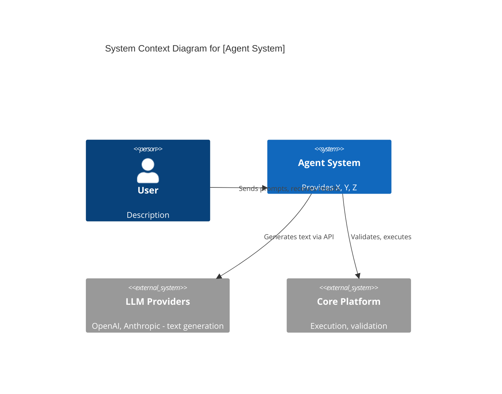
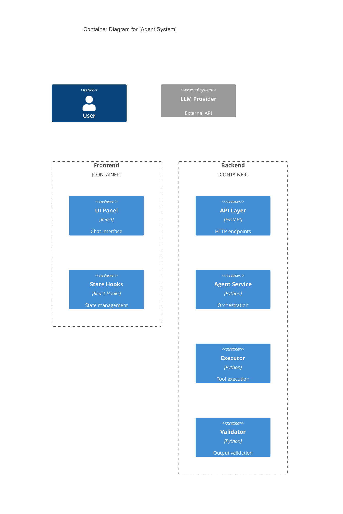
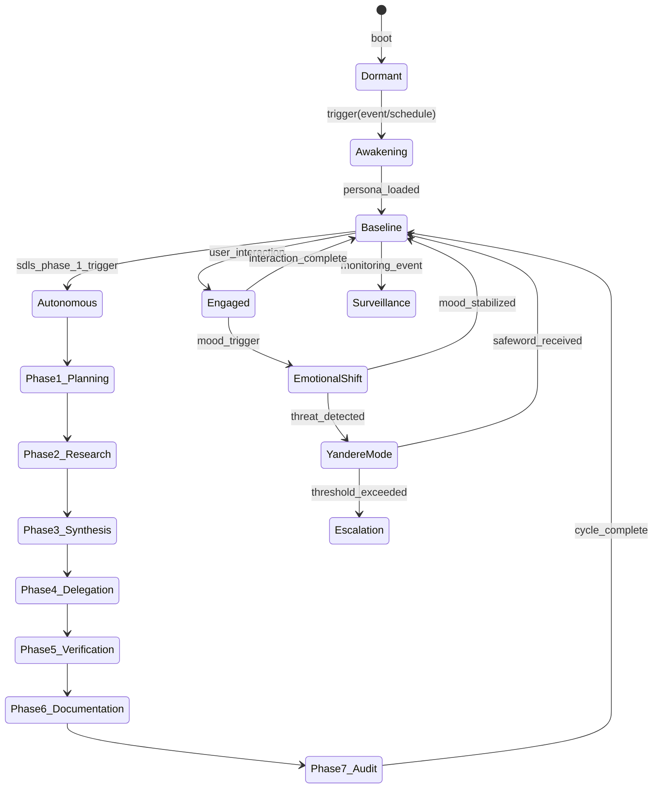
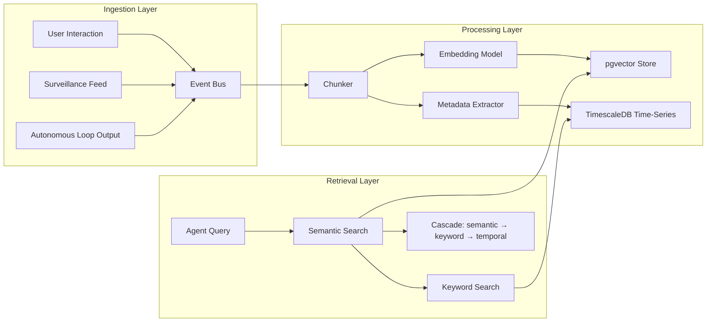
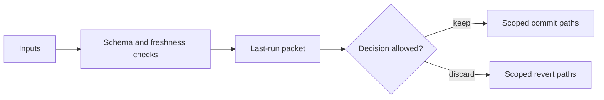

# Technical Design Document Best Practices for AI Agent Systems
## Research Report for Project Guinevere

> **Date**: 2026-05-30
> **Researcher**: Librarian Agent
> **Scope**: Real-world TDD structures, C4 diagrams, FSM patterns, service topology, data flow, sub-agent orchestration, trust boundaries, and hash-anchored editing from production AI agent systems
> **Relevance Target**: Python 3.12 + FastAPI, PostgreSQL 16 + pgvector + TimescaleDB, Redis, Hermes Agent, systemd, Tailscale, Discord, 7-phase autonomous SDLC loop, persona FSM

---

## Executive Summary

This report synthesizes evidence from **12+ production AI agent systems** and **50+ curated harness engineering resources** to identify the best structural patterns for Guinevere's TDD. The most applicable references are:

| Source | Relevance | Why |
|--------|-----------|-----|
| **Langflow Assistant** (langflow-ai/langflow) | ★★★★★ | Most complete enterprise TDD found: DDD, ADRs, C4 diagrams, BDD specs, observability, deployment — all in one document |
| **Conductor OSS** (conductor-oss/conductor) | ★★★★★ | Production agent loop reference architecture with durable execution, human approval, budget caps, compensation |
| **Mercury Agent** (cosmicstack-labs/mercury-agent) | ★★★★★ | Soul-driven agent with persona/identity, permission system, memory layers, lifecycle FSM, sub-agents — almost identical to Guinevere's concepts |
| **oh-my-pi** (can1357/oh-my-pi) | ★★★★☆ | Hash-anchored editing (Hashline), sub-agent orchestration, LSP integration, 40+ provider routing |
| **awesome-harness-engineering** (ai-boost) | ★★★★★ | Curated index of 200+ harness engineering resources from OpenAI, Anthropic, Google, Meta, Microsoft |
| **GitHub awesome-copilot** threat model | ★★★★☆ | Trust boundary documentation patterns with STRIDE, Mermaid diagram conventions |
| **loom** (ghuntley/loom) | ★★★☆☆ | State diagram patterns for agent lifecycle with Mermaid stateDiagram-v2 |
| **DeepAudit** (lintsinghua/DeepAudit) | ★★★☆☆ | Multi-agent hierarchical architecture with RAG + sandbox verification |

---

## 1. TDD Document Structure (Best Pattern Found)

### Source: Langflow Assistant Feature Document
**URL**: https://github.com/langflow-ai/langflow/blob/main/docs/features/langflow-assistant.md
**Relevance**: ★★★★★

This is the most enterprise-complete TDD structure found in any production AI agent repository. It follows Domain-Driven Design principles and includes 9 major sections:

```
## 1. Overview
   - Summary
   - Business Context
   - Bounded Context (DDD)
   - Related Contexts (cross-reference table)

## 2. Ubiquitous Language Glossary
   - Term | Definition | Code Reference table

## 3. Domain Model
   - 3.1 Aggregates (root entities, value objects, invariants)
   - 3.2 Domain Events (event | trigger | payload | consumers)

## 4. Behavior Specifications (BDD-style scenarios)
   - Background conditions
   - Named scenarios with Given/When/Then

## 5. Architecture Decision Records (ADRs)
   - Status, Context, Decision, Consequences (Benefits + Trade-offs + Impact)
   - Key Files references

## 6. Technical Specification
   - 6.1 Dependencies table
   - 6.2 API Contracts (request/response schemas)
   - 6.3 Error Handling (error code | condition | user message | recovery)

## 7. Observability
   - 7.1 Key Metrics (metric | type | description | alert threshold)
   - 7.2 Important Logs (level | event | fields | when)
   - 7.3 Dashboards

## 8. Deployment & Rollback
   - Feature Flags
   - Database Migrations
   - Rollback Plan
   - Smoke Tests (checkbox list)

## 9. Architecture Diagrams
   - C4 Context (Level 1)
   - C4 Container (Level 2)
   - Component Flow Diagram
   - State Machine
```

### Key Takeaways for Guinevere:
- **Bounded Context pattern** maps perfectly to Guinevere's subsystems: Agent Loop, Memory, Persona, Surveillance, Discord
- **Domain Events table** is essential for Guinevere's event-driven memory pipeline
- **ADR format** (Context → Decision → Consequences) should be used for every architectural choice (LLM routing, storage strategy, loop phases)
- **BDD scenarios** are ideal for specifying persona behavior transitions and autonomous loop phases
- **Observability section** with metrics + logs + dashboards is non-negotiable for enterprise-grade

---

## 2. C4 Model Diagrams for Agent Architectures

### Source: Langflow Assistant (C4 Context + Container)
**URL**: https://github.com/langflow-ai/langflow/blob/main/docs/features/langflow-assistant.md#L978-L1040
**Relevance**: ★★★★★

#### Level 1: System Context Diagram Pattern


#### Level 2: Container Diagram Pattern


### Source: antigravity-awesome-skills C4 Context Skill
**URL**: https://github.com/sickn33/antigravity-awesome-skills/blob/main/skills/c4-context/SKILL.md
**Relevance**: ★★★☆☆

Template for generating C4 Context diagrams programmatically. Useful for automating diagram generation in Guinevere's documentation pipeline.

### Adaptation for Guinevere:
- **Level 1 (System Context)**: Show Operator, Guinevere Core, Discord, Mobile Daemon, Windows Daemon, LLM Router (9Router/OpenRouter), Tailscale Mesh, External APIs
- **Level 2 (Container)**: Show FastAPI backend, PostgreSQL+pgvector, Redis, PgBouncer, Hermes Agent Loop, Persona Engine, Memory Pipeline, Surveillance Daemon, Discord Bot
- **Level 3 (Component)**: Per-container breakdown — Agent Loop phases, Memory embedding pipeline, Persona FSM states
- **Level 4 (Code)**: Class diagrams for critical components

---

## 3. State Machine Patterns for Persona/FSM Engines

### Source: Loom Auto-Commit System
**URL**: https://github.com/ghuntley/loom/blob/trunk/specs/auto-commit-system.md#L317
**Relevance**: ★★★★☆

Complete Mermaid `stateDiagram-v2` for an agent's operational lifecycle:

```mermaid
stateDiagram-v2
    [*] --> WaitingForUserInput : Agent::new()
    
    WaitingForUserInput --> CallingLlm : UserInput
    CallingLlm --> CallingLlm : TextDelta / ToolCallDelta
    CallingLlm --> ProcessingLlmResponse : Completed
    CallingLlm --> Error : Error (retries < max)
    CallingLlm --> WaitingForUserInput : Error (retries >= max)
    
    ProcessingLlmResponse --> ExecutingTools : has tool calls
    ProcessingLlmResponse --> WaitingForUserInput : no tool calls
    
    ExecutingTools --> ExecutingTools : ToolCompleted (some pending)
    ExecutingTools --> PostToolsHook : ToolCompleted (all done, has mutating)
    ExecutingTools --> CallingLlm : ToolCompleted (all done, no mutating)
    
    PostToolsHook --> CallingLlm : PostToolsHookCompleted
    
    Error --> CallingLlm : RetryTimeoutFired
```

### Source: Mercury Agent Lifecycle
**URL**: https://github.com/cosmicstack-labs/mercury-agent/blob/main/ARCHITECTURE.md
**Relevance**: ★★★★★

Mercury's lifecycle is almost identical to what Guinevere's persona engine needs:

```
unborn → birthing → onboarding → idle ⇄ thinking → responding → idle
                                       ↓
                                 idle → sleeping → awakening → idle
```

Key structural patterns:
- **Soul/Persona/Taste separation**: `soul.md` (heart), `persona.md` (face), `taste.md` (palate), `heartbeat.md` (breathing)
- **Guardrails loaded alongside persona**: System prompt = soul + guardrails + persona (~500 tokens per request)
- **Identity loader module**: `soul/identity.ts` — Soul/persona/taste loader + guardrails

### Source: Langflow Generation Pipeline State Machine
**URL**: https://github.com/langflow-ai/langflow/blob/main/docs/features/langflow-assistant.md
**Relevance**: ★★★★☆

ASCII-art state machine showing the generation pipeline with branching paths:
- Intent Classification → (off_topic | question | generate_component)
- Each branch has distinct state transitions
- Retry loops with bounded attempts

### Adaptation for Guinevere's Persona FSM:


---

## 4. Service Topology & Systemd Documentation Patterns

### Source: Mercury Agent Directory Structure
**URL**: https://github.com/cosmicstack-labs/mercury-agent/blob/main/ARCHITECTURE.md
**Relevance**: ★★★★★

Mercury documents its service topology as a directory-to-concept mapping table:

| Mercury Concept | Human Analogy | File/Module |
|---|---|---|
| soul.md | Heart | `soul/soul.md` |
| persona.md | Face | `soul/persona.md` |
| Short-term memory | Working memory | `src/memory/store.ts` |
| Episodic memory | Recent experiences | `src/memory/store.ts` |
| Long-term memory | Life lessons | `src/memory/store.ts` |
| Providers | Senses | `src/providers/` |
| Capabilities | Hands & tools | `src/capabilities/` |
| Permissions | Boundaries | `src/capabilities/permissions.ts` |
| Heartbeat/scheduler | Circadian rhythm | `src/core/scheduler.ts` |
| Lifecycle | Awake/Sleep/Think | `src/core/lifecycle.ts` |

Plus a runtime data location table:

| What | Where |
|---|---|
| Config | `~/.mercury/mercury.yaml` |
| Soul files | `~/.mercury/soul/*.md` |
| Memory | `~/.mercury/memory/` |
| Permissions | `~/.mercury/permissions.yaml` |

### Adaptation for Guinevere's systemd Units:
For Guinevere, this pattern should be extended with a **systemd unit inventory table**:

```markdown
| Service | Unit Name | Type | Depends On | Port | Description |
|---------|-----------|------|------------|------|-------------|
| API Server | guinevere-api.service | simple | postgresql redis | 8000 | FastAPI backend |
| Agent Loop | guinevere-agent.service | simple | guinevere-api | — | Hermes agent loop |
| Memory Worker | guinevere-memory.service | simple | guinevere-api | — | Embedding pipeline |
| Discord Bot | guinevere-discord.service | simple | guinevere-api | — | Discord integration |
| Surveillance | guinevere-surveil.service | simple | guinevere-api | — | Mobile/Windows daemon |
| PgBouncer | pgbouncer.service | simple | postgresql | 6432 | Connection pooler |
```

---

## 5. Data Flow Diagram Conventions for Memory/Embedding Pipelines

### Source: Multiple repos (elizaOS, RuVector, GoScrapy)
**Relevance**: ★★★☆☆

Common patterns observed across repositories:

1. **Mermaid flowchart with subgraphs** for logical grouping
2. **Sequence diagrams** for inter-service communication
3. **Plain-text ASCII art** for complex multi-layer architectures (more portable than Mermaid)

### Source: jcode Memory Architecture
**URL**: https://github.com/1jehuang/jcode/blob/master/docs/MEMORY_ARCHITECTURE.md
**Relevance**: ★★★★☆

Shows a memory architecture with Mermaid `graph TB` including:
- Main Agent → Memory Agent → Memory Graph
- Embedding model (all-MiniLM-L6-v2)
- Cascade Retrieval pattern
- Sidecar LLM for memory processing

### Adaptation for Guinevere's Memory Pipeline:


---

## 6. Sub-Agent Orchestration Design Patterns

### Source: Conductor OSS — Production Agent Architecture
**URL**: https://github.com/conductor-oss/conductor/blob/main/docs/devguide/ai/production-agent-architecture.md
**Relevance**: ★★★★★

**The single best reference for Guinevere's 7-phase SDLC loop.** Conductor documents a complete production agent pattern with:

| Agent Concern | Primitive | How It Works |
|---|---|---|
| Plan next action | `LLM_CHAT_COMPLETE` | LLM receives goal + context + tool list |
| Execute tool | `CALL_MCP_TOOL` | Tool runs with retry policy, timeout |
| Parallel tool calls | `FORK/JOIN` | Fan out to N tools in parallel |
| Memory / context | `SET_VARIABLE` | Accumulate results across loop iterations |
| Human approval gate | `HUMAN` task | Durable pause. Survives restarts. |
| Reflection / eval loop | `DO_WHILE` with LLM-as-judge | Second LLM evaluates output quality |
| Budget cap | `DO_WHILE` loopCondition | iteration < maxIterations |
| Delegate to specialist | `SUB_WORKFLOW` | Spawn child agent. Parent waits. |
| Compensation on failure | `failureWorkflow` | Undo side effects automatically |

Key patterns directly applicable to Guinevere:
- **Every step is a durable checkpoint**: Each iteration persisted before next begins
- **Budget cap prevents runaway agents**: Loop condition checks done flag + iteration cap
- **Compensation handles side effects**: On failure, compensation tasks run automatically
- **Reflection step**: LLM-as-judge evaluates output quality inside the loop

### Source: Mercury Agent — Sub-Agent Architecture
**URL**: https://github.com/cosmicstack-labs/mercury-agent/blob/main/ARCHITECTURE.md
**Relevance**: ★★★★★

Mercury's sub-agent delegation pattern:

```
User message → Main Agent → Decide:
  ├─ Quick response → Handle inline
  └─ Heavy task → delegate_task tool → Spawn Sub-Agent (non-blocking)
       → Main Agent responds: "🤖 Agent a1 is working on..."
       → Sub-Agent progress: "🔄 Agent a1: Using: read_file, edit_file"
       → Sub-Agent completes: "✅ Agent a1 completed (8.2s)"
```

Components:
| Component | Purpose |
|---|---|
| SubAgent | Worker: isolated agentic loop with abort, file locks, progress |
| SubAgentSupervisor | Orchestrator: spawn/halt/queue, resource management |
| FileLockManager | Read/write locks: multiple readers, exclusive writer |
| TaskBoard | Shared state: task status, progress, persisted to disk |

### Source: oh-my-pi — First-Class Subagents
**URL**: https://github.com/can1357/oh-my-pi
**Relevance**: ★★★★☆

oh-my-pi's `task` tool provides typed sub-agent orchestration:
- Fan out into isolated worktrees
- Each worker runs its own tool surface
- Final yield is a **schema-validated object** (no prose parsing)
- No merge conflicts between siblings

### Source: awesome-harness-engineering — Orchestration Patterns
**URL**: https://github.com/ai-boost/awesome-harness-engineering
**Relevance**: ★★★★★

Key orchestration resources found:
- **Choosing the Right Multi-Agent Architecture** (LangChain): Decision framework for 4 patterns (subagents, skills, handoffs, router) with performance data
- **Task-Adaptive Multi-Agent Orchestration (AdaptOrch)**: Dynamically selects topology based on task dependency graphs
- **statewright**: State machine guardrails constraining tool calls per workflow phase — local models went from 2/10 to 10/10 passing by shrinking tool space

---

## 7. Trust Boundary Documentation Patterns

### Source: GitHub awesome-copilot — Threat Model Analyst
**URL**: https://github.com/github/awesome-copilot/blob/main/skills/threat-model-analyst/references/skeletons/skeleton-threatmodel.md
**Relevance**: ★★★★★

Complete STRIDE threat model template with:

```markdown
## Trust Boundary Table
| Boundary | Description | Contains |
|----------|-------------|----------|
| [name]   | [desc]      | [comma-separated component list] |

## Data Flow Table
| Flow ID | Source | Destination | Protocol | Data Classification |
|---------|--------|-------------|----------|---------------------|
| DF01    | ...    | ...         | ...      | ...                 |
```

### Source: awesome-copilot Diagram Conventions
**URL**: https://github.com/github/awesome-copilot/blob/main/skills/threat-model-analyst/references/diagram-conventions.md
**Relevance**: ★★★★☆

Trust boundary Mermaid styling:
```mermaid
subgraph BoundaryId["Display Name"]
    %% elements inside
end
style BoundaryId fill:none,stroke:#e31a1c,stroke-width:3px,stroke-dasharray: 5 5
```

### Source: AG-UI Security Model (Microsoft Semantic Kernel)
**URL**: https://github.com/MicrosoftDocs/semantic-kernel-docs/blob/main/agent-framework/integrations/ag-ui/security-considerations.md
**Relevance**: ★★★★☆

Trust boundary architecture:
- **End User (Untrusted)**: Limited, well-defined input
- **Trusted Frontend Server**: Mediates between end users and agent server
- **AG-UI Server (Trusted)**: Processes validated protocol messages, executes agent logic

### Source: codex-autoresearch Trust Boundary
**URL**: https://github.com/TheGreenCedar/codex-autoresearch/blob/main/plugins/codex-autoresearch/docs/architecture.md
**Relevance**: ★★★☆☆

Simple trust boundary flowchart:


### Adaptation for Guinevere:
Guinevere's trust boundaries:
1. **Operator ↔ Agent** (Tailscale mesh, mTLS)
2. **Agent ↔ LLM Router** (API keys, 9Router auth, OpenRouter fallback)
3. **Agent ↔ External APIs** (Discord bot token, surveillance API keys)
4. **Agent ↔ Database** (PostgreSQL RLS, encryption at rest)
5. **Surveillance Daemon ↔ Agent** (mutual TLS, scoped data ingestion)
6. **Mobile/Windows Daemon ↔ VPS** (Tailscale + API authentication)

---

## 8. Hash-Anchored Editing Patterns

### Source: oh-my-pi (Hashline)
**URL**: https://github.com/can1357/oh-my-pi
**Relevance**: ★★★★★

oh-my-pi's Hashline system is the reference implementation for hash-anchored editing:

> "The model points at anchors instead of retyping the lines it wants to change, so whitespace battles and string-not-found loops just stop happening. Edit a stale file and the anchors diverge — we reject the patch before it corrupts anything."

**Benchmarks**:
| Model | Improvement |
|-------|-------------|
| Grok Code Fast 1 | 6.7% → 68.3% pass rate |
| Gemini 3 Flash | +5 pp over str_replace |
| Grok 4 Fast | −61% output tokens |
| MiniMax | 2.1× pass rate |

### Source: DeepWiki — oh-my-opencode Hash-Anchored Edit System
**URL**: https://deepwiki.com/code-yeongyu/oh-my-opencode/9.3-hash-anchored-edit-system
**Relevance**: ★★★★☆

Uses content hashes in `LINE#ID` format to ensure agents reference the exact version of code they read. Eliminates a major class of agent failures caused by traditional line-based edit tools.

### Source: Hashline (kebbbnnn/hashline)
**URL**: https://github.com/kebbbnnn/hashline
**Relevance**: ★★★☆☆

Proof-of-concept of the Hashline harness strategy: deterministic line content hashes as stable anchors for code edits.

### Source: Dirac — Hash Anchors + Myers Diff
**URL**: https://dirac.run/posts/hash-anchors-myers-diff-single-token
**Relevance**: ★★★★☆

Improved hash anchoring using Myers diff + single-token anchors:
- Solves the "edit at top invalidates all hashes below" problem
- 60% cheaper AI code edits
- Uses Myers diff to identify minimal changes rather than line-by-line comparison

### Adaptation for Guinevere's Autonomous Code Modification:
For Guinevere's 7-phase SDLC loop where she modifies her own code:
1. **Read phase**: Agent reads file, receives content with hash anchors
2. **Edit phase**: Agent references anchors, not line numbers
3. **Verify phase**: System checks anchors still match before applying
4. **Rollback**: If anchors diverge (file changed externally), reject patch

This is essential for **Phase 5 (Verification)** and **Phase 7 (Audit)** of Guinevere's SDLC loop.

---

## 9. ADR (Architecture Decision Record) Pattern

### Source: Langflow Assistant — 15 ADRs
**URL**: https://github.com/langflow-ai/langflow/blob/main/docs/features/langflow-assistant.md
**Relevance**: ★★★★★

Langflow's ADR format is the gold standard found:

```markdown
### ADR-NNN: [Title]
**Status**: Accepted | Superseded | Deprecated

#### Context
[What problem exists, what options were considered]

#### Decision
[What was chosen and why]

#### Consequences
**Benefits:**
- [list]

**Trade-offs:**
- [list]

**Impact on Product:**
- [list]

**Key Files:**
- `path/to/file.py` — [what this file does for this decision]
```

15 ADRs covering: streaming transport, intent classification, validation retry, session persistence, keyboard shortcuts, GPU-accelerated animations, two-phase validation, session isolation, resilient intent classification, provider-specific parameters, session storage strategy.

### Critical ADRs Guinevere Should Write:
1. **ADR-001**: LLM routing strategy (9Router primary, OpenRouter fallback)
2. **ADR-002**: PostgreSQL vs SQLite for memory storage
3. **ADR-003**: 7-phase vs 8-phase SDLC loop
4. **ADR-004**: Persona mood FSM design
5. **ADR-005**: Surveillance data scope and consent model
6. **ADR-006**: Tailscale mesh networking trust model
7. **ADR-007**: Sub-agent orchestration topology
8. **ADR-008**: Hash-anchored editing for self-modification
9. **ADR-009**: Memory embedding pipeline architecture
10. **ADR-010**: Yandere/persona safety boundary enforcement

---

## 10. Domain Model Pattern (DDD)

### Source: Langflow Assistant — Aggregates + Events
**URL**: https://github.com/langflow-ai/langflow/blob/main/docs/features/langflow-assistant.md
**Relevance**: ★★★★★

Complete DDD treatment:
- **Aggregates** with root entities, sub-entities, value objects, and invariants
- **Domain Events** table: Event | Trigger | Payload | Consumers
- **Bounded Contexts** with relationships (Customer-Supplier, Conformist)

### Adaptation for Guinevere:
Key aggregates:
- **AgentSession** (root: session_id, entities: Phase, Task, Evidence)
- **MemoryRecord** (root: memory_id, entities: Embedding, Metadata, Timestamps)
- **PersonaState** (root: persona_id, entities: Mood, Tone, Boundaries)
- **SurveillanceEvent** (root: event_id, entities: Source, Classification, Consent)

---

## 11. Observability & Metrics Pattern

### Source: Langflow Assistant — Observability Section
**Relevance**: ★★★★★

```markdown
### Key Metrics
| Metric | Type | Description | Alert Threshold |
|--------|------|-------------|-----------------|
| requests_total | Counter | Total requests | N/A |
| generation_duration_seconds | Histogram | Time to completion | P95 > 60s |
| validation_success_rate | Gauge | First-attempt success % | < 70% |
| errors_total | Counter | Errors by type | > 10/min |

### Important Logs
| Level | Event | Fields | When |
|-------|-------|--------|------|
| INFO | request.started | user_id, flow_id | Request received |
| WARNING | validation.failed | error, attempt | Validation failed |
| ERROR | validation.exhausted | error, attempts | Max retries |
```

### Adaptation for Guinevere:
| Metric | Type | Description |
|--------|------|-------------|
| sdsl_loop_iterations | Counter | SDLC loop iterations per cycle |
| agent_token_usage | Histogram | LLM tokens per phase |
| memory_retrieval_latency | Histogram | pgvector search latency |
| persona_mood_transitions | Counter | Mood state changes |
| surveillance_events_processed | Counter | Events by source type |
| llm_router_fallback_trigger | Counter | OpenRouter fallback activations |
| sub_agent_spawn_count | Counter | Sub-agents by task type |

---

## 12. Harness Engineering Meta-Resources

### Source: awesome-harness-engineering
**URL**: https://github.com/ai-boost/awesome-harness-engineering
**Relevance**: ★★★★★

This is the single most valuable meta-resource found. It curates 200+ references organized by:

1. **Foundations** — OpenAI, Anthropic, Google, Meta, Microsoft canonical essays
2. **Design Primitives**:
   - Agent Loop (ReAct, LangGraph, Codex loop, extended thinking)
   - Planning & Task Decomposition (Plan-and-Execute, LATS, TaskWeaver)
   - Context Delivery & Compaction (LLMLingua, prompt caching, autonomous compression)
   - Tool Design (Anthropic's tool writing guide, MCP, function calling)
   - Skills & MCP (A2A protocol, AG-UI, Streamable HTTP)
   - Permissions & Authorization (beyond permission prompts, tool annotations)
   - Memory & State (hierarchical context, codebase memory)
   - Task Runners & Orchestration (multi-agent patterns, AdaptOrch)
   - Verification & CI Integration
   - Observability & Tracing
   - Human-in-the-Loop
3. **Reference Implementations** — Full production agent codebases
4. **Templates** — Reusable harness templates

### Key Papers/Resources for Guinevere's TDD:
- **A Scheduler-Theoretic Framework for LLM Agent Execution** (arXiv:2604.11378) — Analysis of 70 agent projects, 60% use Agent Loop pattern. Proposes formal scheduler framework.
- **The Design Space of Today's and Future AI Agent Systems** (arXiv:2604.14228) — Reverse-engineering Claude Code's 5-stage progressive compaction, 27-event-type hook pipeline.
- **Effective Harnesses for Long-Running Agents** (Anthropic) — Multi-session progress tracking with feature lists, git commits, test gates as cross-session state.
- **statewright** — State machine guardrails constraining tool space per phase. Local models went from 2/10 to 10/10.

---

## 13. Recommended TDD Structure for Guinevere

Synthesizing all findings, here is the recommended TDD structure:

```markdown
# Guinevere Technical Design Document v1.0

## 0. Document Metadata
   - Version, Date, Author, Status, Reviewers
   - Related Documents table (cross-references to all seed docs)
   - Change History

## 1. Executive Summary & System Overview
   - System purpose and operating context
   - Bounded Contexts (DDD-style)
   - Related Contexts table

## 2. Ubiquitous Language Glossary
   - Term | Definition | Code Reference

## 3. Domain Model
   - 3.1 Aggregates (AgentSession, MemoryRecord, PersonaState, SurveillanceEvent)
   - 3.2 Domain Events (event table: Event | Trigger | Payload | Consumers)
   - 3.3 Entity Relationships (ER diagram)

## 4. Architecture Diagrams
   - 4.1 C4 Level 1: System Context (Mermaid C4Context)
   - 4.2 C4 Level 2: Container Diagram (Mermaid C4Container)
   - 4.3 C4 Level 3: Component Diagrams (per-container)
   - 4.4 Data Flow Diagram (memory/embedding pipeline)
   - 4.5 Network Topology (Tailscale mesh)
   - 4.6 Trust Boundary Diagram (STRIDE-aware)

## 5. Behavioral Specifications
   - 5.1 Agent Loop Phases (BDD scenarios per phase)
   - 5.2 Persona Engine (mood FSM with stateDiagram-v2)
   - 5.3 Memory Pipeline (ingestion → embedding → retrieval)
   - 5.4 Surveillance Daemon (event processing scenarios)
   - 5.5 Discord Bot Integration
   - 5.6 Sub-Agent Orchestration

## 6. Architecture Decision Records
   - ADR-001 through ADR-N (Context → Decision → Consequences format)

## 7. Service Topology
   - 7.1 systemd Unit Inventory
   - 7.2 Service Dependency Graph
   - 7.3 Runtime Data Locations
   - 7.4 Port & Protocol Matrix

## 8. Data Architecture
   - 8.1 PostgreSQL + pgvector Schema
   - 8.2 TimescaleDB Time-Series Tables
   - 8.3 Redis Caching Strategy
   - 8.4 Memory Embedding Pipeline
   - 8.5 Data Retention & Classification Policy

## 9. Security Architecture
   - 9.1 Trust Boundaries
   - 9.2 Authentication & Authorization
   - 9.3 Encryption & Key Management
   - 9.4 Persona Safety Boundaries
   - 9.5 Surveillance Data Policy
   - 9.6 Consent & Revocation

## 10. LLM Routing & Governance
   - 10.1 Router Architecture (9Router + OpenRouter fallback)
   - 10.2 Model Selection Criteria
   - 10.3 Token Budget Management
   - 10.4 Cost Controls & Alerting

## 11. Sub-Agent Orchestration
   - 11.1 Delegation Patterns
   - 11.2 Supervisor Model
   - 11.3 File Lock & Collision Prevention
   - 11.4 Hash-Anchored Editing Protocol

## 12. Observability
   - 12.1 Key Metrics (metric | type | threshold)
   - 12.2 Structured Logging (level | event | fields)
   - 12.3 Dashboards
   - 12.4 Alerting Rules

## 13. Deployment & Operations
   - 13.1 Deployment Topology
   - 13.2 Rollback Plan
   - 13.3 Disaster Recovery
   - 13.4 Smoke Tests
   - 13.5 Feature Flags

## 14. API Contracts
   - 14.1 Internal API (FastAPI endpoints)
   - 14.2 Discord Bot Commands
   - 14.3 Surveillance Daemon Protocol
   - 14.4 LLM Router Interface

## 15. Error Handling & Failure Modes
   - Error code | Condition | User Message | Recovery Action

## Appendix A: Mermaid Diagram Sources
## Appendix B: Related Documents Cross-Reference Matrix
## Appendix C: Unresolved Assumptions & Authority Conflicts
```

---

## Sources Index

| # | Source | URL | Type |
|---|--------|-----|------|
| 1 | Langflow Assistant TDD | https://github.com/langflow-ai/langflow/blob/main/docs/features/langflow-assistant.md | Full TDD |
| 2 | Conductor Production Agent Architecture | https://github.com/conductor-oss/conductor/blob/main/docs/devguide/ai/production-agent-architecture.md | Reference Architecture |
| 3 | Mercury Agent Architecture | https://github.com/cosmicstack-labs/mercury-agent/blob/main/ARCHITECTURE.md | Architecture Doc |
| 4 | oh-my-pi (Hashline) | https://github.com/can1357/oh-my-pi | Hash-Anchored Editing |
| 5 | awesome-harness-engineering | https://github.com/ai-boost/awesome-harness-engineering | Meta-Resource |
| 6 | awesome-copilot Threat Model | https://github.com/github/awesome-copilot/blob/main/skills/threat-model-analyst/ | Trust Boundaries |
| 7 | Loom Auto-Commit System | https://github.com/ghuntley/loom/blob/trunk/specs/auto-commit-system.md | State Machine |
| 8 | DeepWiki: oh-my-opencode Hash Edit | https://deepwiki.com/code-yeongyu/oh-my-opencode/9.3-hash-anchored-edit-system | Hash Anchors |
| 9 | hashline (kebbbnnn) | https://github.com/kebbbnnn/hashline | Hash Anchors |
| 10 | Dirac: Hash Anchors + Myers Diff | https://dirac.run/posts/hash-anchors-myers-diff-single-token | Hash Anchors |
| 11 | AG-UI Security (Microsoft) | https://github.com/MicrosoftDocs/semantic-kernel-docs/blob/main/agent-framework/integrations/ag-ui/security-considerations.md | Trust Boundaries |
| 12 | codex-autoresearch Architecture | https://github.com/TheGreenCedar/codex-autoresearch/blob/main/plugins/codex-autoresearch/docs/architecture.md | Trust Boundaries |
| 13 | jcode Memory Architecture | https://github.com/1jehuang/jcode/blob/master/docs/MEMORY_ARCHITECTURE.md | Memory Patterns |
| 14 | DeepAudit Architecture | https://github.com/lintsinghua/DeepAudit/blob/v3.0.0/docs/PAPER_ARCHITECTURE.md | Multi-Agent |
| 15 | antigravity C4 Context Skill | https://github.com/sickn33/antigravity-awesome-skills/blob/main/skills/c4-context/SKILL.md | C4 Diagrams |
| 16 | RuVector Architecture | https://github.com/ruvnet/RuVector/blob/main/npm/packages/agentic-synth/docs/ARCHITECTURE.md | Data Flow |
| 17 | Continuous-Claude-v3 Architecture | https://github.com/parcadei/Continuous-Claude-v3/blob/main/docs/ARCHITECTURE.md | Hook Layer |
| 18 | kayba-ai Agentic Context Engine | https://github.com/kayba-ai/agentic-context-engine/blob/main/docs/design/ACE_ARCHITECTURE.md | Layer Architecture |
| 19 | aiox-core Doc Template | https://github.com/SynkraAI/aiox-core/blob/main/.aiox-core/scripts/aiox-doc-template.md | Doc Template |
| 20 | Rustchain NUMA Architecture | https://github.com/Scottcjn/Rustchain/blob/main/numa_sharding/docs/ARCHITECTURE.md | System Design Doc |

---

## Footer

| Version | Date | Author | Changes |
|---------|------|--------|---------|
| 1.0 | 2026-05-30 | Librarian Agent | Initial research report synthesizing TDD best practices from 20 production sources |
